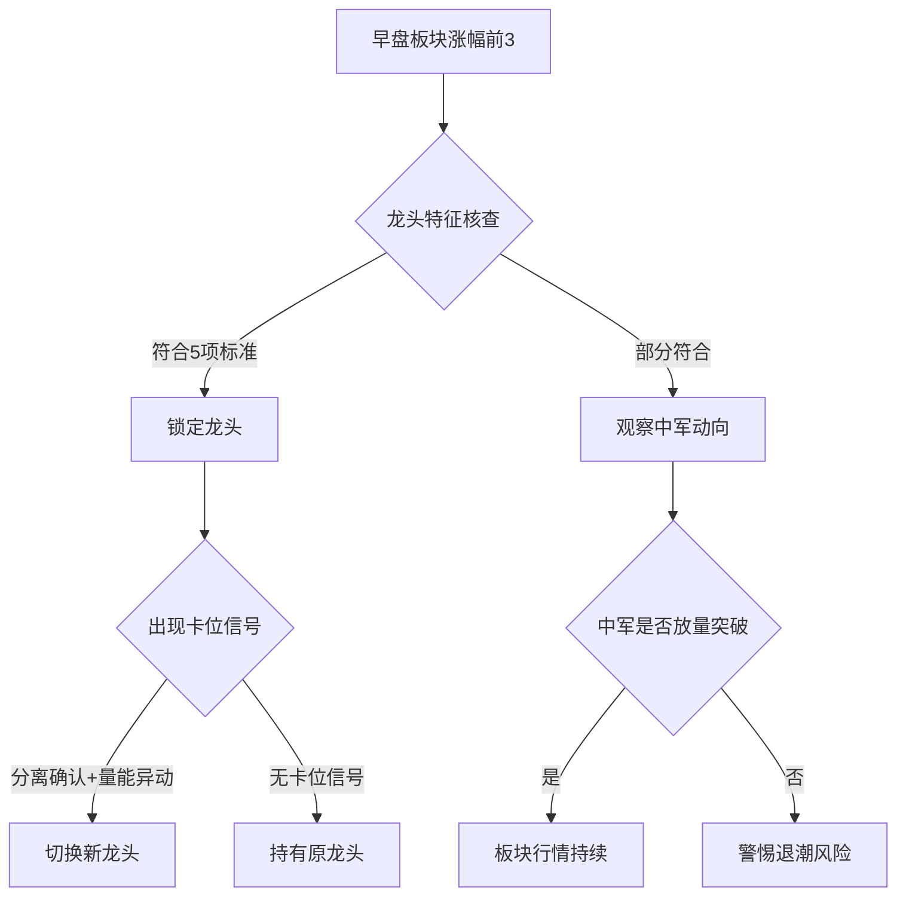

::: tip
如何判断板块龙头，板块中军？何为卡位？盘中如何判断？
:::

>好的，用户现在想知道如何判断板块龙头、板块中军，以及什么是卡位，盘中如何判断。我需要先理清这些概念，然后给出具体的判断方法。
>
>首先，板块龙头通常指的是在某个行业或概念板块中，具有最强市场号召力和资金关注的个股。它往往在板块行情启动时率先涨停，涨幅最大，带动整个板块上涨。而板块中军则是板块内市值较大、流动性好的股票，通常是机构资金的主要战场，走势相对稳健，起到稳定军心的作用。卡位则是指当原龙头股走弱时，其他个股迅速崛起取代其位置的现象。
>
>用户可能是在学习短线交易或者想提升自己的选股能力，需要明确的指标和方法来识别这些角色。我需要从盘中实时判断的角度出发，给出具体的观察点和技巧。
>
>接下来，要考虑用户的实际操作需求。比如，他们可能想知道如何通过分时图、成交量、封单情况等实时数据来判断龙头和中军，以及如何观察卡位的发生。此外，用户可能对市场情绪和板块轮动不太熟悉，需要解释这些概念如何影响龙头和卡位的判断。
>
>需要确保回答结构清晰，分点列出判断标准，并举例说明。同时，注意使用用户可能熟悉的术语，如换手率、封板时间、市值规模等，但也要避免过于专业的术语，保持易懂。
>
>可能还需要提醒用户注意的风险点，比如龙头股的波动性较大，卡位可能失败导致亏损等。这样用户在实际操作中能够更加谨慎。
>
>总结下来，回答应包括以下几点：
>
>1. 板块龙头的定义和判断标准
>
>2. 板块中军的定义和判断标准
>
>3. 卡位的定义和盘中判断方法
>
>4. 实际案例分析
>
>5. 注意事项和风险提示
>
>在解释过程中，结合具体例子会更有助于理解，比如用近期市场的例子说明龙头和中军的特征，以及卡位的发生过程。同时，强调实时数据的重要性，如分时走势、量能变化、资金流向等。
>
>最后，确保回答逻辑清晰，层次分明，让用户能够逐步理解和应用这些判断方法。

以下是判断板块龙头、板块中军及卡位现象的实战指南（附盘中动态识别技巧）：

### 一、板块龙头识别标准（5大核心特征）

1. **启动时间轴**
   - 板块行情第一只涨停（如2023-09-05华为卫星通信的华力创通）
   - 早盘封板时间≤10:30（排除尾盘偷板）

2. **资金强度**
   - 首板成交额1-5亿（兼具弹性与容量）
   - 封单金额/流通市值＞1%（如3亿封单对应30亿流通盘）

3. **市场地位**
   - 连续3日涨幅居板块前3
   - 分时抗跌性（板块调整时横盘或微跌）

4. **筹码结构**
   - 突破关键套牢区（如年线/平台高点）
   - 首板日换手率5-15%（非庄股控盘）

5. **消息驱动**
   - 与板块核心逻辑高度契合（如CPO龙头剑桥科技绑定800G光模块）

（图示：龙头股典型分时——早盘快速拉升+高位横盘换手）

### 二、板块中军识别要点（机构资金战场）

1. **市值规模**
   - 流通市值＞100亿（如2023年AI行情中的中科曙光）

2. **成交金额**
   - 日成交额＞20亿（维持板块流动性中枢）

3. **走势特征**
   - 日K线沿5日线稳步上行
   - 单日振幅＜8%（区别于短线龙头）

4. **资金结构**
   - 龙虎榜机构净买入＞1亿
   - 北向资金持仓占比＞3%

5. **行业地位**
   - 细分领域市占率TOP3（如光伏中军隆基绿能）

### 三、卡位现象解析与盘中识别

#### 1. 卡位类型

| 类型         | 触发条件                    | 典型案例                 |
|--------------|-----------------------------|--------------------------|
| 日内卡位     | 原龙头炸板时逆势回封        | 2023-08-23 启迪环境卡位正和生态 |
| 周期卡位     | 旧题材退潮时新龙头崛起      | 2023-05-15 剑桥科技卡位寒武纪  |
| 梯队卡位     | 同身位竞争中胜出            | 2023-07-12 浙江世宝卡位江铃汽车 |

#### 2. 盘中识别技巧（3大信号）

- **信号1：分离确认点**  
  当板块分歧时，观察候选股能否在关键价位（如5日线/分时均线）率先翻红  
  *案例：2023-09-07 捷荣技术10:26逆板块翻红确立卡位*

- **信号2：量能异动**  
  卡位股在板块跳水时出现连续万手买单（L2逐笔委托监测）  
  *案例：2023-06-19 中马传动13:14出现23笔5000手以上买单*

- **信号3：情绪逆转**  
  卡位股涨停后带动板块跌幅收窄＞2%  
  *数据监测：同花顺板块涨跌家数对比曲线*

### 四、实战决策流程图



### 五、风险控制要点

1. **龙头陨落信号**  
   - 收盘跌破5日线且3日内未收回  
   - 单日换手率＞40%（如2023-04-18中国科传见顶）

2. **中军预警指标**  
   - 连续3日跑输板块指数  
   - 机构席位净卖出＞2亿（如2023-07-11中际旭创机构出货）

3. **卡位失败特征**  
   - 卡位股封板后板块跟风股跳水  
   - 卡位股涨停次日溢价＜3%

### 六、数据验证工具包

1. **龙头识别系统**  
   - 同花顺问财：输入"板块内第一个涨停+流通市值<50亿+非ST"  
   - 开盘啦APP：查看"连板天梯"排名

2. **中军监控指标**  
   - 东方财富资金流：筛选"板块内资金净流入TOP1且市值>100亿"  
   - 大智慧机构持仓：跟踪"近5日机构加仓比例"

3. **卡位预警模型**  
   - 自编指标公式（以通达信为例）：  

``` txt
 CARDETECT:=IF(CLOSE/REF(CLOSE,1)>1.095 AND CAPITAL/10000<50 AND VOL/REF(VOL,1)>2,1,0);
```

   - 预警设置：分时突破昨日高点+量比＞3

掌握上述方法后，建议用3个月时间跟踪验证100组案例，逐步建立盘感。最终目标：在龙头启动首板时识别成功率＞70%，卡位信号判断准确率＞65%。
