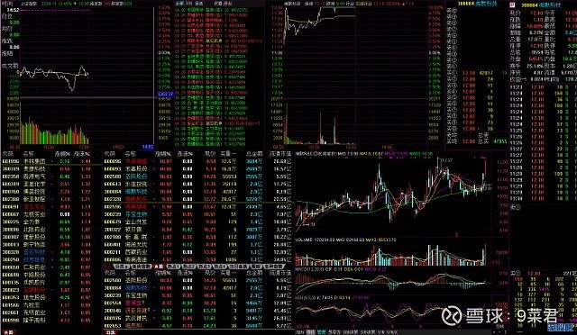

## 第一节：短线看盘的三大原则  

　　经常有人问我：老师，你是怎么在9.25就看出盘面今天有风险的？为什么你上午9.50的时候，就能看出今天可以重仓出手了？为什么我打板总是比人慢一步？为什么我看盘的时候总是很紧张?  

　　可以说以上这些都看盘能力不足才有的疑问。看盘是获取盘面信息最重要最直接的手段，盘面解读能力是短线选手必须具备的一项重要技能。  

　　很多人觉得看盘是一件很枯燥很无聊的活，但**对于会看盘的人来说，每天看盘都和看了一场电影一样**。盘面里有主角有配角。剧情有跌宕起伏，有起承转合，有神奇逆转。有时更像两军交战，一招一式都是有章法的。有的人看盘，总是很紧张，即怕错过机会，又怕大跌随时来临。盘面的异动变化，总在其心中变成欲望在翻江倒海，有的人云淡风轻，一副敌军围困万千重，我自岿然不动的架势。  

　　很多年前我去听一个做投资的前辈丁圣元的讲座，他展示了一个东西，叫色盲板，看到这个花花绿绿的东西开始很难看清楚里面的图案是什么，正常人呢3-5秒后都能看出里面是一头牛，但如果你是色盲，你却怎么也看不出来的。  

　　市场就像一个红红绿绿的色盲板，懂的规律的人，会看盘的人，知道里面的波动非常有规律，也看得到机会和风险。但是不知道怎么看的人呢？市场就是一片混沌，就像色盲一样，自然也看不出市场里面的牛。  

　　短线选手看盘，到底看什么？怎么读懂盘面释放的风险和机会？有哪些技巧？应该以什么样心态看盘才是合适的？怎样才能做到这些呢？  

　　今天，我就为你解决这些问题。  

　　首先，给你重点介绍一下我的**看盘三原则：识大局 看联动 抓重点**  

　　**识大局**：开车时新手只会盯住方向盘，老司机却总能眼观六路，耳听八方。看盘如同开车，新手经常只盯住自己手中的股票变化，而老手，却总能把握全局，能多角度的收集盘面信息。  

　　这个识大局指的是看盘不要仅仅只盯着自己持仓或者将要买入的股票。**要将眼光放在大盘的整体氛围和板块上，比如领涨板块、领跌板块，总体上涨下跌的股票的数量对比等，这样才能更好的理解个股的走势**。就像我们要理解一个人，将其置身于家庭，民族，国家，历史等大背景下，就会更加透彻。  

　　不但要看盘面，看我们的方法论计划书，还要观照我们内心情绪的变化。没有经过学习训练的股民，看盘一般只看自己持仓的股票变化和大盘指数的变化。从不看板块和整体市场氛围的变化情况。只看盘面的变化，不看自己内在的情绪变化。这也是没有大局观的表现。  

　　以上是从空间上说的，从时间上来说，我们脑子了不仅仅只看当下盘面的变化，还有与过去三天的盘面数据进行比较，更重要的是要推演后面一天行情的演化路径。

　　**看联动**：指的是**股票与股票之间会相互影响，一只股票涨跌会影响另外一只或多只股票涨跌，同样板块与板块、题材与题材之间都会有联动或跷跷板的情况**。注意这种关系是我们理解市场的关键之一。比如，一只个股上涨，同时带动相关个股上涨，这只个股有可能就是**龙头**。如果一个板块持续几天，龙头个股涨停，但没有带动相关板块的个股上涨，跟风盘弱，大部分情况这波行情就基本到尾声了。**看股票之间的联动，板块之间的联动，这是对股市三大规律之一的能量传递定律的具体运用**。运用这个定律，可以让我们提前预判到自己持有股票的走向。  

　　一般股民，从不去考虑股票之间的这种联动的关系，他们只关注自己已经买入或将要买入股票的表现，自然看盘能力，什么盘感就无从谈起了。  

　　**抓重点**：是**指每一个时期总有一个主流板块，各板块都有龙头股，每个时期市场总有一个人气总龙头**，还有大跌时用来护盘的大盘股，还有一些连板妖股，这些股票在关键时刻影响整个大盘的走势，起到阵眼的作用，是我们看盘时需要重点关注的。还有一个重点，就是赚钱效应和亏钱效应的变化。市场有3000多只股票，如果眉毛胡子一把抓，心中一团乱麻，不但累，还没什么效果。我们只需关注关注重点的板块，重点的个股，以及反应市场氛围的数据变化就可以把控全局了。  

　　如果能把握上面的三大原则，看盘就像看电视剧一样轻松有趣。但我们如果准备不充分的话，还是会有很多的麻烦。这就像即使一个老司机去新地方，也要设计好路线图，备足准备工具，检查车子有无问题等等。  

　　对于看盘也一样。况且看盘还有有两大任务：  

　　**第一个任务，根据盘面变化，确认市场变化是否符合交易计划中的情况，同时实施交易计划**。  

　　**第二个任务，第一时间发现风险和机会**。  

　　对于短线来说，盘面的信息是非常关键的，远远比场外信息重要。通常盘面上的机会和风险也会第一时间反映出来。就像利弗莫尔说的，通过盘面我们可以得到我们想要的一切内幕消息。  

　　为了很好的完成这两大看盘任务，一般来说，我们在看盘前有三大准备工作要做。  

　　具体的内容将在下一节阐述。  

## 第二节：看盘的三大准备工作  

　　为了很好的完成这两大看盘任务，一般来说，我们在看盘前有三大准备工作要做。  

### 第一、制定交易计划  

　　在我们这里就是根据**龙头战法，股性战法，公告战法，加速板战法，低吸战法**等战法的具体规则来制定交易计划了。就这样说吧，没有自己的战法是制定不出完整的交易计划的。即使你制定出来了，也保证不了前后逻辑上的一致性。这里，说明下，有些选手没有计划，但交易都是根据自己的系统来的处理，这种对自律的要求更高，建议你初期还是以计划为主。  

　　我们需要注意的是不论是单用一种战法或多种战法并有，都应包括仓位、备选的股票、进场条件、出场条件等这几个方面的内容。  

　　首先对于仓位的安排不仅仅要考虑到大盘个股的风险回报比，还要考虑当前资金所能承受的风险进行合理安排。比如当前资金回撤已经超过15%，你就要想想有没有必要在仓位上进行调整，防止回撤超过自己的承受能力。  

　　其次对于备选的股票： 一般分为盘前计划好的和盘中临时选的。若是盘中临时选的，则必须遵循对应战法的选股标准。  

　　再就是进场条件： 这个需要详细一些，否则会给执行带来麻烦。比如：只有涨停才能进场，且当时总体市场涨跌比超过1：1.等。  

　　最后就是出场条件： 出场一般来说，比较难。但也要考虑各自的情况。无非是预期出场法，看板块，看大盘，看个股本身等情况出场。如果是止损出场，建议设定一个时间或价位来进行出场。与其按江湖术士所说的按逻辑出场，我更希望你按系统出场，按纪律出场，按计划出场。  

　　以上就是一个完整交易计划应该包含的部分。  

　　下面我们来看一个例子，这是我一个学生5月12日交易计划，作为样本我给你念下：  

　　首先根据复盘得到以下信息：  

　　次新股和雄安有两个板块出现了板块效应，根据龙头战法这两个板块次新股最近几天每天都有3只以上涨停，但持续性不好。从盘面上看雄安板块是11日反转的关键板块，重要性要大于次新。  

　　然后确定仓位： 最大不超4成 ，重点关注的股票有： 博深工具 创业环保 恒润股份。重点关注的指标有：昨日涨停股的表现，前一日这个指标非常差，再就是次新股和雄安两个板块的涨停股的表现情况。  

　　如果市场人气、涨停股的表现、板块效应三个要素都不错的话，可以做首选热门板块中股性较佳的股票，如果不是，则关注其他股性较佳的股。  

　　进场方式为：追涨停板进场  

　　出场方式为：进场之后，若板块走弱，出现亏损则出场。  

　　总结下，这个交易计划就包含了选股，进场条件，仓位，出场条件等情况，基本算一个完整的交易计划了。  

　　说完了交易计划的制定,我们来看盘前的第二个准备工作：沙盘推演。  

### 第二、沙盘推演  

　　沙盘推演的目的是： 防止交易计划中的漏洞和风险。让自己的心理模式处在交易的正常状态中，远离颠倒幻想。包括内容主要是自己平时在交易中经常犯的错误。进行了这样的推演后，让自己能接受各种盘面变化，从而保持内心的平静，更好的执行交易计划。  

　　在这里我们来做一个演练：  

　　情景一： 如果雄安板块出现跌幅超过5%的股票，我就应该暂缓进场，如果板块中前一日涨停的股票有一半以上出现绿盘，我就要放弃进场。  

　　情景二： 如果调整之后，盘中出现新的板块集体上攻，并且大盘整体涨跌比达到持平状态，可以进攻龙头股。  

　　情景三：如果在盘中在出现板块效应，我就可以做活跃股的涨停板。  

　　情景四： 想象自己，准备随时放弃交易计划，随时执行计划，关键在于计划中的条件是否出现。如果次新和雄安板块没有触发进场条件，则说明市场持续性非常弱，剩下的灵活仓位也要下降到1成。如果因为注意力或速度没有进场到，可以将预留给龙头的仓位分配到股性战法的活跃股中。  

　　情景五：不能因为盘面的变化，冲动性放大仓位。想象自己多少次因为仓位的问题而大幅回撤。当然如果出现交易计划中的条件，也要心中没有恐惧和挂碍的执行。想象自己多少次因为恐惧而导致错失良机。  

　　情景六：行情如果继续走弱，各种战法进场条件都没有机会，则选择放弃，空仓等待。想象过去自己多少次因为强行交易而亏损累累。  

　　总结下：**这个演练包含了自己容易犯错的环节提醒自己注意，这个地方是在要越详细越好**，比如你胡乱放大仓位，一定要有具体的细节，你上次这个错误给自己带来了怎么样的结果，是怎么犯的。  

### 第三、看盘界面的调整与设置  

  

　　因为我是四个显示器看盘的，所以对大家不一定有参考性。  

　　在这里介绍一个某游资曾经使用过的看盘界面设置，很有代表性，我给大家理理。  

　　界面1：短线精灵  

　　界面2：大盘指数  

　　界面3：最近的热点板块  

　　界面4：整个A股涨幅榜和涨速榜两个指标  

　　界面5：自选股  

　　界面6：随时查看自己要看的个股的分时图、K线图。基本上这些囊括了我们短线重点关注的点了。  

　　除了界面的设置我们还需要做什么呢?  

　　第一：将前日涨停的股票放进自选板块中  

　　第二：将今日的活跃板块放进自定板块中  

　　第三：当天需要重点关注有可能买入的股票放进股票池里  

　　第四：将各个时期的龙头股放在一个自定板块中  

## 第三节：看盘的六大技巧  

　　其实，复盘和看盘的主要内容有60%是重合的。比如要看连板个股，涨停数量，赚钱效应，主流板块的持续性等。如果看盘做到位了，复盘的时间可以省一半。  

　　前面我们说看盘要有大局观，这里再强调一下，很多人过分注重分时图的走势，封单量，有没有大单之类的细节，不是说这些一点用没有，但起码这不是市场和交易的本质。这就像当年蒋介石作为三军统帅，还花很多时间去过问某一个师部的行军阵形，士兵走路军姿好不好等，岂有不败之理?  

### 非常有效的短线看盘技巧**  

　　**首先来说说怎么看集合竞价**?  

　　可以这样说9.20-9.30这个时间段是我重要的时刻。我会重点梳理以下五大要点：看昨天的主流板块，今天的开盘情况，有没有继续强势的可能。开盘是否超预期，如果有可出击龙头。  

　　举例：以2017年7月10日为例吧，前一天的强势板块次新股13家涨停，资源类12家涨停。我会把这些分别放进一个自定义板块中，集合进价的时候，就观察这两个板块的强弱。 9.25的时候，次新龙头低开平开占据有多达7只，但是资源类就不一样了，方大炭素，五矿稀土，正海磁材都是大幅高开，且无一股低开。那么由此确定:当天应该舍弃次新，关注资源，当然能不能买还要取决其他条件。  

　　看昨天涨停个股的高开情况，相比昨天数据变好或变坏的程度怎么样?这个是决定我早盘要不要出手的条件之一。  

　　再以2017年7月10日为例，前一天涨停股在9.25的时候，有4成是绿盘的。对这一指标，我是这么看的，就是有4成昨天涨停买入股票的人都是亏钱的，也就是打板的正确率是小于40%的，因为还有破板的情况。这时候我就会小心。一般这个正确率达到75%-95%的时候，我才会大仓位进场。这保证我永远站在大概率的一边。  

　　涨幅板前列的股票有哪些?是什么原因?这个主要是看看有没有好的票可以做?  

　　涨幅榜上的股票，如果我都看不懂，说明功课做的不到位，需要利用开盘前5分钟查看相关消息面。这个主要是看那一类股票在涨幅榜前列，让我清晰的知道当天哪些股票在受资金的青睐。  

　　跌幅榜上超过5%的股票较前一日是减少还是增加。主要是亏钱效应有没有减少。除了未开板的次新股之外，以涨停开盘的个股有多少? 这个也反应了市场的一些氛围。通过这5个指标，我基本可以判断市场的机会和风险在那里。  

　　这里举几个我实盘中的例子吧：  

　　其中一个案例就是在今年的5月4号，当天在集合竞价阶段发现并捕捉到了韩建河山和八一钢铁。韩建河山是超预期，前一日涨停后尾盘打开了，但在5月4号竟然高开了7%，于是我看了下雄安板块整体的表现。 决定如果涨停就干他。八一钢铁，直接以接近涨停开盘，只有最后一档卖盘，我就直接进了，因为在前一天我做了功课，新疆板块，一带一路都是今年的热点。今天出现盘口加速，是进场的良机。  

　　另外一个案例是7月11日，开盘市场比较弱，但依然有高开的股票，迅速把高开的股票浏览了一遍，锁定了祁连山，主要是业绩扭亏，加上水泥股最近一年出了很多牛股。开盘后快速冲击涨停，就跟进了。  

　　以上这些都是通过集合竞价发现的机会，当然也会发现风险，比如7月7日周五次新股很强，有13家涨停，但7月10日，出现了超过一半的股票低开，我就果断放弃了接力次新龙头的计划。随后次新持续下跌。  

### 看盘的六大关键内容及其原理  

　　**1、连板个股与妖股的意义及原理**  

　　我来考考你，我们打板进场，第二天最多盈利有多少呢，对，10%。可以说涨停板战法代表市场最先进的资金，连板股的数量，直接代表了最近一天市场给打板这种方法的最高奖励了。这就会吸引更多的短线资金加入打板。当市场连续多天没有连扳个股，突然某一段时间出了连续涨停的个股，这个时候短线客的风险就小了许多。对强势个股出击胜率就很大。  

　　**2、全市场个股涨跌比的意义**  

　　所有的高手，高明之处啊，就是永远不和趋势为敌。  

　　去一个成功者最多的行业，你获得成功就大。比如过去10年互联网，房地产。 做短线也是这样，当大部分人赚钱的时候，我们去做，赚钱的概率就大。高手不是在行情差的时候比你会赚钱，而是在你能赚钱的时候，他赚的比你多的多。  

　　全市场3000多只股票，如果有60-70%的股票在上涨，我们就有了一个很不错的环境了。我会怎么用这个数据呢?如果市场某段时间，涨的股票一直少于跌的股票，突然出现了涨多余跌的股票，这个时候，进场做多，风险也非常小。正确率也有保障。即使在一天内，如果市场没有强势板块，我也会等市场的人气恢复到平衡状态，就是涨跌比持平，才会去挑选符合具体战法的股票。  

　　**3、昨天涨停股的指标意义**  

　　主要是通过昨天涨停股的表现，来判断赚钱效应。这个赚钱效应主要是说打板这部分市场先进资金。他们如果大部分赚钱了，不但会吸引更多的资金加入，而且赚钱的人自己也会再接再厉。 这样就营造了一个较好的市场氛围。这个昨天涨停股票今天的表现，也可以理解为前一天涨停的股票，次日接力的资金多不多。如果有资金愿意结论前一天涨停的个股，说明打涨停板是有利可图的。具体的判断数据，我们在复盘一课有详细阐述，这里就不展开。  

　　**4、最强板块的意义，板块效应**  

　　板块效应，同一个板块有20家涨停与全市场有40家涨停的意义是完全不一样的。就像集体军一个师的力量可以轻松击溃1个军的民兵力量。在复盘一课我们了解了通过板块效应来判断市场强弱的方法。没有板块效应的市场都是比较弱的。  

　　**5、异动榜和涨幅榜跌幅榜意义**  

　　异动榜，对于打涨停的手法来说，这个异动榜可以让我随时查看哪些股票在冲击涨停。如果盘中临时选股，我基本就是看这个了。当一次股票快速拉升时，我就会思考，这个股票涨停了，明天继续上涨的概率大吗? 符合我选股的标准吗  

　　跌幅榜的意义是哪些股票亏钱，告诉我今天要规避这类股票。如果开盘有两个次新在跌幅榜上，一般我就不会干次新股了。盘中动态扫一眼跌幅前30的股票，如果整体跌幅超过5%，说明市场亏钱效应很强，这时候我就会减仓，或观望。  

　　涨停板数量变化。如果你看到整个市场上午很少有个股封板，比如只有2-3个，下午突然有5-6个股封板，这个时候，就可以参与股性活的股票。或者，前天，昨天同时间段涨停的股票都只有1-3只，今天突然多了起来，这也是不错的介入时机。  

　　**6、标杆性个股走势的意义**。  

　　市场每一个阶段都有一些标杆性个股，他们的上涨会激发投资者积极做多，如果他们见顶，也反应市场阶段性调整来临了。所以关注，这些股票，可以让我们很好的预见市场的走势，从而提前做好交易计划。  

　　比如说，开立医疗这个股票，7月4日出现了2连板，激发了市场对中报行情的想象，随后两天市场赚钱效应开始显现，但到了7月7号，开立医疗就不再封板，开始走弱，市场随后也展开了连续的调整，风险不断加大，赚钱机会极为稀缺。这显示了标杆性个股的意义，一般我是把这些个股当作先行指标的。  

　　以上我们聊了六大看盘内容。那怎样检验看盘的水平是否达标呢?下一课将为你讲解。  

### 【学员特供】我短线博弈的21条军规  

　　**我短线博弈的21条军规**  

　　1、认错是短线博弈的第一美德。  

　　2、你有1000条买入做多的理由，但市场否认你只需一条。没有预判就无法交易，但不会否定自己精心构造的预判就无法生存下去。  

　　3、无条件服从自己的风控原则。  

　　4、好的交易，是那些一开始就让你爽的。  

　　5、理智的交易者，行为是可以预测的，但市场充满了业余选手。  

　　6、制定计划时做天马行空的思想家，执行计划时把自己变成机器人。  

　　7、题材，业绩都不是股价必定上涨的理由，股价上涨的理由只有一个：资金。而资金是由各种意识形态主宰的。各种投资理念，就是各种意识形态。  

　　8、养成习惯：凡事先考虑风险。  

　　9、系统致胜。  

　　10、当你的想法和大部分人一致的时候，请小心!  

　　11、当你连续亏损时，坚持带来的结果很可能不是转机，而是加速亏损。  

　　12、执念才是你需要时刻提防的敌人。  

　　13、牢记强者恒强，同时记住物极必反!  

　　14、重要的事，总是简单的。  

　　15、简单的事总是难做的!  

　　16、对美女意淫伤神，对股价意淫伤钱。不要迷信题材，价值，成长，国家队，游资，公募，巴菲特，索罗斯。你才是你投资成败的唯一主宰。  

　　17、盘中三魔： 恐惧，贪婪，无聊!摆脱他们，你将无往不胜!  

　　18、善休息，善空仓是通往顶尖高手的必经一关。  

　　19、对赚钱效应和亏钱效应的理解和把握，是短线最高秘诀。如果说有什么道的东西，这就是短线的最高的道。  

　　20、无多空执，无盈亏念，无对错分，以中观之心看盘，以赚钱亏钱效应应变，则随心所欲不逾矩。  

　　21、短线博弈，一旦开悟，不但是资金上可达绝对自由，心灵早已自由。 成为不受金钱和自我杂念羁绊的自由之人，才是短线选手最高的追求。  

###  快速提升看盘能力的训练方法  

　　**快速提升看盘能力的训练方法**  

　　怎样检验看盘的水平是否达标呢?  

　　这里我列出了**看盘时的九大问题**  

　　如果说，我们在盘中能随时回答出下面的问题，我们的看盘水平就基本合格了。  

　　问题1：大盘氛围适合交易吗?  

　　问题2：昨天涨停个股整体赚钱效应怎么样?  

　　问题3：昨天最强板块今日持续性怎么样?  

　　问题4：交易计划中的执行条件达到了吗?  

　　问题5：有没有新的板块效应出现?  

　　问题6：我的内心有恐惧，贪婪，幻想，偏执等念头吗?  

　　问题7：目前涨停个股相比昨天是多还是少?  

　　问题8：龙头个股标杆个股走势符合预期吗?  

　　问题9：连板个股表现怎么样?  

　　如果这9大问题，我们随时知道答案，看盘能力就很不错了。  

　　如果你喜欢盘中追涨停板，就是涨停敢死队用的方法，我介绍下我的训练方法，非常有效。打开涨速榜，当个股上冲的时候，心中必须要有这些预判：  

　　第一、这个股能涨停吗?大盘今天的环境适合追涨停吗?涨停后明天盈利的概率大吗?  

　　第二、这只股是什么题材，股性怎么样?有消息面的刺激吗?  

　　第三、跟风效应如何?是最近的主流题材吗?是龙1还是龙几?适合我的模式吗? 最佳仓位是多少?  

　　如果你每天看盘时，这样训练，不足2个月，进步就堪称神速。开始训练的时候，我们肯定有很多问题回答不上来，或者回答的很慢，这都不要紧。用心复盘，勤奋复盘，看盘时刻意这样练习，最后你一定可以脱胎换骨，凤凰涅槃的。  

　　最后我们还是聊聊看盘时的心态，因为它太重要了。  

　　话说毕业2年后，我谈的第一位女朋友，每次我都会带她去看一些能够让人泪奔的电影。女朋友呢，每次电影看到一半的时候，总是哭的稀里哗啦，我说你这叫入戏太深。看完电影之后，就和我聊剧情，里面谁好帅啊之类的。对于我来说，最大的福利就是，她每哭一次，我们的感情都能更近一步。  

　　而且我并没有觉得入戏太深有什么不好，直到我的第二任女朋友出现?同样的场景，同样是感人的电影，她却没有一点的情绪失控。看完电影，她也和我聊谁最帅，谁最可爱这类话题。但聊的更多的是导演为什么这么安排剧情，角色与演员之间有没有更好的选择，电影的叙事手法怎么样?泪点和笑点多吗?  

　　看完电影之后她喜欢在人群中听听观众的反应。我每次看完电影，都好像上了一次电影课。我又想，前任女朋友怎么看不出这些?通过这个故事，想必你也悟到一点什么。对，看盘与看电影一样，入戏太深，就容易近视，看不清远方。  

　　我们看盘如果入戏太深，就会犯错。盘中一个急速拉升，就追击，一个突然下跌就害怕。这样看盘就像看电影，眼中只会盯住男主角。 却看不懂剧情的全局，导演的智慧，观众的反应。  

　　一个合格的看盘姿势应该是这样的： 你眼前有三个屏幕： 一个反应行情变化，一个写着自己的交易计划和交易系统，还有一个是反应自己情绪心态变化的心电图。只有行情、系统以及平静的心态这三个层面达成一致时，我们才可以行动。但是，哪有什么显示器可以显示我们的心态情绪变化呢?确实没有，这个时候，我们就要求我们在看市场的时候，留一只眼看自己了。看自己做出决策的时候，是否受盈亏的欲望驱使。  

　　盘面虽惊涛骇浪，而我却能心静如水。  

　　这才是一个合格看盘人的应有的修为。  

　　最后，我们来总结下**今天的课程要点**  

　　知识点1： 看盘是获取盘面信息的最直接手段，也是我们短线应对的根本之一。  

　　知识点2： 看盘的三大原则是，识大局，抓重点。  

　　知识点3： 看盘的两大任务是执行交易计划和发现机会和风险。  

　　知识4：看盘有六大内容。掌握了这六大内容，我们就可以随时判断出市场的机会和风险。同时呢，我给出9个问题来衡量看盘的质量。  

　　知识点5：看盘最佳的姿态是一只眼看盘，.一只眼看交易计划或交易系统，最后还要留个心眼看自己。  

　　**推荐书目**：  

　　今天我要推荐的书是日本第一剑圣宫本武藏的《五轮书》。  

　　宫本武藏，30岁便成为日本第一剑道高手，之前的十多年，与人进行了60多次的决战，无一败绩。同时，在中年的时候，学习书法，绘画，雕刻，都达到了极高的造诣。  

　　更为重要的是，他还是一位伟大的禅者。而最让我感兴趣的是这一切他都是自学而成。他到底拥有什么样的方法论，让他成就了这一切。宫本武藏说:真正的兵法适用于一切领域”而这也是我推荐这本《五轮书》的原因。  

　　它不仅有缜密实用的技法，为了胜利必须调动一切力量：身体、大脑、知识、刀以及环境中的事物。最重要的是有技法之外的至高心法：当你的精神一尘不染，当困惑的云雾一扫而空之际，便是真正的空明了。剑道的空，是一种自由无疑。清澈明澄的心境，临敌之际，不为环境所蔽，不为对方行动所蔽，不为自己感情所蔽，不为自己思考所蔽，而能面对一切的本来面目反应便是空的意思。空的意思，亦可视为心境空明之意。空明的心境，自能如实地反映事物  

　　这心法曾给我无穷的力量，直到现在都未能减少分毫。  

　　希望你从这本书里获得比我更多的启示。  

### 【学员特供】信息消费与周一策略  

　　这两天在山西看一个售电的项目，本来这种传统行业的项目我很少投，但因为较为稳定，加上地条钢的清理导致对电的需求也有增加，且又是好朋友的主导的，还是去看了下。这一去，就没多少时间做特供了。敬请大家谅解。  

　　在这里，我把国务院近日发布《关于进一步扩大和升级信息消费持续释放内需潜力的指导意见》研读心得简单说一下。  

　　信息消费之前是炒过的。2013年8月8日，当时这个《国务院关于促进信息消费扩大内需的若干意见》出来后，市场还是给予非常好的反应的。  

　　可以说，这个指导意见，给我们创业者和投资者都指明了一个方方向。到2020年，我国信息消费规模预计达6万亿元，年均增长11%以上，拉动相关领域产出达15万亿元。显然规模不小，相对于GDP6.7%的增长率，11%也是非常高的。  

　　如果深度挖掘的话，还是要找到信息消费的关键。  

　　从《指导意见》划定的四大重点领域来看，除了具备公共产品性质的信息消费产品外，对于行业的影响体现在移动支付、电子商务、增强现实、虚拟现实、智能网联汽车、机器人以及信息安全、国产软件、人工智能、在线教育、智能家居等。  

　　针对我国信息消费有效供给不足的问题，《指导意见》提出的发展方向包括推广数字家庭产品、拓展电子产品应用、提升信息技术服务能力、丰富数字创意内容和服务、壮大在线教育和健康医疗、扩大电子商务服务领域等方面。  

　　按照以前炒作的惯例，第一个阶段主要是炒作之前没有过的新东西或者明显强调的。第二个阶段，根据各部委的具体举措以及支持力度来炒作，第三阶段，基本是炒作业绩反应明显的个股。  

　　再结合中小学设置人工智能课程，加上党报对新周期的评论。可以基本断定资源股的主线终结了。后面围绕信息消费升级的一些列板块都将有机会。  
