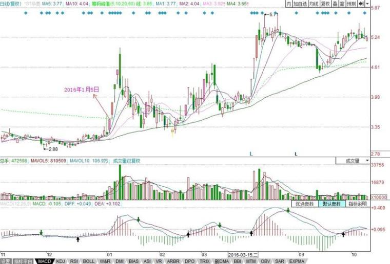
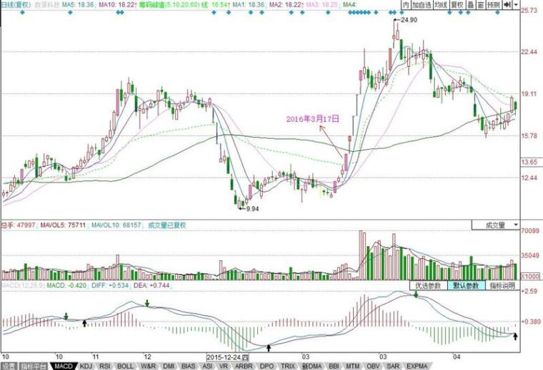
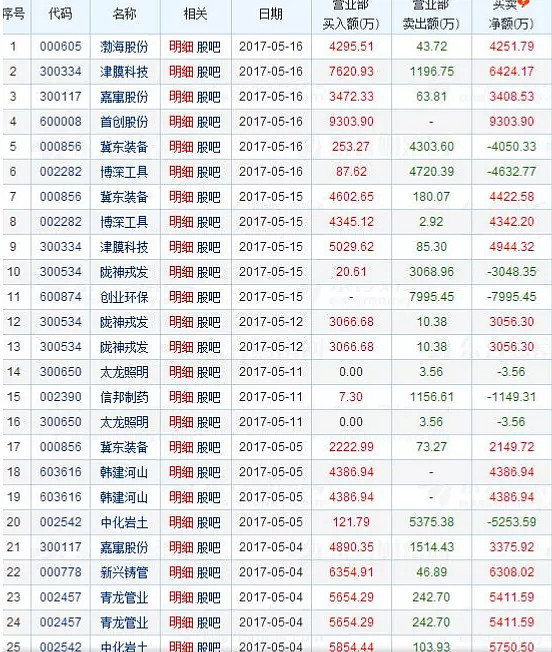
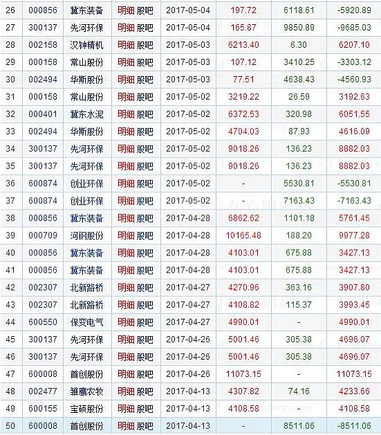

## 第一节：短线牛股的驱动力  

　　你好，欢迎来到从小散到顶尖游资的系列分享。  

　　这节课比较特别，可以说讲的是我们短线获取高利润的理论基石，可能会颠覆大部分人的投资观。  

　　20世纪末，发生了一件事情，把索罗斯，比尔盖茨，马云，马化腾，李彦宏等人卷了时代的洪流，并且因为这件事的影响，催生了一大批像亚马逊，谷歌等伟大的公司，同时也造就了一大批亿万富豪，甚至影响了国运。请问这件事是什么？这个问题，我稍后回答你。  

　　我和一些学院派的投资者聊天，经常让我觉得啊，不谈论价值，只谈论题材好像是件有失身份的事情，虽然我的业绩他们一辈子可能都无法达到。这就好像你在大儒朱熹面前谈论美女性不性感，有没有风韵一样难于启齿，虽然他老人家有很多小老婆。或者像在上个世纪30年代，你到黄埔军校里谈论游击战一样让人瞧不起。  

　　人世间所有的误解无非来源两种：第一种是因为无知导致，第二种是保持这种误解可以带来利益。对题材的误解，我更多的认为是无知导致的。  

　　我研究了最近十年，一个月内涨幅超过50%的短线牛股，发现了一个有趣的现象：**在这900多只股票中，有高达95%的牛股，在他们启动初期具备一个共同点，那就是都有一个消息刺激，这样的消息要么是来自公司层面的，(如业绩公告，高送转，新产品的推出，接到大订单，管理层或者大股东出现变更等等)要么是来自行业层面或政策层面，还有就是来自与行业或企业有关的重大社会事件**。  

　　更为重要的是，通过对比研究，我们发现这些刺激股价短期上升的信息，往往有着惊人的相似，在上涨逻辑上更是完全一样。当多年前我得出这个结论后，我的操盘风格和业绩都出现了革命性的变化。一般我们将这类刺激股价上涨的消息归类，称他们为题材。  

　　那么我们可以反过来问：**什么是题材呢？我给出的题材的定义是： 能够使资源、 财富、权力的产生变化预期的事件和事实**。根据这个定义，20世纪中国发生的最大的四个题材是什么？换句话说，20世纪中国发生资源财富权力变化最大的四件事情是什么?  

　　在我的眼中，上个世纪中国出现的四大题材分别是：大清朝灭亡、日本发动侵华战争、国民政府垮台，新中国成立、改革开放。  

　　几乎所有的大人物，屌丝逆袭的故事都与这四个题材密切相关。几乎所有的大家族的兴衰，都和他们对这几个题材的把握息息相关。几乎所有的企业的兴起与灭亡，都必然受到这四大题材决定着，影响着。  

　　为什么？因为这四大事件，让太多的资源，权力，财富发生了改变。  

　　换句话说，**大事件、大现象这样的题材出现，利用好了，就会改变个人、家族、公司甚至国家的命运，这就是我的大题材观**。 一个人要发展需要这样的题材观，题材思维，一个企业和国家要壮大，也需要这样的题材观和题材思维。**从今天开始啊，我也希望你树立这样的题材观，用题材思维来看待我们所身处的世界**。  

　　好，说到这里，我们今天开头的那个问题，就可以揭晓了。答案是美国的科技股泡沫。准确的说是互联网题材股炒作。这次超级大题材，影响了无数人的生活和工作。马云，马化腾等这些人有意无意的抓住了这时代性的机遇，才有了今天的阿里、腾讯，亚马逊这些伟大的公司。同时作为个体，他们也改变了自身家族的命运甚至影响了国运。  

　　从另外一个角度说，题材不仅仅发生在上市公司层面上，还会发生在个人，家族，政党，甚至国家层面上。在各个层面上都有决定其走向的题材。  

　　**比如说个人我们的出身，我们所读的学校，我们的学识才干，我们的工作平台，以及重大社会突发事件和趋势性事件等等，无一不是我们改变命运的题材**。  

　　从国家层面来说，我们知道一个国家要想成为一流强国，内部取决于人口数量和素质，土地和各类资源等条件，外部则是能否抓住战略性的历史机遇，这个机遇就是我们研究的题材。比如美国就是利用两次世界大战让欧洲强国互相削弱的机会崛起的。  

　　个人也好，国家也罢，都有让他们兴衰的事件题材。股市作为人类社会的一面镜子，自然也不例外。一只股票或一群股票，都有影响其价格走势的题材，这就是为什么95%的短线牛股启动前都有一个消息刺激，比如：换了一个非常优秀的管理层，预期有新的改革措施、换了大股东，导致经营方向的变化、行业整体情况转好，预期对公司业绩有正面的作用、国家发布重大政策对相关公司产生了积极的影响、  

　　科技变革给相关带来了机遇、一个新的盈利模式，经营模式带来的改变、涨价给上游企业带来的影响、公司从极大危险的境地脱离而带来的业绩反转、业绩不断走好且超出预期......  

　　以上的例子我们列出很多。但归结到定义上来：能够导致资源、财富、利益发生变化预期的事件，我们称之为题材。**重大变化的我们称之为大题材，小变化称之为小题材。 小题材诞生小牛股，大题材诞生大牛股，甚至大牛市**。  

　　**有关题材的三个重要问题**  

　　既然题材如此重要，**我们怎么做才能抓住题材中蕴藏的机会呢**？要回答好这个问题，我们必须先理清以下三个方面  

　　**1、价值投资与题材的关系(确定其投资思路的独特性)**  

　　**2、有哪些投资高手是做题材的？(这种方法诞生了大量的投资高手)**  

　　**3、中国股市为什么是做题材的天堂(中国股市做题材大有可为)**  

　　对于**第一个问题：题材与价值投资的关系**。我们并不想就此展开过于复杂的讨论，以免让我们本就复杂的投资变的更为复杂。从广义上来说，价值投资只是题材的一个分支。  

　　在我研究兰花、普洱茶、比特币、贵金属、艺术品以及美国科技股的炒作时，我一直在寻找这些问题的答案：为什么一盆兰花可以卖到千万，为什么一斤茶需要几百万？为什么在美国一只股票因为一个消息可以上涨40倍？价值投资关于价格变化的原理，根本无法解释这些，更无法把握这些事件中巨大的投资机会。而题材投机理论关于价格的变化规律就很好的解释了上述现象。  

　　从狭义上来说，题材股是成长股投资的一个延伸，而成长股投资是应该说是由传统价值投资理念发展而来的。  

　　我们换一个比方来说吧：现在股权投资非常火，题材股呢，就是在种子轮的投资，追求前瞻性和高收益，成长股投资呢，就是在风险投资的A，B轮，这个时候风险比前期小，价值投资类似于在上市前，追求确定性，但回报也小。市场大部分时候是价值股，成长股，题材股各领风骚，但总体来说，题材股活跃的时间远远多于其他两种。如果你立志成为一个卓越的投机家，就应该放下一切流派之争，一切对我们的成长有提升的思想和人，都使我们实现梦想的助力!  

　　**第二个问题是：有哪些投资高手是做题材的**？在第一节课我们讲了一个重要成长方法论，那就是向各个领域的牛人学习，是快速成长的最佳途径之一。在这里我们就来看看题材这个领域的高手有哪些?  

　　目前全世界公认，捕捉事件类题材的第一高手是索罗斯。索罗斯总能从那些惊天动地或在关乎一国命运前途的事件中，看出投资投机的机会。我们来看看他的几次经典之战。  

　　1973年，埃及和叙利亚大举入侵以色列，由于武器落后以色列惨败。从这场战争中，索罗斯联想到美国的武器装备也可能过时，美国国防部可能会花费巨资用新式武器重新装备军队。于是索罗斯基金开始投资那些掌握大量国防部订货合同的公司股票，这些投资为索罗斯的基金带来了巨额利润。  

　　1992年，东西德刚统一不久，德国人害怕通货膨胀，德意志联邦银行定下了高利率，与其相反，由于当时欧洲其他国家经济十分低迷，政府采取了低利率想刺激经济。而货币在欧洲各国是可以自由兑换的。这样大量低利率的货币如英镑、里拉都会兑换成德国马克。这种情况势必会导致英镑贬值。这就好比今天美国加息，全球大部分国家要么跟着加息，要么就只能看着自己国家的钱流入美国，从而导致本币贬值是一样的道理。而索罗斯就抓住了这个机会， 大赚10亿美金。  

　　1997年3月3日.泰国中央银行宣布：国内9家财务公司和1家住房贷款公司存在资产质量不高以及流动资金不足问题。索罗斯认为，泰国金融体系可能会出现更深层次的问题，便先发制人，下令抛售泰国银行和财务公司的股票，由此展开他狙击泰铢的战役。2012年，安倍晋三在日本上台主政，索罗斯从安倍过往言论推断安倍的货币政策将导致日元贬值不可扭转，于是放空日元，此战获利10亿美元。  

　　除了索罗斯善用大事件题材外，中国股市的两位绝顶高手，也是做题材的好手。第一位是曾经的公募一哥王亚伟，善于重组题材，素有重组之王的封号。第二位是曾经被游资们封为总舵主的徐翔，是题材的集大成者。经典之战有杭萧钢构，重庆啤酒，上海自贸区等。另外，我们研究的数据显示，几乎所有的短线游资高手，那些从几十万做到数亿级别的，都非常善于做题材。  

　　**第三个问题是：中国股市为什么是做题材股的天堂**？这是由如下原因导致的。首先是其所处发展阶段：主要是指中国市场经济发展的历史很短，而中国资本市场的历史更短。股市就必然有许多不完善的地方，而这些不完善的地方，高手就能够加以合理利用。  

　　再是制度导致的。我们是中央集权的公有制国家，政府掌握着全社会大部分资源的支配权，这是政策市的根基。另外在资本市场上国有企业的市值比重为65%，是其他国家所没有的国情。任何人忽视这一点，而谈什么价值投资的普遍实用性，是会吃苦头的!再说我们A股的发行制度和退市制度也是全球少有的。  

　　还有就是我们国家投资者的民族性决定的，中国股民的赌性世界公认，投资思想家，查理芒格不只一次在公众场合表示中国人天性好赌。这是由于目前中国的中产阶级还没有成为社会财富的中流砥柱，大部分人还在为成为中产阶层而奋斗，这才是赌性的根源。也就是说，这是由中国社会的阶层结构决定的。  

　　最后是由长期累计起来的赚钱效应决定的。做涨停板，做龙头，做题材，通过这些方式赚钱的人，远超过其他投资方式的人，主要还是里面有暴利的基因，造富的可能性。资本的本质是逐利的，而人类的天性是趋利避害的。  

## 第二节：四大常见题材分析要领  

### 题材的分类  

　　理清了上面的三大问题，我们对做题材就有了更深入的了解，那回到我们最初的问题：如何做题材股？各种题材层出不穷，要想有一个清晰的思路，必须要对题材进行分类，然后根据不同题材各个击破。  

　　在分类前，我们先来了解一下股价形成的基本路径。任何推升股价上涨的买入背后，必定有一个假设：那就是股价在我买入以后的某一阶段会上涨。而这样的**假设基于的理由普遍来讲只有两类：一类是业绩预期向好导致股价的上升，另一类是不以业绩作为思考的方向，而是预期会有更多的人买入，导致筹码稀缺从而引发股价上涨，这是单纯的对股价上涨的预期**。  

　　这里要举个例子。将预期的东西说清楚。我的家乡是一个盛行禅宗的地方，有一位在家居士，每天下午都要去寺庙。在寺庙门口他都会给寺庙的东北角，西北角和正中间三个乞丐每人2块钱，偶尔他也会和乞丐交谈几句。这个习惯保持了5年。有一天这位居士突发奇想，想做一个实验。 在离开寺庙的时候，他分别对乞丐甲说：我从明天开始就只能给你1块钱，乞丐甲听了之后，满脸的不高兴。他又跑过去对乞丐乙说，从明天开始我给你4块钱。没有对乞丐丙说任何话。第二天，他仍然像往常一样，给了每个乞丐2块钱。并且仔细观察他们的反应。 甲表现的非常开心，乙表现的很失望，并且愤怒的质问居士为何没有兑现承诺，而丙仍然和往常一样，一副理所应当的样子。  

　　他给我讲这个事的时候，我问他动机是什么？他说：佛法不是讲降伏其心吗？又讲世人的喜怒哀乐都是虚幻不实的。我就想通过这个来证明下。同样的2元钱，为什么带来了三种不同的心情？  

　　其实我今天讲的这个故事，有另外的解读。 那就是一个人的行为，是受其预期影响和决定的。为什么我们经常见到某家公司到了业绩公布时，明明是大幅增长的，股价却大幅下跌？为什么非农数据在走好，却对市场影响如此负面?  

　　对!市场就如同乞丐，他们的心情是由预期决定，而不是事实。云南白药和中国联通，同为混改概念，但表现差异却这么大，这是为什么？  

　　云南白药本身是已经非常好的企业，业绩各方面都不错，但混改带来的预期无法是将一个80分的企业变成100分的，而联通业绩各方面是50分，混改后与阿里腾讯合作，预期可能成为100分的企业。也就是说联通有50分的提升空间，而云南白药只有20分，从预期上来看当然是联通更加占优。  

　　既然股价的波动与预期有密切的关系，能不能就预期做一个精细化分类呢?我们把预期分为：**业绩预期型和价格预期型两大类**。  

　　**业绩预期型**比较常见的情况有：**一般性政策，新科技、新发明、新的商业模式，重组资产注入并购，被借壳，业绩高增长或扭亏，大股东或管理层变更，产品涨价，新事件发生带来的业绩改变预期**。  

　　**价格预期型题材**一般包括：**股东增持，定增，次新股，高送转填权，跟庄，名人概念(比如王亚伟，徐翔，巴菲特)**。

### 重点题材的解析  

　　讲完题材的分类让我们对各类重点题材进行解析。对于政策类的题材：政策一直是影响行业、公司甚至整个股市发展和荣衰的一股重要力量。过去我们总说：A股是政策市。这是非常合理且正确的判断。A股的诞生就是政策的直接结果，也一直扮演着为国企脱困为经济转型助力的角色。  

　　其中最大的核心要素是我国的体制决定的。政府掌握的全天下的大部分资源，一举一动都能影响各行各业的利益，上市公司自然更是深受其影响。这是政策市背后的根本原因。在很长一段时间内将不可能改变，甚至说国体不变，这种情况就会一直延续。  

　　既然如此，在我们特殊国情下，炒政策自然是股市投资者明智且无比正确的选择，历史也反复的告诉我们，炒股跟党走，收获颇丰。  

　　在这里我们来分享一个供给侧改革的案例：2015年11月10日，主席在中央财经领导小组第十一次会议上，首提供给侧结构性改革。2016年中央1号文件，聚焦供给侧结构性改革。 从谈话到文件。2016年1月4日，李克强在山西考察时强调：扩大有效供给，加快结构性改革。视察太钢，让市场预期供给侧改革会从产能过剩严重的钢铁和煤炭行业开始。市场从1月5日开始有较为明显的反应：华菱钢铁、安阳钢铁、抚顺钢铁集体涨停。1月6日钢铁股涨停数量达到15只，并且扩散到煤炭板块，相关个股涨停数达到27只。  

**龙头股华菱钢铁**  

  

　　1月5日：  

　　- 000932 华菱钢铁：14：14 有开板。钢铁板块。  

　　- 600569 安阳钢铁：14：17 有开板。钢铁板块。  

　　- 600399 抚顺钢铁：14：36 有开板。钢铁板块。  

　　1月6日  

　　- 002423 中原特钢：9：30 钢铁板块。  

　　- 000932 华菱钢铁：9：38 钢铁板块，二连板。  

　　- 600569 安阳钢铁：10：00 钢铁板块，二连板。  

　　- 000782 新钢股份：10：01 有开板。钢铁板块。  

　　- 000959 首钢股份：13：22 钢铁板块。  

　　- 600005 武钢股份：13：34 钢铁板块。  

　　- 601005 重庆钢铁：13：35 钢铁板块。  

　　- 000629 攀钢钒钛：14：23 钢铁板块。  

　　- 600399 抚顺钢铁：14：36 有开板。钢铁板块。  

　　- 000709 河北钢铁：14：37 有开板。钢铁板块。  

　　- 600307 酒钢宏兴：14：37 有开板。钢铁板块。  

　　- 600022 山东钢铁：14：42 有开板。钢铁板块。  

　　- 600808 马钢股份：14：43 有开板。钢铁板块。  

　　- 600581 八一钢铁：14：52 有开板。钢铁板块。  

　　- 600019 宝钢股份：14：53 有开板。钢铁板块。  

　　- 600123 兰花科创：9：49 煤炭板块。  

　　- 000983 西山煤电：9：55 煤炭板块。  

　　- 601001 大同煤业：9：56 煤炭板块。  

　　- 600546 山煤国际：10：39 有开板。煤炭板块。  

　　- 601225 陕西煤业：10：57 有开板。煤炭板块。  

　　- 600348 阳泉煤业：11：02 有开板。煤炭板块。  

　　- 600997 开滦股份：11：02 有开板。煤炭板块。  

　　- 000933 神火股份：11：16 有开板。煤炭板块。  

　　- 000937 冀中能源：11：19 有开板。煤炭板块。  

　　- 601699 潞安环能：13：02 有开板。煤炭板块。  

　　- 000552 靖远煤电：13：03 有开板。煤炭板块。  

　　- 600971 恒源煤电：13：03 有开板。煤炭板块。  

　　- 600188 兖州煤业：13：09 有开板。煤炭板块。  

　　- 601666 平煤股份：13：25 煤炭板块。  

　　- 600397 安源煤业：13：26 煤炭板块。  

　　- 600395 盘江股份：13：28 煤炭板块。  

　　- 000780 平庄能源：13：34 煤炭板块。  

　　- 601101 昊华能源：13：37 煤炭板块。  

　　- 002128 露天煤业：13：53 有开板。煤炭板块。  

　　- 601898 中煤能源：14：02 煤炭板块。  

　　- 600508 上海能源：14：02 煤炭板块。  

　　- 600792 云煤能源：14：21 煤炭板块。  

　　- 601015 陕西黑猫：14：23 煤炭板块。  

　　- 600157 永泰能源：14：37 煤炭板块。  

　　- 000723 美锦能源：14：42 有开板。煤炭板块。  

　　- 600403 大有能源：14：46 有开板。煤炭板块。  

　　- 600121 郑州煤电：14：57 煤炭板块。  

　　**政策一般有**：  

　　**综合性国策**：如西部大开发战略，京津冀协同发展战略，上海自贸区的设立，一带一路。4万亿，三峡水利工程。 雄安新区。  

　　**货币政策**：加息，降准之类。  

　　**行业性政策**：健康中国，美丽中国，人工智能  

　　**制度性改变**：注册制，沪港通，IPO新政  

　　我们再看从股权分置改革，四万亿刺激计划，创业板设立，自贸区(上港集团)，一路一带(南北车)，双创，沪港通(券商)，军改，国企改革(中粮三剑客)，京津冀(港口)，二胎(戴维医疗)等等 这些政策背后，无一不走出一个个大牛股。  

　　**说到这里，我们应该怎么样挖掘政策方面的题材呢**?  

　　首先从政策强弱方面着手：**比如五年规划，两会，中央经济会议，由最高领导人推动的政策自然最强，其次是国务院，再次是各部委。只做大政策、关注最高层的是我们做政策性题材的最重要的方法论**。  

　　其次是科技创新驱动，科技是第一生产力的口号已经举世皆知。科技改变生活，改变国运，也同样是催生新兴企业，改变企业命运的一股最为重要的力量，作为企业中的优胜者，上市公司受科技革新的影响尤为重大。在世界500强企业中，科技类企业的比重越来越高，从10年前的2%上升到现在的10%。换句话说，科技也是过去30年诞生伟大企业最多的领域，也是未来很长的一段时间，催生牛股的温床。  

　　比如，苹果，谷歌，微软，亚马逊，中国的华为，腾讯，阿里巴巴，京东。从世界商业史来看，科技对商业的影响越来越大，甚至像我们这样有着特殊国情的国家，科技是唯一可以和政策媲美的力量。  

　　在这里我们来分享几个案例  

　　**第一个案例：无人驾驶**  

　　3月17日 十三五汽车工业发展规划意见发布：建设汽车产业创新体系，积极发展智能网联汽车，并提出具有驾驶辅助功能的汽车，新车渗透率要达到50%。 这个案例其实还是炒的政策预期，我们不必拘泥于表象。3月18日十四只无人驾驶概念的个股涨停，其中数源科技走出五连板，索菱股份和金固股份走出四连板。  

  

　　- 000909 数源科技：9：31 无人驾驶概念。(走出五连板)  

　　- 002766 索菱股份：9：45 无人驾驶概念。(走出四连板)  

　　- 002488 金固股份：9：48 无人驾驶概念。(四连板)  

　　- 002284 亚太股份：10：36 无人驾驶概念。  

　　- 002448 中原内配：10：40 无人驾驶概念。  

　　- 600081 东风科技：10：45 无人驾驶概念。  

　　- 601965 中国汽研：10：51 无人驾驶概念。  

　　- 002232 启明信息：10：55 无人驾驶概念。  

　　- 002055 得润电子：11：06 无人驾驶概念。  

　　- 600699 均胜电子：11：14 无人驾驶概念。  

　　- 002590 万安科技：11：14 有开板。智能汽车概念。  

　　- 300007 汉威电子：13：30 有开板。无人驾驶概念。  

　　- 002414 高德红外：14：25 有开板。无人驾驶概念。  

　　- 002607 亚夏汽车：14：39 无人驾驶概念。  

　　在这里总结一下历史上科技题材炒作的关键词，包括：AR 、精准医疗、基因测序 、5G 、石墨烯 、量子通信、人工智能、工业4.0 、生物制药。  

　　**第二个案例：高送转----这个题材被戏称为打不死的小强**  

　　其中有无数牛股诞生，是游资庄家最爱。  

　　也许谎言重复一千遍变成真理 赚钱效应使得这个游戏长盛不衰。即使在20世纪30年代前的美国股市，高送转的数字游戏也吸引了不少投机者，当时的投机之王利弗莫尔就贬斥过这种现象。 现在香港股市上也经常有10送40的数字游戏，但基本无人买账。理解了高送转，我们会对索罗斯的谎言论有更深的体悟。  

　　对于炒作高送转我们必须知道信息包括以下几点：  

　　第一：时间窗口，首先公布年报或中报，提出高送转预案并公布召开股东大会时间。现在有些公司在公布年报或中报前就发布高送转预案。然后召开股东大会，表决高送转方案是否获得通过。最后在股东大会结束一周左右公布股权登记日和除权除息日，登记日之前称为：抢权，之后称为填权。牛市的话，一般有填权行情。  

　　第二：高送转对公司业绩不会产生任何影响，只是一个类似如拆分销售的营销把戏，开始还是有一些业绩的因素的。  

　　第三：高送转在中国股市历史上几乎是每年常规必备的项目，赚钱效应非常明显。反映了上市公司对股价的期待。  

　　高送转的短线投机需要一些特殊的技巧。这些特殊技巧主要是在选股标准上：选择上最好选第一家公布高送转的，有时间优势。比如15年12月8日最先公布年报的财新发展 ，16年中报行情中第一个公布除权日期的的名家汇 其次选择送转比例高、历史股性活跃、盘子小的。后考虑：具备多重题材以及稀缺性。  

　　**第三个案例：次新股**  

　　对于次新股我们炒作的主要逻辑有：没有套牢盘，拉升相对容易。没有大股东减持压力，筹码干净，流通盘小，需要不多的资金就可以活跃整个板块。开板时没有主力，换手率也极高，可以将资金的博弈看的更清楚，另外次新股刚上市，股本小，股价高、公积金高，是高送转的主力军。  

　　了解了炒作的逻辑，下面就要落实到选股上了。对于选股我们从个股估值的角度分析 ，主要考虑企业规模、行业地位、营收、净利润 。  

　　从炒作价值来看：主要注重个股的稀缺性和实时的市场情绪偏好。  

　　从板块强弱来看：主要应重点关注次新股开板时市场炒作次新股的情绪。  

　　从大盘强弱来看：如果在大盘弱势的情况下，早早的打开涨停机会更大。  

　　要选到好的股票，我们就需要做些基本功首先我们需要认真阅读招股说明书，时刻关注次新股整个板块的动向，再精选出部分重点个股，每日跟踪关注，最终确定出来我们要做的个股。  

　　自长期的实战中，我也总结了几点经验与你分享：大盘低迷时开板的个股容易被低估，值得重点关注，而超过100元才开板的次新股是很难出现大牛股的。那些业绩非常好的个股，股价很可能一步到位，没多少肉吃。另外就是新兴产业个股更容易被炒作一些。  

　　下面我要说的**第四种题材，我将其称之为：困境反转。主要包括重组，借壳等，以弱胜强、屌丝逆袭的故事是人类永远的精神鸦片，这个题材永远有着最多的关注**。从电影到文学作品比比皆是。在这里就不展开说了。 通过以上的介绍让我们对不同题材都有了比较深入的了解，但如果一个时期出现了多个题材行情时，我们该怎么办呢?  

## 第三节：判断和操作主流题材的三大要点  

　　通过以上的介绍让我们对不同题材都有了比较深入的了解，但如果一个时期出现了多个题材行情时，我们该怎么办呢?  

　　我的答案是： 以主流题材为主。**一般来说，一个阶段性的行情由一个主流题材，多个支流题材构成**。这个主流题材的特点用三个字概括为：大、新、强。主流题材往往吸引着最多的资金参与其中，也是我们应该重点关注的机会。  

　　如何理解大?  

　　大题材，主要指的是影响国运的，多个行业受益，影响深远的事件。  

　　小题材，主要是局部改变影响一个领域，一般多为一个行业或少数几个公司受益。  

　　举个例子：股权分置改革、四万亿计划、上海自贸区、一带一路 、雄安新区这些影响深远的大事件都是大题材。共享单车、新零售、得到大定单、产品涨价等影响单个行业或公司的都是小题材。  

　　关于新旧，这个就很好理解了，自然是选择新的，放弃旧的。 当一个题材衰落时出现新的题材一定要切换。  

　　关于强和弱， 这个主要是针对实际操盘来说的。如何区别一个题材的强弱?这个是以市场认可度来的分辨的。我们一般是从涨停家数，相对涨幅，盘面持续性三个纬度来确定的。  

　　对于主流题材的理解和把握，我们举一个最近的例子，新进的一流游资北京阜成路一个月的龙虎榜单。  

  
  

　　牢牢把握主流题材,完全遵循了做题材股的核心要求。  

　　这是一路非常优秀的上榜记录，我们可以看到，在雄安概念出来后的一个多月，上榜50次，98%的股票都是雄安题材的。可谓牢牢把握了市场的主线。这是值得我们研究和学习的。  

　　总结区  

　　知识点1：题材是牛股诞生的温床，是我们研究牛股的关键点。业绩和价值本身就是一种题材。  

　　知识点2：投资大师都是挖掘题材的高手。  

　　知识点3：题材分为：价值型题材和价格型题材。或业绩预期型题材和价格预期型题材。  

　　知识点4：做题材不限短线和波段的。  

　　知识点5：短线做题材的16字方针：抓大放小、喜新厌旧 、舍妄归真 、汰弱留强。归结为只做主流。  

　　知识点6：做题材，必须要掌握利润兑现点，否则净值容易过山车。  
