---
title: K线图基础知识
index: true
icon: editor
order: 8
category:
  - 基础
  - 大A
tag:  
  - 雪球
---  

([原文](https://xueqiu.com/1486522682/153407265)发布于2020-07-08)  

## 一、K线概述  

炒股时我们最关心的是股价的涨跌变化，所以在实战操盘中，K线分析无疑是最重要的一个环节。从K线图上，投资者可以捕捉买卖双方力量对比的变化，可以分析预测股价未来的走势，把握好买进卖出的最佳时机。  

K线从时间上分，可分为日K线、周K线、月K线、年K线，以及将一日内交易时间分成若干等分，如5分钟K线、15分钟K线、30分钟K线、60分钟K线等。这些K线都有不同的作用。例如，日K线它反映的是股价短期的走势。周K线、月K线、年K线反映的是股价中长期的走势。而5分钟、15分钟、30分钟、60分钟K线反映的是股价超短期的走势。它们的绘制方法大同小异。例如周K线，只要找到周一的开盘价、周五的收盘价，一周中的最高价和最低价，就可以把它绘制出来了。电脑上的周K线所标注的时间都是收盘价的时间。  

K线又称阴阳线或阴阳烛。它的具体含义请见下图。  

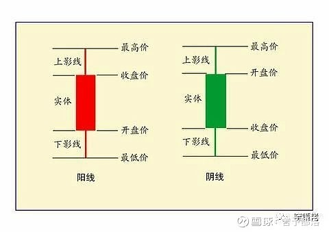  

K线从形态上分可分为阳线、阴线和同价线3种类型。阳线有大阳线、中阳线和小阳线。阴线有大阴线、中阴线和小阴线。同价线是指收盘价等于开盘价，两者处于同一个价位的一种特殊形式的K线，如十字线、T字线等。具体种类和形态请看下图。  

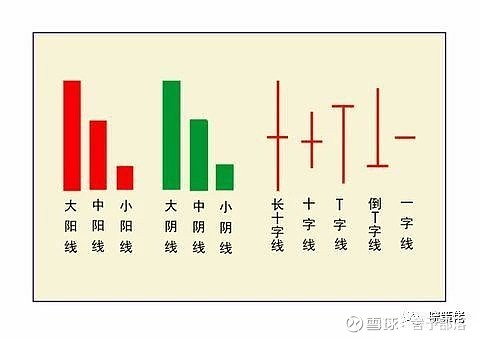  

## 二、常见K线一览表  

（参见下图）  

### 1）见底形态和上升形态的K线、K线组合(图1-图27)

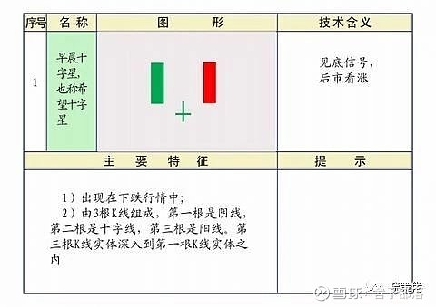  

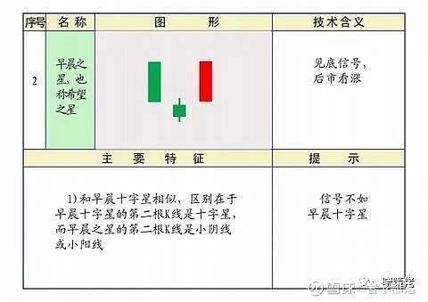  

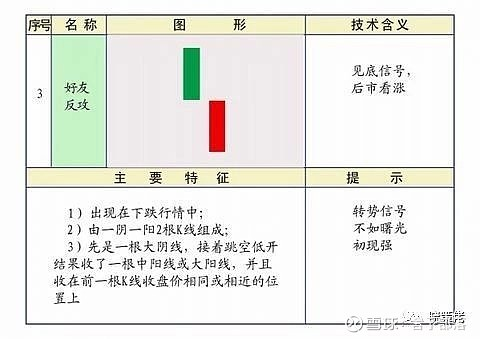  

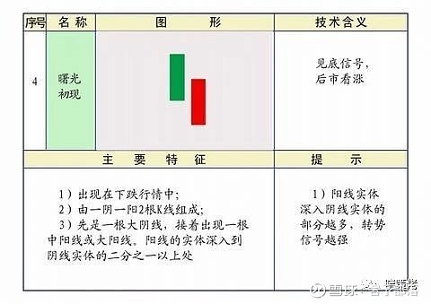  

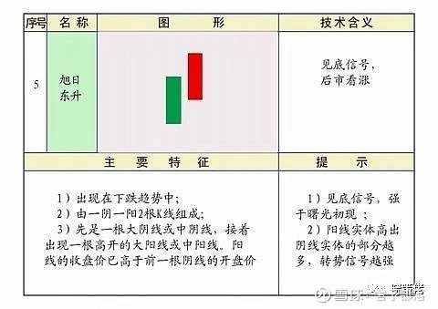  

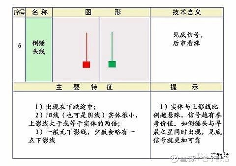  

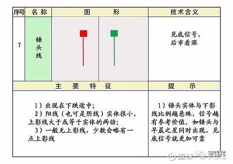  

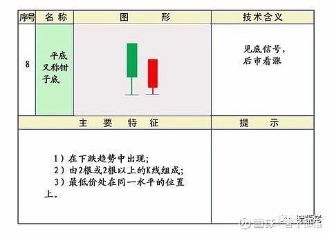  

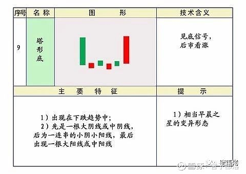  

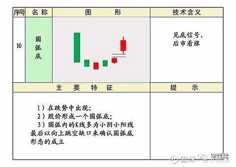  

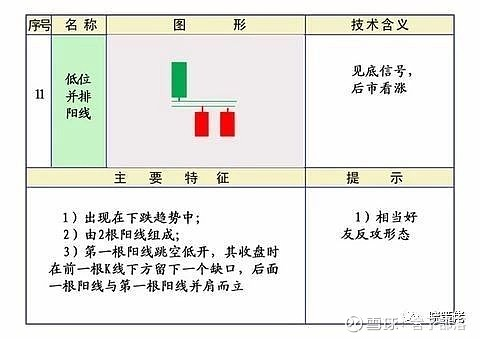  

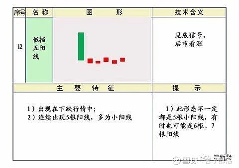  

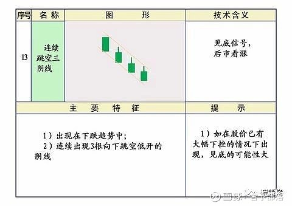  

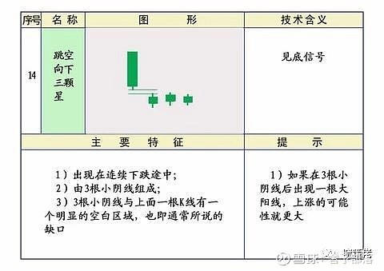  

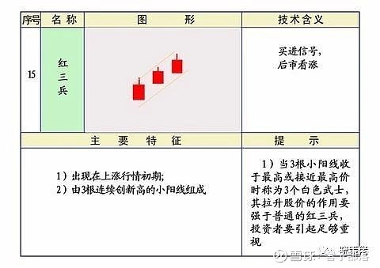  

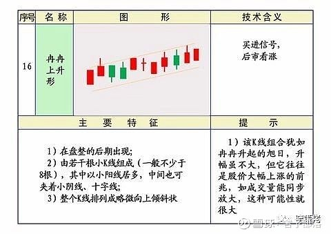  

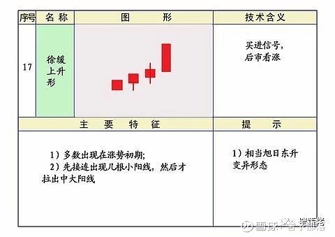  

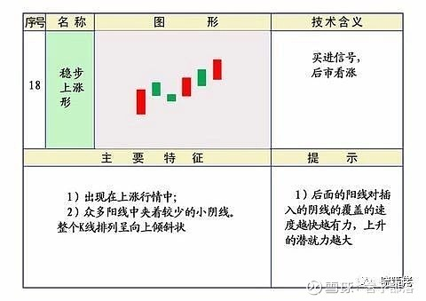  

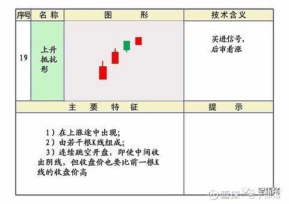  

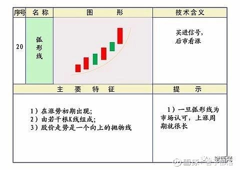  

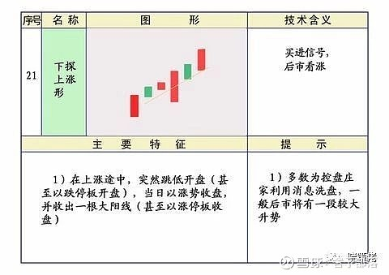  

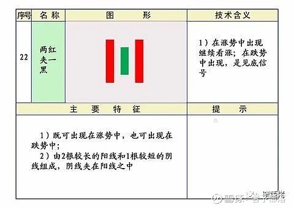  

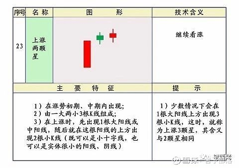  

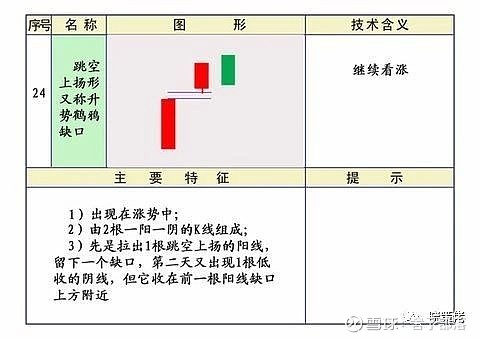  

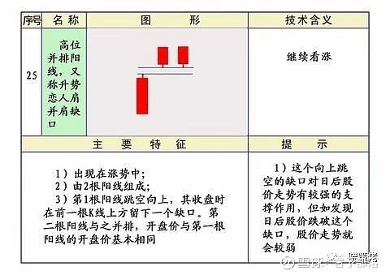  

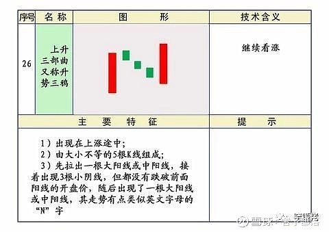  

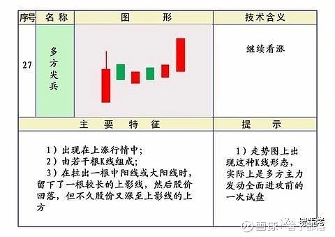  

### 2）见顶形态和下跌形态的K线、K线组合(图28-图57)  

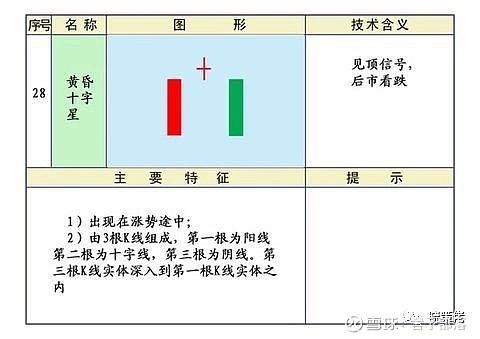  

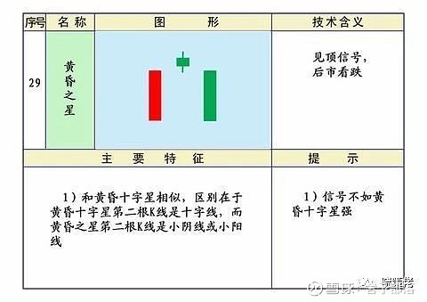  

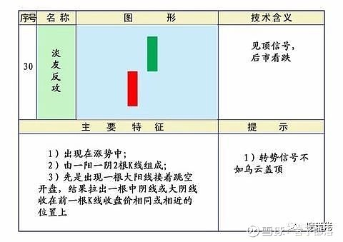  

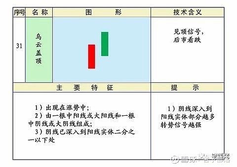  

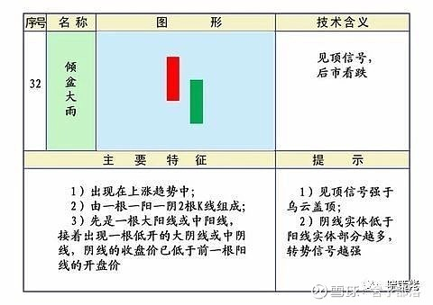  

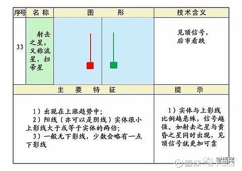  

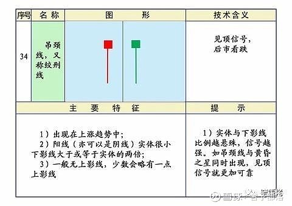  

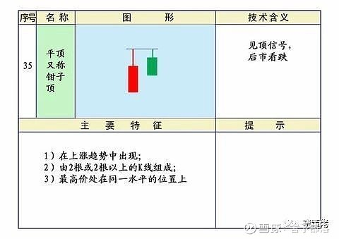  

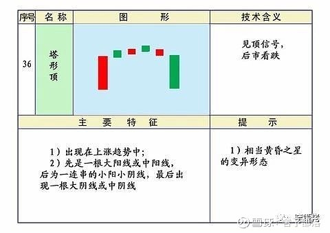  

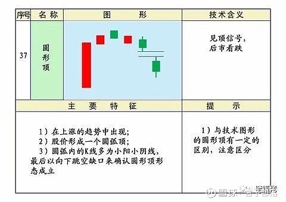  

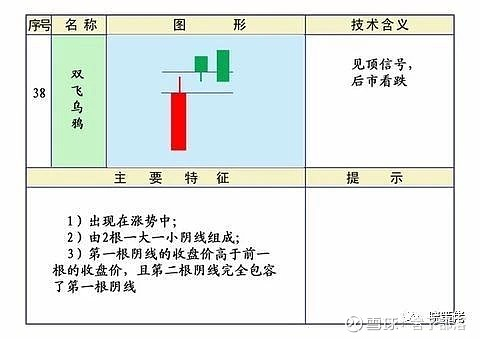  

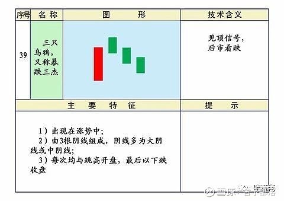  

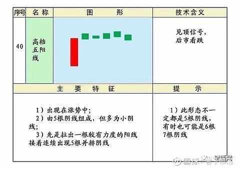  

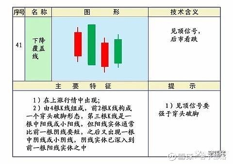  

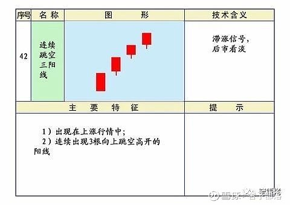  

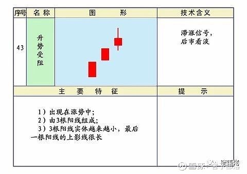  

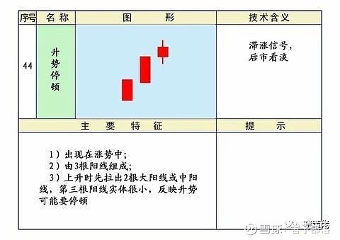  

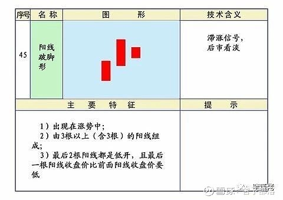  

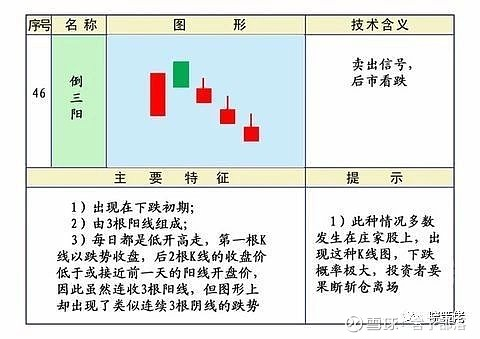  

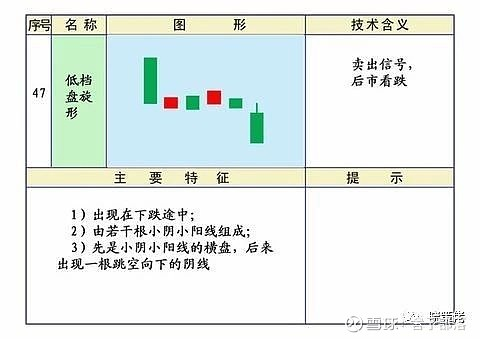  

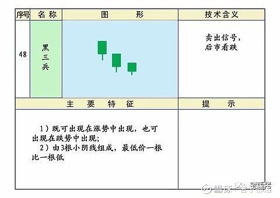  

  

  

  

  

  

  

  

  

  

### 3）既是上升形态、又是下跌形态的K线（图58-图75）  

  

  

  

  

  

  

  

  

  

  

  

  

  

  

  

  

  

  

## 三、K线实战应用技巧  

我们知道股市的涨跌变化是很难预测和把握的，但股市的变化也是有规律的。比方说股市里的“对称性”和“重复性”就是最好的证明。咱先说说K线的对称性：有“红三兵”、就有“黑三兵”，有“上升三部曲”、就有“下降三部曲”等等，下面的例子虽然讲的是上涨或下跌K线形态，但反过来用往往也是成立的。  

### 1）拉出“大阳线”后会有几种走势？  

请参见下图说明。补充一点：大阳线的成交量要有效放大，没有成交量的配合，这样的大阳线就值得怀疑！  

  

### 2）在上涨途中出现“螺旋桨”应怎样应对？  

①无论是大盘或个股，一旦大幅上涨后，出现这样的K线，且随后几根K线在其下影线部位运行，那么头部就基本形成了，继续下跌的可能性就非常大，应果断止损！  

②如果以后的K线在它的上影线部位运行，它有可能是上升途中的过渡形式，是一种上升中的中继形态，投资者应持股观望！  

③提示一点：如果在螺旋桨之后以横盘形式出现几个小阴、小阳线，可结合5日均线变化情况在观察2—3天再作决定。具体情况请参见下图。  

  

### 3）怎样理解“加速度线”的含义？  

加速度线是典型的头部形态。特别是已上涨很多的个股遇到这种形态更要倍加小心。一般来说，一个权重股连拉3根大阳线，做多能量一下子消耗太大，接下来十有八九会出现一轮调整（请参见下面图一）。  

### 4）如何看“高开出逃形”的K线形态？  

股价在高位，主力怎么才能顺利出货呢？对，他往往会采取拉高诱多的方式出货。所以高开出逃形往往是主力设置的“诱多陷阱”！高开出逃形可排在主力出货方式前三名的位置。其实“穿头破脚”也属于这种形态的原理。另外。顶部出现什么样的大阴线（特别是放大量的大阴线或带跳空缺口的大阴线），都是我们必须马上止损的最好理由（图形样式请看下面图二）！  

### 5）遇见“下探上涨形”的形态应怎么处理？  

当某只个股拉出一根中阳线后，次日开盘跳空低开后急速拉升，收出一根十足的大阳线。这根大阳线也俗称“擎天柱”,这是一种比较典型的做多信号。强弱信号的特点是：两根阳线反差越大、信号越强。应对策略是——持股待涨（具体图样请参见下面图三）！  

  

### 6）怎样正确认识“上升三部曲”形态？  

一般情况下，不出意外，在上升三部曲出现之后i，股价都会形成一轮较大的升势。标准的上升三部曲是：一是由大小不等的5根K线组成；二是先拉出一根大阳线或中阳线，接着连续出现了3根小阴线，但都没有跌破前面的开盘价，随后出现了一根大阳线或中阳线，其中走势有点类似英文字母的“N”字。  

具体操作中，中间小阴线不一定是3根也可能是4根、5根或多根。小阴线是主力清洗浮筹的手段，当一些人看淡时主力会突然发力，再拉出一根大阳线。宣告一轮震仓洗盘暂告一个段落，接着又要发动向上的攻势了（具体图样请看下图）。  

  

### 7）“穿头破脚”有哪些含义？  

穿头破脚出现在涨势中，有可能是见顶信号；出现在跌势中，则有可能是见底信号。经验告诉我们，股价在大幅上涨后出现穿头破脚，见顶的可能性很大。当然，是不是见顶了，还取决以下三个因素：一是升幅越大，获利盘越多，见顶的可能性就越大；二是穿头破脚的信号越强烈，见顶的概率越高（请见下图）；三是是否见顶，要看在它之后几根K线的运行情况，如果以后的几根K线在长阴线的收盘价下方运行，股价重心向下，则基本上可以判断是见顶了。  

  

穿头破脚见顶的“超强”信号，一般出现在上升趋势的末期，在某一天出现巨大的长阴线。往往在开盘时也像往常一样创出新高，随后就飞流直下三千尺。其超强信号出现时，投资者应立即跟着做空！因为这种超强信号一旦出现在顶部，继续大幅下跌的概率可达到90%。  

如果出现的是“强势”信号，也要引起密切关注，只要它出现，股价往后下跌的可能性在70%以上，所以应视情况做好减仓动作，以防突然不测发生。  

当然，在顶部出现的是“一般”和“较弱”信号，投资者不宜马上斩仓出局，可以先看看再说，如若发现往后的K线在其下方运行，股价重心下移，再停损离场也不迟。这样做的目的是为了避免主力的空头陷阱。我们知道，主力在拉升股价前都要有一个洗盘动作，而穿头破脚常常被主力利用为途中震仓洗盘的一种手段。因此，投资者只有看清主力的真正意图，并仔细观察股价重心究竟是在向上还是在向下后，才能做出正确的抉择。  

最后，操作时还必须注意：无论穿头破脚见顶信号多么强烈，如果该信号出现在股价刚启动阶段，股价在没有大涨的情况下，则不要轻易判断它见顶。  

虽然，从统计上来说，穿头破脚作为见底信号，不如它见顶信号准确率高（因为股价下跌容易上涨难），但是，如果我们把K线中所有见底信号进行排队，可以发现穿头破脚见底信号还是名列前茅的！  

为了避免投资失误，要注意以下两点：一是股价上涨必须要有成交量的配合，只有满足了这个条件，才可以考虑它是不是见底信号；二是最终确定它是不是见底信号，要等后面几根K线走出来以后，看看股价是不是确实在往上移动，如发现股价确实在其长阳线收盘价的上方运行时。稳健的投资者才可看多、做多（请见下图）。  

  

### 8）怎样理解“蛟龙出海”和“上档倒T字线”的信号含义？  

蛟龙出海是重要的做多信号，一根大阳线在底部一下子穿过好几根中、短期均线，如再有成交量的配合，应该会有一波行情。  

而上档倒T字线是重要的做空信号，如果出现在月K线上，杀伤力会非常大，要很长时间对它不看好。也就是说，在该股月K线没有重新发出做多信号前，就不能再对它看多、做多（具体图样、请见下图）。  

  

### 9）股价大涨后，前一根K线收盘价被跌破怎么看？  

在短时期内，大盘或个股出现连续大幅上涨的情况下，上一根K线的最低价一旦被跌破（K线收阴收阳关系不大），形势往往发生逆转，投资者应减磅操作以降低风险！（请参见下图）  

  

## 四、中国股市历次见顶K线组合  

一位股市高手介绍经验，他说他每次都能比较顺利地逃顶，方法是把沪市见顶的K线符号贴在墙上，以来警告自己。他还说，穿头破脚是常见的见顶K线组合，当股市有了一定升幅之后，出现“穿头破脚”就要警惕，股价重心下移，就应赶快止损离场。  

K线见顶从多空双方搏杀的角度看一般可分为三类：  

1）是宣泄杀跌型  

空方气势汹汹，多方溃不成军。这类K线见顶信号经常以“大阴线”、“穿头破脚”、“两黑夹一红”的形式出现，见到这种K线形态要赶快逃，逃晚了恐怕机会都没有了。  

2）是搏杀平衡型  

即多空双方在高位进行激烈搏杀。K线上经常会出现较长的上影线、下影线或上下影线。如“螺旋桨”、“搓揉线”、“射击之星”、“吊颈线”、“倒T字线”等，这种K线出现，见顶的可能性很大，但它通常不会马上跌下来，多方在搏杀失败之后还会组织力量反击。因此，要逃的机会还是很多的。  

3）是阴跌渐进型  

空方力量不是马上就能明显地显示出来，而是慢慢地释放出来，如“三只乌鸦”、“绵绵阴跌型”，就犹如钝刀割肉。当这种K线见顶信号出现后不会深跌，只不过是多方一下子还不肯认输，还想负隅顽抗，但多方大势已去，走熊是迟早的事。因此，投资者见到这种K线要趁早离场。当然，这种见顶是渐进式的，相对来说出逃的机会要比前两类多的多，问题是当事人有没有认识到这是个顶，想不想逃而已。  

为什么把月K线、周K线、日K线的见顶信号贴在墙上，主要是提醒自己：日K线见顶，短期变成空头是肯定的，回避一下很有必要；周K线见顶，股市下跌半年、一年是很正常的，如果不想做短线，就得休息一阵子，学会休息，才能保存实力；月K线见顶，股市要熊上一两年，甚至几年，途中有行情也不过是反弹而已！  

1）日K线走势图中的见顶K线信号  

  

2）周K线走势图中的见顶K线信号  

  
  

3）月K线走势图中的见顶K线信号  

  

## 五、k线的顺口口诀  

K线语言打天下， 股海邀游我老大。K线语言信号明， 离场速度就它行。  

顶部如穿头破脚，遇见就快跑快跑。顶部如果吊颈线，肯定就是绞刑线。  

乌云盖顶狂风吹，乌云压城城欲摧。倾盆大雨太毒辣，下跌趋势人人怕。  

顶部升起螺旋桨，落地就要把你绑。双飞乌鸦空中叫，顶部转势不祥兆。  

三只乌鸦天上飞，高开低走个个黑。淡友反攻疲惫样，只能适宜来作空。  

顶部出射击之星，手中之筹码快清。平顶图形气数尽，迅速离场我自信。  

顶部之身怀六甲，涨跌之细辨真假。T.字线到达顶部，抛筹码不要计数。  

见到下跌转折线，细看图形似宝剑。遇到下降抵抗形，肯定阴线不见晴。  

低档盘旋藏杀机，麻痹大意坐滑梯。黄昏之星走到头，千万别做死多头。  

顶部出现塔形顶，空方肯定设陷阱。顶部出现假三阳，一定离场把它防。  

顶部看到搓揉线，赶快离场钱兑现。空方尖兵真是凶，下影试探求反攻。  

遇见下跌三连阴，肯定大跌箭穿心。一看下跌三颗星，别急仔细要辨清。  

涨势尽头线出现，就要下跌把你陷。降势三鹤落图上，三阳做客喜洋洋。  

上档盘旋藏杀机，时间过长会走低。顶部站着黑三兵，转向定要看得清。  

两个黑夹着一红，多方可能要走熊。顶部一见十字长，快快离场求安祥。  

徐缓下降逞英雄，再不离场钱袋松。下跌覆盖线一见，说明头部已出现。  

平底出现细观察，试探买入手不麻。曙光初现地平线，抢点筹码是理念。  

旭日东升放光芒，全仓买入就起航。好友反攻探底明，肩底呼应更见晴。  

底部现穿头破脚，又见买入机会来。底部见到锤头线，双底呼应又出现。  

底部身怀六甲形，请试探抢入筹码。底部螺旋桨现形，只是等待风吹响。  

早晨之星东方明，带有缺口更见晴。末期下跌三连阴，随时进场捡黄金。  

二红夹着一个黑，多方笑着送春归。底部塔形底构成，装水股价起升程。  

底部出现十字长，真是典型组合强。阳线右肩十字长，初涨阶段逞凶狂。  

底部见到倒锤头，上影线长喜心头。升势之中见三鸦，明明蓄势在待发。  

多方尖兵真是凶，插入空方阵营中。底部出现红三兵，均线之上北斗星。  

倒T.字线到底部，上影线长高八度。底部见到T.字线，庄家振荡把人骗。  

底部见到尽头线，典型组合是宝剑。底部见到头肩底，关注股价右肩起。  

双底图形看颈线，突破回试是关键。V.形反转真是凶，典型定式记心中。  

底部直角三角形，三底相同一线擎。上升直角三角形，两点买入可真灵。  

上升旗形记心中，咬定两点不放松。下降楔形要记好，图形就是旗三角。  

突破缺口向北行，成交量大把它擎。岛形反转在底部，加仓买入别回吐。  

圆底图形细观察，沿着弧度缓慢爬。高空见到头肩顶，头肩离场脑清醒。  

空中出现圆弧顶，缓慢下沉有人领。尖顶图形气势凶，一飞冲天去无踪。  

扩散三角是喇叭，振荡左小右边大。岛形反转在顶部，卖出就在缺口处。  

上升楔形假上攻，最后还是往下冲。下降旗形是火坑，高点上移假拉升。  

下降直角三角形，低点处于同水平。下降收敛三角形，振荡变小方向明。  
