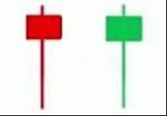
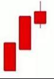
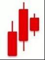
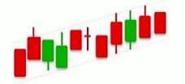
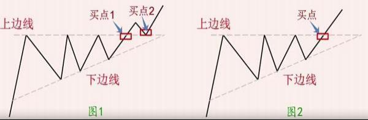

---
title: K线形态详解 东江炒家整理
index: true
icon: editor
order: 7
category:
  - 基础
  - 大A
tag:  
  - 淘股吧
---  

(原文为系列文档，由东江炒家整理)  

## 前言  

1、技术分析方法的定义:  

技术分析是指以市场行为为研究对象。以判断市场趋势并跟随趋势的周期性变化来进行 股票及一切金融衍生品交易决策方法的总和。技术分析认为市场行为包含一切、价格以趋势 方式演变、历史会重演。  

2、技术分析包括的内容：  

（1）K 线分析法  
（2）技术图形分析法  
（3）移动平均线分析法  
（4）波浪理论分析法  
（5）指标分析法  

3、技术图形分析方法需要注意的问题：  

（1）技术图形相似的颇多，牢记各种特征，防止混淆。  
（2）建议初学者在技术图形还没有明确的突破方向之前。不要武断地推断它是什么图形， 更不宜凭自己的主观愿望盲目地买进卖出。  
（3）任何技术图形的形成，都与成交量有着密切的关系。  
（4）一个技术图形能否构造成功，潜力有多大，这与它形成的时间长短有很大关系。  
（5）任何技术图形在没有朝一个方向明确突破之前，不要采取大规模的买卖行动，可用总 资金的一部分试探性做多或做空，一定要留有余地。  
（6）要重点关注技术图形构成与涨势中还是跌势中，且它朝什么方向突破。在涨势中，向 上突破压力线时以做多为主，向下跌破支撑线时则退出为佳；在跌势中，向上突破压力线时 看多但不急于做多，最多试探性做多，向下跌破支撑线时须痛下决心，果断停损离场。  
（7）入市时间十分重要，过早或过晚加入都会造成不必要的损失。一般的介入最佳时机是 股价向上或向下突破时。  
（8）买进要谨慎，卖时要果断。  
（9）要及时修正错误。知错即改，才能在股海中生存下来。  

## （一）单根 K 线形态  

### 1、大阳线  

  

特点：阳线实体较长，可略带上下影线，涨幅为 6%以上。  

技术含义：  
（1）在上涨初期出现，后市看涨；  
（2）在上涨途中出现，继续看涨；  
（3）在连续加速上涨行情中出现，是见顶信号；  
（4）在连续下跌的行情中出现，有见底回升之意、
应用提示：阳线实体越长，信号越可靠  

华能国际：2022. 1. 18；栖霞建设：2022.3.30；  
上海电力：2021. 12. 15；北新建材：2022.3.30  

### 2、大阴线  

  

特点：（1）阴线实体较长，可略带上下影线，跌幅为 6%以上。  

技术含义：  
（1）在下跌初期出现，后市看跌；  
（2）在下跌途中出现，继续看跌；  
（3）在连续加速下跌行情中出现，有空头陷进嫌疑；  
（4）在连续上涨行情中出现，有见顶之意。  

应用提示：阴线实体越长，信号越可靠  

瑞康医药：2022. 1. 17；北新建材：2022.2. 14；  
郑州煤电：2022.3. 15； 岭南控股：2022.3.22  

### 3、长十字线  

  

特点：  
（1）既可以出现在涨势中，也可以出现在跌势中；  
（2）K 线实体几乎成“一 ”字，带有长长的上下影线；阴阳均可；  
（2）上下影线越长，变盘信号越强烈。  

技术含义：底部看涨，顶部看跌。  

应用提示：长十字线是个转势信号，它出现后，行情可能会发生逆转。因此，可将它作为“逃顶”或“抄底”的重要参考指标；尤其是股价有了较大涨幅或较大跌幅之后。  

合肥城建：2022.1.18； 中远海控：2022.3.4  

### 4、螺旋桨  

  

特点：  
（1）既可以出现在涨势中，也可以出现在跌势中；  
（2）K 线实体很短，带有长长的上下影线；阴阳均可；  
（3）上下影线越长，变盘信号越强烈。  

技术含义：底部看涨，顶部看跌  

应用提示：与十字线一样，但转势信号比十字线更强  

京粮控股：2022.3.30；南威软件：2022.3.22；湖北广电：2021.7.28  

### 5、T字线  

  

  

特点：  
（1）既可以出现在涨势中，也可以出现在跌势中；  
（2）实体呈“一 ”字，带有较长的下影线；变化图形可带有很短的上影线，阴阳均可。  
（3）下影线越长，转势信号越强。  

技术含义：  
（1）底部看涨，顶部看跌；  
（2）在上涨行情中出现，继续看涨；下跌行情中出现，继续看跌。  

益盛药业：2022.3.16 ；宋都股份：2022.3.22；合富中国：2022.3.22  

### 6、倒T字线  

  

  

特点：  
（1）既可以出现在涨势中，也可以出现在跌势中；  
（2）实体呈“一 ”字，带有较长的上影线；变化图形可带有很短的下影线，阴阳均可。  
（3）上影线越长，转势信号越强。  

技术含义：  
（1）底部看涨，顶部看跌；  
（2）在上涨行情中出现，继续看涨；下跌行情中出现，继续看跌。  

北玻股份：2022.3.28；锦州港：2022.3. 14  

### 7、一字板  

  

特点：  
（1）既可出现在涨势中，也可以出现在跌势中；  
（2）开盘价、收盘价、最高价、最低价几乎相同成为“一 ”字。  

技术含义：  
（1）在上涨初期出现，为买入信号；  
（2）在下跌初期出现，为卖出信号。  

天顺股份：2022.3.28  

### 8、锤头线  

  

  

  

特点：  
（1）出现在下跌末期；  
（2）实体很小，下影线为实体的 2 倍以上，实体阴阳均可；  
（3）一般无上影线，有时略带上影线。  

技术含义：见底信号，后市看涨；  

应用提示：  
（1）实体与下影线的比例越悬殊，越有参考价值；  
（2）如果次日跳空高开，开盘价高于锤头线实体；或次日收阳，且收盘价高于锤 头线实体，则锤头线的见底信号更可靠，此时可考虑入场。  

华夏幸福：2022.3. 16； 中国武夷：2022.3.16  

### 9、吊颈线  

  

  

  

特点：  
（1）出现在上涨末期；  
（2）实体很小，下影线为实体的 2 倍以上，实体阴阳均可；  
（3）一般无上影线，有时略带上影线。  

技术含义：见顶信号，后市看跌  

应用提示：  
（1）实体与下影线的比例越悬殊，越有参考价值；  
（2）如果次日跳空低开，开盘价低于吊颈线实体；或次日收阴，且收盘价低于吊 颈线实体，则吊颈线的见顶信号更可靠，此时必须果断离场。  

亚联发展：2022. 1.21  

### 10、倒锤头线  

  

  

  

特点：  
（1）出现在下跌末期；  
（2）实体很小，上影线为实体的 2 倍以上，实体阴阳均可；  
（3）一般无下影线，有时略带下影线。  

技术含义：见底信号，后市看涨；  

应用提示：  
（1）实体与下影线的比例越悬殊，越有参考价值；  
（2）如果次日跳空高开，开盘价高于倒锤头线实体；或次日收阳，且收盘价高于 倒锤头线实体，则倒锤头线的见底信号更可靠，此时可考虑入场。  

三羊马：2021. 12.30； 中国武夷：2022.3.17  

### 11、射击之星  

  

  

  

特点：  
（1）出现在上涨末期；  
（2）实体很小，上影线为实体的 2 倍以上，实体阴阳均可；阴线实体下跌信号更强；  
（3）一般无下影线，有时略带下影线。  

技术含义：见顶信号，后市看跌  

应用提示：  
（1）实体与下影线的比例越悬殊，越有参考价值；  
（2）如果次日跳空低开，开盘价低于射击之星实体；或次日收阴，且收盘价低于射击之星实体，则射击之星的见顶信号更可靠，此时必须果断离场。  

宋都股份：2022.3.23；翠微股份：2022.2. 11  

### 本章总结  

（1）大阳线与大阴线可出现在任何场景中，需辩证地看待其看涨看跌信号；  
（2）长十字线与螺旋桨、T 字线与倒 T 字线都是底部看涨、顶部看跌的 K 线形态；  
（3）一字线在上涨初期为看涨信号，在下跌初期为看跌信号；  
（4）锤头线和倒锤头线出现在下跌末期，为见底信号；  
（5） 吊颈线和射击之星出现在上涨末期，为见顶信号。  

## （二）两根 K 线组合形态  

### 1、好友反攻  

  

特点：  
在下跌行情中，出现一根中阴线或大阴线后，股价跳空低开收了一根中阳线或者大阳 线，它的收盘价收在与前一根阴线收盘价相同或相近的位置上。  

技术含义：  
见底信号，后市看涨  

### 2、淡友反攻  

  

  

特点：  
在上升行情中，在出现中、大阳线的次日，股价跳空高开上攻无力，继而下跌，其收 盘价与前一根阳线的收盘价相同或者相近，形成一根大阴线或中阴线。  

技术含义：  
见顶信号，后市看跌  

如果伴随着成交量急剧放大，它所提示的下跌信号不可忽视。因此投资者见此 K 线图形，应适量减仓。  

### 3、曙光初现  

  

特点：  
（1）出现在下跌趋势中；  
（2）由一阴一阳两根 K 线组成，第一根为阴线，第二根为阳线，K 线实体较长；  
（3）阳线实体深入到阴线实体的二分之一以上去。  

技术含义：  
见底信号，后市看涨  

应用提示：  
阳线实体深入阴线实体的部分越多，看涨信号越强烈  

三峡水利：2022.2. 14；长江投资：2022. 1.27  

### 4、乌云盖顶  

  

特点：  
（1）出现在上涨趋势中；  
（2）由一阳一阴两根K线组成，第一根为阳线，第二根为阴线，K线实体较长；  
（3）阴线实体深入到阳线实体的二分之一以下去。  

技术含义：  
见顶信号，后市看跌  

应用提示：  
阴线实体深入阳线实体的部分越多，看跌信号越强烈  

浙江东日：2022.3.4；楚天高速：2022.3.3  

### 5、旭日东升  

  

特点：  
（1）出现在下跌趋势中；  
（2）由一阴一阳两根 K 线组成，第一根为阴线，第二根为高开阳线，K 线实体较长；  
（3）阳线实体高于阴线实体。  

技术含义：  
见底信号，后市看涨；看涨信号强于曙光初现  

应用提示：  
阳线实体高出阴线实体的部分越多，看涨信号越强烈  

北方稀土：2022. 1.28；亚盛集团：2022. 1.27  

### 6、倾盆大雨  

  

特点：  
（1）出现在上涨趋势中；  
（2）由一阳一阴两根 K 线组成，第一根为阳线，第二根为阴线，K 线实体较长；  
（3）阴线实体低于阳线实体  

技术含义：  
见顶信号，后市看跌  

应用提示：  
阴线实体低于阳线实体的部分越多，看跌信号越强烈  

中信证券：2022.2. 11；古越龙山：2021. 12.28  

### 7、身怀六甲（孕线）  

  

  

特点：  
由一根较长的K线和一根较短的K线构成，前面这根较长 K 线的实体部分完全“包容”了后面那根较短的K线。由于普通孕线并不属于重要反转形态，不过多阐述。  

### 8、穿头破脚  

底部穿头破脚（阳包阴）  

  

顶部穿头破脚（阴包阳）  

  

变化图形  

  

特点：  
由一根较短的K线和一根较长的K线构成，一阴一阳，后面这根较长K线的实体部分完全“吃掉”了前面这根较短的K线实体。  

技术含义：  
（1）底部穿头破脚，又称阳包阴，在下跌趋势中出现，有止跌回升之意；  
（2）顶部穿头破脚，又称阴包阳，在上涨趋势中出现，有见顶回落之意。  

应用提示：  
两根K线的长度越悬殊，转势的力量越强。  

澳柯玛：2022.4. 12； 仙坛股份：2022. 1.20  

### 9、映日荷花  

  

特点：  
在上涨途中出现，阳孕阴，是一种特殊的孕线。  
股价持续上行后拉出一根实体较大的阳线，次日收出一根阴线，包孕在阳线实体内。  

技术含义：看涨信号  

由于映日荷花中的小阴线连前一根阳线的开盘价都无力攻克，说明空头抵抗力量非常薄弱，后市看涨。  

南国置业：2022.3.23； 九安医疗：2022.3.21  

### 10、十字孕线  

  

特点：  
（1）第一根 K 线可以是大阳线也可以是大阴线，第二根为十字星，可带有一点实体；  
（2）十字星在第一根 K 线的实体范围内。  

技术含义：底部看涨，顶部看跌，但它的见顶信号比见底信号更有效力。  

深粮控股：2021.6.8；交建股份：2021.9.7  

### 11、涨停孕线  

  

特点：  
第一根K线为涨停大阳线，第二根K线阴线阳线都可以，但第二根K线完全被涨停大阳线包容着  

技术含义：  
（1）出现在涨势初期，继续看涨；  
（2）出现在涨势末期，为见底信号  

天目湖：2022.4.6； 皇台酒业：2022.4.8  

### 12、平底线（钳子底）  

  

  

特点：  
（1）出现在下跌趋势中；  
（2）由两根K线构成，两根K线（包括下影线在内）的最低价相同；  
（3）变化图形中，两根最低价相同的 K 线中可包含其它小K线。  

技术含义：  
见底信号，后市看涨  

应用提示：如果出现在较大的跌势之后，所提示的股价反转的可能性就更大。  

众生药业：2022.2.7；重庆建工：2021. 11.3  

### 13、平顶线（钳子顶）

  

  

特点：  
（1）出现在上涨趋势中；  
（2）由两根 K 线构成，两根 K 线（包括上影线在内）的最高价相同；  
（3）变化图形中，两根最高价相同的 K 线中可包含其它小 K 线。  

技术含义：  
见顶信号，后市看跌  

应用提示：  
如果出现在较大的涨势之后，所提示的股价反转的可能性就更大；  

长虹意华：2022. 1.4；大悦城：2021. 12.21  

### 14、尽头线  

  

  

特点：  
（1）涨势中的尽头线：在上升趋势中，在一根长阳线的上影线右方，出现了一根完全涵盖在上影线范围内的小阴小阳线或小十字星；  
（2）跌势中的尽头线：在下跌趋势中，在一根长阴线的下影线右方，出现了一根完全 涵盖在下影线范围内的小阴小阳线或小十字星。  

技术含义：  
（1）在涨势中出现，预示着股价要下跌；  
（2）在跌势中出现，预示着股价要上涨。  

应用提示：  
标准的尽头线出现的机会很少，而大多数出现的是不太标准的尽头线，但参考价 值是一样的。  

岭南控股：2021.9.7； 同达创业：2021.11.1  

### 15、搓揉线  

  

特点：  
由一根 T 字线和倒 T 字线组成。  

标准的搓揉线很少见，一般的会带有一点实体及另一方向上的较短的影线。  

技术含义：  
有这般能耐对股价进行反复搓揉的必然是庄家所为，目的无非两个：  
（1）洗盘，在涨势途中出现，大都是庄家用此方法清洗浮筹，以减轻上行压力；  
（2）变盘，在上涨末期出现，大都是庄家用此方法搅乱人们视线以达到出货目的。  

应用提示：  
如何辨别搓揉线是进行洗盘还是变盘：  
（1）如果是洗盘，搓揉线的影线一般都比较短；而如果是变盘，影线会比较长。  
（2）如果是洗盘，伴随的成交量会较少；而如果是变盘，成交量会较大。  
（3）如果是洗盘， 日后股价重心将上移；而如果是变盘， 日后股价重心将下沉。  

交运股份：2022.3. 16； ST 上普：2017.9. 14；  

### 16、上涨分离线  

  

特点：  
由一阴一阳两根 K 线组成，其中前一天是阴线，后一天是阳线，开盘价相同，股价 朝不同方向发展，如同一种分道扬镳的走势。  

技术含义：  
涨势中出现，继续看涨  

青松建化：2022.3.29 南山控股：2022.3.29 长江传媒：2022.3.15  

### 17、上涨会合线  

  

特点：  
由一阳一阴两根 K 线组成，其中前一天是阳线，后一天是阴线，收盘价相同，股价从相反方向发展会合在了一起。  

技术含义：  
涨势中出现，继续看涨  

泰达股份：2022.3.22 宏辉果蔬：2022.3.25  

### 18、下跌分离线  

  

特点：  
由一阳一阴两根 K 线组成，其中前一天是阳线，后一天是阴线，开盘价相同，股价朝不同方向发展，如同一种分道扬镳的走势。  

技术含义：  
跌势中出现，继续看跌  

### 19、下跌会合线  

  

特点：  
由一阳一阴两根 K 线组成，其中前一天是阴线，后一天是阳线，收盘价相同，股价从相反方向发展会合在了一起。  

技术含义：  
跌势中出现，继续看跌  

### 20、低位并排阳线  

  

特点：  
股价经过一段时间的下跌，出现了一根跳空低开的阳线，至收盘时仍留下一个缺口，紧接着又出现一根与之并列的阳线，成交量也随之逐渐放大，这就是低位并排阳线。  

技术含义：  
在下跌行情中出现低位并排阳线往往是股价见底的信号。因此，投资者见此 K 线图形可考虑适量建仓。  

### 21、高位并排阳线  

  

特征点：  
又称“升势恋人肩并肩缺口 ”:  
在行情上涨途中，两个有着大约相同开盘价格的阳线跳空升起，与上一日的阳线之间形成一个缺口。由于两根跳空阳线的开盘价基本相同，是一种并排阳线，它在上涨途中出现，因而取名为高位并排阳线。另外从图形上看它们好像一对“肩并肩”的“恋人”，因此，我们有给它取了一个俗名，叫做“升势恋人肩并肩缺口”。  

技术含义：  
表明股价仍会继续上扬，其缺口往往会成为今后一段时间内股价运行的一个支撑区域，当股价下跌至该区域时，一般能得到较强的支撑，但如果日后股价跌破这一区域，市场很可能向相反的方向逆转。因此，投资者见此图形应以做多为主，但日后如果滑落缺口下方，应反手做空，停损离场。  

  

  

## （三）三根 K 线组合形态  

### 1、早晨之星（希望之星）  

  

特点：  
（1）出现在下跌趋势中；  
（2）由3根K线组成，第一根是实体较长的阴线，第二根是小阴小阳线，第三根是实体较长的阳线，且第3根阳线收复了前两天大部分失地；  
（3）变化图形中可出现多个小阴小阳线；或带有上下影线；  
（4）第 2 根若为十字星，则称为早晨十字星，看涨信号更强烈。  

技术含义：  
见底信号，后市看涨  

重庆建工：2022. 1.28；浙江交科：2022. 1.28  

### 2、黄昏之星  

  

特点：  
（1）出现在上涨趋势中；  
（2）由3根K线组成，第一根是实体较长的阳线，第二根是小阴小阳线，第三根是实体较长的阴线，且第3根阴线抹去了前两天大部分涨幅；  
（3）变化图形中可出现多个小阴小阳线；或带有上下影线；  
（4）第 2 根若为十字星，则称为黄昏十字星，看跌信号更强烈。  

技术含义：  
见顶信号，后市看跌  

浙江建投：2022.3.21；云铝股份：2021.9. 16；万东医疗：2022.2.23  

### 3、三十字线  

  

特点：  
由连续三条十字线构成。  

技术含义：见底信号  

德邦股份 2021.7.28  

### 4、红三兵  

  
  

特点：  
（1）由连续3根小阳线组成，每根小阳线的涨幅在3%以内；  
（2）开盘价和收盘价一天比一天高，可以带有上影线；  
（3）三根小阳线对应的成交量温和放量；  
（4）可以出现在上涨途中，也可能出现在下跌途中或底部。  

技术含义：  
（1）在下跌末期出现，有止跌企稳信号；  
（2）在底部盘整时出现，后市看多；  
（3）在下跌途中出现，不要急于进场，反弹概率大。  

五洲交通：2022.3. 18；博闻科技：2022.3. 18；方大特钢：2022.3.31  

### 5、黑三兵  

  
  

特点：  
（1）由连续3根小阴线组成，每根小阴线的跌幅在3%以内；  
（2）开盘价和收盘价一天比一天低，可以带有上下影线；  
（3）可以在涨势中出现，也可以在跌势中出现  

技术含义：  
（1）在股价有较大涨幅后出现，说明空方开始逐步积蓄能量，后市看空；  
（2）在股价有较大跌幅后出现，说明空方力量快要枯竭，后市看多；  
（3）在上涨途中出现，洗盘概率大。  

中国国贸：2022.3.4；杭钢股份：2021.6.4  

### 6、三个白武士  

  

  

特点：  
股价在经过一段整理的走势后，连续出现3根阳线，而且每根k线都以最高价或次高 价收盘，没有上影线或只留下较短的上影线，最后一根阳线力度最大，为大阳线。  

技术含义：  
在涨势初期，或股价横盘整理后出现，表示股价已经充分换手，积累了一定的上升能量，继续上涨的可能性较大，投资者应考虑适量买进。  

小熊电器：2021. 12.24； 长城军工：2021.10.29；九安医疗：2022.3.9  

### 7、升势停顿  

  

  

特点：  
在上升行情中，当连续出现两根相对较长的阳线后，第三根阳线实体一下子缩的很小，这反映了升势可能停顿。  

技术含义：  
升势停顿出现在涨势中，尤其是股价已有了很大涨幅之后，表明做多的后续力量已经跟不上，股价随时会出现回落。投资者遇此图形应考虑适时做空。  

步长制药：2022. 1. 14  

### 8、升势受阻  

  

特点：  
（1）三个白色武士的3根阳线的实体呈现逐渐增大的态势，给人一种稳扎稳打的印象；而升势受阻的3根阳线的实体呈现逐渐缩小的态势，给人一种虎头蛇尾的感觉。  
（2）三个白色武士的3根阳线都以最高价或次高价收盘，很少有上影线，气势正旺；而升势受阻的最后一根阳线上影线却很长，表明上档卖压沉重。  

技术含义：  
三个白武士中多方占绝对优势，使股价能保持连续升势；而升势受阻多方明显力量不足，推高股价力不从心。正因如此，当K线走势图中出现三个白色武士时，行情一般看涨；而当K线走势图中，尤其是股价已有一段涨幅后出现升势停顿，则行情一般看跌。  

苏盐井神：2021.9.13  

### 9、双飞乌鸦  

  

特点：  
在上涨途中，连续出现两根阴线，第一根阴线与上一根K线形成了一个小缺口，构成起飞的形状，可惜出现了高开低走的情形没有飞起来。第二根阴线也同样走出了高开低走的结局。从图形上看，好像两只乌鸦在空中盘旋，故得此名。  

技术含义：  
两次跳空高开，结果都低走，说明做空力量严重不足，后市看跌。  

国网信通：2021. 12.15  

### 10、三只乌鸦（暴跌三杰）  

  

  

特点：  
在上升行情中，股价在高位出现 3 根连续跳高开盘，但却以阴线低收的K线。  

技术含义：  
在上升行情中出现三只乌鸦，说明上档卖压沉重，多方每次跳高开盘，均被空方无情地打了回去。这是股价暴跌的先兆。因此，投资者见此K线图形应及早离场。  

亚玛顿：2022.3. 1；棒杰股份：2022. 1.20  

### 11、下跌三连阴  

  

特点：  
在下跌趋势中，接连出现了 3 根阴线，而且最后一根阴线往往力度最强，为大阴线。  

技术含义：  
（1）在下跌初期出现，表明空方力量强大，下跌还有空间；  
（2）在下跌末期出现，也即在股价出现大幅度下跌后出现，是空方能量耗尽的一种表现，如果下跌时成交量也急剧放大，这往往是跌势到头的一种信号。  

郑州煤电：2022.3. 15；步长制药：2022. 1. 19；爱康科技：2022.3. 11  

### 12、多方炮（汉堡包）  

  
  

特征：  
左右两边是阳线，当中是阴线，两根阳线的实体一般比阴线实体长。  

技术含义：  
（1）在下跌趋势中出现两红夹一黑，暗示股价会暂时止跌，或有可能见底回升；  
（2）在上涨趋势中，尤其是上升初期出现该图形，表明股价经过短暂休整后，仍会继续往上涨。  

金科股份：2022.3.28； 西部建设：2022.4. 1；海南高速：2022.3.29  

### 13、空方炮  

  
  

特征：  
左右两边是阴线，当中是阳线，两根阴线的实体一般比阳线实体长。  

技术含义：  
（1）在上升趋势中出现两黑夹一红，暗示股价升势已尽，有可能见顶回落；  
（2）在下跌趋势中，尤其是下跌初期出现该图形，表明股价经过短暂休整后，仍会继续下跌。  

台海核电：2022. 1. 10；博闻科技：2022.2.23  

### 14、镊子线  

  
  

特点：  
由三根K线构成，第一根和第三根为实体较长的阴线和阳线，中间这根为小阴或小阳线。因其形状像有人拿着镊子夹着一块小东西，故得其名。  

技术含义：  
（1）涨势中的镊子线，左阳又阴，最高价相似，有见顶回落之意；  
（2）跌势中的镊子线，左阴右阳，最低价相似，有止跌回升之意。  

太阳纸业：2022. 1.21；精华制药：2022.2.7  

### 15、上涨两颗星  

  

  

特点：  
在连续上涨的行情中，于大阳线或中阳线上方出现两根小K线，就此构成了上涨二颗星。  

技术含义：  
上涨二颗星的出现，表明涨势仍会继续，股价很可能在短期内展开新一轮升势。
因此，投资者见此图形后，可适量增加仓位，持筹待涨。  

现代投资：2021. 12.3； 华建集团：2022.3.21  

### 16、下跌三颗星  

  

  

特点：  
在下跌的行情中，于大阴线或中阴线下方出现三根小K线，就此构成了下跌三颗星。  

技术含义：  
下跌三颗星的出现，表明跌势仍会继续，股价很可能在短期内展开新一轮跌势。  

### 17、连续跳空三阳线  

  
  

特点：  
在上涨途中，多头气盛，连续跳空高开，拉了3根阳线。  

技术含义：  
由于一鼓作气，再而衰，三而竭，多方用尽了最后力气。此时若空方趁机组织力量反攻，多方就无力抵抗。因此，在上涨途中出现连续跳空三阳线，往往是涨势到头的征兆，这预示着股价不久就会由涨转跌。因此，投资者见此K线应减仓操作。如若发现日后股价掉头向下，要及时离场。  

### 18、连续跳空三阴线  

  
  

特点：  
在下跌途中连续出现3根跳空低开下跌的阴线。  

技术含义：  
股价这时往往已经见底，如若之后拉出的一根或两根阳线能及时回补下跌的第三个缺口，说明多方反攻在即，股价上升的可能性极大。因此，投资者见此K线形 态可在股价企稳时，适量买进一些股票，持筹待涨。  

### 19、跳空上扬线  

  
  

特点：又称“升势鹤鸦 ”:  
在上涨趋势中，出现一根跳空上扬的阳线，但第二天股价不涨反跌，拉出一根阴线，不过它的收盘价收在前一天跳空处附近，缺口没有被填补。  

技术含义：  
该图形的出现，可看做是行情上涨前的洗盘换手，因为只有夯实股价、打好基础，行情上涨才会得稳健有力。一般来说，该图形出现在涨势初期、中期，行情有可能出现两种发展模式：一是股价经过一段时间的盘整后再度上扬；一是股价经过短暂调整就开始发力上攻。但是不管何种模式，在上涨初期、中期出现这种K线组合均预示股价仍会继续往上攀升。  

### 20、阳线跛脚线  

  
  
  

特点：  
股价经过一段较大幅度的上涨后，连续出现了3根以上的阳线(含3根)，后面两根阳线都是低开，且最后一根阳线收盘价比前面阳线收盘价要低。这在图形上就成了一个“跛脚”状。  

技术含义：  
在涨势中出现阳线跛脚形，说明上档抛压沉重，是一种卖出信号。如果它出现在股价有一段较大涨幅之后，这种信号就较为可靠。因此投资者见此图形后应考虑 适时做空，避免股价下跌带来的风险。  

### 21、倒三阳  

  
  
  

特点：  
股价连拉3根阳线，但走势同连拉3根阴线一般，股价一天比一天低。因这种K线组合与通常连拉3根阳线的走势完全不同，因而我们给他取名为倒三阳。  

技术含义：  
一般而言，倒三阳常出现在庄家股上，这是庄家出逃而放出的一颗烟雾弹。倒三 阳的出现，意味着股价已步入了跌势，投资者不要受阳线所迷惑，而要趁早卖出股票为妙。  

  

  

## （四）多根 K 线组合形态  

### 1、上升三部曲（升势三鸦）  

  

特点：  
股价经过一段时间的上涨，在收出一根长阳之后，又收出了三根小阴线，但都没有跌 破这根长阳的开盘价，并且缩量，随后又出现了一根大阳线把三根小阴线都吃掉了。  
这也叫做三阴不破阳，是多方炮里的一种。  

技术含义：  
三根小阴线为主力洗盘行为，说明多方在继续能量，伺机上攻，后市看涨。  

黑芝麻：2022.3.21；丰乐种业：2022.3.21  

### 2、下降三部曲（降势三鸦）  

  

特点：  
股价经过一段时间的下跌，在收出一根长阴之后，又收出了三根小阳线，但都没有高 过这根长阳的开盘价，随后又出现了一根大阴线把三根小阳线都吃掉了，是空方炮里的一种。  

技术含义：  
多方虽然想做反抗，但最终在空方的打击下不堪一击，后市看跌。  

中国联通：2019. 11. 11； 厦工股份：2022. 1.20  

### 3、圆底  

  
  

特点：  
(1)在跌势中出现；  
(2)股价形成一个圆弧底；  
(3)圆弧内的K线多为小阴小阳线，最后以向上跳空缺口来确认圆弧底形态的成立。  

技术含义：  
股价在横向整理时，出现圆底K线形态，表示市场做空力量已减弱，后市 很有可能转为升势。因此，投资者见此形态应考虑适量买进。  

### 4、圆顶  

  

特点：  
(1)在涨势中出现；  
(2)股价形成一个圆弧顶；  
(3)圆弧内的K线多为小阳小阴线，最后以向下跳空的缺口来确认圆顶形态成立;  

技术含义：  
股价在上涨或横向整理时出现圆顶K线组合，表示主力已无力推高股价，后市很有可能转为跌势。因此，投资者见此K线组合应早做退场准备。  

### 5、塔型底  

  
  

特点：  
其图形状像一个倒扣的塔形，故命名为塔形底。  
在一个下跌行情中，股价在拉出长阴线后，跌势开始趋缓，出现一连串的小阳、小阴线，随后窜出一根大阳线，此时，升势确立。一般来说，股价在低位形成塔形底后，如若成交量配合，往往会有一段较大涨势出现。  

技术含义：  
见底信号，后市看涨。  

### 6、塔型顶  

  

特点：  
在上升时首先拉出一根较有力度的大阳线或中阳线，然后出现一连串向上攀升的小阳线(偶尔有1、2根小阴线也可)，之后上升速度减缓，接着出现一连串向下倾斜的小阴线(偶尔有1、2根小阳线也可)，最后出现一根较有力度的大阴线或中阴线，至此，塔形顶就完成了。  

技术含义：  
见顶信号，后市看跌。投资者如遇此K线应及时作离场处理，避免股价继续下跌带来的风险。  

### 7、多方尖兵  

  

特点：  
股价在上涨途中，拉出了一根实体较大的阳线，随之遇到空方打压，留下了一根上影线，股价随之小幅回落，但多方很快又发动了一番攻势，股价高出了前面的上影线。  

技术含义：  
在上涨途中出现，继续看涨。  
多方尖兵实际上是多方在发动全面进攻前的一次试探性进攻，在K线图上留下 了一根较长的上影线，犹如深入空方腹地的尖兵，故得此名。  

大悦城：2021. 12. 15；栖霞建设：2022.3.25  

### 8、空方尖兵  

  

特点：  
股价在下跌中，拉出了一根实体较大的阴线，随之遇到多方反抗，留下了一根下影线，股价随之小幅反弹，但空方很快又发动了一番攻势，股价低出了前面的下影线。  

技术含义：  
在下跌途中出现，继续看跌。  
空方尖兵实际上是空方在发动全面进攻前的一次试探性进攻，在K线图上留下了一根较长的下影线，犹如深入多方腹地的尖兵，故得此名。  

### 9、冉冉上升形  

  
  

特点：  
股价经过一段时间横盘后出现了向上倾斜的一组小K线(一般不少于8根)其中以小阳线居多，中间也可夹杂着一些小阴线。这种不起眼的小幅上升走势就如冉冉上升的旭日，故名冉冉上升形。  

技术含义：  
它往往是股价日后大涨的前兆，如若成交量也呈温和放大的态势，这种可能性就很大。根据沪深股市历年来的牛股走势来看，它们启动初期，就是常以这种形式表现的。因此投资者见此K线图形，应尝试做多，如若日后股价出现拉升现象，再继续加码买进。  

### 10、绵绵阴跌形  

  
  

特点：  
经过一段时间盘整，出现向下倾斜的一组小K线(一般不少于8根)，其中以小阴线居多，中间也夹杂着一些小阳线。  

技术含义：  
这种看似每天跌幅不大的K线走势，犹如绵绵阴雨下个不停，它反映后市走势极不乐观，股价很可能长期走弱。  

应用提示：  
股市有句话“急跌不可怕，就怕阴跌”，因为股价急跌后恢复也很快。但阴跌就 不同，往往下跌无期，对多方杀伤相当厉害。投资者对这种绵绵阴跌走势要保持 高度警惕。空仓者不应轻易加入，持仓者应及时停损离场。  

### 11、徐缓上升形  

  
  
  

特点:  
(1)多数出现在涨势初期；  
(2)先接连出现几根小阳线，然后才拉出中大阳线。  

技术含义：  
在股价刚启动或横盘后，股价往上抬升时，出现徐缓上升形，表明多方力量正在逐步壮大，后市虽有波折，但总趋势向上的格局已初步奠定，投资者可适量跟进。  

### 12、徐缓下降形

  
  
  

特点：  
在下跌行情初期，连续出现几根小阴线，随后出现1、2根中、大阴线。  

技术含义：  
这表明空方力量正在逐步壮大，后市虽有波折，但总趋势向下的格局已初步奠定。要以做空为主，或采取持币观望的态度。  

### 13、上升抵抗形  

  
  
  

特点：  
股价在上升过程中，连续跳高开盘，收出众多阳线，其中夹着少量阴线，但这些阴线 的收盘价均比前一根 K 线的收盘价高。  

技术含义：  
股价上升时出现上升抵抗形，是买方力量逐渐增强的一种表现，它显示日后股价仍会继续上涨，少数还可能会出现加速上扬态势。因此，投资者看到此图形，可考虑适量买进。  

### 14、下降抵抗形  

  
  
  

特点：  
在股价下降过程中，连续跳低开盘，收出众多阴线，其中夹着少量阳线，但这些阳线 收盘价均比前一根K线收盘价还要低。  

技术含义：  
在下跌中出现这种K线形态，反映多方不甘心束手就擒，不时地组织力量进行 反抗，但终因大势所趋，回天乏力，在空方的打击下，股价又出现惯性下滑。因此，投资者应持币观望，不要轻易抢反弹。  

### 15、稳步上涨形  

  
  

特点：  
在上涨过程中，众多阳线夹杂着较少的小阴线，股价一路上扬。  

技术含义：  
稳步上涨形的出现，表明多头力量在盘中占据了上风，股价仍会继续上涨，这是一个做多信号。投资者应以持股为主，不要轻易卖出股票;  

提示：后面的阳线对前面的阴线覆盖的速度越快越有力，上升的潜力越大。  

### 16、下跌不止形  

  
  

特点：  
在下跌的过程中，众多阴线夹杂着较少的小阳线，股价一路下滑。  

技术含义：  
下跌不止形的出现，表明空头力量在盘中占据了上风，股价仍会继续下跌。因此，投资者应该认清方向，卖出股票，趁早离开为妙，三十六计，走为上。  

附：  

  

  

### 17、上档盘旋形  

  
  
  

特点：  
在上涨行情中，拉出一根或数根较有力度的阳线后，股价开始停滞不前出现一系列的 小阴线、小阳线，经过一段时间整理后，它会做出向上或向下的选择。  

技术含义：  
上涨盘整的合理时间为5-10天内，若盘整的时间过长，表示上升乏力，很有可 能转为跌势。因此，当股价上扬后出现上档盘旋形时，投资者应根据上档盘整时间长短来调整交易策略，切不可一味做多或做空。  

### 18、低档盘旋形  

  
  

特征：  
股价经过一轮下跌后进入了小阴小阳的横向整理，随后出现一根中阴线或大阴线，将前一段整理的格局打破。  

技术含义：  
低档盘旋K线组合的出现，表明新一轮跌势开始，前面小阴小阳的横向整理只不过是跌势中的盘整而已。因此，投资者见此图形应及时减仓，避免股价继续下跌带来的风险。  

### 19、下档五阳线  

  
  

特点：也称“低档五阳线”:  
在下跌持续一段时期后，K线图连续出现了5条阳线(有时可能是6条、7条) ，表示在此价位多方的承接力量较强。  

技术含义：  
低档五阳线的出现，预示着股价可能已经见底或者到了一个阶段性底部，这是一种买入信号。此时，投资者如逢低适量买进，风险不大，短期获利机会较多。  

### 20、下降覆盖线  

  

特点：  
在上升行情中，先出现一根穿头破脚的阴线，第二天收出一根阳线，但紧接着又收出了一根低收的阴线，并已深入到前一根阳线之内(深入的部分越多力度越大)，这就构成了下降覆盖线。  

技术含义：  
下降覆盖线的出现，在技术上是一个见顶信号，股价日后下挫的可能性很大因此，投资者见此图形应及时离场为妙。  

## （六）经典 K 线走势形态  

### 1、V 型反转  

  
  

特征：  
股价在下跌的趋势中，下挫的速度越来越快，最后在股价下跌最猛烈的时候，出现了戏剧性的变化，股价触底后即一路上扬。V形走势的底部十分尖锐，可在几个交易日之内形成，而且转势点的成交量特别大。  

操作建议：  
（1）持股的投资者应握住筹码；  
（2）持币的投资者，在拉出第一根长阳放出巨量时可先买进一些股票，当后市走 势明朗了，可继续加码买进；  
（3）稳健的投资者，可在V形走势基本形成后再买进，虽赚的少，但风险也小。  

  

### 2、倒V型反转  

  
  

特征：  
先是股价快速上扬，随后股价快速下跌，头部为顶尖，就像倒写的英文字母V。倒置V形走势的顶部十分尖锐，常在几个交易之内形成，而且在转势点都有较大成交量。在涨势中，市场看好的气氛使股价节节上扬，但这些力量多为短线行为，而一旦要买的都买了，后面买方的力量出现空缺时，危机就出现了。短线投资者见股价不涨就反手做空，将筹码卖出，后来这种现象越演越烈，市场迅速逆转，以几乎等同于上涨的速度下跌，这样就产生了倒置V形走势。  

操作建议：  
倒置V形是卖出信号。当倒置V形出现时，投资者应及时止损离场。倒置V形走势一旦形成，股价回落速度很快，仅几天或1~2个星期股价跌去大半是常有的事，对此投资者一定要警觉。  

  

### 3、双底（W底）  

  

特征：  
（1）在双底形成的第一个底部后的反弹，幅度一般在10%左右；  
（2）在第二个底部形成时，成交量一般较少，而向上突破颈线时，成交量必须放大；  
（3）突破之后常常有回踩，在颈线附近止跌回升，从而确认向上突破有效；  
（4）第二个底点一般比第一个底点高，但也可能比第一个底点更低，因为对于主力而 言，探底必须要彻底，这样才能达到低位建仓的目的；  
（5）第一个低点与第二个低点之间，时间跨度应不少于一个月。如果时间太短形成的双底，其触底回升的信号就不太可靠，反弹上去就要注意它可能随时回落；  
（6）双底不如头肩底的信号可靠性高。  

备注：双底有两种突破形态，一种是突破颈线后有一个回踩，这时就会出现明显的两个买点；另一种是突破颈线后就一路上扬，这时只有一个明显的买点出现。

  

  

  

### 4、双顶  

  

特征：  
（1）股价有两个比较明显的双峰，而且两个峰顶的高度相差不大；  
（2）股价第二次反弹上冲时的成交量比第一次上冲时成交量要小；  
（3）股价在第二次碰顶回落时跌破了前次回落的低位，也就是颈线位置；  
（4）双顶走势跌破颈线位后常有回抽，但回抽时成交量明显萎缩，受阻于颈线位后继续下跌；  

操作建议：  
双顶是顶部转势信号，一旦双顶形成，股价下跌就成了定局。因此，作为一个头脑清醒的投资者在双顶形成之后，应果断清仓，卖出点应选在第一卖点，或回抽 时受阻于颈线，价格再次下跌时，即第二卖点。  

备注：双顶突破颈线后有两种走势，一种突破颈线后有一个回抽，这时就会出现明显的两个卖点，如图1；另一种是突破颈线后就一路直泻，这时只有一个明显的卖出点，如图2。  

  

  

### 4、头肩底  

  

特征：  
头肩底形态形成于下跌趋势的末期，股价在下跌过程中出现3个谷底，这3个谷底分别称为左肩、头部和右肩。  

从图形上看左肩、右肩的低点基本相同，而头部比左肩、右肩更低些。另外股价在前两次下跌反弹时形成的两个低点又基本处于同一水平线上。这个水平线，就是通常所 说的的颈线。当股价第三次反弹时，这根颈线就会被突破。于是头肩底形态正式宣告 成立。在头肩顶形态形成过程中，左肩的成交量最大，头部的成交量略小些，右肩的成交量最小。成交量呈递减现象，说明股价在下跌时空头力量越来越弱，股价有跌到头的意味。  

操作建议：  
投资者见到头肩底形态，应该想到这是个底部回升的信号，此时不能再继续看空 而要做好随时进场抢筹的准备。一旦股价放量冲破颈线位置时就可考虑买进一 些，这是第一买点。如果股价冲破颈线回抽，并在颈线附近止跌回升再度上扬时 加仓，这是第二买点。值得注意的是，若是股价向上突破颈线时成交量并无显著 增加，很可能是一个“假突破 ”，这时投资者应逢高卖出，考虑暂时退出观望。  

备注：头肩底有两种突破形态，一种是突破颈线后有回踩，这时就会出现明显的两个买点，如图1；一种是突破颈线后就一路上扬，这时只有一种明显的买点出现，如图2。  

  

  

### 6、头肩顶  

  

特征:  
头肩顶形态形成于上涨趋势的末期，股价在上涨过程中出现3个峰顶，这3个峰顶分别称为左肩、头部和右肩。  

从图形上看左肩、右肩的高点基本相同，而头部比左肩、右肩更高些。另外股价在前两次上冲失败而回落时形成的两个低点又基本处于同一水平线上。这个水平线，就是通常所说的颈线。当股价第三次上冲失败而回落时，这根颈线就会被击破。于是头肩 顶形态正式宣告成立。在头肩顶形态形成过程中，左肩的成交量最大，头部的成交量 略小些，右肩的成交量最小。成交量呈递减现象，说明股价上升时追涨力量越来越弱， 股价有涨到头的意味。  

操作建议：  
（1）当一只股价形成头肩顶雏形时，就要引起高度警惕，这时股价虽然还没跌破 颈线，但是可以先卖出手中的一些筹码，将仓位减轻， 日后一旦发觉股价跌 破颈线，就将手中剩余的股票全部卖出观望；  
（2）上涨时要放量，下跌时量可放大，也可缩小。对于头肩顶这种形态来说，先 是用很小的量击破颈线，然后再放量下跌，甚至仍旧维持较小的量往下滑落 也是常有的事。  

备注：头肩顶有两种形态，一种是跌破颈线后有一个回抽，这时就会出现明显的两个卖点，
如图 1；一种是跌破颈线后接着下跌，这时只有一种明显的卖出点，如图 2。

  

  

### 7、圆底 

  

特征：  
股价先是在成交量逐渐减少的情况下，下跌速度越来越缓慢，直到成交量出现极度萎 缩，股价才停止下跌，然后，在多方主力有计划的推动下，成交量温和放大，股价由缓慢上升逐渐转变为加速上升，从而形成股价走势的圆弧形态，于此同时，成交量也 常常呈现圆弧形态  。

操作建议：  要抓住圆底，入市时机的选择十分重要。如果过早入市，常常会陷入漫长的筑底 行情中，几个星期甚至几个月都看不到希望。很多投资者就是因为经不起长时间 的折磨，在股价向上发动前将股票一抛了之，从而与即将到来的上升行情擦肩而 过，这是十分可惜的。  

此外投资者在买入之前还必须观察成交量的变化，可在成交量放大，股价上冲时 大胆买入。而在成交量萎缩的情况下，不要轻易参与。历来股价圆底构筑完毕后，股价往上冲的时候都必须有成交量的配合，否则股价冲上去也白搭。  

案例：该股构筑圆底时，成交量也呈圆弧状，股价往上突破时成交量明显放大。  

  

### 8、圆顶  

  

特征：  
股价在经过一段时间上涨后，虽然涨势仍然维持，但上涨势头已经放慢，直至处于停 滞状态，后来在人们不知不觉中，股价又呈缓慢下滑的态势，当人们发现股价下跌的 势头形成时，头部就形成了一个明显的圆弧状。  
圆顶形成时，成交量也可呈圆顶状，但多数情况下，圆顶的成交量无显著特征。  

操作建议：  
圆顶是个顶部转势信号，它形成的时间越长，下跌力度就越大。  
当投资者发现某股股价先是放大量快速上涨，之后，上涨的速度越来越慢，此时 就应该密切关注其走势的发展，想到是否会形成圆顶，并逐渐减少手中的一些仓 位；当股价出现下跌，且下跌速度越来越快，形成圆顶后，则千万不能再犹豫不 决，要果断止损退出，另觅投资良机。  

案例：该股形成圆顶后，股价逐级往下盘落。  

  

### 9、上升三角形  

  

特征：  
股价每次上升时，到了一定价位就遭到抛压，迫使股价下行，但由于市场看好该股，逢低吸纳的人很多，因此，股价没有跌到上次的低点就开始弹升，致使下探低点越来越高。我们将每一次短期波动的高点用直线连起来，再将每一次短期波动的低点也用直线连起来，就构成了一个向上倾斜的直角三角形。这就是上升三角形。  

操作建议：  
在一般情况下，上升三角形往上突破的可能性很大，因此持筹的可捂股不动，等待三角形突破时再做定夺。投资者要密切关注它的突破方向，一旦发现上升三角形放量往上突破，可即刻跟进做多。如发觉上升三角形往上突破是一种无量上涨，则不要跟进，继续持币观望。  
其次，上升三角形如不往上突破，就会演化成双顶形态，最后会往下寻求突破，尽管这种情况比例比较小，但是也不得不防。  

备注：上升三角形往上突破时，会出现两种情况，一种是突破上边线，经回踩后再往上走，如图1；一种是突破上边线后，就一路往上走，如图2。  

  

案例：该股形成周线上升三角形后，股价一路上扬。  

  

### 10、下降三角形  

  

特征：  
下降三角形，多数出现在跌势中，它的主要特征是高点逐渐下移，但每次下探低点都几乎处在同一水平位置上，反弹时成交量不能放大，下跌时却比反弹时成交量大。下降三角形出现这种量价背离的状况，往往是跌势未尽的表现。  

操作建议：  
下降三角形是下跌趋势中的一个整理形态，最后结果是往下突破居多。  
在股价跌破下边支撑线后，应果断离场观望。  

备注：下降三角形往下突破时会出现两种情况：一种是跌破下边线后，经回抽后再次向下，如图1；一种是跌破下边线后，就直接向下，如图2。  
下降三角形最终向下居多，但少数情况下也会向上突破，如出现向上突破应反手做多。  

  

案例：该股形成下降三角形后，跌破下边线出现了一次反抽，但之后价格仍继续下滑。  

  

### 11、底部三角形  

  

特征：  
（1）股价在经历大幅下跌之后三次探底，几乎都在同一低点获得支撑，形成三角形的下边；  
（2）股价每次反弹的高点逐渐下移，反弹力度越来越弱，形成三角形的上边；  
（3）整个形态形成过程成交量逐步萎缩，到三角形的尖端附近时缩至最小；  
（4）向上突破时成交量开始放大。  

操作建议：  
一旦发现股价向上突破，成交量随之放大，就应该想到底部三角形正式成立，可以考虑进场买进股票；当股价向上突破后经回抽再创新高后时，更应追涨买进。  

备注：底部三角形往上突破有两种情况：一种是突破上边线后，经回踩再次往上走，如图1；一种是突破上边线后，就直接往上攀升，如图2。  

  

案例：该股形成底部三角形后，在成交量的支持下，股价成功地往上突破。

  

### 12、扩散三角形（喇叭口）  

  

特征：  
出现在涨势中，上升的高点越来越高，而下跌的低点越来越低，如果将两个高点连成 直线，再将两个低点连成直线，其形状像一个喇叭。  
扩散三角形经常出现在投机性很强的个股上，当股价上升时，投资者受到市场中炽热的投机氛围或谣言的感染，疯狂的追涨，成交量急剧放大；而下跌时，则盲目地杀跌。 正是由于这种原因，造成了股价的大起大落。  

操作建议：  
扩散三角形是大跌的先兆。当市场参与者变得毫无理智时，其中蕴含的风险也是 不言而喻的，而扩散三角形正是人们过度投机心理的图表反映，它暗示升势已经穷尽， 下跌一触即发。投资者面对扩散三角形只有两个字：退出。一旦股价往下击破扩散三 角形的下边线，即可马上引发一轮跌势，逃之不及的人，就可能深度套牢。  

这里还需要说明的是大多数情况下扩散三角形是以下跌告终，但也有少数可能出现变 异，可能向上突破，展开一轮升势。  

备注：扩散三角形往下突破有两种情况：一种是跌破下边线，经回抽再次向下，如图1；一种是跌破下边线后，就直接向下，如图2。  

  

  

案例：该股周线形成扩散三角形后，跌破下边线，股价呈逐步下滑态势。
  

### 13、收敛三角形  

  

特征：  
股价在某一阶段出现了徘徊争执的局面，每一次上升的高点都比上次低，每一次下跌 的低点却比上次高，于是股价波幅越来越小，成收敛状，而成交量在这期间呈现出减少的趋势。  
操作建议：收敛三角形是个整理形态，整理结果向上突破或向下突破均可。不过在下跌趋势 中出现，它最终选择往下的可能性略大些；在上涨的趋势中出现，它最终选择往 上的可能性略大些。  
一般来说，收敛三角形无论向上或向下突破都会有成交量放出。  

备注：图1为收敛三角形向下突破的常见形态；图2为往上突破的常见形态。  

  

  

案例:该股在上涨趋势中形成收敛三角形后，最终选择向上突破。

  

### 14、三角形形态总结  

上升三角形、收敛三角形和下降三角形的区别：  

收敛三角形是股价上升或下降途中的一种中继形态，因其变动幅度逐渐缩小，即每次 变动的高点不断降低、低点不断抬高，呈现压缩图形。其上沿线为向下斜线，下沿线为向上倾线，把短期高点和低点分别以直线连接起来就可以形成收敛的三角形。  

上升三角形和收敛三角形的区别是其上沿线为水平线，下降三角形和收敛三角形的区别是其下沿线为水平线。  

收敛三角形 上升三角形 下降三角形
  

  

底部三角形与下降三角形的区别：  

  

  

（1）量价关系的不同：底部三角形的成交量逐渐萎缩，往上突破上边线时需放量；而下降三角形的量价呈现背离关系，价增量减，价减量增，往下跌破下边线时不一定会放量。  
（2）出现在不同的行情中：底部三角形出现在大幅下跌之后形成的底部，而下降三角形出 现在下跌的初期或途中。  
（3）突破方向的不同：底部三角形是向上突破，而下降三角形是向上突破。  

三角形形态具有如下特征：  
（1）三角形的形成必须要有明显的两个短期高点和两个短期低点出现，即至少需要4个转 折点，一般为6个转折点。  
（2）成交量从左到右逐渐缩小，股价向上突破需要大成交量伴随，向下突破则不必。  
（3）三角形形态可出现在股价上升和下降过程中，形态被突破后，股价一般沿原先运行方 向继续运行，出现反向运动的概率较小。  

操作指导：  
（1）在三角形形态的形成过程中，多看少动，等股价有效突破形态后，再择机操作；  
（2）上升三角形和收敛三角形在形态向上突破时是第一个买点，突破后如出现回调是第二个买点；  
（3）下降三角形和收敛三角形在形态向下突破时选择卖出是较好的决策；  
（4）股价通常在距三角形底边一半或四分之三处选择突破，越迟突破，突破的有效性和力 量就越小；  
（5）三角形形态中股价向上突破的概率由高向低排列的顺序分别是：上升三角形、收敛三角形和下降三角形； 向下突破的概率由高向低排列的顺序与上述相反。  

### 15、上升楔形  

  

特征：  
股价经过一段时间大幅下跌之后，出现强烈的技术性反弹，当股价弹升到某个高点时，就掉头回落。不过，这种回落较为轻微而缓和，因而股价在未跌到上次低点之前已得到支撑而上升，并且越过上次高点，形成一浪高于一浪的趋势。第二次的上升止于另一个高点之后，股价再度回落。我们把两个高点和两个低点分别用直线连起来，就形成了一个上倾的楔形，这就是上升楔形。  
在整个上升楔形的形成过程中，成交量不断减少，整体上呈现价升量减的反弹特征。上升楔形整理到最后，以向下突破居多。  

操作建议：  
从本质上说，上升楔形只是股价在下跌过程中的一次反弹波，是多方在遭到空方 连续打击后一次无力的挣扎而已。  
因此，持筹的可趁反弹时卖出一些股票，进行减仓操作，而一旦发现股价跌穿上升楔形的下边线，这时就不要再存幻想了，应立即抛空离场，以避免股价继续下跌带来的更大风险；持币者的要经得起市场考验，不为反弹所动，保持观望。  

备注：上升楔形向下突破有两种情况：一种是突破下边线，经回抽后，再次下行，如图1；一种是突破下边线后，就直接往下走，如图2。  

  

案例：上证指数从 2010 年 11 月 11 日高点 3186 展开的下跌，每一个反弹波都是以上升楔形 来完成的。  

  

### 16、下降楔形  

  

特征：  
股价在经历了大幅上升之后，从高处回落，跌至某一低点后回升，但未能回升到上次的高位甚至相距还比较远，便又再回落。第二次下跌跌破了上回的低点，但很快回升。 我们把这两个低点及两个高点分别连起来，就形成了一个下倾的楔形。  
楔形内的成交量，由左向右递减，而且股价越接近尖端，则成交量越小。最后，当股价上升突破下降楔形上边线时，成交量明显放大，则新一轮升势开始了。  

操作建议：  
（1）在上升途中出现的这种下降楔形，已成为庄家制造空头陷阱的一种手段，其目的是通 过震荡来清洗浮筹，为日后股价的上扬打下扎实的基础；  
（2）如持筹的投资者，在庄家进行打压时，可按横形的上边线和下边线进行高抛低吸，但是当图形走到后阶段时，就不能再这样做了，因为上下落差已很小；  
（3）在图形走到后阶段后，应捂股不动，任你庄家怎样震荡洗盘，我就是不出来；  
（4）持币的投资者在下降楔形形态还没形成之前，股价上上下下波动时，仍要坚持观望。日后一旦发觉股价放量突破下降楔形的上边线，就可大胆买进。  

备注：下降楔形往上突破会出现两种情况：一种是突破上边线，回抽后再次上行，如图1;一种是突破上边线后就直接往上攀升，如图2。  

  

案例:该股在上升途中形成下降楔形后，股价放量突破上边线后，出现大幅上涨。  

  

### 17、矩形  

  

特征：  
矩形又称箱体，是一种典型的整理形态。股票价格在两条水平直线之间上下波动，当股价滑落到箱体的底部时会受到买盘的支撑，当股价上升到箱体的顶部时会受到卖盘的压力，将这些短期高点和低点分别以直线连接起来，便可以绘出一条通道，这通道既非上倾，亦非下降，而是平行发展，这就是矩形型态。  
在空头行情里，矩形整理是股价下降中途的一次抵抗反弹，它维持的时间越长，下跌的概率越大；在多头行情中，矩形整理只是股价上涨过程中的一次回调洗盘，整理后期仍会向上突破。  

操作建议：  
一般来说，只要股价仍在箱体范围里上下运动，投资者就要就坚持持币观望，不 买股票。只要股价一天不向上突破矩形上边线，就一天不买股票；如果股价在矩 形整理后往下突破下边线，手里持有该股的投资者应毫不犹豫地清仓离场，这也是面对矩形走势必须遵守的一个操作要领。  

案例：该股在经过一段矩形整理后，最终选择向下突破。  

  

### 18、潜伏底  

特征：  
潜伏底是股价经过一段跌势后，长期在一个狭窄的区间内波动，交易十分清淡，在图形上，股价和成交量各自形成一条带状。  
潜伏底与其他底部形态不同的是，潜伏底一旦向上突破之后，股价就一路上窜，很少出现回探现象。这是因为股价横盘时间已经很长，换手相当彻底的缘故。  

操作建议：  
（1）潜伏底的入市时间应选择在股价放量上冲颈线位时；因为有些投资者在潜伏底构筑过程中，就入市交易，但没能耐住股价不死不活的长时期折磨，在股价发动上攻行情前离它而去，这是很可惜的；  
（2）果断追涨：潜伏底一旦爆发，上攻势头十个猛烈，常常会造成连续逼空的行情，而多数投资者对潜伏底，爆发出来的直窜行情不知所措，一看连续拉出的大阳线就不敢再追涨这是很错误的。潜伏底往上发动时，只要股价上涨幅度不超过50% ，成交量保持价升量增的态势，就可以追涨，超过50% ，可等其回调时再吸纳。  

备注：潜伏底往上突破有两种情形：一种是突破上边线后，直接往上走，这种走势居多，如图1；一种是突破上边线后，经回抽再往上走，这种走势较少见，如图2。  

  

案例：该股首次突破潜伏底上边线后进行了回踩，待二次突破后，股价便展开震荡上行。  

  

### 19、旗形  

  

  

特征：  
股价在经过一段较大幅度的上涨后，股价开始调整并形成一顶比一顶低、一底比一底 低的下降通道走势，把这一区域中的高点和低点分别连接起来，就会看到一个旗形形 态。特征有一下几点：  
（1）一般在初步上涨后的调整过程中出现；  
（2）上涨高点的连线平行于回落低点的连线且向下倾斜；  
（3）股价向上突破上边线时最好伴随成交量的放大，突破后常常会有一个回抽，并在 上边线附近止跌回升，以确认向上突破有效。  

操作建议：  
投资者不要被股价低点下移所迷惑，要警惕这是市场主力的诱空行为。激进的投 资者可以考虑在放量突破上边线时买入；稳健的投资者则可以在有效突破上边线 后回踩上边线再次上攻时买入。  
旗形在多数情况下会选择向上突破，但少数情况下会选择向下突破，一旦发现向 下突破，应及时考虑卖出手中股票。  

### 20、倒旗形  

  

  

特征：  
股价在经过一段较大幅度的下跌后，股价开始调整并形成一顶比一顶高、一底比一底高的上升通道走势，把这一区域中的高点和低点分别连接起来，就会看到一个倒旗形形态。特征有一下几点：  
（1）一般在初步下跌后的调整过程中出现；  
（2）上涨高点的连线平行于回落低点的连线且向上倾斜；  
（3）股价向下跌破下边线时不一定伴随成交量的放大，跌破后常常会有一个回抽，并在下边线附近受阻回落，以确认支撑线的有效跌穿。  

操作建议：  
投资者不要被股价低点上移所迷惑，要警惕这是市场主力的诱多行为。投资者应该考虑在股价上冲上边线时卖出；当股价有效向下跌穿下边线时应及时清仓。  
倒旗形在多数情况下会选择向下突破，但少数情况下会选择向上突破，一旦发现向上突破，应考虑在合适位置介入。  

### 21、向上跳空缺口  

特点：  
当某日股价跳空高开，在昨天的最高价上方留下了没有成交的价格区域，一直到收盘时，这个没有成交的价格区域仍保留着，或部分保留着，缺口就诞生了。  

技术含义：  
由于向上跳空缺口发生在不同阶段，因此它的技术含义也完全不一样。  
（1）在股价突破阻力位开始上升时出现的第一个缺口，对日后股价上升具有决定性的影响，称之为“突破性缺口”；  
（2）在股价上升时出现的第二个缺口是“向上持续缺口”，顾名思义，股价仍会沿着上涨势头持续下去；  
（3）在股价上升时出现的第三个缺口是“向上竭尽缺口”，它的出现是代表市场多方力量到了最后的冲刺阶段，随后，市场可能逆转，一旦这个缺口被封闭，
就会引发一轮跌势。  
（4）缺口越大，信号就越强。  

操作建议：  
（1）当向上跳空缺口出现，并伴有较大的成交量时，应毫不犹豫地买进；  
（2）当向上持续缺口出现时，就继续做多，持股待涨；  
（3）当向上竭尽缺口出现时，谨慎持股，特别是向上竭尽缺口出现时伴随成交量的急剧放大，更要保持警惕。空仓的投资者不可再追涨，持股的要卖出部分股票，一旦发现股价开始掉头向下，应立即将股票抛空离场。  
（4）向上跳空缺口不能被封闭，如一旦封闭它对股价上升的支持作用就完全消失， 反而对股价会起着助跌作用。  

案例：该股在出现竭尽缺口被回补后，随之股价开始一路下行。  

### 22、向下跳空缺口  

特点：  
（1）出现在跌势中；  
（2）在下跌行情中，由于空方占了绝对优势，股价跳空低开，留下了向下无成交的空白区域，并保持到收盘，形成下跌时的缺口；  
（3）向下跳空缺口一般不超过三个，依次为向下突破缺口、向下持续缺口、向下竭尽缺口。  

操作建议：  
（1）当遇到向下突破缺口时要及时做空，尽量做到退出观望；  
（2）向下持续缺口的出现，说明市场做空力量仍很强，股价还将继续下跌，这时 投资者仍要保持做空思维，继续观望；  
（3）向下竭尽缺口的出现，有筹码的不宜再割肉做空，如果缺口被多方封闭，投资者可试着做多，适量买些筹码，等股价突破各条均线，并伴随着成交量的放大，步入上升通道后再追加筹码跟进。  
（4）向下跳空缺口并非都是多空搏杀所产生的，像除息、除权也会产生向下缺口，这一点投资者要认真对待，不要搞错，以免对自己的投资行为造成不利影响。  

案例：该股在极弱的市场下，向下形成了5个跳空缺口，后合下竭尽缺口被封闭后，市场开始走强  

### 23、底部岛形反转  

特征：  
在下跌行情中，股价已有了一定的跌幅后，某日突然跳空低开，留下一个缺口，日后股价继续下沉，但股价下跌到某点又突然峰回路转，股价开始急速回升，并留下了一个向上跳空的缺口。这个缺口与前期的下跌时的缺口基本上处于同一价位区域，从图形上看，股价明显的分成两块，中间被左右两个缺口隔开，使得图表的下边一块成了飘离海岸的岛屿一般(有时候这个岛屿也可能由一根K线组成。  

操作建议：  
（1）底部岛形反转是个转势形态，它表明股价已经见底回升，将从跌势转为涨势；  
（2）激进的投资者可在岛形反转向上跳空缺口的上方买进，稳健的投资者可在股 价回踩向上跳空缺口获得支撑后再买进；  
（3）如果股价回踩封闭了向上跳空缺口，则不要买进，应继续密切观望。  

备注：在缺口理论中，如果向上跳空缺口被封闭后，后市就会转弱。但值得注意的是有很多 股票，底部岛形反转向上缺口被封闭后，股价并没有重现跌势，不久又会发力上攻。  
这可能是底部岛形反转的向上跳空缺口与一般的向上跳空缺口不同之处。  

案例：该股在底部形成岛形反转后，股价就开始一路上行。  

### 24、顶部岛形反转  

特征：  
（1）出现在股价大幅上涨之后；  
（2）包括一个上升竭尽缺口和一个下跌突破性缺口。两个缺口位置基本处于同一区域；  
（3）顶部岛形反转以单日顶部岛形反转最为常见，即岛屿只由一个交易日构成，而成交量在岛屿区域内一直十分巨大，甚至是天量。单日顶部岛形反转常会形成倒“V”形走势，其杀伤力巨大。  

操作建议：  
涨势中形成顶部岛形反转，意味着大势向淡，是一种强烈的卖出信号。  
如果投资者没能在竭尽缺口出现后及时平仓的话，那么当向下突破缺口出现，岛形反转形态完成时，应该是最后出货时机，不能再有一丝一毫的犹豫。如果继续 持股必将遭受重大损失，而空仓的投资者近期最好也不要再过问该股，即使中途有什么反弹，也尽量不要参与。  

案例：该股在顶部形成岛形反转后，股价就开始一路下行。  

### 本章总结6  

1、技术图形成因：  

交易时间一长，股价从走势上就会出现各种不同的图形，如: 山、岛、旗子。
人们发现一旦形成这些图形后，股价后期的走势几乎如同一辙。  
因为这种规律性变化，人们开始研究它，总结它，于是，就形成了技术图形理论。  

2、技术图形主要分两大类：一类为转势形态；另一类为整理形态。  

转势形态的技术图形：  
（1）底部转势形态：头肩底、双底、圆底、潜伏底、V 形、底部三角形、向下竭尽缺口、 底部岛形反转等；  
（2）顶部转势形态：头肩顶、双顶、圆顶、倒置V形、向上竭尽缺口、顶部岛形反转等。  

整理形态的技术图形：  
（1）经过整理后突破向上：上升三角形、上升旗形、下降楔形；  
（2）经过整理后突破向下：下降三角形、下降旗形、上升楔形、扩散三角形；  
（3）整理过程中，多空双方势均力敌，很难判断后市是上还是向下：收敛三角形、矩形。  
