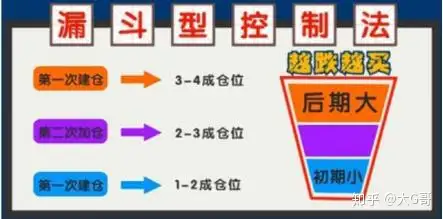

---  
title: 仓位管理  
index: true  
icon: editor  
order: 3  
category:  
  - 基础  
  - 大A  
tag:  
  - 雪球  
---  
  
（原文发布于 2016年）  
  
## 介绍  
  
### 仓位是什么？  
  
仓位是指投资者用于投资股票、基金等金融产品的资金占全部投资资金的比例。举个例子，假设你有10万元想用于投资，你把10万元都买了股票，那你就是**满仓**；如果你只买了5万元，那你就是**半仓**；你看好一个行业，买了这个行业7万元的股票，那你就是**重仓**该行业；好了，现在市场行情震荡了，你卖出了一部分，只剩下1万元股票，那就是**轻仓**；如果你全都卖掉，只是观望，那你就是**空仓**。  
  
### 仓位管理  
  
仓位管理，就是投资者在投资过程中，决定如何入场出场，如何止盈止损的一种技术。  
  
对于投资者来说，仓位管理是投资中非常重要的一个环节，良好的仓位管理是投资者能长期战胜市场的必要条件，如果没有科学的仓位管理，有可能给投资带来很大的风险。  
  
有时候投资者容易被热情冲昏了头脑，一股脑全部投进去，然后买在了高位，最终什么也赚不到，还亏了不少。或者有时候投资者可能看到非常有潜力的股票，但却由于前期已满仓现已没有资金投入，眼睁睁看着机会流走。  
  
风险是收益的不确定性，投资者是没有办法做到准确判断市场的，而仓位的作用就是让投资者能这种不确定性中灵活生存，所以我们才需要用仓位管理来控制风险。  
  
### 仓位管理有哪些方法？  
  
仓位管理理论上的方法有以下几种：  
  
1、漏斗形仓位管理  
  
漏斗形仓位管理，顾名思义，像漏斗一样，开始小，后来大。开始进场资金量比较小，轻仓，后面逐步加仓，加仓比例越来越大，逐步摊薄成本。这种方法的优点是能摊薄成本，降低风险。但缺点就是当方向判断错误时，将无法获利出局，因为这种方法是越是反向波动，持仓量就越大，当持仓量过大时就变成了满仓，这时候任何一点波动都会导致爆仓。  
  
所以使用这种方法一定要建立在正确判断的基础上，当行情太过震荡的时候，是不适合用这种方法的。  
  
  
2、矩形仓位管理法  
  
矩形仓位管理法是指初始进场的资金量，占总资金的固定比例，如果行情按相反方向发展，以后逐步加仓，降低成本，加仓都遵循这个固定比例。因为每次都是固定比例，所以形态就像一个矩形。  
  
这种方法的优点是对风险能进行平均分摊，但缺点是如果一开始投入成本较高，会导致越往后越需要更多的资金投入，所以越到后面会越和漏斗形一样容易陷入满仓的状态。  
  
  
3、金字塔形仓位管理  
  
金字塔形仓位管理，即像金字塔一样，一开始进场的资金量比较大，后市如果行情按相反方向运行，则不再加仓，如果方向一致，则逐步加仓，但是加仓比例越来越小。这种方法的优点是能利用趋势的持续性来增加仓位，会获得很高的收益。但缺点则是在震荡的市场中比较难获得收益，初始仓位较重，对投资者要求较高。  
  
  
无论是矩形仓位还是金字塔形仓位，都告诉我们，投资者在投资的过程中，切忌一开始就投入太多资金，即使你非常看好一个行业或股票，也不要第一次就下太多赌注。  
  
在实际的操作中也不是死磕一种方法，而是应该结合实际的情况灵活选择或者结合。  
  
### 实际操作需要注意的几个方面  
  
1、牛市警惕满仓  
  
牛市基本上所有的股票都在涨，这个时候大家可能会有盲目乐观的情绪，满仓的概率很高，甚至满仓加杠杆也不在少数。但是大家必须注意的一点是，满仓是特别危险的操作，需要承当相当大的风险，除非有非常良好的现金流入，否则一旦风口转变，会被打得措手不及。特别是在牛市后期，这个时候的融资风险非常大，需要警惕满仓加杠杆。  
  
在牛市中，如果你持有的股票已经长期上涨，估值明显过高，或者整个市场上所有的股票都轮番上涨，市场参与者的热情过分高涨了，这个时候就应该提高警惕了。历史的经验告诉我们，市场最疯狂的时候，也是危险最大的时候，这个时候最好逐步减仓。  
  
2、熊市不一定空仓或轻仓  
  
当股市持续下跌，期间不见反弹的时候，这个时候最完美的状态就是空仓。当然现实中不一定能做到，但投资者至少要控制在轻仓的状态。但是，当熊市跌到快见底了，市场很长时间低迷、股指波动率不大、指数已经处于历史低位，这个时候反而是投资者应该入场布局的一个状态。  
  
过去的每一个历史低位，大部分的股票都处于被低估的状态，相当于打折售卖，这个时候的风险是非常低的，以往牛市中能最终获利的那部分人基本都是在熊市建仓的，所以有能力的投资者这个时候可以采用金字塔形仓位管理方法去进行建仓管理。  
  
3、单一个股持有上限不要超过总资金的三分之一。  
  
即使你非常看好一个股票，仓位也不要超过33.33%，这是因为如果你的仓位太大，调仓会比较困难。你即使十次满仓买单一个股，十次都盈利了，但只要第十一次碰上了震荡就会满盘皆输。重仓单一个股会让你的风险系数加大，投资中应该把鸡蛋放在不同的篮子里才能起到分散风险的作用。  
  
而且个股持有比例过大也会让你在后续看到更好的投资标的时没有足够的资金去买入而错失了机会。这就好比明明之前手里有一把种子，却全部撒在一块土地上了，现在又找到了一块更肥沃的土地，但却没有种子了。  
  
4、分批建仓，加仓别超过3次。  
  
准确判断趋势是非常困难的，前面说到的三种理论上的方法都是分批建仓。像漏斗形和矩形也告诉我们，当加仓次数过多会导致持仓量过大，达到一定的程度后，就会变成重仓甚至满仓，这个时候，任何一点风吹草动都会让前面的准备功亏一篑。所以在进行投资的时候，一定要控制好加仓的次数，行情一旦往不可挽回的方向发展，则最好及时止损。  
  
5、仓位配比按照长期、中期、短期三部分配比  
  
仓位配比要按照长期持股、中期持股、短期持股三个部分去配比，长期的比例最高，中期次之，短期最小。  
  
长期持有的那部分股票一定是你看好的未来有发展潜质的股票，这部分的股票通常来说风险相对可控，所以在仓位配比上可以较高。意思就是留多一点钱买你准备长期持有的股票。  
  
中期持有的股票适中，这部分股票也许还在观察期，配比一定不能超过长期持有的那部分。  
  
短期持有的股票通常都是带有投机性质的，所以最好用小部分的资金去博弈。  
  
仓位管理在投资中是一个不能忽视的环节，好的仓位管理可以帮助投资者获得更高的收益，也可以帮助投资者更好地抵御风险，在实际的操作环节中，仓位管理一定是轮动灵活进行的，投资者切忌一味追求高收益，应该在市场的不同时段结合自身的风险承受能力采用最适合的方式进行。  
  
## 散户如何学习仓位管理  
  
### 一、仓位管理的重要性  
  
对于仓位管理首先我们要明白是否重要？此前我在《穿越牛熊》书中也简单提过仓位管理，但是并没有详细谈仓位管理的不同情况和环境下的策略，今天我详细的谈谈各种情况和环境下的策略。  
  
1.盈亏同源。仓位管理的效果有时候对大多数人来说最终的结果就是盈亏同源，因为通过往往通过低仓位躲过大跌的同时，往往也会因为低仓位而错失部分上涨。这是一个无法回避的问题，能做到一减仓就跌，一加仓就涨的人，实在是极少数的天才。  
  
2.我们有没有做仓位管理呢 对于有没有必要做仓位管理，我觉得如果你是一个追求稳健平稳收益 的人，那么是有必要做仓位管理的。因为市场是具有一定股确定性的，我们必须承认无论任何人对市场的判断都无法每次百分之百正确，那么仓位管理的作用就是在我们无法获得非常大概率的情况下，对没有非常大把握情况下的一种防范补救措施。  
  
例如： 假如你很看好几只长线股，但市场整体的系统性风险有很大，当市场出现持续下跌，而你看好的个股非常便宜时，这时如果你前期是满仓，没有现金在手上，那么这时看见便宜货，自己却没有钱买，那么此时就很被动。好比眼见地上躺着白花花的银子，而自己却无法弯下腰去拾起的痛苦。这种痛苦想必投资经历稍微长一点的都经历过，尤其经历过股灾的人。而此时如果你持有的是半仓你非常看好的长线股，那些经过下跌而非常便宜的廉价筹码你就可以趁机捡起买入，从而获得较好的后期收益和减少账户的回撤。有人可能会问，为什么当你感觉市场整体系统性风险较大时你不干脆直接空仓呢？因为这就如我们前面说的盈亏同源。我们的投资都是建立在自己丰富经验的分析判断下做出的概率选择，换句话说及时一个高手对市场的判断也只会是大多数判断正确，而部分是会判断错误的。基于此，我们在考虑问题时可能会出现判断失误，提前下车，市场不跌反而大涨了，那么这时你空仓反应过来再追入时可能成本就会提高很多，更可能你已经不敢买入了而错失一只牛股。因此，仓位管理是一种可以使投资收益更平稳，同时减少被动局面的策略，对于稳健投资者是比较重要的策略。  
  
### 二、不同投资策略的仓位选择  
  
投资大致分为长线、中线（大波段）和短线（小波段），不同的人，不同的性格，不同的经历，不同的能力，不同的股，那么选择持仓时间长短会有所不同。  
  
①、牛市的仓位选择 牛市仓位比较好选择，也比较好做，在牛市里个股普涨，实际上只需满仓持有就行了。当然这时可能还有问题，因为人性往往是贪心的，在牛市赚了钱往往希望乘胜追击，再接再厉。所以有的就会不断增加本金投入，甚至融资借钱加杠杆，两倍仓位、三倍仓位的都会有，这时仓位很多就处于超配阶段。对于杠杆这个东西怎么说呢，在合适时机用好了可以使收益率快速增长，但是一旦没有用好，那么在股灾和期货市场爆仓和资产大幅缩水的例子比比皆是。虽然牛市初中期我也曾用过低杠杆比例融资，但是我不建议大家去融资，因为融资相对安全时期是在牛市的初中期，牛市后期和熊市融资风险是很大的，融资的结果往往惨不忍睹。所以在牛市普涨时期，你只需要用自己的资金满仓持有就好，但需要注意的是，当发现很多个股经过长期上涨，估值明显泡沫严重，而这时股价却无厘头的连续加速暴涨，这时往往你就要注意减仓了，因为多年的经验告诉我往往涨的最诱人的时期就是主力将要出货的高风险时期，这时一定要克服贪婪，不要高位加仓或者融资，一定要反人性的逐步减仓。  
  
②、熊市的仓位选择 对于单边下跌熊市同样也是最简单的仓位选择，最好的选择不用问，当然是空仓。有人或许会说，熊市里也有股票上涨的，也有人赚钱的啊。确实如此，熊市里也有极少数股票会上涨，比如老板电器、索菲亚等，也有人能赚钱而在市场中穿越牛熊的，不过这需要经验丰富、选股能力和投资交易能力很强的少数人，必定大多数人都不具备这些素质。因此对于大部分人在熊市还是适合空仓或者轻仓。为什么我没有说直接都空仓呢？因为熊市实际上也是一个很好历练期，不经历风雨怎么见彩虹，熊市对投资者的素质和各方面的能力是极大考验，如果你想牛市里砍柴（财）收获，那么你就应该在熊市里磨好刀。但要记住的就是，在熊市里磨刀不要重仓，只能非常小的仓位做实验，以此增加自己的投资经验，以待它日牛市再来时。  
  
③、震荡市的仓位选择 震荡市里仓位选择是最考验人的，实际上要结合长短线和综合能力来选择仓位。由于震荡市中，市场处于盘整运行，大部分个股都是涨涨跌跌，所以在震荡市并不适合长线持有不动，大波段操作比较适合在这种股行情下生存。在震荡市的行情中，市场忽上忽下，往往这时我们采取上涨出现乏力后就卖出部分，出现调整缩量后就加点，保持涨时手中有股赚钱，跌时有钱买股，这样时刻掌握主动性，是比较好的策略。  
  
## 仓位管理的四个层次  
  
今日股友闲聊，其说前期的牛股现在大部分步入调整，市场转向，意味着市场要下跌了。我没有否定这个股友的意思，而且其本人水平很高，往往有不俗的表现。  
  
我只是想说，这个股友的这种话，炒股的经常听到，也经常这样说。平常到大家都*以为常，以为炒股就应该这样。  
  
其实这种方法，叫做主动性仓位管理。  
  
1、主动仓位管理。  
  
就像在驾驶汽车的过程中，驾驶员根据视线所及，预判收益和风险，不断的调整方向盘一样。这种方法的前提，是你开了上帝视角，或者说，只有比你的汽车聪明的情况下（这里有个假设，就是你比市场聪明），才适宜主动驾驶。一般的技术手段，其实都是在寻找主动仓位管理的诀窍。  
  
2、被动安全管理。  
  
就是你炒股过程中，不预测指数，不根据指数的涨跌来操作自己的仓位。只在自己的持股上涨或者下跌的情况下，按照设定好的价位触发操作。这就像汽车的被动安全装备，ABS只有在轮胎打滑的时候起作用，安全带只有在摩擦力大的时候抱死，安全气囊只有在撞车的时候才释放。  
  
也就是说，被动安全管理，只有事后措施。不会在事前卖出股票避免下跌，而是在跌了之后，才决定是割肉是补仓，也不会在事前追涨，而只会在涨了之后，才确定是否止盈或者追涨。  
  
如果什么都没有发生，则不浪费时间预测，呆呆的持股。  
  
3、满仓分散配置，轮动。  
  
为什么美股的被动投资基金跑赢了大部分主动基金经理。这其实是一个概率问题，因为回首往事，我们会看到美股是长期牛市，所以最好的事后策略是永远满仓。但是主动基金有三个选择，做多，做空，部分做多（择时），如果被动基金的选择，代表了唯一的正确，而主动基金的选择只有部分是正确的，从概率上来说，主动基金长期来看就会必输。  
  
所以后来又出现了新的仓位管理方法，就是如果确定长期牛市。  
  
则采取满仓主动配置，分散持仓，被动安全的方法，每个季度根据股价和公司业务表现来轮动。  
  
4、永远买买买的仓位管理。  
  
如果一个人的水平足够高，像巴菲特那样，会产生马太效应，普通人为了提高收益，会把钱委托给其管理，于是，出现了持续的股息现金流入和投资性现金流入。这就进入了永远买买买的模式。  
  
## 仓位管理的三套解决方案  
  
### 第一套方案——“三要三不原则”  
  
所谓“三要三不原则”就是：投资者在做股票投资时，一定要留下孩子的奶粉钱，一定要留下老婆的化妆费，一定要留下的老人的医药费，千万不要卖房炒股，千万不要辞职炒股，千万不要借钱炒股。  
  
“三要”的精髓一句话概括就是：余钱投资。“三不”的精髓一句话概括就是：理性投资。  
  
说白了，就是投资结果不能百分之百确定成功，所以我们投资活动一定要为自己预留空间。  
也就是三个字的真经——留余地。  
为了让“三要三不”原则更有操作性，我还对仓位管理提出了一个比较具体的量化标准，即：拿出不超过你积蓄的四分之一、最多不超过三分之一的部分进行投资。  
  
**这套方案，显然是为初入股市的、纯粹的投资小白准备的**。  
为什么建议投资小白留下那么大的投资余地——积蓄的四分之三或三分之二——呢？  
主要基于以下几点考虑：  
一是投资小白初涉股市，多为股市财富效应吸引。也就是说，股市不涨，小白不买股票；股市涨得不多，小白也不会买股票。等到他看到身边的人都买了，赚了好多钱再买，行情大多已到中后期了。  
所以牛市中我经常在雪球长短帖中反复唠叨这样几句话：记住，你来晚了，这回牛市你注定赚不了钱的，你注定赔钱亏损的命，如果不是想来玩的，这次你就是来学习的，交点学费是应该的，所以好好学习，记住下次牛市才是你大展身手的时候。  
二是投资小白初涉股市，投资知识一穷二白，哪怕他入市的时机在因缘巧合下处于股市最低点，他恐怕也很难在未来的牛市行情中赚到多少金钱财宝。他不懂股市是什么，他不知道股票的评价标准是什么，他亦没有零星半点的操作技巧，“一分钟满仓一分钟空仓”可能就是他的操作常态。行情好时赚不多，行情差时亏不少。所以，最终，极有可能还是以亏损告终。钱不知道是怎么挣来的，所以也经常在稀里糊涂中失去。这番道理，不啻股市，古今中外，并无二致。  
三是投资小白初涉股市，最容易发生的是交易心态与持仓心理的扭曲。没有脑子，没有知识，没有经验，我谓之“股市三无人员”。赚的时候洋洋得意，以为是自己的本事，亏的时候跺脚骂娘，以为是天下人都在坑自己。这样的心态，是失衡的心态，是癫狂的心态，是覆亡的心态。“手有余粮，心中不慌”。所以，我建议给他留足留够过冬的钱粮。  
四是投资小白初涉股市，很多人虽难免被收割、甚至被淘汰的命运，但更多的人一定会留在这个市场中，在磨难中聪明和成长起来。这部分人，既需要东山再起的勇气，更需要东山再起的资本。所谓“一分钱难倒英雄汉”，若有丰厚的家底在手，重新出发再整山河的底气就会足很多。  
可以说，正是因为看透了大部分投资小白初涉股市的投资宿命，所以我告诫、甚至恨不得飞身阻拦他们不计后果前赴后继的疯狂投火行为——也正是因为看透了大部分投资小白初涉股市的投资宿命，所以我才会在作仓位建议时，给他们设计了一条可以重新出发和上路的方案。  
我知道这番美意未必人人都能接受——事实上，我因此而得到了“话痨先生”的绰号——但佛度有缘人，我坚信，肯定有人会在我这絮絮叨叨的重复中受益。  
一百个人中哪怕只有一个人相信，也是有意义的。而且我坚信，剩下的九十九人中，在栽了跟头后一定会有更多的人回到我的身边来，重新认识我当时的忠告——这份反思，笃定会让他们更深刻地认识和理解“三要三不”原则，从而改善、甚至拯救未来的投资之路。  
  
四分之一或三分之一的妙处在于：在行情不好、大幅套牢或亏损之后，或者在你股市经验大幅增长、成熟之后，你还有足够的余钱进行加仓、补进。  
莫说新手，就是老手，在困难时期，有余粮与没余粮，心理感受也是完全不一样的——好心态下与坏心态下，你所做的投资决策，极有可能会产生云泥之差！  
这一点，不难理解吧？  
  
### 第二套方案——乘九法则  
  
乘九法则的具体内容，我在以前的雪球长帖中有过介绍，在《投资大白话》中也专设一章进行了更详细更系统的介绍，我这里不再废话了，只谈它的作用——两点：  
第一，它对不同年龄段的人，对股市投资所占总资产的比重作了建议；  
第二，它对大盘不同的点位，对股票账户的仓位管理作了建议。  
我们以前常说：不同的人不同的年龄段不同的风险承受能力不同的市场状况，仓位控制当然会所不同。  
乘九法则，就是对这番说法的细化。  
  
很多朋友会说：“三要三不原则”在很多方面是跟乘九法则相冲突的呀，比如“三要三不原则”告诫我们投入股票的钱最多不要超过积蓄的三分之一，而依据你的乘九法则，20岁的时候，你投入股票的钱却可以占据你总资产的82%！一则比例冲突，前者三分之一，后者82%，二则基数不同，前者的基数是积蓄，后者的基数是总资产。两相对比，前者比例极低，后者比例又似乎极高。  
  
呵呵，有此疑问的朋友，恭喜——您已经开始学会独立思考了，这是入门的前奏。  
  
但这个冲突也是很好解释的呀——事实上，我在书中也专门作了交待——“三要三不原则”针对的主要是初涉股市的投资小白，而乘九法则则是针对所有的人：乘九法则是基础，所有的人都应该去遵守，但考虑到小白的四点特殊性，我们可以对乘九法则进行更为苛刻地执行。  
  
再换一种更为通俗易懂的说法吧：对股市什么都不懂的人，应该按照“三要三不原则”进行操作，而经历过“三要三不原则”洗礼的人，也就是说，在股市中有一定经验和能耐的人，应该按照乘九法则操作。  
  
既可以说“三要三不”是乘九法则的简化版，也可以说乘九法则是“三要三不”的升级版。  
  
不同的人，承受能力不同，交易目的不同，心态和能耐也完全不同，所以体现于仓位管理上，这是一个很复杂，很难一句话两句话就能说得清的问题。  
  
而乘九法则，恰巧可以化繁为简。  
  
把复杂的事情简单化——考虑到几乎所有的投资者都需要在交易纪律方面有所修*，所以用乘九法则在加强仓位控制的同时，也能锻炼朋友们交易纪律的养成。  
  
这一段话，我不知道我能讲明白吗？  
明白的话，我们继续——不明白的话，请买我书看，或者，翻我以前雪球长帖看（出书后，我没有删帖——虽然卖书让人讨厌，但从这个角度看，还算是个良心屁V吧？[大笑]）。  
  
### 第三套方案——以睡得着觉为最高标准  
  
行情不好时，经常有朋友问我：TTB啊，我仓位很重呀，睡不着觉呀，怎么办？  
我答：减！  
朋友问：我减了，可还是睡不着觉哇。  
我答：再减！  
朋友问：那我得减到什么时候啊？  
我答：减到你能睡着觉的时候。  
因为我经常写“睡前一帖”，而且经常在睡前一帖的最后说这样的话——“我说完了，睡觉去了”，所以很多朋友都认为TTB睡虫一只，因此我说“减到你能睡着觉”的时候，很多朋友都以为我是在开玩笑的。  
  
其实，我还真是认真的。  
  
股票投资，千方百计，唯心不动。  
怎么理解这句话？  
你可以有一千种一万种投资赚钱的方法，但只有一样东西不可颠覆和触动——那就是你平和安详的内心。  
市场可以失衡——甚至可以说，聪明的投资者从不惧怕市场的失衡，反会非常欢迎这种来自市场的失衡，因为找到失衡，基本就意味着找到了赚钱的方法——但内心不可以失衡。  
若内心失衡——也即精神错乱——则投资八成要出事故。  
市场失衡，平和的心可以去作冷静的判断，心若失衡，如何正确的判断？  
世上的确有歪打正着的事情——但你不能总希望依靠歪打正着的运气带给你一帆风顺的命运——尤其是投资的世界，我们不可能总是依靠歪打正着来生存和发展吧？  
  
对于投资小白来说，在任何环境下，把仓位降低到能让自己心安的地步，都是正确的。哪怕你减完仓后股价又飙涨上去了，也算不上错误。因为这只意味着你少挣了钱而已。挣再多的钱，也不会让你能有两条命。但一旦下跌，若满仓操作，则可能就是要命的事情。猫有九命，狗有三命，人有一命。珍惜生命，匹夫有责。  
但是对于投资高手、老手来说，心安则有另外一层更加丰富的意义。  
说白了，“三要三不”是小白的菜，乘九法则是有一定投资经验人的菜，它们的提出，归根结底都是建立在对投资者投资能力不信任的基础上的。  
而心安原则，则更多的是对投资老手的要求。  
实际上是对前两套方案条条杠杠的完全释放：如果你有足够的经验，有正确的投资方法，有足够厚实的抗击打能力，有自己独特而坚定的投资判断，你完全可以忽视仓位对你的限制——只要你心安理得并能在这种心安理得中长久地生存下去并获得足够的盈利即可。  
  
试问，巴菲特有仓位控制吗？  
有的——不然他如何在众人惶惶时有钱抄底呢？  
试问，巴菲特会遵守“三要三不”或乘九法则吗？  
笑话——投资大师从来都是遵守规则而不遵守标准的，世上所有的标准都是为菜鸟准备的，大师凭空遨翔，靠的仅仅是规律而已。  
格雷厄姆提出“股债平衡”方案，在书中也明确地告诉我们，这是基于普通人的人性而言的。《聪明的投资者》其实就是写给普通人的。所以我们常常看到：唉，怎么那个某某投资大师的投资手法好像跟《聪明投资者》上说的不太一样唉！  
呵呵，能一样吗？  
前者针对的对象是普通投资者，后边你谈论的那位本身就是投资大师。  
前者提出的是标准，后者利用的是规律。  
拿这两者进行对比，当然滑天下之大稽！  
  
从“三要三不”，到乘九法则，再到心安即可，这是一棵韭菜，从投资小白到普通投资者，最终再到投资高手的进阶修炼之道。  
所以，我在《投资大白话》中提出的三套仓位管理方案，既是方案，更是路径。  
认识到这一点，读起这本书来，才会更有意思。  
