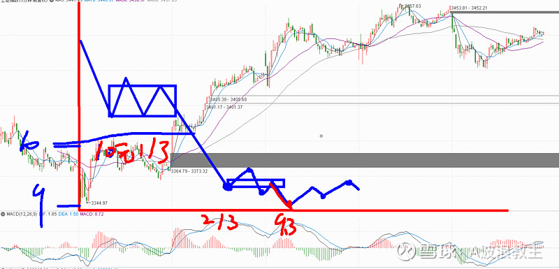

---
title: 股市生存绝技：分仓术
index: true
icon: file
order: 6
category:
  - 基础
  - 大A
tag:  
  - 雪球
---  

（[原文](https://xueqiu.com/1613417401/176010552)发布于 2021-03-31）  

## 股市生存绝技：分仓术  

一般来讲，股市里有两种人喜欢满仓操作。  

一种是股市新手，一种是万中选一的绝世高手。股市新手总是觉得不满仓进场就让资金闲置了，而绝世高手则是艺高人胆大。  

对于多数人来说，满仓是最差的仓位策略。  

满仓，往往带有一种非理性的赌博色彩，ALL IN！豪赌一把梭……  

做交易，特别是想在股市长久生存下去，理性的仓位管理是“分仓”。  

下面我们举例详解分仓技术的运用和好处。  

### 分仓操作的好处之一：少亏多赚  

假设有1万元的本金，我们看好一只10元的股票，建立3成底仓，即用了3K资金。  

如果建仓后股票不涨反跌，跌到9元时我们亏损了10%，止损离场。这次交易亏损了3K*10%=300元（忽略手续费，下同），是总本金1万元的3%，是不是一下子觉得不那么难受了？如果是满仓进场，则会硬生生亏损10%。  

如果建仓后股票如期上涨，假设涨到了11.5元又跌到11元，这时我们根据技术判断11元可以加仓，我们再买3成，使用资金3.3K。手里的总仓位变为6成，成本是（10+11）/2=10.5元。手里尚余3.7K的资金。  

当下股价是11元，持仓成本是10.5元，有了一定的利润垫，可以把10.5元或者10.75元作为止损位，万一第二次加仓后股价没有继续上攻，则随时可以全身而退。  

假设11元加仓后股价继续上涨了，比如涨到12.5元又跌回11.5元，根据个股走势和大盘环境我们综合判断它已经形成了明确升势且上涨结构没有完成，那么我们就可以在11.5元附近做第二次加仓，将剩余的3.7K最大化买入该股，3700/11.5≈300股，这时我们基本就是满仓了，一共900股仓位，这个总仓位的成本是（10+11+11.5）/3=10.83元，而这时股价是11.5元，我们依然有不错的利润垫，保障随时可以微利出局。  

正常情况下肯定就是等着主操作级别的上涨全部完成了，期间如果有次级别的卖点，可以用3成仓位先高抛后低吸。就算持股过程中不去倒差价，假设股价上涨走势完成时涨到了14.5元我们清仓离场，那我们的利润是（14.5-10.83）*900=3303元，按总本金1万元算，我们这次交易的获利达到了+33%。  

这个例子中可以看到，一次完整的交易过程，亏损时最多亏损总本金的3%，如果一开始方向正确，当股价走势不符合预期，我们至少能保本离场，然后再找下一个机会。而如果股价走势符合预期，那么我们离场时最大利润可以达到+33%。  

这就是分仓技术的威力，它让你亏时少亏，赚时多赚。  

### 分仓操作的好处之二：扭亏为盈  

先讲讲关于分仓的仓位到底该如何分配。  

一般而言，有两种分仓比例的设定方法，实战中任选一种都行，根据个人资金量情况，还可以在此基础上更加精细化分配仓位。  

第一种，按照自己设定的主交易级别来定仓位。假设是按日线级别进行交易，那么发生日线级别的买点，可以买半仓（5成仓位）；如果是次级别的买点，可买30%即3成仓位；如果是次次级别的买点，可买20%即2成仓位。如果同时发生本级别和次级别买点，那么最大可以买5+3=8成仓位。一般而言，至少要保留20%的资金作为机动。  

第二种，按照买点的确定性来定仓位。这种方法比较简单，就是把总仓位分为两份或三份，买点的确定性高可以直接买半仓，确定性一般就只买1/3仓。再就是看自己技术水平，水平一般，每次最好只买1/3仓，如果自忖技术还行，那每次就买1/2仓。如果资金量很大，需提前计划好总共可以同时持有多少只股票，假设200万元本金，计划最多持有4只股票，那么每只股票的可用总仓位就是50万元，当发生买点时就先买半仓，即25万元底仓。  

我们所说的仓位比例，都是指计划某只股票总仓位的百分比，而不是总资金的百分比。只有当所有本金仅打算交易一只股票时，仓位比例才是指总资金的使用比例。那些大资金的分仓更细，会计划更多操作标的，每只股票又会将仓位分成10份乃至20份，根据具体走势来进出。  

现在我们举例讲讲如何运用分仓技术扭亏为盈。  

实战交易中，股价走势可能会受大盘影响或个股突发利空影响，或因我们自身技术不够精熟而导致买点失败，这时就能显现出分仓技术的妙处。  

因为缠论某级别的三类买卖点，最终都可以归结为次级别的一买，所以我们用一买来模拟演示如何用分仓技术把一笔亏损的交易变为盈利。  

假设某个第一类买点入场后，股价出乎意料地继续创新低，技术水平低的人当然最好是直接止损另等入场机会，但水平高点的人就可以运用分仓技术跟踪操作。假设我们10元买入某只股票1/3仓，该股却跌到了9元，在反复确认个股次级别、次次级别调整结构完成发生新的背驰一买时再加仓2/3仓，这样综合成本就降到了9.33元。  

如此，即便该股一买后的反弹很弱，也仅需上涨3.7%就可以解套。我们有理由相信，在第一次一买失败后股价又下挫了一段，这时发生新的一买成功率应该很高。从前面那个失败一买10元跌到新的一买9元，已经又跌去10%，那么反弹5%的期望并不算高。  
  

一旦解套时，有两种操作方案：  

1、把底部加仓的2/3仓出掉，剩余1/3底仓的成本依然在9.33元附近，然后继续观察后续走势，按技术买点再逐步加仓。（发现没有？第一次买的1/3仓成本10元降到了9.33元。）假设该股反弹到10元附近完成了次级别上涨结构则清仓出局，成功地把一次亏损变为了获利。【这种操作方案适合长期跟踪看好的股票进行反复操作。】  

2、当9元加满仓后，一旦解套获利，不管盈利多少，直接清仓出局。如果相信有的股票跟你有缘而有些无缘，那么建立底仓就让你亏损的票，一旦有机会盈利最好就出局并另外选股。【这种处理方案适合针对个股的短线操作。】  

如果第一次就满仓进场，一旦遇到买点判断失误或市场突发性风险导致买点失败就会非常被动。心理素质好、反应快的人可以忍痛割肉先规避风险，反应慢或不能严格执行止损的人则会在蒙受资金损失（或套牢）的同时，错过下一次机会。  

### 分仓操作的好处之三：游刃有余  

市场的老手都听说过这样一句话：永远不要满仓。特别是玩过期货或外汇这些高杠杆品种的人都知道，如果起了贪心而满仓操作，一个意外波动就可以直接导致爆仓，一夜回到解放前。  

历史上一些著名交易大师都曾因为在错误的交易方向上重仓而导致破产。实际上很多时候他们看准的交易方向没有错，只是转势期间反复波动过大或他们看准的走势方向延迟了一段时间才发生。而避免这种错误的最佳方法就是控制好头寸，即管理好仓位。  

当我们看好一只股票并买入半仓后，也许股价的运行符合我们的预期，但上涨得并不足够快，也就是处于应该“持股待涨”的阶段，这时可能我们会发现另一个股票更好的买点机会，这时我们预留的半仓资金就用上了，说不定后面买入的这只比前面那只涨的更快更猛。而如果我们一开始就满仓了第一支股票，那么后面这个更好的机会就只能眼睁睁地错过。  

当然，有人可能会说，我先满仓第一支股票，如果后面看到有更好的机会，我就卖出第一支股票的一半仓位来买后面这只票。那么，请想一想，如果发生第二只股票买入机会的时候，第一支股票还没有赚钱怎么办呢？难道割掉一半的仓位再来买后面这只？万一后面这只走得还不如第一只票呢？  

所以，永远保留一定的机动仓位是有很多好处的。就算是长期跟踪操作单只股票，保有一定的机动资金，也可以在这只股票小级别走势完成时进行高抛低吸，不断降低原有持仓的成本。  

在A股市场，分仓的做法还有个特殊好处是“避雷”。  

如果满仓一只股票，它突然停牌，没法交易了，那就只有天天啃手指玩了。又或者满仓的股票突然触雷，啪啪啪几个跌停板下来，那就亏大了，搞不好要出人命。  

只有分仓，操作才能游刃有余。  

今天，你学会分仓了吗？  
