---  
title: 成交量解读  
index: true  
icon: editor  
order: 5  
category:  
  - 基础  
  - 大A  
tag:  
  - 雪球  
---  
  
（原文发布于 2022-07-01 16:09）  
  
## 第一部分：VOL的含义与意义  
  
俗话说，成交量就是胆量。那究竟什么是成交量呢？简单理解,成交量VOL就是阶段时间内股票买卖双方达成交易的数量。一般可以用成交股数和成交金额两项指标来衡量，这两项指标在沪深交易所上都有显示。大家一般看到的VOL统计的就是成交股数，而成交金额则需要手动把鼠标挪到对应的K线待它弹出成交明细框，明细中就有成交金额。  
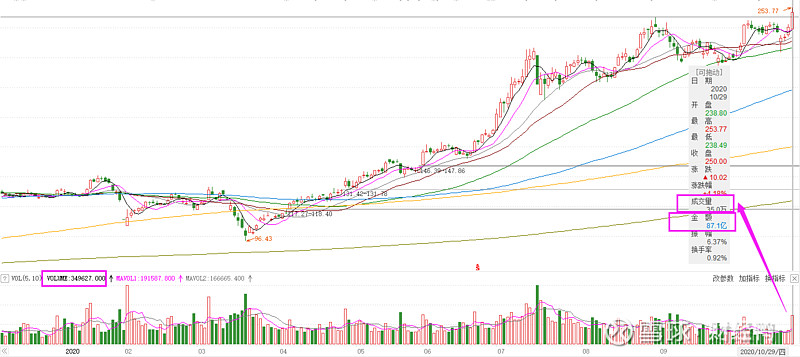  

另外，成交量可谓股市中最不会骗人甚至可以说是股市中唯一一个不会骗人的指标。因为交易达成才会统计进去，没有达成就不会统计。例如你买入10万股，同时你的对手卖出10万股，这里成交的10万才会被统计到指标上。如果仅仅有买的行为或者仅仅有卖的行为是不能成交也不会被统计的。所以，成交量都是真金白银堆出来的，是最能够真实反映市场成交金额和活跃度的指标。  

当然，成交量也可以短期作假，因为机构可以通过“自买自卖”来故意产生一些无中生有的成交量，通过带量的假突破来吸引资金进场接盘。但如果把周期放长，那么成交量做假成交极高极难，也没有必要。而且放量可以作假，但缩量就一定是真的。所以所有传统指标中，成交量是最不会骗人的指标，意义不言而喻。  

## 第二部分：VOL的几种形态和对应用法  

从形态来看，VOL柱体有高低和颜色之分。高代表成交数量很大，低（是高柱子的1/3左右）代表成交量很小。红色代表当天收的是阳线，绿色则代表当天收阴线。它和其他传统指标不同，它的形态看似简单，只有红绿柱子，但这些柱子构建的形态却多样，而且在不同位置出现的同类形态用法也不尽不同。  
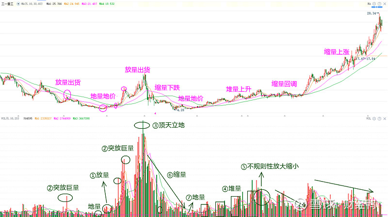  

### 1、放量（温和放量）  

温和放量是指股票在持续低迷之后，成交量突然出现小幅增长，此时说明市场正有资金介入。这种形态看上去像一座山，所以也叫“量堆”，但注意不要和动词“堆量”混淆。另外温和放量在形态上会直观表现为柱子顶点的连线呈平滑的抛物线上升。之所以会出现温和变化，是因为主力在有意识的吸筹，为了不引起市场关注，它会刻意调控让股价和成交量都限制在一个温和变化的水平。  

温和放量在不同位置出现意义是不同的，其中在相对低位和长期地量后出现最有技术意义。此时的温和放量有可能是长线主力在试探性建仓，后续很大可能会有一波上涨行情。不过底部出现的温和放量一般都会有一次缩量回调来巩固，不跌破放量前的股价低位，才能考虑出手；如果连主力建仓成本区都跌破，则说明抛压较大，会继续调整，不易出手。例如下图的中国联通，经过漫长的缩量下跌后出现地量地价，资金进场抄底，成交量温和放大，股价对应小幅上涨。但此时并不是最佳买点。最佳买点应该是图中回调时并未跌破而且快速放量突破箱体的②号位置。  
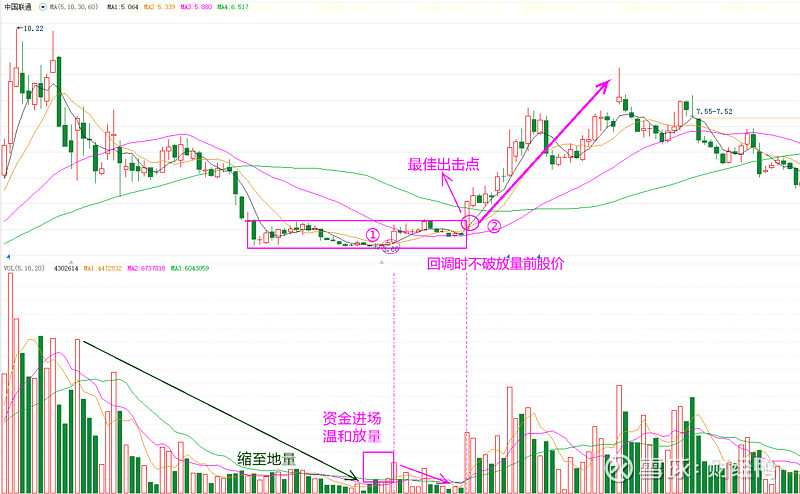  

### 2、放量（突放巨量）  

所谓的突放巨量就是成交量之前一直都比较稳定，但突然某天成交非常活跃，柱子显得异常突兀。这种情况说明的是市场上投资者对股票后市走势分歧非常大，有人清盘抛出，有人极力大笔吸筹。而突放巨量这种情况一般都发生在趋势的转折处，简单可以细分为三种情况：第一种是上涨末端，股价比较高了，某一天突放巨量，说明多方力量消耗殆尽，继续上涨概率低，卖出信号。第二种情况恰恰相反，是发生在下降末端，此时比较低了，某一天突放巨量，说明空方力量消耗殆尽，大概率是最后一跌，买入信号。还有一种情况则是在下跌中途，突然莫名放量，视觉效果瞩目，而在K线上一般都是跳高上涨或跳空涨停。那此时就要十分警惕，这种很可能是主力对倒诱多陷阱，一旦接盘就很容易被套在本山腰。总而言之，突放巨量只有在股价低位或长期下跌末端出现，才是看多信号，至于股价阶段涨高或下跌途中的“一柱擎天”都是需要警惕。  

如下图所示的中船科技，左边的①号位置所框的三根大长柱，都是主力在下跌途中的诱多出货，如果误以为是趋势反转从而买入，就要承受更多的损失。而图中②号位置缩量下降末端，开始有资金进场，然后再次放量突破箱体上沿时则为低位启动点，如果买入可以收获接下来的主升浪。而股价加速拉升后，乖离较高，此时高位放巨量，大资金出逃，则是卖出信号。果不其然，接下来股价一路走跌。  
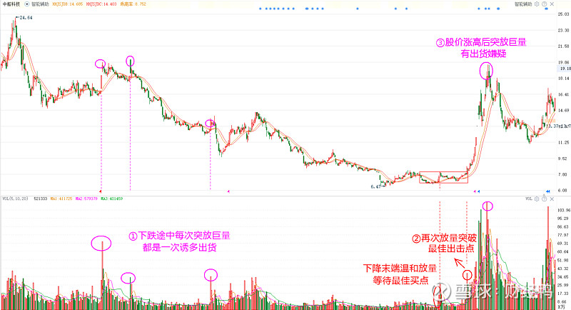  

### 3、放量（顶天立地）  

如果某股票某天出现巨量阳线，且在成交量柱体图上出现半年来最长的柱体，此时VOL最高点还是定格的，这种形态我们就称为VOL的“顶天立地”。当这种形态出现在低位，暗示主力在大力建仓，接下来经过震荡洗盘后底部会逐步抬高，最后一旦放量突破平台，必有机会。因为有“顶天立地”的极端巨量，那被套资金或抄底潜伏资金待休整后就必然爆发。就好像下图的新和成，底部出现绝对量的顶天立地形态，然后主力震荡整理，表现出来就是芝麻量洗盘，而且这个过程股价底部依然在抬升，说明有资金在托底保护，那么后续当它再次放量突破平台就是行情启动机会。  
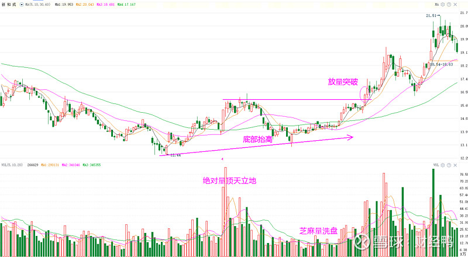  

### 4、堆量（成交量像手机信号格一样）  

堆量是放量的一种形态，它是指股票在连续几个交易日或者一段时间内，成交量缓慢放大，价格也慢慢推高，即量价齐升。既然是属于放量的一种，那同样要注意堆量出现的位置。如果是在股价较高时出现，可能是主力有意拉高出货，故意把成交量做得非常漂亮，诱多接盘。这种高位堆量后，最后往往都会有一个突放巨量从而全部出货。相反如果是在股价低位堆量，那么量堆做得越漂亮，后市行情越可观。所谓的漂亮是指每一次的回调都不破前期平台。那  

充分堆量后再突放巨量，就会进入拉升阶段。例如下图的瑞泰科技，低位堆量时，量堆一个比一个高，然后股价盘旋上升，每次回撤都在前方平台处得到支撑。然后股价阶段涨高后，高位堆量，股价果然也接近阶段顶部，最后放量出货。  
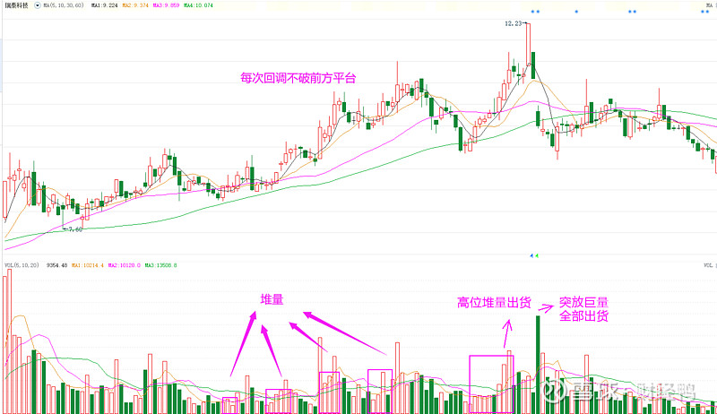  

### 5、不规则性放大缩小  

不规则性放大缩小的形态一般会出现在前面有过巨量放出之后，因为放巨量后市场对股票会有一个从分歧到再次看法一致的回归过程，但这个过程也是在争议对抗中完成的，只是分歧开始减少而已，所以表现到成交量上可能就会是一天放大一天缩小等等的不规则形态。对于这种情况，我们要重点分析为什么前面会突放巨量？如果是因为利好、大盘企稳等等，那这种放量是好事。但如果没有什么明显上涨理由，却莫名突放巨量，那就可能是有人想通过制造漂亮的成交量来诱多接盘从而出货。如下图例子，堆量拉升，高位放量出货，但接下来股价高位横盘，成交量一大一小，没有规律可言。此时某天成交量之所以能放大但股价滞涨，就是因为主力自买自卖制造假的成交量来诱骗散户资金进场。  
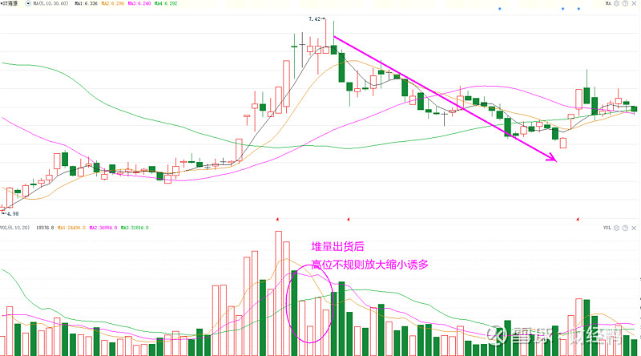  

### 6、缩量（温和缩量）  

所谓的缩量即成交量萎缩，甚至只有寥寥几笔，表现到VOL上就是柱体短。之所以会出现缩量，是因为市场上投资者对该股后市的股价走势看法不一，要么都看涨锁仓不卖，要么都看跌不抄底。那究竟是看涨还是看跌，温和缩量这种买卖其中一方较多的形态一般会发生在趋势中期，所以要对上升趋势和下降趋势区别对待。下降趋势中，缩量下跌，说明还没有人抄底，还不是真正的底部，坚决出局不参与。等缩量至一定程度，即我们说的跌不动了，或者开始放量上攻，即我们说的箱体突破，再进场布局，安全性更高。而在上升趋势中后期的缩量，则说明主力锁仓不卖，会继续上升，可持股待涨或买入参与，等到股价上冲乏力且突放巨量后再立马卖出。如下图的我武生物，左侧的上升趋势中后期，资金开始锁仓不卖，所以缩量上涨，到了阶段顶部，开始放量出货。而右侧的下降趋势中，放量下跌后一直缩量阴跌，如果不慎提早抄底，就会抄在半山腰。而只有等到飞刀跌到地上动弹了几下，确认真的跌不动了，再抄底，此时VOL的形态特征就是缩量后的再次温和放量，说明资金在抄底了。  
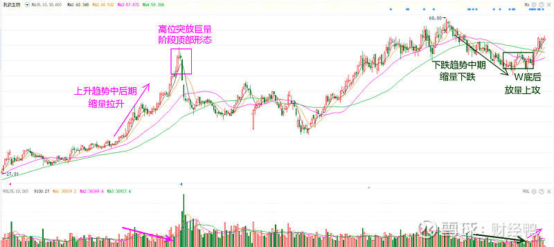  

### 7、缩量（缩至地量见地价）  

地量是缩量的一种极端表现，它是指市场交投极为清淡，成交量创出较长时间段内的最低水平，说明绝大部分投资者对市场后期走势认同度极高。这往往是因为市场人气低迷，交投极不活跃，或者某股票被主力机构高度控盘，其他人无法参与所致。地量又可以分为历史地量、阶段性地量，一般是中长期底部的信号。如下图荣科科技，①号位置明显的历史地量，也是明显的历史低价，接下来走了漂亮的上升趋势。而②③等位置的成交量缩至阶段低点，资金开始进场抄底，于是阶段地量后见地价，果然都趋势反转。注意：如果是在上升趋势中出现了阶段性地量，可能是主力高度控盘拉升或洗盘，股价回落至重要均线如5天、10天、30天等往往是极佳的短线买点。  
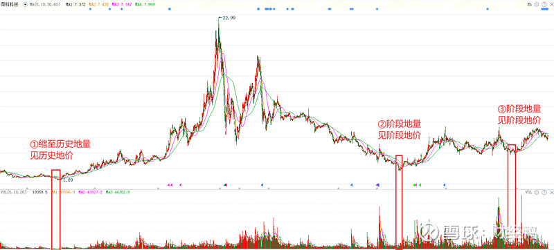  

### 8、VOL其他形态——圆弧底  

成交量作为影响市场的几大要素之一，非常重要，但实际分析时如果能把量价关系等综合分析，结论将更准确，例如当成交量构筑圆弧底时，而股价也形成圆弧底，则信号共振，此时往往表明该股后市将出现较大的上涨机会。所谓的VOL圆弧底是指柱体图上两边高、中间凹的形态。股价的圆弧底同理，此种用法可命名“双圆弧探底”，说明的是场内有人吸筹布局准备结束，那么接下来迎一波上涨行情就是大概率事件。另外，最佳的买入点是k线上的股格从交织到开始多头排列。如下图的掌趣科技，漫长的底部箱体震荡后迎来了股价与成交量的双弧形态，那么，在再次放量突破小箱体之时或者均线从粘合到发散，进入多头排列之际才是一个比较好的抄底时机。  
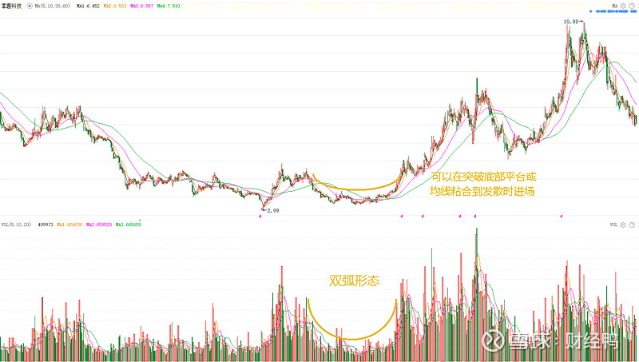  

### 9、VOL其他形态——无量涨停、无量跌停  

在涨跌停板制度下，股票的第一个无量跌停，后市仍将继续跌停，直到有大量出现才能反弹或反转。同理，股票的第一个无量涨停，后市仍将继续涨停，直到有大量出现才能回档或反转。因为无论是无量涨停或跌停，那都是大家看法一致到了极端程度，无量涨停说明都不卖，继续看多；无量跌停说明大家都不愿意割肉，等待反弹。所以二者的必须要等到有放量后才会有反转机会。如下例子，左图股票下跌途中出现第一根无量跌停，说明当天大家都不卖，那接下来第二天依然无量跌停，直到第三天有资金进场买入，成交量放大才扭转了跌势，否则持股者根本无法卖出。而右图例子则是股价跌至谷底后的无量上涨，也是直至获利盘在第三个交易日止盈卖出，其他人才能买入成功，成交量放大才会开板。  
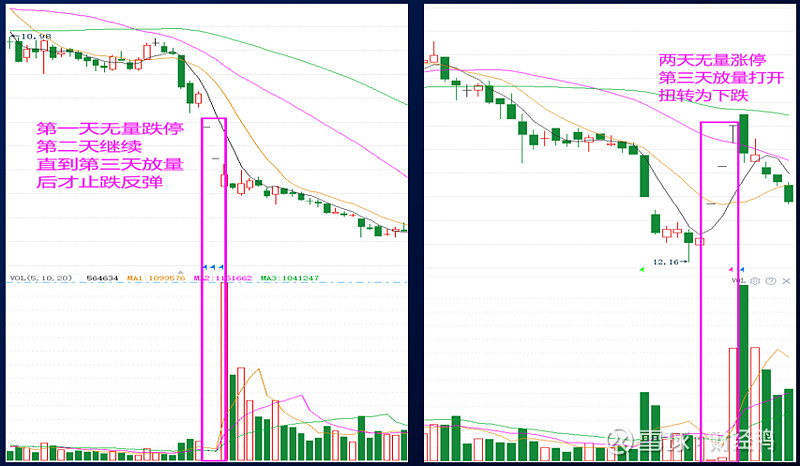  

### 10、VOL其他形态——天量无天价，地量无地价  

成交量创历史新高，次日股价收盘却无法创新高时，说明股价必定回档;同样，成交量若创历史新低而价格不再下跌时，说明股价将要止跌回升。这个也是我们常熟的量价背离。如下图，成交量创出历史新高，当天冲高回落，次日收盘股价并未新高，接下来短期果然回落。（如果是绝对量的顶天立地形态，则后市仍有机会，但短期都会阶段回落）  
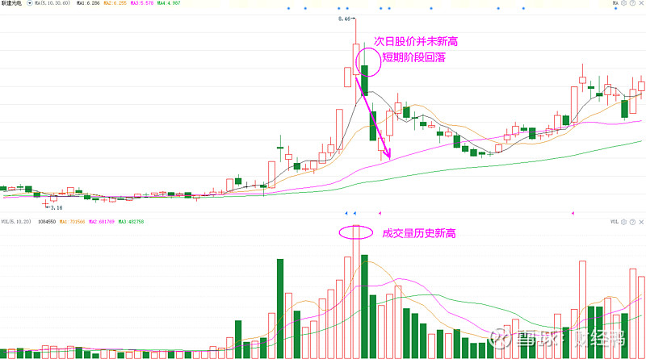  

### 11、VOL其他形态——底量超过顶量  

所谓的底量超顶量是指在下降趋势中，底部的成交量高于顶部的成交量，这个时候，是大资金进入的信号，在加仓。后面一般都会有一个再次拉升突破前期高点压力带的机会。这种也可以理解为见底前的量价背离确认。如下图，下降趋势中，每次反弹的高点一波比一波低，但与之对应的成交量却一波比一波高，在成交量的表现则是底量超过了顶量，说明抄底资金在逐步进场，市场对改股后续走势分歧加大。  
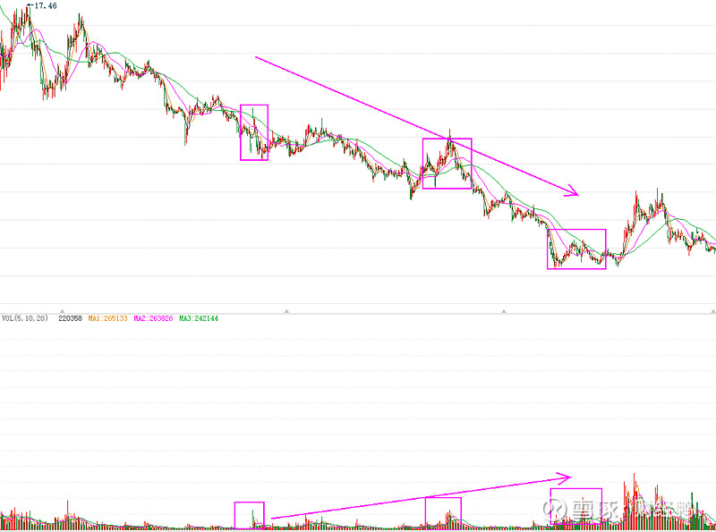  

## 第三部分：成交量循坏变化的八个阶段  

1、放量整理，转阳信号 （低位量价背离、底量超顶量、转阳信号）  

2、放量上涨，买入信号 （低位量价齐升、圆弧底、温和放量、买入信号）  

3、平量上涨，持续买入 （资金托底，但并未拉上，可持续买入）  

4、缩量上涨，继续持有 （卖盘少、主力锁仓、是拉升阶段，可继续持有）  

5、缩量滞涨，警戒信号 （涨不动了，高位震荡，主力随时最后一顿派发）  

6、缩量下跌，卖出信号 （主力出货完毕，下跌周期会很长，破位坚决出局）  

7、平量下跌，继续卖出 （下跌趋势一旦形成，只要不放量不考虑）  

8、放量下跌，弃卖观望 （往往是最后一跌，大资金经常抄底，不要再割肉）  

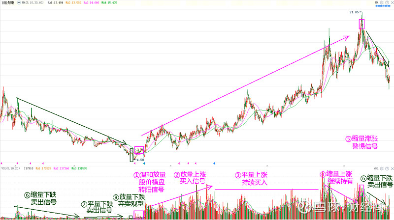  

### 1、放量横盘，转阳信号  

如上图①号位置，股价经过了长期下跌后，开始出现成交量增加而股价企稳的形象，而形态上看，这个阶段的vol红柱数量上多于阴柱说明底部在集聚上涨动力。此时可以适时买进待涨，不过最好的买点还是再次放量突破平台那天。另外这种放量横盘整理的形态还会出现在主升浪途中的宽幅震荡洗盘，主力为了减轻继续上行压力，会二次吸筹。只要上升趋势未破，说明只是阶段性上行受阻，一般整理后仍会有再次拉升的行情。  

### 2、放量上涨，买入信号  

如上图②号位置成交量持续增加，股价趋势也转为上升，这是短中线的最佳买入时机。这是最常见的多头主动进攻模式，可以积极进场，与庄家共舞。之所以会出现这种量价齐升形态，是因为多头在前面震荡洗盘吸筹完毕，正准备第一波拉升，于是成交量放大，从而吸引散户进场帮忙抬轿，所以量增价涨。当第一波拉升阶段涨高后，有上当压力，那又会再次出现回调整理，即缩量回调或量增价平形态，此时并不用担心，一旦调整到位，又会放量上涨，所以上升途中每次放量上涨都是比较好的买入时机。  

### 3、平量上涨，持续买入  

如上图③号位置，股价上涨到一定阶段，投资者对该股后市看法更趋一致，主力也开始进入到锁仓阶段，于是成交量开始趋于等量水平，而股价得以持续上升。所以这种形态一般是上升浪的中期阶段，我们仍然可以适合参与。  

### 4、缩量上涨，继续持有  

如上图④号位置，成交量减少，股价仍然上涨。这是股价进入快速拉升阶段的形态，同样是主力锁仓不卖所致。不过和③号位置阶段不同的是，此时如果重新进入要么小资金要么短线炒作，不能买了就等在那里，然后看不到顶部信号后，破位也不舍得割肉。因为此时的股价已经有了较大涨幅，随时有抛售风险。  

### 5、缩量滞涨，警戒信号  

如上图⑤号位置，股价经过前面大幅上涨后，进行横向整理，不再上升，即俗语说的涨不动了，但如此成交量减少，也说明了追高资金开始理智，不再追捧。一般情况下，这种阶段最后再来一个突发巨量，那么主力就基本全部出货完毕，此时个人投资者要果断出局。  

### 6、缩量下跌，卖出信号  

如上图⑥号位置，经过高位的滞涨，接下来成交量继续萎缩，而多空双方博弈后，空方完全占据主导，股价开始了一轮下跌，上升趋势开始转为下降。这种形态一旦形成，不管当时是放量还是缩量，破位就要无条件卖出。否则多头不死，跌势不休，要等到多方彻底不挣扎了，才是跌势的结束。简单理解就是破位不卖出，迎接你的就是无量阴跌和遥遥无期的底部。  

### 7、平量下跌，继续卖出  

如上图⑦号位置，当股票一路阴跌到了一定低位后，成交量开始走平，但此时股价还是暴跌，说明股价有望到底，但并没真正的企稳，这是依然有恐慌盘卖出，注意这是临近底部的信号，但还是要警惕太早买入，当心“飞刀断手”，因为一般筑底前都会有最后一次的暴跌。果不其然，图中例子最后还来了一个放量下跌。  

### 8、量增价跌，弃卖观望  

如上图⑧号位置，恐慌盘都出现后，主力为了收集更多便宜筹码，也为了验证是不是还有多头力量在顽强抵抗，一般都会来最后一次的宽幅震荡洗盘，把之前不愿意割肉或近期进场小幅获利的筹码都收集到手中。表现到量价上就是放量下跌。此时低价区的放量也说明有资金接盘，后市有望筑底和反弹，此阶段不要卖出，持股等待反弹或反转。  

## 超级解读

（这段是从公众号摘取 2024-10-10 作者：远方青木）  

**牛市最大的敌人，是那些手里持股，且投机思想严重，天天想着高抛低吸的人，这批人嘴巴上喊着自己要高抛低吸，但实际做法其实是涨了看涨跌了看跌，最终的执行结果是低抛高吸，追涨杀跌，坑了自己的钱包也坑了行情。**  

所以牛市最大的敌人并不是那些在场外冷嘲热讽的人，他们手里一股都没有，嘲笑的再大声也只能是嘴炮，事实上这批天天关注股市行情大声嘲笑，但手里全是钱没有股的人，才是牛市的最大助推剂和真正的最大多头。  

因为这批人早晚会被逼空，他们不入场牛市的上涨就不会结束，他们进来把钱买成了股票，从嘲笑变成支持，牛市才会结束。  

说是横盘，但并不是标准的横线，而是无规律的高低波动。  

你要高抛？哪是高？多高算高？  
你要低吸？哪是低？多低算低？  

一般来说横盘的过程中会有一个主轴线，但具体的高低点绝对是毫无规律的，就是要弄的那批高抛低吸的人大腿拍断才算完事。  

具体有多少人大腿拍断了，这个也是没人上门统计的，但会有一个指标来反应，那就是成交量。  

成交量代表一买一卖，所以我们可以先把成交量视为卖盘，成交量大就一定代表想卖出的人多。  

别管他是看空大盘才卖出的，还是想高抛低吸卖出的，都是卖出。  

只有成交量萎缩到极低的数据，才能表示愿意卖出的人少了，这个时候才能发动下一轮上涨的可能性。  

你也许会很疑惑，成交量萎靡不仅能代表愿意卖的人少，也同时可以代表买的人少了啊，你怎么只提卖的少不提买的少呢。  

很多人最初学习量在价先这个规律的时候都会被这个问题困惑，很多人可能十几年都没弄清楚，因为成交量这个东西就是一买一卖组成的，放量大阳可以解释为好事但也可以解释为坏事，放量大阴可以解释为坏事但也可以解释为好事，同时缩量还是既可以解释为好事也可以解释为坏事，很多人就被搞晕了，弄不清楚之后就不琢磨了。  

**要弄清楚量在价先到底怎么用，你首先要搞明白什么是主要矛盾，什么是次要矛盾，也就是首先要判断好大势，然后你才能使用成交量这一工具进行判断。**  

对于同样的成交量K线图，你判断大势为牛市，或判断大势为熊市里的反弹，然后对后势进行预判，得出的结论绝对是截然相反的。  

所以成交量只是一个辅助指标，他可以帮你判断大趋势里的小型转折点，但首先你要利用其他知识对大趋势有正确的判断。  

同样是缩量横盘，在熊市里，那我就会理解为没人愿意买了，时间长了价格肯定是撑不住的，必然下跌，所以股市有个俗语叫横久必跌。  

同样是缩量横盘，在牛市里，那我就会理解为没人愿意卖了，时间内长了价格肯定是压不住的，必然上涨，所以股市也有个俗语叫横久必涨，甚至还有横有多长竖有多高的说法，意思是横的时间越长涨的就越高。  

**横久必跌和横久必涨都是股市里的经验之谈，但哪怕从字面意思来看也是截然相反必有一错的，但实际上都是对的，因为他们对应的大环境是不一样的。**  

只有先把大势判断对，才有看成交量指标的意义，而且不同的环境下代表的语境各不相同，极其复杂，堪称变化万千，属于最难掌握的那批高端技巧。  

比方说昨天的留言区里，我就顺便回答了东财的成交量问题，牛市背景下的券商龙头放出900亿天量成交，有人会理解为无数人疯狂买入，要看多，但在我眼里那就理解为无数人疯狂卖出，要看空，后市大概率下跌，释放卖出能量，后面有没有下一波那后面再说，反正这一波肯定是已经结束了。  

而今天，东财单日暴跌17%。  
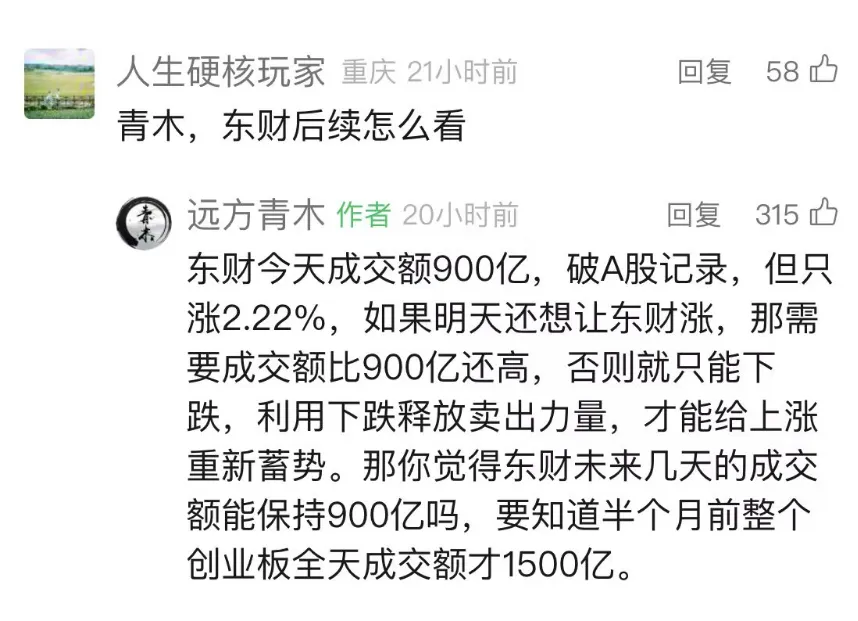  

这个东西，是需要学习和琢磨很久的，确实很难。  

**但其实最难的是判断大势，也就是你凭什么笃定这个是牛市，凭什么这就不是虚晃一枪的熊市反弹，这个只要判断清楚了其实你不管途中的成交量那都无所谓的，弄清楚了也就只是对判断某些局部转折点有帮助。**  

如果你也认可当下属牛市，那接下来的横盘你就可以理解为什么缩量代表着卖出力量的减弱而不是代表着买入力量的减弱。  

当缩量缩到一定的地步，主升浪就具备了发动的条件，这个时候只要有大资金出来带个头，点一把火，立刻就是烈焰冲天。  

有人还是疑惑，要涨是必须要有人买的，缩量都缩到没人买了，怎么涨？  

这就是我反复强调大背景不同的重要性了，在牛市里你就不缺买入能量，只需要削减卖出能量就够了。  

股市里还有一句话，叫三根大阳线，千军万马来相见，这里面是蕴含基本人性的，不信的话你可以看看这次十一前五根大阳线，直接全球兵马来相见了，逼得美联储都打乱了自己的降息节奏开始反击了。  

只要有资金点火，先带头拉出三根大阳线，做多资金立刻就会瞬间出现，牛市里根本不缺做多资金，只怕那些无脑追涨杀跌的投机资金在某个时间点合力砸盘。  

但这一条在熊市里就未必成立，熊市里你拉三根大阳线可能一点用都没有，别人转手就把货交给你自己跑路了，留点火的大资金挂在旗杆上吹风。  

所以牛市横盘不考虑买入资金够不够的问题，只需要考虑筛除和淘汰掉那些喜欢疯狂杀跌的投机资金就够了，横盘就是驯化和淘汰那些“不老实资金”的过程，他们会在横盘过程里试图高抛低吸反复碰壁，最后直接自闭，觉得还不如持股不动，彻底老实了。  

还有一些天赋之子，天生适合做横盘，不仅每次都能基本抓住高低点，而且心态也不错，即便错过了也不方寸大乱，而是耐心等几天，然后原位置无损接回。  

反正横盘嘛，波动来波动去老是在一个空间内打转，不管你什么位置买入卖出，过几天一定会回到同样位置的。  

拖的时间足够长，很多人都会发现这是“无风险”套利，卖对了那净赚做T利润，卖错了那就耐心等几天无损接回再来一遍。  

横盘最开始的一段是无规律的，但时间拉长了肯定是有规律的，毕竟震荡空间就那么大一点，玩不出什么花来。  

看似这帮人钻了漏洞疯狂赚钱，但别着急，主升浪开始的前几天和横盘里的普通上涨是完全一样的，然后这批人就卖出了，“耐心”等接回。  

那你就慢慢等吧，耐心越足越好。  

主升浪从此一去不回头，等这批人反应过来已经是巨亏，舍不得买回，在场外不停咒骂，赌大盘必定跌回横盘平台。  

然后就慢慢涨，涨到这批人每天晚上心慌胸闷睡不着觉，一睁眼看盘就觉得自己错过了好几个亿。  

最后这批人就会认命，高位买回，一算账这波踏空损失的利润是自己辛辛苦苦在那折腾那么久的好几倍乃至于十几倍。  

然后这批人就老实了，再也不敢动了，被“调教”成功。  

所以不管是什么性格的人，在这个横盘阶段以及主升浪开启之后，都会被收拾的服服帖帖，都持股不动之后，主升浪后续的上升才会开始顺畅。  

主升浪的意义就是逼空，长时间的逼空，在主升浪阶段被迫买入的资金数量是整段牛市里最多的，所以最终的涨幅会非常惊人。  

但主升浪在开启后很长一段时间内都是在和各种卖出的力量搏斗，在“制服”他们，而这些卖出力量在被制服后还要经过不短的时间才会被无奈逼空，所以主升浪涨的不会很暴力，只在开始阶段暴涨一下，然后就是小阳不断，中间还会穿插大量阴线。  

**主升浪从头到尾都有巨大分歧，始终有人认为已经涨到头了，但大部分时间买入资金都会比卖出资金多一点点，这就是主升浪的特性。**  

**那接下来就要说一下大盘走横阶段的操作指南了。**  

此阶段遵循的原则和一浪上涨和三浪主升截然相反，该阶段所执行的原则是**涨了看跌，跌了看涨。**  

没错，和那些涨了看涨跌了看跌的人完全相反。  

**只要大涨你就看跌，只要大跌你就看涨，在该阶段你就会如鱼得水。**  

老规矩，水平在前10%的人可以自由活动，怎么操作都可以。  

另外90%的人，依然是无脑别动，别嫌我啰嗦，这句话我会重复到这轮牛市结束，我写文章对你们的意义是坚定你们对牛市的信心而不是重复教你们牛市要持股别动。  

你们最缺的就是对牛市的信心，稍微有点波动就会质疑是不是要跌了，横盘横久了也会质疑会不会横久必跌，你看我刚买的股票书上白纸黑字的写着《股林秘籍伍：横久必跌》呢。  

我今天再帮你们强化下信心，顺便打个预防针，未来很长时间都会横盘，但绝不是横久必跌，而是横久必涨。  

对这些人而言，该阶段的原则依然是“涨了看跌，跌了看涨”，但执行细则并不是高抛低吸，而是想要建仓的，想要补仓的，想要调仓的，千万不要追高，该阶段只低吸。  

是的， 十一前你不追高就根本买不进，必须涨了看涨，但那是十一前的特性。  

**如今的特性，就是看到暴跌就兴奋，然后赶紧建仓，看到大阳就叹口气，再等几天吧。**  

尤其是调仓换股的，看到阳线就卖，看到阴线再买，你调仓换股会很舒服。  

再强调一遍，仅限于调仓换股，不推荐水平不够的人做T，因为首先是会搞坏心态，具体的我昨天已经说了，然后就是横盘时长是无法预测的，是没有规律的，什么时候结束是无迹可寻的，甚至走势都不一定是标准的横，啥形态都可能有。  

这个市场一定会让9成在横盘阶段获利颇丰的投机者损失惨重，是一定，每次玩法都不一样，绝对让人总结不了规律，但最终结果都是一定会把这些人收拾的老老实实，否则三浪是无法成功发动的。  

这里面存在一个先有鸡还是先有蛋的关系，但不重要，反正历史上每一次成功的主升浪都是事先把这些人收拾老实的，没能把这些人收拾老实的也走不出主升浪。  

**所以激情四射的A股即将逝去，平淡如水的日子即将到来，震荡幅度会越来越小，成交量会越来越低，盘面越来越沉闷。**  

但你别着急，因为这恰恰意味着波澜壮阔的大行情即将开启。  

鱼头不是最肥的，永远不是，鱼身才是。  

你也许错过了鱼头，但目前距离鱼身还有很长时间，而且途中一定会有数个阴线方便你低位上车。  

我提前把这些写出来，你看完了心里有了概念和印象，当你看到局势在有条不紊的向这个方向一步步走去时，你对牛市的信心就会随着横盘的持续而得到逐日强化。  

等波澜壮阔的鱼身出现的时候，你才能完整的吃到嘴。  

*一个很好玩的操作秘诀，那就是当你有强烈买入冲动的时候，要卖出，至少不买入。*  

*当你有强烈卖出冲动的时候，要买入，至少不卖出。*  
