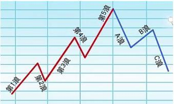
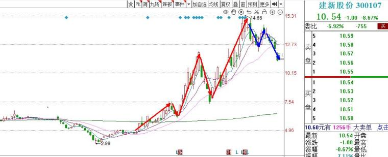
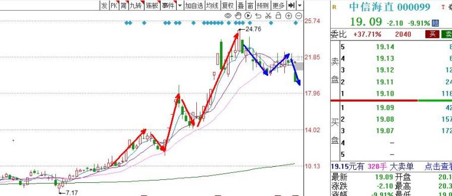
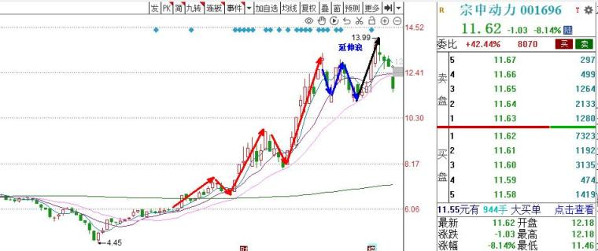
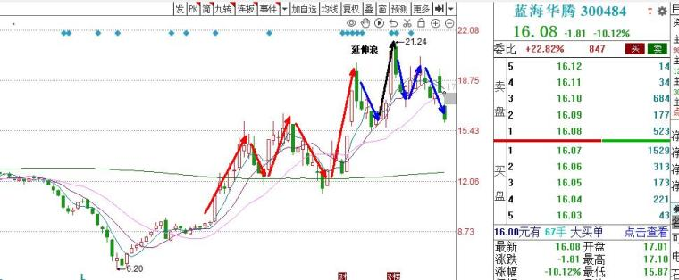
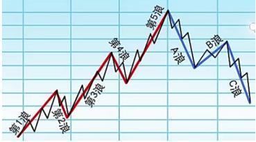

---
title: 波浪理论详解 东江炒家整理
index: true
icon: file
order: 9
category:
  - 基础
  - 大A
tag:  
  - 淘股吧
---  

([原文](https://www.taoguba.com.cn/Article/5931542/1)发布于2024-05-25)  

## （一） 波浪理论基础

  

波浪理论是美国证券分析家艾略特提出的一套市场分析理论，又称为艾略特波浪理论。艾略特认为，不管是股票还是商品价格的波动，都与大自然的潮汐、波浪一样，一浪跟着一浪，周而复始，具有相当程度的规律性，展现出周期循环的特点，任何波动均有迹可循。因此，投资者可以根据这些规律性的波动，预测价格未来的走势，并在买卖策略上实施使用。  

波浪理论所包含的基本含义有以下4点：  
（1）股价指数的上升和下跌将会交替进行。  
（2）推动浪和调整浪是价格波动两个最基本形态。推动浪即与市场方向一致的波浪，可以再划分成5个小浪，一般用第1浪、第2浪、第3浪、第4浪、第5浪来表示；调整浪可以再划分成3个小浪，通常用a浪、b浪、c浪来表示。  
（3）在上述8个波浪完毕之后，一个循环即告完成，走势将进入下一个大波浪循环。  
（4）时间的长短不会改变波浪的形态，因为市场仍会依照其基本形态发展，也即波浪可以拉长，也可以缩短，但其基本形态永恒不变。  

总之，波浪理论可以用一句话来概括，即八浪循环。  

案例：  
  

  

## （二）波浪的层次  

任何一浪都由较低层次浪组成，同时，它也是较高层次的浪的一部分，即“浪中有浪”。  
由于每一个上升和下跌的完整过程均含有一个8浪循环，大循环中有小循环，小循环中有更小的循环，因此数浪变得相当繁杂和难以把握，再加上其推动浪和调整浪经常出现延伸浪等延展变化和复杂形态，使得对浪的准确划分更难以界定，这两点构成了波浪理论实际运用的最大难点。  

案例：  
宗申动力的延伸浪：  

  

蓝海华腾的延伸浪：  

  

## （三）波浪理论详解  

  

从波浪的形态上来分析，艾略特将股市波浪划分为上升五浪和下跌三浪，8个浪各有不同的表现和特征。在上升5浪中，1、3、5为上升趋势推动浪，2、4为上升趋势调整浪；在下跌3浪中，a、c为下跌趋势推动浪，b为下跌趋势调整浪。  

（1）第1浪是一个8浪结构的开始，又称“初升浪”。第1浪往往出现在空头市场跌势后的反弹或反转，或出现在长期盘整之后，属于营造底部形态的一部分，此时买方力量并不强大，再加上空头继续存在卖压，因此上升幅度往往不大即开始第2浪调整。一般来看，第1浪的涨幅是上升5浪中最短的。  

（2）第2浪是对第1浪的调整浪，由于市场投资者误认为熊市尚未结束，其调整下跌的幅度相当大，常常回撤掉第1浪的大部分，但不能跌到1浪之下，通常回撤掉第1浪的0.618。第2浪常常以非常低的成交量和波动性结束，此浪中经常出现底部转势形态，如头肩底、双底形态，这表明卖压逐渐消失。  

（3）第3浪通常是上升5浪中最长的一浪，是整个上涨行情中最具爆发力的波段，因而又称为主升浪。这段行情的走势非常激烈，一些图形上的关卡非常轻易的被突破，尤其在突破第1浪的高点时是最强烈的买进信号。由于第3浪涨势激烈，经常会出现延伸浪的现象。第3浪涨幅通常为第一浪的1.618倍，如果第3浪涨幅与第1浪等长，则延伸浪会出现在第5浪。  

（4）第4浪是行情大幅飙升后的调整浪，是对第3浪的调整，通常以较复杂的形态出现，经常出现倾斜三角形，但第4浪的底点不会低于第1浪的顶点。  

（5）第5浪是股价上升阶段的末段，又称“逃命浪”，涨幅一般小于第3浪。第5浪的上升经常是在指标出现顶背离或钝化的过程中完成。  

（6）a浪是对前面5浪上涨总调整的开始，是第一个下跌浪。在a浪中，大多数投资者依然认为上升行情尚未结束，此时仅为一个暂时的回调现象。实际上a浪的下跌在第5浪中通常已有警示信号，如成交量与价格走势背离或技术指标上的背离等，但由于此时市场仍较为乐观，a浪有时出现平势调整或之字形态运行。  

（7）b浪是对下跌a浪的反弹，成交量往往不大，一般而言是多头的逃命线，然而由于是一段上升行情，很容易让投资者误认为是另一波段的涨势，并形成“多头陷进”，许多投资者在此阶段惨遭套牢。  

（8）c浪是一个8浪结构中最具杀伤力的下跌浪，下跌幅度大，时间长，空头以排山倒海之势杀低股价。  

## （四）波浪理论要点  

（1）一个完整的循环是由8个浪即上升5浪和下降3浪组成。  
（2）波浪可合并为高一级的浪，亦可以再分割为低一级的小浪，即“浪中有浪”。  
（3）跟随主流行走的浪即推动浪可以分割为低一级的5个小浪。  
（4）第2浪永远不会回撤到第1浪起点位置。  
（5）上升5浪中的第3浪永远不是最短的一个波浪。  
（6）假如1、3、5这3个浪中的任何一个浪成为延伸浪，其余两个浪的运行时间和幅度会趋于一致。  
（7）调整浪通常以3个浪的形态运行。  
（8）黄金分割率和奇异数字组合是波浪理论的数据基础。  
（9）经常遇见的回撤比率为0.382、0.5、0.618。  
（10）第4浪的底不能低于第1浪的顶。  
（11）波浪理论包括三部分：形态、比率和时间，其重要性以排行先后为序。  
（12）波浪理论主要反映群众心理，越多人参与的市场其准确性越高。  

## （五）波浪理论缺陷  

（1）波浪理论家对现象的看法并不统一。每一个波浪理论家，包括艾略特本人，很多时候都会受到一个问题的困扰，即一个浪是否已经完成而开始了另外一个浪，有时甲看是第一浪，乙看是第二浪，看错的后果可能十分严重。  

（2）如何界定一个完整的浪并无明确定义。在股票市场的升跌次数绝大多数并不按照5升3跌这个机械模式出现，但波浪理论家却曲解说，有些升跌不应该计算入浪里面，计算浪完全是随意主观。  

（3）波浪理论有所谓延伸浪，有时5个浪可以延伸成9个浪，但在什么时候和什么准则之下可以延伸，艾略特却没有明言，使数浪这回事变成各自启发、自己去想。  

（4）波浪理论的浪中有浪可以无限延伸，亦即是升势时可以无限上升，都是在上升浪之中。一个巨型浪一百、几十年都可以；下跌浪也可以跌到无影无踪都仍然是在下跌浪。只要是升势未完就仍然是上升浪，跌势未完就仍然是下跌浪，其能否推测浪顶浪底的运行时间十分可疑，等于纯粹猜测。  

（5）波浪理论是一套主观分析工具，缺乏客观准则，市场运行却是受情绪影响而并非机械运行，波浪理论套用在千变万化的股市里会十分危险，出错机会较大。  

（6）波浪理论不能运用于个股的选择上，因为个股涨跌不仅受到自身运动影响，而且受到大盘、板块的深刻影响，绝非波浪运行所能简单描述。  

总之，波浪理论提供了一个判断股市趋势变化的重要工具，具有较高的理论和实践价值，同时它也存在一定缺陷，本质上仍然属于后验判断，即事后诸葛亮的成分不少，而且有一定的神秘色彩，故意将股市走势判断引向谁也说不清的玄虚领域，这在很多大盘判断工具中都有体现。  
