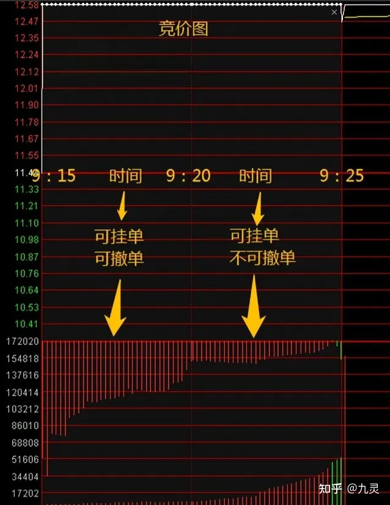
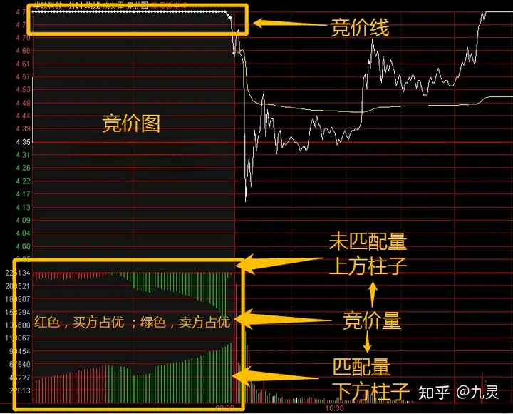
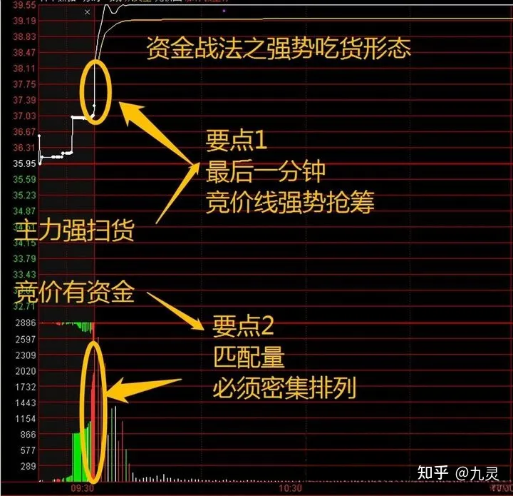
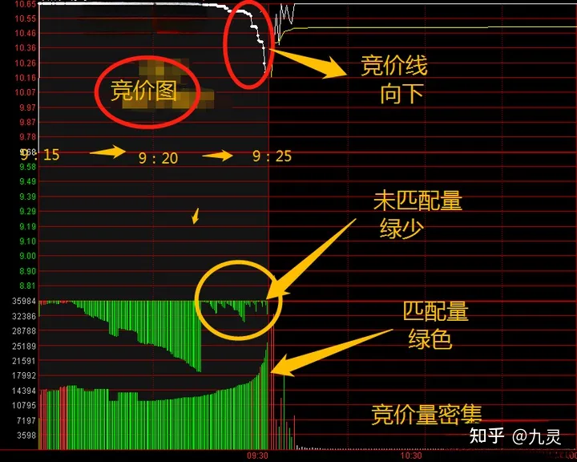
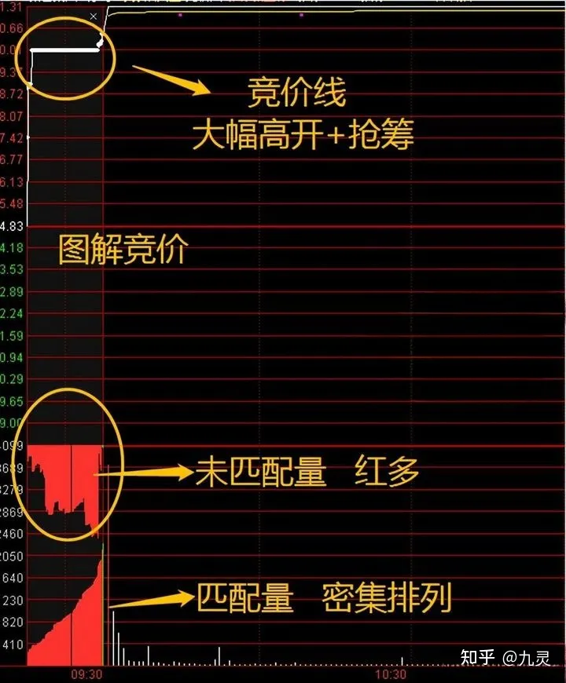

（原文发布于 2023-12-25 13:32）

很多人没有把竞价图放在心上，其实竞价图里面大有文章，今天给诸君分享怎么看集合竞价图，怎么利用竞价图判断主力意图。

1、会看竞价图的前提，是搞清楚集合竞价基础规则。

集合竞价时间：9:15-9:25

①可挂单可撤单，9:15-9:20。

②能挂单不能撤单，9:20-9:25。

③有效撮合成交9:25独一笔。

2、了解竞价图的构成，知道集合竞价形态是怎么来的。

竞价图由竞价线与竞价量组成。

①竞价线：即竞价期间的价格变化线，也叫匹配价。

②竞价量：包含匹配量与未匹配量；匹配量是竞价图下方的柱子，未匹配量是竞价图上方的柱子。

③竞价量红绿：红色柱子代表主力偏向买方；绿色柱子代表主力偏向卖方；

3、竞价图怎么看？

分析集合竞价图，本质上就是分析竞价线与竞价量，两者缺一不可，单独用集合竞价线或集合竞价量来做分析，准确率会大打折扣 ，只有把两者结合起来，技术分析才会更加客观。

①竞价线表现：抢筹（价格向上，有资金看好）；横盘（价格不动）；砸盘（价格向下，有资金看空）。

②竞价量表现：稀疏（主力资金竞价关注程度欠佳）；密集（主力资金竞价关注程度较高）；红多绿少为佳。

③竞价图关键时间：9:20-9:25（可挂单不可撤单，挂上去是真金白银，奔着成交去的）。

④集合竞价多空博弈得怎么样，9:25的成交是答案。

下面，分享几个案例，帮助大家更好的理解竞价图。

案例1

竞价图如上案例1，集合竞价形态的竞价线是显著的抢筹形态，而且最后一分钟更是疯抢，股价一下子抢高3%+，说明主力参与的意愿非常强烈；同时，后五分钟竞价量密集排列，暗示集合竞价有资金关注上了这只股票，持续的爆量参与，代表主力承接强势。

案例2

竞价图如上案例2，这个集合竞价形态中，竞价线是一个显著的压盘形态，后五分钟呈现下杀的趋势，说明主力存在一定的分歧，好在下杀空间不大，代表分歧只是一小部分，其次，参考竞价成交量，后五分钟竞价量密集排列，说明集合竞价主力参与的热情很高，能量逐步放大，主力资金承接优良，而上方的未匹配量却逐渐减少，说明空方压力不大，从而得出，空方压力小，主力愿意参与，涨停概率较大。

案例3

竞价图如上案例3，集合竞价形态的竞价线是显著的高开且伴随小幅抢筹，代表主力认可当前的价格，还愿意花更多的资金抢筹接盘，主力攻击力明显；同时，后五分钟竞价量密集排列，暗示集合竞价有资金关注上了这只股票，加上未匹配量出现了优秀的红多绿少形态，说明场外还有很多等待成交的资金，多方主力资金助于绝对的优势。

最后，送给有缘看到本文的朋友一句话：完美的技术分析，离不开集合竞价；完美的集合竞价，离不开竞价图；完美的竞价图，离不开量价分析。总之，资金关注，量价完美，可判预期，祝大家技术进步。
