（[原帖](https://www.taoguba.com.cn/Article/6254078/1)发布于2024-10-04）

关注点：  
主线题材迎来首次强分歧，预判该题材会继续炒作，直接分歧关注龙头  

要点：  
（1）题材为市场主线题材，表现为启动日批量涨停，连续两三天都有不少涨停个股，有不错的持续性；  
（2）题材迎来首次强分歧，分歧后题材有继续炒作的预期，题材强分歧造成了龙头强分歧，直接分歧关注龙头；  
（3）此模式属于龙头战法，如果题材里有中军，也可以分歧关注中军。  

案例一：数字经济（英飞拓、竞业达、中国软件）  

22年9月中旬后，指数一路下跌，情绪达到了冰点，到10月12日才V型反转见底，当天与指数午后上涨共振的题材就是数字经济，共13家涨停。盘后，又出了数字经济相关大利好，次日数字经济27家涨停。所以可以确定，数字经济为冰点后的大主线题材。  
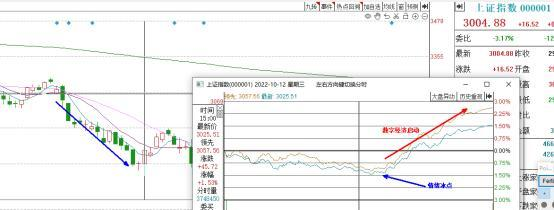  

数字经济10月12日启动，13家涨停。  
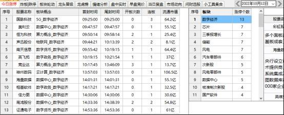  

10月13日加强，27家涨停，走出了很不错的持续性，基本可确认成为了主线。  
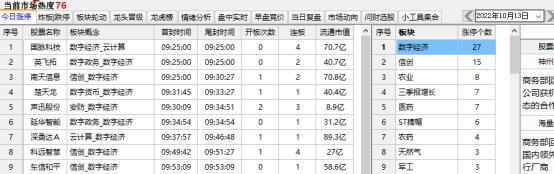  

数字经济连续大涨了4天，直到10月18号平开下杀到水下，才首次出现分歧。其实当时数字经济的总龙头还在竞争中，先于龙国脉科技依旧一字晋级7连板，共振板块启动上来的有南方信息和英飞拓，穿越龙为竞业达。因为数字经济分歧影响，英飞拓和竞业达都给到了深水低位关注机会，可以试错低位关注（因为没有确定为是总龙头，所以为试错）。  

英飞拓10月18日受数字经济分歧影响，砸到了深水，承接住后可以低位关注。  
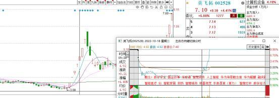  

穿越龙竞业达10月18日受数字经济分歧影响，砸到了深水，承接住后可低吸。  
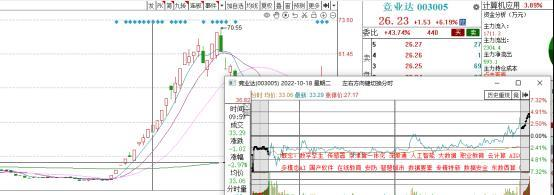  

当时数字经济的中军为中国软件，如果看好数字经济此次分歧后还会持续炒作，那直接关注中军软件也很不错，后面也走出了很不错的涨幅。  
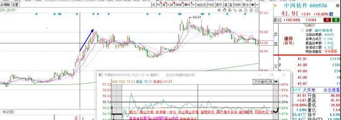  

案例二：大金融（银之杰、天风证券）  

24年5月20日开始，指数一路下跌，到9月18日与9月19日，指数连续两天V型反转，收出了双针探底的K线形态，才有止跌迹象。  
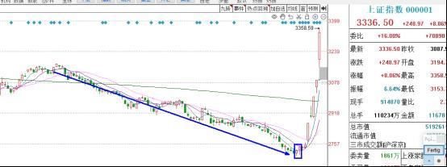  

指数连续下跌了4个月，已然达到了大冰点，当时我直播就一直有说，这次只要指数止跌后，肯定会出一条大主线，只需要静等就可以了。果然，到了9月24日，因为铺天盖地的政策利好，大金融强势启动了，20余家涨停，指数也大涨4个多点，大金融与指数共振上涨。  
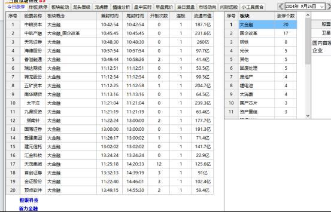  

9月25日，大金融继续强势，16家涨停，恒银科技、新力金融、天风证券、五矿资本、中粮资本、中航产融、爱建股份等多只个股大单一字，题材走出了很强的持续性，基本可以确认为主线。  
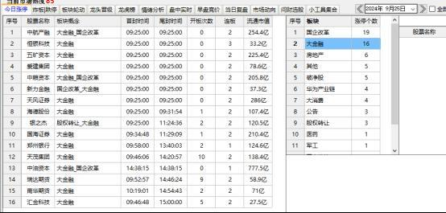  

9月26日，大金融在连续强势2天后，水下开盘，出现了首次分歧。  
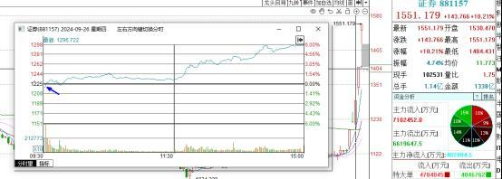  

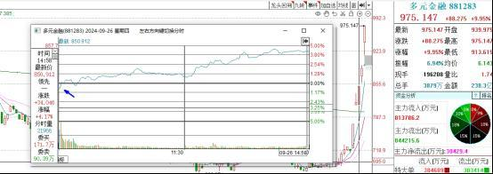  

当时大金融的总龙头毫无疑问是银之杰，证券板块的龙头为天风证券，因为大金融开盘分歧影响，银之杰小高开杀到了绿盘，天风证券当天也开得不高，这些都是非常不错的机会。银之杰当天关注后直接可以翻倍，天风证券也可以躺赢几个一字板。  

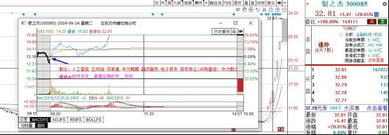  

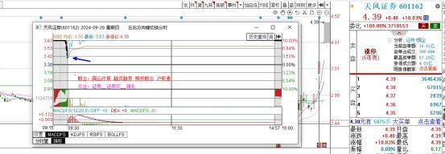  

这一天盘前，我也是公开分享了盘前思路，思路里明确提到了大金融这天有分歧预期，因为大金融分歧，银之杰如果出现绿盘，天风证券如果开板，都是机会，个人也是执行合一，绿盘关注了银之杰，开盘关注了天风证券，国海证券做T，可谓是在最佳时机介入了三大金融核心，吃到了主升浪。  

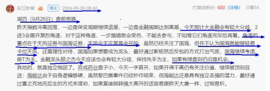  

这就是主线龙头分歧低吸模式，非常实用，且非常简单。此模式收录于《东江炒家龙头战法独门绝技之超短交易模式》稿件里，在稿件里还有更多关于这种模式的案例讲解，以及创业板接力、可转债套利、一字板首开、核按钮低吸、换手卡位龙等10多种非常实用的超短交易模式！  
