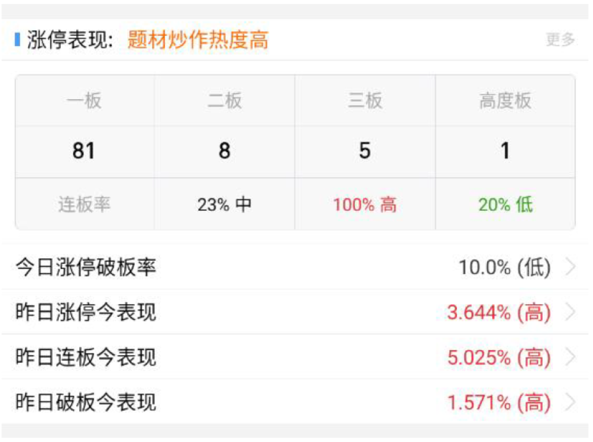

---  
title: 交易的本质是趋势对抗  
index: true  
icon: file  
order: 6  
category:  
  - 老杨  
  - 大A  
tag:  
  - 付费文档  
---  

（原文发布于 2023年）  

## 第一章 理念

超短超短，其本质是，趋势对抗。  

是上涨趋势与下跌趋势的对抗，是赚钱效应与亏钱效应的对抗！  

每一个题材炒作的周期，都是从混沌当中，亏钱效应炸裂，再到做多资金尝试做多，扭转亏钱效应;  

慢慢形成局部赚钱效应，随后慢慢形成一个大的赚钱效应，也就是我们常说的主升;  

当赚钱效应到极致，场内堆积的获利盘远远大过做多资金，这个时候场内的空头大于多头;  

但是空头没有占据压倒性优势，多头依然尝试做挣扎反抗，所以出现什么情况?  
  

出现龙头，以及板块内多只核心标的高位横情况--欧菲光，  

整个题材炒作周期，无时无刻不存在趋势的对抗，每个题材的炒作标的，没有任何一只标的不存在趋势对抗;  

文字给大家说，大家可能迷糊不清楚，接下来，我用几个案例，给大家从混沌，到主升，再到退潮，详细的给大家阐述整个趋势对抗的过程!  

我不举几年以前的例子，第一个用我们最近的，捷荣技术;  

捷荣技术诞生在什么时间节点?  

捷荣的首版 8.29 号。  
  

在 8.30.8.31 这两天，市场当中分别有几只标的，一只是中马传动，其次是我乐家居;  

两只标的分别代表资金不同的做多方向;  

一个是以中马为代表的减速器;  
  

另外一个是以我乐为代表的地产，当时并没有走出赚钱效应;  
叠加捷荣技术与我乐家具，叠加中马传动!  
  

大家有没有发现什么有趣的规律?  

者属于同一时期诞生的股票，再同一天诞生负反馈，大家可能觉得是巧合，我再给你举个例子!  

  

银宝，三柏硕盘面的共振，同一时期，同一节点诞生；  

再看短剧的龙板，引力传媒!  

  

每一段主升行情中，都会诞生不同的趋势;  

一个周期的诞生需要去对抗前一个周期带来的亏钱效应,扭转上一个周期所带来的亏钱效应；  

所以我们常常能看到什么现象?  

一个周期还在走退潮的过程当中就会诞生一只股票尝试引领市场的赚钱效应。  

比如在捷荣退潮的过程当中诞生的谁去扭转捷荣退潮的亏钱效应?  
--圣龙  

  

圣龙扭转捷荣走退潮所带来下跌趋势，推着捷荣走了盘顶;  

再比如，圣龙退潮过程当中是谁对圣龙的下跌趋势亏钱效应做了修正?  

  

是不是东安动力?东安大家应该很清楚，我们大家一起做了东安;  

东安动力的超预期，推动了圣龙的再次盘顶动作，同时带动汽车出现了新一轮的炒作?  

OK，如果觉得例子还不够，再给大家举一个远一点的例子;  
去年消费的炒作周期当中诞生的绝对龙头西安饮食;  

他在一些关键节点诞生了什么标的推着当时的盘面去做修正?  

麦趣尔!  

你们可以把三者图形叠加;  

  

在龙头出现见顶性分歧的同时,是麦趣尔超预期推着情绪再一次做拐头，推着西安饮食做了再度盘顶的动作!  

以上几个例子都是从龙头主升当中给大家举得例子，趋势对抗，放在退潮这个过程当中同样适用;  

大家要去观察，一只股票与另外一只股票他们之间的关系;  

一个周期开启往往诞生在阴末阳初，诞生在一个周期的下跌末期；  

通常老杨会拿当前市场当中，绝对的龙头做错定，龙头的退潮则是一个周期的结束的开始;  

新的周期往往就会诞生在一个周期一个龙头退潮的过程当中!  

举个简单的例子,圣龙龙子辈龙头退潮过程当中诞生了什么?长白山!  

  

诞生消费的周期，是消费这个周期扭转龙头退潮过程中带来的亏钱效应;  

  

只是说，一月中在长白山这一波盘顶的过程当中，因为市场环境的原因，没有诞生足够的补涨，所以赚钱效应极其匮乏；  

趋势对抗无处不在,任何一段上涨都是对当前市场当中下跌趋势的一种对抗;  

我们要做的是在这种趋势对抗当中，去寻找那一只能够引领市场情绪与市场下跌确实做对抗的那一只股票;  

第一点趋势对抗，如何判断时间节点，如何做择时，放在下一章!  

择时是重中之重，也是老杨最先要大家能够掌握的东西，趋势对抗只是理念，大家第一篇理念和第二篇择时是要结合运用;  

根据市场当中龙头情况合理判断市场情绪，再结合时，去判断当前标的是否值得我们去博弈!  

再推断诞生新周期的可能,是否能够再这个节点诞生新的标的打造赚钱效应!  

## 第二章 择时  

### 1.何为冰点,如何围绕冰点做择时做交易  

这一课，老杨准备了很长时间，一些技术性的，数据性的东西，老杨反复的读反复的去思考，结合以前的一些案例，因此晚了一点，进入正题；  

择时，什么是择时；  

择时在老杨的理解当中，是买在不得不买的地方，买在不得不涨的时间；  

这个不得不涨的时间怎么去判断？  

职业做交易的选手，通常对这个不得不涨的时间节点，有一个专门的判断名词，也是我文章当中常说的;  
  
**冰点**  

冰点如何去定义？  

冰点通常在盘面上的表现:  

* 中位高位普遍出现负反馈  

同时炒作的高度不断被压缩，表现在个股上面就是个股的炒作高度连板高度不断的被打压；  

大家还记不记得，比如去年十二月中旬，在南京商旅断板之后;  

连板高度一度被压缩到内蒙新华，龙头股份股份的三板；  

* 同时伴随中位高位的剧烈的亏钱效应；  
  

高位龙头出现大负反馈，中低位跟风给不到溢价赚钱效应，同时伴随连板高度压缩，这就是冰点的特性；  

冰点本质是衡量市场赚钱效应与亏钱效应的一把尺子;  

每个人锚定标准不同，得到的结果也不同，因此也造就了不同的交易模式；  

有人喜欢极冰当日去博弈核心标的，博弈次日的情绪修复；  

有人喜欢冰点后做确认性交易，博弈冰点后的强更强；  

所以，龙头选手千千万，但是买点各不相同。  

才有在同一只票上，有人买在四板，有人买在五板，其本质，是因为每个人的风偏不同，对冰点的定义不同；  

冰点，他也一种感受，一种感觉，这种感觉是你长时间做交易积累出来的一种感受；  

因此，冰点，给大家总结:  

1.连板高度被压缩，从最高七板，到次日，五板，再次日四板三板，连扳高度不断压缩；  

2.盘面上龙头出现负反馈，极端情况，高标出现核按钮跌停；  

3.中位股接力开始出现负溢价，也就是昨天做接力的选手开始亏钱，赚不到钱，一大部分接力选手出现大面；  

以上就是对冰点的定义，以及冰点在盘面上的一些反馈；  

接下来，我们再讨论，冰点的几种情况；  

**其一，单日冰点**  

单日冰点经常出现再一段主升行情当中，也会出现在混沌阶段；  

一段连续上涨后，场内资金有迫切的兑现需求，所以极致的获利盘造就了主升阶段当中极致的冰点；  

比较典型的主升周期当中的冰点；  

2022年11.03  
  

  

11月11号 众生药业  
  

  

一段医药主升当中，伴随日内冰点；  

盘面反馈上，高标出现极端负反馈，中位大批量吃面，低位出不来新的炒作支线；  

再比如  

举一个近一点的例子，我带着大家上长白山的买点；  

大家可以自己去看看1.07号的数据是什么样的反馈  
  
  
  

是不是一个极致性的冰点？  

极致性冰点，同时再结合但是环境下，炒东北旅游消费这条线，具备炒作的空间和想象力，是不是我们就得去市场当中旅游消费的核心，长白山试一笔？  

且不论能不能走出来；  

所以从长白山这笔交易，很多老铁能感受到老杨的交易，其实是比较追求确定性，比较喜欢，且擅长去做冰点之后的确认；  

**其二：双冰**  

连续两个交易日冰点  

这种情况通常出现在主升末期，市场进入剧烈分歧，面临方向选择的阶段才会出现这种情况，也有很大概率出现在一个周期退潮的第一个阶段；  

什么是退潮的第一阶段？  

给大家举个简单的例子；  

一个龙头盘顶结束之后，开始出现退潮，第一波退潮下杀，连续出现跌停的情况，我把这个阶段称作退潮第一阶段；  
  

第一阶段通常都会伴随龙头的连续跌停，因此情绪下杀最剧烈，冰点效应最强，亏钱效应也最强；  

当然也会出现第一波下杀力度不够，把亏钱效应推迟到第二波的情况，比如圣龙股份。  
  

根据龙头走势情况合理判断是不是有效冰点我会在下文给大家说；  

通常双冰之后，是可以去参与市场的反抽；  

但是这个反抽主要聚焦于龙头的补涨，也就是我常常在龙头断板之后让大家去选择的首版；  

通常情况，双冰大概率都会出现在退潮过程当中，因此双冰之后也是我们比较适合去开仓的一个节点，去试错新周期的节点；  

**第三种情况，三冰甚至四冰五冰**  

正常环境当中，三冰是极致，三冰之后，必然开仓，这是老杨的惯例，因为正常的交易环境当中，出现三冰的概率极小；  

通常都是日内冰点，次日修复再冰点，断断续续的冰点，连续三个交易日冰点，不用想，大胆去干；  

当然，排除今年年底那种股灾的环境；  

四冰五冰，是极其极其罕见的情况，老杨做这么多年的交易，连续四冰五冰，算上年底这一次，总共也就三次；  

我们只讨论市场当中常见的情况，极端极小概率，这种情况，不是我们能够预判，也不是我们靠经验能够去应对的；  

**冰点近似分歧，但又与分歧不同，冰点是冰点，分歧是分歧；**  

你们只需要记住，任何交易性买点都需要围绕冰点与分歧进行，任何的开仓操作都需要围绕冰点做文章！  

### 2.市场的四个阶段，阶段结合冰点做择时

上面，是我们对冰点的定义，以及冰点出现的情况，冰点的盘面反馈，做的一些阐述；

下面我给大家梳理，什么样的冰点才是我们合理的出手试错的点；  

交易当中，正常的交易周期以及交易阶段通常分为四个；  

主升，盘顶，退潮，混沌  

我们先说主升；  

**主升**是一整个周期上涨循环过程当中爆发力最强，进攻性最强的时间节点；  

主升的特征非常明显，*龙头缩量走加速，后排跟风不断助攻龙头*；  

所以通常会出现，龙头加速顶一字，买不到，或者给你买但是买点极其不舒服的情况，比较明显的例子就是我们买中视当天，  
  
以及长白山，  
  
皇庭；  
  
东安动力  
  

他们都是主升过程当中我们头铁硬拿货，不给舒服买点的典型案例；  

其实每个龙头在主升的这个阶段，很难很难会有舒服的买点，尤其是买点不在冰点当天再明天后一天的情况，通常都要面临加速是买还是不买的问题；  

所以买点选择上，冰点当天买，有先手优势，但是存在次日情绪是否再度冰点的不确定性风险，因此缺少确定性；  

我文章当中经常出现的“对赌”，说的就是大家冰点当天买入股票，对赌第二天的情绪是否修复；  

而冰点之后第二天早上开盘做确认再买，这是确定性买点，缺点就是买点不舒服，且买股的过程当中，会存在买不到的问题，同时这个买点天然会少几个点的利润；  

这个买点优势是他的确定性强；  

所以，在主升过程当中，冰点非常珍贵，主升阶段只要出现冰点都值得我们去博弈去参与核心的标的；  

给大家举个以前的例子：  

去年八月份的证券周期当中，夹杂了一个房地产周期，那个周期的龙头叫金科股份不知道大家有没有印象；  

老杨参与了这个标的；  
  

大家可以去看金科股份在7.27号断板当天  
  

市场的情绪氛围如何，是不是市场都面临了一次大冰点？高标断板，中位亏钱效应极大；  
  

  

但这个冰点是出现在一轮情绪主升的过程当中，而且是主升过程当中的第一次大冰点；  

那么次日是不是就值得我们开仓参与当时市场当中的核心标的？  

当时市场当中哪些标的可以参与，是不是就是金科股份与太平洋？  

次日太平洋表现如何？  
  

主升阶段的共性就是：  

市场高度不断拔高，从最初的3 板4 板不断拔高到7 板8 板，同时围绕着核心标的做逻辑上的发散；  

如圣龙之于汽车储能，又如长白山之于旅游酒店，低位不断出现相关题材逻辑内的首板发散，同时推着板块指数上涨，这就是主升！  

市场的第二个阶段，盘顶；  

**盘顶**阶段通常有什么特征：  

龙头开始滞涨，没有爆发力，连板龙头通常的表现断板震荡，比较典型的就是刚刚举得例子，金科，太平洋；  
  

龙盘顶的过程当中，会在不同的时间，不同的环境下诞生发散到其他的分支题材，诞生不同的补涨，这个补涨的高度不一；  

比较明显清晰的中通客车；  
  

见顶阶段的松枝股份，集泰股份；  

又有二波形态诞生的山西路桥；  

在举个其他例子，浙江建投之于建艺集团，之于中层股份！  
  

又如中国医药之于北大医药盘龙药业  
  

每支龙头在主升盘顶的阶段都会诞生一只，或两只补涨品种！这是历史惯例；  

在退潮当中也会出现一只退潮补涨品种，我们通常称为”反卡”；  

盘顶阶段，交易思路有两个:  

一个做龙头盘顶的反复低吸套利，我把这种玩法称作“博弈龙盘顶”，在之前的文章当中也出现过；  

第二种交易策略，就是博弈补涨，去低位寻找新的交易品种，在龙头断板的时间去打首版;  

博弈首版，运气好，你打的首版他就是能给你三到五个板的溢价；  

比较典型的有谁？  

一个，圣龙之于天龙股份，圣龙之于东安股份  
  

他们的诞生节点往往就是卡在龙头见顶盘顶的这个时间节点诞生；

大家要明白，每支龙头见顶这个时间节点都会诞生补涨，区别只是在于龙头的高度有多少差别；  

龙头见顶博弈补涨的具体内在逻辑，也是人的炒作情绪催动；  

一波龙头的上涨，最开始到达顶部这个位置，肯定有一大批人认为这里不是顶部，  

所以有资金会反复的去推动龙头往上走，也有从龙头出来的短线资金再低位打造补涨， 继续打造赚钱效应；  

同时你们也可以看到什么？  

是不是一个龙头诞生周期内的一些补涨相关标的，往往会和龙头出现共振下跌的情况？  

第三个阶段，退潮阶段；  

**退潮**阶段通常分为三个阶段；  

退潮的特征通常表现为：  

龙头跌停，中低位诞生大的亏钱效应，场内情绪出现连续冰点；  

我通常会分为退一，退二，退三  

不同的阶段，市场表现不同；  

比较典型的退潮模型：  

*退潮一阶段*都是反复拉锯的阶段，杀伤力不强，通常都是犹犹豫豫；  

中低位都有资金去继续做龙头的补涨，因此退一很多时候是朦胧；  

比较典型的案例，西安饮食  
  

西安饮食的退潮就是退一场内的炒作资金不想退，再反推西安尝试走大三波最后失败确认退潮。  

但退潮的过程当中非常的不坚决，龙头反复的挣扎，也没有出现跌停的情况；  

我们再去看那几天，市场情绪上面的反馈；  

12.29  
  

12.30  
  

再到1.03 号  
  

盘面甚至罕见的出现了高潮的现象；  

我们再来看比较标准剧烈的退潮情况，1.18 1.19  

1.18  
  

1.19  
  

大家能看到其中的区别吗？  

这种区别是短线资金在不同时间不同阶段，对当下炒作的不同理解；  

由盘顶分歧到趋于一致退潮的过程；  

给大家举这些例子，我甚至都不用提前看这些数据，我只需要看龙头的表现我就知道市场情绪的好坏；  

*退潮二阶段*我通常称为退潮加速阶段，这个时间节点的亏钱效应最大，对中低位的杀伤最大，我通常称为加速段；  

比较典型的例子长白山  
  

我们现在去看长白山退潮加速阶段的数据，  
  
  
  
  

4 天连续三个冰点，杀到市场绝望，当时市场当中，是不是做什么亏什么，买什么亏什么？  

各种中位天地板，各种二板没有溢价天地杀？  

这就是退潮二阶段，退潮的杀伤力，退潮加速也是我们重点需要规避的时间节点，通常我让大家空仓的时间，也是在这个阶段；  

*退潮三阶段*，这个阶段的特征有哪些？  

龙头跌到位开始修复，开始出现平台调整，中位的负反馈没有退潮加速阶段如此剧烈，但是高度依然被压制，赚钱效应依然打不开；  

退潮三阶段和混沌是相互链接的一个阶段，到这个阶段我们就要积极的去试错新的周期；  

当然，退潮也有变式，比如退潮一很剧烈，退潮二相对温和，比较典型的例子，竞业达  
  

也有退潮一二相对温和，退潮三剧烈，典型的例子，西安饮食  
  

这就是退潮正常的三种情况，三个模型；  

这也是为什么在退潮阶段当中，老杨我反复提及的，还没杀到位，大概率还有一杀的根本理解；  

因为整个退潮节奏当中，没有杀干净，杀透，需要来一次最终的彻底出清，新的周期才能正常打开；  

退潮阶段，通常的交易策略有好几个；  

比较典型的是中通客车当中的怫然能源  
  

通常退潮反卡诞生在什么节点呢？  

龙头连续跌停，情绪连续冰点之后，资金在龙头退潮又或者说周期退潮中继，达成一致做多共识的时候会诞生退潮反卡；  

比较好的博弈节点就是退一衰竭修复，退二衰竭修复的时间节点  
  

第二种交易策略：空仓  

退潮空仓没其他可说，空仓就是最安全最安全的策略；  

老杨一般都是选择第二种交易策略，空仓；  

退潮过程当中的冰点可参与亦可放弃，参与仓位也需要控制在2  

**第四个阶段 混沌阶段**；  

混沌阶段，是最容易亏钱，最容易出现大幅回撤的阶段；  

相比主升情绪高涨，退潮的剧烈，这个阶段非常具有迷惑性，他的迷惑性也是我们亏钱的根源；  

这个阶段的特征非常明显，多题材轮动，没有明确的炒作主线；  

比较典型的是去年八月份，捷荣技术出来前这一段炒作时间，多题材轮动，一个月当中没有一个题材能够成为炒作的主流题材；  

唯一有辨识度的题材还是日本核废水诞生的环保题材；  

混沌的情况通常会出现在什么时间节点？  

通常在龙头退潮末期，走退潮三阶段结束，一个周期结束，另外一个周期开始衔接的但新的周期又没有完全走出来这个时间节点；  

通常的在短线炒作上的表现：  

1.个股高度无法打开  

2.题材之前的轮动速度极快，一天轮动十几个板块的情况时有发生  

3.中位高标容易出现极端核按钮的情况  

混沌阶段通常的交易手段有两种，一个试错为主；  

比如市场当中轮动，出现的题材，结合消息面，你看好，认为这个题材能够走成未来的主线，那么你就积极试错，  

但是，这个试错的成本，需要严格的控制，通常试错的仓位，不宜超过1 层；  

而且混沌阶段的试错，也非常有讲究，混沌阶段的试错，一定在市场冰点之后，冰点之后去试错市场当中的核心标的；  

第二种交易策略，也是空仓，我不买，等新的主线走出来再参与核心标的；  

以上的文章，已经给大家分别总结了，市场存在的四个阶段，  

主升，盘顶，退潮，混沌；  

也分别给大家阐述了不同阶段，不同冰点的作用，以及不同阶段不同的交易手段以及买入时机上的选择；  

### 3.如何判定阶段，如何给盘面做定性

接下来是最重要的一个点，如何根据盘面当中的反馈，综合的去判断市场处于哪一个阶段！  

大家还记不记得我第一节课给大家发的，市场炒作的本质是“趋势对抗”  

本质是多方与空方的对决！  

空方强，则盘面的表现为下跌，多方强，则盘面的表现为上涨；  

这是道  

这个市场当中有非常多的资金，有情绪资金，有机构资金，有坐庄资金  

机构资金坐庄资金我们暂且不讨论，在这里我们只讨论短线资金，在多空方面的表现；  

大家做短线一定要明白，短线资金进场的唯一标准，不是大盘指数，不是什么什么KDJ 不是什么MACD，是赚钱效应！  

赚钱效应通常表现在什么方向？  

1.连板高度，个股的连板高度是否能够打开  

2.连板晋级率如何，是不是给到短线打板资金赚到钱，只有给短线打板资金赚到钱，他们才会有源源不断的打板动力  

3.市场是不是有一个，或者两个有赚钱效用或者重大赚钱效应的方向，比如目前的AI，以及微盘股；  

这些才是我们要去判断去做复盘的根本；  

通常短线资金判断市场阶段，有一个共识，看龙头目前所处的为止，举一个简单的例子，以圣龙为例；  

圣龙可以分为四个不同的阶段  
  

在不同的周期当中诞生了不同的补涨品种；  

在第一次见顶盘顶，诞生了天龙股份  
  

退潮阶段的反卡品种是银保山新  
  

圣龙的退潮诞生了东安动力  
  

**我在这里给大家复盘圣龙，目的是为了告诉大家，短线资金对市场阶段的锚定，通常都以龙头作为唯一锚定兑现；**  

只有龙头不倒的情况下，短线资金才敢去做低位新的逻辑发散才敢去做补涨去做首版一进二！  

龙头走到哪个阶段，通常代表短线炒作走到哪个阶段；  

我以现在的行情举个例子，高新发展为例，高新发展目前处于什么阶段，是不是完全的主升？  
  

好，那么我在给大家举一个例子，中国医药周期当中，那一波情绪主升的过程当中分别诞生了哪些不同的赚钱效应？  

是不是浙江建投的大二波一个？  
  

中国医药的补涨北大医药一个？  
  

在中国医药弱转强之后，又诞生一个什么品种？是不是盘龙药业？  
  

老杨给大家举例子不是说给大家炫技，而是告诉大家，龙头是整个炒作的灵魂，他是绝对绝对绝对的标杆；  

市场情绪的一切行为，甚至情绪高涨低谷，一定程度上都与龙头有关系；  

举这么多例子是想告诉大家，龙头在不同的阶段都会诞生不同的补涨品种不同的赚钱效应；  

我们要做的就是根据龙头龙头判断市场处于什么阶段阶段，去博弈龙头，或者博弈龙头的补涨品种；  

这就是择时的根本！  

其实一定程度上，择时就是择股，择股亦是择时；  

大家再结合龙头自己去回顾上面的内容，再结合冰点分歧，一套基础的短线交易框架基本就形成；  

好了，择时就写这么多，大家切忌，我给大家的东西，都是从我的脑子里梳理一遍，一个字一个字的打出来，可以自己去研究，不懂反复看。  
