（[原帖](http://www.10huang.cn/zhangting/52691.html)发布于2024-01-11）  

俗话说：弱势出大牛，烂板出妖股!  

**该涨不涨，必有大跌，该跌不跌，必有大涨，这是对超预期的最简单的诠释!**预期差，是炒股赚钱的本质，人气龙头的弱转强，是一种短线最暴力的赚钱方法之一，深度研究烂板涨停板之弱转强模式。  

炒股都喜欢股票涨停，可是当遇到股票涨停封板就破板，且不断破板的时候，这种情况是机会还是风险呢?我总结一下我的经验与观点，通过对烂板形态的主力意图以及烂板的背后逻辑进行解析，加深理解主力意图，规避风险，把握机会。  

## 一、烂板的定义  

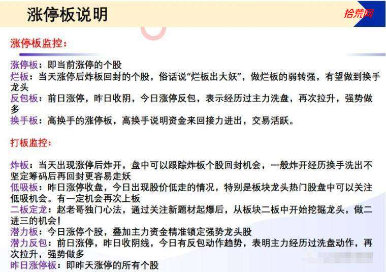  
烂板就是盘中涨停后，出现破板或多次破板，收盘前又封住涨停，这种形态的涨停板称之为烂板。其特征是封板的封单小，且反复开板。如下图所示。  

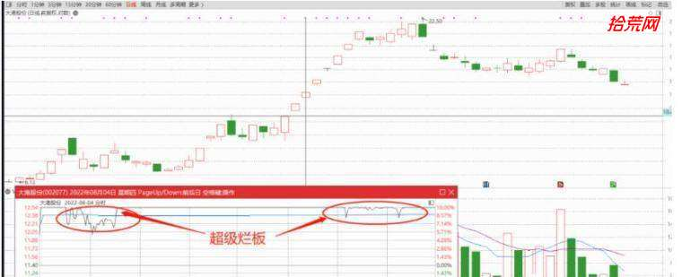  

## 二、烂板的原因及主力意图  

1、涨停板的出现，一定是主力行为的结果。  

出现烂板的原因，是市场资金在盘中出现了分歧的结果，在2板以后出现的这种情况多为市场换手，即有一部分资金在涨停位置砸盘出逃，导致破板，但是也有一部分资金看好后市预期，进行买入承接护盘，尾盘进行了回封。  

2、是主力吸筹不够，利用涨停破板进行诱空达到洗盘后抢筹的目的。尤其是底部阶段，凹间峰平台顶部附近，最容易出现这种情况的发生。  

如大港股份在箱体整理平台进行涨停板打开吸筹和洗盘，造成烂板。  

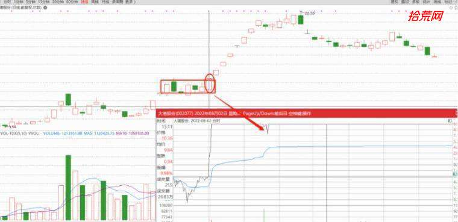  

3、研究烂板的逻辑  

烂板，是主力资金博弈到分时的形态，因此，关注主力行为也必须要关注不同的涨停形态，从中发现主力的意图和主力的强弱，诸如，烂板的位置，是抢筹还是换手、是出货还是洗盘。只有把这些问题搞清楚了，遇到烂板时，操作时才更能胸有成竹，坦然面对。  

位置决定性质，烂板出现在首板，一般多为吸货行为;烂板出现在2板以上的位置，需要判断烂板是否是当下的热点板块，是否是板块领涨的龙头，如果是热点龙头股，换手接力的概率较大;如果不是当下热点，那么就有出货嫌疑。  

烂板就是市场资金在盘中出现了分歧，前期介入的资金在涨停位置砸盘出逃，获利了结，大量的抛售导致破板，但是也有另外一部分资金看好后市预期，进行买入承接护盘，尾盘进行了回封，那么，第二天是继续出现分歧呢还是达成一致?这就是弱转强战法研究的精髓。  

## 三、关于弱转强  

首先得明白这三个字是什么意思?  

第一个“弱”，代表当天的走势是比较弱的，通常有以下三种模式：  

1、高度板之后出现断板，放量阴线(也叫龙头首阴);  

2、高度板之后出现炸板，回封失败或冲高回落，出现断板K线;  

3、高度板之后出现大烂板：即涨停板多次打开，最终回封的迹象，都可以叫做弱。如下如所示：  

  

第二个字是“转”，转代表着一个股性转变的一个过程，从弱转变到强都代表着股性的转变，也是主力资金由分歧转为一致看多的行为，更是场外资金买入和场内资金惜售形成合力的行为。  

  

第三个字“强”，强在哪里呢?出现以上几种弱K线形态后，按照正常逻辑，次日应该走弱，资金出现抢跑，但是次日该弱不弱，他就是强，表现形式比如放量高开，放量拉升，直接秒板、一字板，这些都是强的表现。  

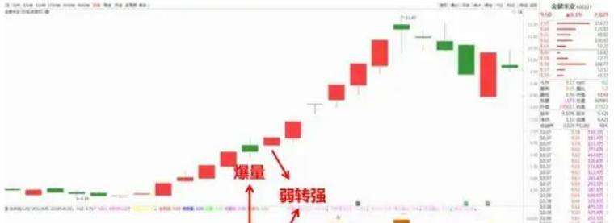  

总结一下：  

>**所谓弱转强战法，就是前一天涨停是很烂很弱的板，正常情况下次日应该低开或者快速补跌，如果不弱反而转强，快速拉板，视为弱转强!这个弱转强的涨停板就是转势板**，也是常说的该弱不弱视为强!经过前面烂板充分洗盘换手后，开始加速拉升，完成弱转强。  

“转强”实质意义上是一种转折，这个转折往往是个股前一个交易日分歧很大，但是第二天突然被资金一致看好抢筹，这其实是一个情绪的新起点，这种情绪的出现说明筹码能锁住，背后反映的是人性和心理活动。  

从心理方面分析，前一日烂板，很多场内持筹者和场外持币者对次日的走势都是不太乐观的，绝大多数人当天收盘后的内心想法是这样的：收了个烂板，明天会不会没有溢价，是不是要抢跑?  

而次日超预期高开，很多持筹者内心想法就大幅度转变了，这个票看来是要超预期了，从之前“烂板，想抢跑”变成“还不错，再看看”，场内的筹码不想卖;而场外持币者的人一看，内心就这样想：牛逼啊，这么烂的板还能高开，看来资金很看好后面的走势，于是就产生“承接不错就买一点”、“上板我就买一点”的想法，这样场内持筹者和场外持币者都由一致看空变成一致看多，弱转强就这样被资金引导，两股力量形成合力，进而推动股价走强甚至秒板。  

股票从弱到强，就是一个转变的过程，就是股性转变的一个过程，从原本应该弱势到意料之外的强，这就是超预期的一个转变的过程，超预期就是超出了正常的预期，那么正常的预期是什么呢?  

## 四、什么是正常的预期？  

走势弱的票，正常的预期就是会继续走低，接着跌，这就是正常的预期，比如收烂板或断板，然后次日下跌，随后一路下跌，这种走势就叫做正常的预期，如下图：  

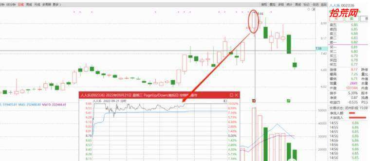  

该股前一日超级烂板，次日大幅低开，开始走弱，这个是正常的预期。  

但是，如果次日他不按这个套路来，他反而高开大涨，甚至涨停，这就是超预期，是主力行为的结果，也是由分歧转为一致的形态。该跌不跌必然上涨，这就是弱转强战法的核心逻辑。  

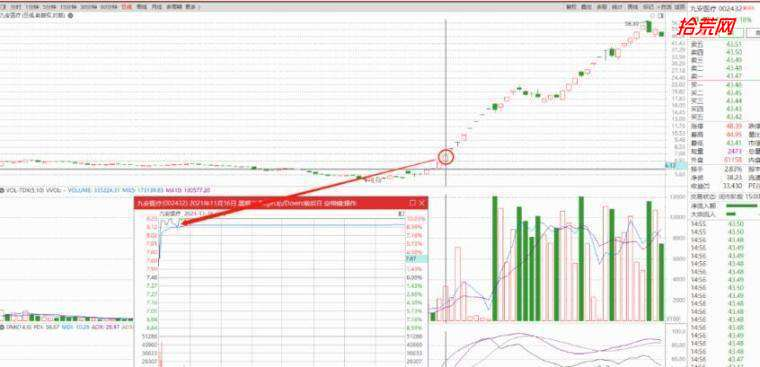  

>**所谓烂板出妖股，说的就是这样的烂板：具有市场地位及热点龙头，尤其是高位分歧后回封板，走出妖股的概率很大。越是位置高、人气足的弱转强，市场关注度越高，历史上的换手大妖股，都是经过超预期的弱转强形成的**。  

那么，如何判断超预期呢?  

根据前一天涨停状态及第二天的集合竞价开盘，可以大致判断是否符合预期，具体关于是否超预期，可以参照下图。  

  

举例说明，先以芯片龙头大港股份为例，烂板后的弱转强：  

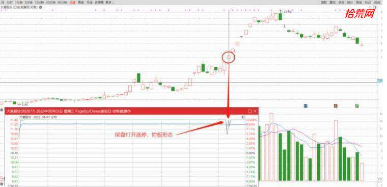  

如上图：T日涨停板尾盘多次打开，最后勉强回封，按照正常的预期，T+1日他应该是平开或低开，甚至开始下跌。但是，T+1日集合竞价他并没有低开，反而是放量高开5个点，那这个时候他就是竞价超预期，非常标准的竞价弱转强。所以在T+1日的集合竞价，就是弱转强的第一个买点;如果再涨停，涨停打板或排板就是加仓点。T+1走势如下图：  

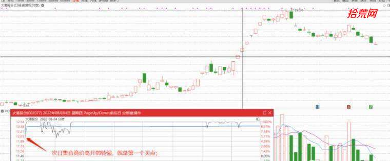  

T+1买入后，这一天多次打开涨停，并且日线放巨量，下午盘中同样多次打开涨停，一直震荡尾盘勉强收涨停，最后是个大烂板，超级大烂板，同样的逻辑，T+2日正常预期应该是低开甚至核按钮出货，但是T+2再次出现了弱转强，不但是坚定持有，而且依旧是弱转强的买点。这个逻辑和方法，大港股份这一轮上涨多次出现弱转强，应该一直持有到最后这一天的强转弱，涨停板后的大幅低开，才出现卖出信号。  

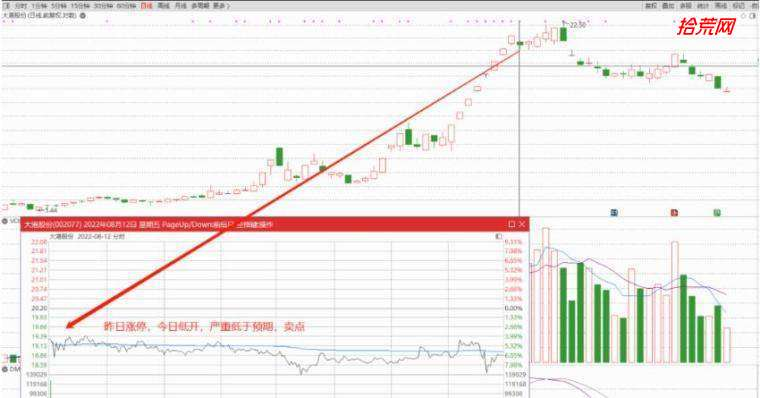  

再分析一个案例：长源电力：连续涨停，断板后的弱转强。  

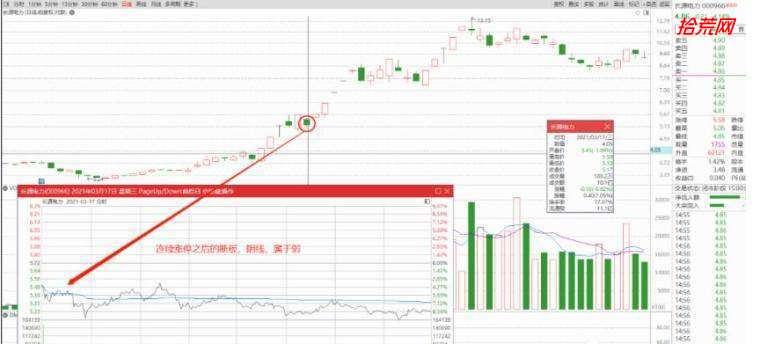  

如上图：2021.3.17日这一天，他是一个低开低走的状态，走的非常差，非常弱，按照正常的预期，接下来就要开启趋势大跌了，但是次日也就是3.18日，该股集合竞价却大幅高开，标准的弱转强，集合竟价就是买点。  

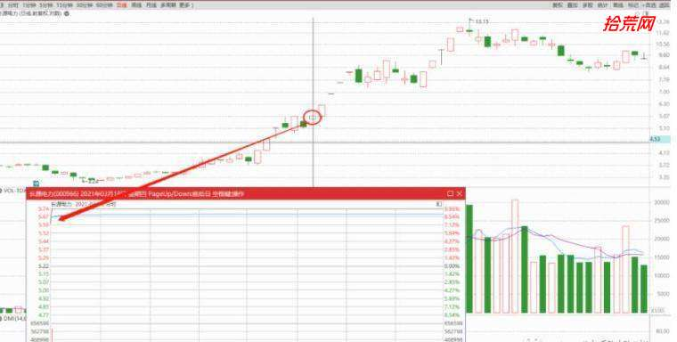  

如上图，继前一天大阴线之后，3.18日，该股却集合竞价大幅高开，标准的弱转强，集合竞价就是买点，板上就是加仓点，随后收获几个涨停板大肉。  

>弱转强战法：是短线的强势精华模式之一，核心就在于超预期，在分歧中换手，让场内持筹者继续看好，在赚钱效应的影响下，让场外持币者进场抢筹承接，从而形成合力，打造高溢价的弱转强赚钱效应。  

>弱转强模式主要是以人气涨停板为研究对象，以烂板涨停为核心，虽然是弱板烂板，但也是涨停板，是涨停的票就是主力行导致。  

投资都是概率游戏，弱转强，经典的模式之一，他能不能继续走强甚至连板，有很多因素，我总结了四点。  

## 五、弱转强的四个点  

**1、“弱”的当天**  

第一弱的当天，他的量能最好是在20个亿以下，否则他次日转强可能会封不住，甚至出现多杀多的情况，为什么?如果成交量太大，说明走弱的当天，套牢盘太多，如果第二天再拉伸的时候，就有很多人可能刚回本或者刚盈利他就会选择抛出，这个时候抛压就会比较大，就可能会导致封不住，所以这个量能最好是在20亿以下，不能太大。  

**2、弱转强 ** 

第二弱转强，他其实就是强势主力极致洗盘的一种方式，目的是给持有筹码的人造成大起大落，风云变幻的错觉，把不坚定的人给T出去，弱的当天如果是烂板，那就越烂越好，那么次日高开转强就更具备确定性。为什么?因为他越烂，在洗盘的时候，一些不坚定的筹码就更容易洗出去，然后才有利于新进主力的拉升，次日高开，第一天被洗出去的人，多数都不会愿意以更高的价格买回来，没有砸盘的筹码，更有利于主力的拉升，从而提高了第二天转强的确定性。  

**3、转强的当天**

第三就是转强的当天，我们买点不用太去纠结，如果你发现他次日只要是有转强的这个迹象，比如说放量高开，那我们集合竞价买入，半路承接强买入或者确定性打板买入都是可以的，这个时候，我们就不用在意那些买点的小细节了，弱水三千，只取一瓢，牢牢记住这三点，光靠这个弱转强的手法，应该也能在这个市场上有一席之地。  

**4、弱之前最好有两个涨停板以上，属于人气股。弱转强的买点：一个是竞价高开买，第二个是涨停板上买。**  

注意，弱转强首先最好是高开，放量高走，这里有两个要点，第一是高开，第二是放量高走，而很多人一看到高开，就不敢去了，这就是典型的恐高和散户思维，这恰恰也是主力资金想要的效果，主力肯定不希望散户多，而高开高走则是吓退散户的方法之一。  

其次，超短都是接力的，只有高开，昨天买入的资金才能获利空间，才有赚钱效应，在赚钱效应的影响下，才能吸引新的场外接力资金推高股价;一只强势龙头股，并不是一个主力资金全部吃完整个主升浪，而是在赚钱效应的影响下，多个主力资金接力的效果，比如有些资金喜欢做首板，有些资金喜欢做接力，有些资金喜欢打造妖股，各司其职，才构成了短线的生态;  

其三，经过一晚上的复盘思考，第二天高开，就是主力资金做多意愿的体现和信号。超短界有竞价定方向一说，所以多数情况下，高开是超短的第一步，然后才是看开盘以后的承接情况，也就是放量高走，不跌破分时均线，这就是承接强的表现，这两种同时出现，大概率继续上涨，当然也有少数下跌吃大面的时候。  

如果高开放量低走，直接出局，不留恋。同时补充一句，与之相反的走势：低开低走或高开低走就是强转弱的体现，就是卖点。  

## 六、板块个股的弱转强与分歧转一致  

**1、个股的分歧与一致**：  

一般情况下，一支股票，放量代表分歧，缩量代表一致。如果从买卖逻辑上来说，说的是买卖双方的行为，买卖双方集体看好，筹码惜售，叫一致，那体现在技术面量价关系上，就是缩量加速的走势;反之，则叫分歧，体现在技术图形上，就是日线放大量。  

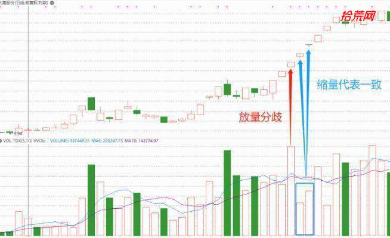  

**2、板块梯队的分歧与一致**：  

比如有时候板块前排一致加速，后排掉队的情况，这就叫板块分歧，比如3月4号周五，中俄贸易板块出现分歧，前排像天顺股份，锦州港继续加速走强，板块后排像浙江东日，嘉友国际等分歧走弱，整个题材的梯队之间产生了一定的分歧。这种情况下，其实应该注意风险，可能高度比较有限。  

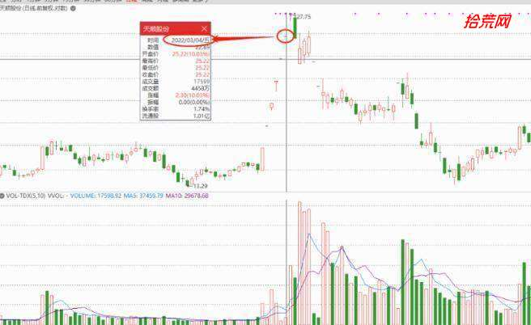  

天顺顶一字板。  

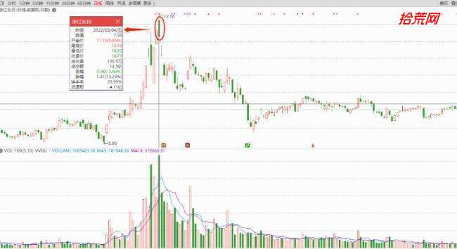  

而同板块的浙江东日则当天高开低走，大阴线走势，板块之间没有形成联动，而是产生的分歧，这种情况就要注意风险。  

而一致的情况则相反，就是前排加速走强，后排跟随晋级上涨，板块之间相互照应，有大哥领涨，有一群小弟跟随助攻，这种就是板块一致，往往高度就会更高一些。  

**3、个股板块的强弱离不开“逻辑”的加持**：  

对于一些没有逻辑的板块个股，仅仅是日内分时的一致，是没有办法判断板块个股强弱的，像一些莫名其妙高开低走的板块，早盘顶一字板，盘中又莫名其妙炸板的个股，这种不能说它强也不能说它弱，个股强弱的前提是“逻辑”的强弱，而不是“分时”的强弱，不是说早晨硬了3秒就叫强。  

以个股为例：  

对于没有逻辑，或者逻辑不硬的个股，一致加速的风险比较大，也就是说个股涉及的题材逻辑，市场不认可不支持，不支持说明场内持筹者不认可股价目前的这个高度，觉得高了，然后就砸了。  

那么，反过来，对逻辑非常硬的票，持筹者认可，筹码惜售，像很多题材被市场认可之后，一旦发酵，那么前排个股正常情况下顶一字板或者缩量加速。而题材逻辑的硬度，决定了板块个股能连续加速多久。一般情况下，板块加速过后，往往面临分歧，不支持连续缩量加速，因为连续加速后，场内筹码断层，获利盘太大压力太大，有强烈的兑现需求，巨量获利盘如果没有巨量买盘进场根本顶不住，所以即使逻辑很硬，连续加速的风险很大。  

以辩证的方式来看强弱与分歧一致的关系，如果题材发酵，龙头股不走一致加速，说明龙头弱了，是不及预期的表现，题材逻辑往往没有我们像的那么硬。如果题材发酵得不够，没有板块效应，龙头股直接走了一致加速，那么龙头股的风险就相对较大，容易被板块后排的表现拖累。  

**总结下：逻辑强才是真强，纯分时判定强弱就进入了误区**，比如3月4日短线情绪大分歧，盘中很多板块个股轮动脉冲直线冲板，但是大部分个股都是日内炸板挖坑。另外，一般情况下，即使逻辑强，龙头股也不支持连续加速，如果逻辑发酵，龙头第一次缩量加速是正常且健康的，如果龙头股连续加速，相当于题材也需要更大范围的发酵才支持龙头后面的一字板，如果题材没有达到这种强度，龙头股的连续加速就与题材的强度是背离的，炸板就是大概率的。  

所以，不要因果倒置，不要看到缩量加速时认为个股强，看到放量分歧时就认为弱，应该是看到缩量加速甚至顶一字时，首先想到的是它是否配得上这么强，盲目去顶一字，可能会吃上大亏，比如曾经天坑“富祥药业”，如果打板，一个星期亏50%。  

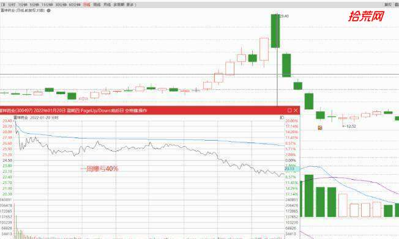  

## 七、弱转强几种形式与实盘案例  

这里只分析连板股之间的弱转强，之后断板后的反包等等弱转强不做赘述，逻辑一样，但是最好是只做龙头的弱转强，其他杂毛弱转强可能是大亏的根源。  

强调一下，为何要做龙头弱转强?利弗莫尔说过：如果你在龙头股上赚不到钱，那你压根就不可能在股市里赚到钱。要做就做最强势的那一只。龙头股看似涨幅很大，实际上人气够足，资金介入过深，反而更安全，后面的涨幅会更大。  

目前几种弱转强的形式：  

**1、分时弱转强**  

个股一般是低开或者小幅高开后顶着抛压，换手上攻，承接上板，往往伴随放量。被很多人称为抢筹盘口，同时也是大多数做半路交易者的买点。  

例：浙江建投前一天强T字板涨停之下的次日开盘小幅高开，震荡下跌，连续震荡后，下午分时穿云箭，快速拉升，为标准的分时放量，弱转强。  

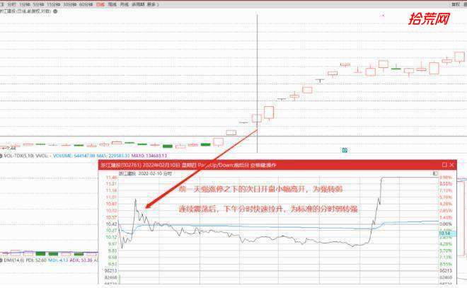  

紧接着烂板封板后，次日低开，快速放量拉升，回踩不破均价线，出现双龙齐飞走势，也是标准的分时弱转强，如下图。  

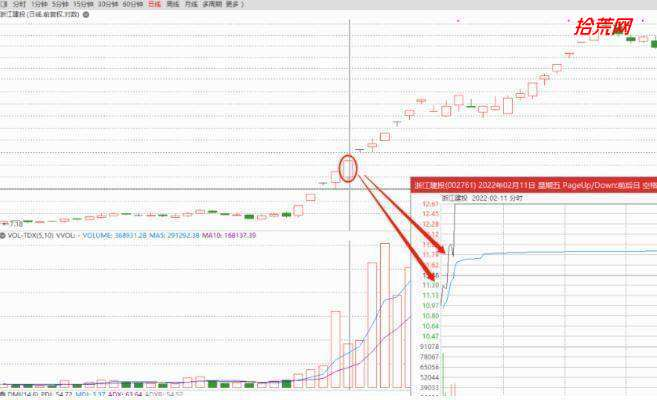  

**2、竞价弱转强**  

竞价弱转强，个股表现一般为：前一日大烂板，但次日集合竞价大幅超预期高开，小幅换手快速上板，甚至直接一字板反包。竞价弱转强是由于场内筹码惜售，次日资金抢筹，往往伴随缩量，是短线接力龙头选手的买点。  

集合竞价是短线看盘的重要盘口，是当天开盘最早呈现出来的盘面状况，一般竞价异动的票，都是大资金在背后作为主导。有一句话，叫做“竞价看方向”，竞价，基本上决定一天市场的主攻方向。  

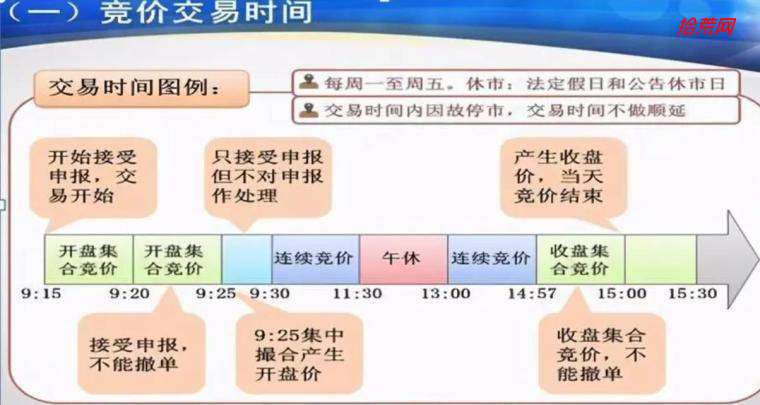

**1.首先说一下集合竞价的规则**：  

9：15——9：20：自由报价，既可以下单，也可以撤单。因此在这个时间段看到匹配成交量可能是虚假的。很多主力会在这个时间段大单买进股票制造股票强势假象诱导投资者买入股票，然后主力在9时:19分:30秒左右撤单，当你买进时，你不撤单，他可撤出，然后他卖给你，因此大家在这个时间段买进股票要多关注后几秒钟主力撤单情况。  

9：20——9：25：可以下单，不能撤单。这五分钟是重点，看准了再买，买入挂单高于开盘价，直接以开盘价成交。  

9：25——9：30：接受报价，但不做处理。这五分钟不叫集合竞价时间，但是电脑会在这五分钟接收买和卖委托，也可接收撤单，但不做处理。对于高手而言，这五分钟换股票一定要利用，比如你集合竞价卖出股票后，资金在9:25就可利用，你可在9:26买进另一只股票。  

所以，一般情况下，我们需要重点关注的是9：20分之后的竞价情况，因为9：20分之前是可以撤单的，这里可能存在诱多诱空，然后大资金在9：19分最后一秒撤单。  

而9：20分之后，不能撤单，所以9：20——9：25更能真实的显示出当天该股在竞价期间资金的博弈情况。  

例：前面的几个案例比如大港股份，长源电力等等都是标准的竞价弱转强。即前一日超级大烂板，次日集合竞价大幅高开，快速上板封涨停。  

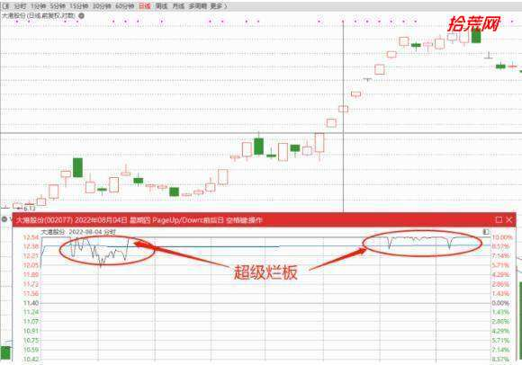  

**2、弱转强买入一定能有溢价吗？**  

分时弱转强的票是不是一定会有溢价?答案肯定不是，在一个博弈市场中没有什么必然的因果性，不然像那些做程序的量化交易者早就赚翻了，做投资，核心是概率。  

例：宁波能源3月3日竞价高开缩量涨停，属于典型的竞价弱转强表现，但是3月4日周五小幅高开后直奔深水后跌停。这种情况在3月4日就变成了分时强转弱，分时和均价线双双急速下跌，就是分时强转弱卖点。  

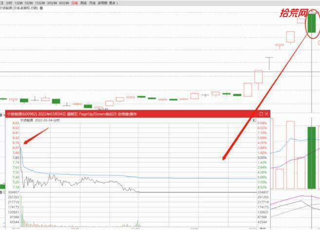  

## 八、弱转强有五种模式  

弱转强模式，也有优劣之分，简单介绍六种弱转强短线交易模式。  

**（一）最优模式**  

连板龙头尾盘烂板次日高开弱转强。这种是妖股诞生的温床，当属最优模式。

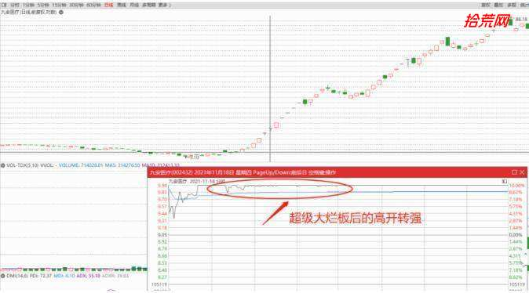  

**（二）次优模式**  

连板龙头断板反包次日高开。风险小，收益大，值得一博!  

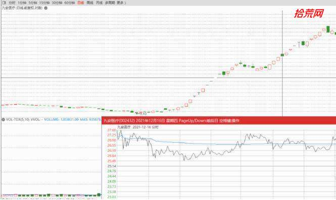  

**（三）龙回头模式**：  

龙头一波结束调整至10日线上，横盘5—8日，高开突破小平台的弱转强。也是龙头翻倍后开启二波连板的转折点。(另外20日线上，或60日线上高开的弱转强。这两种成功率一般，溢价一般，少参与)  

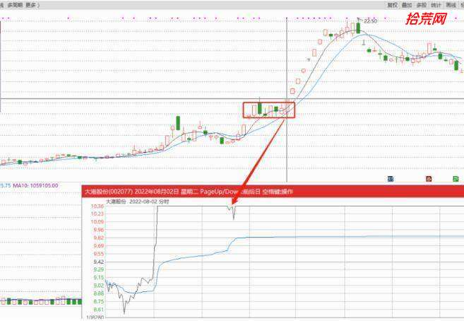  

**（四）阶段性整理平台，突破回踩**。  

高开放量突破6个月以上箱体震荡弱转强。参与机会：1、当日上车。2、突破回踩再参与。  

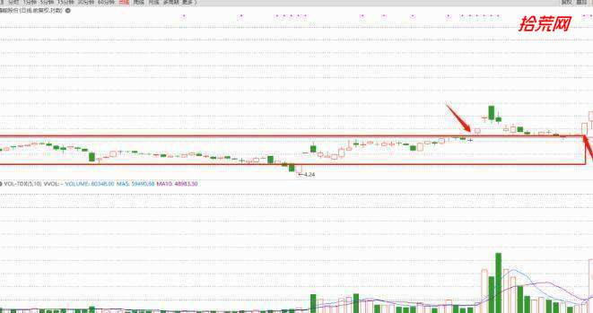  

**（五）强势股票快速回调再启动：概率一般，风险较小，博对受益大**。  

连板龙头断板后连跌三日幅度20%以上，高开弱转强。连板不超过三板的热点板块标的为佳。  

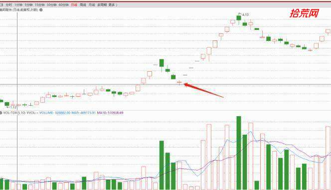  

以上五大弱转强出现，可采取两笔买入法：开盘一笔，涨停板一笔！  

## 九、弱转强的选股及买点  

**（一）当日选股条件**  

1、必须涨停封死(当然炸板的冲高回落的也有希望弱转强，但是成功几率要低于封死的);  

2、必须是市场热门题材;  

3、必须够烂，烂而不弱最终封死;  

4、最好周期向上;  

5、龙头优先，跟风次之。  

**（二）次日选股条件**  

1、目标股没有出现利空消息;  

2、最好高开幅度达到1%以上;  

3、必须竞价放量达到昨天总量的5%以上越高越好;  

4、分时图中回踩最好不破均价线，或者下杀破了之后能立马以V字W字的形态快速回勾至均价线之上;  

5、盘口买单最好大于卖单;  

**（三）次日买点**  

高开竞价放量，说明场外资金愿意去承接。竞价是一个买点，之后拉升回踩不破均价线(或下杀洗筹有承接快速勾破均价线)又是一个半路买点。最后一个买点在涨停板上，就是常说的打板。  

**（四）止损止盈**  

市场是残酷的，规避风险是最重要的生存保障，因此，一旦市场确认自己操作是错误的，那么止损就是必须果断的执行，一般情况下，出现以下情况即可执行止损或止盈：  

1、次日集合竞价低开，是弱势的表现，直接卖出止损止盈。  

2、次日高开低走，卖出。最后的卖点可以考虑弱势涨停板一半的位位置和涨停板的开盘价。  

## 十、最后总结下几个特点  

1、低位弱转强比高位弱转强出现的几率多；  

2、高位龙头弱转强的板更具辨识度和成功率；  

3、前一天烂板最好是放量，但是量能最好在20亿以下，成交量太大的个股，弱转强筹码容易锁不住；  

4、烂板烂得越彻底，次日竞价高开，胜率就越高，这个简单的理解就是越烂，越高开，越超预期；  

5，次日如果小低开迅速拉红，买点为拉红跟随或者板上打板确认都可以。  
