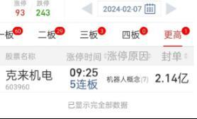
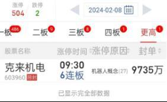
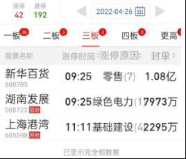
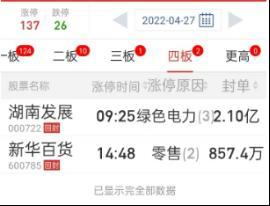
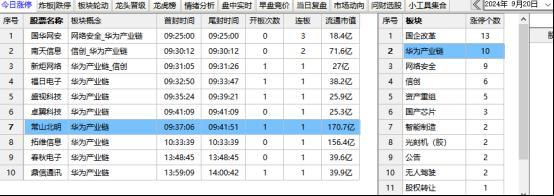
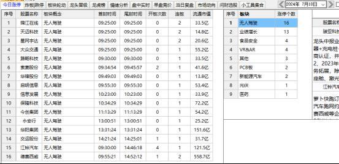
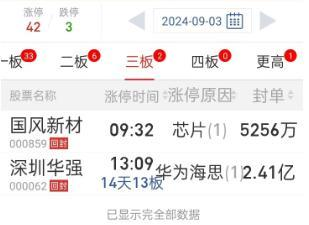

## 一、为何要打板？  

我们所要讲的个股的预期，指的是个股次日的预期，是属于超短交易的范畴，针对的个股自然也是做超短交易所要涉及的个股，比如涨停板、龙头、炸板个股、昨日涨停今日断板个股、近期活跃个股等诸如此类的。对于其他的价投之类的、或未有资金介入的还未启动的个股，去研究次日预期就很没有意义，好比你要问我贵州茅台、中国中免、恒瑞医药等这种个股明天预期如何，那我无从回答，因为问这种个股的，我与你的交易风格肯定不是一类的。  

所以说，个股预期是与涨停息息相关的。说个股预期之前，得先弄明白一个问题：我们为何要去抓涨停？或者说为何要打板？我个人的话，是喜欢盘前就做出严密推演，做前排核心个股为主，所以基本都是通过低吸就能抓到涨停，不需要采用打板。但是，对于低位的个股，比如首板或1进2（抱团除外）这些，随机性很大，那就需要打板来确认。  

这里我先讲个故事吧：上初中的时候，我和我们班第一名在数学上，总是差那么几分，她总是150，而我是140多，无论怎么努力我都超越不了他。后来我俩一起去参加数学竞赛，他依然是150，我没有他的一半，那时候我才明白，我和他的差距并不是10分，他考150是因为试卷只有150分，而我考140是我的水平只有这么多，所以人家去了加里顿，而我去了家里蹲。  

放在股市里也是一样，涨停和涨9%的区别就和上面的故事一个样，他们的差距并不是1%，而是规则限制了他继续涨，如果你能明白这个道理，你就能明白，为何要打板了。  

这就是打板的精髓所在 —— 为了良好的预期!  

首板想打造出二板，卖给二板接力资金，二板的想卖给三板接力的资金，依此类推，你只要不是最后一棒就可以。个股不连板就不会有人接力，只有继续待在连板股的这个体系中，才会吸引资金去接盘，所以打板的目的是为了预期。你们冲进去了，不就是自己给自己创设了一个预期吗？  

打板追求的是确定性，用更高的价格，买入一个确定能引起市场关注的标的，为了辨识度，为了吸引所有的人来注意到它的存在，这就是我们为什么要打板。
讲到这里，我举一个例子：  
周三这天，天茂集团竞价摁了跌停，海南海药高开下杀跌停，在这个时间节点上，大唐电信却高开秒板，第一个晋级2板，资金很顺利得进行了高切低。这天资金为何要打板大唐电信呢？不就是为了买入一个确定能引起市场关注的标的吗？不就是为了能吸引所有的人来注意到它的存在吗？如何实现的了？就是在天茂集团竞价跌停、海南海药开盘下杀跌停的节点来实现的这种目的。或者换句话说，在这个节点上，即便拉的不是大唐电信而是另一只符合超短审美的个股，同样也能让全市场聚焦。对于大唐电信晋级，盘前自然是很难通过推演判断出来的，这种晋级是大资金在这个时间节点上的选择，你能做的就只能是打板跟随。  

对于大唐电信，当天的复盘贴我的点评，大家应该就能够理解了：  
  

保变交通也是如此，在大众交通、科森科技等天地板时，资金切换到了保变电气，但保变电气那天没有给到打板机会，如果给到，在这个时间节点上，你如果看到了又打不打呢？  

通过大唐电信与保变电气的案例，大家应该很清楚了，打板是为了个股次日的预期，如何实现这种预期，你得能够迅速想到，收盘后你所打板的这只个股，能不能成为市场的人气所在，成为市场的焦点，甚至是成为第二天资金绕不开的必须要做的个股。  

## 二、个股的溢价  

溢价是指交易价格超过票面价格，只要超过了就叫做溢价，这个是股市的专业术语。  

简单直白一点说，我们今天5元钱买的股票，明天5 .2元开盘，那么这0 .2元钱就是溢价。如果我们这时候在5 .2元卖出，我们就获得0 .2的利润。  

我们打板是为了隔日溢价，但是打板中途会有炸板，也有骗炮的板。我们要做的是什么?我们要做的是筛选，要去判断涨停板的强度。  

涨停板强度，个人主要认为是从下面几个角度来看：  

### 1、封板时间  

最好的封板时间是开盘半个小时之内，到午盘收盘之后，封板强度逐渐减弱，下午开盘同理。涨停是代表个股上涨情绪的最有力的表现，越早涨停那么涨停板的强度就越大，说明封板资金越坚决。开盘半个小时，这个时间区间资金完成了分歧这个过程，等个股封板了，分歧得到结束，个股的强度也就得到了确定。开盘半小时之内的涨停板，都是主动板，之后的涨停板都偏跟随。所谓主动板，都是一些积极的资金，这类资金类型属性偏进攻，安全性高，第二天个股的溢价率更佳，而跟随板都是主动板的小弟，第二天个股开的位置基本都不好。  

这种就属于主动板：  
  

这种则属于跟随板：  
  

### 2、涨停启动位置  

一般高开涨停的个股涨停强度＞低开涨停个股的强度。高开涨停，说明当日介入封板的资金成本就比较高，第二天留守的意愿比较强，或者说第二天卖出的时候不会过于坚决。相对来说 低开涨停的个股，当日介入的资金成本低，收益在10+以上，第二天相对来说卖出的意愿比较强。 一般来说高开5-7个点再封涨停的板的强度大。  

### 3、当日成交金额  

日成交额过大，那么封的板里面资金容易有大分歧，金额小的话，又比较脆弱。盘子在一般来说日成交金额在2-7亿最佳，资金大也不大，小也不小。这样的涨停板， 一般都是比较强的。当然，个股如果走成了龙头，或者个股是容量抱团，那日成交额达到二三十亿都很正常。  

### 4、个股在板块中封板的排名  

既然是涨停板，那么多半是炒作概念，概念炒作不是一个股票的事，而是板块一起炒。在不考虑有身位板的情况下， 一只个股，如果是板块内率先涨停的，那么就是该板块的带头大哥，所封的板自然很坚决。如果是同板块内已经有了几个涨停板，再涨停的涨停板，其实是享受了板块内强烈的做多情绪，这样的封板资金是很犹豫的，封的板自然是不坚决的。尾板再板的个股，第二天低开都比较普遍。  

举个例子：  
9月10日，充电桩盘中爆发，6家涨停，全是首板。最先涨停的奥特迅就是充电桩里的大哥，次日大高开晋级，后面再涨停的特别是午后才涨停的动力源和惠程科技，次日都低开了。而鼎新通讯次日大高开秒板，这就是所谓的卡位了。  
  

以上这四点就是关于涨停板强度的几个角度，我们学会了如何去看待一个涨停是强还是弱，自然也就能判断出是否有溢价。  

但是，关于预期的讲解，还涉及到很多，以上所讲内容仅为普通个股的正常预期情况。只有先明白个股的正常预期如何，才能明白超预期、高于预期、低于预期、预期差、卡位等又是怎么回事；个股预期还与个股地位、辨识度、人气息息相关，龙头的预期与跟风的预期自然是不一样；个股预期与启动节点也是不一样，正好卡在冰点修复日或卡在高切低节点上或卡在主线诞生日所拉的涨停板，次日预期自然又不同。  

## 三、影响个股溢价的其他因素  

除了涨停板强度之外，影响个股溢价还有很多其他方面的因素。  

### 1、大盘  

大盘今天走得好，那么涨停板的溢价相应也会更高；相反的，大盘今天要是走得差，涨停板的溢价相应就会低。  

### 2、情绪  

情绪好的时候，处于主升期的时候，涨停板的溢价相应也会更高；相反的，情绪差的时候，处于退潮期的时候，涨停板的溢价相应就会较低。特别是情绪刚退潮时，很多不错的涨停板次日都没有溢价。比如9月9日大众交通、科森科技天地板，情绪退潮，这天的天茂集团和老百姓的封板质量都不错，但次日溢价都不太好。而如果是卡在冰点修复日这天拉出的涨停板，次日会享受到情绪回暖带来的溢价，特别是最高板，次日通常能够享受一字溢价。  

案例1：  
2月7日243家跌停，为情绪大冰点，2月8日只剩2家跌停，为冰点修复日，这天的最高板克来机电享受到了很不错的溢价，这就是所谓的冰点空间龙。  
  
  

案例2：22年4月26日市场192家跌停，为情绪大冰点，4月27日减少到了26家跌停，涨停个股多达百家以上，为冰点修复日，这天的最高板湖南发展享受到了很不错的溢价。  
  
  

### 3、个股地位、辨识度  

个股地位高的，辨识度高的，次日更容易享受到高溢价，即便收出烂板，次日也有机会弱转强；如果个股是跟风小弟，次日溢价就需要看老大脸色了。  

案例：  
9月20日华为概念爆发，常山北明虽然封板不是很早，但因为个股辨识度高，次日给到了大高开；相应的，春秋电子这种跟风上板的，次日直接低开了，特别是新炬网络，为第一个上板的首板，但因为辨识度不够，次日都没有常山北明开得高。  
  

### 4、题材  

如果一个题材表现强，多家个股涨停，那该题材的前排个股次日溢价自然就高，最前排甚至一字板；如果题材表现差，也就是说没有个股没有题材效应，个股次日溢价自然就低。  

案例1：  
7月10日，无人驾驶爆发，16家涨停，作为前排的锦江在线、星网宇达次日都是一字板，创板的天迈科技次日也是大幅高开。  
  

案例2：  
8月29日，折叠屏爆发，作为前排的科森科技次日一字板，最先涨停的首板日久光电次日也给到了一字。  
  

案例3：  
9月3日的国风新材，为当天的次高板，板位上仅次于科森科技，而且封板质量也很好，换手也很不错，但因为上板后没有小弟跟随，没有带动题材，结果次日低开了。  
  

### 5、盘后消息面  

如果涨停个股盘后出了利好，或者所属题材盘后出了利好，次日溢价自然就高，如果题材消息很大，这个题材的身位板次日经常能够给到一字板。  
