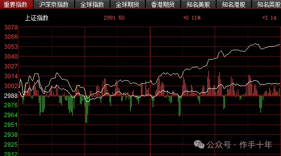
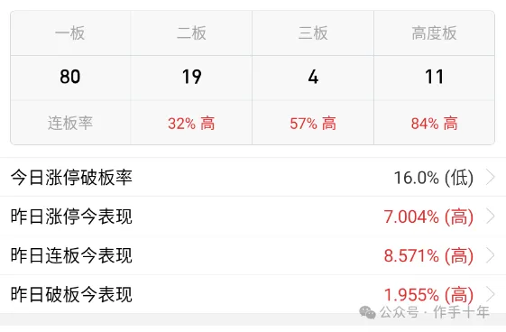
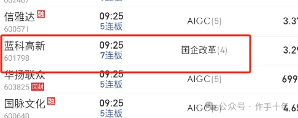
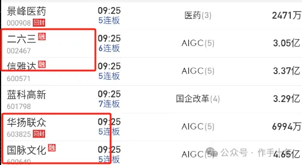
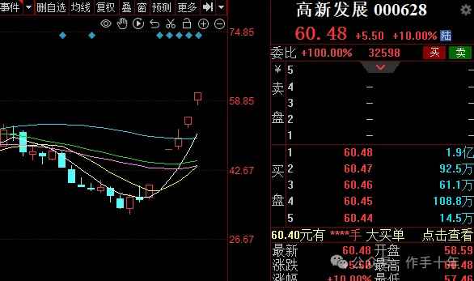

---  
title: 如何复盘  
index: true  
icon: file  
order: 3  
category:  
  - 老杨  
  - 大A  
tag:  
  - 公众号  
---  
  
## 复盘步骤，以及时间分配  
  
（该原始文章发布于2024-2-23）  
  
复盘其实很简单，尤其是当你只需要专注于龙头核心的时候；  
  
### 复盘一共三点  
  
**1.先看大环境，今天的指数环境如何**；  
  
今天的市场情绪氛围如何，指数情绪氛围在是冰点亦或者不好不坏，亦或者高潮，给环境做一个定性；  
  
定性后，思考明天盘面可能会出现的情况。  
  
比如说，以今天指数环境，在配合情绪连续高潮的氛围，是不是明天正常的预期就是高潮之后再高潮，极有可能出现指数共振情绪调整的情况？  
  
  
  
这就是定性，是最重要的一点；  
  
**2.看题材**。  
  
市场当中谁是主流，谁是次主流，谁是非主流；  
  
以当前的市场来说，很明显，主流AI，次主流减肥药，非主流氢能源，汽车。  
  
当然市场当中会存在一些暗线，比如前段时间的国企改，国资，都属于暗线；  
  
  
判断主流非主流也非常简单；  
  
多去看看互联网上什么东西谈论的最多，多看看消息面的利好。  
  
出来的消息是不是具备想象力，是不是切合当下的国家政策，这个政策对行业的影响是不是足够巨大；  
  
就拿sora这个东西来说，他对行业的影响力是不是足够巨大；  
  
  
当然还有一种情况是，哪怕你明知道这个东西对行业的影响不大  
  
但市场把他当成一个对行业影响很大的东西来炒作，那么你也要相信他对行业影响很大；  
  
这叫装糊涂，炒股很多时间都需要去装糊涂，只有足够会装糊涂的人才能赚到钱；  
  
**其三，选股**。  
  
选股就最简单，一个个股逻辑，如现在的高新发展，有绝对的硬逻辑，绝对的核心地位；  
  
  
不同交易模式，选股方式不同，比如首板一进二，讲究的是个股逻辑；  
  
情绪投机炒作注重的是股票诞生的节点，老杨我的选股策略就更偏向第二种，关键节点诞生的关键股票；  
  
其次，就是靠市场选择，但股票走到一定高度，市场聚焦的自然就是这个标的，市场选出来，做跟随就行；  
  
长白山如此，中视传媒如此；  
  
所以选股，看个人的交易模式，做低位首板，或者一进二，重个股逻辑，这个需要每天多看研报，对个股有比较深的理解，这个复盘花的时间最多；  
  
其次，只做核心只做人气，这个花费的时间比较少；  
  
### 时间分配  
  
三个复盘点，花时间最多应该是第一条和第二条，第一条是择时；  
  
每一种盘面情况都需要尽可能的去推演清楚，同时制定合理的应对策略；  
  
第二条次重要，对于主流非主流的界定非常关键，尤其是再混沌，主线不明确的时候，第二条的复盘能让你少亏很多钱；  
  
第三条，老杨个人认为最不重要，  
  
有句话叫：  
风口来了，猪都能上天；  
  
如果不做低位首板，又或者不做一进二，只做核心，那就让市场给我们选股票就好；  
  
这就是老杨每天复盘的步骤，第一条花的时间占了70%左右，第二条20%，第三条10%。  
