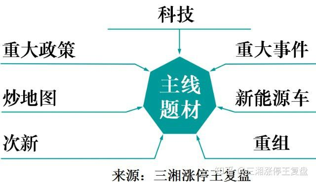
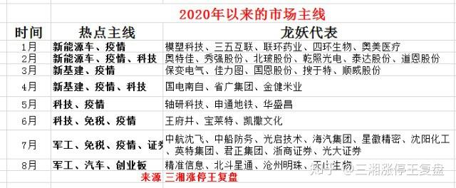

（[原帖](https://zhuanlan.zhihu.com/p/217672085)发布于2020-09-05）  

## 一、大局观  

**抓住主要矛盾，把握主要机会**  

《矛盾论》是毛爷爷主要著作，矛盾有普遍性，有特殊性，有主次矛盾，作为股民，我们得善于抓住人生和股市主要矛盾，主要机会。将主要矛盾解决了，主要机会把握好了，其他的都不是事。主线就是牛鼻子，我们最好是能牵着牛鼻子走。  

**股市中的主要机会一方面来自于市场自身周期和情绪逻辑驱动，一方面来自于外在消息和事件驱动。不是一个股，而是一个板块。甚至不只是一个板块，而是一段行情。不是一天，而是一段时间，比如一周，一月，甚至一个季度或更长事件**。  

所以股市有小盈小亏，有大赚。而大赚往往来自于把握的市场主要机会。也就是远哥经常讲的热点主线。这与你打板、低吸、核心资产持有模式不矛盾，都得往主线上靠。主线不在，少去蹭。主线在，多去占地。打板也好，低吸也好，都得往主线上靠。打板低吸是短期或中期爆发式主线。核心资产持有是中期或长期趋势性主线。  

## 二、市场主线定义和分类  

**1、市场主线的定义**  

市场主线是资金的主战场，是赚钱效应所在，是一段时间以来股市的热点风口，是股市规律的板块效应，是游资和散户乃至机构蜂拥而至的情绪推动，当然也有事件和逻辑深层次的强大驱动。主线就是主要矛盾，主要机会，主要的赚钱点。非主线就是跟随，不规律，不成型。主线就是主涨，规律，主升浪，成型有队伍。**主线的牛股一个接一个，主线的涨停喜欢集体涨停，就是一个板块某日多股涨停，就是远哥俗称的关键日**。非主线难以集体涨停，但可以出现个股脉冲或涨停。  

**2、市场主线的分类**  

从时间划分，有年度主线，季度主线，月度主线，当日主线。  

从题材划分，有科技主线，汽车主线，军工主线，次新主线，重组主线，某事件主线等等。  

从规模划分，有超级暴利主线，有普通暴利主线，更多是情绪周期轮回主升主线。  

题材热点主线图表分类。当然还有一些其他题材，比如战略性新兴产业中的节能环保、高端装备制造、新能源、新材料等等。总体来说突发性题材就是重大政策和重大事件引起的，而与科创板创业板相关更多的是科技题材、新能源车题材，毕竟其中科技和汽车等占比高一些。  

  

## 三、年度月度大主线  

**1、年度月度主线如何寻找**？  

年度主线从关键月份寻找。比如上半年的一季度尤其是2月3月份很可能诞生上半年的大主线，而下半年的7月8月份也比较的关键，往往是下半年的大主线。更多时候，股市以几年为一个牛熊周期，以半年为一个主线周期，以阅读为一个热点轮回周期。  

月度主线跟年度有点类似，每个月份的刚开始几个交易日相对是最好赚钱的，而几个初始交易日的热点往往延续性更强。而到了月中下旬可能另外启动新的热点。如此往复，周期轮回。尤其是在注册制的背景下，热点轮动加快，当然仍然有迹可循。  

**2、2020年的市场主线**  

  

## 四、主线复盘策略  

**1、复盘比看盘更重要**  

看盘看信号，执行计划，复盘看持仓和主线，定计划。看盘看持仓、异动个股，情绪信号、主线板块。复盘总结市场主线，前瞻次日或未来主线，制定持仓计划和新作战计划。复盘肯定比看盘重要，不要本末倒置。你是花4小时看盘几分钟复盘？还是花至少4小时复盘少于半小时操盘？  

**2、如何复盘确定当下和次日主线**  

你可以不做打板涨停，但可以通过每日涨停，观察当期市场主线。很多时候确实有一日游，但也有很多时候主线是能够持续的。持续是两种，第一是龙头个股的持续，第二是主线板块中的个股接力表演，牛股接力。当然，如果你做短线，甚至接力打板，那就更需要复盘了。  

**第一通过各大涨停复盘找出当日最强主线，龙头次日是否能连扳，能否打接力板**。双林股份2板，长房集团2板，包括注册制以前的2板3板甚至更高接力都是如此等等。  

**第二确定市场主线有延续性后，自上而下寻找挖掘板块低估个股**，比如远哥在《7月36日翻倍！8月金股发布！》就前瞻性地重点提示了聚灿光电。再比如《创业板盈亏效应详解，热点龙妖9月新牛股》，股池发布通合科技、新余国科、安控科技等，上周都迎来大涨。自上而下的思维非常非常重要。找到主线，就是找到了财富暴利的钥匙。然后按图索骥，淘宝掘金，打板低吸，都可以！  

**第三就是留意盘后盘前的突发消息，消息不是最重要的，最重要的是如何解读消息，解读消息后如何确定个股**。首先如何确定消息的重要性，凭经验判断，还有凭热度判断，股市是否会反应，反应程度如何，主观经验和客观热度都有一定参考性。其次就是确定个股，板块中的先发涨停，这时候往往会连扳，而板块中的低价低市值股更可能首板。在注册制以前，突发消息会引起连续一字，比如蚂蚁金服所引起的君正集团的集体涨停。注册制以后，创业板的个股会大幅跳空高开，确定板块有延续，这个时候可以抢。比如周五的乾照光电、长房集团等都是这类逻辑。  

## 六、开盘找主线策略  

**1、到底如何看盘？**  

今天其实并不是讲看盘和复盘，改天远哥会单独讲解看盘和复盘。今天先简单讲讲看盘。看盘第一看持仓，到底要不要卖，第二看目标股，到底要不要买。第三看主线板块，到底要不要干。第四看市场情绪，到底赚钱效应还是亏钱效应。第五不要关灯乱看，要有计划，别冲动，但又要该果断就果断，不矛盾，自个理解。  

**2、看盘确定主线**  

高开最多、开盘涨幅最快板块上涨最多的那个板块很可能就是当天主线。激进选手选择那个高开最多的那个直接干，再激进的选手可以主线中已有涨停干接力连扳，他不一定是高开最多，但很多游资可都是铆足了劲，只是干与不干而已，稳健的选手可以等主线头炮头几炮打响，发现没问题继续往下干，在板块里面找低价的已经有异动涨幅有，至于你是几个点进去，完全取决于风格和形态。  

从反映速度看，第一集合竞价，高手应该就能看清，第二，开盘几分钟，也能够看清楚了，第三开盘一小时，很多人应该看清楚了。第四，也有不少人，收盘后才知道。都知道抢占先机，但先手取决于意识和行动。  

当然有些不是开盘能确定的。开盘没反应的，后面才上涨的，就需要一定的看盘水平，但是也不难。我们最好搞个好的界面窗口，方便观察异动板块。板块归类，一目了然。当然也要熟悉个股，才知道主线究竟在何方。远哥天天会讲主线，主线清清楚楚明明白白，挖掘主线个股不是大海捞针，而是定点袭击。明天我会讲下周我们如何找主线，定点袭击哪座碉堡！  
