## 一、理论解析  

新题材启动，前排个股会大单一字，但基本上都会存在一只后排个股通过换手往前排卡位的，这就叫换手卡位龙，卡掉前排个股的那一刻就是买点。  

两大要素：  

（1）换手  

我们常形容一个涨停板为缩量加速板、换手板、爆量分歧板，缩量、换手、爆量的锚点就是涨停板的成交量与上一个交易日涨停板的成交量相比是大幅缩小、接近还是大幅增加，是一个相对概念，不是绝对的。  

如果当天涨停板的成交量与上一个交易日涨停板的成交量接近甚至超出，但又没有达到爆量，那就叫做换手板，表现在分时上有所分歧但并不是大烂板，分歧比较健康；  

如果当天涨停板的成交量与上一个交易日涨停板的成交量相比大幅缩小，那就叫缩量板，表现在分时上就是加速上板；  

如果当天涨停板的成交量与个股近期的成交量相比大幅增加，那就叫爆量板，表现在分时上分歧很大，多空双方激烈对决，收出了大烂板，实际换手率通常会达到30%，如果盘子小，甚至达到40%以上。  

案例：爆量分歧板  
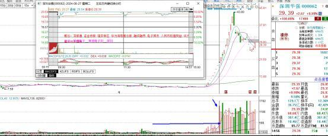  

缩量加速板  
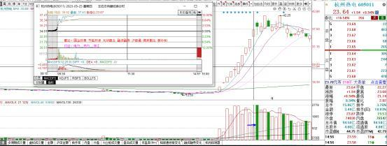  

分歧换手板  
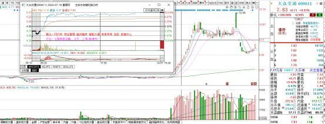  

一般来说换手的票更加健康一点，因为换手就表示筹码交换，低成本的筹码出去，高成本的筹码进来，更加容易锁仓，有利于第二天继续拉升。所以尤其是弱势行情下，打板必须得看换手量能。  

当然，并不是说某个票一直走换手板就是好的，有时候也必须要走缩量板，也就是加速板。因为换手往往意味着分歧，一直分歧就是弱，要有一个分歧转一致（弱转强）的过程，才更加能走出气势来。  
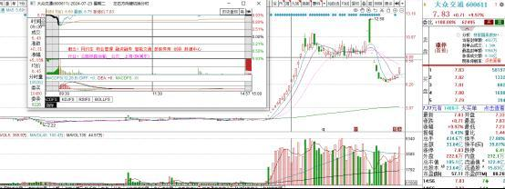  

（2）卡位  

一个题材启动时，涨停个股按照身位、封板时间进行排名，身位越高排名越靠前，如果身位一样，则封板时间越早排名越靠前，名次越靠前的，次日预期理应越高。如果一只排名靠后的涨停个股，次日却比排在它前面的个股开得更高、更早晋级，那我们就说这只个股在往前排卡位。  

案例：  
24年9月10日，充电桩盘中启动，6家涨停，全是首板，300的金冠不做对比，只比较另5只主板个股次日的开盘情况。最先涨停的奥特迅就是充电桩里的大哥，次日大高开晋级，后面再涨停的特别是午后才涨停的动力源和惠程科技则是后排，次日都低开了。而排第三的鼎新通讯次日大高开秒板，先于科陆电子甚至奥特迅上板，这就是所谓的卡位了。  
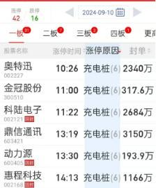  

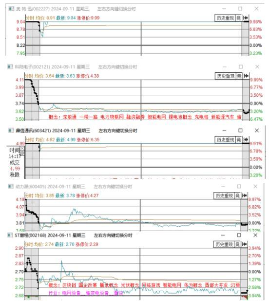  

卡位成功的鼎信通讯次日又给到了高溢价，而奥特迅虽然也晋级了2板，但因为被卡位了，次日则低开了。  

## 二、实战案例解析  

### 1、引力传媒  

23年11月16日，抖音概念启动，6家涨停全是首板，佳云科技为创板，其余5只都是主板，只需考虑这5只主板后续是否有个股卡位即可。由于都是同身位，以封板时间的先后顺序可以给这5只个股进行排名：广博股份—省广集团—丽尚国潮—引力传媒—遥望科技。  
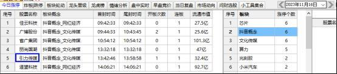  

到了11月17日，排第一的广博广博大单一字，抖音概念存在持续炒作的预期，可以积极参与；排第二的省广集团仍旧是第二个股封板；排第三的丽尚国潮炸板后，排第四的引力传媒回封，引力传媒往上卡掉了丽尚国潮。  

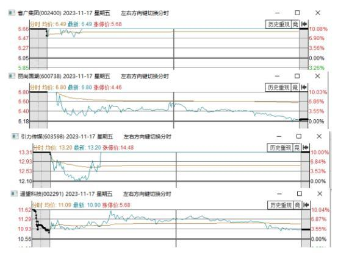  

到了下一个交易日即11月20日，广博股份继续大单一字维持着最强，而引力传媒弱转强加速晋级，先于省广集团上板，继续往上卡掉了省广集团，省广集团因为被卡而断板了。到了这天，抖音概念只剩下了广博股份与引力传媒这两只个股。  

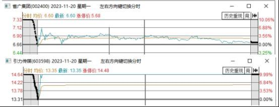  

引力传媒这一天先于省广集团上板，出现了换手卡位龙的特点，这个板是可以试错的。我个人因为不喜欢临盘交易所以没去，但这天收盘后已经可以基本确认引力传媒就是抖音概念里的换手卡位龙，所以21日盘前做了引力传媒的计划，并执行合一关注了，吃到了20多个点。  

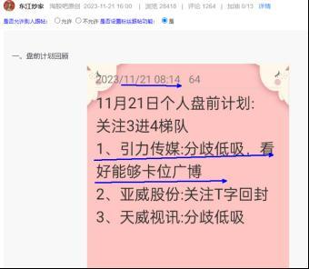  

到了21号，引力传媒大高开，开得比广博股份还高，且开盘秒板，卡掉了广博股份。  

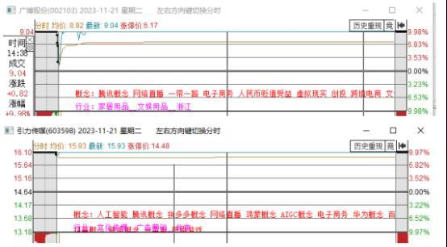

但如果你等引力传媒卡掉了所有竞争对手后再去的话，不仅位置偏高，而且引力传媒卡掉广博后，次日也是一字板不给机会了。所以最好的交易是，当引力传媒卡掉丽尚国潮后，就应该留意次日能否卡位省广集团，一旦先于省广集团上板就可以关注。甚至，通过对比两者的盘子、筹码结构，就可以大胆推测引力传媒有很大可能卡掉省广集团，在20日弱转强开盘后直接半路关注。近日的国海证券与酒鬼酒我就是大胆推测出来了有成为换手卡位龙的潜质，2板就积极关注了，这在后面再详细解析。  

引力传媒在主升浪之前，于11月6日与11月7日连续炸板，这是为后续强势拉升洗盘做准备，这种就是比较不错的筹码结构。  

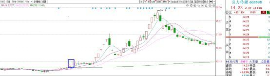  

当一个题材启动后，为了抓捕换手卡位龙，我们可以制作一个表格，每天按照身位、封板时间的先后顺序给涨停个股进行排名，这样可以很方便得观察到是否有个股存在卡位情况，一目了然。  

比如刚提到的抖音概念，从表格中，可以很清楚地看到，引力传媒在一路往前卡，11月17日当引力传媒卡掉丽尚国潮后，就可以开始留意了，到11月20日，引力传媒卡掉省广集团时，基本就可以确认为换手卡位龙，理应积极关注，后面如果继续卡掉了广博股份则保持着关注，如果没有卡掉广博股份，那取关即可。  

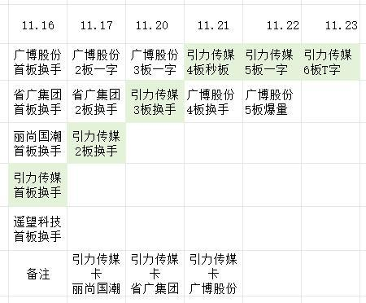  

### 2、国海证券  

24年9月24日，大金融爆发，20只个股首板涨停，按封板时间排序如下：  
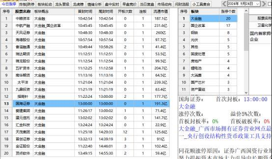  

到了次日即9月25日，前排的中粮资本、中航产融、天风证券大单一字，大金融存在持续炒作的预期，可以积极参与。  

排第8的五矿资本大单一字，但排在它前面的海德股份、香溢融通、瑞达股份、锦龙股份却都没能大单一字，那这4只个股可看做被五矿资本一字板卡掉了，是率先被淘汰的。  

再往后看，可以看到排第13的国海证券高开强势上板，比排在它前面的香溢融通、瑞达期货、锦龙股份、南华期货、太平洋等强势许多，出现了很明显的卡位动作。  
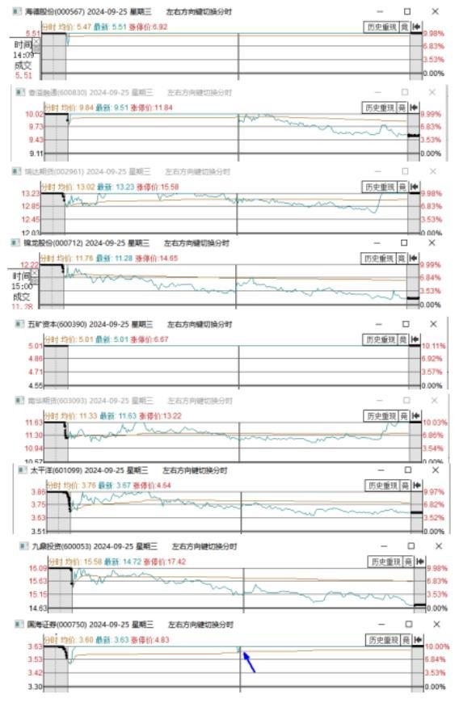  

再往后看，可以看到排第14的爱建集团一字板，也出现了往前面卡位的特点，但由于不是换手板，不符合我们所要抓捕的换手卡位龙。  

国海证券因为名字好、代码好，其实是可以在24日金融启动后，盘后就可以预选出来。国海证券=国泰君安+海通证券，代码 000750 正好与新中国成立75周年呼应，复盘一旦发现了这玄机，就可以加入自选观察，次日是否会出现卡位，一旦出现了卡位，就可以积极关注的。  

与五矿资本一字板卡位不一样的是，国海证券是换手上板卡位的，有成为换手卡位龙的潜质。临近11点半时，国海证券炸板回封，就是很好的关注点了，个人当时是板上关注了，在当天晚上的直播里，也是公开提到了个人这个操作及逻辑。  

且在次日即9月26日，我在公开分享的盘前思路里，对于国海证券继续看好，考虑做T思路保持关注。这一天是给到了大家很充足的时间去关注的。  
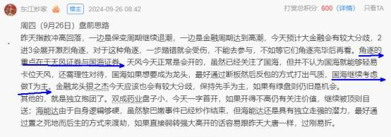  

言归正传，9月26日这天，金融大分歧，进行了大洗牌，除了恒银科技与五矿资本继续一字外，其余金融个股都出现了不小分歧，最终五矿资本、天风证券、中粮资本、爱建集团、中航产融、国海证券先后晋级，而新力金融、海德股份、南华期货、天茂集团、瑞达期货断板。这天，国海证券又沦为了最后晋级的3板金融个股。  

但到了9月27日，国海证券弱转强T字晋级，往前卡掉了爱建集团与中航产融，再次出现了换手卡位龙的特点。因为这天的极致弱转强卡位，收盘后迅速吸引到了市场资金的关注，到次日直接顶了一字没有给到关注点了，且竞价封单非常之大，从竞价的封单上来看，卡掉了五矿资本与中粮资本，仅次于天风证券了。  

我们把这一过程绘制成图，就非常清晰了：  
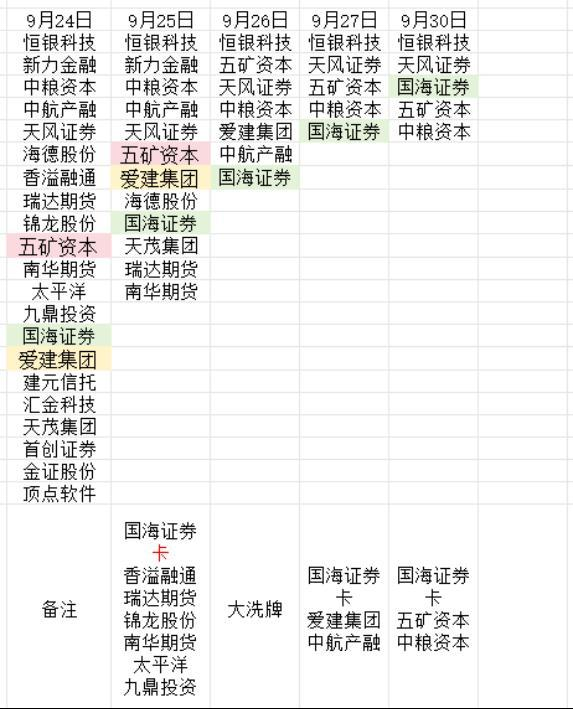  

很显然，国海证券的最佳关注点就在于9月25日盘中炸板后的回封，或者9月26日分歧关注，到9月27日就只能头铁关注了，到了30日则关注不到了。所以，当题材启动后的次日，一旦发现后排个股有往前卡位的动作时，就可以积极关注了。  

### 3、酒鬼酒  

24年9月26日，白酒启动，17家个股首板涨停，按封板时间排序如下：  
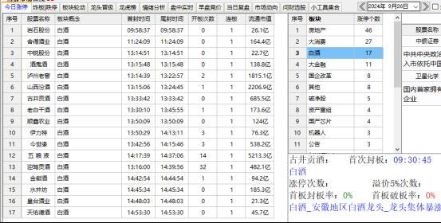  

我个人复盘通过对比盘子、筹码结构，发现酒鬼酒是比较不错的。  

从盘子来看，酒鬼酒100左右的流通市值，符合当下市场审美，像泸州老窖、五粮液、山西汾酒、古井贡酒的盘子显然太大了，拉升空间和韧性是有限的；像岩石股份、中锐股份、黄台酒业的盘子又太小了，容易被控盘，在万亿级市场，小盘子不顶一字就是弱了；像酒鬼酒、舍得酒业、老白干酒、金徽酒、水井坊这种100亿流通市值的就比较好，既有容量，又不算大屁股，容易走出强趋势。  

从筹码结构来看，酒鬼酒在9月19日拉出过涨停，在这批白酒的涨停个股里，只有岩石股份与酒鬼酒今日有过涨停，岩石股份作为龙一次日自然是大单一字板的，不一字则低于预期，那酒鬼酒就成为了最佳选择了。  

酒鬼酒上升三部曲的K线形态：  
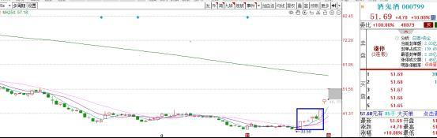  

26日晚上通过复盘，提前锁定了酒鬼酒，那到26日，就只需观察酒鬼酒是否出现卡位动作即可。  

到了26日，排第一和第二的岩石股份与舍得酒业都是大单一字，白酒存在持续炒作的预期；排第四的酒鬼酒大高开，比排第三的中锐股份开得更高，这说明竞价酒鬼酒就把中锐股份卡位了；如果稳妥些，可以继续观察，酒鬼酒先于中锐股份上板，那可以很确定，酒鬼酒把中锐股份卡位了。  
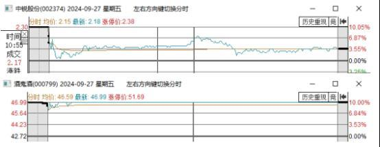  

对于酒鬼酒，因为看好其成为换手卡位龙，个人在9月27日盘前就做好了相关计划，当天竞价就出现了卡位动作后，开盘就关注了，次日直接躺了一字板。包括大金融300的补涨，也是很精准的就在盘前锁定住了，当天竞价关注后，次日也是20cm一字板躺赢。  
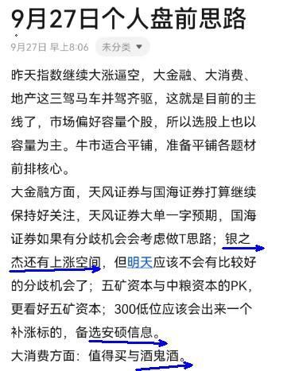  

但在公开区，个人没有明确提示是安硕信息与酒鬼酒，只是给到了大致方向，看大家的功底如何了。如果在公开区也都明确提示的话，对于家人自然是不公平的。  
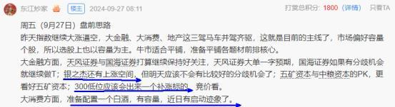  

对于白酒的炒作，个人也是每天都在记录着，个股仍旧还在竞争之中，酒鬼酒能否成为最终的胜利者，还有待市场认证。  
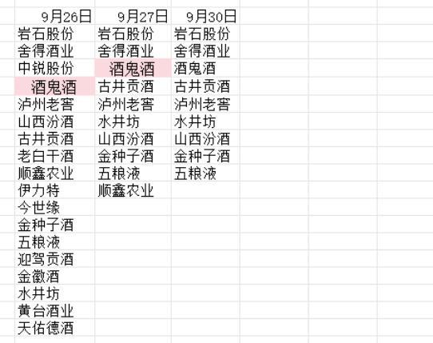  

总结：  
（1）新题材要有持续性，有走成主线的预期，启动力度要比较大，当然一些小题材里，个股也是存在卡位的，比如本文所述的抖音概念；  
（1）不需要等卡掉所有个股后才去买，当出现后排通过换手往前排卡的特点时就要特别留意了，一般发生在题材炒作的第2到5天；  
（2）卡位既可以发生在同梯队，也可发生在不同梯队；  
（3）换手卡位龙一般是出现在共振题材启动的梯队里，但不是绝对的；  
（4）题材启动次日需要有大单一字个股，这样题材就有持续炒作的预期；  
（5）换手卡位龙需要把主板和创业板个股分开讨论，本文只讲述主板个股。  

抓捕要点：当新题材启动时，我们要按照个股的身位、封板时间进行排序，每天记录，然后从中看哪只个股是后排往前排卡的，一旦出现卡位动作后，就要特别留意了，可以先积极关注一部分，不一定需要等卡掉所有个股后再关注，因为等卡掉所有个股后，该个股也一般会在比较高的身位了，且因为成为了换手卡位龙，次日一般不会再给到比较舒服的关注点。  

此战法收录于《东江炒家龙头战法独门绝技之超短交易模式》稿件里，在稿件里还有创业板接力、可转债套利、一字板首开、核按钮低吸等10多种非常实用的超短交易模式！  
