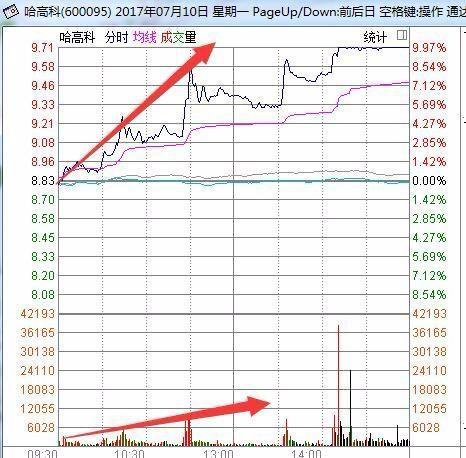
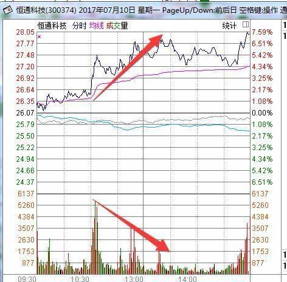
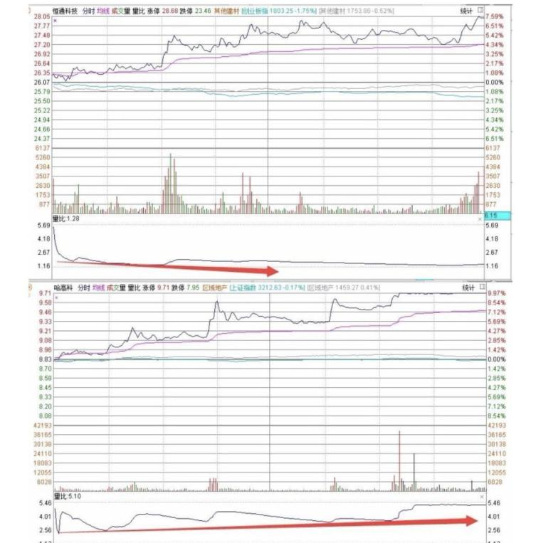

（[原帖](https://www.taoguba.com.cn/Article/5547784/1)发布于2024-01-10）  

分享个人一进二、龙头战法等模式的高胜率选股原则，当然市场是动态的，我们先从一些死的固态操作上开始学，对固态操作进行纠错，再配合对动态市场各个节点、情绪、破局点升华的判断，那么你距离悟道也不远了，除此之外，耐住的寂寞，学的会空仓，会换位思考，则胜天半子  

我们可以一个月只出手一次，但正是那一次，让我们账户控制了全月回撤，只有$圣龙股份(sh603178)$$捷荣技术(sz002855)$的5倍，即使全年5倍，你满足吗？  

所以“一个好的模式体系应该对于风险的识别具有极高的灵敏度，而不是说只强调进攻不注重防守。”  

先说下最近操作的总结  

近期节奏不错，虽然市场惨烈，但是我们开年惠威科技、长白山的涨幅都吃到了，好像有点格格不入，复盘了一下：主要得益于以下原因吧  

1、只做潜在主线（因为目前混沌完全无主线），比如勉强有21梯队、321梯队  

2、只聚焦前排（比如：东北只做长白山、上波消费电子只做惠威、再上波也只做亚世光电）所以不要问我太多后排杂毛，无论市场好坏，提高审美很重要  

3、潜在风险点立马保利开砸（比如惠威科技三板时，梯队消失，消费电子情绪标可川，辨识度日久光电深水负反馈，直接第一个跑，保住10cm利润）  

4、算是我的大招吧，对市场情绪和周期节点的各种判断，还有各种破局点牢记于心，每个情绪周期及破局节点我该怎么做收益最大最安全（情绪共振、周期节点、破局点）所以兄弟们复盘看多就发现，3板涨幅结束的惠威，我们首板就准备干；9板的亚世光电，首板已经关注，三板就低吸了；包括长白山3板路上已经提示买入...都得以于情绪周期破局和市场意愿判断  

好了，正文开始：  

**1、无论如何都得看势**（即跟着市场选择走四两拨千金）  

1）只做 主线 主升 主龙  
判断势的类似底部和启动信号：底部首根红k放量包住前一根缩量绿k。（最好红k最低点比绿k最低点低，且放大量涨停即为启动信号）  

2）从大盘看板块，从板块看个股（大局观）看大盘和板块趋势如何看 最直观 “量”“换手”，观察趋势大致判断为底或顶后利用“量能和换手突然或不断放大”来进一步判断牛市即主线热点，不断放量 有换手异常上升简单判断为牛 不断缩量 低换手为熊。  

**2、量化繁为简，量价先行，一切技术指标都应先从量出发。**  

1）量价结合，如095和374，095量价结合，而374量价背离，选择上购入095。可能你用量比看直观一点  
  

  

  

2）缩量时买入，放量时卖出，有量才有安全边际（千万别弄反，特别为龙头股异常放大量时抛出），放量下跌观望即可。  

**3、趋势线**  

5、10、20日线如同3匹马，3匹马缠绕同时向上大概率反转，3匹马中越多马向上跑的越快，越向上方倾斜越有力。（10日线最可看出主力意图）  

**4、每股净资产 和 每股未分配现金流** （筛选龙头质量）  

每股净资产大于2 每股未分配现金流大于0.5为更有发展潜力更好的公司，如都为负则超级垃圾公司 或低于上述为低发展性公司 可筛选忽略 （为何会使用这俩指标，因为更为真实，像其他财务指标市盈率等等都可以主力、公司打造，所以也戏称“市梦率”）  

**5、目前龙头属性：底部低价+流通市值小+市场驱动**  

底部低价：通常小于10，越低、回调越大当然上涨空间越大，1-100和50-100很明明了，拳头缩回去再打出来更有力。  

流通市值低（特别是自由流通市值）：越低主力越好控盘。  

**6、心即是佛**  

1）总结让我赚钱的不是我的观点判断买入 而是持股 持股目前选择用三五天法，往前看  

2）天往后看五天，买入后3-5天持股待涨切莫过多操作，买前问自己有多大空间，有50%以上则可买入，若市场没有自己心仪标的或错过心仪标的则空仓等待机会，切莫盲目急急忙忙的买入卖出，买在自己舒服的点位，高手在于控制回调，而非收益翻倍。一个月一年做几笔适合自己的舒服的交易，富可敌国。  

**7、既要判断多方力量，也要判断空方力量**  

市场上大多数“老师”，都只会喊着主力来了！大单来了！上涨力量强！实则股票上涨下跌的源头是何？手中的币是股票上涨的源头，而手上的股票就是股票下跌的源头，多人用钱买入则股票上涨，多人持票不断抛售则股票下跌，炒股既得判断多方，也得判断空方。多问自己形成自身模式，少依赖他人。  

**8、不断锻炼盘感**  

如每日涨幅榜龙虎榜筛选出看好标的，看看共通之处，第二日验证，不断练，三日不练门外汉，只有买入身处股市才会认真学，只有亏损才会悟道。  

1）当板块大多数非一字涨停出现，可能面临行情尾声。  

2）龙头之所以为龙头因为有小弟助攻，形成规模效应，若一个龙头独涨而板块个股大跌甚至跌停，你觉得龙头能走多久？  
