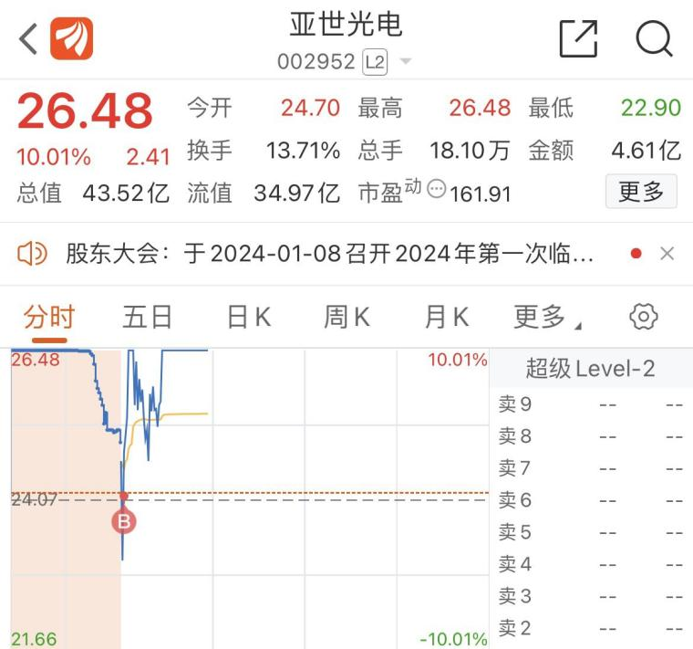

（[原帖](https://www.taoguba.com.cn/Article/5655263/1)发布于2024-02-22）  

**“属性纠错”模式**  

这是我们今天触发的模式内玩法，我们不多赘述，直接上干货，拿往期案例和今天实盘中案例来做个分享，相信道友们们会大彻大悟，这个模式不仅对与判断资金每日主要进攻方向很有作用，同时利润和确定性非常高。  

首先什么叫属性纠错，这个模式怎么玩呢，我能不能只做这一个模式不断复利
可以，并且一旦出现就是大肉，但出现次数会较少，有时候可能一周只有一次或一次都没有，对交易心态和对管住手空字诀只做这类模式的耐性要求很高，这个我一点不担心我们土家军，空字诀对我们来说是最轻松的，无论是股灾或是强势市场无买点，特别是对土家军中的一批龙空龙选手。  

接下来说一下怎么玩转这种模式：  

第一步：每天收盘后将今日全市留下长上影线个股加入自选，这个需要自己多做功课，有一些软件也有昨日触板回落或冲高回落个股集合  

第二步：第二天竞价结束后观察哪个标的开盘价在昨日长上影线上，这里我们拿12.22-12.25的中光学为例，中光学在12.22周五涨停后炸板，当天留下长上影线，当天最高价为21.9元（如图）  
  

而后12.25周一25分竞价结束后开盘价为22.19，一举越过昨日长上影线高点（如图），那么当天个股属性就叫属性纠错，昨天市场资金不小心砸错了，那怎么办？资金肯定要想方设法赔偿你各种补偿你表达对昨天错误行为的歉意，不然最后受害人闹大了撕破脸（市场失效或走向退潮）对双方谁的不好。  
  

那么换到个股身上如何理解，那么资金当天就会对昨天砸错的个股属性进行纠错，我们今天补偿你，把你的属性当作主要进攻方向，所以似乎看看这个开盘价直接冲破昨天最高点价位的个股属性  

注：开盘价直接突破昨日长上影线高点是最强的一种，而盘中站上昨日长上影线高点五分钟至十分钟则较弱。  

那么这个模式触发后知道当天资金主要进攻方向为纠错股的属性，比如案例中的中光学所代表的消费电子大类，那么我们怎么知道买谁呢，这里给大家当天的三大买点，分别为第一买点、第二买点、第三买点，涨停板数和利润会逐步降低，也即实现第一买点则大肉，第二买点则中肉，第三买点则小肉  

这里教大家**第一买点**：  

买该板块最高标，当天的最高标是谁？这个股相信大家非常熟悉，这里借用一下湖南人道友对于12.25日连板梯队复盘（如图）
  

**当日最高标是四板亚世光电**  

当日开盘直接下杀至-5给了低吸机会，买入当日躺赢10cm+大肉+后续直接躺六个板接近七个板翻倍，最后亚世光电一路走到九板（买点如下）  
  

注：这里边所有案例都只说我往日做过的股及当日买点的顶级理解  

那么当天错过或高标一字情况下退而求其次的第二、第三买点是谁，这里两个选项：  

**第二买点**：当天的该板块身位次高股  

当天亚世光电四板身位往下看看，连板数第二高的是捷荣技术三板，当日捷荣技术开盘直接下杀至跌停买入，当日收获20cm+大肉+隔日一个涨停板溢价，共30cm利润（如图）  
  

**第三买点**：买当天属性纠错个股本身  

即12.25当天开盘价收复昨日最高点的中光学本身，这是迫不得已的最后买点，也是利润最少的买点，所以当快速逃离隔日冲高出就好，当天五个点开盘买入收获涨停，隔日冲高六个点卖出后逐渐回落，共收获11cm小肉  
  

看完上述案例回归今天盘面相信土家军们应该明白为什么竞价结束后让大家关注宁夏建材这个股，因为宁夏建材昨日涨停被砸留下长上影线而今日人工智能或算力+央国企改革利好出炉，竞价结束后宁夏建材开盘价16元直接突破昨天长上影线最高价即涨停价15.82元，而宁夏建材是什么属性当日纠错呢，人工智能或算力+央国企改革，配合利好则更容易辨别，那么今天竞价结束大家就可以知道当天资金会主要进攻人工智能或算力+央国企改革属性  

当天第一买点最高标是谁？第一买点大肉为三板的国脉文化直接应验资金主要进攻方向，抢一字晋级四板  

那么第一无买点则延递至第二买点中肉则为当日一进二的中科金财这类中科系，当天开盘砸至五个点买入收获涨停  

第三买点则为宁夏建材，当日小亏，所以这也充分说明了资金在有更好的买点选择下对于买点顺序后排利润的递减，我们也同样可以用后排利润反推前排高度；  

比如对标中光学属性纠错下，第三买点的属性纠错个股本身都当日走了一个板+隔日冲高溢价，而今天的宁夏建材却冲天炮涨停后被砸出现亏钱效应，那么自然对于人工智能或算力+央国企改革这个属性搭配的前排高度预期和利好属性持续性就要降低，并且还有一个关注点，不知道同学们有没有发现，就是这类属性纠错模式中开盘后第一第二买点都非常喜欢下砸，如亚世光电、捷荣技术、中科金财，因为资金竞价结束人人都心知肚明要进攻这个方向，那么承接就是肯定的了，既然承接这么好人人后续都想来，在大多数人反应不够快还存在预期差的时候拿更便宜的筹码降低风险提高收益就是其目的，所以这也是一大惯性值得注意，可以让你更好的把握属性纠错的模式内买点。同样，多看看个股股性压力位等将大幅提高模式胜率，世间无任何模式有百分百确定性胜率，若追求百分百则大可去庙宇求神拜佛，无他，但经过长期检验则为稳定复利账户做大做强的关键，切记，股市永远都不是看你今天或短期内大赚或大亏，而是比谁活的更久，能稳定的将账户做大做强这才是关键，另外注册制下，读懂资金你才是资金，读懂主力你就是主力，共勉  

悟道的时光特别短暂，不知不觉又到文章末尾了，全网唯一，让你距离悟道仅有一步之遥，所以实盘悟道帖都将是你最快速易懂去读懂情绪读懂市场周期的尚方宝剑，最终轻松拿捏“龙头、补涨、切换”，拥有属于自己的极致赚钱效应，达成一朝悟道之境。  
