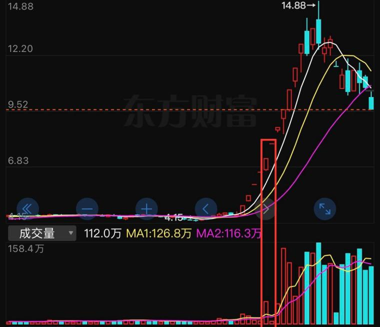
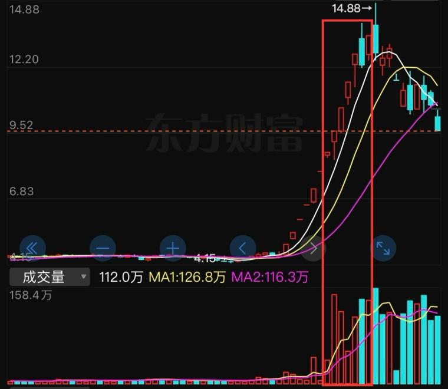

（[原帖](https://www.taoguba.com.cn/Article/5636977/1)发布于2024-02-12）  

股市中有很多的技术指标，但实用的并不多，所以并不是所有技术指标你都需要弄懂，都需要熟练运用，我们只需要像股市中的赚钱效应一般，只看核心龙头，远离杂毛就好，也就是只看核心指标，其他杂七杂八指标不必过多理会，避免混淆  

（下文也将只说明能让你赚钱的各种基础指标，全文干货！注意认真阅读！）  

## 1、成交量（量）  

一切技术指标回归核心，都是量、换手、价，历代游资存在所有指标都不看，只看成交量就一招鲜吃遍天的情形，所以可想而知其重要性。当然这里不死板，希望大家可以成交量和换手结合一起看。  

我们来拿近期人气较高的龙头深中华A举例  

首先，有量才有一切，有量才有人气，有量才有更多资金愿意参与，本质来说大白话是什么呢，我们换位思考解读一下何为“量”，假设你有10亿资金炒股，我们梭哈买入深中华A和后排杂毛股，那么我们就要思考两个问题：  

1、今天买入有没有那么多筹码能成交卖给你  

2、假设今天都买入，明天能不能一次性成交卖出  

那么这个时候我们当然就要找最具人气的深中华A而不是后排杂毛了，因为深中华有量，我们的10亿大资金可以每天买入卖出进退自如。  

而后排无量无人问津，我们10亿资金可能买入也需要连续10天才能把全部零零散散的筹码全部买完，同样我们即使亏损了想要全身而退可能吗？当然不可能了，没成交量放你出去，卖也需要连续卖10天才能退出，那么这个时候都不知道吃多少个地板了。  

所以上述就是成交量的通俗易懂解读，那么我们再来说一下怎么运用，是不是天天放大量（成交量）就好呢，如果相对于市场来说那么确实每天万亿以上成交量会让所有人都拥有很强的赚钱效应，也就是大牛市要来了  

那么我们说一下对于个股，主要说一下成交量相对于龙头股（深中华A举例）
这里我们分龙头发育前期和后期走妖来解读  

**龙头发育前期：（1-6板）**  

我们可以看到，深中华第一次放量（成交量）的时候第二天需要干嘛？需要锁住成交量，也就是龙头发育前期我不能天天放大量成交，不然人人都当总领导，后续国家怎么更好发展呢？听谁的呢？所以龙头前期缩量发育后可以允许爆量一次迎来龙头一次分歧（老领导退休新领导上位），但是隔日需要把这个量锁住，也就是相比于前一天成交量缩减（如图），新领导上位后是需要稳固政权的。  
  

**龙头走妖后期：（7-天花板**）  

那么龙头走妖后期阶段的量怎么理解呢，大家应该听说过一句话，叫“市场合力”，简单理解就是领导老了，治理能力有所下降，但是因为多年的治国安邦，使得举国上下国泰民安，老百姓 和大臣们都不希望老领导过早退位，于是百姓和大臣们齐心协力自发的保家卫国，那么我们把这个思路换回龙头走妖后期成交量来看，龙头后期是需要不断的放量不断的换手（如图）  
  

在市场各资金的合力下不断走下去的，为什么资金愿意合力呢，因为龙头每个人都有机会参与，每个参与的人都可以赚钱，赚钱效应使得资金抱团，天下熙熙皆为利来。龙头后期能走多远取决于能否每天都有量去支持，直到什么时候龙头断板呢，直到“**龙头大缩量加速**”  

大家可以回测每一个龙头，90%都断板于当天成交量只有昨天的一半左右甚至一半不到，最后故作坚强封半天后天地，所以各位同学们不要偏听偏信龙头是死于加速，实质上是量所决定的，死于“大缩量”的加速才是关键，相信大家看完上面所有干货也知道龙头什么时候参与安全，什么时候该卖或者观望了。  

## 2、换手  

相信看完上述的成交量知识点，结合来看，换手就简单多了，这里也不多赘述，切记把成交量结合换手一起看就好，切勿单独分开看。  

另外需要注意一个点，大家都说换手为龙，那么这个时候对龙头要明白一个核心概念，那就是只有能让人人都有机会参与，让参与的人都产生赚钱效应，方为总龙头，才能产生真正的市场合力。否则为何目前只有圣龙走到了14板-15板的位置，因为圣龙有十一个换手板，为何深中华 可以11板破局，其他龙不可以，因为深中华换手板就有九个，其他偷鸡不让各位参与赚钱的股大概率买入即巅峰，不用热脸贴冷屁股因为他不是龙，记住老大这句话可以看破多数真龙  

说些龙头的换手回测数据吧  

1、发育前期（1-4板）换手较低（低于13%）  

2、发育后期需要不断有量有换手情况下可放松换手限制（尽量换手不高于40-50%即可）  

3、首板过低换手容易为庄股，更多出现在补涨龙和助攻龙身上，大概率都是一字加速到顶不让买，开板即巅峰的股（比如换手1-3%）  

4、如果一个龙头是不断走分歧换手路线连板，那么一旦出现加速或一字大概率即将断板见顶。相反，如果龙头不断走加速路线连板，那么一旦分歧换手也大概率见顶。（以上可规避大多数人去接力龙头最后一棒，从而拿到舒适利润）  

5、…..想起来再说，都是为师早期玩龙头的规矩，再让我死板的写龙头规矩是有点健忘在的  

总结：量和换手合则天下无双，分则两败俱伤  

## 3、价格  

价格，这个小小的数字大家可千万不要忽视，因为他或许是构成龙头高度、构成市场合力的重要因素，为什么这么说呢，我们继续大白话举例：  

有些时候可能大家觉得平平无奇的价格也是合力的决定因素，什么是市场合力，那些小资金仓位（学生党、试水党等）就可以放弃了吗，可我国国情来看小资金仓位的基数一旦累加起来是不可限量不可忽视的力量，如果我们从价格角度看龙头合力，就会发现为什么10板的大龙头天龙股份不能不断反复，不断走下坡路，而银宝山新和东安动力却可以在特定时间反复活跃，因为天龙股份最高冲到近50元股价，即使充分大幅回掉后也依旧是35元股价，本质上已经抛弃了小资金仓的合力参与，而银宝山新和东安动力最高点回掉后股价也才11元左右，可以在弱势市场吸引更多资金参与，所以有时候大家忽略的股价放到今天这个周期同样管用，为什么深中华A 大家可以抱团那么高，因为深中华是5元股价起步，直到高位才14元股价，并没有放弃小资金对于市场合力的作用，而中视传媒 最高30元股价，弱势市场就相比深中华A更难吸引更多资金合力，就好比两个国家都有20亿人，其中都只有1000万个富人，在两国交战募集资金之际，其中一个国家A觉得基层人民加起来也没几个钱，于是给募捐加了门槛，100万以上才能参与，那么即使每个富商都捐献200万，国家A也才募集了2万亿；而另一个国家B的则清楚的了解国情，不设门槛，那么20亿人中即使富商和老百姓一样只捐20000元，国家B最终却募捐了4万亿，最后孰胜孰负一目了然。  
