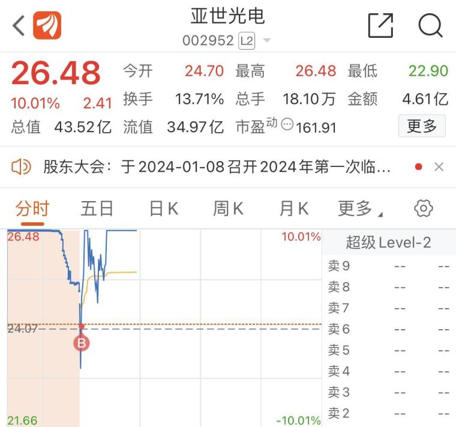
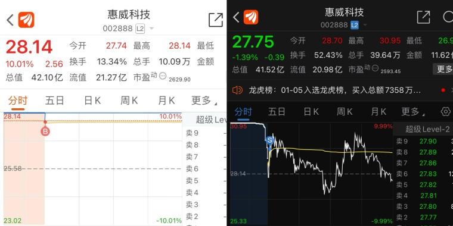

（[原帖](https://www.taoguba.com.cn/Article/5542993/1)发布于2024-01-09）  

## 前言  

首先，  
“一个好的模式体系应该对于风险的识别具有极高的灵敏度，而不是说只强调进攻不注重防守。”  

心法：  
Asking：  
“他人贪婪我更贪婪，他人恐惧我更恐惧”  

炒股养家：  
“高手买入龙头，超级高手卖出龙头”  

巴菲特：  
“他人贪婪我越恐惧，他人恐惧我越贪婪”  

言归正传  

很多同学都给我私信反映了买卖点难以把握，不知道什么时候该低吸，什么时候该打板，什么时候该持有，什么时候该卖出...  

所以今晚我们切换下频道，进入实盘悟道系列篇，我们将会从小土堆最近的实盘案例中讲解买卖点的选择  

开头先拿最近做的最强股压压场子$亚世光电(sz002952)$  
亚世光电，小土堆在第四板零轴低吸，随后当日收获涨停，并且最终一波九连板走到了44.26最高位，接近翻倍  
  

## 买入确认教学  

**技巧一：**  

25分竞价结束观察哪个板块一字最多，大概率是全天较强板块，买入大肉概率更大  

相反，同时关注跌幅板哪个板块名列前茅，大概率这个板块全天无买点或买入大面概率大  

**技巧二：**  

当天梯队继续晋级强化，有梯队才算得上主线，才有保障支持，个股高度安全度高，没有板块效应，个股走不长远  

**技巧三：**  

最经典的买点确认—前一天涨停被砸的中光学高开过昨日的涨停价开盘，那么当天中光学就属于属性纠错（诶不好意思，昨天砸错人了，今天补偿你），所以当天中光学的属性将迎来修复加强的纠错补偿，那中光学是什么属性呢—消费电子 消费电子 消费电子，所以当天消费电子成为我们模式的买点了  

（大面股同样，选择板块当日最高点到收盘价10个点以上大面股观察，次日是修复跌停还是反包，决定了资金当日对该板块的态度，修复和反包则该板块选股胜率高，跌停深水反之）  

那么有同学问了，诶，那我怎么知道修复板块的哪个股呢，诺大的消费电子板块我买谁呢？  

这里同学们注意记笔记，干货满满  

我们的模式内若出现这种情况，有两个买点  

**首选买点：**  

买纠错板块龙头（最高板），案例中即是消费电子板块龙头，当天最高版是谁呢，没错！就是我们的亚世光电同学，且是板块唯一最高版，加上上面买点确认，当天亚世光电全天全是买点（低吸、追涨、打板、排队都行）  

**备选买点：**  

龙头最高板买不到了，那我们就买属性纠错的个股呗，直接开盘买入中光学
同时这里再注意，开盘竞价直接高开过昨日最高点，或盘中超过昨日最高点且稳住5-10分钟，那么当天同样是买点确认  

## 卖点、持有点选择教学  

先说一下无脑卖出和持有原则  

**三线一轴原则**  

三线一轴分别是：竞价线（竞价开盘价画一条水平线）、均线、五日线和零轴  

特别是竞价线，竞价是多空双方必争之地，有效跌破则形成第一卖点  

这三条线和一个轴都不可以有效跌破，有效跌破的意思就是跌破后不能马上收复（在分时图留下痕迹的跌破就算有效跌破），若出现有效跌破，则无脑在有效跌破后拼手速卖出，亏损最小化  

继续持有确认：若没有有效跌破，下跌到三线附近马上V型反弹，则证明有承接，可以继续持有多多观察  

最后的忍耐度就是零轴，一旦进入水下则代表弱势确认...  

然后是**模式内卖点和持有确认教程**：  

1、每天把个股梯队加入自选，观察梯队强化晋级还是弱化散架，如果第二天梯队散架了，也就是昨天还是5421梯队，今天就只有52了，那么同学们得知道，今天这个板块风险加大，不希望利润回撤或者吃大面的同学，等待第一波拉升拼手速卖出  

2、观察前一天该板块涨停板被砸个股今天开盘后的情况，如若前一天涨停板被砸个股今天深水开、跌停开无修复，则该板块我们不碰，持仓的该板块个股同样第一波拉升拼手速卖出，那么相反，昨天被砸个股今天修复，我们就可以加速买点，反包涨停，或我们开头说的竞价高开过前天涨停价，或盘中冲过前天被砸最高点且站稳5分钟，那么这个板块的龙头和当天修复个股所属板块全是买点  

3、观察前一天大面股（一定是最高点到收盘价超过10个点大面的股），若前一天大面股修复反包，该板块出现买点，如果一直在水下甚至跌停，这个板块一个不要碰，再搔首弄姿也好，我们不碰  

4、该股一直是换手板，当突然出现加速板且板中分歧，则卖出锁利润（经典案例：圣龙股份、东安动力最后一板）  

那我们接下来就用上述方法运用到小土堆的实战中来，让同学们更深刻的理解我们的高胜率模式  

首先，我们就拿上周的买卖股举例：  

惠威科技  
  

**买点确认：**  

1、出生点：亚世光电断板当天，补涨龙属性；力鼎光电四进五成功，破局日诞生  
（这里涉及更深入的知识，包括抢筹盘口等，想要让小土堆多发实盘悟道篇讲讲抢筹盘口干货的可以点赞在看双连，小土堆带你看不一样的炒股世界）  

2、梯队晋级，当天日久晋级，首板诞生，从昨日只有首板，晋级成当天21梯队  

3、可川科技为昨日涨停被砸个股，当天反包涨停，那么我们上述模式说了，首选买谁？买当天最高板，当天最高板为惠威科技和日久光电，所以买谁都是收获涨停  

4、前龙头，亚世光电温和修复  

**卖点确认：**  

1、早盘昨日最强日久光电无溢价水下开  

2、最有辨识度的可川科技大深水开  

3、大面股力鼎光电跌停开无修复  

4、同时昨日封板没成功的博杰股份无修复跌停开  

叠加这几日MR苹果降级的利空也好，即将发布的见光死消息面也好  
今天的消费电子全天都是卖点，第一波拉高就走，你学会了吗  
还觉得今天消费电子跌停是倒车接人吗  

“一个好的模式体系应该对于风险的识别具有极高的灵敏度，而不是说只强调进攻不注重防守”  
