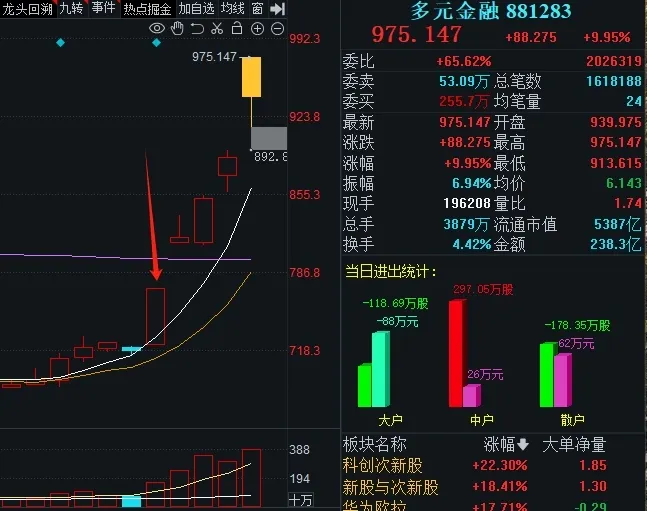
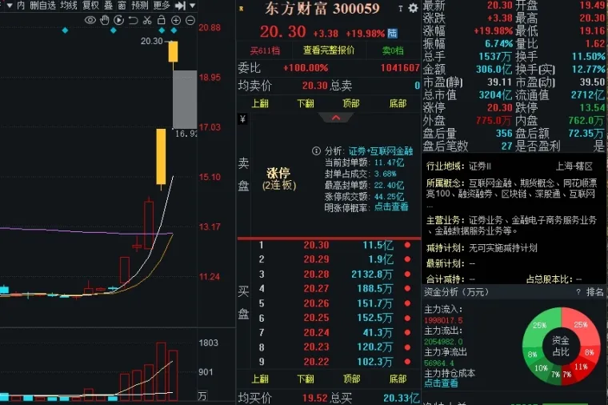
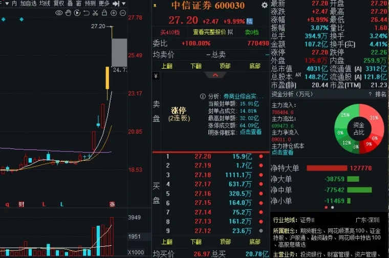
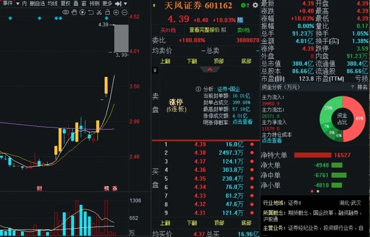
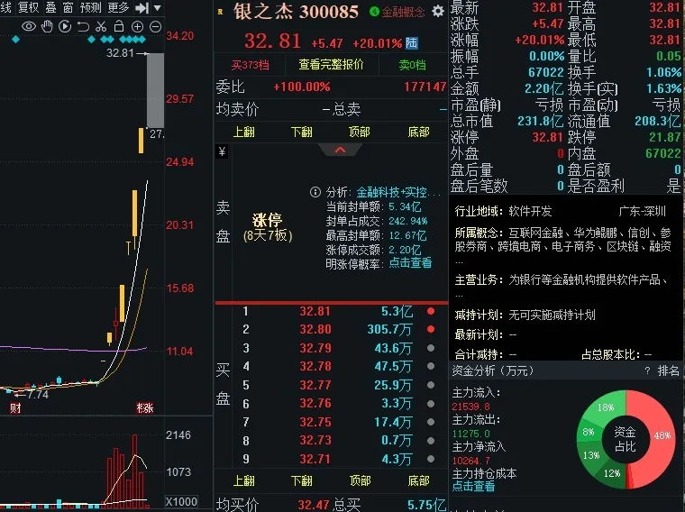
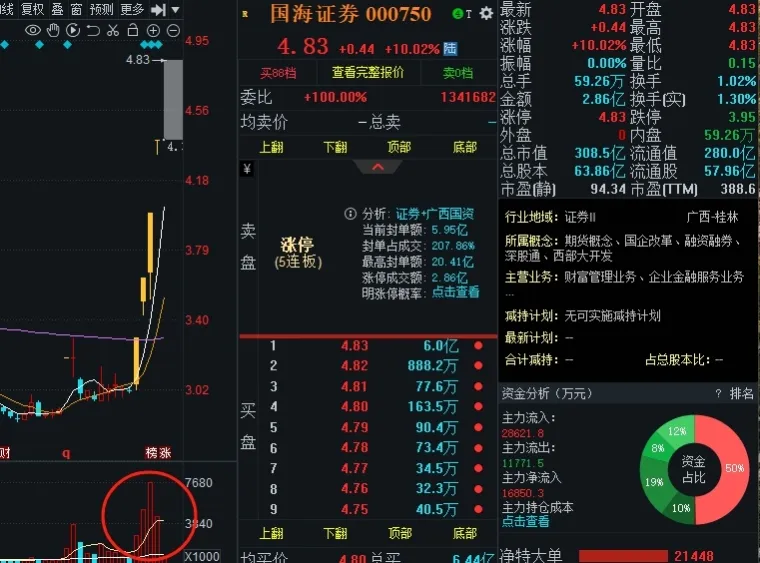
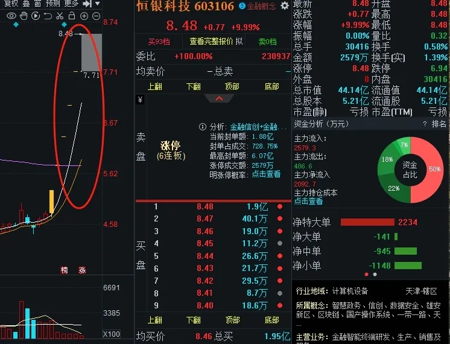
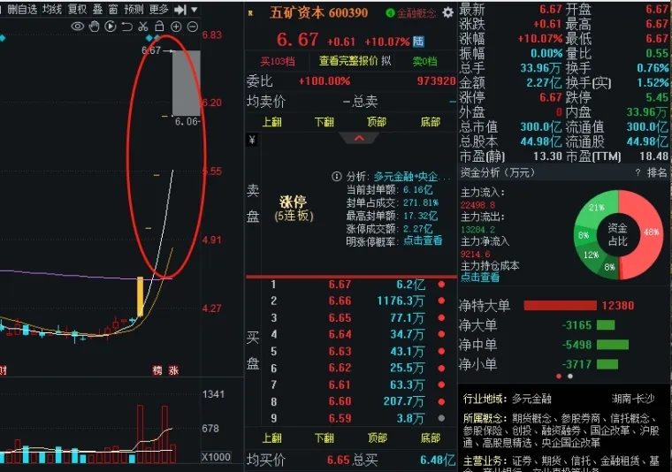

---  
title: 就6招判断板块的持续性  
index: true  
icon: editor  
order: 9  
category:  
  - 游资心得  
  - 大A  
tag:  
  - 淘股吧  
---  

## 就6招判断板块的持续性  

(天生弄潮一字手 2024-10-02)

老师们在短线操作中有没有这样的感觉，都希望自己能够抓住市场龙头，而实际操作中却是总是与龙头失之交臂，这是什么原因？其实是因为你还不了解龙头到底是怎么走出来的，走出来背后的逻辑是什么，当你了解后，抓龙头的成功率会提高不少。  

短线老师们应该都知道龙头一定是从板块中走出来的，所以判断板块的持续性就成为了我们绕不开的路。相信大家都经历过，每个题材爆发初期都会出现涨停潮，一大堆涨停让人热血沸腾，可能你心里知道行情要来了，但是无从下手，因为不知道哪个是龙头，打个首板套个利，第二天可能一分没赚到，这种滋味很难受吧。  

那当一个题材出现多只个股涨停的时候，我们就要加入关注行列了，如果涨停家数又是当天最多的题材，那我们更要高度关注了。首先不要着急动手，需要的是继续观察。那么该如何观察呢？这里我给大家总结6条核心，顺着这6条核心梳理板块持续性，顺藤摸瓜抓到龙头的概率就会提高。  

1、观察板块内有没有大成交额的票，也是我们称之为的中军票，是大资金青睐的对象，只要有这种大额成交类型的，说明资金进入这个板块很深，短时间内不会轻易出来，这对板块的持续是很重要的。  

2、观察板块内有没有走趋势新高的股票，如果有说明大资金已经潜伏在这个板块里面，会让场外资金对这个板块更有兴趣。  

3、观察第二天有没有换手连板票的出现，这是我们短线选手参与的重点，如果出现换手连板票，说明这个板块有资金接力，是有可能承载市场合力的，且换手连板也是有参与机会的。那些从头到尾都是连续一字到头的票，要么买不到，要么买到就结束，这种板块往往容易夭折。  

4、观察板块内有没有大单封死一字的票，这种票一般是消息刺激，都是百万手大单，在他没开板之前，你可以理解为场外资金依旧想排进去，这样一来排不进去的资金就会切换到首板，从而给到板块合力。  

5、观察有没有消息不断刺激的大事件，所有的龙头都是天时地利人和的共振，不断的消息刺激也是板块持续性的关键。  

6、到了第三天，基本就就是我们该出手的时候，一般经历了第二天的分化，会淘汰掉一些后排跟风杂毛，市场资金会开始特别集中的攻击板块内某几只股票，这个时候如果没有出现其他新题材出来抢风头，板块内还有一堆三板票，那这个板块在未来极大可能会成为主流板块，出手成功率也会提升。你这个时候要做的就是跟随板块里面的核心换手龙就行了。  

接下来我们用以上6条来回顾这几天的热点大金融板块。首先大金融启动日为上周二，与上证指数共振大阳114点，和金融相关的个股涨停23只，为当日最多涨停板块。  
  

经过3日观察，我们基本可以确定，本轮周期主线为大金融。其中有我们的中军大票，比如中信、东方财富等。  
  
  

也有趋势新高的票，比如银之杰、天风。  
  
  

从第二天开始也有换手连板票出现比如国海。  
  

五矿、恒银在板块启动第二日开始大单一字涨停，其中恒银具有身位优势的大单一字领涨提振了大金融做多热情。  
  
  

至于消息面，这几天天天政策加持，利好消息连续轰炸，天时地利人和共振，所以为什么在板块启动第三天，大量合力资金猛怼例如天风、国风、中粮、银之杰等辨识度高的换手品种。与此同时大量10cm、20cm首板在板块发酵时孕育而出，反推整个大金融板续高潮。分析到这里，运用上诉6条梳理盘面，是不是本轮周期的主线已经锁定，那么龙头基本最终也会在上述我提到那些核心票中产生。  

老师们，当把这6条核心领悟到位，我相信抓龙头的成功率自然就不会低，对于判断题材的持续能力也会有所提高。最后也要提醒一下，切记交易的本质就是试错，当手中的票被证实错误时一定要及时离场。  
