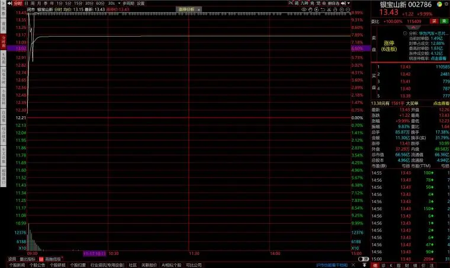

## 五种弱转强的模式  

短线龙头模式的弱转强  

**1.最优模式**  
连板龙头尾盘烂板，次日高开弱转强。  

**2.次优模式**  
连板龙头断板反包次日高开。  

3.龙头结束调整到10日线，横盘5到8日，高开突破小平台的弱转强。二波连板的开始。  

(20日线，60日线弱转强)  

4.高开放量突破6个月以上的箱体的弱转强。  

当日上次或突破回踩参与。  

5.连板龙头断板后，连跌3日幅度20%以上，高开弱转强。  

## 短线弱转强模式及其交易系统  

大多数散户做的其实很乱的，我前段时间也是。跟着大V走，跟着消息走，跟着感觉走，导致的帐户开超市现象严重，并且很难赚钱，或者说赚起来真的很慢。弱转强模式是我多年总结下来还比较靠谱的玩法，刚来淘县也就是用这个模式快速积累了人气，只是前两月思想体系受到了严重干扰，出现了随意单较多的情况。现在重新回到当初的选股范围，并且配合自动单来强迫自己不做计划外交易，方能百分百执行好理论交易系统。  

分两块来说吧：什么是弱转强模式、什么是对应的交易系统及盈利方式。  

### 一、弱转强模式  

每个人对短线的理解都不一样，我以前也是千头万绪。短线研究到后面，大多数人都会总结出一套或几套方法吧？不会玩了几年还是随意乱搞，那就对不起交的学费了。多年短线生涯下来，总结出两套比较好用的主线模式，其中一套就是弱转强模式。  

什么是弱转强？  

弱：有两种理解吧。一种是你以为应该很强跳空开盘的票，结果竞价结束后，很大程度的低于市场或成熟交易者心中的预期。比如周四还是很牛逼的一字板。所以，这种虽然今天还是高开的，但它一定是弱的，不及预期的。还有一种理解是，它本来就应该很弱，比如低开的，结果还真的低开了。  

转：顾名思义不多解释，但这个转字的时机很重要，转的快比转的慢总归要好些。  

强：涨起来，才叫强！  
  

所以，以上这样的情况很直观的表达了什么是弱转强，这是一种很常见的短线分时形态。每天走这样形态的票不说50只，20只总是有的。所以，如何缩小选股范围，躲避一些拉起骗炮的坑，这是需要长期的经验积累与总结，甚至可以说是研究模式的主要课题。目前我都会给备选票，都是经过深思熟虑后的，自己做也会在备选范围内。  

### 二、交易系统  

说完了弱转强模式，再说说对应的交易系统。因为模式只是解决了选股的问题，什么时候买，买多少，什么价格，怎么卖，这是交易系统需要解决的事情。目前基于弱转强模式的交易系统盈利模型是这样的：弱转强选股+自动单预设买点+满仓梭哈一只+高成功率+相对固定的卖点=30%月盈利目标。  

目前在淘县做的这一套系统，出单率是非常少的，这也是主观控制的，基于大数据作出的决定，错过一只可以躺过两次大面，那还是值得的。所以，目前我的严格备选范围内的弱转强，一周可能就一两只出票，一个月可能就五六只吧。这又有什么关系呢？除了在淘县装逼机会少一以外，没什么坏处。那么，一个月短线交易只有五六单，能赚钱吗？当然能，而且赚的一定比乱搞超市天天交易多。  

未来，这样的方式将在淘县上一如继往的执行下去，未来的交易及淘县之路，必会重回辉煌，且再上台阶！  

## 短线交易的几大买点  

(2024年10月13日)  

我们都知道接力的本质是一个击鼓传花的游戏，那么我们要做的就是让第二天还有人愿意来接你的货，也就是当天最好的板，什么是当天最好的板？大家都想抢着买的个股。  

归根到底就是让你的买点变成多数人的买点，大家都认可你的买点，你想亏都难。但认可到极致也就成了一字板，比如通程控股 的2板，所以也需要一些预期差。  

为了让更多的人认可自己的买点，博主们普及了各种手法。卡位；活口；1晋2竞价模式；弱转强；首次空间板。  

首次空间板确实是简单胜率又相对高的手法之一，个股第一次成为空间板，但这里要注意如果同身位有竞争对手的时候，就要小心。  

我也给你们一个思考的方向，我觉得胜率最高的手法并非首空，而是没有选择的时候，或者说首空也是让资金没有选择。  

没有选择往往就是最好的选择。比如说龙头，龙头并不重要，它只是载体，是市场选择了它，不是它选择了市场，重要的是他所代表的势。我们回头看任何一个龙头都是借助了当时市场的势。比如说中交地产 借助了地产的势；中通客车 借助了新能源车 的势；浙江建投 借助了基建的势；西安饮食借助了后疫情时代的势。  

我用西安饮食为例，它最大的特点就是市场没有选择，它就是后疫情时代的龙头。  

当时全市场所有人就算没买西安饮食，也不希望它跌，甚至买了贵州茅台 的基金经理也不希望它跌，它跌了多数消费板块的个股都会受影响；哪怕是反方向数字经济 的英飞拓 依然在西安饮食天地板当天被影响。  

1晋2竞价模式通常大家比较的是竞价金额（昨日成交量的5%-10%）、竞价涨幅、竞价换手来综合对比最强的，但这种胜率依然不稳定，那么我们怎么做才能提高这种模式的胜率。  

最简单的依然是没有选择的时候，比如说当空间板成了3板且大额封单一字的时候，全市场所有的资金能做的就只有1晋2，那么1晋2最强的个股资金就没有选择只能买它；又是或者说明牌高度第一波预期断板的时候（高度足够高、明牌的龙头）  

## 交易成功的秘密：如何进行有效的每日复盘  

（2024年09月26日）  

不少股民看盘，就是盯着自己买的票、自选或者前一日的那些涨停票；或者看看短线精灵、涨幅榜、涨速榜；再或者随便翻翻，看到哪是哪。  

看盘要尽量看全局，要不你根本不知道盘面在发生什么。不知道全局，自己那一亩三分地能有保障吗？其次，记盘可以提升操作能力。短线比拼的是快人一步，快人一步就能拿先手，成本也会低。  

再次，日积月累，可以获得别人无法企及的优势。记盘首先是为了胸中有丘壑，有的放矢的去看盘。但是长期积累下来，就会产生巨大的优势。  

“资金是有记忆的”，说的是操作资金的这些人有记忆。股市与人生一样，很多时候是需要经验的。当你在股市的有效积累足够多，那就是你的护城河，或是他人难以企及的高度。反之，有很多人在股市呆了很久，却从来没有真正形成有效积累。  

### 1、看盘  

（1）题材。最主流题材、运行阶段，并行题材、潜在对手盘、前期主流题材及各自的老大等等  

（2）情绪。近期的涨跌停数量，连板炸板数量，连板溢价、首板溢价，有个大概印象。不要去弄情绪周期那套，划分的越细，可操作性越差。就用这些简单数据，足以判断情绪。  

（3）连板、首板股。弄清涨停概念，归类题材，理清每个题材的梯队，盘前心里有数。同时要对他们的量价、形态，大概有个印象。竞价或早盘决定要做的时候，稍微看一眼量能是否健康，是否在压力位等，就能避开很多坑。  

（4）断板股。这块是很多人忽视的地方，前一日涨停次日断板的，就不看了。但这往往是选趋势票很好的方法，因为涨停是非常重要的一种启动，断板后若是良性调整，后面经常就有一波大趋势。  

（5）短线筹码。机构资金、关键龙虎榜等适当作参考。看龙虎榜，不要迷信任何人。  

（6）盘中异动相关。盘中异动的股，常有关注价值，需要记住，但一定只关注第一个！后排意思不大。  

（7）前期炒过的题材总结。  

### 2、趋势  

大盘近期走势、关键指数走势，趋势风标、趋势备选股的走势等。  

方法上的事，因人而异，尤其是记忆这种事。以下只是作为参考：  

1、要有完整的复盘笔记。好记性不如烂笔头，建议大家坚持写复盘笔记。  

2、要分得清重点主次。股市最不缺的就是信息，不能眉毛胡子一把抓，得分清主次和重点，按照前文内容逐条施工即可。同时先找到一些异动股，吃到肉，吃肉了就有兴趣和动力继续往下做。  

3、稍微勤快点。记盘的事，见效慢，但作用大，有点像喝中药，时间久了才能看出效果。最高水平就是可以达到全面记忆，出过的牌就像在脑子里播放画面一样。大家如果在股市可以做到以上如此，亏不了钱的。  
