## 弱转强浅析  

（[原帖](https://xueqiu.com/3406694441/269269510)发布于2024-05-19【雪球】）  

### 弱转强的表现形式  

1、烂板：涨停后反复多次开板、炸板，最后回封，如中广天择11-30的首板大烂板，一进二弱转强成功晋级；  

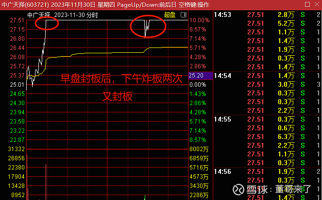  

2、下午板或者尾板：下午或者尾盘涨停封板，如南京商旅11-28日的首板，一进二弱转强成功晋级。  

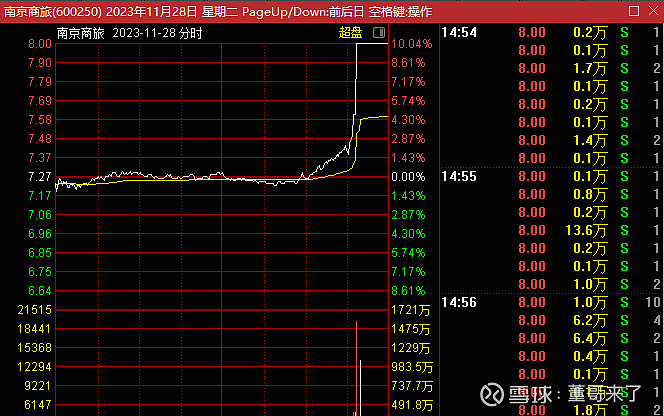  

### 主动弱和被动弱  

1、主动弱：当天大盘很强，个股所属板块也比较强，但个股表现却差强人意，这就是主动弱，也称真弱；  

2、被动弱：当天大盘很弱，个股所属板块也比较弱，个股自己努力对抗但仍受压制，这种属于被动弱，其实很强，也称假弱。  

### 弱转强的买点  

我们经常听到过的一句话就是“买在分歧，卖在一致”，其实对于我们散户来说，这句话完整的理解应该是“买在分歧转一致，卖在一直转分歧”，因为我们是做跟随的，买在分歧风险较大，隔日能不能转一致还是未知数，买在分歧转一致的点才是最安全的。  

那么，怎么理解分歧和一致呢？分歧的核心是爆量，换手率高，是买卖双方的分歧：卖方不看好后市因此疯狂抛售，买方看好后市所以疯狂抢筹，这样导致成交量爆出历史天量，同时伴随着分时剧烈波动，振幅较大；一致的核心是缩量，换手率低，是买卖双方的一致：一致看好或者一致不看好，一致的看好会导致持筹者惜售锁仓，持币者疯狂抢筹，最终导致股价缩量上涨，甚至一字涨停，一致的不看好会导致持筹者低价抛售，持币者观望不买，最终导致股价缩量下跌，甚至一字跌停。  

举例如下：10月12日的圣龙股份属于爆量分歧，当天量能基本是一年内最大量，10月13日分歧转一致，竞价高开超预期，缩量上板就是买点，董哥有幸参与了圣龙弱转强的竞价买点，但是没格局住，以后会慢慢学会格局龙头~~~  

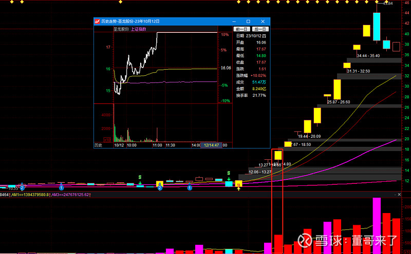  

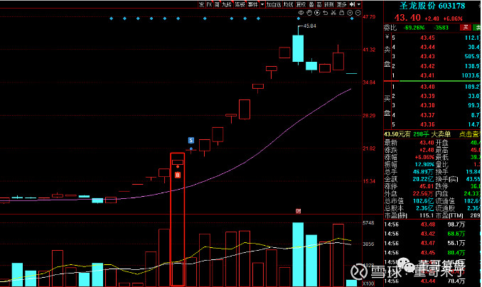  

又比如11月1日的天龙股份同样属于爆量分歧，当天量能基本也是一年内最大量，11月2日分歧转一致，竞价大高开超预期，缩量一致上板同样是绝佳买点，买入后躺平3-4个一字板。  

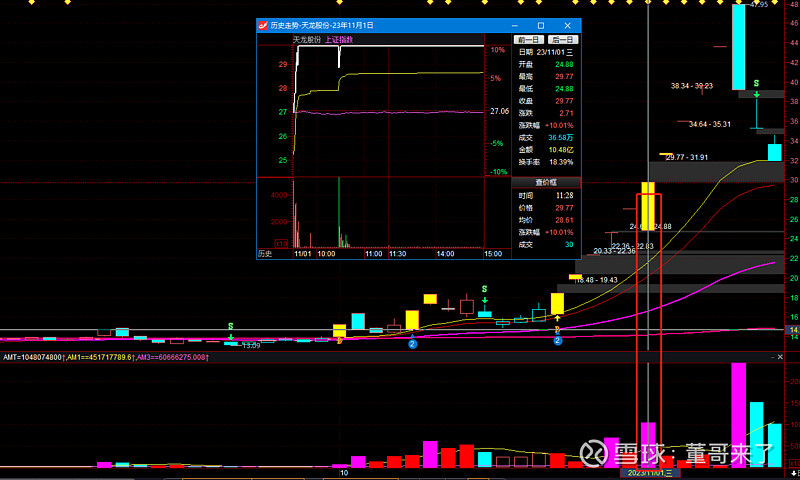  

再比如11月14日的银宝山新同样属于爆量分歧（14号复盘也说了让关注它的弱转强晋级机会），当天量能同样属于一年内最大量，11月15日分歧转一致，竞价大高开超预期，缩量一致上板同样是绝佳买点，买入后同样能躺平4个板。  

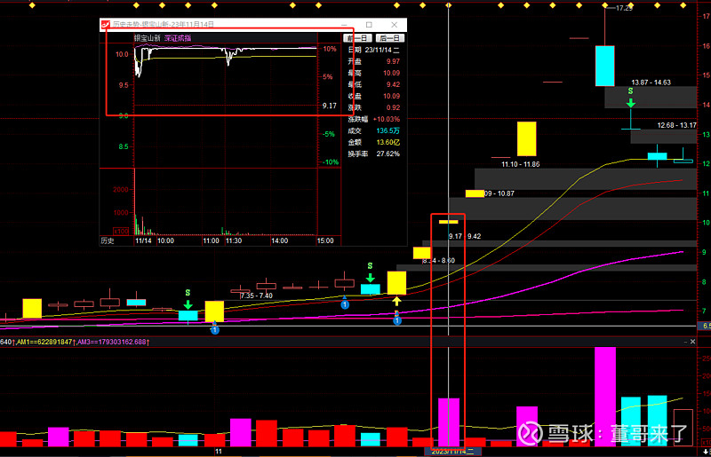  

诸如此类，不胜枚举。

这里董哥给大家总结出来一套你们最喜欢的量化公式，以后遇到这种龙头高标，都可以套用公式去寻找你的买卖点，有兴趣的朋友可以看看，不喜勿喷~~~  

**1、烂板-弱转强-强更强-再分歧（断板）-反包板（可有可无）**  

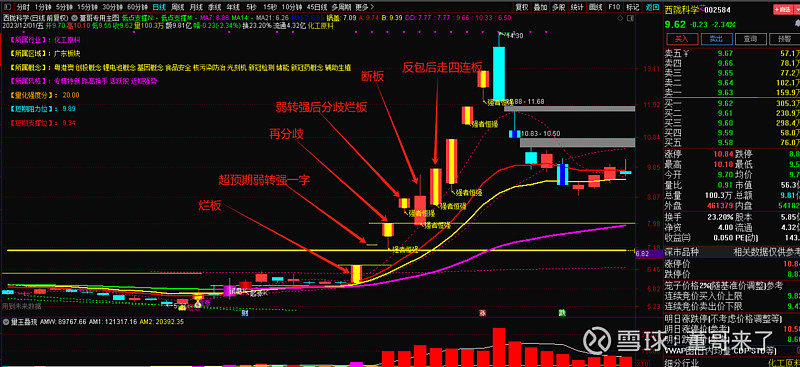  
公式是死板的，套用的时候记得活学活用，像西陇科学这种，首板尾盘封板，属于烂板，一进二直接超预期弱转强直接一字加速了，三板再分歧也是情理之中，后面四板断板属于分歧，隔日直接反包属于分歧转一致，这种反包涨停就是买点。  

**2、烂板-弱转强-强更强-再分歧（烂板）-再次弱转强（循环直至行情结束）**  

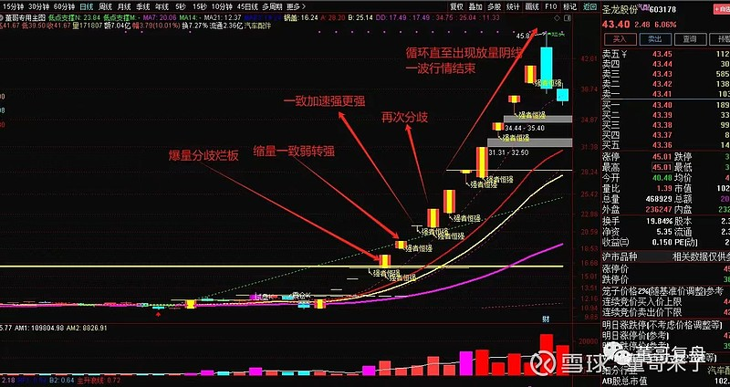  
圣龙股份10月12日爆天量分歧烂板，10月13日弱转强高开缩量秒涨停，10月16日一字加速，10月17日再次爆量分歧，10月18日缩量一致涨停，如此循环直至这波行情结束。  

举个最简单的例子，咱们经常听到一句话说：烂板出妖股，那么你有仔细想过，为啥烂板出妖股吗？首先这个票你得有龙头地位，你得是主线板块的龙头个股，你的涨停可以带动整个板块的情绪，而不是说随便一个票烂板，都能走成妖股的，因为这里的烂，是烂而不弱，是被动的烂。在这里引用个历史故事来更形象的解说这个烂而不弱。  

官渡之战时，曹操基本接近跌停，结果许攸来了（解决粮草问题），曹操绝地反击，拉出大长腿又翻红了。虽然缓过来了，袁绍是不是还没消灭?所以彼时曹操还是大烂板，但是他这个烂板就属于烂而不弱，为啥呢？因为他至少翻红了（解决了粮草问题），没有被摁死跌停（消灭），这属于阶段性胜利，也给后续博弈留了无限的想象空间。大家都知道曹操因为粮草问题差点失败，当曹操面对粮草问题时，真正的困难真就是只有粮草，而没有其他任何方面的困扰，而且在曹操和袁绍相持官渡时，曹操还解了白马之围，诛杀了袁绍的两员大将颜良文丑。没有粮草是烂板，但他没有损失谋士和将士（比如核心班底成员，苟或、荷攸、夏侯淳、曹洪、曹仁、于禁、张辽、徐晃，都没有任何损失），这就是烂而不弱。一旦解决粮草痛点，所有问题便迎刃而解。把曹操这个历史事件，放在板块中，也是同样适用。龙头烂板代表的是龙头自身，但是不是烂而不弱，取决于当天板块内是否有小弟助攻，如果板块内有小弟助攻就是烂而不弱，随时都有翻身可能，但如果只剩龙头自己，而且还是烂板，这就是真的弱了。  

圣龙股份10月20日天量分歧烂板，是不是真的弱？你们去看看当日汽车概念的个股，涨停的有11只，彼时的圣龙就跟官渡时期的曹操一样，烂而不弱，兵将都在，只要给个机会，就会逆风翻盘，这才是烂板出妖股背后的逻辑，而不是什么烂板都能走成妖股，最后事实也证明了这一判断，尾盘又封板了，之后又继续连板三天才结束。  

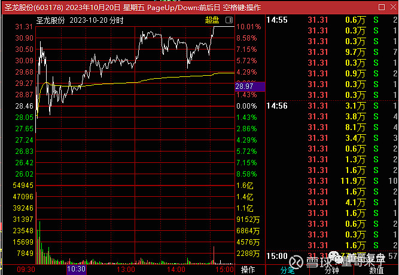  

最后总结：其实只要能走成连板龙头的票，大概都是这样走出来的，烂板可以，烂板后必须要弱转强，如果不能弱转强，那持币者肯定不能去买，同理如果弱转强成功了持筹者可以继续格局，如果弱转强失败，那就要尽快清仓。所以弱转强有两个买点，一个买点是烂板当日，一个是隔日弱转强，这里董哥建议是弱转强再参与，因为烂板当日就算去也是不敢上仓位的，毕竟隔日能否弱转强还不一定，散户追求的是买入确定性，卖出风险时，也就是常说的买在分歧转一致，卖在一直转分歧。  

## 核心战法之——烂板反包  

（[原帖](https://zhuanlan.zhihu.com/p/646190967)发布于2023-07-27【知乎】）  

在说战法之前，必须介绍一下，我的超短之路。非常有幸，在2016年底刚准备学炒股的时候，遇到了一位非常热心的博主，向他学了许多知识。所以，刚起步的时候，就有了模式的概念，超短想赚钱，必须要有固定的打法以及灵活的运用，不能脚踩西瓜皮，天天临时起意。  

这些年，一路过来，我大概经历了中阴反包、中阳反包、烂板反包、大长腿转强、连板转强、龙头首阴、二板放量接力等等大约10余种模式的复盘与实战检验，最终发展到现在各模式间的灵活调配使用。今天要说的就是我依然还在使用的烂板反包模式。之所以说这个模式，是因为上周在实战中收获满满，有新鲜的案例。  

### 案例  

**案例1**：万润科技，2023年7月17日买入。  
**模式名称**：烂板反包。  
**效果**：当天涨停，次日高开。  

万润科技买入前一天是个烂板，尾盘最后一刻没有封住。我说的烂板是当天碰到涨停但收盘没封住的。如果是封住的都不叫烂板，那就是板。这种定义都是个人理解的定义，只是方便自己归类而已。  

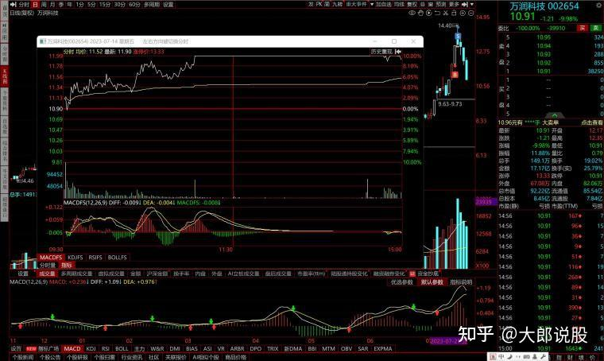  

**案例2**：众泰汽车，2023年7月19日买入。  
**模式名称**：烂板反包。  
**效果**：当天涨停，次日高开。众泰汽车买入前一天也没有最终封住涨停，所以归为烂板。

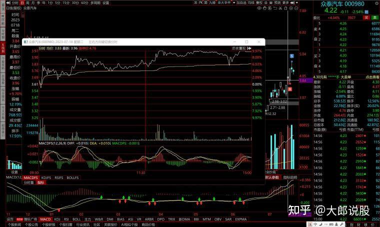  

看完上周的两个马前炮大肉案例，很多同学都一同进入并吃了肉，所以说起来说比较身临其境些。  

先说说，烂板反包的原理：其实很简单，当天涨停都封不住，次日是不是要下跌了？这是正常的情况。但是，有些票，它次日偏不，要反其道而行之，这就有些异常了，也就是重新转强。这就是做烂板反包的基础理论。  

下面，分三大块内容说说烂板反包的实战：  

### 一、备选股  

烂板的备选股，自然是从烂板中来。那每天有多少只烂板呢？你不可能一只只去找，这不是麻烦的问题，是根本不现实，虽然碰过涨停，但收盘后涨幅千差万别，散落在5千多只票里，根本找不齐。目前介绍两种找烂板的方法：1、同花顺问财。2、通达信电脑端公式选股。同花顺问财我不怎么用，因为它虽然智能，但总是会有偏差。比如我想找一下2023年7月21日的主板非ST烂板票有几只，它显示是五只。  

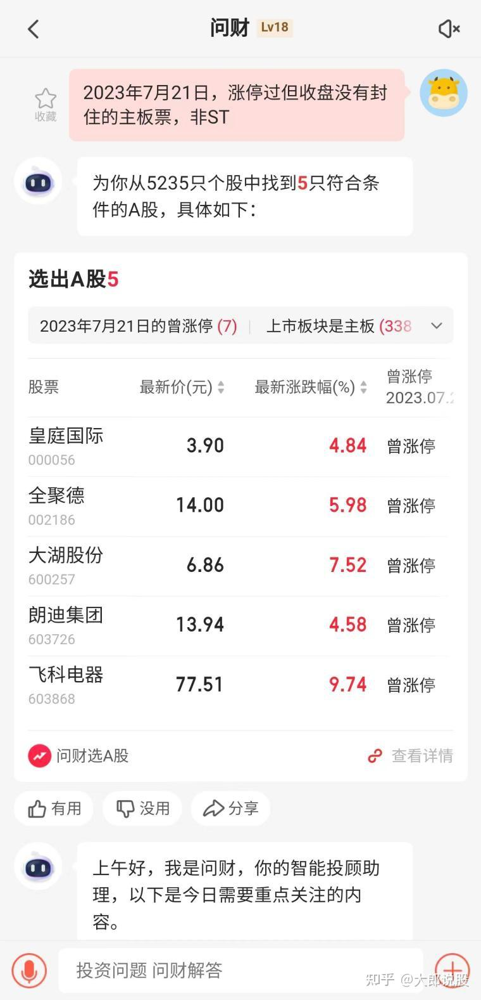  

但其实并不止。因为我用通达信电脑端公式搜索出来的，是9只。比同花顺问财多了华夏幸福、长久物流、通达创智、跨境通。  

  

多出来的四只，都符合烂板条件（盘中涨停过但收盘没有封涨停板），所以，同花顺问财是不全面的，不能用。另外，问财无法对任何历史一天的数据进行搜索，复盘不方便。当然，通达信电脑端的公式搜索，都是完全免费的，有机会再分享。  

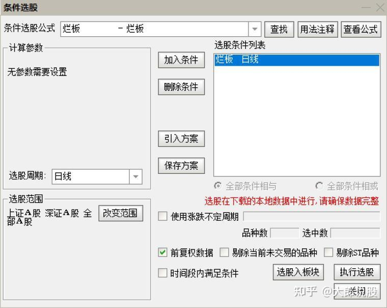  

### 二、临盘决策

拿万润科技那一天来说，我可以复原一下历史。万润科技是周一买入，那么，7月14日周五的烂板有哪些，又是如何选中万润科技呢？我可以用公式搜索当天的烂板进行讲解。

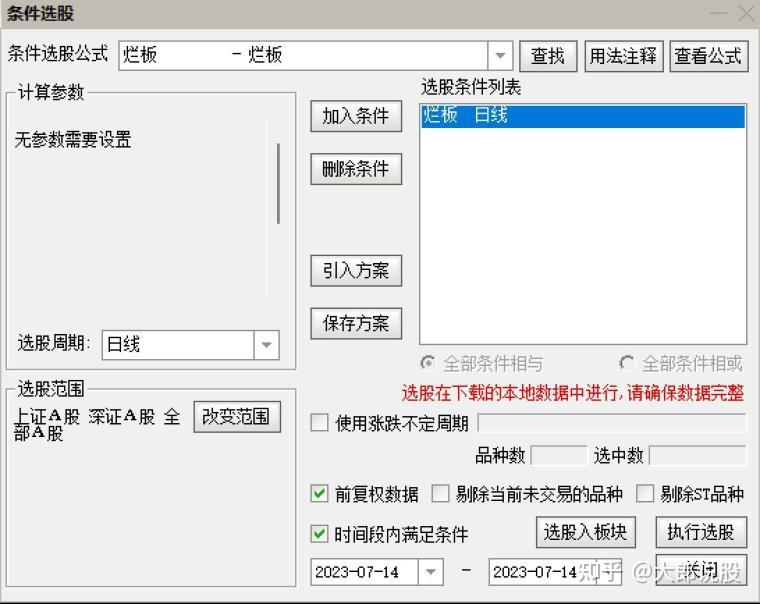  

搜索后得出7月14日的烂板，主板共有以下17只：

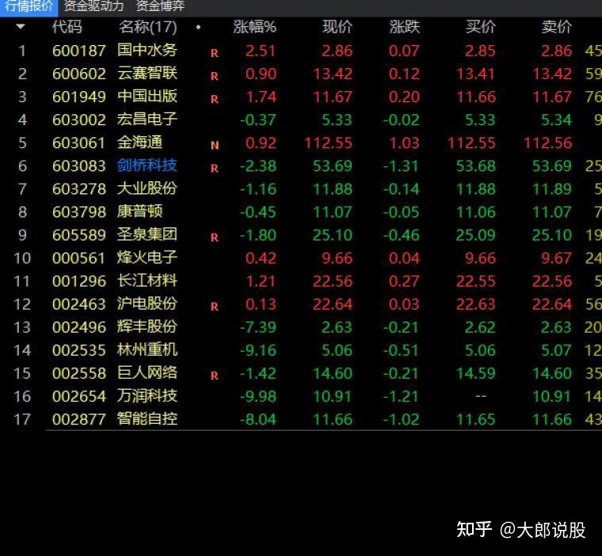  

当然，我们的万润科技也肯定在里面。  

好，找到了所有的那天的烂板票，然后我们逐一来看，次日也就是7月17日他们的表现。在前面烂板原理的一段话中，我有表述过的就是，前一天烂板涨停都封不住，后一天却要转强，我们要找的就是这样的异常票。那么，7月17号开盘表现不是太强的票，我们就根本不用看了。所以，一下子这17只中的范围就减少到只有几只了。这就是利用市场选择来做短线的基本原理。  

7月17日开盘后强的有哪些呢：  

云赛智联、林州重机、长江材料、万润科技四只。其实有几只还是高开的，但曾几何时，高开太多的烂板多数是坑，可能是量化惹的祸，建议少碰高开烂板票。  

梳理到现在，那就是四选一的问题了。判断哪些可以入，就要任何技术沉淀功底了。云赛智联是高开后还转强，一般来说我就不太看了，其实买入也能赚钱，但就怕坑。林州重机快速转强封板，是我没来的及买，手不够快。长江材料的转强有些晚了些，其实也是好票，当天涨停了，但是子弹已经打光。而万润科技恰到好处，即有气质，也有机会等同学们上车，次日高开3个点，算是不错的一单肉。  

这就是买入万润科技的来龙去脉。  

我的方法跟人家不一样，大多数人都是各种主观逻辑推演，行业逻辑，市场逻辑，还有什么相互制衡逻辑太多太复杂，我就是很简单的一个核心原则，资金让谁转强，我就跟随。有些时候，我根本不知道买的票是什么概念，有时候还想不起来，今天买的票叫什么名称，反正就这样干了进去。比较直接的打法，要效率，不要前戏。  

### 三、复盘  

复盘很重要。一个模式能不能用，哪些是会形成坑，只有记录对比后，才有比较明确的总结。盘感与经验都是枪杆子里得出来的。我一直也跟同学们说，抄作业并不是未来，而是形成自己的交易体系。当年复盘其中一个烂板模式，我就花了大半年的时候，从2018年复盘到2005年，10多年的每一天的烂板全部看过去，很笨辛苦，但好在我喜欢股票，不觉得累。  

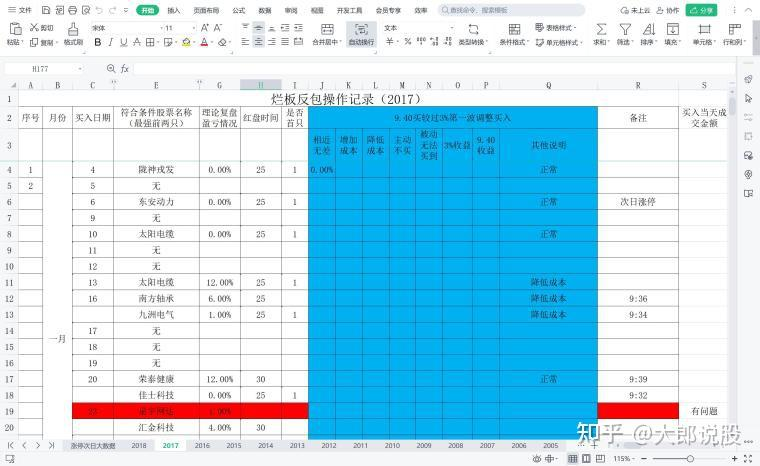  

我只走自己的路，所以我根本不看别的博主，不是因为觉得他们水平不好，而是不想打破自己的思维体系，毕竟现在的体系已经还不错。如果这篇文章对你有用，记得实际行动鼓励一下哦。  
