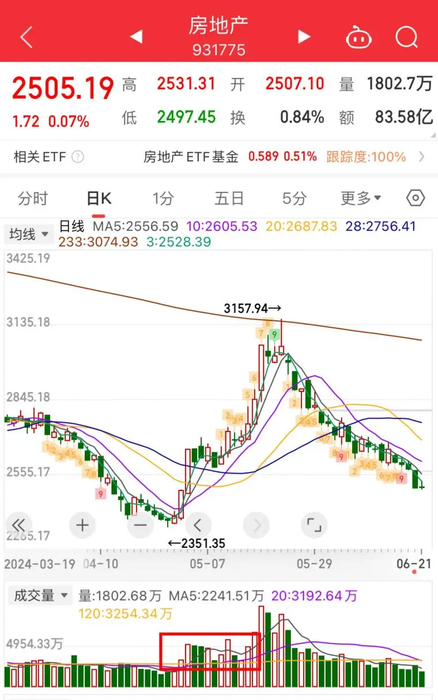
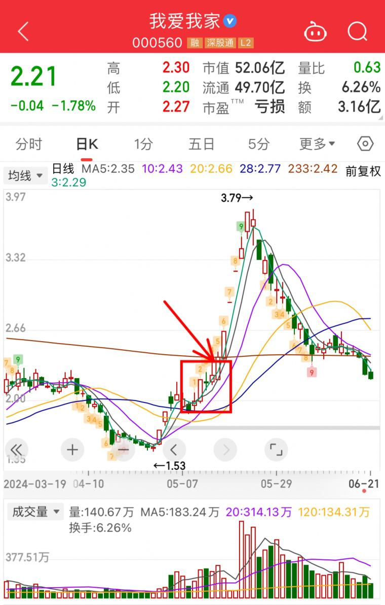
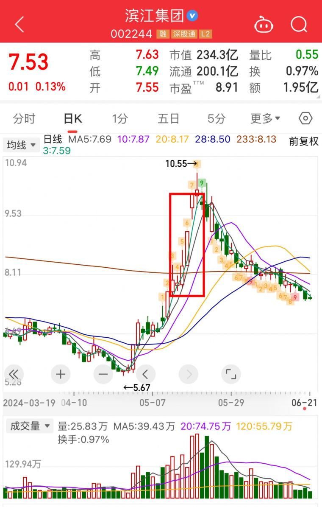
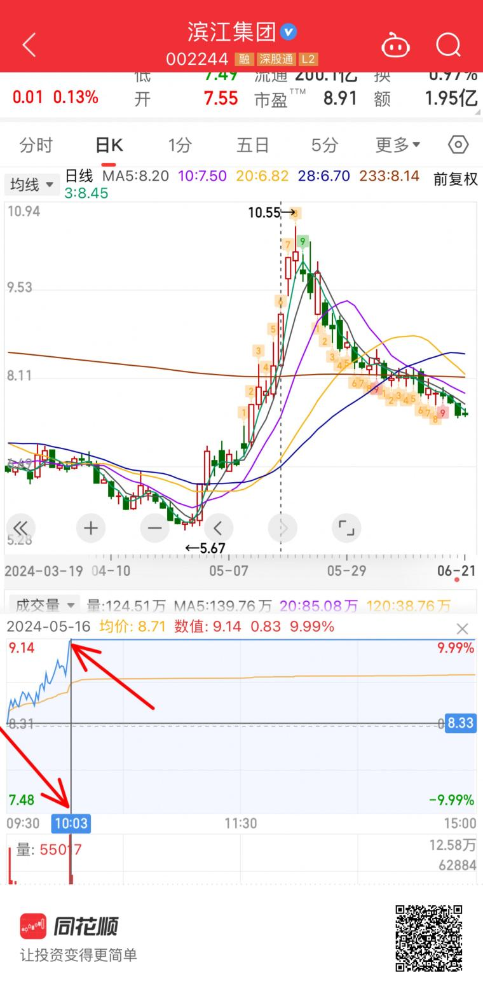
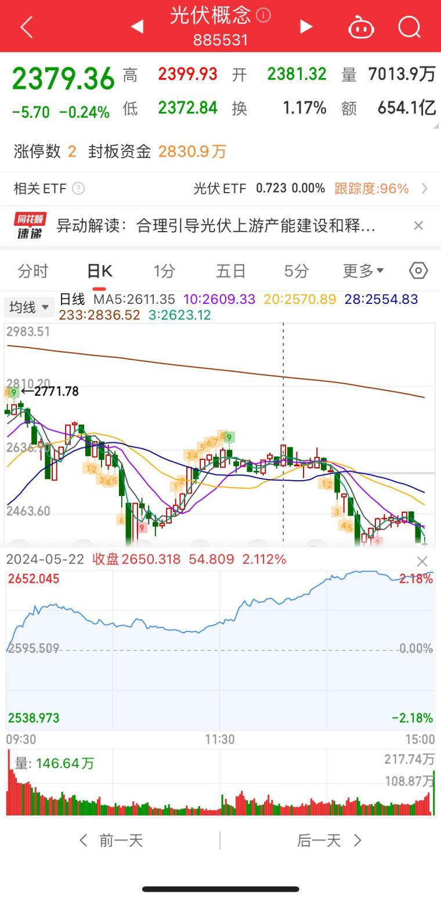
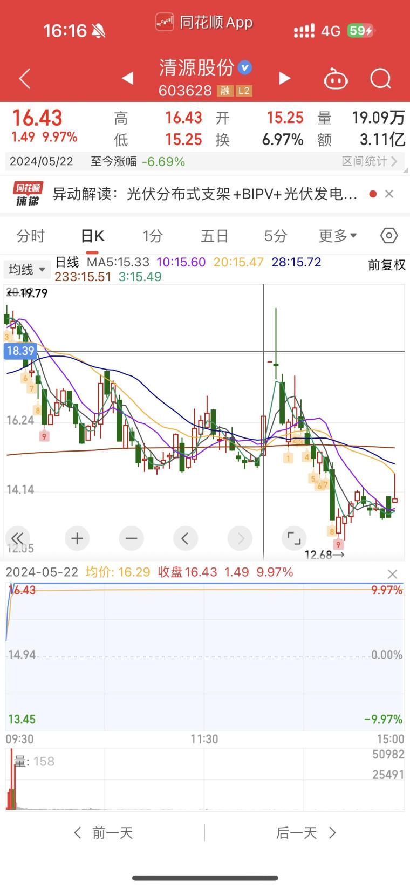
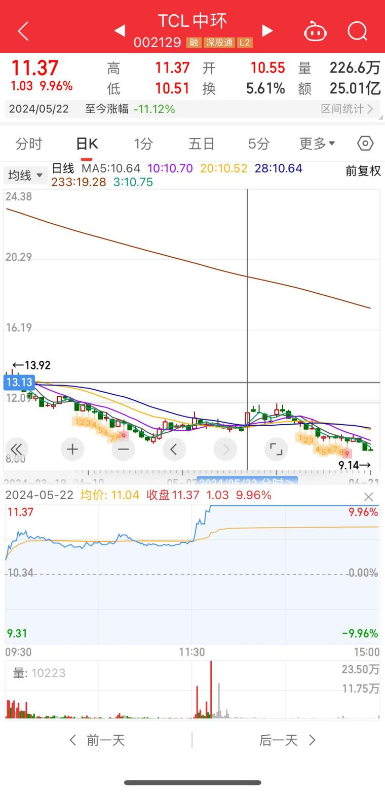
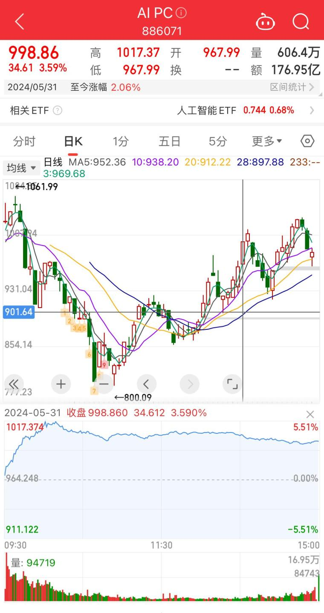
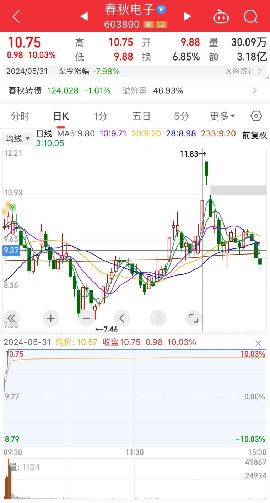

---  
title: 强启动模式完整解析  
index: true  
icon: file  
order: 8  
category:  
  - 游资心得  
  - 大A  
tag:  
  - 淘股吧  
---  

## 强启动模式完整解析  

(2024-06-23)  

今日从六个角度进行解析！  

一.如何去定义题材启动？  
二.题材启动又分为普通启动和强启动两者区别是什么？  
三.如何提前去寻找板块强启动信号？  
四.开仓的三大前置条件具体分析  
五.如何去选择具体个股和买入整体流程  
六.近期具体个股案例分析  

### 一. 如何去定义题材启动？  

启动是指开始异动，那么题材启动顾名思义即题材开始异动，进入短线客的视野，复盘来看题材能在当日涨幅的前几名，内部涨停数量位居前茅，连板梯队也走出题材身影等等。让你发现题材明显有资金介入，这就是题材启动的定义。  

不管这个题材是以哪种方式进入你的视野，也许是通过利好消息来进入，又或者是通过资金大幅买入来进入的最终结果都是题材启动….  

### 二.题材启动又分为普通启动和强启动两者区别是什么？  

视觉效应区别：普通启动即题材略微出现赚钱效应，但只存在于零星个股，强启动则是题材进行大面积的爆发，不管是连板个股还是大中军还是容量核心或者20厘米个股都批量跟随涨停，爆发大面积的赚钱效应。这是两者从视觉效应带来的区别。  

技术层面区别：技术层面的区别固然要涉及到量化标准。强启动个人定义的标准有2点:  

1、板块涨幅大于2%  
2、整体强度大于5000  

强启动的优势：  

1.强启动题材后期更容易走出主线，因为强启动题材，第一时间涉入的资金足够多，资金对题材的认可度高，后续回流一致性更加高，获得合力的可能性更强。  

2.大资金更容易推仓位，题材强启动发生时，不管是连扳小票还是容量中军都有足够的反应时间和容量池容纳大资金，因此大资金更容易重仓，甚至满仓。  

3.盈亏比极高，胜率高，第二天基本上都有足够的溢价套利立场。  

### 三.如何提前去寻找板块强启动信号？  

首先要知道寻找板块强启动的信号，带有主观成分和客观成分双属性。在板块强启动之前，谁也无法知道到底哪个题材能够选出来后次日完成强启动。  

这里分为主观成分和客观成分，主观成分比较吃盘感。  

客观成分有以下4点：  

1、板块技术图形多头发散，近期量能在慢慢放大，说明看好的资金越来越多。  
  

2、消息面利好刺激，需要提前做好准备，做足功课，每晚消息面需要做到心中有数。  

3、板块整体容量。有些小板块注定不能强启动，比如5月的猪肉、电磁屏蔽等，一个票代表整体板块涨幅的。历史回测，大主线一定是板块整体容量很大。  

4、题材的逻辑。后续想象力，市场认可与否。做强启动不是单纯为了套利，是成为主线的可能性更高。强启动给主线打下更好的基础，走成主线的概率提高，有利润垫后续成为主线也更好持有。  

主观成分则是自身的盘感预判后续哪些题材会有爆发的时间….这一点大家可以多跟我跟帖学观摩一起提升盘感！  

### 四.开仓的三大前置条件具体分析  

首先知道设置三大前置条件的目的是什么？  

最重要的一点是防止系统性的风险，比如指数股灾市场缺量没人玩，情绪退潮期。  

一旦出现这些情况，市场的赚钱效应，往往远比亏钱效应小得多，那么很容易形成偷鸡不成蚀把米的情况发生我们设立前置条件的目的，就是为了避免此类情况发生。  

说完目的，那我们直接进入主题，三大前置条件分别是：  

1、市场成交量7500亿以上(潜在主线模式需9500亿，潜在主线模式需要持续性，9500亿可以接下所有的筹码。强启动模式底部获利盘不会特别多，成交量不用特别多)  

2、市场情绪非退潮期(前题材不能大跌，昨日成交前十不能大跌，主升、震荡都行。昨日成交前十代表了老题材的情绪，在退潮、震荡还是主升。如果在退潮中，强启动模式一定会被影响)。  

3、指数不能下跌趋势中大跌。指数一旦走出这种走势，市场基本上没有任何题才能走出来，往往更多的是走抱团。  

### 五.如何去选择具体个股和买入位置  

讲第5点之前首先要明白两个定义（逆势抗跌小票和容量核心）  

**逆势抗跌小票**：在题材强启动之前就逆势活跃，题材启动资金第一选择是逆势抗跌的票。逆势抗跌的一般以小票为主，必须做好功课板块中逆势票需要放在自选，有迹象去跟随。否则反应不过来。  

优点是获利高，一旦板块强启动，此类个股均是一字板或者加速的方式高举高打。  

缺点是不能缺定当天能否真的板块强启动，有时早盘快速上拉，不一定收盘就能大于2%和强度5000，此时可能只是普通启动或者没启动，可能小赚小亏离场。  

例:5.16房地产强启动，板块涨幅3.7%，强度1.5W，符合强启动要求。再找逆势抗跌的票，我爱我家5.14拿筹码，5.15逆势涨停(相对于板块其他逆势抗跌)，5.16板块有启动迹象时，资金优先选择我爱我家。  
  

**容量核心**：容量:个股成交量10亿-30亿。核心:能够引领整个板块的走势，有带动性。如果引领整个板块的走势，有带动性。如果板块是连板带动的，容量核心是不成立的。  

优点是可以在确定板块强启动之后再做，稳定性高。缺点是有溢价，但是溢价没有逆势抗跌的小票多。(我爱我家和滨江集团)  
  

### 五.如何去选择具体个股和买入整体流程  

首先要根据自己的风偏和风格模式决定是去做逆势抗跌小票还是做容量核心。  

整体流程：  

1.首先要符合开仓三大前置条件  

2.符合后提前找出的板块，潜在题材有无利好强启动强启动的条件符合时，跟随  

例:5.16房地产开发，涨幅3.7%，地产强度1.5W，符合强启动找票，逆势抗跌小票我爱我家，能买入时强度只有3000-4000，如果不是高手很难推演出之后能否涨幅、强度达标。反应不过来时，可以选择容量核心。容量核心大票上板时间差了接近20分钟。(9:40-10:06)。强度达到5000已经10点左右，离滨江集团上板还有6分钟。  
  

开仓三大条件，√指数震荡中，√昨日成交前十不大跌(合成生物退潮结束止跌，混沌期)，成交7500亿以上√均符合，买入我爱我家或者容量核心滨江集团！  

### 六.近期具体个股案例分析  

5.22 光伏涨幅2.2%√，强度1.4W√  
昨日成交前十小阳线企稳√，指数震荡√，成交量7500亿√  
逆势小票清源股份首个涨停换手，容量核心TCL中环、晶澳科技光伏下午启动，中午小作文卡位半导体  
  
  
  

5.30 半导体板块强度6300 板块涨幅2.27  
三大前置条件均满足  
容量核心 上海贝岭  
  

5.31 aipc板块 三大前置条件满足，符合强启动标准  
板块内无容量核心，只有逆势抗跌小票，春秋电子。  
  
  

今日强启动模式的完整解析给大家完整奉上！  
