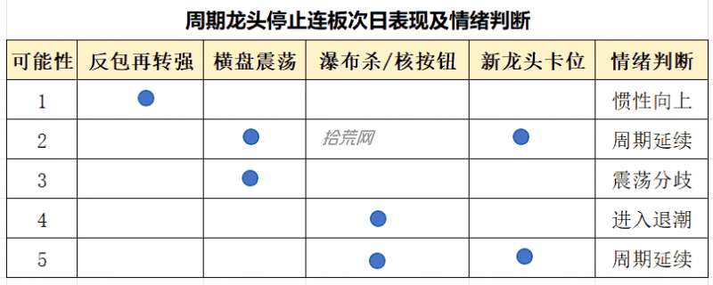
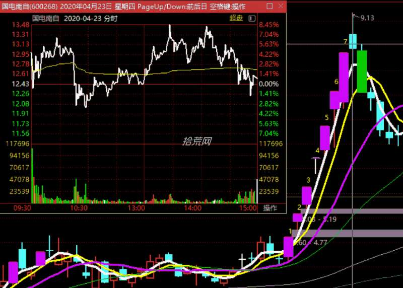
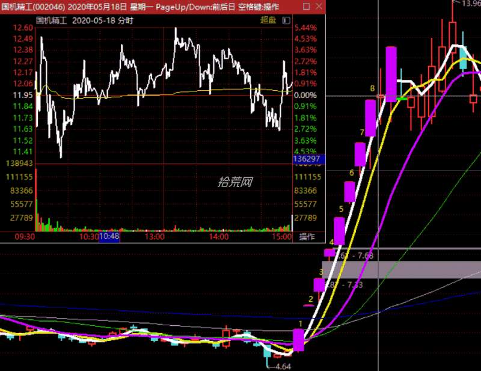

(原文发布于2024-05-12)  

股市中的情绪周期是指市场情绪随着市场走势而变化的一个过程。  

细致的可以划分为七个阶段：  

- 冰点阶段(情绪低落期)、  

- 混沌阶段(情绪波动期)、  

- 启动阶段(情绪升温期)、  

- 发酵阶段(情绪扩散期)、  

- 主升阶段(情绪高峰期)、  

- 高潮阶段(情绪亢奋期)、  

- 退潮阶段(情绪降温期)。  

但是市场是千变万化、不断进步的，并不会严格按照这些人为的划分进行，跨阶段运行、几个阶段混合进行、不同板块不同周期同时运行都是常态。  

本文简单按以下五个阶段划分做以说明：  

## 一、情绪冰点期(情绪低落期)  

在一轮明显的亏钱效应代表的退潮期之后，市场情绪会非常低迷，投资者对市场前景感到极度悲观，多空双方都没有了动力，情绪像结了冰一样，没有一点生机，偶有尝试也会失败。  

### 1、主要特征  

总龙头连续杀跌20-30%，涨停数量连续下降，甚至跌停家数超过了涨停家数。  

连板高度一直受压制，**最高板下降至4板、3板甚至2板以下**，龙头杀跌，补涨股也杀跌，一些看起来很好的板，次日根本无溢价，短线情绪极度冰点，市场没有主流热点，没有持续的赚钱效应，大部分热点都是一日游，可操作性极差，容易吃面。  

有些时期，情绪冰点以后还会有二冰、三冰。  

### 2、总体操作策略  

在此阶段，最佳的策略就是冷静、自信、坚定地观察、等待。  

等待混沌期头铁的前浪们的厮杀博弈结束，等待冰点、混沌期结束后，明显的启动期到来的信号。  

在此之前，多看少动，不当炮灰，禁止做高位板接力，直到情绪二冰过后，看到明显的多方信号。  

## 二、情绪混沌、酝酿转启动期(情绪混沌酝酿转上升阶段)  

在情绪退潮期一轮极致的亏钱效应导致的市场情绪极致的悲观、冷却之后，随着做多情绪的慢慢积累，情绪逐渐转暖，从冰点转向混沌、酝酿做多转向启动。  

上一轮周期结束，新周期的种子开始萌发，对于市场的看法开始从一致的悲观到出现分歧，转入混沌、摸索、试探、酝酿启动阶段，市场情绪开始升温，投资者对于市场的前景逐渐开始乐观。  

这个阶段，一般出现在指数下跌末期或震荡筑底期。  

### 1、情绪启动期的主要特征  

随着一轮残酷的下跌，市场不再动辄出现天地大面，昨日涨停开盘无溢价直接闷杀或昨日涨停今天跌停的现象几乎绝迹，炸板股明显减少，  

开始出现代表情绪好转的大长腿，  

如果某只个股开始打破3板、4板的空间压制，逆势创出近期新高，  

且板块内个股走势都明显强于大盘，具有较强的板块效应，题材质量容量颇有想象空间，这很可能就是一轮新题材炒作的开始，领涨的就是龙头。  

### 2、情绪启动期总体操作策略  

情绪混沌酝酿转启动期，可以考虑适当加仓，关注一些具有潜力的板块和个股。  

但是机会难于把握，需要一定的试错成本。  

初期，应该以做首板为主;  

中后期，可以小仓试错那些低位新起的、身位最高、竞价最强、有板块效应、有助攻的潜在龙头。  

## 三、情绪发酵期(情绪扩散期)  

出现在情绪启动期之后，是行情确认，分歧转一致的过程。  

这个阶段市场情绪进一步升温，投资者对市场的信心逐渐增强。  

**1、情绪发酵期的主要特征**：  

随着空间的进一步开拓，板块赚钱效应出现，连板股数量开始增多。  

**2、情绪发酵期操作策略**：  

在情绪周期里面，最容易出妖股，最容易上车、赚钱的时期就是情绪发酵期和高潮期。  

这个阶段是龙头选手大展身手、上仓位的最关键阶段。  

在发酵期的初期，着重的是题材(属性)方向，要聚焦市场最主流热点的龙头，做不到一字龙可在启动期第一时间上同身位的换手票，其次再考虑龙二;  

在发酵期的中后期，可以考虑去做主流板块低位起涨的首板或2板票的补涨;  

## 四、情绪高峰、亢奋期(情绪主升、高潮阶段)  

这个阶段投资者情绪非常高涨，信心爆棚，高潮达到亢奋，情绪到达顶峰，行情面临转折，风险即将来临。  

**此阶段市场主要特征分为两种**：  

1、如果指数处在下跌或震荡周期  

情绪与指数背离，则易形成一个小的上涨周期，一般只能维持一条主线展开，龙头不超过5板而且断板容易A杀，行情持续性不强。  

此阶段，盈利效应在于龙头抱团、低位套利，谨慎做1板的接力，少做1板以上中位股的缩量加速板;  

2、如果指数处在上涨周期  

情绪与指数共振，则易形成一个大的上涨周期，如果题材够新，甚会出现主线+副线多板块主升+轮动甚至走二波(二阶段主升)的行情。这种大的上涨周期的特征是：  

“主涨属性”明确，总龙头确认，龙头股一路上涨，核心股连续缩量加速，龙头带跟风，跟风助龙头，板块出现批量涨停潮，涨停晋级率非常高，甚至大盘中军都能连续涨停，涨停数量连续上升，甚至没有了跌停，连板股空间高度不断打开，能达到6、7板以上，主线热点票霸屏。  

昨日成交金额前列皆是大涨;  

如果情绪配合，老龙即使断板也不A杀，资金会围绕主线题材进行横向、纵向的挖掘补涨股，会在现有大题材题材内部出现纵向或横向的高切低，出现一只补涨龙带动主线行情继续扩散，碰到“天时、地利、人和”同时具备的情况，新龙、低位一起涨，助推老龙、中位一起反包走二波。  

此阶段可以说各种模式都能赚钱，赚钱效应爆棚，容错率极高，市场情绪极度高潮。  

此时，投资者要注意风险控制，避免盲目追高，同时也要注意中位股分化跌停等风险信号的出现，逐渐去弱留强，兑现收益，降低仓位，拥抱核心，避免市场回调的风险。  

**情绪高峰、亢奋期操作策略**：  

情绪主升期，着重的是情绪，胆大重仓就是效益。竞价就抢龙头、抢一字涨停板，竞价不抢，你可能就买不到;做焦点中的焦点、做最闪亮的市场总龙头，如果总龙头大单一字(说明有确定性连板预期)不给机会，再考虑择强做低位1板、2板的卡位晋级或科创板的强势票，先上车套利，待龙头分歧再换车总龙头;  

总龙头涨到高位或者特停后，就围绕总龙头的主涨属性选择那些属性最正、股性最好的个股做补涨。此时一定要不惜血本、不惜代价抢先手买在启动点，因为前有总龙头打开的空间，减少了了分歧，补涨股的涨停会非常利索，甚至天天一字涨停，稍一犹豫就买不到。此阶段，分歧加仓总龙头，重仓持股待涨就是最佳策略;如果出现大的行情周期，龙头断板不A杀，资金会选择高切低的无缝衔接，应优先选择总龙头高位放量断板当天主线最强、身位领先、强度最高的低位股(一般与龙头差4个板)，它可能就是主线题材的补涨龙或新题材的龙头;其次是用换手、成交金额、涨速等技术选择比补涨龙身位低、强度高的1进2或首板、科创板票做补涨龙的套利;第三是做承接良好的老龙头、中军、中位股的2波。  

## 五、情绪退潮期(情绪降温阶段)  

这个阶段市场的亏钱效应逐渐加大，赚钱效应逐渐消失，情绪从一致的做多到开始出现分化降温，投资者对市场的信心逐渐减弱，直至崩溃。  

**退潮期开始的标志**：  

退潮期的开始，出现在一段上升周期的末端，龙头还在走加速，低位也在补涨助攻，中位股却率先跳水，情绪出现强列的分歧、分化，如果这种强分歧和分化不能很快修复，亏钱效应和情绪会迅速扩散，一般要不了2天，龙头就会断板，如果龙头断板次日不能反包修复，退潮期就会迅速展开。  

**退潮期的主要特征也分为两种**：  

1、如果指数处在下跌或震荡周期  

情绪与与指数共振下跌，题材又比较小，其主要特征是：总龙头断板即A杀，龙头股、跟风股纷纷开始补跌，高位连板股接连出现亏钱效应，连扳高度逐步下降，炸板大面票、昨日涨停今天跌停、闷杀的票批量出现，尤其高位炸板股增多，极端的出现天地板大面，低位股快速轮动，持续性极差;  

2、如果情绪与指数处于不同的周期  

指数与情绪背离，题材又较大，这个时期的退潮会比较温柔或混沌，龙头断板不A杀，甚至会形成高位震荡，走2波甚至走穿越的情况，可以称为高位混沌期。  

情绪退潮期和情绪冰点期都是赚钱效应最差的阶段，大部分短线玩家的亏损都在这两个阶段。这个阶段，亏损有两大源泉：其一，是看不到情绪退潮的危险信号，在情绪退潮期接力老题材的中高位股;其二，是不等情绪明显回升就盲目、主观接力试错新题材。  

**情绪退潮期应对策略**：  

除了龙头的抱团走穿越，坚决减仓或者清仓，特别是中位的跟风股，以避免市场继续下跌的风险。情绪退潮期，着重的是筹码结构，如果叠加指数下跌周期，亏钱效应扩散很快，资金争相离场，市场没有接力情绪，各种模式都会失效，最佳策略就是空仓等待，等待情绪退潮期的结束直至情绪冰点期的到来。  

## 如何确定情绪周期退潮期？  

**如何判断情绪是否进入退潮阶段?**  

当周期龙头停止连板时，观察其次日表现，看它是否出现瀑布杀、核按钮以及新龙头卡位等情况。  

具体有以下5种情形：  

  

也就说，**若没有出现新龙头卡位，且周期龙头出现瀑布杀、核按钮，则可判断情绪进入退潮期**。

如国电南自在4月23日停止连板，代表情绪高潮，次日跌停，代表情绪进入退潮期。  

  

## 如何确定情绪周期高潮期？  

**情绪高潮的确认**  

  

**判断标准：当周期龙头停止连板时，即情绪高潮**。  

但是，要注意，情绪高潮不代表情绪即刻进入退潮阶段，偶尔市场还会继续震荡上行，甚至还会出现**周期的延续**。  

如，5月18日，轴研科技(周期龙头)止连板，代表情绪高潮，但是情绪并没有因此进入退潮，而是继续震荡上行，这是由于做多的惯性或突发的利好刺激市场继续做多。  

  

## 如何确定情绪周期冰点？  

**情绪冰点的确认**  

  

**判断标准：当市场的空间板(连板数最高股票)被极度压缩至2板时，为情绪冰点。**  

但是，在实践过程中，还会衍生出几个问题：  

1、有没有极度压缩至1板这种情形?这种情形在历史上相当罕见，哪怕是熊市，2连板的股票也是不少的。因此，我们以2连板作为冰点就可以了  

2、有时候空间板压缩至3板，情绪的冰点就出来了。  

3、偶尔会出现一个较高的连板，带上几个2板股，这种情形也属于冰点吗?比如某个周期退潮后，仅剩下个5板+3个2板，此时我们要看这个5板股是什么原因导致涨停的，如果属于公告类型的利好刺激连续一字板，则应该把它独立起来，不属于任何周期，拾/荒网股票学习网专注短线龙头战法~如此盘面只剩下3个2板了，这种情形属于冰点。  

4、情绪冰点，不代表一个点。多数情况下，情绪冰点的时间跨度只有一个交易日，但也跨度超过两个交易日的，比如连续两个交易日，市场的空间板都是2板。  

5、在实际判断冰点时，尽量结合盘面情况来辅助判断。比如当天涨停数、连板股数，这些指数都能够反映情绪。  

## 关于情绪周期的延续（空间板断板后的周期判断）  

很多时候，周期龙头在停止连板后，会出现以下两种情况：  

**1、立刻有新的高度龙头卡位，成为新的周期龙**  

宏润建设案例，当时除了旧基建，加大新基建投资也是国家稳经济的政策手段。其中特高压炒得最火爆，板块龙头是保变电气，在连板数上仅比宏润建设低一个涨停板。  

到2020年3月9日，宏润建设跌停，止步8连板。按理来说，周期龙倒下，预示着本轮行情即将结束。  

但是，同一天保变电气卡位，早上开盘便迅速强势反包，实现8连板。次日实现9连板，这一天它便晋升为周期龙头。  

像这种无缝衔接的情形，称为周期的延续，即保变电气是宏润建设的延续。在命名上，我习惯称之为宏润-保变周期。  

由此可见，情绪周期可以像波浪理论中的5浪一样，具有延长特性。  

**2、周期龙头停止连板后，迟迟未见破位杀跌，此时市场出现更高的空间板**  

2020年5月18日，周期龙头轴研科技停止连板，止步8连板，但是股价并没有立刻破位下杀，而是震荡上行，这说明情绪尚未进入明显的退潮阶段。  

5月28日，申通地铁实现9连板，突破轴研科技的8板限制，确认为周期龙头。但由于轴研科技周期一直未退潮，因此申通地铁不能看作为新周期龙头，只是轴研周期的延续。  

**3、补充两点内容**：  

1)在判断周期的延伸是退潮，要以最后的龙头为判断标准。比如上述两个案例，保变电气、申通地铁作为判断标准。  

2)一般我们会**把未开板的次新股排除在周期之外**；还有，因为**利好公告连续一字板的个股，在未开板前也排除在周期之外**，开板换手后再上板，可加入周期中，如申通地铁前面6个一字板不读入周期，第7天开板并换手上板，则开始计入周期。  

## 情绪周期用于研究市场的热点板块以及龙头高标股  

对于情绪周期理论的理解主要针对的是一些超短选手，  

而情绪周期理论用来**研究的对象就是市场的热点板块以及龙头高标股**。  

一般一个热点板块的诞生，其板块内必然会有龙头高标股，这种是打出板块赚钱示范效应以及热点板块能否持续的重要参考，然后板块内还有龙二，以及后排的跟风助攻小弟，板块的涨停板梯队保持的是比较完整的。  

那么对于这样的热点板块可以说就是市场的主线热点，也是超短选手必参加的热点主线板块，如果能上车龙头那更佳，上不到也要上车龙二。如果龙一龙二都没法上车，那后排的跟风小弟就只能暂时观望一下。如果是板块热点初期后排的也还可以喝点汤，但是在开始派面的鱼尾行情则要谨慎参与后排，因为前排买不到，后排的能买到往往就是一碗大面。  

而当板块热点出现高潮，高标已经开始断板，后排开始上演跌停派面时，也就意味着这个板块热点可能要结束了。  

当然对于一个超级大热点，可能还会出现补涨龙，比如去年底10月份那波新能源汽车产业链热点板块龙头是圣龙股份，圣龙走完14连板后，还出现了天龙股份的补涨龙。  

一般对于相对小周期的热点，龙头断板基本板块也就结束了。  

所以对于情绪周期理论的理解，主要是针对热点板块主线进行分析，同时适合超短选手，再一个就是对于市场板块龙头的理解。一般真正的板块龙头都是各路资金重点聚焦的，特别是当大盘走弱的情况下，更是无脑博傻的抱团聚焦。天天涨停极其亢奋，每天都有机会上车每天都涨停，可谓是“撑死胆大的，饿死胆小的”，当然最后一棒还是不能去接的。  

最后再总结一下情绪周期理论对于热点板块的分析，一般一个新的大型的热点板块都会有这几个阶段：  

- **热点形成初期**，一般离不开大的政策消息支撑，板块会有少量涨停板，此时资金还没有被完全吸引聚焦;  

- **热点发展期**，板块出现连板股，有高标开始出现，资金慢慢开始关注;  

- **热点高潮期**，龙头高标股成为整个市场的高标，打出示范效应，各路资金开始聚焦，板块梯队完整，跟风小弟活跃且众多，资金极其亢奋博傻抱团;  

- **热点衰退期**，引起监管关注开始发监管函，龙头高标开始断板，后排跟风开始集中派面，板块亏钱效应集中放大。  

## 题材主线的确认方式  

先讲一下，主线的确认方式。资金和持续性啊，前面说了，炒字才是核心关键字。那炒是需要资金推动的。炒是需要氛围的。  

一个板块的几只涨停，只有七八个亿的成交，你觉得这样的题材，能成为主线吗?这个板块，资金有没有重点关注，这不就一目了然了嘛?  

首先我确认主线的标准，至少板块高潮日，涨停家数要高于10家吧?涨停数量，体现的是板块的容量，涨停数量多，板块容量大，大资金的主战场，大资金出现的地方，用赵老哥的话说，以亿为单位，所到之处，只有涨停。  

板块涨停金额，接近或者大于百亿，资金进入的体量，那不就代表资金的态度吗?不认可会进这么多资金?这都是眼睛看的到的东西嘛。  

还有最重要的一点，是要有持续性，什么是持续性?就是这个板块，一直有资金在炒作，每天你都可以看到这个板块的存在，这种不就是持续性的体现么!  

以上说的这些，就是最简单的，从你眼睛看到的角度，确认主线的方式。  

主线炒作，就是跟着大部分资金一起攻，你不用怕会被抛弃，因为你不要的筹码，有的是人抢。但是确认主线的时间点，你要理解，什么时间确认的主线，因为再牛逼的主线，也要契合情绪周期的演变，这不会以个人意志为转移而改变。龙头断板预期出现，出现这样的主线，还是老题材，那毕业照的概率大于炒作概率。毕业照都懂什么意思吧?  

## 情绪由多转空，连板接力风险预警信号  

对于风险的预期，就是在连板的预警信号，**后排出现日内天地板的走势，或开盘走的很好，盘中跌停。这个时候要注意。这可能就是大的情绪分歧要开始的预期。**  

但是!  

注意，不要主观看到连板出现跌停，就一定是情绪马上就空。**第二天核一字，才是确认预警成立的预期**。  

当然，这只是预期，准确的情绪预警，还是吹哨，连板开盘核一字，开盘核按钮的。那就是告诉你，嘿，兄弟，今天情绪大分歧，不要开仓。多么友好的劝退，多么亲切。  

## 龙头断板当天是情绪转折，要空仓  

还有一种择时空仓，就是龙头断板当天的被动空间板，也就是最高板。那这个时间，是一段赚钱效应炒作后的情绪转折点，也就是别人已经盈利了几十个点了。龙头断板了，那这里要注意，并非龙头断板，情绪就一定完蛋了，就退潮了。  

这个时间，被动空间板，就是检测情绪用的，**能接龙继续板，证明情绪依旧，龙头断板无核，被动空间板继续顶**，那你后面选择空仓，就是主观臆测退潮。光天天等退潮，就是傻了。  

可是**这个被动空间板一定不是操作的标的，这是情绪的风向标**。  

你判断情绪能否延伸下去，就看风向标了，所以，择时空仓，不做风向标，也是要注意的。可上可下的标的，那你成功了，就是运气啊，失败了，就是点背。无他，你在赌情绪延续，所以你做这种，就是纯纯的赌大小。  

## 什么时候算是好的买入时机  

有人问，什么时候算是好的买入时机，就两点，逆转情绪和主升情绪的两个点

**逆转情绪择时**  

逆转情绪应该很好理解，每天都是核按钮，每天的情绪都很差，连板跌停一大把，前龙跌停不停歇。那这个时候，**突然有一天的情绪开始逆转，断板的不再核按钮，连板的最高板晋级，或者是连板的核按钮开始地天反核按钮的情绪时间点，这不就是很好的介入时间吗**?  

当然，反核这一天的买点，相对博弈，但是这样的博弈性，和之前提到的一些博弈性的买点还是有本质的不同。为什么说还是存在博弈性，因为你是要做的情绪逆转，情绪买账还好，不买账，你自己买单。  

举个例子，像艾艾精工断板后的被动空间板是博信股份。那第二天博信股份做了一个先骗炮再地天的动作。也就是想试图逆转颓势情绪，但是博信做了这个地天，完全没人买账啊，没有带动任何的情绪逆转，跌停板依旧死气沉沉，这种就是纯粹没有任何情绪带动的地天。因为情绪刚开始想释放一下，你就要逆转，那可以，成功了你吃肉，失败了，别人不买账，你自己买单，这不就是择时的最大问题吗。  

人家想退一下潮，释放释放压力，博信一顶地天，直接想延续情绪，但是情绪不买单，没有在空头情绪完全释放过后再逆转，那就是逆转时机把握完全错误，买单不冤枉。  

**另外就是主升情绪择时**  

这里所说的主升情绪择时，非指一定要像克来机电那个周期一样，纯纯的大主升，随意买都赚钱的主升。  

定义就是情绪逆转确认后的情绪，像地天后的确定性时机，龙头一字加速时机(非高位)，这个非高位，是指如果你这个龙头选择在7-8板一字加速，这个区间高度，是要穿越一定高度的因为正常按照异动规则，7板以后的高度，都是会有严重异动的公告出现的，这样的高度去加速一字，情绪并不能做到一致，反而容易加速成一个大分歧。  

正常的龙头一字加速，5-7板最多了，不过这里我注意一个点，龙头加速后，不能连续加速后就是分歧预期，那你只能卡加速那天做相应标的，加速后的分歧，又是一个不可以乱做的点。  

那么今天主要写到择时的问题，懂得出手时机的重要性，是对于利润持续增长的关键点。如果觉得每天都是机会，那就要有更高的理解力，这点不否认退潮都是更好的买入机会，但是相对的博弈性试错是免不了的，做错就是面，做对吃大肉。相比较，稳定一些更好，关于择时，还有一些包括像情绪和大盘共振上涨，情绪和大盘翘板抱团逆向。这个其实都包涵在逆转情绪和主升情绪中。  

简单说一下吧—  

1.情绪和大盘指数会有先后下跌，或者共振下跌。有时情绪会先于大盘止跌，有时候大盘会先于情绪止跌。但是当情绪和大盘共振止跌上涨的时候，就是一个很好的择时点。  

2，大盘跌，情绪抱团，这里是要注意，你是要看到情绪确实在走独立才可以，而不是预判，那也就是，不可以先于走势预判，大盘暴跌，你看到连板情绪确很好，就要明白，这个时候，大盘的下跌是影响不了情绪的，连板没有亏钱效应，高标抱团，那就可以去控仓操作，但是如果大盘开始上涨，一般就是逻辑证伪期，大盘涨，抱团就会有瓦解预期，不要再继续抱了，这里信号就是大盘日内大跌处，砸出恐慌盘，分时量能一根线，恐慌盘出现，抄底资金进场，日内深V，则不可继续做抱团了，哪怕日内大盘再跌下去，你也不可以抱团了，因为已经开始有抄底资金试盘了，一鼓作气，再而衰，三而竭。砸到一定程度，就是这样，一次试盘没拉起来大盘，第二次，或者第三次，成功的概率会大很多，再做抱团，就不是好时机了。相比较起来，抱团的不确定性比较大。  

## 行情结束的第一特征是先杀中位股  

有人认为龙头在上面打高度，中位股在后面跟着吃肉喝汤就可以了，应该没有风险。其实又是想当然了。  

**在市场里主力资金的进攻方向主要有二个**，  

**要么最高，即板块高标或市场龙头**;  

**要么最低，基本上就是热点的一板或二板票**。  

因为最高的是人气最强、有稀缺和引领性，而最低的有性价比。

**反过来看中位股，就处于不高不低，不尴不尬的位置**。

**我们判断一个热点或一个情绪上升期即将进入尾声，一个重要的信号或标志就是中位股先断板走弱，甚至跌停**。即中位票先被淘汰，许多人的亏损之源，其中之一就是来自于中位票。当中位票结束上涨，板块高标或龙头票还会继续向上运行一二个交易日，最快次日也要断板收阴。  

当我们做到的是龙头票时，看到中位票出现了亏钱效应，就要做好随时出货的准备了，长则二三个交易日，短则次日就有断板的可能性。  

在龙头断板后，如果热点还能持续，资金切换到了低位的首板或二板，俗称**高低切**。  

因此，我们尽量不要把精力放在中位票的把握上，但可以把它当情绪拐点是否出现的重要依据，来辅助我们在做龙头或低位补涨票时能够正确地把握机会。  

## 分歧一致的二二定律  

看得懂龙头，但总是做不好或不敢做  

事后分析或拆解得头头是道，即使自己真的去做了，可能还是赚不到钱，这是为什么?  

事后总结已经成形的走势是已经固定下来的状态，但在实际过程中，即使是龙头，你也知道它是龙头了，在情绪的上升期，如果你踏不准节点，上车后要么拿不住就跑了，要么还会造成亏损。  

最本质的问题可能出在节点上。  

比如一个龙头今天分歧转一致，次日弱转强，你在板上介入。有些时候后面能吃到新高的溢价，但也有时候次日低开或开盘即走弱，根本没有溢价，你走还是不走，马上走，白忙一场心有不甘;不走，看着账面变成了浮亏，心里发慌。这是因为板上一致的点是大家都知道的技术性买点，正是因此知道的人太多了，在前一天分歧后刚出现拐点时进场的资金已经有了先手和近20多个点的浮盈，他们会抢先砸盘兑现利润。我们常规认为的买点反而成了主力们利用预期差的卖点。  

另外，我们需要知道一个**二二定律**，即**分歧转一致后最多发酵或强化二至三个交易日，然后再分歧一至二个交易日，再有一二天的反弹**。所以，如果买点是发酵的第二天才参与，基本上买在一波的高点，马上就来到了分歧的临界点，很有可能就在次日，进入后没有可以拿到至少次日溢价的确定性，按这个节点操作，不可能保证在连板票或龙头上能长期获得稳定收益。  

在知道了这些内在的规律和节点后，当它在出现大分歧时，看到有资金回流的信号的启动初期，尽早地跟随主力介入进去。因为主力还刚刚建好仓，没有明显地浮盈在手，在这个拐点上车是最安全，也是获利最丰厚的时点。俗话说要信早信，也是出于这个道理。当主力已经有不错的浮盈，市场上众人皆知它处于一致时，风险就已经聚集了。  

## 抱团股的特点和应用  

抱团跟连板就是反向，抱团跟指数是反向，抱团跟主流热点也是反向。  

当连板起势，指数起来，有主流热点时，我们没有必要再看抱团了。  

反之，当热点进入混沌期，板块开始轮动了，连板高度下降，缩容了，指数进入震荡调整阶段时，即与市场总是保持正相关的三个方面**开始出现了负反馈的时候，与市场负相关的抱团形成了接棒效果，这就是跷跷板的关系**。  

由于有跷跷板，抱团即使有一个反弹，基本上也是最后一次龙回头，为的是当后面热点调整充分的时候，资金再度回流之前做的一次预热，不至于让市场有较长的空窗期。这是我们做短线时把握节奏所要注意的一种交易规律。  

我们任何的交易策略一定是要建立在市场的客观反馈，理解它后分析出盘面的一种大概率操作预案。  
