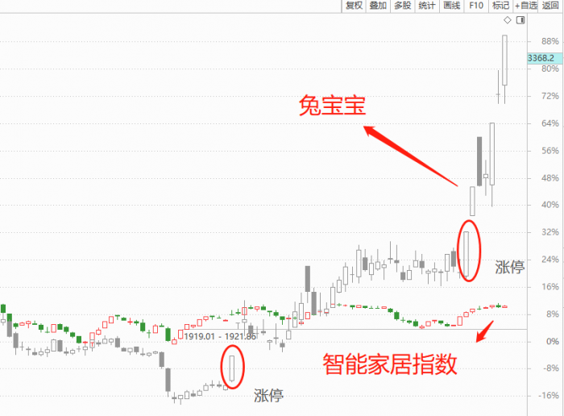

## 前言  

为什么要学习选股三板斧?  

我们知道，股价是个多维分析的结果，一看基本面，二看择时。  

过去我们讲解技术课程，大多围绕择时的角度去讲解，但我们经常说触发股价大涨的前提，必须是股票要好，即要符合市场风口、符合龙头股股性，且要尽可能的接近主力成本价去买。  

这三件事，就是决定一支个股是否具备性价比的核心，这也是为什么要讲这节系列课程的原因。  
  

**简单总结一下**：  

①风口如何体现?大风起兮云飞扬，时势造英雄，风口是龙头股的灵魂;  

②股性如何体现?性格决定成败，三岁看小七岁看老，能够率先涨停、率先突破关键压力，是龙头股的性格;  

③主力如何体现?主力你看不到，但量价上可以直观反映，放量大涨体现大资金的动作，大资金是龙头股的驱动力量。  

## 如何判断风口？  

索罗斯说，主流认知先于市场行为。  

认知是通过对消息面进行反应，简单归纳起来就是**三个字：新、大、近**。  

  

**1、“新”指的是题材要新**  

比如新政策、新市场、新技术等。  

比如说近期的市场热点大数据方向，就是来自于政策面的持续引导。重要会议前后，高层出台“数据二十条”意见，勾勒出数据要素产业的宏伟蓝图，后经消息面反复预热，走出了安妮股份、英飞拓之类的超级牛股;  

再比如去年年底疫情炒作下的医药概念，疫情放开后，最核心的流感类、感冒发烧类药物需求猛增，产品供不应求，新市场成就了以岭药业、新华制药在内的一系列牛股。  

  

**2、“大”指的是影响大**  

比如同样是政策，中央的政策影响力，必然高于地方的影响力;同样是财报，年报的炒作一定高于半年报的炒作。总之，影响越大，风口的价值越大，个股被追随的机会就越高。  

比如近年来，政策维度较高方向，无一不成为市场的主热方向，2015年的“一带一路”，2016年的“供给侧改革”、2017年的“雄安新区”、2019年的新能源革命、2020年的东数西算，今年的信创、数字经济，无一例外，都成为市场的主流机会。  

他们的共同特点，是政策的级别高、影响力深远，对风口的影响非同一般!  

  

**3、“近”指的是消息出来的时间近**  

最好是刚刚出来，这样预期差最大。比如疫情放开初期，医药、消费复苏大热，但近期过了感染高峰后，这些个股加速回落，如果还在追高买入的话，被套是大概率的。因此一定选择接近消息去买，才有意义。  

当然，一个板块的活跃，并不仅仅只凭一个消息的炒作，一个大的主线往往凭借梯队鱼贯而行。比如数字经济板块中，包含数据要素、数据交易所、元宇宙、网络游戏、数字货币、WEB3等方向，当板块大潮来临的时候，每天都有新的支点消息，激发新的市场活力，而我们通过临近消息的捕捉，更能聚焦到当下最具性价比的个股，从而完成高低切换和持仓优化。  

  

**总结**  

- 风口的逻辑点，在于“新”、“大”、“近”;  

- 风口选对，不意味着一定会大涨，风口只是个股上涨的一大因素，识别风口后，还要对龙头和买点，进行再度优化;  

- 近并非指一条消息，主线形成后，任何支点的消息，都要第一时间关注，这样才能做到紧随风口;  

- 风口有一定的周期性，风口减弱后，投资机会会大大降低。  

## 如何判断股性？  

上节课给大家分享了风口的逻辑，我们从“新”、“大”、“近”三个维度，系统性地阐述了风口的内涵。看对市场风口后，并不意味着你一定能够赚钱，打蛇打七寸，只有买到了龙头股，才能获得最大的收益空间。  

本届课程，我们将从股性的角度，帮助大家了解龙头是如何筛选出来的。  

### 1、为什么要学习股性?  

性格决定成败，三岁看小七岁看老。人性如此，股性也如此。股性为何如此重要，因为他**具备两个特点：一是自相似性，二龙头属性**。  

何为自相似性?即个股走势习惯总是相似的。一个容易涨停的股票，以后也更容易涨停;容易炸板的股票，以后依然容易炸板;容易小阴小阳的股票，以后依然容易小阴小阳。底部连拉几个涨停板后震荡整理，震荡区间的离开大概率也是连板离开。  

于是，建立在这种股性认知的基础上，我们可以将龙头股的属性找出来：**在一波风口塑造的过程中，能够率先涨停、或是率先突破关键压力的个股，这些个股就是龙头股**。  

  

### 2、怎样判断一只个股具备龙头股的股性  

首先我们先看两只个股，兔宝宝、东方雨虹同属家居建材的个股。兔宝宝早在1月4日，领先板块率先涨停，并率先突破箱体，同日东方雨虹还在蛰伏之中。当天的走势几乎注定了谁是板块龙头。  

  

通过与板块指数的对比，我们可以非常清晰地看出，龙头股走势在率先走强方面的领先性。其实早在兔宝宝这波反弹之前，该股在去年11月11日，该股已经走出连续涨停的动作。根据自相似性的原理，强势股连续涨停后，一旦脱离区间，大概率还将继续演绎连续涨停的动作，兔宝宝很好地体现了这一特征。  

  

### 3、案例推演  

POE胶膜龙头鼎际得，早在12月29日，走出领先于板块率先涨停的动作，当时板块指数还处于底部蛰伏的位置，绝大多数个股没有启动。此后，该股略作整理后，在1月6日再度涨停，随后福斯特、鹿山新材、茂化实华发力，带动板块指数活跃起来。  

  

储能龙头盛弘股份，早在12月26日便突破了下降压力线，领先于指数提前企稳。此后该股略作整理后，连续爆发，最终成为储能板块中走势最稳定、表现最突出的个股  

  

### 4、总结  

- 股性具备“自相似性”特征，可以在后期的走势得到复制;  

- 一波风口中的龙头，可通过率先涨停、率先突破关键压力这些特征，进行寻找;  

- 龙头股选定后，在走势中进行自我认定，一旦走势不佳，发生龙头易主情形，要果断换股或止损;  

- 龙头股的表现，取决于风口的强度;是否能够赚钱，也取决于是否跟上主力交易步伐。  

## 如何判断主力？  

### 一、为什么要判断主力?  

毫无疑问，主力是推动龙头股的力量。  

没有主力，就没有行情可言。跟随主力成本越近，风险越低，收益越大;偏离主力成本越远，风险越大，收益越低。  

主力你看不到，摸不着，却能在K线中留下蛛丝马迹。**主力喜欢在哪个位置发动行情?很简单，关键位置上的关键k线**。  

### 二、如何跟随主力  

**1、何为关键位置**  

狡兔三窟，主力也是如此。对主力而言，在三个区间发动行情最为理想：  

1.拐点区间，初期弱转强，以突破下降压力线为标志;  

2.震荡区间，第一次平台构筑区间，以平台末端放量大阳线为标志(不需要突破箱体高点);  

3.加速区间，第二次及以上平台加速区间，同样以平台末端放量大阳线为标志(不需要突破箱体高点)  

参考下图  

  

**2、何为关键K线**  

**关键K线，就是主力现身的那根K线，以倍量柱作为重要线索**。学过**黄金切线**的同学应该清楚，倍量柱就是在上涨趋势中，每一根放量大涨的阳线，满足以下两个条件即可：  

①成交量要求，超过前一根K线量能的一倍以上;  

②涨幅要求，当日涨幅超过4%，越大越好。  

  

**3、使用方法介绍**  

一买、二买处于上涨初期，需要结合倍量柱;三买不需要结合倍量柱。  

比如中国平安的走势，一买突破下降压力线，倍量确认后，股价上行;二买第一次突破箱体位置，同样需要倍量确认;三买处于行情加速阶段，主力已经深度持股，不再需要倍量柱确认身份，只需大阳线即可确认强度。  

  

### 三、案例推演  

案例一：券商方向东方证券。  

该股在去年11月1日突破下降压力线，当天倍量柱确认主力买入信号，符合关键位置上的倍量柱特征，触发第一类买点;此后第一次进入箱体盘整区域，并在11月29日底部走出倍量上攻K线，触发第二类买点;今年1月9日，该股在突破箱体高点后，通过新的倍量柱结构，确认第三类买点。  

  

案例二：智能家居方向兔宝宝。  

去年11月1日突破下降压力线，当日符合倍量柱特征，构成第一类买点;11月24日，该股在第一次上涨箱体低点确认倍量柱K线(当日涨幅超过5%)，确认第二类买点;今年1月4日和1月10日，该股分别在第二次箱体低点、第三次箱底低点走出倍量柱K线，形成三买，注意此时主力已处于锁仓状态，三买只要大阳线，不需要走倍量形态。  

  

案例三：数字经济方向英飞拓。  

有时候，二买不光只有一个，如英飞拓，在去年11月8日和12月1日，先后在同一个震荡区间中走出标志性倍量柱结构，因此同为二买，在称呼上，按照前后顺序，我们可称之为二买、类二买，作为区别。拾荒网股票学习网专注短线龙头战法~  

  

案例四：眼科医疗方瑞普眼科。  

思考一下，为什么瑞普眼科在箱底低点第一次起倍量的位置，不是二买，第二次起倍量的买点却符合二买?其实原因很简单，第一次箱底倍量位置，股价还面临箱体内部下降压力线的压制，小级别并未出现弱转强，这些细节投资人要注意。  

  

### 四、总结  

1.主力发动行情性价比最高的区域，是一买、二买和三买;

2.一买、二买为蓄势拉升阶段，需要倍量柱信号确认买点;三买为主力深度锁筹阶段，需要大阳线确认，但对倍量没有特别要求;

3.买点是否触发大涨，需要结合风口、龙头综合看待;

4.如果买入股价不涨反跌，说明风口或龙头预判错误，应在跌破关键买点K线实体低点进行止损。  
