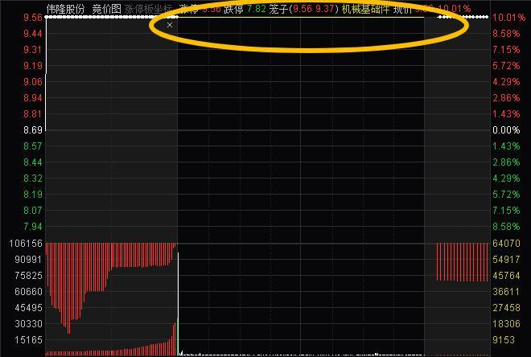
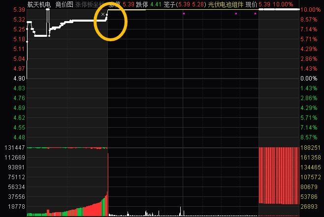
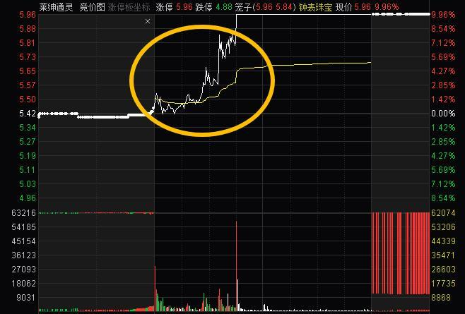
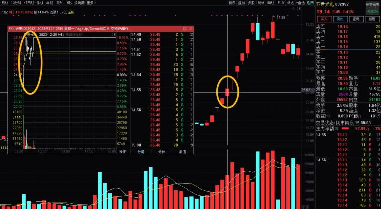
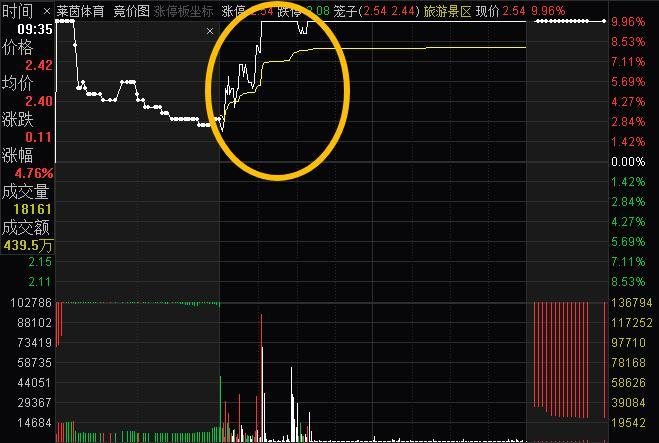
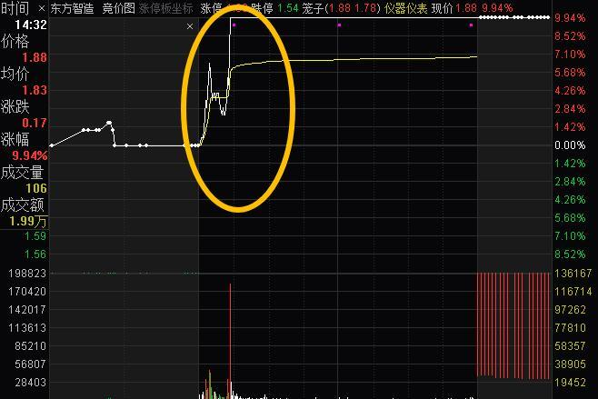
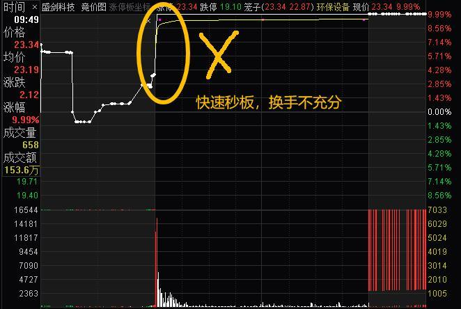
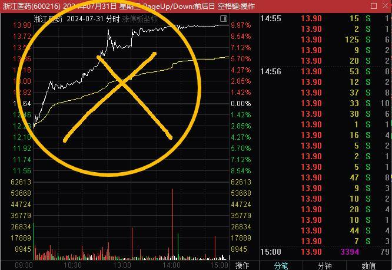
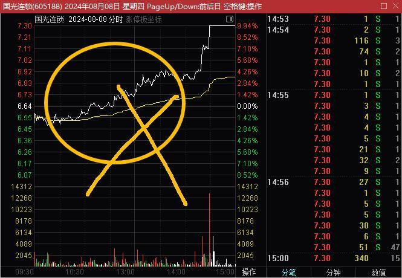

## 判断个股涨停板的质量  

（2024年08月09日 此战名天下 淘股吧热点专题）  

大部分超短选手做交易，基本都是围绕涨停板，如果没有涨停的股票，多看一眼都是对眼睛的玷污。为了能帮助大家系统性的理解涨停板，我决定教大家分析涨停板的质量，从而明白涨停板的强弱，什么样的板才是好的板，什么样的板有接力价值。  

### 一、涨停板的分类  

涨停板大体分为：一字板、加速板、换手板，当然一字板也算是加速板，不过我这里把它区分开，方便更深入的讲解。  

**一字板**  

从竞价结束到收盘结束，中间没有产生低于涨停板价格成交的单子，K线形态上就体现为一字。一字板产生的逻辑是隔夜或者盘前抢筹导致，代表资金极度认可逻辑或者方向，不仅愿意牺牲日内的利润空间，而且无惧风险去抢着买，所以一字板是情绪板，通常用封单金额判断它的强度。一般而言早期而言的一字，竞价结束后，封单金额至少在5亿以上才会对题材有带动作用，而且封单要一天比一天强，才能说明这个方向有延续性。  
  

**加速板**  

开盘几乎一笔单子就秒板封死涨停，这种定义为加速板。加速板产生于分歧转一致后的加速，情绪上仅次于一字板，但是与一字板判断的方法不太相同，加速板主要基于竞价的量能与开盘的量能决定，既然是加速板，竞价成交量最好不要高于前一日竞价成交量，竞价是买盘盘口约为70%是最好的，开盘竞价是卖盘盘口那就不要超过50%，不然开盘走加速容易锁不住筹码，导致爆量走弱。  
  

其实不管是一字板，还是加速板，都是情绪一致的表现，一旦不及预期就会走弱而爆量消亡，所以短线理念中有一句话，叫做接分歧，不接一致；也有一句话叫做买在分歧转一致，卖在一致转分歧，这两种板对场外交易者并不友好，仅仅当作情绪发展来看待。所以短线交易，通常买在分歧后的弱转强，也就是我们选股要选前一天是换手板的股票。  

**换手板**  

盘中经过筹码交换，需要一定时间才封涨停的，称作为换手板，换手即意味着分歧，那么如果明天分歧转一致，就是一个不错的买点。  
  

### 二、判断换手板质量  

我们要选前一天是换手板的股票，但并不是所有的换手板好，什么样的换手板质量更好？  

1、封板时间在9点40-10点，当然这个时间范围可以适当放宽，原则上就是上板时间不能太早，也不能太晚。封板时间太早意味着换手时间不够、不充分；封板时间太晚意味着股票不够强，很长时间也不能转一致涨停，所以大家在这个理念范围内自行把控。以下图形展示，仅做为涨停板质量研究，不作为股票推荐，具体还需综合其它角度。  
  

  

  

  

2、分时走势必须流畅且有气质，换手拉升有力，而不是小碎步上升，因为小碎步有量化对倒嫌疑，很可能是小单行为，这种板不够强势。  
  

  

3、换手率最好在10%-30%之间，低于10%换手不充分，过高有出货嫌疑。  

总结：当然并不是有了好的换手板，第二天接力就百分之百成功，还是要结合聚焦核心选股思维的基础上，再用以上方法优选个股，并且要灵活运用其中的思维逻辑，而不能教条主义。  
