## 判断板块与个股的预期  

（2024年08月04日 此战名天下 淘股吧热点专题）  

答应周末给大家写一篇干货贴，关于这次的内容方向，周五也征求了粉丝的建议，我看到留言区有想听如何寻找确定性买点的，如何确定主线题材、龙头和中军的，如何判断题材持续性的，如何理解盘面信息进而指导操作的，等等等就不逐一列举了，大家的热情很高涨，证明还想继续学，那我就毫无保留的继续更！  

我总结了大家普遍的问题，其实无论是确定性、持续性、买卖点，都是建立在宏观的预期上，如果你对接下来的预期不乐观，上述的线性问题就都不成立了。所以思考了一天，为了更系统的覆盖到大部分粉丝的问题，我觉定先教大家判断板块与个股的预期。  

### 一、如何判断板块的预期  

市场上机构最爱聊板块了，接着中长线趋势投资者，反而做短线股民容易忽视对板块的研究，短线理解中有句话叫不预判只跟随，导致很多人单纯的追随右侧上涨的股票，只看个股的K线，不看板块的K线，我说的对不对？这种做法很片面，如果板块题材走不出预期，里面的股票也只是昙花一现。  

其实超级龙头只是板块或题材的映射，并不是很多人说的题材是龙头带出来的，恰恰是因为题材有超级做多的预期，资金才去猛怼里面最具有投资价值的标的，历史上有了碳中和超级板块，才有了超级龙头南网能源；有了三年抗疫，才有了九安医疗；有了AI，才有了龙头剑桥科技；有了低空经济，才有了龙头万丰奥威。国强才能家盛，脱离宏观的大时代，是跑不出明星企业的。所以交易者建立了对板块的预期，才能持续做多大周期，持续做多龙头！  

一个板块或题材想持久走下去，那必须有源源不断的资金支持，也就是所谓的成交量，这才能构成量价齐升的健康走势，如果是放量的市场，自然有充足的资金去支持板块，但如果是缩量的市场，资金一旦不够，就容易造成板块熄火，所以板块的预期，主要是结合板块量能和市场量能来判断的。  

**1.结合板块与市场量，判断板块的预期**  

比如7月份就是典型的缩量市场，基本每天都是7000亿以下，这样很难支撑一个板块走出持续性，这种情况下如果有题材表现，却没有带动市场成交量放大，那基本只是单纯的抱团，月初的消费电子板块对应期间的市场量能，市场量能甚至严重缩量到5000亿左右，说明有限的钱都去消费电子抱团了，市场量能并没有放大，这种肯定是走不远的，只能抱团其中有辨识度的几个标的，比如神宇股份等。  
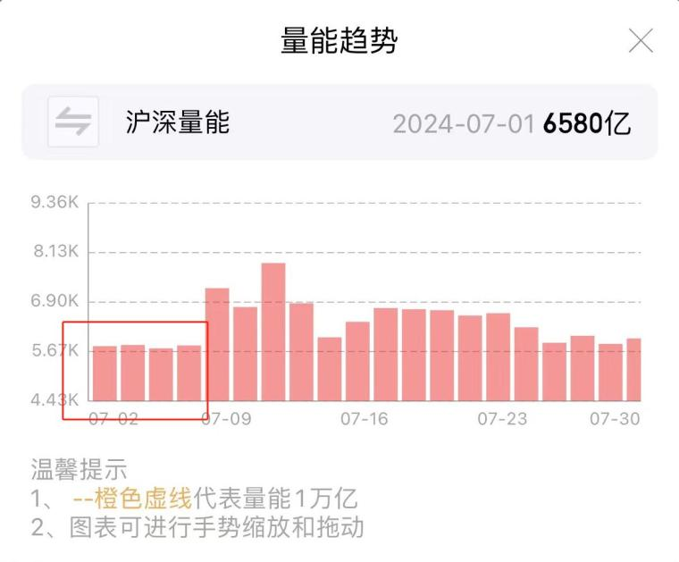  

7月9号，无人驾驶板块第一次异动，市场由5820亿放量到7244亿，随后板块主升的第3天，市场更是放量到7870亿，无人驾驶与市场同步放量、同步主升，这种情况持续性就会非常好，积极看多无人驾驶周期，在板块分歧第一次的时候，去上车核心龙头！  
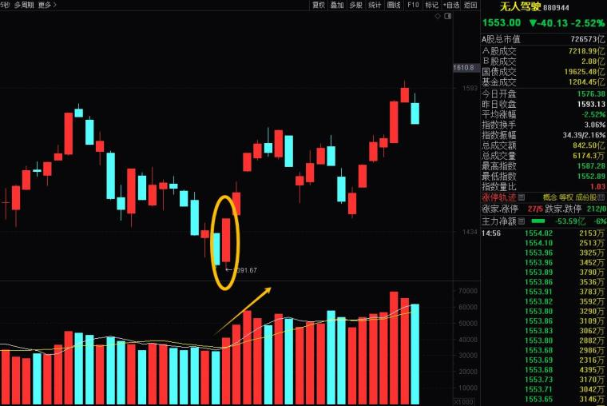  
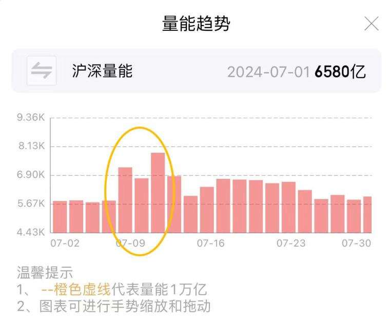  

所以在7月12号，无人驾驶出现第一次分歧，我们就选择上了大众交通，当时我先于市场喊出大众交通可能是下一个大妖，并且周末再发文预判大周期启动。  
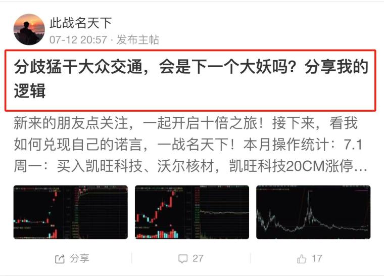  

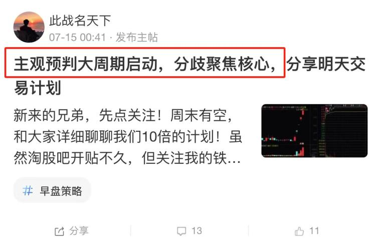  

所以缩量市场中，板块+市场同步放量，量价齐升，板块的预期就高，未来一段时间的持续性就更好！  

7月23号-7月24号，无人驾驶板块放量下跌，这个量几乎是题材启动时候的量能，而对应的市场却是缩量下跌，这说明了什么？说明市场并没有新的资金，无人驾驶放量下跌，市场其它板块的资金过去抱团无人驾驶了，开始抱团后分歧转多，就容易出现逼空加速行情。  
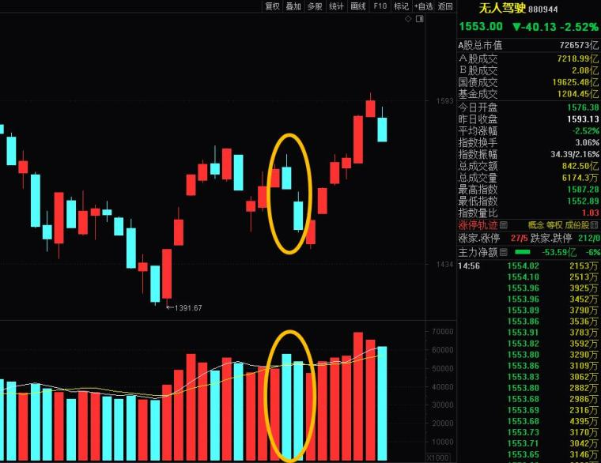  

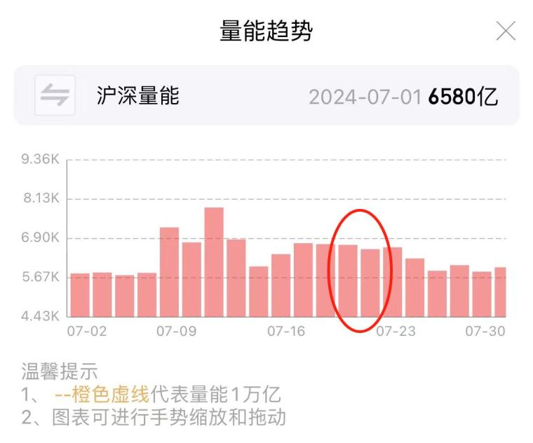  

于是7月25号-7月30号，无人驾驶板块再次出现量价齐升，但市场的量能却没有明显增加了，维持在5900亿出头，很明显这段时间就是纯板块、纯个股的抱团行情，如果后期板块一旦放大量冲顶，市场量能跟不上，题材短期的预期就走完了。比较庆幸的是7月31号，无人驾驶板块放出加速后的巨量，但是市场也直接放了9000亿的量，或许是天意，或许也是有意而为之，帮助无人驾驶度过了这一劫。  
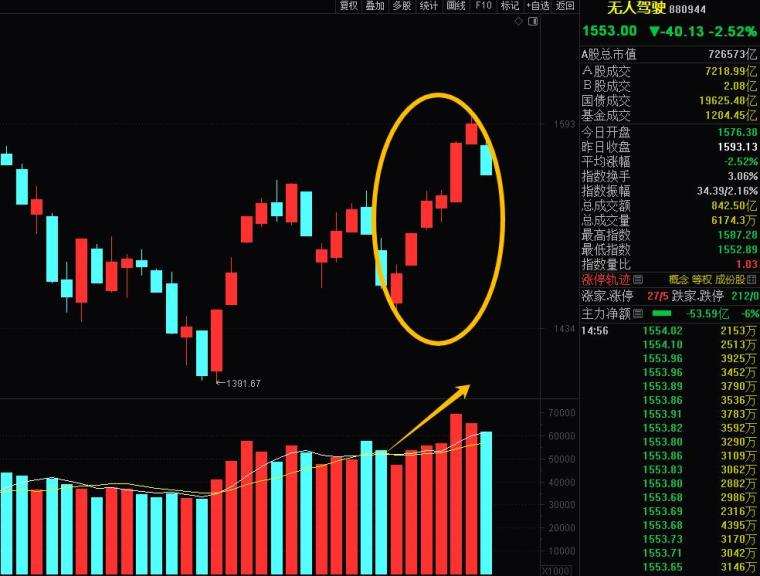  

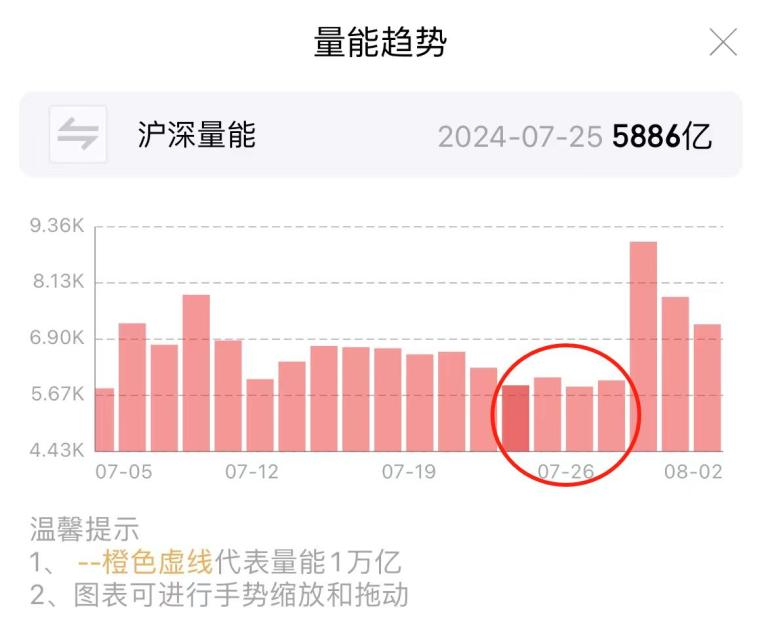  

**无人驾驶接下来的预期怎么样？**  

除了无人驾驶，这几天市场上还有一个商业航天，商业航天在7月26号出现量价齐升，但是对应市场量能没有明显的放量，这说明在无人驾驶加速的期间，市场上其他板块存量的踏空资金退而求其次，转身去追商业航天的赚钱效应了，而在7月31号-8月2号，商业航天板块依然在放量，但是市场量能与无人驾驶板块的量能却开始缩量。  
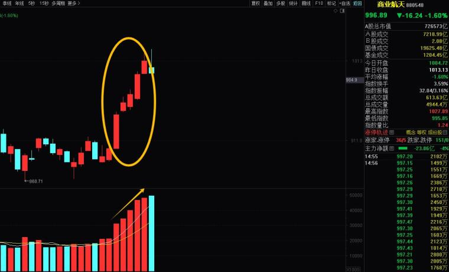  

  

这说明商业航天与市场不是同步放量，量价背离的，也就是说商业航天这几天的资金更多是因为主线无人驾驶分歧的出来的资金，临时炒作商业航天，商业航天能否转正主线，至少需要一次分歧后与市场共振的信号。介于周五商业航天板块分歧，无人驾驶与市场共振的前提下，如果下周商业航天分歧阶段，无人驾驶修复的时候，再次与市场共振，那无人驾驶很可能开启第二阶段。  

**2.结合题材想象力与落地性，判断板块预期**  

其实题材的想象力、落地性，最后都会落到板块的量价里面来反应，我把这一点加进来，主要是提升大家对题材的敏感性，说白了也就是预感能力。没有想象力的题材，炒作的空间是非常小的，因为未来的价值不大，为什么徐新在京东几乎一无所有的时候，就要投资京东很多钱，就是因为互联网时代，京东电商未来的想象空间是巨大，能创造巨大的商业价值。炒作题材同样如此，你要明白这个题材未来的增量有多大。  

除了有想象力，还必须有落地性，想象力代表着未来10年的空间，落地性代表着未来1-3年的空间，只有想象力没有落地性，炒作时间就可能滞后，当下如果出来更有落地性的好题材，就会取其而代之。  

所以低空经济，就是既有想象力又有落地性的题材，上半年炒了好几波；无人驾驶虽然不算新题材，但是想象空间比较大，而7月份的发酵本身就是落地性的一个体现，无人出租车、无人客车、无人快递车一旦落地，面临的就是巨大的商业化，题材发酵的初期就应该有这样的预判。  

### 二.如何判断个股的预期  

如果你要问我杂七杂八的股，我怎么能知道？因为有的股就没什么预期，每天涨跌都很随意，更多的波动是因为环境因素，而不是内在因素驱动着走，这就好比你问我某个班里的学生，这次考试能不能考90分。对于前几名的同学，我肯定有判断的预期，对于中等生、差等生，你让我怎么判断？除非卷子容易，他们才有可能考90分，是不是这个理？所以在题材有预期的同时，个股的预期要建立在自身的地位上。  

不过板块早期主升阶段，前排的核心都没有确立地位，市场不知道谁是老大，相对而言就存在预期差，比如九子夺嫡，这个阶段只是晋级赛，谁是老大还不清楚。如果判断这个题材有持续性，那么在板块第一次分歧的时候，前排核心票如果是良性分歧，那么这个票就有预期差，当天分歧的时候或者第二天弱转强的时候，都是博弈点。比如大众交通，板块第一次分歧的时候，大众交通也跟着分歧，如果你对板块预期有研究，大众交通当天就是先手博弈点，第二天弱转强后，又是一次博弈点。不仅博弈题材预期，也博弈的是核心继续向上的预期。  
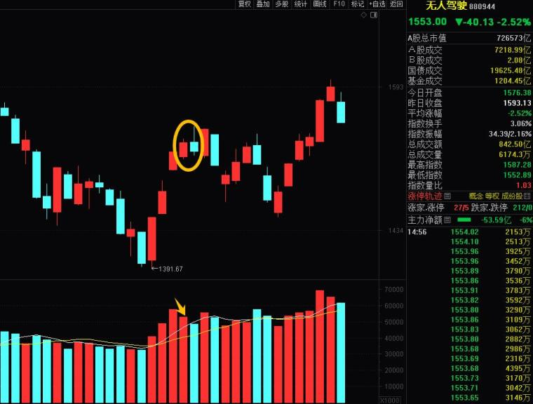  

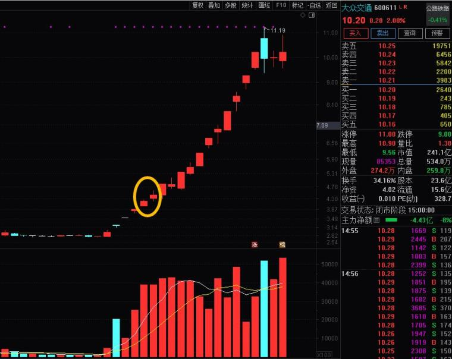  

但是如果板块已经是中期或者加速阶段，前排的核心就淘汰赛，要遵循去弱留强的原则去做，主要的预期都是放在龙一、龙二，或者日内最强情绪先锋上，中位的票就要少碰了。  

当然每个核心票可以自己与自己对比，来看第二天有没有加强的预期，有人说缩量涨停就是强的表现，但是太一致第二天又可能爆量。有人说爆量就是弱，但这也说明资金进来积极做多的意愿，第二天又可能弱转强。所以抛开板块预期以及个股地位，单从技术上判断个股预期稍微有点片面。**不过从技术面上来说，日内的分时走势、封单，以及第二天的竞价量能等等，也能侧面佐证这个股票接下来的预期。篇幅有限，精力有限，以后再给大家做更多的分享！**  
