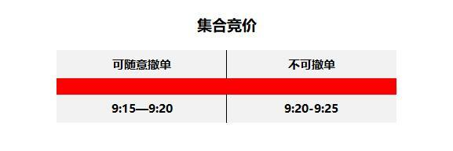
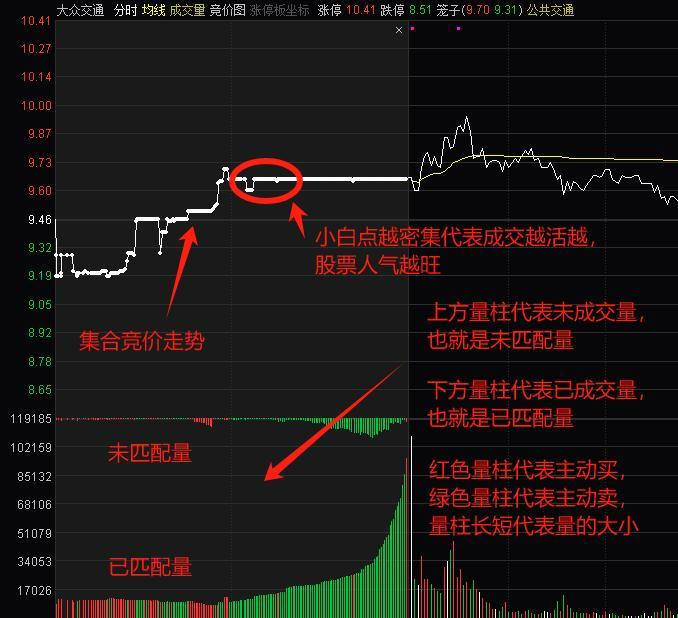
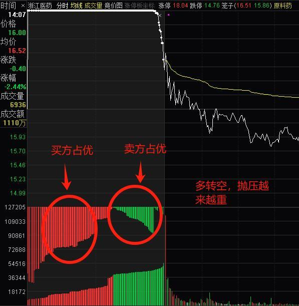
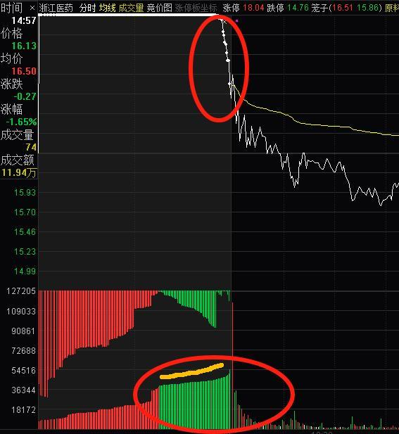
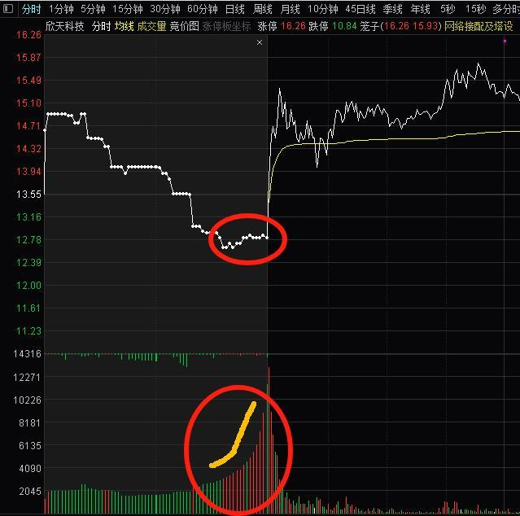
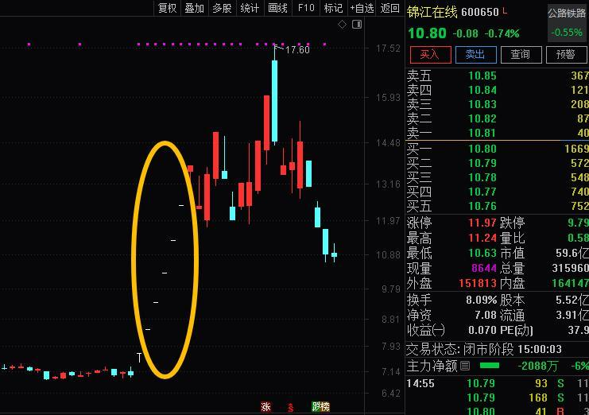
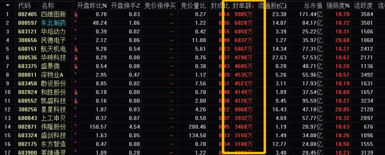
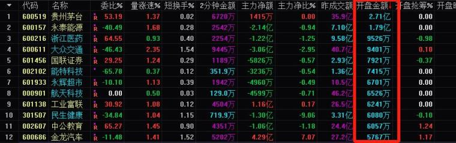
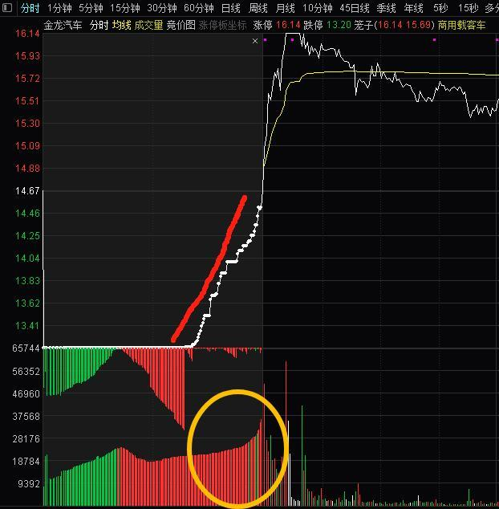

## 判断集合竞价的强弱  

（2024年08月11日 此战名天下 淘股吧热点专题）  

**1.集合竞价的底层逻辑**  

大部分股民不理解集合竞价，集合竞价是对开盘前接收的买卖申报一次性集中撮合，并选取成交量最大的价位作为开盘价，高于这个价位的买进申报与低于这个价格的卖出申报全部成交。所以通过盘前的集合竞价，不仅可以确定股票的开盘价，也反应了投资者在非交易时间对当天股票的预期结果。  

**2.集合竞价的规则**  

集合竞价的时段是9点15到9点25，其中9点20之前是可以撤单的，9点20之后就只能下单不能撤单了，期间的撮合交易会按照最大成交量的价位，全部在9点25分统一成交，成交价格就是当天的开盘价。当然在9点25到9点30期间，我们也可以下单，但期间的单子不会处理，全部放到9点30开盘后处理。  
  

如果你看懂了规则，就明白9点20之前的价格不真实，主力可能为了试盘吸引市场的注意，挂了大量虚假的单子，会在9点20之前陆续撤掉。所以我们主要分享9点20之后相对真实的竞价数据。  

**3.集合竞价图例说明**  

  

**未匹配量看抛压**  

绿色量柱代表当前价格还有很多卖单排队，说明卖方占优。红色量柱代表当前价格很多买单排队，说明买方占优。所以未匹配量主要看当前价格抛压大不大，买方强势还是卖方强势。如下图浙江医药，集合竞价由买方占优，逐渐变的抛压越来越重，形成多转空预期，全天股价形成下行趋势。  
  

**已匹配量看承接**  

价格上行过程中，下方量能代表有多少量进行抢筹；价格下行过程中，下方量能代表有多少量进行接盘，所以下方的量能代表对应价格的承接。如下图浙江医药，随着价格下行，成交量没有形成明显放量，代表当前价格承接仍然不足，有继续下行预期。  
  

再比如周五的欣天科技，价格震荡上行，但下方成交量明显放大，说明当前价格承接越来越强，甚至形成一定的抢筹。  
  

**4.集合竞价的运用**  

**通过集合竞价判断市场动向**  

集合竞价代表市场对股票的预期，当天集合竞价最强的个股，往往代表市场资金青睐的方向，我们主要看涨停一字板的隔夜买单未匹配量与竞价结束后的未匹配量，比如前一段时间无人驾驶的锦江在线、星网宇达，连续几天竞价都有几十个亿的封单，代表市场对这一方向预期高，所以那几天可以重点观察无人驾驶其它核心的买入机会。  
  

集合竞价期间，通过看封单额来进行判断，一般封单排名第一，且竞价结束后封单金额＞7亿，大概就是今日市场比较强的方向。  
  

**通过集合竞价抢筹，挖掘当天预期最大的股票**  

竞价抢筹有两种，一种是抢筹量价齐升，另一种是抢筹量升价没升，肯定第一种的预期要大于第二种的预期。  

首先，我们要找到竞价成交金额最多的几只股票，如图开盘成交金额即是竞价成交金额。  

  

其次，我们要找到其中抢筹的股票，抢筹代表着成交的红色量柱明显放量，并且形成量价齐升，其中金龙汽车是当天抢筹最明显的股票，大家可以回测一下。  
  

**5.顺便聊聊**  

很多朋友问什么是买盘盘口？什么是卖盘盘口？竞价的最后几分钟，抢筹形成量价齐升就是买盘盘口，抛售形成量价背离就是卖盘盘口。其实集合竞价很简单，大家看了我的文章都能理解，但是我们一定要放在核心股票，以及集合竞价强势的股票中去研究，很多股票集合竞价成交量非常小，甚至量柱不密集，研究这类股票的集合竞价没有什么意义。  

再强调一点，集合竞价只是股票预期的一个因子，不能当成判断股票涨跌的唯一因素，很多朋友完全用竞价做股票，但是不考虑题材与环境等影响，这种仍然是赚赚亏亏，走不出来的！即使竞价非常好，盘中也可能被其它不可预测的因素影响，所以炒股不能认死理。  

时间有限，今天就先分享这么多，明白逻辑后，大家要活学活用！  
