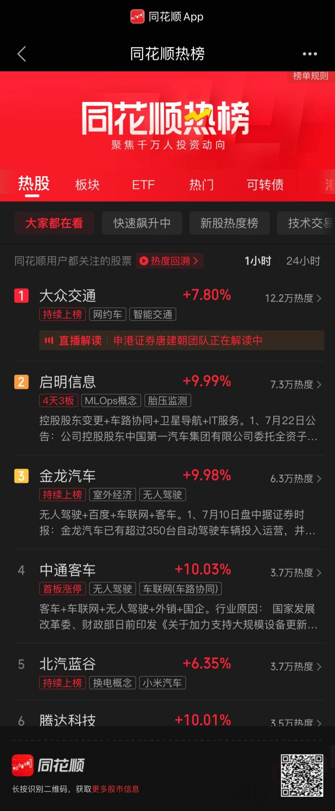
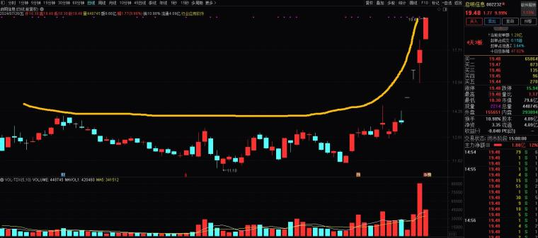
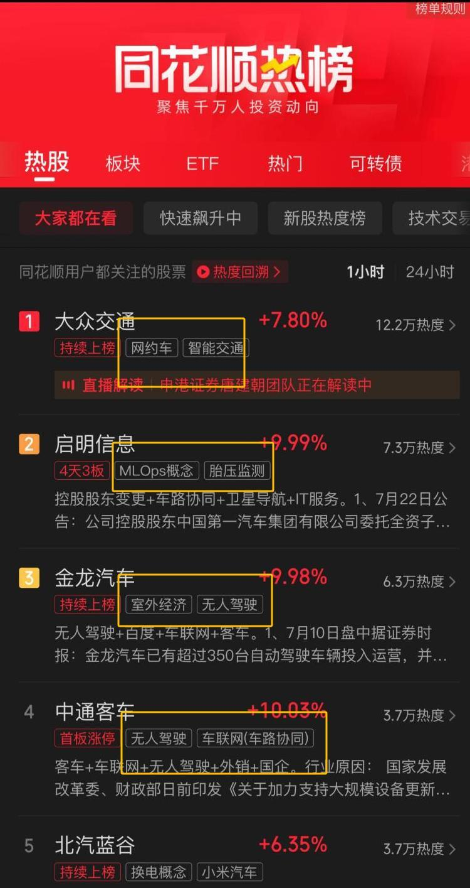
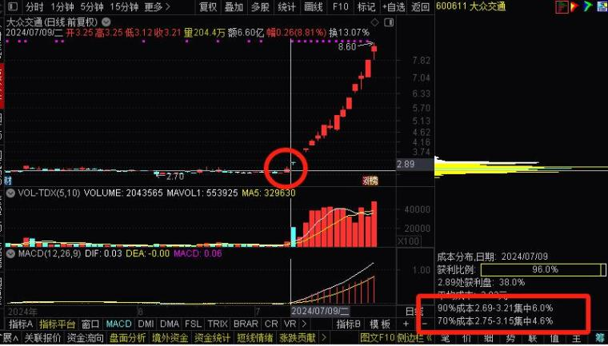

## 如何挖掘人气牛股  

（2024年07月27日 此战名天下 淘股吧热点专题）  

说起人气牛股，不得不聊辨识度，一些朋友不明白，为什么非得看辨识度？这么说吧，辨识度就是形象与气质，好的形象、气质天然自带流量与人气，美女帅哥更容易在众人眼里出挑，所以股市也是社会规律的映射！  

很多朋友手里拿着歪瓜裂枣的股票，亏得一塌糊涂，其实就是不明白底层规律，其实用心想想，人人爱校花，人人都想追校花，你手里捂着歪瓜裂枣不就是沦为了接盘侠吗？是不是这个理？因此投资就投明星项目，人人抢着要的东西才有价值！  

**综上所述：股市中挖掘人气牛股，首先要挖掘辨识度，辨识度越高越有人气，辨识度孕育了龙头，龙头代表市场最高辨识度！**  

所以我们要分析，组成股票辨识度的关键要素：  
1、阶段性涨幅越高，越有辨识度；  
2、股票形态越美，走势越流畅，越有辨识度，尤其是连续涨停形态突破前高，趋势向上；  
3、越靠近主流题材与炒作方向，越有辨识度；  
4、股票价格低，价格低意味着购买门槛低，散户都能参与进来，所以价格低于20元的股票，更有辨识度，当然太低的也要注意退市风险；  
5、筹码越集中，代表主力洗盘到位，越有辨识度；  
6、股票流通市值低，表明以后成长性更高，市场更喜欢炒作100亿以内的公司；  
7、如果有一个朗朗上口名字，成妖概率更大，有的股票名字很难记，市场就不爱炒这一种票，因为不方便传播，这也是为什么龙字辈、数字头、动物名称的容易炒妖；  

这几点是股票辨识度的关键要素，只要你能理解到位，实战中灵活运用，就基本与强势股为伍了。  

**实战运用**  

我们如何在实战中，如何挖掘人气牛股呢？  

首先找人气前排，我们可以通过同花顺热榜，快速看到前排的人气股，尤其是前排涨停的股票，我们从前20名内选股就好，人气排名靠后的就不要看了；
  

其次选形态，从前20个钟选K线形态美的票，什么样的K线形态美？长时间的横盘整理+最近趋势向上+突破前高+涨停，所有龙头的K线形态都非常美，非常流畅，所以我们要严格提高审美；  

我举几个例子，让大家理解什么样的K线才是形态美  
  

  

  

再次聚焦主线，如果只是人气前排与形态美，还远远不够，我们要明确炒作方向，比如现在市场炒作无人驾驶，那其它非核心主线的题材票就不用看了；  
  

然后看筹码图，牛股低位启动时，筹码高度集中，尤其是70%成本集中度，基本都是10%以内，甚至低于6%，首板或者二板筹码不集中，基本没有牛股基因；  
  

最后看股票的市值和名称，这个就不给大家阐述了，大家应该都能明白。  

4.最后聊聊  

运用好上述方法选股，你就更容易挖掘到人气大牛股，接下只是一些识别它们地位，以及上车时机的一些问题了，以后有时间我会继续为大家分享实战干货！  

大家在做交易的时候，一定要严格要求自己的审美，摒弃操作非人气股票，非前排股票，尤其是对于龙头选手，更要聚焦核心，请大家记住，大牛股基因=人气高+形态好+筹码集中易控盘+主流题材纯正+市值中小有成长性+好名字！  
