## 如何系统性的复盘  

（2024年07月21日 此战名天下 淘股吧热点专题）  

我们出手的胜率，大家有目共睹，如此高的精准度，除了一流的交易模式体系，以及顶级盘感外，也是因为我每天都坚持复盘。每个人都有自己的复盘步骤，但有的朋友并不复盘，不过做为过来人，还是建议大家每天都复盘一下市场，并且形成自己的复盘体系。因为我们坚持复盘，不仅能方便第二天买到好股票，更是为了看深看透当前市场，坚持时间久了，还能提升对股市运行规律的认知！  

下面给大家分享一下，收盘后，我如何复盘？  

**一、看大盘指数、看成交量能、看涨跌家数，了解当前市场的环境，感受市场赚钱效应的强度**  

周五上涨家数3045家，下跌1795家，涨停板62家，说明市场的赚钱效应还是不错的，但是全市场量能6698亿，成交量继续萎缩，这说明市场处于这几天行情的一个加速中，而连续两天的全面普涨，情绪有点高潮，适当注意周一局部的分歧，毕竟无人驾驶目前处于分歧阶段，半导体芯片也连续两天高潮了，周一要相对聚焦核心！  
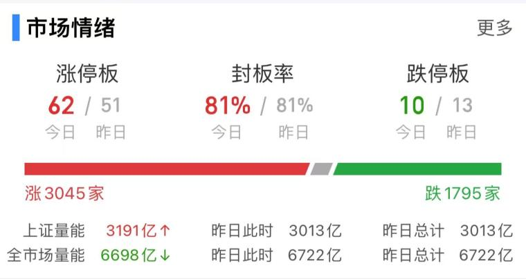  

**二、看全市场中主力净流入、净流出前三名的股票，知悉超级主力的动向，看清整体大方向**  

周五主力净流入前三的公司，分别为士兰微、中芯国际、上海贝岭，这三家清一色全是芯片半导体公司，说明市场大资金在扎堆芯片半导体；  
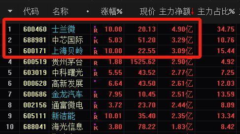  

净流出前三的公司分别为北汽蓝谷、紫金矿业、工商银行，除北汽蓝谷是因为利空消息资金大幅流出，紫金矿业和银行都是之前抱团的权重，这说明资金开始出逃前期抱团的高分红高股息；  
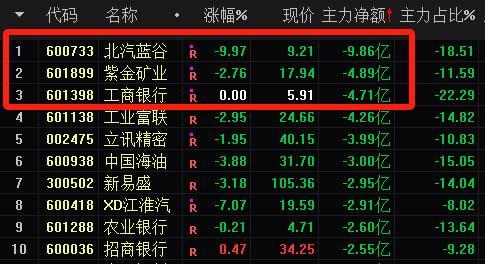  

**三、看行业概念炒作方向，了解涨停家数最多的前三个概念，了解大涨的原因，挖掘有深度的方向**  

周五涨停家数前三的方向，分别为芯片产业链、轨道交通、无人驾驶，超跌方向只是风格，可以忽略不看；  
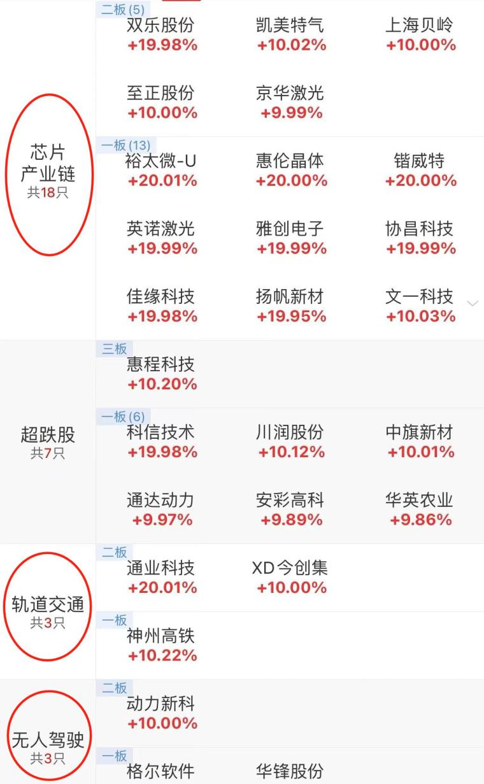  

芯片的驱动因素：据预测，全球光刻机市场规模预计在2024年将达到295.7亿美元；另外老美有意进一步制裁中国芯片市场，科技自强进一步迫在眉睫；  

轨道交通的驱动因素：上边表示，推进能源、铁路等行业自然垄断环节独立运营和竞争环节市场化改革；  

无人驾驶的驱动因素：近期，海南、深圳、济南等多地纷纷宣布推进无人驾驶公交车项目的落地运营；  

**四、看每个方向中核心高标的强度、权重强度，了解这个题材的运行节奏以及对应阶段，是发酵期、还是高潮期，还是分歧或者面临退潮**  

无人驾驶的核心高标：大众交通、雷尔伟、锦江在线、交运股份、金龙汽车  

1、大众交通，周五的分时走势明显已经再卡异动，毕竟前面猛涨了一波，即使有第二阶段也需要盘整一下了；  
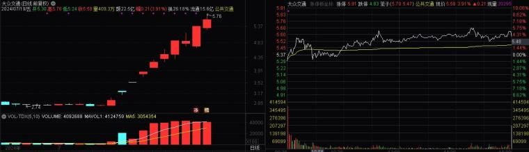  

2、雷尔伟，周四周五连续两天，都属于断板后的弱转强反包，周五尾盘漏单炸板，有走弱迹象，并且收盘已经触发严重异动，有人说雷尔伟可以模仿正丹、英力不断弱转强创新高，我觉得有点难；  
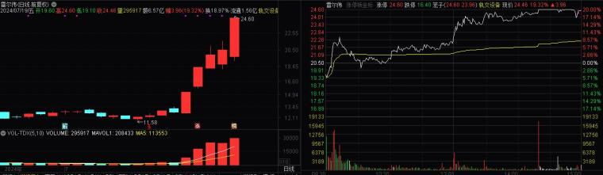  

3、锦江在线，这个属于前期连板高标，断板后其实已经淘汰，虽然周五反包但是也没封住板，除非周一继续弱转强，正常地位已经不靠前了，不在我主要的视线范围内了；  
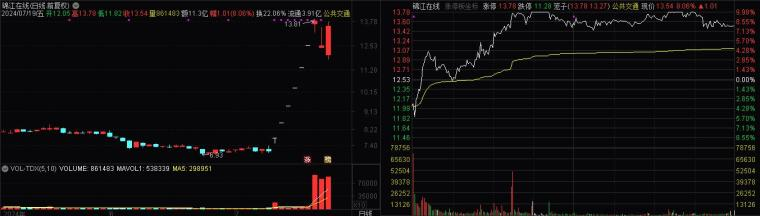  

4、交运股份，无人驾驶后排的最强补涨，不过连续一字周五断板，分歧比较大，除非下周一弱转强反包，感觉概率非常小，基本也处于淘汰的位置；  
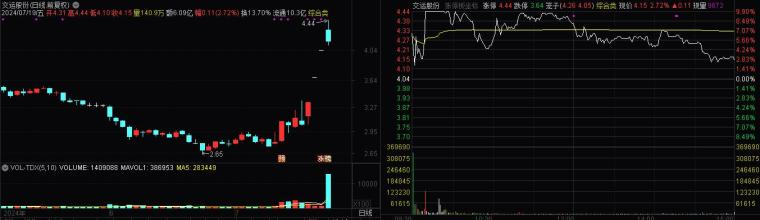  

5、金龙汽车，我对它的定位是无人驾驶低位新的容量，类似万丰奥威同期的中信海直、卧龙电驱，周五我也买了一部分，不过尾盘还是被北汽蓝谷带开了，如果周一想突破需要直接加速，或者盘中弱转强，当然它的趋势是没问题的，地位还在，值得继续跟踪；  
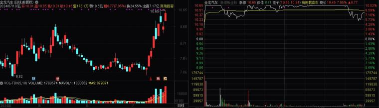  

综上所述，无人驾驶处于分歧阶段，即使后边有第二阶段，也需要盘整，或许有个别可以套利，但是不可过度谈恋爱，先让它休息一会儿吧！  

芯片方向的核心高标：上海贝岭、双乐股份，还有一个周五走弱的蓝英装备  

1、上海贝岭，周五加速涨停，周一正常预期要继续加速甚至一字了，买点已经不好了，稍微不注意，就会面临加速后太一致的分歧，想要走的更远，需要分歧后的检验；  
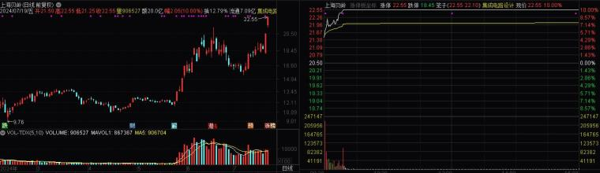  

2、双乐股份，周五PK掉蓝英装备，下周一想要继续晋级，必须要走个加速了，开盘分歧可能就不好了；  
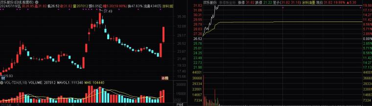  

3、蓝英装备，周五虽然走弱，但并没有死，如果周一水下能承接住抢筹，仍然有弱转强的预期，不过他目前的地位肯定已经不如前两个了；  
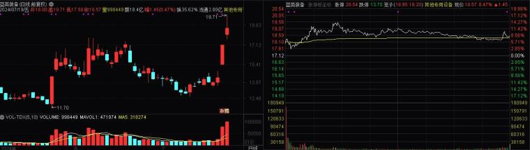  

综上所述，芯片的核心虽然走的很强，但是周五已经有点高潮了，周一有分歧预期，分歧更要聚焦核心，若核心能抗住分歧，就有进一步向上的可能。  

轨道交通的核心高标：通业科技、雷尔伟  

1、通业科技，如周五分时图，有点烂板走弱，下周一除非加速转强，我觉得概率有点小，毕竟是无人驾驶发酵的分支；
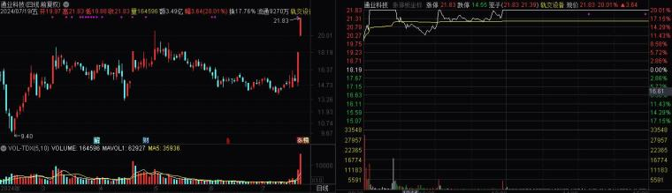  

2、雷尔伟在无人驾驶的方向分享过了，不过多叙述了；  

综上所述，轨道交通明天也面临分歧，不能无脑去接！  

五、制定交易策略  

1、经过上面系统性的复盘，我们发现不管是无人驾驶、轨交、还是芯片，都有延续分歧或者分歧的预期，所以聚焦核心题材、核心个股的同时，操作上不可贸然或者激进，分歧阶段的套利，要注意仓位配置；  

2、盘中有新发酵的强度标的，可以适当参与，也要注意仓位；  

3、大家觉得我周一会参与哪只牛股呢？可以发到评论区，我会一一点评；  

以上就是我的复盘步骤，当然更高阶的知识涉及到具体的选股、买卖点等综合的交易模式体系，以后有机会继续分享给大家！大家要先学会复盘，培养良好的复盘总结惯，因为交易是一条永无止境的路，这条路上没有所谓的天才，就如同我的签名，需要十年磨剑的坚持，不断了解市场、总结方法、提升盘感，方可稳定盈利！  
