([原文](https://www.taoguba.com.cn/Article/6355506/1)发布于2024年11月03日)  

## 一、短线买卖点

### 1.买点篇  

之前写过银之杰确定性买点的教学贴，银之杰是当时大金融的龙头，它可以产生多个确定性的买点！但不是所有的人气股都能走成龙头，所以短线的共性买点，其实就是弱转强一个；  

很多朋友还是搞不懂弱转强，我帮助大家大道至简的梳理一下，你体会一下：为什么有的股票能弱转强，有的票弱了就不能转强，反而更弱了呢？  

**其实能走出弱转强的股票，本质上是不弱势的，就是那种看弱非弱，看着弱势实际上是强势的股票**，这种股票的弱势是给外行人看的，通过分歧换手洗掉不坚定的筹码，接下来转强后继续主升！在分歧的过程中，很多人觉得弱了就走了，反而是股票是在空中加油！  

所以我们在选股的时候，首先要聚焦人气核心股，因为这种股票从出生就是强势股而非弱势股，进而弱转强的概率会比较高；其次聚焦人气股的前提下，挑选前一天分歧过程中承接比较强势的，这种分歧强势有两种形式，一种是强势的换手板，一种是强势的断板，我结合案例给大家讲讲：  

**①换手板的弱转强**  

**强势的换手板，具备两个条件：换手充分、封板强势；**  

换手充分，就是要有足够的时间进行换手，你不能开盘秒板，这种显然换手不够充分甚至是加速了，所以烂板容易出妖股，就是经过了充分的换手；其次就是封板时间也不能太久，太久不封板说明股票弱势，就好比下午封板就不如上午封板的股票主动，所以小票在9点40到10点左右封板最佳，不仅有充分的时间换手，而且封板较早比较强势；但是大家要活学活用，不要非得找这个时间段内封板的股票，一些大票下午封板也是比较强势，因为容量比较大需要足够的时间换手，所以大家心里对换手要有一个概念，换手意味着成交相对前一天要放量；  

封板强势，就是换手过程中的分时走势比较强势，每次的拉升动作有力，证明有大资金点火，而不是小碎步往上走，这种量化迹象比较明显；  

**具备这两个条件就是好的换手板，第二天高开抢筹往上，分时弱转强就是买点**；  

比如光伏板块10月25号爆发，人气股上海电气就是一个好的换手板，第二天开盘承接后上冲，就是标准的弱转强买点；  

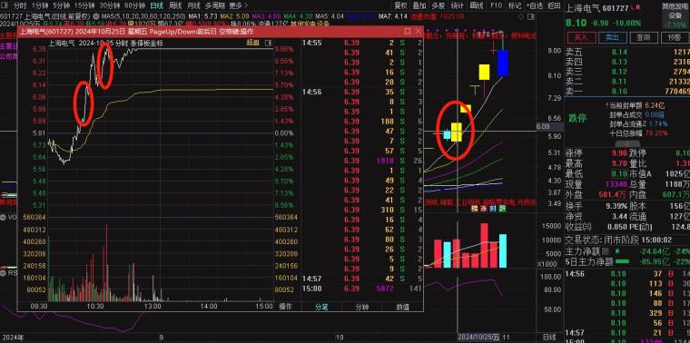  

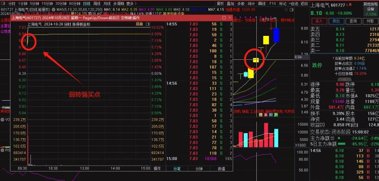  

比如10月29号，最高板华立股份大分歧下午断板，当天诞生了中国长城节点票，中国长城即是人气股，又是好的换手板；  

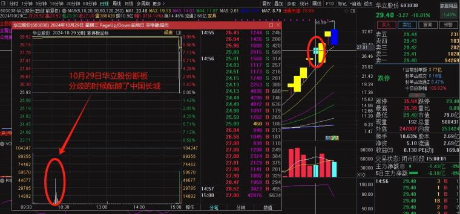  

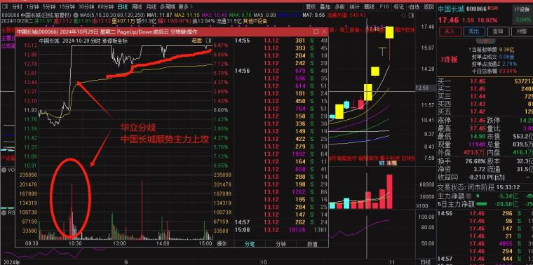  

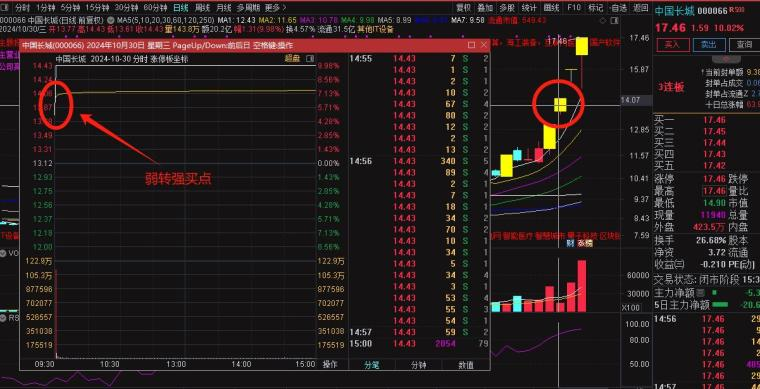  

**②断板后的弱转强**  

第一种弱转强是适用于连板接力，前一天是涨停板形态；还有一种弱转强是断板后的弱转强，这种比较考验大家的选股能力，我一般不建议大家做这种类型的弱转强，不过这里还是给大家讲讲吧，这种人气股短板后，分歧过程中虽然没有涨停，但是它的承接也是非常强的，这种分歧过程可以用1天来体现，也可以用2-3天来体现；  

比如我们做过的龙头大众交通，7月12号题材首次分歧，大众交通做为当时的容量核心也顺势分歧，但是承接非常强；  

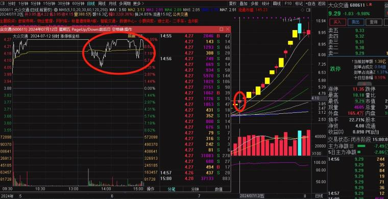  

接下来第二天，跳空高开分时向上抢筹，就是弱转强的一个买点，虽然后边断板，但依然显示出比较强的承接性；  

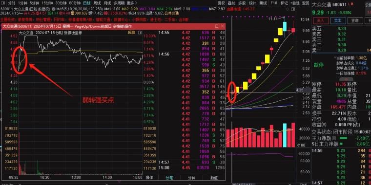  

再接着第三天，又产生买弱转强的买点，这次的弱转强买点，就是我准备讲的第二点弱转强，这种弱转强就是断板后，经过1-3天的强势承接，接下来带量弱转强涨停，这一天是一个非常好的主升启动买点；  

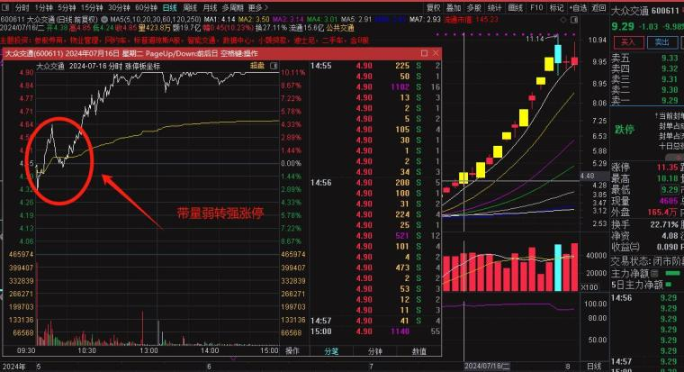  

再给大家举几个例子，稍后我给大家总结一下，这种与第一种弱转强的根本性区别是什么！我们看一下上个月中旬做过的案例，中油资本、银邦股份；  

中油资本10月9号断板，10月10号大阳线反包，虽然没有涨停，但是显示出比较好的承接性；  

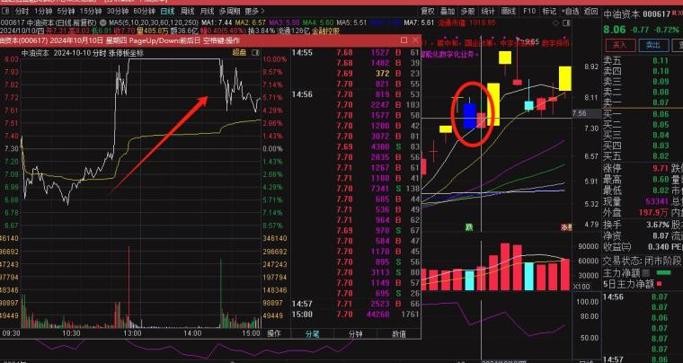  

10月11号中油资本的弱转强，就是断板后弱转强的买点，当天买入最高吃近20点溢价；  

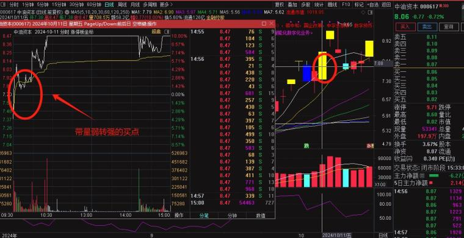  

银邦股份10月11号是断板后的第三天，分时强势承接，并且经过三天的分歧，股价并没有比断板的第一天低，显示出股票承接还是比较强；  

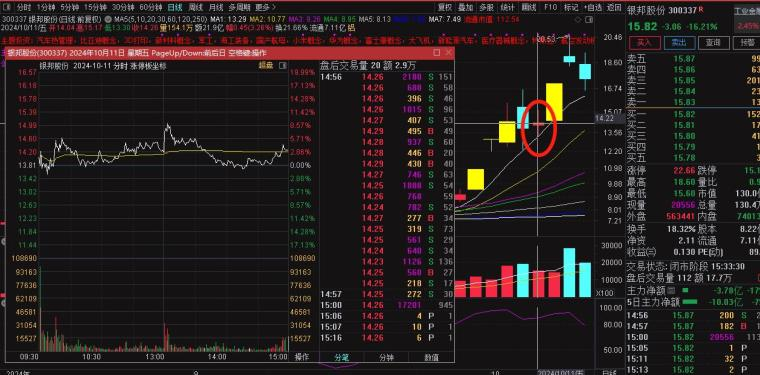  

接下来第二天，银邦股份带量弱转强，就产生弱转强买点，当天买入两天最高吃30多点溢价；  

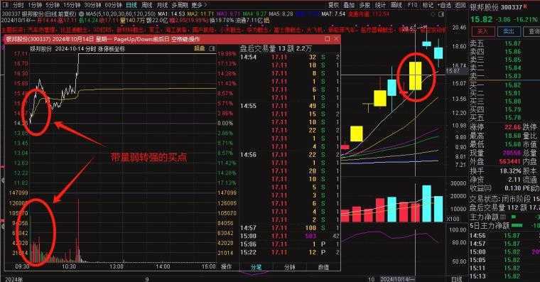  

**大家发现①②两种弱转强的区别了吗？相对于第一种换手板的弱转强，第二种弱转强有什么规律呢**？  

第一种，换手板的弱转强买点，弱转强的那一刻是缩量，因为换手板的那天已经完成充分换手了，转强必须体现在锁住筹码缩量晋级；  

第二种，断板弱转强的买点，断板后需要1-3天消化抛盘，在真正实现强势承接后才能弱转强，也就是弱转强的前一天正常是阳线，弱转强的当天必须是带量才能产生买点；  

好了，关于买点就讲这么多，大家下来好好研究吧！  

### 2.卖点篇  

股票的卖点其实是反人性的，因为大部分人都是一涨就卖，越涨越恐慌，一跌就想抄底，越跌越兴奋，所以我们要反人性，要具备永不止盈、立即止损的卖出理念，当然永不止盈不是赚了钱不让你走，是指一只龙头股票上涨没结束，就不要着急止盈；立即止损，是指出现亏损证明这笔交易是错误的，应当机立断选择卖出；  

如果你是用套利思维买入一只股票，第二天当股票走势不及预期后，就应当立即卖出，即使后边股票又涨了一节，你之前的卖出动作也是对的，因为没有人能卖到最高点，千万不要觉得少赚了钱而后悔，那如果没卖出亏了呢？你还会后悔吗？  

一般套利模式，只赚当日涨幅和第二天溢价，如果第二天高开，并且继续超预期可以多拿拿；如果第二天低开，并且前一天没吃到溢价，尽量少格局，最多开盘看一下，如果依然不及预期，应当立即卖出；  

如果你是接力的股票是一只龙头，或者市场最高辨识度，那么就要按照永不止盈的理念拿着，一直拿到加速后再断板、或者不能反包再走；  

## 二、仓位管理  

仓位管理与每个人的认知挂钩，更明确来讲，与每个人对这一笔交易的确定性高低的认知挂钩，如果你认为这笔交易确定性特别高，自然而然你应该上的是大仓位，如果你不敢上仓位，或者上少了，那说明你认为这笔交易的确定性不高，所以也别说看到龙头仓位上少了，上少就是你认知不够，看不到确定性对不对？  

所以交易中，我是这样管理仓位的：  

**1.根据股票定位管理仓位**：  

如果是这是一笔套利性交易，一般上1-3层仓位；如果这是一笔接力龙头的交易，上4-6层仓位甚至更高，因为龙头意味着更高的确定性，更高的溢价空间，仓位要敢于上；  

**2.根据情绪环境管理仓位**：  

如果是退潮期或者混沌期，一般1-3层仓位，甚至空仓；如果是主升期，一般4-8层甚至满仓；  

综合以上两种条件，在自己的交易认知内管理仓位，小仓位规避情绪退潮期或者杂毛股票的不确定性，大仓位提升在主升期、龙头股上的进攻力，这样才能让交易曲线稳定攀升！  

最后想跟大家说的是，无论是买点和仓位管理，多聚焦主线做龙头，少做或不做套利与杂毛！  
