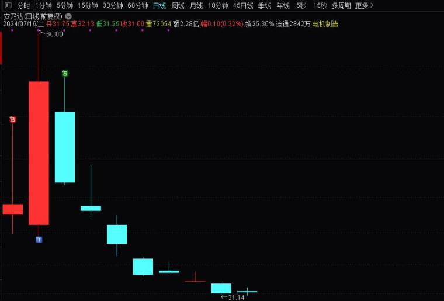
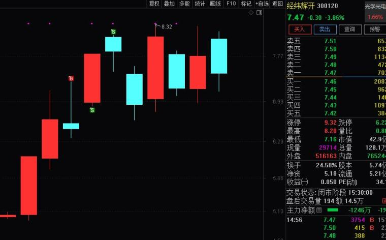
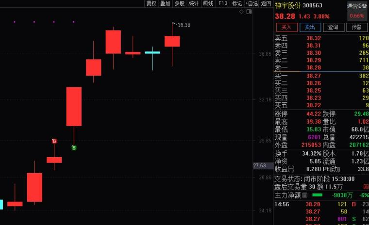
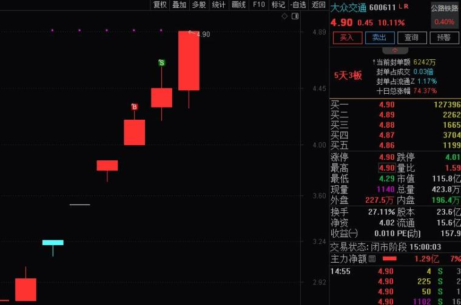

## 超短选手实现稳定复利的实战秘诀  

（2024年07月16日 此战名天下 淘股吧热点专题）  

想要顺利完成十倍，除了掌握正确的交易模式外，还有更重要的一点，就是要做到稳定复利，简而言之，就是进攻的同时能有效的控制回撤，做到交易曲线稳步增长！  

如何聚焦核心、龙头模式以后再讲，我们先解决交易的稳定性，进而稳定复利！  

大部分股民做交易，把选股看得太重，而忽视了交易中的稳定性，粗浅的认为炒股赚钱的秘诀就是选到好股票，每天都能享受到涨停板带来的荷尔蒙，而实际交易中执行下来，非但没做到大起，却活生生的变成了小赚大亏，所以交易的稳定性极其重要，这些年见过太多大起大落的选手了，到头来空空如也！  

今天写点干货，从实战的角度，讲一下如何做到稳定复利？  

首先必须知道，我们是围绕什么做交易？本质上是围绕确定性做交易，如果没有确定性的操作，就好比赌博摇色子，是输是赢内心是没底气的，所以我们必须追求确定性！超短选手都知道要追求确定性，不过说起来容易，做起来难！就好比龙头选手都知道龙空龙，但是没龙头的时候，能管住手的有几个人？也不用怪自己，其实这是人性，但是我们可以把确定性进行相对的量化，围绕确定性的大小，用科学的方式规范自己仓位，实现交易稳定！  

我们分别从市场环境、股票的地位上，管理操作的确定性：  

**一、市场环境：我们可以把市场环境大致分为三类：恶劣期、轮动期、主线期，操作的确定性排序就是主线期＞轮动期＞恶劣期；**  

**1、恶劣期**，仓位控制在0-1层仓，这个时期尽量空仓，如果想玩就用1层仓玩，因为这个时期确定性极低，千万不要心存侥幸能选到牛股！  

**2、轮动期**，这段时间有一部分股票是有赚钱效应，但是题材轮动比较快，大家都不知道哪个题材是最核心的，这个时期仓位控制在0-3层仓，也就是说买任何票总体都不要超过3层仓，降低买错后回撤的幅度！  

**3、主线期**，这段时间市场的赚钱效应比较高，我们就要好好利用这段时间提升自己的进攻，总体仓位可以打到5-10层，我们要记住，这段时间一定要推仓位，否则你的交易就没有进攻力了，好比牛市的时候你不敢交易了。  

**二、股票地位：我们把股票的地位分为三类：龙头、核心、套利，操作的确定性排序肯定就是龙头＞核心＞套利；**  

**1、龙头**，买龙头仓位尽量推到5-7层，必要的时候满仓，很多人龙头不敢上，却猛干杂毛，或者买龙头只用1层仓，买套利经常满仓怼，这从概率上讲是不科学的，所以一定要给龙头推仓位，因为本质上来说龙头的确定性最高，进攻力最强，能给你账户曲线带来极大的攀升，所以珍惜龙头的交易机会；当然这里一定是你的龙头模式非常正确，不要买错票！  

**2、核心**，只要有主线、甚至轮动的市场，都是有核心的，确定性上来讲，核心票肯定是不如龙头的，所以买核心，单个票尽量不要超过3-5层仓位，适当分仓来分散回撤！  

**3、套利**，主线走到一定阶段，会发酵一些后排补涨，但是这些票本身没地位，但有朋友管不住手，仓位最好不要超过1-2层，千万不要认为对不起一个20CM首板补涨，就想去重仓或者是满仓，这种极端的买法非常容易导致大幅回撤；  

综上所述，我们根据市场的环境与股票的地位，在对应的时期与对应的票上，采用科学的仓位配比，就非常容易做到交易的稳定性，进而实现稳定复利！（每个人也可以根据自己的风险承受能力，适当的调整比例，不局限）  

**三、结合实战案例来看：**  

1、比如7月初做的C安乃达，当时所处的环境就是恶劣期，这个时期买票真的没有确定性，很容易买错出现回撤，正常来说是要空仓的，但是看到自己懂的交易机会，实在管不住手，就给1层仓位吧！  
  

2、比如后面我们做的经纬辉开、神宇股份，这几个票所处的市场环境，就是题材轮动期，这段时间消费电子、PCB、高速铜缆连接都在轮动，有一定的赚钱效应，这些票就都是核心，仓位上每个票可以给3-5层做！  
  

  

3、最近做的大众交通，这只票我们就定义为龙头，并且是有无人网约车主线的阶段，这个票就要推仓至少5-7层，必要的时候更高，当时我直接推到近8层仓位，只有这样才能实现进攻幅度，因为科学上讲龙头的确定性就是最高的呀！
  

以上真的很管用，不仅解决了你管理仓位的迷茫，而且能使你心中有数，管住手克服人性，再也不用担心大起大落！  
