## 从量价角度管理龙头预期，精准狙击买点  

（2024年10月13日 此战名天下 淘股吧热点专题）

### 前言  

股票交易没有捷径，从来不是一招鲜，就能吃遍天的！所以做为过来人，我认为在市场上想持续拿到结果，必须全方位系统性的了解透彻，如果只是片面的了解一些局部，根本不可能长期赚钱的。就像科比老师讲的，真正的悟道绝对不是仅仅限制于某种手法的操作，这只是一种初级玩家的阶段，而真正的晋级是买入即是赚钱的点，做到大道无形。  

**为什么我要写以上一段内容呢？因为今天讲量价关系，可能很多朋友会觉得这个话题不性感**！大家都一般都喜欢听龙头战法、怎么选股、怎么竞价发现牛逼的股、如何一买就涨停、情绪周期、卡位补涨等等等，其实无非就是想快速掌握一种能赚钱的短线秘籍，这么急于求成根本不现实！  

你想想，刚刚学习力学，怎么能研究导弹呢？对吧？张三丰也是各路功夫融会贯通后，才创立太极。成功的交易者必须先集大成，然后才能大道至简！多的话就不说了，我们开启正篇！  

### 1.关于量价  

很多人喜欢谈主力意图，比如主力锁仓了，主力全跑了，主力洗盘呢。其实主力在大方向的意图，就体现在量价上，因为主力用真金白银交易形成的量价关系是不会欺骗人的。如果投资者不能理解量价关系，即使学了更多的技术分析方法，也没有意义。  

量价关系也不能死板理解，比如放量好还是缩量好？放量上涨好还是缩量上涨好？因为这不是单一的铁律，每个阶段的放量都是有不同含义的，同样每一阶段的放量上涨好坏也不一样，我们要通过量价揣测主力真正的意图是什么？从而形成对它的预期管理。  

### 2.如何分析量价  

**首先明确一点，放量意味着分歧，缩量意味着一致或者分歧小，基于这一个定量，我们来研究量价背后的主力意图**。  

比如一个股票历史放量涨停这说明什么？说明资金在这里产生大分歧，大量的人押注它涨而买入，也有大量的人押注它跌而卖出，但最终当天看好它的人赢了。  

放量涨停后，还能不能继续涨？是不是大拐点？其实第一次放量涨停只是初步动摇后的结果，大家的意志并不能说是非常统一，如果非常统一那应该是缩量涨停对吧，所以要看后面的几天量价关系是什么样的？  

同理缩量说明分歧很小，缩量跌停说明大家一致看跌，很少人主动看涨去买了，这是一个糟糕的信号。  

**①高位的量价**  

龙头选手主要聚焦在高位的博弈，高位更是需要通过量价揣测主力意图，今天主要讲高位的量价反应的主力意图。  

比如常山北明，9月24号爆出巨量大跌，但是巧妙的一点就是没有跌停，这里看好的人和不看好的人都很多，最后不看好的人勉强战胜了看好的人，当然不看好的人也非常吃力，并没有彻底打服看好的人，因为没有跌停，那么第二天9月25号就存在预期差，结果第二天反包涨停，这个量还是相对缩小的，说明了什么？  

前一天空头用那么多子弹也没打到跌停，第二天多头用更少的子弹就打到涨停，这里显然不太能形成一致性的下跌，而形成一致性上涨也比较困难，但是上涨的意愿略微大于下跌的意愿，多空势力需要在这里厮杀一下，决出一致性的观点。  
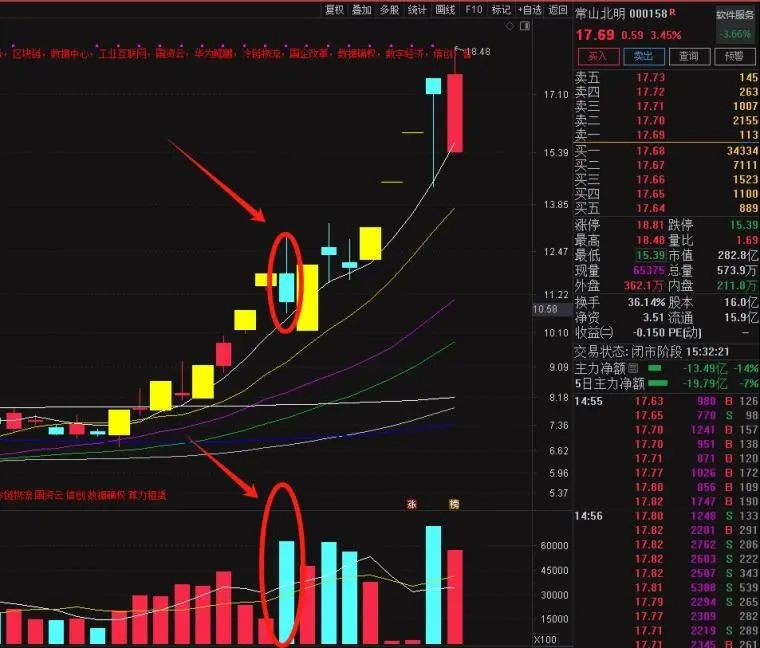  

所以我们看到26号、27号多空对决非常激烈，巨量成交形成震荡，并且这个震荡的均价是高于9月25号涨停价的，这就更加充分证明了主力上涨的意愿略微大于下跌的意愿，多头更胜一筹。  
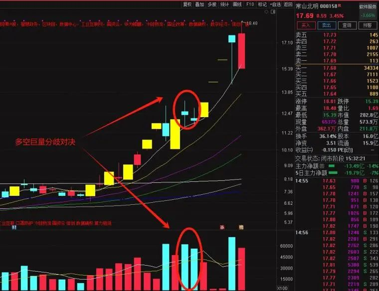  

于是也就出现了9月28号缩量涨停的一面，而且这个缩量比9月25号的量更低了，上涨就形成一致，9月28号就是一次分歧转一致的确定性买点。  
  
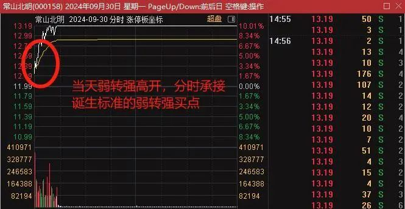  

同样的案例，我们看金龙汽车，7月17号爆出巨量，但是收了假阴线，说明多头略强，后面需要多空对决进行判断一致性方向。18号-19号多空爆量对决多头更胜一筹，之后22号分歧转一致缩量涨停，当天形成弱转强的买点。  
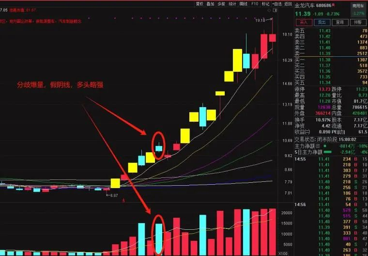  
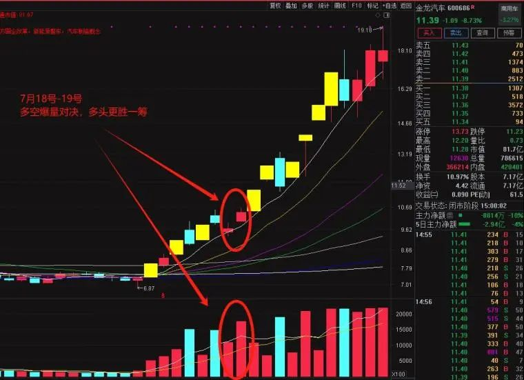  
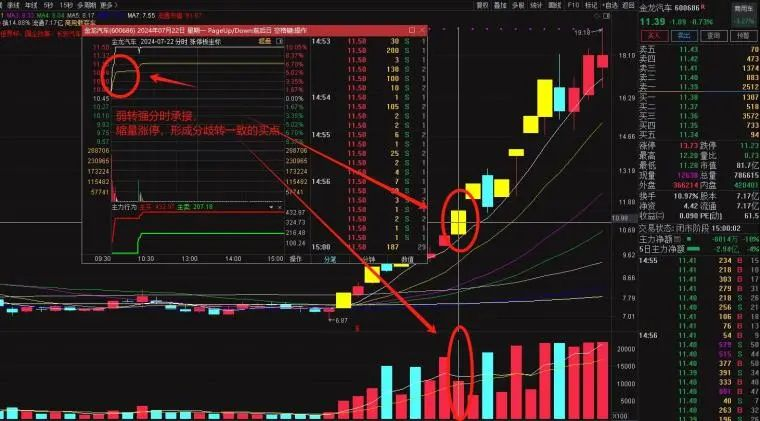  

再比如我们周五买的中油资本，这个买点同样用到了量价关系，不过与上面两个略有区别，因为中油资本10月9号并没有爆量而是略微缩量的跌停，但是10月10号爆出分歧，最终多头战胜空头收了中阳线，这里仍然是分歧判定，因为这一天打了比9号更多的子弹也就是成交量，却收复不了9号的价格高点，说明接下来还是需要多空对决，让更多的人来判定是做多意图强，还是做空意图强。  
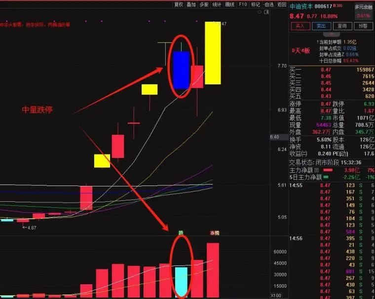  

10月11号周五，中油资本多空对决，竞价率先分歧后爆量8000多万抢筹，开盘再次抢筹突破8号的价格高点，说明开盘后的分歧中更多的人判定给了涨，此后如果分时高点没有形成更爆量的下跌，或者缩量回调中跌破不了零轴，形不成有效的一致下跌；容易形成一致看多的加速，中油资本缩量回调不破零轴，分歧转一致，随后拉升涨停。  
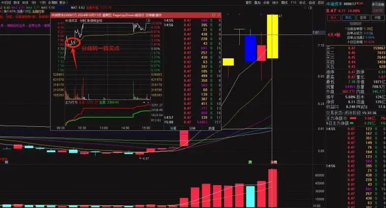  

中油资本与常山北明、金龙汽车买点的区别，主要体现在，中油资本是盘中弱转强的买点，常山北明、金龙汽车是开盘弱转强的买点。  

**②底部的量价**  

底部放量涨停后，怎么看接下来的量价关系？一般而言，底部放量涨停是好事情，因为底部出现大分歧，表明经过长期下跌阶段，人们对它的观念出现动摇了，这个大分歧后的结果是上涨，说明动摇后的结果多数人判给了涨。  

如果第二天是缩量涨停，说明经过前一天大量的多空博弈，大家形成了比较一致的观点，押注跌而卖出的量更少了，大部分倒向涨；  
如果第二天是放量涨停，说明仍然有比较大的分歧，依然最后的结果更多的量判给了涨；  

那么到底这一阶段是缩量涨停好，还是放量涨停好，其实我们可以把大概把2板-5板左右定义为股票主升的前期阶段，前期阶段缩量涨停与放量涨停各有优劣。  

如果2-5板期间是缩量涨停形式，那么说明主力对该股票主升信心坚定，出奇一致的判定它涨，说明比较强势，大部分龙头前期都是这样子，但这种不好的一点是这期间很难接力，因为大家对它的态度很坚定，一致认为它涨，你去接力它后，如果很快出现放量的分歧，是不是会180度大调弯呢？  

毕竟这一阶段很强的有10个，龙头只有1个，你无法保证这里能接到龙头；比如中通客车放量后，前期连续缩量涨停的，这就说明非常强势，但是接力点一定是高位爆量后，看主力意图；  
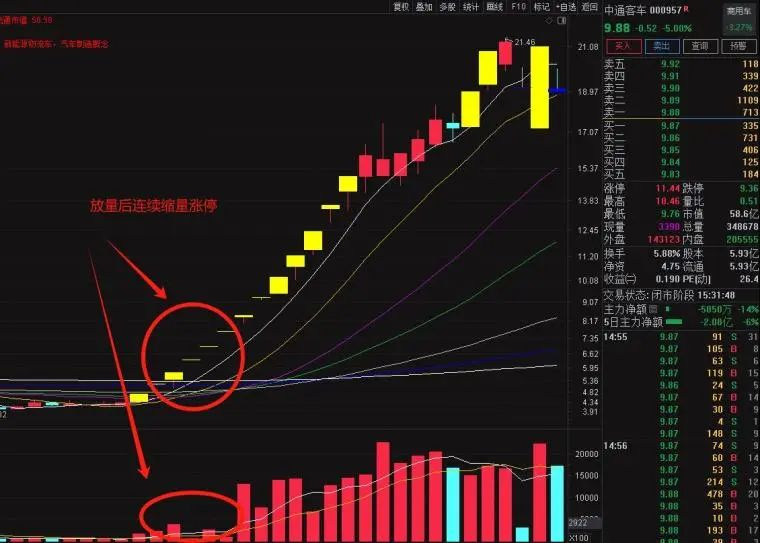  

如果2-5板期间是不断放量涨停的形式，说明每天有分歧，每天越来越多的量进行PK，结果都是判定涨；这种好的地方是分歧判定涨的天数多了，人们接下来可能从怀疑态度变成坚信，最后形成一致性也就是加速上涨，这样能产生接力点，也容易走的远；  

不好的一点就是这种票如果一直存在分歧，如果没有深度逻辑就容易半中间衰竭，大家没信心继续打空头了，打不完啊；  

比如大众交通、清源股份就是典型连续放量上涨的龙头；  
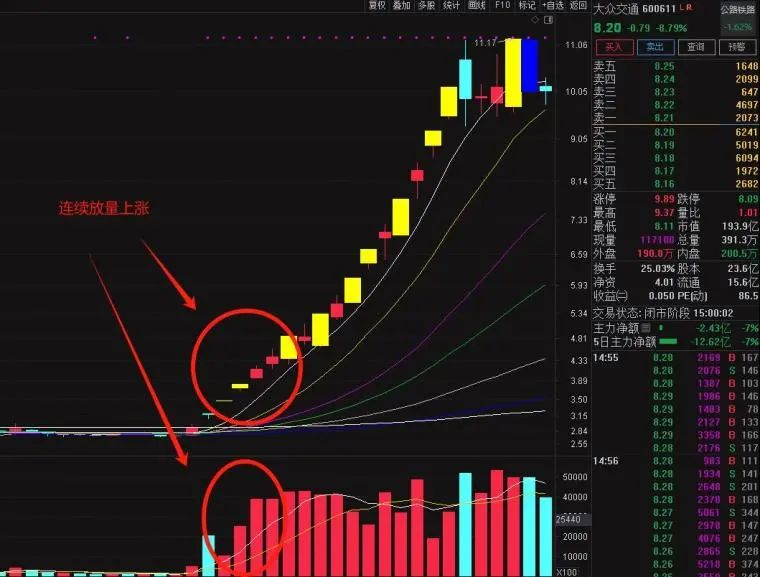  
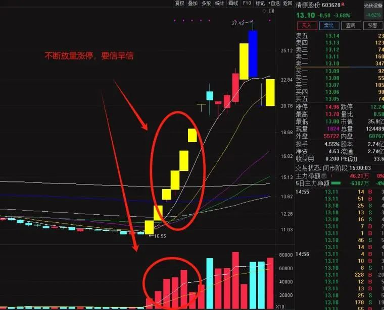  

所以总结下来，如果前期不断缩量涨停，说明票非常强势，但买点在高爆量后的判定，如果判定是龙头，就诞生买点；而如果前期不断放量涨停，就要当下找买点上车，因为后边可能连续分歧死，也可能一致加速，要信早信。  
