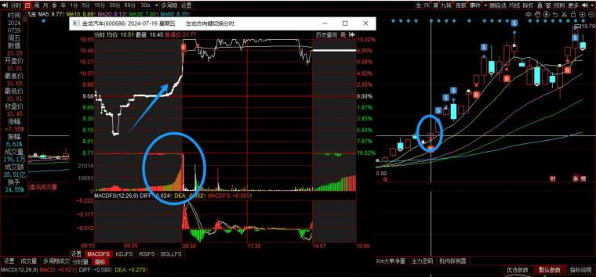
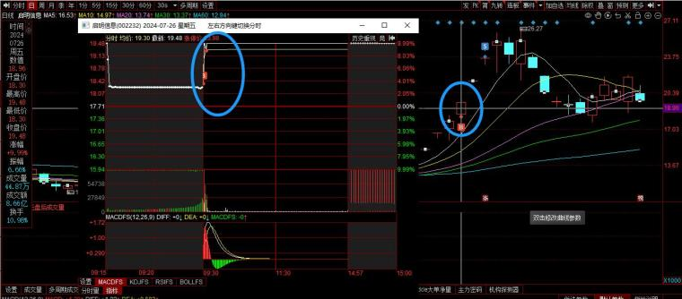
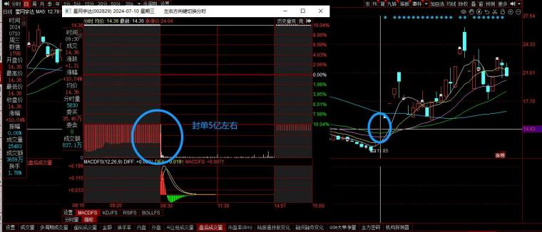
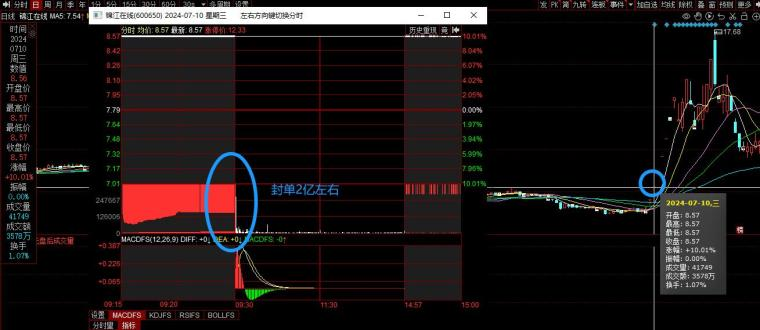
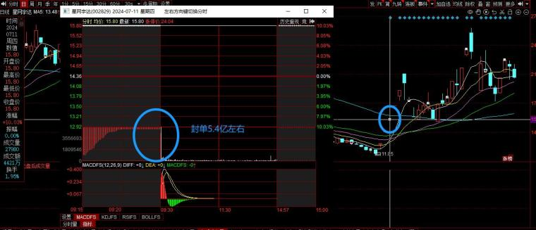
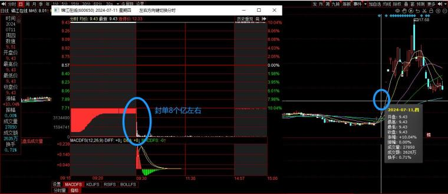
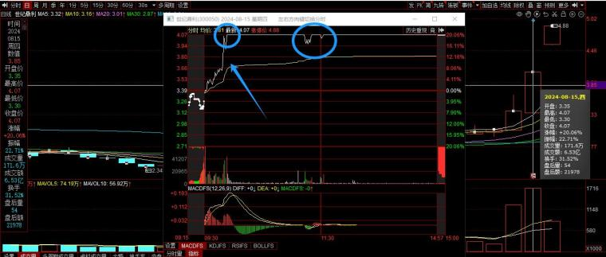
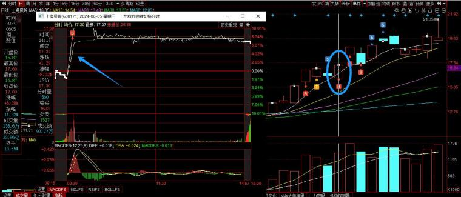

## 龙头弱转强体系  

（2024年08月18日 此战名天下 淘股吧热点专题）  

弱转强是股票进入上升趋势的重要信号，能够敏捷的发现弱转强信号，是所有短线高手必备的技能，股票从弱势转为强势的那一刻，它通常就是这只标的最佳的买点。这篇文章通过系统性讲解弱转强体系，让大家简单高效的把握牛股的确定性买点，从此妈妈再也不担心我买不到牛股了，哈哈哈哈！  

### 1.弱转强的底层逻辑  

大部分股民都知道，弱转强是短线的精髓，但并没真正理解弱转强的底层逻辑！  

**如何理解弱转强呢？**  

弱代表分歧，部分人看空了，进行了卖出动作，由此就产生比较大的筹码交换；而强代表一致，大部分人看涨，导致场外抢筹，但是场内惜筹，因此上涨的时候表现在成交缩量；所以弱转强实际上就是筹码交换后再次进行加速，说明分歧转一致、空转多。  

**为什么弱转强是确定性的买点？**  

我们把情绪转变分成四种：弱转弱、强转弱、弱转强、强转更强，前两种代表亏钱，后两种代表赚钱。  

但是强转更强有两个缺点，一方面在强的状态下买，你的买点不会低；另一方面我们无法预测情绪能极致到什么程度，假如你买在最强的那个地方，当天如果发生强转弱，你就会产生巨大亏损。  

而弱转强代表传花击鼓的游戏有了新的接棒人，代表着超预期，那么情绪将重新再跑一轮，既然有新的接棒人带队，我们只需要选择跟随即可，这就是所谓的买在分歧转一致，形成了短线最确定性的买点。  

所以弱转强是买点，强更强更适合持仓。  

### 2.股票弱转强的信号  

**竞价弱转强**  

集合竞价过程中，出现大单抢筹且价格持续抬高，出现量价齐升的弱转强盘口，说明这只股票有主力参与，有可能当天走强甚至涨停。  

例如金龙汽车，7月17号-18号断板调整，7月19日的竞价出现大单抢筹盘口，当天就是非常典型的竞价弱转强信号，并且后续几天走出主升行情。  
  

**盘中分时弱转强**  

开盘后该弱不弱，没有单边下跌，反而放量拉升，同时大部分时间股价都处于分时均线上方，即使跌破均线，也被资金迅速承接拉回均线以上。  

例如启明信息，7月25号断板变弱，7月26号并没有延续弱势，直接高开2个多点，开盘后分时迅速拉升，这就是典型的分时弱转强；  
  

**同一题材中股票之间的弱转强**  

比如无人驾驶题材的星网宇达与锦江在线，前几个板星网宇达的封单更多，所以星网宇达更强，但是后边几天锦江在线的一字封单更多了，无人驾驶的情绪的锚定点变成锦江了，锦江在线就完成个股地位的弱转强，这也是我们所说的卡位，体现在一个题材同身位的两个票PK，之前更弱的票PK掉对手，完成个股地位的弱转强。

7月10日，星网宇达二板竞价结束后，有5个亿左右的封单，同身位的锦江在线只有不到2个亿；
  

  

但是7月11号，第三个板的时候，星网宇达封单5.4亿，锦江在线封单达到8个亿以上，锦江在线卡位星网宇达，锦江在线股票地位出现弱转强，最终比星网宇达多走出两个板的高度；  
  

  

当然同身位股票的弱转强，不只适用于竞价阶段，分时阶段也会出现弱转强的PK，大家灵活运用。  

### 3.如何使用弱转强战法  

弱转强战法，本身就是利用预期差做文章，其实这种弱并不是真正的弱，而是一种假弱，所以我们选的股票一定不能是真正弱的股票。比如非主线、后排票都是走弱就基本结束了，能通过弱转强走出来的只有核心中的核心，因此还是要聚焦龙头做弱转强，胜率才会更高。  

聚焦核心票的换手板，利用第二天弱转强机会上车  

换手涨停板，就是强中带弱的体现，有质量的换手板，第二天就非常可能出现弱转强机会，什么样的换手板有质量，之前的文章分享过，就不再过多解释了。  

例如8月15号，世纪鼎利是一个非常好的换手板，要注意这种假弱的板，8月16号弱转强就是一个上车机会。  
  

**聚焦容量中军的烂板或断板，利用第二天弱转强机会上车**  

几乎所有题材的中军，都完美诠释了弱转强，因为这种有容量的票不可能是单一的主控资金，上升途中一直连板不太现实，中间会上演很多次换手板、断板反包，所以我们要注意第二天弱转强的机会。  

例如之前半导体的中军上海贝岭，6月4号断板，6月5号弱转强就是一个上车机会，后边走出了不错的幅度；  
  

时间有限，更多大家想听的干货以后再分享！  
