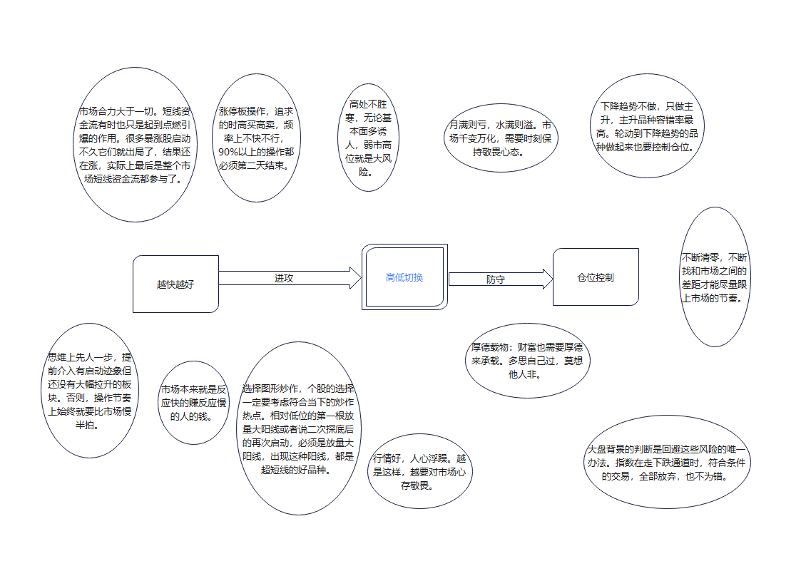

**游资进阶版**  

## 涨停板强弱  

连板 > 反包板  

一字+一字 > 换手板+一字 > 换手板+换手板  

一字板 > T板 > 自然板  

一个板块真的强势，不可能半日强，而是要有更多的涨停发酵，俗称踏空资金挖掘才是强势的体现。  
一个板块上午十几个涨停，尾盘最后15分钟开始涨停砸开破板，这是弱的体现。  

**低吸**  --赚-->  **追涨**  --赚-->  **打板**  --赚-->  **接力**  

## 逼空是什么？  

逼空是高潮的一种，  
1、出现在中末期，赚钱效应逐渐积累，最后爆发。  
2、通常位置偏高，胆子小的人天生就不敢上。  
3、出现持续发酵的核心人气品种，继续超预期。  
4、有时候板块起来偏向于龙头带领，这种情况比较弱，通常需要指数和市场情绪的配合，不稳定。有时候偏向于板块自身主动性攻击，这种比较强，如果还有龙头带领的话，基本无视指数和市场情绪，能独立走。  
5、市场永远是对的，资金就像水一样流向最小阻力的方向，关键还是要对这个市场理解的透彻。  

## 风险提示  

1、跳空低开通常是主力不顾一切逃命的标志。  
2、分时均线是生命线，线上是生，线下是死。  
3、大盘黄白线不正常时，只卖不买。  
4、控制仓位，不要重仓，分仓操作，坚决反对全仓一票！  

**如何寻找确定性？**  

确定性（效率）好行情不打板，错失机会；烂行情不打板，太容易犯错；鸡肋行情本身没有做的必要，浪费精力。当然有的确定性追高等同于打板。  

**为什么一定要打板？**  

一是打板，二是做核心（预判点，走强点，打的板要么有位置，要么有人气股性）。  

**为什么一定要做核心？**  

和打板一样，确定性（效率）问题。个股而言，市场地位最重要。  

## 操作成功率  

低吸  --->  理性思考  
追涨  --->  瞬间的反应和直觉  

长时间比较，低吸收益 > 追涨收益  

卖出风险   买入机会  

预判  --  跟随  --  纠错  

短期交易  

不讲价值  不讲技术    **只讲故事**  

**龙头作手：**  

股市就是江湖！  
找到有江湖地位的股票，  
做有江湖地位的股票，  
你就是赢家。  
只看市场地位  

真正的龙头！  
在走主升浪的时候，  
任何价位都是买点，  
只要你相信今天会涨停，  
你在任何价位买入都是正确的。  

选股，必须新题材龙头。但是买卖点，要注意节奏。亏钱都是没有坚持自己的模式。  

市场差不怕，成交额少也不怕，就怕题材多。题材多势必切换快。  

远离  **杂毛**  **垃圾**  **非主流**  

低吸点要企稳，不能买在半山腰，要有人后面愿意  **点火**  **拉升**  **打板**  

## 破解交易中恐惧的方法  

1、开仓恐惧，不敢开仓。  
为什么会恐惧？  
是因为没有底气，对未来行情的不确定。  

制定交易计划，按照交易计划执行，让交易不再迷路。  

2、持仓恐惧，行情回调恐惧。  
经常是回调就平仓，因此错过大行情。  

优化自己的交易系统，好的交易系统，成功率越高的交易系统越容易执行。  

1、二板定龙头，一板能看出来个毛。  
2、如果一定要捏造技术的话，就是看“人气”，一口气上不来就要去见马克思。  
3、人生难得几回搏，热点来了全力以赴，热点退潮果断卖出。  
4、交易一定要纯粹。做加法容易，做减法难。  
5、从资金面讲，没有新题材，老热点就继续。
6、有故事，有大量资金活跃的票，就有肉吃，吃完撤退，慢的买单。  
7、每个热点，高潮过后的消退期，都会留一个活口。  
8、市场差不怕，成交额少也不怕，就怕题材多。题材多势必切换快。  

## 客观评估自己能力  

熊市里保持斗志  
牛市里戒骄戒躁  
不回撤的代价就是永远也无法进步  

## 主线和分歧日的关系  

主线具有强悍的生命力，决不能轻易转移阵地。  
把主线行情做到极致，才是一贯的思路和信条。  
分歧日不做中位股接力。  
分歧日不做跟风和补涨。  
分歧日重点是去弱留强。  

## 超短不适合绝大多数人  

下列条件，缺一不可：  
充裕的时间  
旺盛的精力  
坚强的信念  
过硬的技能  
从容的心态  

## 龙头战法  

积极拥抱新题材   凝聚市场里最敏锐，最犀利的那股资金。  
坚决抛弃旧题材   过气的龙头不如狗。  

弱市忍手不动，强市踩准节奏  
穿越牛熊的人，曲线都不会太差  
交易之道没有捷径，只能练  
招式只是表面，心法才是核心  
高标不一定是龙头，龙头最终会成高标  
套利和龙战的最大区别是溢价高低  
看对三日行情，便富可敌国  
想法越简单越好，交易越纯粹越好  
人气所向，牛股所在  
**紧跟主流买强买龙买溢价，就是买确定**  

龙头战法核心：第一时间发现市场精神领袖，第一时间上并持有；市场发现新的精神领袖，果断切换。  

大龙头都是多点共振到结果，题材派，龙头派，技术派都认同。筹码供不应求，越走越轻。  

不少纯打板战法，过分看重分时板的质量，打的是分时板，而不是日线板。  

选股，必须新题材龙头。但是买卖点，要注意节奏。亏钱都是没有坚持自己的模式。  

没爆量的都不能说是龙头，既然是领袖，必须爆量，接受群众的校验。  

龙头不在盘子大小，而在启动的时机。只要先于大盘连续上涨并能带动关联上涨，就是龙头。  

当顶级龙头选择稳定横盘或高位滞涨，赚钱效应就会向低位的其他品种转移，这是龙头的新陈代谢。  

只做龙头，只做主升，只做惯性。不做反抽，不做波动，屌丝才爱逆袭，坚持龙头主升战法。  

## 20条避免亏欠法则  

炒股的技能懂得越多，失败的概率也就越高  
加入的杠杆比例越大，失败的几率也就越大  
换股的频率越高，亏损的概率就越高  
逢高卖出的次数越多，获得的收益就越大  
股市里杂念越多，亏钱的概率越大  
持股的数量越多，踩雷的概率就越高  
市场大部分人的想法越接近，那结果也越相似  
越相信顶部的好消息，越容易被套牢  
越害怕底部的坏消息，越容易被骗走  
越不懂得独立思考，越容易失败  
底部区域里的筹码买得越多，未来赚得就越多  
坚守的时间越长，赚的概率就越高  
上市公司选择得越优秀，风险系数就越小  
分批买入的次数越多，成本降低的概率就越大  
交易的频率越少，亏损的概率就越少  
相信的消息越少，失败的概率也就越少  
看盘的次数越多，那亏钱的概率就越高  
买卖的间隔越短，失败的概率就越高  
历史的相对估值越来越高，风险就越来越大  
历史的相对估值越来越低，风险就越来越小  

## 低吸策略  

**震荡市的低吸策略**  

尾盘潜伏低吸T+0，首先头一天，快收盘时买好底仓，最后一分钟基本没有价格波动风险，本质上是回避了T+1制度下一半的价格波动风险，第二天可以随时找个高于水平面的点出货，任何时间都可以交易，尾盘低吸潜伏做隔日T+0交易，这才是真正的T+0。  

**主流行情龙头换手二连板低吸策略**  

这个属于雏龙时期，二连板第二天平开，却跌不下去，做好低吸的准备，由于处在题材的发酵期，前期的连板已激活股性，极易被资金直线拉板，演绎弱转强态势，由于换手上来的，不比二板顶一字的，成本基本很接近被垫高到了这个平开的位置，不用担心吃大面。  

**主流行情龙头换手三连板低吸策略**  

主流行情的换手三连板龙头冲击四板炸板回落，或者冲高回落，或者平开，在均线附近调整，分时上涨放量，下跌缩量，横盘无量。做好低吸的准备，由于三板是小题材或者支线行情的顶部，在这个位置会出现分歧，先让一部分人出来，空中加油，你和主力一起在均线附近吸货，等待下午的拉升，即使没有拉升，次日大多可以优雅离场，这样的股票后面要跌也是阴跌下来，亏不了多少，这个属于成龙阶段，倘若能走出来，大概率要往6板冲击。  

**主流行情的龙头换手N连板低吸策略**  

绝对龙头的四连板，五连板及以上的首阴，炸板，抑或是特停出来的大低开，沿着5日线低吸，由于全场人气非常足，深V调整换手充分后空方情绪发泄后极易被点火上板做反包，也是成功率最高的低吸方法之一，本质上是搏龙头的最后一口气，这个属于龙头的衰亡阶段，一般真正的龙头都会有反抽，不会悄无声息的死掉。此外，有的启动慢的或者一字顶上来筹码断层严重的，回落到10日线调整到位依旧有低吸的机会。  

  
