---  
title: 炒股养家心法 珍藏版1  
index: true  
icon: editor  
order: 2  
category:  
  - 炒股养家心法  
  - 大A  
tag:  
  - 收费文档  
---  

## 前言

我一直把自己定义成散户，元奈江湖上依然有关于我的各种案例和心法，心法大致还是按照我的思路的，我个人觉得这也是最具价值的东西，比告诉你我明天要买什么更有价值，因为心法领悟的祺衍操作便会事半功倍。或许你们都有听说我从十几万做到几个亿， 但是很少有人知道我也一度损失惨重，每天花18小时的学习。经历了而立、不惑之后，对市场看的比较淡了，但是总觉得该做点比操作更有意义的事情。受几位朋友怂恿，把自己的历程以及观点做简要分享，供有缘者读之。  

炒股养家

## 《养家心法》  

情绪分周期  

交易分阶梯  

每一次休息就应该是一次总结，一次剖析，一次进步，一次取舍，一次扬弃  

每一个周期的成功交易，需要及时的总结、固化  
同样一个失败的周期，也该有客观的态度  
经常看到有人说，一直亏，一直停不下来，一直不甘心  

没有等待何来机会?  
没有放弃何来得到?  

炒股需要学习，学习不是从各种文章中找代码，而是学术、学道、最终以道驭术。  

道可以是大局观，情绪判断，交易心法  

术可以很具体，细化到每一个买点判断，仓位分布，每一个买卖动作  

但是，除了学习  
炒股，更需要冷静  
很多路需要靠自己走，很多压力需要自己承受  
很多折磨需要自己挺过去，很多伤痛需要自己缝合  
或许有人能理解你的彷徨，但别人代替不了你的成长  
过来人能对你的处境感同身受，但无法帮你分担  

痛苦的经历并不可怕，可怕的是你真的被他打败了  
或者被他打的找不到方向，失了自己的节奏  
或者全是悲观失望的情绪  

一边是不服输的疯狂交易，一边是悲观的情绪蔓延  
而这种悲观的情绪会把你进一步带向深渊  

炒股需要自我进化，自我成长  
如果你觉得节奏不对，不妨停下脚步  
回溯自己的每一笔交易，反思自己每一个操作  

重新揭开伤疤，或许很痛  
但也同样会让你更加刻骨够心  
每一个市场的参与者  
都在市场中踽踽独行  

因盈利而开心，因亏损而先落，因连续的亏损而心力交瘁  

在市场，交易一日，彷徨一日，纠络一日，希望一日，恐惧一日  

谁不曾有一段败家的历史  
谁又不曾在恐惧和希望中轮回  

不同的是，有的人走出来了  
有的人，永远的被打败了  
吃点亏，支点学费不算什么  
找到自己的路  
坚定自己的信念，勇敢的走下去  

信念是什么?  
是顽强的意志?必胜的信心?神来之笔?  

都不是  
基本靠硬撑  
这里的硬撑，不是说更频繁的交易  
而是不论涨跌，不论心痛，坚持功课，坚持复盘  
坚持做体系内的操作，哪怕体系束缚了你的手脚  

为何硬撑?  
半夜看看沉睡的家人，想想由夭输掉的Money  
自然就有了含泪坚持，和血吞牙的勇气  
一个周期的结束，意味着一个新周期即将开始  

从现在做起，从每一天做起，锻炼自己的思维，坚持自己的体系  

从做每一笔“正确”的交易开始  
种一棵树，最佳时机是在20年年前，如果没有，最好的时机就是现在  

## 我的经历  

年少无知的轻狂，就是为了暴富而来，一月没有20% 收益绝对不合格，所以仓促出手，赶上好行情，信心膨胀，感觉良好。  

当年的我，觉得自己悟过了，辞去工作，遇上熊市，还接了朋友的账户操作，结果是亏成狗，最后那位朋友也觉得我是个骗子。那是一段和血吞牙的日子，其中的境地许多人都知道，关于奶粉，关于学习。  

之后，经历市场的打击，倍感交瘁，面对账户的亏损，面对几
不敢下手，也无出路。

**坚定信心，踏实向前**，有前辈点拨或有高人指点，沉心静气，脚踏实地，看透浮夸，慢慢走上正轨，学会控仓，学会空仓，学会冷静，学会建立体系。  

想来，大多数人都要走这一条路，好学的人很多，但是学成的是少数，主要还是看个人的心性，如果经历过行情的惨烈，现在依然在用配资搏杀，那注定不适合这个市场。  

**所谓悟道，无不是感叹，山还是山，水还是水，所谓经历和洗礼，也不过是帮助找回最开始的自己，阅尽千帆，洗尽铅华，最终找回自己的初心而已。**  

初心是什么，留给每个人自己思考!  

## 心法1  

**善于做短线的人，应该清楚自身的特点，寻找出适合自己的方法。股票是一个心理游戏，我们的操作应该尽量让自己避免被动。有这种舒服的感觉就对了，好的策略就应该不管行情怎么变化，让自己始终在应变中处于优势，这也是实现稳定赢利的前提!**  

对于个股，不应拘泥于自己手中所持品种，而应最大限度的观察各板块走势，要对各个周期的领涨和领跌品种进行重点关注。  

对于操作，不要一味的追求个别技术指标，或者短期的所谓资金流进流出，主力庄家这些。  

针对不同阶段有不同阶段的操作模式，高抛低吸也对，追涨杀
跌也好，都有其道理，关键取决于对市场的理解。  

每个人都应该有自己的交易风格，而不是赚钱了就是短线，套了就成了股东，没有自己风格的人，很难在市场里长期生存，因为情绪会被市场说带走就带走，如果你的情绪被市场掌握，失败将挥之不去。  

所以静下心来，问问自己的性格适合超短、短线、中长线还是长线!针对不同的交易风格，制定不同的作战**交易体系**!没有形成自己交易体系的人，最终在市场会输多赢少，结果都不是太好!  

所以在你没有形成体系之前，不做有压力的资金，不要融资与杠杆参与操作， 尽量的保住自己的本金!  

## 交易体系  

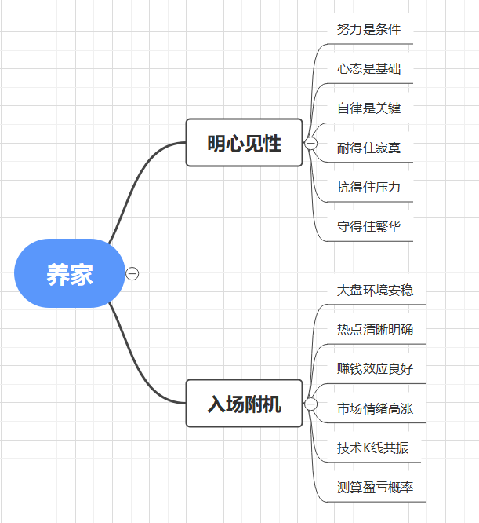  
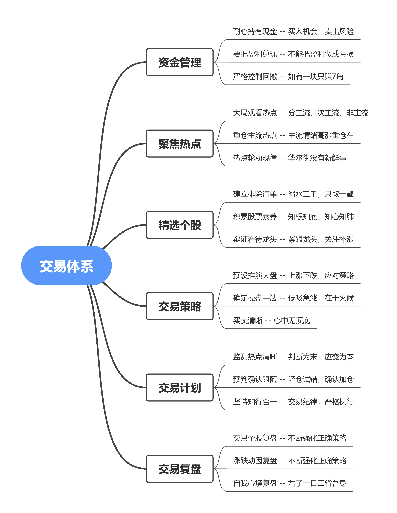  

如果你严格的按交易体系来进行操作，那么你成功的概率会不断增加!  

### 心法2  

**买入倾向的推理，大多来自赚钱效应，卖出倾向的推理，大多来自亏钱效应。然后再结合大盘，主流热点这些，进行瞬间的操作判断，操作是瞬间的，判断是动态的。**  

关于盈利，我向来不想太多。是赢是亏有时候不重要，重要的是做对，盈亏的事情交给概率。  

**追涨也好，低吸也好，问题不在模式、而在何种阶段应用，以及火候。**  

**有人知道追涨不适合自己，但是往往管不住手，有人知道重仓不好，无奈赌性太重，知道的和做到的差太多了**，所以，知行合一四个字足够很多人修行几年的了。做不到，你的情绪就容易被市场左右，一旦被市场左右，失败将挥之不去。如果你能掌握市场的情绪，胜利将接踵而来!  
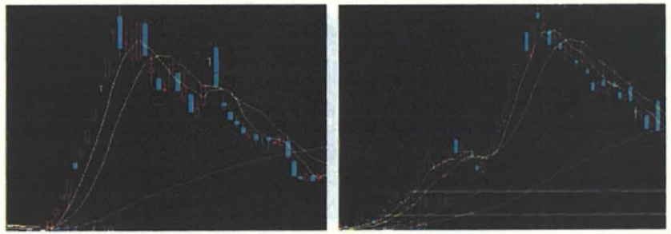  

### 心法3  

**知行合一，说起来容易，做起来难，这也是为什么心法一定要由实战来检验，经历过你才会有关深的领悟。**  

**溺水三千只取一瓢，能赚1块的，只赚7毛，留下3毛济世。**没错，有人觉得这是自我安慰，但是真正领悟了，也是你对这个市场的认知和感息。你想把市场当取款机，但是你又满身戾气，如何成器?  

越是大家扎堆去的地方，越是要小心谨慎。毕竞市场上赚钱的不是大多数，而是小部分，所以，这么想你就明白为什么有时候需要反向思考了，要区分是**大主流还是次主流**了，**格局与素养**都很重要!  
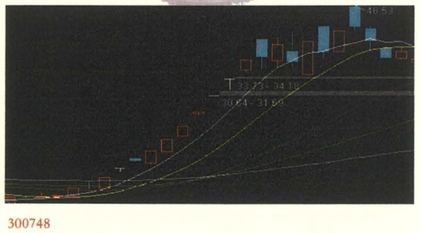  
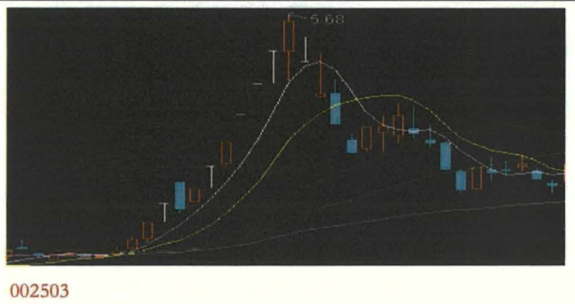  
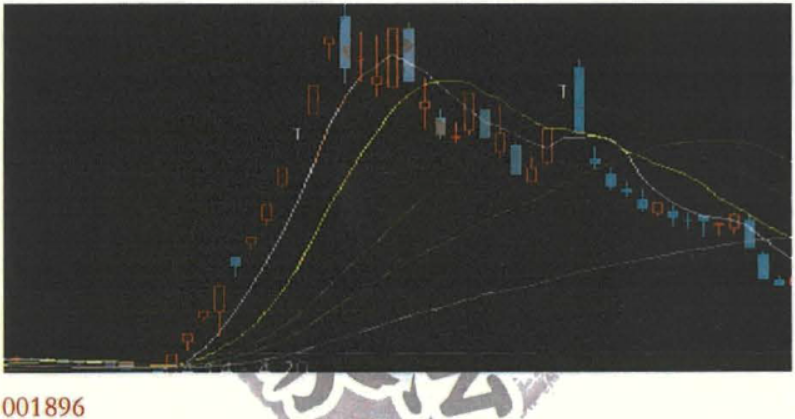  
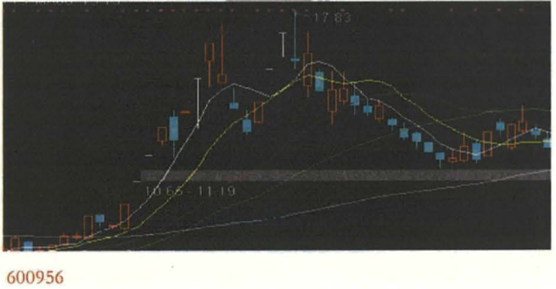  
以上图，找到共性，用心悟!  

### 心法4

**定好仓位，耐心选股，做对的操作，盈亏的事情交给概率。做了功课，不代表立马出手，耐心等待市场点火的机会!**  

对于大盘，不要过多依赖于预测什么点数顶底这些，而应多关注哪些在涨，哪些在跌，那些先前涨的或者跌的后来又怎么走了。如果判断是熊市又另当别论。  

我们得清楚此前一波走势中，**各家的涨幅**，成交量对比，换手率情况，有曾参与过的资金。接下来回踩的日子，我们要**观察每一个热点板块的回踩力度**，回踩后的技术形态，要通过几天的观察，确定下一波的目标。一直有说现在是可操作空间，那么既然是可操作空间，我们要做的事就更多了，**选股、选板块，选热度，推演大盘。**  

如果认真的做上一遍，哪怕还做不到胸有成竹，至少也是胸有成笋了。  

**股票走势本质是持币者与持筹者的博弈产生，应该多揣摩两者之心，让自己站在主动的这一方即可。**  

看的是长线，做的是短线，如果判断错了，**应变**就是了。根据盘面的变化，市场的赚钱和亏钱效应的变化，推测市场心理的演变。熊市经历很重要，经历过，不断思考如果后市再度面临这样的局面，怎么样的策略才是最好的。**判断为末，应变为本。**  

### 心法5  

**大局观是一种感觉， 或许有时候不明白，但是尽量多尝试让自己站在更高的高度来看待整个市场，一旦明白了，将受益无穷。大局观， 这是道的范畴，尽量培养自己站在是高的高度看整个市场。**  

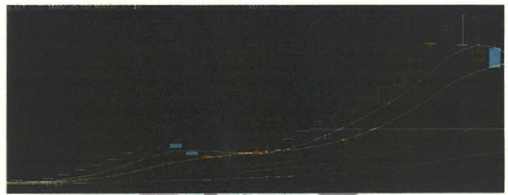  
疫情下的 002838 表现  

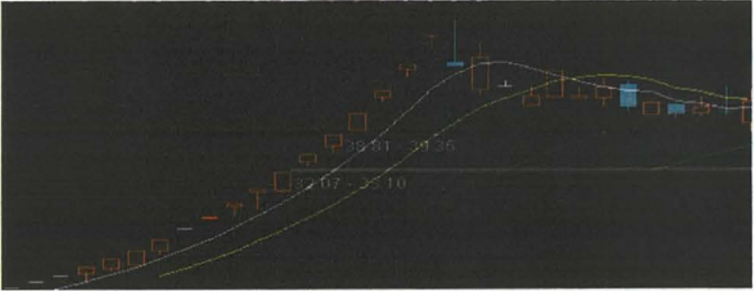  
碳中和概念 003039 表现  

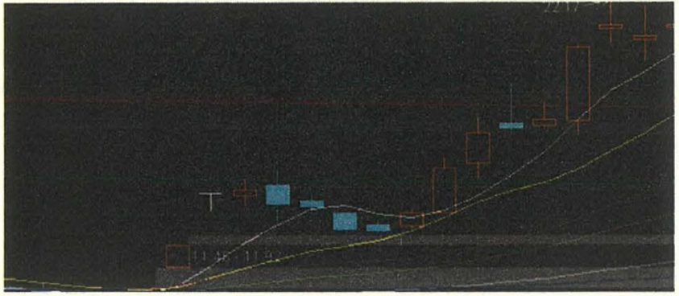  
鸿蒙概念300339 的表现，不排除还有更大的空间!  

**大局观是一种综合因素，只参与机会大于风险的操作，当政策、资金、技术、信息等各方面都较好的时候，便是重仓出击博取利润的时机，如此往复不断复利。**  

**我们是市场的跟随者**，短线投资者必须时刻关注市场的动态，对于信息的解读必须有自己的判断，这种判断不是来源于读书，而是来源于**日积月累**的总结。就是我们通常所说的**大局观**。  

信息公告如同技术一样，本身是决策的考量因素之一，如果你对市场理解的**不够深刻**，光钻研这些也是徒劳。大局观就是**政策面、技术面、资金面、基本面的综合，相辅相成**。  

火候的问题，我也没法做到精确，大方向把握对了，赚钱还是大概卒，多少的问题。  

### 仓位管理心法

**关于仓位，有好机会就重点搞，没有好机会就拿着钱耐心等待或者轻仓练盘感，总之让自己觉得舒服就可以了。**经常有人问止损、止盈，目前我的操作中不考虑这两件事情，买入机会，卖出风险，何必用止损止盈来束缚自己。  

**只有学会了仓位的控制，才能做到收放自如，否则即使你判断能力超强，也容易大起大落。**  

但作为短线选手，《养家心法》认为**短期的市场情绪是有规律可循的**，长期是无法预料的，于是就演变出不同的操作。方法说出来都很简单，搞清楚现在是什么阶段，然后选用该用的方法。  

**完善自己的交易体系，输赢交给概率**，看不准的时候割肉就可以了，不必拘泥!  

当然，这句话的前提是短线操作，最大的前提还是自己的**交易系统**，少了这两个前提，就有失偏颇了。  

### 心法6  

**知行合一:第一条就是关于赚1 块还是赚7 毛的合一，其次是风险收益比与仓位拉制的合一。**  

很多人告诉我，知道要控制，但就是**管不住手**，要么感觉随便哪只拉起都是机会。要么就是开始的时候**仓位挺小，跌了补点，再跌再补**，直到动弹不得。这其实是没建立自己的体系，导致了被动。  

关于补仓以及止损这样的问题，如果你还有补仓或者止损的想法，就说明你的心理还有**成本这个障碍**，好的操作，应该是最简单的，只有**买入或者卖出**。不用刻意追求所谓的资金管理，风险收益比，量化决定仓位，市场缺乏确定性机会时自然小仓出击，**有好机会才重仓。确定的主流反复做**，但是也不放弃盘中非主流机会，有机会都可以。  

仓住的控制，绝对不是因为我的几句话就能改变的，但是至少有这个意识，买之前问问自己这股的胜率如何?能否上涨30%?  

心法就是个循序渐进的过程，**只有不断的修炼**，才能成正果。  

## 关于热点的把握

### 心法7

**所有身家全部压在一个股票上时，通常我要求极高的赢面，那时会有一种哪怕少买了100股都觉得遗憾的感觉，当然这种情况较少，通常一年也就是4-5次。**  

赢面60%以下，观望；  
赢面60%-70% ，小仓出击；  
赢面70%-80% ，中仓出击；  
赢面80% 以上时，大仓出击；  
赢面90% 以上，满仓。  

这个赢面包括**胜率和涨跌空间**，比如满仓出击时，对我来说，必须满足以下两个条件才会做这样的决策，一方面是胜率要求90%以上，另一方面是上涨的空间和下跌的空间比率，上涨的空间至少要看到30%-50%以上，而下跌的空间应该在3%-5%以内。尽力把握好操作，胜负的事情交给概率，不管结果如何坦然面对，冷静处理。  

**关于热点，有长期的主流，也有短期的支流，长期的主流能持续，可以反复做，短期的支流，爆发力强，都有可操作性**。具体技术的东西，个人不怎么注重，虽然做的是短线，但是看的是更大的局。  

**碳中和**，是上层的顶层设计之一，是立足长远，也是未来世纪性大题材，所以新事物的诞生，我们格外重视，因为他的新，预示着**从未有过的机会**。而这些机会只会留给极少数人。任何板块的发酵，如果是盘中消息，考验**素养和手速**!  

### 心法8  

**对于主流热点的把握一定要做到:进行瞬间的操作判断，操作是瞬间的，判断是动态的。其中也离不开追涨，追涨的核心是火候的把握。**  

一年下来，这种机会不多见，但是如果遇上一定要把握住，把握的前提，是与你的日日夜夜的复牌、年复一年的总结所带来的素养是息息相关的，耐得住这种寂寞，才能有机会享受繁华。复盘与素养，这是一个初入者的必修课。  

符合主流热点的强势股是赚大钱的机会。既然准备赚大钱，何必着急卖出。即使行情弱于预期，宁愿回落卖出，少赚些无妨，但是提早卖出，错失的可能一年中为数不多的绝佳机会，两者权衡，先持有观望是上策。  
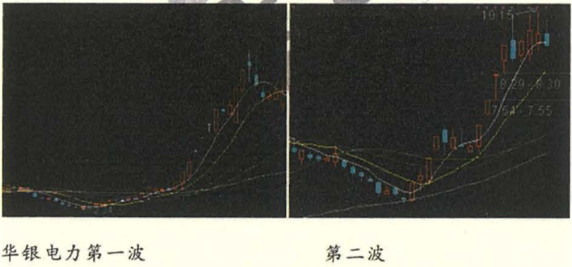  
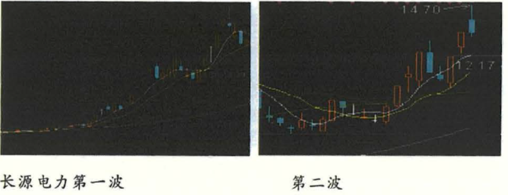  

当然总龙头是顺控发展，但华银电力与长源电力的联动效应是比较好参与的。  

市场热点很多，每天都有不同的消息推送，如何在第一时间把握热点?这个热点是主流还是支流?其中核心便是大方向，或者说大局观，也就是我们要站在更高的高度看问题。  

如 2021年走的比较长，比较久的医美。  
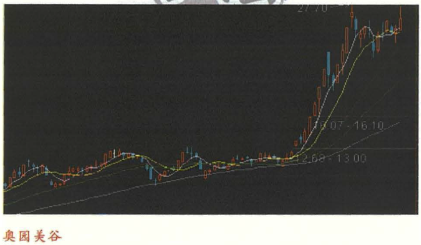  

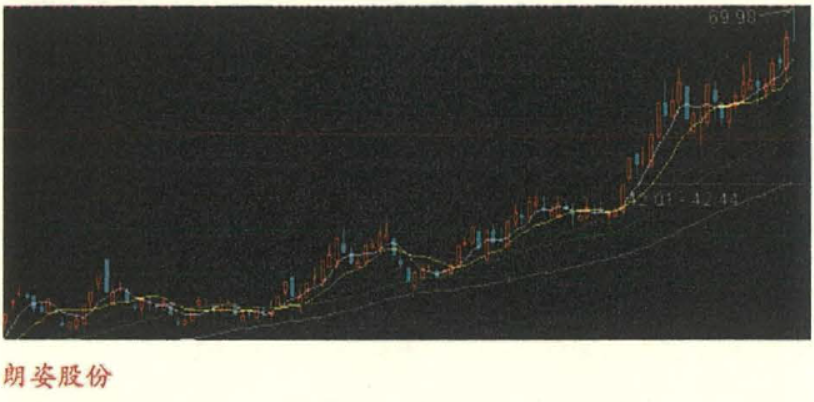  

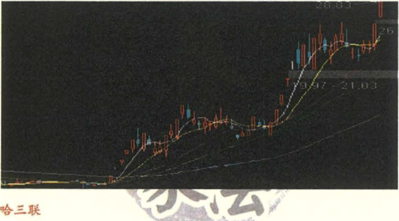  

大方向的问题，或许就是asking说的一张纸的意思，懂了就懂了，不懂的多说也无用，用我的话说，就是做的是短线，但是看的是更大的局。  

所以，所谓的局，**是个综合因素，政策面、技术面、基本面、资金面、人气面，等集合与一身、形成的共振!** 如此共振，20%的空间会有吗?如果有，为啥不敢买呢?  

### 心法9

**热点来自题材，持续性来自赚钱效应!**  

热点的处理:  

1、先预判热点性质，是主流热点，还是次主流热点，还是非主流热点?  

2、预判可以先试错轻仓买入，确认后再追涨加仓。  

3、对于主流热点，实盘操作中可以直接买相对确定的龙头也可以买后发品种，仓位稍重些也无妨。以碳中和为例:华银电力2021年5月18迎来第二波升，如果建立了股票素养应第一时间进入，如果来不及吃点龙二长源电力肉也不少。  

4、若是次主流，有绝佳机会也可以重仓搏杀，若是非主流，轻仓参与，隔日卖出。  

2021年的概念题材层出不穷。

先是碳中和:顺控发展、长源电力、华银电力  
医美:朗姿股份、奥园美谷、哈三联  
疫苗检测:热景生物、复主医药、未名医药  
数字货币:天旗科技  
新能源汽车:长安汽车、小康股份、北汽蓝谷  
华为鸿蒙:润和软件、常山北明  
降解塑料:丹化科技、银禧科技  
森林碳汇:福建金森、岳阳林纸  

还有食品饮料、白酒、换电概念、钮电、盐湖提钮、芯片光刻胶、光伏都是未来的方向!  
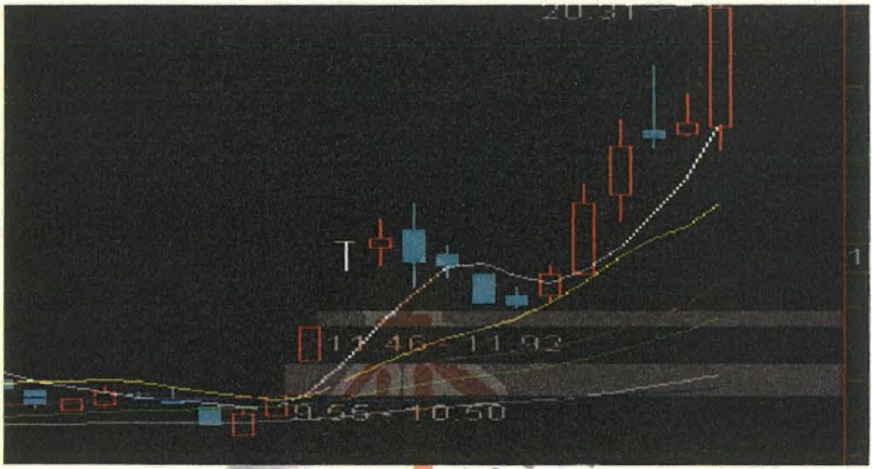  
润和软件  

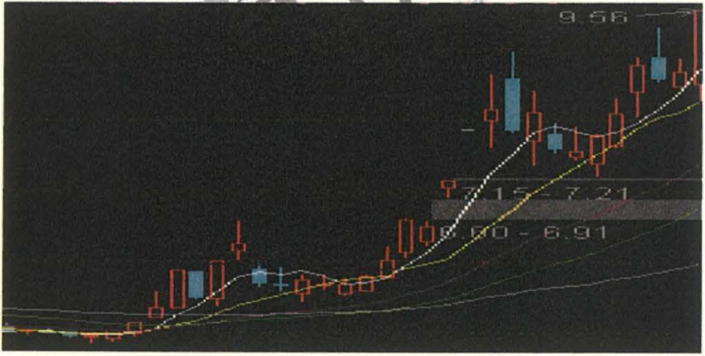  
常山北明  

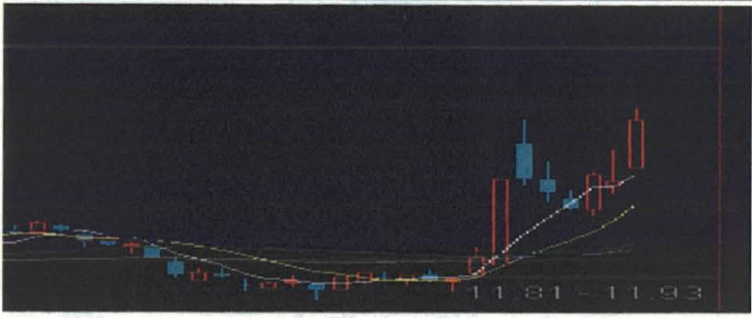  
再如换电概念龙: 英飞特  

### 心法10

**如果你没能及时把握第一波，那就建立板块，跟踪买入第二波。**  

关键是每天的跟踪与素养，要第一时间知道何为**龙头**，如何切入还要**火候**!

市场赚钱效应爆棚，对于我们来说，耐心做好自己的事，做对的操作，盈亏的事情交给概率。  

先是赚钱效应极好，是今年以来少有的好时机。  

对于这样的市场，是我们乐于见到的，养家不会去过多的参与大盘的判断，只看市场的情绪。**情绪在，重仓一直在。**  

## 关于如何做T

至于做t，我会做，但是我不是为了做而做，当中的加仓和减仓，是依据我对市场变化后，收益风险重新衡量后的决策。也许为此错失了很多大牛股，但也规避很多风险。很多人是为了做T而做T，完全是为了手痒，觉得有买卖，感觉跌了就买，涨了就卖，**听起来容易，做起来很难。**  

对于做T，我觉得不是为了做T而做T，只有当**机会偏大**的时候加仓，**风险偏大**的时候减仓，如果有更好的标的就**换仓**，当板块个股大幅波动的走势，这些操作会在一天之内进行，于是形成了做T的形式。  

所以即使是做T，其实也是源于对盘中的判断，说来说去，还是围绕我的一贯的观点，看好买人，不着好卖出，否则换股，操作越简单越好。  

**所以做T，依然还是操盘手法的范畴，不要上升到策略的高度**。比如券商板块，湘财股份2021年5月14第一时间拉停了，势必带动整个板块会有一个拉升，而你的手上持有证券的底仓，那么反应迅速的人，会至少看好接下来一段小时间内的机会。

所以，T，不为T而T。  

## 复盘

### 心法11  

**高质量的复盘是好的操作的基础，特别是对于短线来说，有时间的话一定要多看，如果是实在时间有限，也要选择重要板块，重要个股做复盘。因为对于短线选手来说，热点和情绪的判断是最重要的，关键的是有没有赚钱效应。**  

还有一点就是:当一只股赚的比较多的时候，会收敛的比较多。以此来表达对市场的敬畏，同时也是告诫自己：**戒骄戒躁，放空大脑**再出发。因为赚了比较多之后，往往容易头脑发热，决策自然会失准。  

复盘，是被问的最多的问题。因为，复盘也是操盘的**关键所在**，经常有人问我，花了很多时间不见成效，那么看看你的复盘方式对吗?个股的走势，日积月累，观察主力如何操盘，如何洗盘，如何把你洗出去后拉板，以后见到这样的图形你就会淡定很多。  

不要觉得分时围是完全随机的，其实是有规律可循的，因为这些都会体现在走势上。养家说技术不重要，但是技术也会反应**情绪**。根据复盘，选定可以考虑介入的个股，或者说完全不考虑介入的个股，让自己的第二天操作有个基本的目标。  

关于复盘其实还有很多，比如**强势股的联动，强势股圆形**的一致性等!  

## 心法12

**大局定仓位:大盘所处的阶段必须搞清楚，这个最大的大局，就是日常所说的是否是可操作区间，如果是，那么定下来仓位50-80% ，一年中100%的时机比较少，要达到这个仓住一般都是，当我觉得少买100股，我都觉得可惜的时候，一年也就不超过6次。**  

如果当大盘在不可操作区间的时候，那么仓位策略就是0-30%，以尽可能的**规避风险**。  

热点情绪定板块:搞清楚了大方向:参与还是不参与，接下来就是把范围缩小，4000多只个股，几百个板块，我们不可能都看一遍，否则，别说18小时，24小时也看不完。所以把时间花在重要的板块上。  

如何选取板块:  

1、市场热点板块，诸如当下的碳中和、医美、森林碳汇、华为鸿蒙、降解塑料、还有食品饮料、白酒、换电概念、锂电、盐湖提锂、碳硅芯片光刻胶、光伏产业链都是未来的方向  

2、自己比较熟悉的板块，每个人都有自己相对比较熟态的板块，比如做医药的，就知道各家医药公司的质地，这是别人无可比拟的优势。  

上述的板块，还有个股选择标准就是**市场的情绪**，无论是哪个板块，要激活板块的人气，是必须有个股去拉板的，这是激活人气的必要条件，所以留意板块的情绪。一般建议选取3-5个板块做复盘。(盐湖提锂概念示范)  
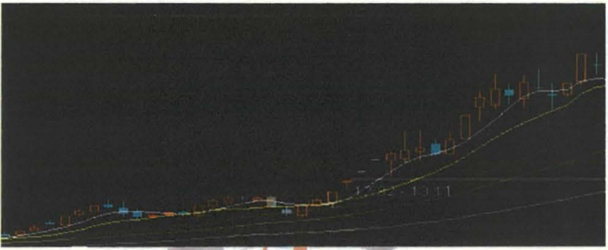  
000408  

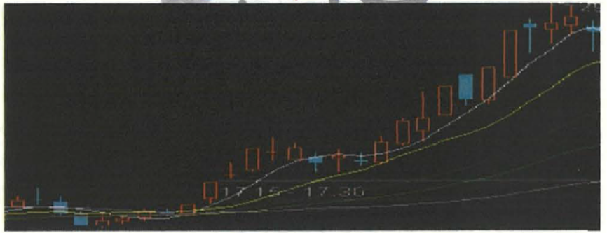  
000762  

根据板块定个股:根据上述选定的板块，按照涨停先后顺序，把个股的技术图，分时图，量能全都认真的看一遍，谁是龙头，分几段拉升，拉升之前是什么状态，根据龙虎榜看看是谁拉的。其实股票也是有熟悉和陌生之分，**赚自己认知的钱**!  

## 建立自己的交易体系  

**建议每个人都有自己的一套交易体系，所谓体系，听起来复杂，我认为体系的第一步就是:你的买和卖的逻辑。你如果定义短线，那就要有短线买入的逻辑，也得有卖出的逻辑。如果定义长线，做法完全不同。所以，首先要搞清楚的是:你计划风格是什么，而不是市场给你短线就短线(赚钱就出了)，给你长线就长线(被套就做长期股东了)。**  

在残酷的市场上，但天赋比你高的人都在努力的时候，你还能指望不努力就能胜过人家吗?如果努力和赚钱之间让你做个选择，我想大部分人应该选择努力吧。  

人都会有这个问题，包括以前的我也是一样，但是想想，盘中的那些干扰，那些直线拉升给你带来的冲动，几次是让你赚钱的。既然知道问题所在，就得下决心去解决，知行合一!!!  

**买和卖的逻辑，一定要对应。**  

我这个思路不少人都知道，因为之前的文章中有提过，永不止盈、永不止损、**看好买入，不看好卖出**，操作就应该是简单的。  

当然，因为我做的是短线，所以对自己有这样的要求，而日常中，估计很多人都有这样的经历:本想做个短线，结果一套成了股东。这样的话，就很被动了。  
