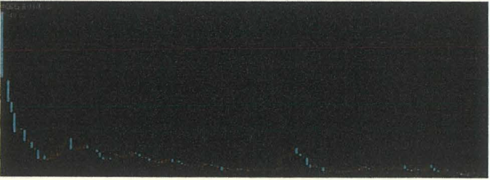

---  
title: 炒股养家心法 珍藏版 第3部分  
index: true  
icon: editor  
order: 4  
category:  
  - 炒股养家心法  
  - 大A  
tag:  
  - 收费文档  
---  

## 短线和中线  

短线和中线的根本不同在于思考格局的不同，这种格局并不是眼界，而是两种不同范式的操作模式，我们此前说的方法大多针对短线，但是短线与中线并不冲突，把握好逻辑就好。  

一、短线和中线的选择  

无论短线还是中线，我的希望是，这都来源于我们自己的选择，而不是被动接受，风格可以相互转化，但不是被动的转化。  

有人有这样的感慨，最失败的股民:炒股炒成股东，明明是想做个短线进场，无奈后面套了很久，甚至是很多年。这就不是我们想要的，暂且不管之后你是解套了，还是突然有一天来了个资产重组，那都是侥幸，我们之前的操作已经失败了。  

短线支易强调的是:短、平、快，所以要点是抓住进攻的机会，和发起进攻的时机，看过中国女排的朋友应该能领会这句话的意思。短平快的最大挑战来源于，对手比你还快，抓住了更好的时机，一旦从进攻状态转成防守状态，是相当被动的。  

所以短线交易者，我们讲究的是速度，买入的逻辑是看好股价的短期上行，这个逻辑还在就有持股的理由，如果不再看好，那么最好的结果也是及时离场，避免带给自己更大的被动!  

中线操作看中的是市场的趋势和个股的趋势，特别适合没时间盯盘的人，前提是你对市场的大方向和个股的方向有个基本准确的判断，不在乎短期的波动，只在乎上涨逻辑和趋势。  

短线和中线并不对立，有时候可以看的中线做的是短线，有时候也因为做了短线，减仓以后收益极高，变成了中线，无论哪种方式，有一条是要避免的:那就是满仓。满仓意味着没有别的选择。  

短线也好，中线也罢，操作背后是自身的思考逻辑，适合自己的还是取胜之道!  

## 心法45  

**很多人花大量的时间在大盘点位的预测上，其实，做短线的人，不要过多依赖预测大盘点数、顶底这些，而应多关注哪些板块、个股在涨，哪些在跌，那些先前涨的或者跌的，后来的表现又如何**。  

短线的基础是市场情绪，以及操作者的心态， 把握了市场的情绪，掌控了自身的操作心态，那么盈利不会成为一个大问题，而只是多少和迟早的问题。  

很多人花了大量的时间在大盘的判断和预测上，虽然这对于方向的把握有帮助，对做差价的朋友也会有较大的帮助，但是大盘的趋势，只要知道大概就可以了。  

很多人在卖完筹码之后，只干一件事，在寻找各类跌下去的理由，或者看到一些语不惊人的文章而视为知已，心态出了问题，对自己的操作毫无益处。  

**短线交易者是应看中的是市场的情绪，只要情绪在，主流把握对了，盈利只是概率的问题**，相反，有主流而不去做主流，在纠结于自己卖飞的个股，被套的个股，那么行情和你其实没啥关系。  

所以，短线交易者，最重要的是:  

1、了解市场短线情绪，最简单的涨停家数，涨停分布，昨天涨停的个股今天的表现，大盘的涨幅等。  

2、把自己的个格局放大些，让自己站在更高的高处看待市场。虽
然我不反对做自己熟悉的个股，但走过分局限自己的个股容易造
成自己的短视，而错过大的机会。  

3、清楚的梳理当下的主流、热点，这轮行情的主流和热点，大的主流要反复做，主流中的龙头会有更多的机会，符合主流的个股，即使短期表现不佳，也会有轮动的机会。  

4、判断为末，应变为本，预判是为了应变做准备的，应变才是立于不败之地的根本。市场最大的确定性就是不确定，分歧意味着机会，我们要用市场情绪的推演，反过来指导我们的操作，而不是我们的操作被市场情绪带着走。  

判断对的人不见得能赚大钱，可能他买的板块不对，个股不对，仓位不对;判断错的人却可以赚大钱，因为他判断了市场的情绪，知道市场的主流，操作都围绕主流在操作。  

短线，则是门槛相对低的模式，因为无论你对这个市场的理解，买入和卖出总是比较简单的。这里有人因为过度交易把自己的资金全都送给了券商，也打乱了自己的心态。也有人做到了8年1万倍。所以，市场上从来不缺少传说，无论选择哪种模式，做精就好。  

我平时的风格以短线为主，但也不见得是隔天就走，有时也会拿上十几天，只是那样的机会不多。**短线交易分低吸，半路，打板三个模式**，这三个模式比较好理解，不再展开!  

**短线交易者必须把握的一个要点:情绪节奏**  

即什么时候可以用打板模式，什么时候要尽量规避打板?  

市场上的情绪节奏一般都有周期，举个例子，涨停板的高度，会从3板起步，逐步抬升，比如龙头止步9板，如果后面的第二个最多到了8板，意味着情绪的消退，再后来的龙头很可能是7板，6板，3板，甚至某一天极端情况，没有一个连板，那么这时候大概率就是新周期的开始了。  

**踏准了节奏，就能分辨出风险与机会的比率，进而决定进出的仓位和采用的模式。**  

情绪上升的周期可以考虑打板， 情绪衰退到底部的时候，可以
考虑低吸，以及轻仓打板试错，你打的很可能就是新周期的开始，
所谓物极必反。
当然，打板是一项专业皮要求很高的动作，没有经过专业的训
练不建议去参与，打板的风险并不只在于胜卒，更重要的是你打
板时所处的情绪周期。  

我们要实现持续的、稳定的盈利，并不是追求胜率大于50%,而是至少要达到70%以上。  

赚钱效应(情绪)、节奏、技术、操作，回撤，这几个因素都是短线交易者该考虑的问题，如能融合，收益曲线的平滑向上可期。  

与其泛泛而谈，不如专注一个方向；多点出击，不如主攻一点。对于主流热点，操作策略是反复做，第一波赶上的话就做足。支流热点，操作策略是，在主流不倒的情况下，按照以主流为中心的逻辑逐步挖掘。  

## 关于思维体系  

所谓思维体系，是指如何看待市场，判断机会与风险，把握市场机会与自我调整的思维方法集合。思维体系直接关乎我们的心态，稳定的心态是短线操作的前提，操作和判断决定我们的盈亏，我们的盈亏，决定我们下一个操作。  

### 1、大局观  

大局观是一种对盘面的感觉，开始的时候或许不明白，直接的说，就是尽可能让自己站在更高的高度来看待整个市场。比如大盘的上涨的动因，为何这轮上涨会出现在2020年，一来是周期的因素，二来是化解风险的因素，三来是相关政策的预热因素，四来是长线龙头牛，或许我们的理解不一定准确，但明白一些，将受益无穷。  

细化到市场，不是整天追问：我买的这个票套了3年，为什么就是不涨?而应考虑这票现在的角度，上涨的逻辑是什么，这个行业为什么要涨，有什么优势，在行业里处于什么地位?等等，搞清楚这些，其实你自己也清楚这票为什么不涨了。  

所以，**我们可以忽略一些大盘点位的判断，多关注一些市场的情绪**，比如之前是哪些板块在涨?上涨的逻辑是什么?上涨之后他们现在怎么样了?之前下跌的板块是哪些，现在又如何了?  

思考的多了，慢慢就对大盘会有概念了，对大盘的大局把握的会更到位。  

大局观，这是个懂的自然懂的范畴，如果还不明白，先尝试这么做吧。  

### 2、思考领先一步  

这个比较简单，但是做到的人不多，思考问题不局限于当下，而是更近一步。因为:这个市场盈利的永远是少数，如果你要想成为那部分少数，就得让自己的思考成为那部分少数，而不是人云亦云。  

### 3、学习能力日积月累  

思考能力，总结能力、执行能力、反应能力、比别人强，比别人到位，这跟日复一日，年复一年的学习分不开的!  

## 潜伏的要点  

潜伏，即在题材没有发酵，或者即将发酵之前，提前介入目标，以获取在发酵过程中的溢价。好的股票，依然需要市场题材的配合，我想这也是潜伏的意义所在。  

1、思维领先一步，把着眼点放在"明天"，而不是现在，因为目光短浅容易被主力资金诱惑，而导致追高，把目光放长远，操作上也会平和一些。不少朋友应该深有体会。  

2、潜伏的目标也会下跌，预案就行，在我这里，操作不是赌博，赌徒心态是要不得的。小道的消息虽然是一种博弈，但是我们的操作不是这样，我们有自己的逻辑和章法。  

3、最好的潜伏状态“有确切消息更好，没消息也能涨”。潜伏的个股除了思维领先之外，还有消息面的刺激和预判，这条决定我们对风险收益的衡量，决定我们的仓位配置。  

好的股票，也需要市场的配合，如果没有市场的配合也是好股票，这种标的就是我们潜伏的目标。潜伏是一种状态，天时、地利、人和的状态，所以，不为潜伏而潜伏，有机会了把握住就可以。  

## 当你还是小资金，几个点要注意  

### 1、心态上:志存高远，脚踏实地  

志存高远，并非好高骛远，更不是追求短期暴富，而是我们的积极乐观的心态。因为只有这样的心态，你才能更好的理解这个市场，把握市场的节奏。我不喜欢怨天尤人，这个市场一定有一个铁律:你以什么样的心态对它，它就以什么样的回报作为回应。  

只有志存高远，你才明白你自己要做什么，要去提升什么，要去改进什么。成功的路上并不艰难，但是真正坚持的人不多。很多人原本潜质很好，但是走着走着就掉队了。  

脚踏实地，是真正从眼前做起，从小资金做起，不是觉得自己才30万资金，就不当回事，既然选择股票，就不要把他等同于赌博。  

### 2、方向上:学会分仓，拉制回撤  

短线交易很注重买入的时机，但是我们也无法准确判断一只个股的高低点，所以对于大资金来说，分仓走必须的。但是，即使你是小资金，也建议从分仓开始做起，养成这个习惯不会是什么坏事。  

满仓操作的朋友，估计不少都有这样的经历，涨起来自然好，跌起来也很可怕，往往是一次下跌吞噬掉之前的所有利润。有人觉得小资金就是靠博，我并不认同，因为盈亏同源。不管你的资金大小，建议都从分仓做起。  

分仓，并不是简单的50万买几只票，如果买入的逻辑是**情绪奔溃后的瞬间低点**，其实我们都没把握买到低点，这时分仓就是分批建仓。但一个看好一个板块，可以分散介入个股。把握大的，可以多买些，把握小的，少买。

**分仓的核心**：使我们的买入价尽可能的接近底价，买入的个股数量，能够大致体现我们的整体胜率水平，不至于在一只个股上栽倒。  

控制回撤，很多人忽视的环节，或者说知道但不会去做的环节，但是你回头去看，你的每次大亏，很可能都是从盈利开始的，所以控制回撤体系确实要放到极端重要的位置。  

回撤，不仅影响你的操作心态，更影响你的复利延续。  

### 3、操作上:预判买入确认加仓  

对于题材的把握，我们都无法做到准确，也无法每次都是先人一步收到信息，手机各种财经资讯，有彻底发酵的，也有不发酵的，所以操作上，我们讲究：预判买入，确认再加仓。  

核心：预判买入，不仅是为了先手，更是，买入之后你会持续去关注，确认加仓，指的是跟着市场的情绪走，发酵加仓，不发酵则不加!  

### 4、永不止损，永不止盈

很多人不理解这句话，因为这话和平时看到的不太一样，核心是指：当你继续看好这只个股，那就依然有持股的理由，而不用止损止盈去束缚自己，当你不再看好这只个股，那就坚决卖出，我认为操作就应该是简单的：看好买入，不看好卖出。  

不能让持仓成为我们的累赘，也不要让卖飞一只个股成为我们冲动交易的理由。如果说某只股票重仓被套，那一定是之前你没有遵守上面的几条。  

当我们追求的热点发生变换的时候，调仓换股，不要觉得卖出是一种负担，卖出意味着更多的机会，哪怕有时候我们卖飞也是一样。  

## 你的买卖节奏对吗?  

没有绝对的牛股，也很少有真正的垃圾，**个股的好坏，很大程度上取决于我们的操作、买卖的节奏**。而这个节奏，直接关乎我们每个人的账户收益。  

很多人当然的以为，只要某一天赚钱了，就觉得这是正确的盈利方式，殊不知，赚钱也有行情和运气的成分，当你运气不再这么好，或者短线情绪发生变化，结果可能就不一样。  

所以，我要求我们团队，越是在操作糟糕的时候，越是行情不好的时候，越要反思，总结，因为这时，我们才能真正发现自己的问题所在。  

当市场情绪较差，或者行情走势对我们自己不利的时候，需要理性的对待风险，应该跳出自己的持仓，做客观的判断和冷静的观察，才不至于导致自己更大的被动。  

当市场情绪不及我们的预期，这时候，我们买入个股的成本就要求更低，卖出个股的价格，会比原先是低。并且在这笔交易之前，最好能设计好预案。而不是：低位的时候觉得要继续跌，没敢买，而拉起的时候，觉得要大涨，分时线追高就进去了，于是
成交单就定格在分时线的高位。这是主力资金想要的散户操作。  

仓位上去了，成本上去了，被套的更多了，自然就变得更加被动，买卖的节奏就完全被打坏了。操作者的情绪也会受到极大的影响，后面的操作也会跟着糟糕。  

所以，这是我们所说的节奏，节奏踩对了，操作者是"舒服的"，赚钱是大概率的，相反，自己填空。  

**如何跟上"对的节奏"?**  

节奏是交易体系的一部分，每人应该清楚自己的交易体系，比如低吸模式，半路拦截模式，打板模式，每个模式没有对错，但是每个模式都有不同的要领，越专注，犯错的概率越低。

固化自己的模式，专注自己的模式，给自己的模式定下框框，不断的去完善，这样才能对节奏的把握更加自如。我们讲的知行合一，倒不一定是情绪上的自觉，更是一系列框框体系下的选择而已。  

节奏，希望每个人都能认真领会。  

## 最重要的交易策略  

这是最重要的交易策略，也是最容易被我们忽视的策略，**特别是做短线的朋友，最大的问题不在于选股，也不在体系，而在于"管不住手"**。所以，我一直把"等"作为是最重要的交易策略。  

其实追涨也好，低吸也罢，半路拦截模式都可以，问题不在模式，而在于何种阶段使用，以及火候。而这些模式的前提：就是你的仓位控制，因为任何模式都会有风险，市场上唯一不变的就是变。  

任何极端的行情下，都会有逆势的品种，但这并不是我们追求的目标，我们追求的是长期的，稳定的盈利。为何强调长期，因为很多人总想着一夜暴富，一把翻本，以至于屡屡受挫。  

说这些的目的，并非炫耀，而是希望大家能够顺着思路去领会，去掌握市场情绪的变化，去对比持筹者和持币者的情绪变化，我想认真看过的人，至少会减少一些仓位。  

当市场的情绪对我们不利的时候，我们是应该理性的看待风险，而不是一味的对抗，并不是因为昨天套了3个点，就扔那不管了，结果今天就变成13个点，从这个角度，估计也能理解我说的"永不止盈，永不止损" "看好买入，不看好卖出" 的意义，因为我
的理解，短线操作就应该是简单的。  

所以，通过近期股市表现的行情，希望每个人都能去总结自己的近一阶段的得失，有总结才会有进步，决不能是一根阳线忘了所有的伤疤。对你有启发的文章，可以多读几遍，不要拘泥于遍数，领悟的是你自己的。  

**在任何体系里，都应该有一个最重要的策略：等**。我们应该把90%的时间花在等待上，而只把10%的时间花在操作上。  

## 信念  

**信念，是支撑我一直走下去，一直走到今天的精神支柱，脚踏实地、百折不挠，砥砺前行！**  

唐僧师徒，为什么偏偏是能力最小的唐僧是团队领导?佛主选中他，正是由于他的信念，最终取得真经，更多的也会靠着他带给团队的信念。  

也有人说这句话有误导之嫌，会让有些不明风险的人往市场里钻，会带坏一些人。我并不这么认为，我从不引导别人炒股，因为我很清楚炒股的盈亏比例和市场的残酷。  

我想看我文章的人，应该都是已经入场的股民，我希望以我的经历，我的感悟能让大家少走一些弯路，给大家一些善意的提醒，分享一些我十几年来的心得。  

前段时间行情火爆的日子，有人觉得我的一月5% 的目标太小了，根本不值得一提，很可能一天就能完成10%。行情走到今天，大家应该明白每月5%的不容易。  

**居安要思危!顺风顺水的日子过多了，要多想以前困难的日子，城里的生活过惯了，也很有必要到农村体会种粮的艰辛。账户的收益高了，也得守得住才行，所谓一张一弛谓之道**。  

所以，我会在行情火热的时候，给大家泼冷水，也会在一片惨淡的时候，给大家打气。  

每天的追涨杀跌，到底有多少是无用功，甚至是反作用。之前我说我要把90%的时间花在等待，把10%的时间花在交易上，因为股市不是一个按劳分配的地方，而是讲究时机和火候的地方。  

只是有人看了，有人没看，有人仔细的看了，有人走马观花的看了，有人一周看一次，有人一天看五遍，过程不同，结果自然不同。  

包括对文章的理解，千万不能成为培训课程一样：听的时候，感觉很好，气氛也很活跃，培训一结束，该如何，还是如何，没有任何长进，十几年宝贵经验，血与泪的实战较量，怀着一份感恩之心分享，希望对你的帮助是巨大的!  

股市这是个公平的地方，几乎没有门槛，谁都可以参与，但其实更是要求很高的地方，靠运气的多半撑不过多久，靠感觉的也不例外，唯一能长期生存的只有你没看到的，背后的努力。包括理念、方法、素养、体系。  

市场很残酷，是个合法的财富转移工具，市场也很公平，因为各凭本事吃饭，本事藏在大家平时的努力和修行中。  

既然你来到了这里，当对这里有足够的信念:感恩市场的信念，敬畏市场的信念，做到比90%的人更优秀的信念。我想这是一个优秀的交易者的前提。  

如果你连过程都无法保证，如何要求你的结果胜过他人?  

很多时候，逼着你走的，并不是前方梦想的光芒万丈，而是身后的万丈深渊!  

每到周末，反思下自己，总结下自己，改进自己;看着熟睡的家人，想必每一个有担当的人，都希望通过自己的努力，让家人过的更好。这就是你最大的动力。  

这也是我当年，多少个不眠之夜留给我的最深印象，也是我所说的"身后的万丈深渊"，曾经靠着这个动力，咬牙坚持着我的信念。现在也写给你们。  

## 大跌的应对  

人，性本恶。恶，人之本性，因人性有恶，才有法度，天下人生而好利，才有财货土地之争夺;生而贪欲，才有盗贼暴力与杀戮;生而有奢望，才有声色犬马。人性之恶，必以律法而后正，以法治防范恶欲，以法治疏导人性，人性才能向善有序。  

《大秦帝国》之商鞍  

但凡做局的人，多半是利用了人性，人性如何?商鞅的论述中，可见一二。  

商鞅主张法治，以律法而后正。而我们做股票，其实也有这样的问题。疏导人内心，即，心法，养成一套属于自己的思维理论体系。防范恶欲，是指用我们的交易体系，防止我们心存侥幸，心存幻想。

大跌如何应对，其实要点不在应对，而在如何防范，但凡大跌之前一般都有先兆，比如赚钱效应的下降，市场的情绪不佳，高位滞涨。我的文章中，提示最多的还是关于风险和方向。  

所以，问题的关键在于，如何在你做买入动作的时候，制定自己的持股逻辑，即因为短线技术买入?还是因为看好行业发展而买入?还是热点题材而买入?  

**买和卖的逻辑自然是对应的，不同逻辑操作手法也是不一样的**。都应该准备有不同的预案。  

有的人买股靠感觉，看媒体，看到一个买一个，买入之后，完全不知道逻辑，心中设想如果大涨怎么办，涨停怎么办，而不去思考万一下跌怎么办。这样的操作，一旦遇上大跌自然走要吃亏的，也是不知所措的。  

相反，**好的体系应该是，如果上涨固然更好，如果下跌，则有相应的应对**，比如中线持股的，有详尽的加仓逻辑，题材持股的，有根据龙头表现买卖的逻辑。大方向上有仓位控制的逻辑。这样，即使遇上大跌，也不至恐慌。  

健忘，是我们经常犯的错，每次大跌和被动，都会有相同的因素在里面，甚至是大部分因素相同，而我们总是轻易觉得这次应该不一样。**每次重仓一只高位股，总觉得会不一样，把交易体系，把控制回撤都忘到了脑后**。事后看看，这其实是你经常犯的错，每次分时图一根直线拉起的时候进场、然后每次又在另一只分时图直线的时候割肉，然后重复这个过程。  

改变健忘的毛病，客观，感受市场的情绪，多从自身原因找差距，你的操作才会越来越好。如果你把握了市场情绪，胜利不是问题，如果你的情绪被市场带着走，那韭菜的经历会再次上演。  

说说我的文易体系的一部分：这个习惯  

这个习惯，凡是看我文章的人，应该都很清楚，一直在强调：**周末或者节假日之前，不是轻仓就是清仓。**  

有人觉得我太保守了，因为确实也有很多节假日回来上涨的行情，这都是交易体系该有的代价，任何的交易规则，都不能让我们捕捉到每一个胜利，但是如果能让我们规避一些潜在的风险那就是极好的。  

每一个体系，每一个理念都有使用的代价，本质是取舍，取得了安全，势必损失了部分潜在的收益，此事古难全。我们要做的，是我们账户的持续的、稳定的收益，如果大家都是这个目标，如遇上调整，即使有回撤，也不会大。  

每一个交易体系的执行，都在于我们自己大脑清醒的时候，内心客观的坚定，任何体系都会受到质疑，但觉得对的，要坚定的去执行，**体系的作用就是让我们抛去侥幸和幻想**。  

所以不必在意，因为用了控制回撤体系，结果止盈了之后，后来又涨停了，不用纠结"弱水三千只取一瓢，能赚一块，只赚七毛"之后，结果他还是涨了一块。交易完成，他和你没关系了，**体系不是算命，无法给你精准的买卖点位，能给你的是一套持续
稳定的向上曲线**，尽管有时，他看起来很慢，长期来看，慢就是快。  

看问题要抓住本质，真正吸取对自己有用的，多一份学习的心态，谦卑的姿态，时刻事理通达，自然心态更为平和，看事情自然更加透彻，做事自然更加有的放失。你以什么心态对待市场，对待学习，他会给你一样的反馈！  

**经历过是为了更好的成长**  

为什么说希望大家能够经历过一个完整的牛熊，只有这样你才对市场有更深的理解，这个真的不是书本上学的，而是靠心中悟过。经历少的人，总会时不时觉得自己悟道了，经历熊市检验，原来小荷才露尖尖角。  

不管你是新股民，还是老股民，如果没有成长，起点还是一样。经历过行情的轮回，经历过心态的崩塌，才能是好地理解市场，才能面不改色，坐怀不乱。  

有些操作上的事情，只有经历过，反思过，才会带来成长与进步，就像管住手这件事，没有经历过下跌的人，不知道管住手是多重要。  

我早期的亏损，最多的都是来自频繁交易，为何频繁，因为"吃着碗里的，看着锅里的"， 没有稳定的选股体系和买入体系，操作凭感觉，看着到处是机会，最终是败多胜少。  

## 着急，多半是陷阱  

比如着急赚大钱，着急翻本，着急操作。因为心态着急，自然带坏我们的自己的判断，股票操作本身需要时刻保持清醒，任何的外界的压力，都可能让操作成为不可承受之重。  

所以，这里再次强调，对于一般人不建议配资，不建议加杠杆，不建议负债，任何没有做最坏打算的人，在这个市场里多半是无法生存的。  

也许你听闻2015年，凭借高杠杆暴富的很多，但是你没听过的，从暴富到爆仓的人更多。杠杆本是金融的魅力之一，但是没有稳定盈利能力之前，不建议去赌，十赌九输，一点不为过。  

**财，不入急门**  

这句话并非我的发明，是我们的老祖宗留给我们的，要时刻让自己保持谦逊、稳定的心态，多一份感恩，少一份抱怨。  

每个参与市场交易的人，出发点都是想从市场里赚取金钱，一个想从这里赚钱，又天天抱怨市场的人，多半是不能如愿的。就像你去拜了财神，希望财神保佑，结果在财神面前对他不敬，一个道理。  

这个并非玄学，因为你的心态决定你的判断，你的判断决定你的操作，就像追涨杀跌，多半是心态不稳的人。不同的心态，同一篇文章都会有不同的理解，当你心态积极，看到的内容将会大不同。  

股市这样，做人也是如此，只有心态平和，懂的感恩的人，才能发现更多的美好，才能更容易得到好运的眷顾。但行好事，不问前程!  

## 追涨和抄底的火候  

**有人经常会问，追涨和抄底，到底该采用哪种模式?模式其实并没有优劣，问题也不在模式，而在对市场火候的把握，以及你自己专注的方向**。  

那么，火候如何判断?  

一般来说，**强势市场**环境中，比如之前我们2018年19年经历过的2500到3200的行情，买股的逻辑是因为赚钱效应下的资金不断进入，越是强势的板块，强势的标的，被后来资金选中的概率大，所以选强势标的，强势标的基本都需要追涨。  

**弱势阶段**，就像我们说了大盘弱势要减仓，轻仓，买股的逻辑是因为市场亏钱效应的扩散导致恐慌盘的不断宣泄，如果一旦恐慌情绪宣泄殆尽，只要少量买盘就可以推动上涨，就像是急跌之后的深V，疯狂的砸盘之下，就会有大量的抄底资金，恐慌之中，一个标杆的崛起可能就能带来一个像样的反弹!  

简单的说，行情好的时候多做强势股。市场情绪好，强势股有着极高的溢价，连板成为常态。但是，一旦情绪周期向下走的时候，多等待，等待一个低吸的机会，恐慌砸盘的机会，这样的成功率更高。  

## 筹码峰与抛压  

当年秦公颁布求贤令，引来山东六国士子入秦，在经历3个月的实地踏勘后，很多人退缩了，有人觉得秦国穷，有人觉得秦国积弊很多，也有人不适应秦国的水土， 很多人退缩了。但是留下来的人，大多都成了秦国的中流政柱。  

在这个市场中，要么你选择离开，不碰这个市场。如果你要决定留下，就得有坚持的信心和勇气，越是行情艰难之时，越是心理害怕之时，越是要坚持之时，相反，所有人都在往里扎堆进的时候，是要留心离场的时候了。  

市场的角度来说，有涨必有跌，涨跌都是常态，但是放到自己的账户上，很多人并不那么淡定了，跌了死扛，套了几个月，有一天终于回本，于是卖出，从而个股开启狂奔之路。其实这也很好的解释了筹码与压力位的关系。  

在反弹的初期，市场的机会蛮多的，首选是前期的强势股，已经调整到位的，前期由于亏钱效应，很多资金选择了休息，一旦情绪修复，这些股的号召力随之而来。  

反弹初期，由于大家的筹码都是高高在上，筹码峰抛压不存在，所以初期的反弹最具参与价值，拉升途中的抛压很少，这也能解释，为什么反弹初期的成交量都不会大。  

一个板块的强度，通常是从集合竞价开始观察，如果没有明确的利好，而又直接涨停，这种板块是要值得注意的，如果集合竞价还不能确认，开盘后迅速出现助攻品种，前排秒板，那么就是对情绪的确认。这也是盯盘的意义。  

学过我们集合竞价战法的人都会去参与，如果是非常典型的弱转强，抢筹，又在低位，又无明显利好，那基本就是资金的抢筹了。9:23以后资金开始疯狂抢筹，到了后期，越来越多的资金参与了进来，斜率也就越来越大了。  

而，你要抢筹前提是，昨晚脑子里有概念，这票在你的关注范围里，虽然有软件能够实现集合竞价异常的提醒，但是没有大脑的潜在思考，上还是需要勇气，需要素养的!  

**哪一类人在赚钱**  

行情不好多休息，行情不明减仓位，虽然每天的研究必不可少，但没有好的机会，更多的是放弃和等待。  

经过多年的观察，市场上赚钱的是哪些人？大致是那些花80%的时间做研究，花20%时间来操作的人，所以，股票的科学更多的像是一个寻找买点的科学。  

稳定赚钱的是哪些人?冷血、独立思考、冷静、沉得住气，这也是我们团队对成员素养的要求。相反，操作的大忌是什么?情绪化，感情化，焦虑、赌性十足，如果把股票当成赌博多半是亏损的。  

## 要想赚钱，先看如何亏钱?  

**第一条：满仓**，不是不可以满仓，但我选择满仓的时候，至少符合结果条件:市场情绪热情高涨，板块是主流板块，个股是其中龙头，我有先手优势，有利润在手，感觉少买100股都亏损的时候。一年不过4-5次。  

而盲目的满仓，很容易陷入被动和恐慌，稍有回调拿不住。一次失手，可能导致下次情绪更为崩塌的满仓出手，形成恶性循环。  

**第二条:追涨杀跌**，我说看好买入，不看好卖出，有人说我很看好，于是就追高买了，这个有错吗?错在你的操作，错在你的判断。一个板块里，强势股第一天能继续强势的一般不过2-3个，而你的追涨标的不在这里，很可能是被闷的。  

**第三条:逆市场情绪而动**，市场情绪不佳，还要着急出手，每次觉得自己看上的会逆势，最终都成为逆势的"绿叶"。  

我用柏拉爱空指标跟踪情绪，用强势股跟踪平盘情绪，其实就是为了顺势而为。市场情绪不佳，即使板块机会再好，我更多的会选择轻仓或放弃。  

有人说，你说的我都知道，但是我依然管不住，那是修炼的问题，换个角度，你明明知道这样要给主力送钱，结果你还是这么做了，该怎么办?  

1、自己电脑上贴个条，时刻告诉自己，常犯的错误是什么?所谓"三省吾身"。  

2、组建一个小团队， 团队成员之间相王提醒，用外力来让你冷静。  

3、保持一颗平常心，培养淡定的心态，降低自己的目标预期，不要因为错过一只个股而懊恼，你的任何成功或失败的经历，都有可能成为你后面操作的绊羁。  

股票是科学，更讲究是入场，因为入场决定你的出场，股票是艺术，讲究的是你对情绪的把控。  

交易体系的作用在于用清醒的分析，替头脑的发热，用客观的判断，取代市场的诱惑，使得买股有逻辑，持仓有底气，而不是“买了就后悔”。  

曾经，我对自己的早期的亏损原因做过总结，高频交易是其中一条，即使是在熊市的2008年，满仓也是家常便饭。这其实是我的交易体系出了问题。市场不是多劳多得， 学会择时，学会放弃，才是长久之计。  

弱水三千只取一瓢，能赚一块，只赚七毛。  

有人说很认可，就是做不到，那就说明你只是觉得这句话挺顺，根本没有理解他的深层次的意义，心态不平和自然不能理解禅的深意。  

几乎每天都有学员告诉我，我追了*** ，今天没有管住手，原本已经盈利出场，结果看到拉升，又进去了。  

每一次冲动，每一次分时拉起之后的追买，大多都是市场的陷阱，专为你设计。  

股票买卖需要讲究定力，定力源自你自己的坚持，你自己认可的价值观，以及你的操作体系。  

操作体系之外的操作，不干，市场从来不缺机会，你真的盘中觉得要干，那也是小仓位，超出体系部分的仓位控制，也应该是你的体系的一部分。  

## 一个量化交易的思路  

在我们的市场中，很多人都偏向短线，从心理上说，短线可能能够快速的给出你判断的反馈，是盈利还是亏损?  

从客观的角度上来说，市场上最赚钱的这部分人基本也是短线，比如你现在看到的龙虎榜的一些常客，但是亏损做多的人也是短线，为什么会出现这么大的分化?  

因为短线是真正考验判断与操作的，考验你的心智，情绪管控能力。也是我说的，如果你掌控了市场情绪，胜利将会接踵而来，相反，如果你的情绪被市场掌控，失败终将挥之不去。  

道理很多人都明白，但总是知行不一，关于知行合一这块，前面已有文章专门阐述，今天我们思考的问题不在这里，而是给大家一个量化交易的思路。  

这里并不是建议大家去做量化，因为很多人也不具备这个条件，但是他的一些成功方法，值得我们的短线交易者借鉴。  

量化对冲，简单的说就是完全运用算法模型，同时建立多空两条路线，寻找可能的盈利机会，每次盈利都很小，但是换仓也很频繁，但是胜率会比较高，一般都在70%以上。  

反观我们的短线交易者，以及我自己之前的经历，我们的亏损往往不是来源买入就下跌，而是来源于盈利之后的膨胀，亏损之后的心态崩塌，说直接点，输给了自己，并不是技术。  

量化对冲讲究频繁交易，见好就收，不会纠结我能赚0.5%还是10%，也不会因为错过而懊恼，也不会因为卖飞而纠结，其实我们的短线交易也是一样的，觉得之前，我觉得选股胜率其实没问题，问题最多的出在，盈利之后想着大涨而不愿减仓，亏损之后，心存幻想而不愿割肉，我们的大脑判断偏离了我们原有的能力范围。  

所以，为什么说短线交易应该是简单的:看好买入，不看好卖出，这不是一句空话，市场上不缺乏机会也不是一句空话，弱水三千那句也不是自我安慰，永不止盈，永不止损，也并非故弄玄虚，好的短线交易，就应该是，简单的，快速的，心中无顶底，手中无持仓，把胜率交给市场。  

虽然你的大脑不是一组程序，但是有必要像程序一样思考，该减减，该加加，该割肉也得割肉，提高自己的选股胜率，积小胜为大胜，而不是指望一把翻倍，一夜暴富。我想这些，我们该学习下量化交易的思想体系。  

希望每个人都要有自己的交易体系和风格，而不是随心所欲，因为股市操作并不是太极，并不是无招胜有招，即使有也不会是常态。  

**何为交易体系，就是关于指导理念，选股，操作，仓位，回撤控制等一系列的集合**。  

如何建立，就是根据以上的几个模块，根据自己的风格去补充，完善，补充完整了，也就成了自己的交易体系。  

交易体系的意义在于，他能让我们在各种分时图的诱惑中保持定力，能让我们的判断更为客观和专业，让我们的大脑在操作中依然保持清醒。能让我们更加合理的判断入场的机会，而入场很大程度上决定出场。能让我们控制住自己的回撤，避免出现大的
波动。  

我以前的交易都是以短线为主，善于做短线的人，应该清楚自己的特点，寻找适合自己的方法，是抄底还是潜伏，还是半路，还是打板?每个方法的操作完全不一样。  

比如打板，打的首选是板块龙头，最多不超前三，潜伏，是推演行情的发酵方向，在没有发酵前已经买入等待拉升，抄底对市场情绪的把握非常高，也只针对前期龙头个股。每个方法都有不同的判断方法，而不是，哪个拉起追哪个，那样很容易造成自己的被动。  

短线交易的本质是特定条件下，选股的机械化和概率化，即你的收益率取决于你的选股胜率，选股如果是对的，收益一定是要正的，如果不是，肯定是操作出了问题。  

做好分析，选好标的，判断情绪，果断出手，买入机会，卖出风险，只做对的交易，胜负交给概率，有计划的操作胜过盘中的临时决定。关于方向和板块的问题，基本每天自己都要去推演！想必每一个认真的人，都会有收获。  

建立、固化、完善自己的交易体系，是每一个短线选手都该做的事情，如果要在这里有所收获，这是必经之路。  

唯一希望的就是我们的所有朋友，都能越来越进步，越来越成长，永远热泪盈眶，永远积极向上。脚踏实地，放下浮躁，当下的机会会很不错，所以，任何时候静下心学习都不会晚，任何的坚持都会有回报。  

## 理财的几个建议  

1、国债是低风险的产品，是以国家信用为担保的。  

2、银行存款如果很多，尽量放在四大行，这也是国家信用背书的。  

3、打破刚兑是趋势，所有的理财产品，先问清楚是银行自营还是代销，代销意味着和银行没关系。  

4、收益如果想高点，银行、大券商的货币型基金，公募基金也是相对安全的。  

5、不要贪图小便宜，追求P2P的几个点的利差，你看的是利差，人家盯着的是你的本金。  

6、踏实工作，相信天上不会掉馅饼，如有可能，多学习，提高自己在股市中的盈利能力，资产配置能力。  

## 上最强的主流  

主流板块，是天时、地利、人和的产物，所以很多时候，来的早不如来的巧。  

天时: 政策剌激，  
地利: 大盘需要有板块出来领涨，  
人和: 人气足够，板块容量足够，又有足够的分辨度，  

主流题材通常是涨幅大，跨度长，操作策略是如果能在第一时间赶上，那就做足，不轻易下车，果第一波没赶上，那就等下一波，因为任何主流题材的上涨，都会有修整。  

在市场主流的主升浪中，会有轮番的龙头站出来，所以，单从单个个股，无法把握板块的节奏，更多的需要看板块的整体强度。  

## 体系为何失灵?  

每当有大的回撤，总有人怀念我们的控制回撤体系，这个体系至少介绍过三遍，但，行情好的时候，很多人不记得他。  

就像我们很多人的身体，只有当医生亮黄灯之后，才发现身体才是根本，而你，平时对他毫不在意，或是理论上知道，实际上不知道。  

我的交易体系分为5个部分，理念，模式，选肢，仓位，回撤控制。其中中间三个都是进攻，回撤是防守的最后一道防线，而理念则是整个体系的润滑剂，让这五个部分更加顺畅。  

任何的体系之所以被选择，是因为能在整体功能上发挥作用，同时，任何体系也有执行成本。所谓的执行成本，是因为看似失去一些机会。  

比如回撤控制的其中一大原则"绝不能把盈利的做成亏损"。很多人和我说，我刚止盈，他后来就涨停了，我该怎么办?  

此事古难全，没有什么方法，能让你抓住所有的利润，又能规避所有的风险。很多人经常懊恼于此类“失去的机会”，同时也就失去了这个体系的保护，所以很多时候，策略一旦制定，机械的操作可能更加适合。  

我们的出发点是尽可能的让我们的操作概率化，让我们的胜率接近我们的选股胜率。而不至于让一个被动的操作导致更糟糕的后果。  

比如走势这样的:  
  

包括我说的“看好买入，不看好卖出”，其实也是一个意思，看好与否，需要方法，而根本则是，不要让自己陷入被动。不至于说从48块跌到24块，然后问该怎么办。  

孙子兵法说:善战者，立于不败之地，而不失敌之败也。

如果我们能每一次都立于不败之地，那么剩下的就只有胜利。  

交易系统的执行，需要信仰的支撑，理念的支持，才能做到知行合一。  

这个市场，太多人想要"早知道"这个事情，因为几乎所有人都有过"辉煌"的曾经，但是市场上恰恰没有"早知道"这味药。  

有位年轻的朋友，2014年，本金200万，加杠杆，赚到了4000多万，内心膨胀了，买了一辆保时捷911，想买西湖边的别墅，那时也勉强能买，但是看了一圈以后，觉得只有大一点才能配得上自己的"得意"。想着多赚2000万。  

然后，经历了2015年的股灾，直接爆仓，911被拍卖，现在的资产还是负值。尽管我曾多次劝导，而他总是笑话我的中庸和保守。  

风控意识并不是学出来的，是不是天生的，更多的来自交易经验，来自交给市场的学费。  

这个市场上，无论谁都交过学费，即使神话中有天生素养的那些人，要么有不为人知的惨痛经历，要么这种经历还没有到。任何过去的经验和胜利，不能代表未来的稳定增长。  

走得太顺的路，往往会让人的欲望膨胀，信心膨胀，膨胀过头就成了自负。  

缺乏对市场的敬畏，缺乏对自身的清醒认识，终究会被市场教训。更多的人，风控意识并不是来自你的学习，不是来自你的智商，更多的来自你交的智商税。  

敬畏市场这个四个字，每个人都知道，相信每个人理解都不一样。  

只有经历惨痛后的刻骨铭心的悔恨，才能带来时刻的风控意识，才能理解我说的"决不能把盈利的做成亏损的" "看好买入，不看好卖出" "永不止盈，永不止损"的意义所在。  

如果说在风控意识，敬畏市场这条路上，一定要吃亏的话，那么吃亏一定要趁早，逆境走多了，经历的事情多了，才能培养出一流的风控意识。  

风控意识是风控体系的第一步，也是你知行合一的第一步。  

没有理念的认同，不会有行动上的同步，更谈不上知行合一。  

当年的我，在牛市中一路顺风顺水，觉得是自己的“悟道”，殊不知，完全是市场的功劳。辞职炒股伊始，就赶上熊市，账户资产腰斩，生活压力巨大，每天过的都是和血吞牙的日子，也经历了无数不眠的夜晚，那是最刻骨铭心的一段日子。  

正是有了那段刻骨铭心，才有了后来内心的平和，才有了我的风控体系的提升，这些风控体系，也很大程度上让我的资产没有大的回撤，即使是2015年的股灾。  

市场上不缺乏神话，也不缺乏传奇，但是更多的是许多人名的消失和沉沦。  

吃亏要趁早，总结要趁早，悟道要彻底，在热泪盈眶的同时，时刻保持对市场的敬畏之心。  

心存敬畏，积极向上，热泪盈眶!才是我们该有的态度!  

行情不好多学习，这句话大家应该深入人心，但是随之而来的一个问题:学点啥?  

1、基本的知识，至少你得了解PE、PB，以及出现在软件上的各个指标代表的是啥，至少要有意识去看哪几个指标，去对比行业内的公司。  

2、技术分析还是该学一些的，虽不倡导技术，但是早期我也是花了很长一段时间研究技术分析，所以，很多思维其实潜移默化的受影响，学技术分析，千万不要机械的照搬技术指标，那个没有意义。但是能在情绪分析的时候加上技术，胜率就会更胜一筹。  

3、以上是基础，接下来就是最重要的"交易体系"，有无体系的区别在于，在同一个时间点，很多高手对于大盘的判断、对题材的判断，对个股的判断，也是不确定的，但是能在不确定下照样获取高收益，就是因为依靠体系。  

4、有了体系，接下来就是不断的检验和修正。  

**成王败寇，历来如此**!  

对股市的感情很复杂，我从不劝人炒股，也经常劝人离场，最后发现我说的都是徒劳，于是后来不说了。我说我的经历，并不是告诉大家这个职业有多光明，因为胜率在这里，我只是想告诉大家，很多难走的路，既然选择了，如果你想走下去，唯一的出路，就是把他走好。  

人对人的评价，多半是看标签的，如果当年马云没有成功，他就是骗子，可能还是个大骗子，因为当时只有两个员工的时候，他双手撑在纸板箱上，告诉两个员工，他的十年规划，后来哪两个员工确实都走了，因为觉得这个老板是个骗子。  

很多人选择这条道，都是为了一夜暴富而来，都是为了不劳而获而来，都是因为听说别人赚了几倍而来，所以，刚来的人，往往不屑于我的心法，不屑于我的目标,因为我的目标只是每月5%。  

遇上行情好，激进的人，确实很容易短期内翻倍，但是更大的问题是:如何守得住，如何实现稳定的收益?这个方法是否可复制?  

一年赚3倍，3年赚1倍?哪个模式更好?  

废话，自然是一年3倍，因为3年就是9倍，但是这个仅存在与数学计算上，1年赚3倍要靠运气，靠行情，靠很多无法复制的东西，而3年赚1倍，则是靠耐力与体系，只要后面的模式成熟了，那么以后都不是问题。  

## 一个套利方法  

事先声明，这只是一个套利方法，既然是方法，就有概率的问题，不会稳赚不赔，但是对你的整体收益会有帮助。包括后面给大家的术也一样，并不能照搬就能实现盈利，甚至一夜暴富，这个没有谁能做到，但是你多学，多用，会对你的交易有帮助，对你的胜率有帮助。  

**情绪极差日的弱转强**  

在至少是震荡市中，当市场上某一天，市场情绪极差，涨停板寥寥无几，自然涨停在15家以下，甚至是10家以下，这些个股第二天的存在弱转强的高概率性。  

比如大盘，短线情绪极差，自然涨停没有几家，创下近期的历史新低。  

逻辑:在极其弱势的环境中，依然能够涨停的品种，一旦情绪转暖，自然也就成为资金的选择。就像是一个板块发酵，提前一天涨停的品种，被资金选中的概率非常高，可能并不是最早涨停，但跟随涨停的概率很大。  

**套利要点**  

主做第二天的弱转强，有人问，为什么不去打第一天的板呢?那是因为情绪极差的日子，炸板率也会是极高，在收盘前，我们无法预知是否会炸板，因为很多炸板都是发生在尾盘。  

所以，安全的操作是做第二天的弱特强，根据可能发酵的板块方向，观察集合竞价的走势，和龙头股的走势，决定是半路上车还是板上确认。  

这里有一点，**这类操作的逻辑依然是选强**，所以，不要去寻找竞价就直接不理想的品种。  

这其实是打板方法的一种，给激进的朋友一些参考，做强的思路就是选强，做最强的那些，不一定是高标，但走势一定能要强。  

我看他们在"术"中也有提到这个方法，并且给了一些案例，希望到时候能给大家一些帮助。  

还是强调一点，没有经过打板训练，不要轻易去打板，任何方法都有局限性和概然性，多学、多思融会贯通，有自己的体系，才是真正的稳定盈利之道。  

## 在恐惧里轮回？谁又不曾在贪婪里沉沦  

刚开始的时候，踌躇满志的入场，或许赶上好行情，赚得些小钱，觉得市场就是捡钱机器。于是，加大筹码，享受市场带来的快感。但是好景不长，遇上行情不好，账户直线缩水，各种不甘心，不平衡。  

于是开始尝试各类战法，龙头战法，打板战法，龙回头战法，老鸭头战法，苦学技术分析，苦学巴菲特，就差没上孙子兵法了。每天频繁操作，然而，九次盈利的盈利，不如一次亏损。  

短线亏损累累，心灰意冷，眼见各类白马，各类牛股扶摇直上，每天1-2个点，半年下来居然100%，于是痛定忠痛，决定入手中线。  

买了中线股，3日不涨还算耐得住，第1月不涨反被套，书上说，中线必须拿的住，于是加仓，继续套。第2月继续，并且深套，看着各路短线大神又出了10板龙头,终于忍不住,割肉离场。  

而这一割，本金再度少30%，越是心态的不平衡，越发激进操作，每天追涨杀跌、账户余额每天都在减少。过了2周，无意中看到主力监控里曾经满仓的中线股在加速拉升，此时不但已经收复失地，还有不少盈利。这时候的心情，你们都懂的!  

心力交瘁，接下来就是分水岭，要么从此沉沦，要么铤而走险，为了回本走上加杠杆之路。心态极差加上杠杆的多重压力，结果可想而知。要么痛定忠痛，幸得某位师长，某本书指点，走出阴霾。  

**有人问，你为啥对我的事情知道的那么清楚?**  

因为这不仅仅是你的经历，更是我的经历，那是一段刻骨铭心的日子，也是即将奔溃的日子，是每天内心流血，嘴角含笑，半夜悄无声息流泪的日子。每天咬牙无助，感觉神都救不了的日子。  

**每天迷茫的学习，账户缩水的无助，饱含对家人的歉疚，时时对自己的怀疑，基本上就是一天的心情。**  

还有很多人也知道，那段时间我和奶粉的那些事情。  

曾有位主持人说:如此艰难的日子，您能坚持太不容易了，您的坚持里透着不服输的韧劲。您的......  

被我中途打断了，我告诉他，哪来那么的坚持和品格，全靠硬撑，因为我是顶梁柱，因为我有我的责任。  

扯的有点远了，写这么多的目的，是想告诉大家，如果你的境遇也是类似，那么第一个该做的事情，就是停下来。就像车子出了问题，第一时间不是冒险冲上前面的上坡，而是先停下来。  

有人说，我炒股20年，停下来还有用吗?当然有。只要你能开始，任何时候都不晚，只要你能改变，任何时候都不晚。  

种一棵树乘凉，最佳时机是在20年年前，如果没有，最好的时机就是现在。  

停下来反思自己的操作，反思自己的交易体系，体系无非几大部分:理念、仓位、选股、操作、控制回撤。每一种玩法，都有不同的体系，不要做杂家，做专家，专注于一个或者两个手法就可以。  

很多时候，刚开始亏点小钱是好事，因为利润来的太快，难免浮躁，难免膨胀，就像年初一些入市的朋友，看了我的文章，觉得大失所望，因为他们觉得月收益5%,他一天就能达到，何必来看我这糟老头子的5%的文章，在他们眼里，月收益50%才是目标。  

当时也有不少是月收益50%的，但问题是，现在还有多少?比如年收益60%，和月收益50%哪个好的问题，只有经历过才能看的明白，否则，怎么解释都是徒劳。行情整体往上时，各大指数都有不少的涨幅，但是有多少人是经历了一轮纸上富贵，从正50%到负30%，甚至更多。  

所以，慢下来不是坏事，偶尔失去机会也没关系，偶尔承担风险也没问题，只要你在自己的体系内，在属于自己的舒服节奏上。经历失败也不是问题，曾经亏损也没啥大不了!  
