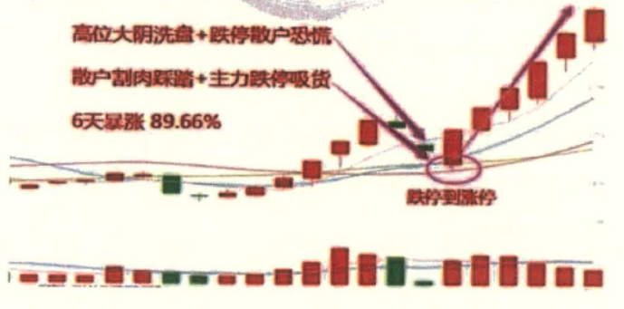

---  
title: 炒股养家心法 珍藏版 第4部分  
index: true  
icon: file  
order: 5  
category:  
  - 炒股养家心法  
  - 大A  
tag:  
  - 收费文档  
---  

## 交易的本质  

大涨的行情讲究胆量，谁的胆子大谁胜利，震荡的行情讲究节奏，做得好远远跑赢大盘，赚够整个波段，做的不好，内外打脸，比单边下跌更受伤。  

这一切都是源于心态，心态源于什么?  

源于内心的素养，源自对行情的判断，也源于你的仓位配比和操作策略。  

交易的本质是群体博弈，场内外资金的博弈。说的直白一些，就是实时的，场外的潜在买入者钱的数量和买入倾向，与场内筹码的数量和卖出倾向，当前者大于后者就买入，当后者大于前者就卖出。  

说起来比较抽象，但是对于我们判断行情的走势还是有帮助的，至少很明确的告诉一点，你所直观感觉到的方向并不一定正确。  

比如，在连续的小碎阳之后，市场一根放量大阳，所有的人觉得开启一波上涨的征程，而此时，更好的策略可能是卖出。而当市场上，出现一致性的止损的时候，短期可能反而是机会。  

或许这段话不能让你成长，但至少让你在面对行情的时候更加淡定，大多数的人，都是涨了追涨，因为感觉形势一片大好，跌了杀跌，因为恐慌。  

为什么一卖就涨，其实并非主力资金知道你的持仓，而是最后的杀跌往往是最凶残，也是最能打动人性的，当大多数的人出现止损的时候，往往离机会不远了。  

所以，认清交易的本质，有助于更加深刻的理解行情，而不别人追涨的时候你追涨，别人杀跌的时候也跟着杀跌。  

有人问，你不是说过“别人贪婪时我更贪婪，别人恐慌时我更恐慌”，没错，但是这话是放在情绪的角度上来说，情绪好时，主线明确时，敢于上仓位，而当情绪退潮，我可能连账户都不会打开，宁愿选择休息。**更多的是从个股成者板块的微观角度。不由得感叹，这个市场，最后的胜者，不一定是赚的最多的，而是活的最长的，低调才能在这个市场中长期生存，任何时候别膨胀。**  

## 想好目标再出手

看似一句简单的话，但真正做到的人不多，不少人，包括以前的我，都是随心所欲，受不了盘中的分时急拉，也受不了分时的急速杀跌，追涨杀跌由此而来。  

每个做股票的人，都要搞清楚自己的特点和目标。  

特点:你擅长做什么，你不擅长做什么？你不能做什么？  

目标:月度目标是什么?每周目标是什么？日目标是什么？  

特点决定你的介入方式，比如低吸、打板、半路，追涨，趋势。  

为何如此强调目标?因为有了清晰的目标，你才有更好的计划和执行，很多人抱怨明明知道，但就是做不到，执行无法合一，其实不仅是知行的问题，更多的是目标和理念的问题。  

一个想着追求暴富的人，自然受不了分时的急速拉升，板块的异动，而忽视了基本的客观判断。  

就像大家都学过的小猫钓鱼，看到漂亮的蝴蝶，蜻蜓，就追过去了，当你回来的时候，老猫已经钓了很多鱼。大家都从小学这个故事，但是不经意间，我们却依然在犯这样的错误。  

炒股的另一个误区是，偏执于自己的“意念”，比如某只股票你接触了很久，做过很多功课，对他情有独钟，即使是在犀利的大涨之后，开始走下坡，你依然觉得哪一天会重新崛起。  

但是，很多个股有了成妖的经历之后，剩下大多是漫长的下跌，就像东方通信，人民网这类。  

执念的另一个原因，或许因为你的股票被套，于是，卧倒不动，那么即使，大盘上涨也和你没什么关系了，每个人要清楚自己的特点，你如果做的是短线，那就是"看好买入，不看好卖出"，如果你做的是中线，那就是得分仓，分批。  

做市场的跟随者没有问题，因为短线交易者，就是要寻求市场上最强的那些热点和个股，但是这一切的前提是你得有自己的计划，而不是，盘中因为“感觉”。  
  

## 如果你想职业炒股  

之前有多位朋友提到想职业炒股的问题，觉得还是有必要强调下一些东西。每次看到这样的问题，都会觉得很矛盾，从概率的角度，我不建议任何一个人走上职业的道路，但是，另一方面，我怕我的意见又让市场少了一位Asking，所以，我只陈述我的观点和建议，供大家参考。  

从概率上来说，创去牛市那几段仅有的日子，市场上的股民，大概率是亏损，比例估计在60-90%之间，但是几乎任何一个人，在踏入这个市场的时候，都不觉得自己会成为亏损的那大多数，都觉得自己能成为剩下的10%。  

所以，建议大家，辛苦赚的钱，对股票又没有专门研究的朋友，至少大部分的存款不应修来到这个市场，要来可以，拿你资产的30%以下玩玩就可以了，如果你连30%的资产都无法做到增值，如何保证100%的资产放进来会增值?  

每个人都在寻求市场的"制胜之道"，市场上也有各种入门书籍，但是大多都是沽名钓誉之徒，并且很可能很多作者对市场完全缺乏理解。  

这个市场博大精深，任何的方法、体系都会遇到瓶颈，不同的行情，不同的阶段需要不同的方法，所以导致没有统一的"教科书"，更多的，大家都在瞎子模象，摸到什么就是什么。  

很多人都会觉得金融机构很高端，高大上，至少门面很豪华，大楼都很高，有着极高的学历，但是这和市场并没多大关系，所以，不要指望进券商就能学到什么炒股秘籍?  

这个市场的胜者，或者说“剩者”，其实都是游击队，我身边的朋友大体都是如此。  

这个市场，需要理解，需要领悟，如果对于初学者，学一些财务基础，技术分析还是有必要的，因为这能让你快速建立炒股的认知体系。  

剩下的就是学习和实践了，技术也好，理念也罢，最终的体系，都是源于你自己的理解，就像我的门徒，他们每个人的体系也不一样，因为大家有自己不同的理解和偏好。  

**几条建议:**  

在悟道之前，保住你的本金，一旦失去本金，基本宣布告别这个市场。  

多理解、多学习，把学到的变成自己的，各种方法都可以学，可以知道，但是用的时候选择一种就可以，另一种只能是辅助。  

市场是最好的老师，任何一段的行情，都有存在的价值，任何时候都不能放弃市场，学会任何阶段都要去感悟市场，并且认真记下来。  

在没有稳定盈利模式前，不要盲目专职，专职没你想的那么简单，刚开始玩的就更加不要有这个想法。  

没有什么数学公式，一劳永逸的孙子兵法，市场每天在变，方法也得变，即使是门徒总结的“术”，也只能是其中某几个方面。  

## 操作:减少路径依赖  

曾经有一年的经济学诺贝尔桨，颁给了" 路径依赖"，是指我们以前做的一个不经意的小决定，事后，就成了事务发展的路径，简称路径依赖。  

当然，当年的经济学家是用数学方法来证明的，经济学真是博大精深，这么简单的道理，也能用复杂的数学公式来证明。但刨去其他不说，当时他的这个观点还是给了我不少的启发。  

在股票操作上，路径依赖是大忌，比如这样的情形?  

你在2007年11月5日刚好踏入股市，什么都不懂的你，喜欢喝茅台，打算买茅台，当时茅台78元。但听大家说，中国石化是一个大牛股，从4块涨到28块，那天刚好中石油上市，有望延续强势，于是什么都不懂的你，买了1000股，中石油，价格48元。  

你本没打算买它，只想体验下人生的首笔股票交易，但是你的整个投资路径因它而改变，几度补仓，几度绝望，最后在30元的时候决定扔那不管，最终变成了现在的6元。  

这就是典型的路径依赖，开始你的初衷并不是长期持有，但是因为被套之后的希望和绝望的煎熬，使得后面的投资计划，全部因他改变。当下的结果，其实都是因为当初的那笔大家热议的：中石油上市。  

从此，你与富豪的距离越来越远:茅台当时78元，现在2000多元，中石油，当时48元，现在6元。  

当时你喝的是茅台，现在只能喝二锅头。  

所以，投资一定得有逻辑，卖要和逻辑相对应，比如你买的成长，那就必须考虑估值与业绩，你买的超跌反弹，必然要与技术分析相对应，买和卖就应该是简单的，看好买入，不看好卖出。  

根据逻辑所做的决策，任何时候都是对的，即使卖错了。任何一只股票，我们无法拿到整个波段，所以不要用短期的涨跌来判断对还是错。那样只会增加你自己的心理负担，导致你的判断出现偏差，这是操作的大忌。  

如果因为一两次失败，放弃了自己的逻辑，那就纯粹是赌，向来赢面极低。  

减少操作的路径依赖，任何时候尽可能的跳出持仓去看待市场，不因持仓而偏差，虽然刚开始很难，但尽量要这么干。因为这是长期活下去的基础。  

## 当下赚钱的两类方法  

当下的市场，一类股屡创新高，一类股屡创新低，如果看不透内在的逻辑，盈利就变得相当难了。  

2020年以来，指数还有不小的涨幅，但是很多人的盈利已经被抹去，甚至亏损严重，为何在上涨的时候，很难跑赢指数，下跌的时候，也大幅跑输?  

当下市场上赚钱的人，大致为两类:  

第一类:坚守价值，手持白马，蓝筹，趋势股，长期不动，或者日内差价。  

第二类:频繁跳跃，严格短线，追随热点，我的很多朋友应该是这类。  

第一类方法需要耐心，很多短线投资者耐不住，横盘3个月，甚至回踩3个月，然后在短时间内形成一次上涨，随后继续横盘。所以这类方法需要的是耐得住性子，选好个股。  

第二类方法是追求热点，上最强的热点和个股，严格止损，但是受短线情绪的影响非常大，常常伴随着大幅的回撤!  

## 亏损最多的是哪类人  

不清楚自己的定位，自己的模式，自己的操作逻辑。频繁切换模式，涨了去追涨，跌了去杀跌，不控制仓位，不认真选股，最终伤痕累累，跑输市场造成大幅亏损。  

另一类是操作上的错位，比如找了个垃圾股去拿中线，找了个下跌途中的个股去做反弹。  

做趋势的逻辑，是看好个股的稳步上行，也有良好的基本面，业绩，市场人气，交易活跃，这里更多的是右侧交易，等趋势先走出来。  

超短的逻辑是最强的热点,最强的个股,而不是找板块中涨幅最小的，因为强者恒强是常态，黑马逆袭其实并不多。  

## 每一个追求方法的人  

我的总结一般以心法为主，因为在我看来，盈利的方法有多种，但是心法是能给各种方法的人，带来新的认知和提升。  

然而，我越来越发现没有方法的局限!心法属于价值观的范畴，而我讲的术，则是方法论的体系。  

几乎每个在市场里的人，无不在苦苦寻求盈利方法，多想上苍赐给一本秘籍，然后所向披靡，实现财务自由。市场不缺乏传奇，不缺乏奇迹，每一个故事就能鼓动一帮怀揣梦想的新人入场。  

如果说经济学不是一门严谨的学科，因为任何一个经济学的理论，都存在与其截然相反的理论。那么股市，就更加是个泥潭，因为，无数的书本上的所谓"方法"，都将证明是无效的。  

我刚入市的时候，以研习技术分析为主，花了很多的时间，没日没夜的把各大派的技术分析理论倒背如流，融会贯通，然而，市场终于还是给了我教训，账户一直在缩水，腰斩。  

我知道，光靠技术分析行不通。  

很多人都知道我那段艰难的日子，也知道关于账户和奶粉的故事。  

在我最艰难的时候，即将放弃的时候，是业内的两位朋友点醒了我，给了我继续下去的信心，真是从那时起，我开始转向一个更加悬的东西：情绪  

技术分析，有很多流派，也有很多书籍，情绪，据我所知，目前都没有。但是只要是短线打法，无一不涉及情绪，而情绪分很多，包括分时图的判断，盘口的判断，板块联动的判断。  

发现很多人都很上进，但感觉无从下手，有的甚至完全走偏，所以，今天给苦苦寻找方法的人几个建议:  

1、技术分析，必须得学，这个是每一个入场操作者的基础，技术分析可以很粗浅，比如均线、箱体，也可以很深奥，比如可以写一本书的四度空间理论。还有一些，目前只能靠影印本才能买到的绝版书籍里面的方法。  

2、技术分析，不能光学些。更要学习每一个技术形态后面的逻辑，以及衍生出来的情绪判断。不能死读书只认形态，而要知道出现每个形态的原因和逻辑，如果能到这一层，大体就孺子可教了。  

3、更深入的一些，是要学习盘口和分时图的判断，这个对于短线选手，至关重要，但是世面上现有的书籍，多半也是泛泛而谈，因为没有实战的经验，多半是事后的推演。  

4、交易体系，这是我最注重的东西，也是每一个成功的交易者必须具备的因素，至少我身边的朋友是这样。方法可以不同，低吸、打板、半路、都不是问题，因为不同时期，本身会有不同的选择，但是都有自己的交易体系。  

关于方法的问题，基本的方法，网上有很多，可以多学，但是不能简单的硬搬照抄。关于更深入的方法，一靠自身顿悟，二靠他人指点，如果有人给你一套实战检验过的交易体系和一只大牛股，相信每一个清醒的人都会选择前者，即使付出巨大代价，因为前者可能会给你带来质的变化，他的价值远不是一只牛股所能给的。  

而现实中，却未必，大家更关心的可能是代码，而不是思路。  

你之前的选择，决定了你现在的账户状态，而你现在的选择，会进一步拉开一年后的账户差距。  

静下心，沉住气，稳住阵脚，在行情没有来临之前，做好该做的准备。学东西，不仅是为了当下，更是为了明天!  

## 为何要了解打板  

众所周知，我从来不建议各位去参与打板。并不是我反对打板，我的体系里，打板本身占据很大的比重，我的门徒多半也是打板为主。  

之所以在这里，一直反对大家打板，是因为很多人完全没有章法，而打板，是很难提前提示的，因为板块的情绪只有在盘中才能真正体现。  

相反，提示下一个板块的轮动，这个没啥问题，只要细心去察觉，还是能找到一些方向。  

凡是参与低吸的人，我想至少收益是正的，但是，打板，还是建议每个人都要去学，这个看似矛盾，实则并不。  

**学习打板的意义主要是在以下几个方面：**  

1、涨停是市场上，情绪最集中的地方，只有涨停才能带动板块的情绪，所以，学习打板，能够更能把握市场的情绪在哪里。  

2、有人说看“今日情绪”就可以了，没错，但是简单的几家涨停，并不能说明板块的真正强度，更重要的是，板块里面的高标，龙头，后期跟风的表现如何了。所以，学了打板，可以更能认识到板块的情绪扩散与消退。  

经常有人打了跟风板之后说“打板***错在哪里?”虽然原因很多，但是基本是对板块的情绪、龙头的情绪把握不到位。  

3、看得懂打板，看得懂龙头股的封板力度，看得懂龙头的情绪分歧，才能更好的把握分歧转一致的机会，很多时候的分歧转一致，很可能是低吸的机会。  

说来说去，其实让大家学习打板，并不是为了让大家用打板去生存，这个因人而异，风险也相对较高。而如果你看得懂打板，你的低吸、你的操作就更有针对性了。  

比如，低吸不会再没有方向，短线最忌讳的是“**退而求其次**”，某个板块涨了，你却找了个板块涨幅的最后一名，心理上觉得安全，但是很可能是涨的时候没他的份，跌的时候，不输给任何股。  

张无忌为何能在短时间内学会乾坤大挪移?因为他有九阳神功为基础，有了九阳神功护体，学起乾坤大挪移，就简单了很多。这里的打板就像九阳神功，低吸类似乾坤大挪移。这个比喻不一定恰当，但是理是这个理。  

打板，学打板，不一定是为了用打板，而是让你更深刻的理解这个市场，理解市场情绪，**理解题材之间**的联动关系，核心目的还是为了更好的让你去低吸，这毕竟是成本相对低的盈利方法。  

打板的术语很多，首板、二板、分歧板、缩量板，加速板，包括之前一直强调的短线高度周期，也是把涨停板作为参照的。所以学习这些会有助于大家的操作。很多的实战方法都是打板之后的延伸，因为涨停是情绪的最集中的体现，短线就是寻找市场上活跃度最高的个股作为标的。  

但是，我还是那个建议，对于大多数人来说，看得懂即可，不建议大家去操作打板，但方法还是要学的，这是武学上层。  

打板和超短，技术是次要的，重要的是短线情绪的判断。短线情绪，简单的理解，就是市场上最激进的那部分资金，是否愿意去参与高标，接力高标。  

而他们的接力意愿从哪里来，意愿来自赚钱效应，当一个追涨的动作，能够获得正收益的时候，会刺激他们继续去做这样的事情，体现在盘面上，就是连板的个股多，封板率高，高标股的涨停板数量多。  

而当市场上，龙头股的涨停板数量在降低，接力情绪就会随之下降。比如某个龙头股的高度是6板之后就被砸了，那么后面上来的个股，大家在5板的时候就会不愿意去接力，怕重蹈覆辙。情绪随之下降，降到4板，3板，甚至极端的时候，出现没有连板股。  

这种时候不是绝望的时候，往往是出现新的高标的时候!  

观察今天的市场，短线高度是否降低，目前降到几板，封板率在下降，炸板率非常高，如果接近50%，这样的环境下，打板的要谨慎参与，高位股更要谨慎。  

所以做短线的人，特别是打板的人，必须每天记录长场内高标的高度，以及封板率，涨停家数。你会发现，这是一个循环。  

## 下跌行情，你该做什么  

其实，很多人，包括很多专业机构，也无法准确判断大盘的精确走势。但是专业的和业余的有个最大区别是：专业的都会有预案。  

在行情上涨的时候，脑子里有跌的预案，如果一旦发生下跌就有应对方案。但市场情绪转弱的时候，也会有预案，什么位置加仓，加多少，加什么。其实，长远来看，涨跌是市场的常态，一直上涨不可持续，一直下跌也不可持续。  

这是市场的情绪热度统计，箱体运动的迹象还是很明显的。  

为什么说平稳的心态是短线操作的前提，那些动不动满仓的，究其原因是什么?终究还是心态崩了。那些盘中割肉，去追另一只个股的人，在想什么?在想如何扳回之前的亏损。  

所以，你是否走向成熟，是否能在这个市场长期生存，首先看你涨跌时候的状态。上涨的时候兴奋，看到上涨的股都是"别人家的"，满仓追涨。下跌的时候，满仓被套，这样注定只是一个结局：别人在赚钱，你在等解套。  

**所以下跌的时候，该做什么?**  

做预案，清晰的预案，当行情出现什么情况的时候，我的仓位要控制在多少?当行情出现什么情况的时候，我的仓位必须保持在多少以下?哪怕你对某只个股再看好也是一样。  

**很多人不懂交易体系是什么?大概就是这样，有预案，有控制，有选股，有操作，有回撤控制。**  

当然，为什么很多人注定不会有交易体系，因为没有稳定的心态，所以，注定执行不了交易体系。  

下跌的时候，场内的人是煎熬，场外的人是机会，重仓的人是茫然与绝望，轻仓的人是机会与希望。  

所以下跌的时候，要记得行情上涨的时候，因为跌多了必涨，如果你满仓了，也就只剩一条路:等，获胜的概率是随机。如果你有仓位控制，那是应该做好该做的功课:哪些在涨，上涨之后怎么样了?哪些抗跌，哪些个股能够逆势?能够逆势的逻辑是什么?  

所以，**下跌的时候，不要闲着，不要发呆，更不要骂娘，做该做的事情。**  

## 如何判断机构介入  

机构的投资，注重盘子中等偏上的，机构的投资其实是机械的，必须要有逻辑的支撑，没有逻辑的支撑，机构是不会参与的，毕竟那些都是成熟的金融精英组成的团队，思考问题，推导问题都要严格服从逻辑。  

那么机构的逻辑从哪里来?机构并没有那么多的精力自己亲自调研，因为一个行业几十家上市公司，调研不过来。那么，很简单，其实和我们一样，接从券商的研报里来。  

所以，哪些票可能有机构的介入，很简单，券商研报重点介绍的方向(逻辑正宗) + 走势趋势很好 + 盘子稍大(30-100亿)。另外一个就是龙虎榜的数据。  

如果符合以上条件，加上有基本面的支撑，趋势走的很好，很可能就是有机构和资金合力参与的。  

## 我与股市的十年  

有人问出了一个拷问灵魂的问题：十年里，股市涨了一点，你收获了什么?失去了什么?  

十年的时间里，发生的变化太大了：最容易被人拿来比较的就是房价，十年间，房价涨幅:少则3 倍，多则10倍。  

这是逝去的十年，也是沉沦炒股的人不断被鄙视的十年，2009年，在经历了07-08年的牛熊之后，迎来一波反弹，但是那却成为未来几年的最高点，2014-15迎来一波疯牛，之后却是无尽的深渊!  

十年前，我刚刚尝试从08年的阴影里走出来，从账户腰斩的阴影中走出来，尝试建立自己的操作体系，2009年，是第一次让我建立信心的年份。经历了07的膨胀，08年的腰斩，09年才逐步找到自己的方法。  

十年间，当时的小孩已经长大，但是当年每天计算亏损多少罐奶粉，依然历历在目。所以我很理解大家的一些境遇和心情，因为我曾经也是和大家一样的遭遇，甚至比很多人“更惨”。  

如果让我再做一次选择，我不会选择这条路。但是上了贼船，没有那么轻易下去，初入市场的我们，总是有各种不服气，不服输，直到被市场教训得没半点脾气，心痛也能安然掩饰，大跌依然能够挤出笑容，看起来没心没肺，并不是没有伤痛，而是都在内心深处。  

当然，回头来看，如果说十年间有什么大的感悟，那就是:每次经历都会成为自己的财富，每次学习，都能增长自己的见识，如果暂时用不上，也会在不经意的时候帮上你的大忙。  

如果你已经深处这个市场，那么唯一的路:就是通过自己的努力走好它，不断的进步，不断的学习，不断的积极向上，不断地稳定自己的心态，完善自己的情绪，从小目标做起，而不是抱着一夜暴富的美梦。  

凡事预则立不预则废，不是等到机会来了，才去做准备，而是时刻准备着才能更早的看到机会。不是指数十年不涨，我们就过的心安理得，我们要做的目标是:除去股灾，每月都有5%的利润，很多人不屑这5%，谁数学好，可以结算下月5%滚动10年是多少倍。  

所以资产增长的关键不在某月收益率的高低，更重要是复利，是回撤，控制回撤，即使不赚钱，也要控制风险，很多人不理解我说的“绝对不能把盈利做成亏损”的意义，觉得很多个股，都会有强势洗盘，洗盘之后都创了新高。  

没错，问题是，也有多少个股，在跌回你的成本之后，一路向下，盈利不走，小损不甘，大损下不了手，最后变成巨大的回撤和被动。在我看来，稳定盈利远比不盈利更重要，但很多人想不明白这一点，想不明白自然也执行不到位。  

十年时间，指数没动，大家的账户自己明白，革命尚未成功，同志仍需努力。我不散布什么成功学，我们只需踏踏实实做好自己的事。十年已经过去，风水也会轮流转，下一个十年，从把握当下开始。  

## 交易是一场修行  

交易如棋  

棋盘上博弈的是棋子，实际上较量的双方的内心。  

市场里，博弈的是人心，是情绪，更是自己内心的欲望和贪念。棋盘上没有永远的赢者，市场上没有永远的胜者，所谓的胜者，更多的是"剩者'。因为"剩者'终究成为"胜者"。  

市场上的刀光剑影见的多了，往往容易鬼略了交易的本质，交易的本质并不是披荆斩棘，所向无敌，而是把握机会，精准出击。  

交易没有永远的赢家，每一笔交易在打出去之前，都是充满不确定性的，每一个背负交易的人，都活的战战兢兢，禹禹前行。只是有人豁达一些，有人的迷茫一些，有人找到了方法，也有人完全没有章法。  

每一个没有找到方法的人，既怕又爱，既期待又担忧，在场一日、纠结一日、痛苦一日、希望一日，恐惧一日。谁不曾在这样的日子里恐惧里轮回。  

交易如修行，得时刻保持自己内心的定力，清楚自己擅长什么，知道什么，操作方法是什么，体系是什么?而不是一山看着一山高，山外青山楼外楼。  

定力的另一方面，来自于内心，慢涨拿的住，操作也很完美，一旦遇上大涨，心态开始爆炸，觉得自己悟道了。或者当你遭遇了一笔交易的失败之后，心态崩塌了，你的赌性占了上风。  

所谓的交易交易体系，无非是用一系列的方法组合，比如开仓规则、控制回撤规则、仓位管理规则等方法，把你内心的肆意挥洒变成机械的重复。从数学的角度来说，就是路径最优原则。  

交易的方法和赌法，完全不一样，赌，重要的是随机，看的是运气，最终决定的是概率。交易做的是你自己有足够的选择权，你愿意站在哪边?  

市场本是一个合法的资产转移工具，在几乎没有门槛的市场里，各种类型的人们进行着合法的财富转移，你是转入的那一方，还是转出的那一方，完全取决于你自身的素养和认知。  

没有门槛恰恰成为最高的门槛，你的付出，你的学习，你所经历的苦，你所经历的痛，最终都会成为你交易当中的一部分，沉淀下来，决定你的操作习惯，操作风格，操作手法。  

不同的是，有的人，交易手法越来越完善，越来越纯粹，也有的人，经历了漫长的经历，交易依然随心所欲，没有章法，即使侥幸盈利，最终还是还给市场。  

最后，"剩者"就成为了为数不多的那部分"胜者"。  

从迷茫到痛苦，从痛苦到寂寞，从寂寞到无敌，这条路确实很艰难，如果你认定走这条路，那就时刻提醒自己不忘修行，不忘学习。他山之石可以攻玉，可能一个不经意的机会，会带来质的改变。当年迷茫的我，也是偶然间得到了实战派的指引，才使得自己的修行上了一个台阶。  

每一个背负输赢禹禹前行的灵魂，在场一日，纠结一日，痛苦一日，希望一日，恐惧一日，谁不曾在恐惧里轮回?谁又不曾在贪婪里沉沦?  

最终的胜者，或者说剩者，所谓的悟道无非是，看山还是山，看水还是水，返璞归真，回归本源，阅尽千帆，洗尽铅华，找回属于自己的初心。  

## 写在最后  

每个看似轻松的人，他身后都背负着不为人知的努力。这个市场很公平，谁都能进来，几乎没有门槛。这个市场也很残酷，总是一部分人收割另一部分，要么是收割者，要么是被收割者，你总要选择一个角色。  

支撑你一直走下去的，无论是前方梦想的光芒万丈，还是身后的万丈深渊，少一些浮躁，多一份坚定，对待市场，我们时刻热泪盈眶，对待自己，我们永远积极向上，坚定走好每一步，才能让我们走的更远。  

祝每一个看过《养家心法》的股民都有大大的收获，带着一份感恩毫无保留分享，每字每句都是这十几年股市血与泪的总结，希望助你悟道，大获丰收!  

如有不明QQ:3176316478助力成长!  
感恩是我们在股市成长的法码!  
