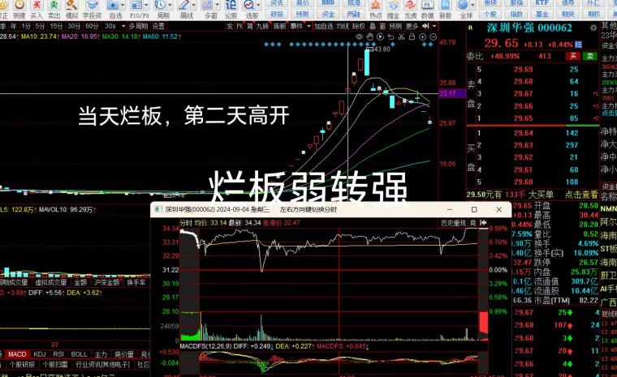
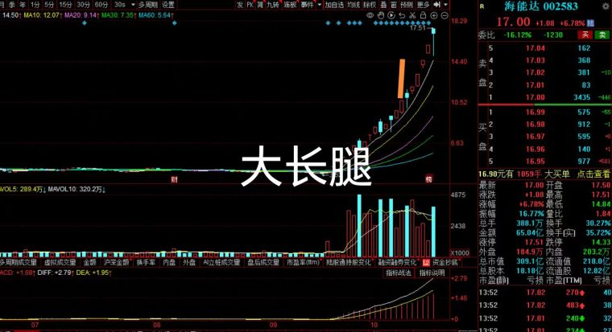

（[原帖](https://www.taoguba.com.cn/Article/6315840/1)发布于2024-10-24）  

## 1.股票预期的构成（什么是超预期、符合预期、低于预期）

做股票对板块、对股票的预期至关重要，因为预期对账户长虹，预期错账户腰斩，预期二字就是稳定盈利的前提，作为开篇。  

什么是预期，就是对大众对股票的期望值，股市里有多方、有空方，有看好的、有不看好的，股市只要开市多空双方博弈就是永恒的命题，也就构成了预期差。  

多方在有利的环境会成为多头，在不利的环境下又会成为空头，两者之间也在不断的转换，对股票的预期就要随着超预期、符合预期、低于预期不断变化，如何应对这三种预期就是对一只股票多空双方的心态有及时的洞察。  

有了这个认识才不会教条，才会明白股票预期不是一成不变的，而是会随着竞价的高开等等会有所改变成为超预期，也会随着竞价的大幅低开成为严重不及预期。  

超预期为什么要买，本质上是这只股票内部多方暂时占优，空头节节败退，一天内多头主导。  

低于预期为什么要卖，同理，本质上是这只股票内部空方暂时占优，多方节节败退，一天之内空头主导。  

所以在只能做多不能做空的a股，超预期就显得极为重要。  

从哲学角度来讲，多空双方的矛盾一直存在，相互斗争是绝对的，至于跌停还是涨停都是相对的，由多方占优还是空方占优决定。  

**（1）超预期、不及预期本质**  

日常生活中的超预期很多，举个最简单的例子，本来应聘一个工作，心里预期是5000，老板说看你不错直接给你8000，这就是超预期，因为超心里预期值，如果觉得你是不可多得的人才，直接给你开12000，那就是大超预期。  

反之觉得你也就是个普通人才，相比其他人还略有不足，有可能直接给你开4000，距离你的心里期望值低1000，那就是低于预期，如果觉得你不符合岗位需求，直接开2500，爱来不来，就是大幅低于预期。  

开8000、12000，你的心里会怎么想，肯定兴奋加激动，同理股市上本来买的一只股票昨天断板，第二天反而高开，大众的心里会怎么想，肯定是在场内的锁仓，在场外的抢筹，造成股票供不应求，从而涨停，第二天还有很高溢价，这是超预期的本质。  

反之给你开2500，那严重低于你心里的预期值，肯定失落加愤怒，同理股票如果当天硬板，第二天反而大幅低开，大众的心里会怎么想，肯定场内的都开始卖卖卖，场外的用脚投票，有可能瞬间秒跌停，第二天还可能跌停开，这是不及预期的本质。  

归其根本，超预期与不及预期都是场内场外人们心理的变化所致，才导致不同的结果，在a股来说超预期就相当于抢筹，不及预期就相当于抢跑。  

**（2）符合预期**  

符合预期不用多提，本来你的预期工资是5000，老板给你开5000就死符合预期，符合预期就不存在预期差的问题了，就是正常的多空双方博弈。  

符合预期不要上头，低于预期要抢跑，超预期要抢买，这是最简单的预期差。  

**（3）小结**  

超预期的本质是超出人们的期望，导致场内场外都看多，导致抢筹；低于预期的本质是严重低于人们的预期，导致场内场外资金都看空，导致抢跑；符合预期是正常的预期，符合场内场外人的心理。  

三种预期代表三种心理，有时候也说要时刻揣摩场内场外人心理的变化，就是这个意思。  

## 2.超预期的三种表现形式（断板弱转强、烂板弱转强、大长腿）  

第一节从本质上给大家阐述了超预期、低于预期、符合预期的本质，相信大家有了基本的概念，同时应该对预期差这三个字有了一定的明悟，接下来聊一聊超预期的三种表现形式，也会用最近的案例分析分析，大家以后就知道什么情况下是买点，什么情况下是卖点。  

**（1）断板弱转强**  

断板弱转强，顾名思义，就是前一天一只股票断板，第二天预期本来是核按钮，结果第二天竞价高开或者平开，开盘后快速上攻冲上涨停。  

这种涨停一般是缩量涨停，因为前一天断板基本都是放量分歧断板，里面的资金意见不一致导致放量断板，第二天的缩量涨停也可以理解为资金在思考了一晚上后的主动引导。  

引导的资金不论出于解套的目的，还是非常看好股票的目的，当天是有真金白银流入的，这样才能再次吸引场外资金入场，同时场外资金入场与引导资金形成合力再次封板，这是第二天超预期封板的资金底层逻辑。  

断板弱转强例子很多，拿最近的大众交通、深圳华强、常山北明、海能达举例说明，大家可能更有深刻感受。  
  

**（2）烂板弱转强**  

烂板弱转强，顾名思义，是前一天股票封涨停板，但是反复炸板，或者涨停时间较晚，特别是两点半以后涨停的股票，第二天的预期一般就是低开预期了，因为烂板也相当于股票内的资金严重分歧，这里分歧和断板量能上表现基本一致，基本都是放量分歧，本质上就是场内资金的态度不一致导致。  

正常低开，如果高开就是超预期，开盘后资金迅速上攻冲上涨停，也可以理解为场内资金的刻意诱导，第二天在场内场外资金的共同合力下经常缩量涨停，第三天通常又是高开。  

聊到这里，细心的朋友应该发现了股票量能的变化，无论是断板弱转强还是烂板弱转强，只有量能不会骗人，烂板与断板由于分歧，当天都是放巨量，第二天弱转强基本都是缩量，这样的涨停可以放心去打。  

里面体现了场内外资金人心和合力的变化，放量分歧资金意见不统一，第二天缩量涨停是场外场外资金的共同合力。  
  

**（3）大长腿**  

大长腿顾名思义就是当天股票低开，开盘直接冲涨停，形态上来看当天涨13、14、15个点，并且是直线拉涨停，也是缩量涨停，这样的涨停板称之为大长腿。  

形态上和断板弱转强、烂板弱转强有区别，但是本质上没有区别，从量能上看依旧存在共同的地方。  

那就是前一天依旧是放量涨停，第二天依旧是缩量涨停，这是共同的地方。  

这些细节总结出来的经验才有用，我是在21年以前炒股生涯经历了大量的失败总结出来的共性，之后大家看完本篇可以自行总结，相信每个人都会大有提升。  

大长腿第二天依旧缩量涨停的本质仍然是合力，场内资金的引导与场外资金的共同合力。  
  

**（4）小结**  

断板弱转强、烂板弱转强、大长腿，形态各异，大家长时间积累下来就会发现共性，那就是放量分歧，缩量一致的规律，本质上体现的是资金的规律，放量分歧原因是场内资金想法不一样，有的想买、有的想卖，形态上就表现为放量。经过一晚上的发酵，场内资金的引导加上场外资金的进入往往会形成合力，这时缩量涨停体现的是场内场外资金的共同合力，所以往往缩量涨停，这是背后资金的规律。  

弱转强是买点，其实本质上买的是合力，明白了这个道理，都会事半功倍，否则南辕北辙。  

## 3.什么环境下的超预期是超预期，什么环境下的超预期是诱多（大多数人亏钱的误区）  

超预期买，低于预期卖，也要区分环境，因为有时候超预期是诱多，退潮期或者做板块内中位股超预期，有可能账户会直接腰斩。  

每一种模式都有它对应的环境，晴天太阳东升西落是规律，阴天就没有太阳出现，哪来的东升西落。  

股市中只有大题材大周期存在超预期，小周期由于不持续，往往一两天就结束，不存在超预期。  

大周期存在超预期，主升期超预期是真正的超预期，主跌期超预期又是致命毒药，因为主跌期所有资金都在卖卖卖，场内资金都在拼命逃离，竞价任何的超预期高开，都是诱多。  

**（1）什么环境下超预期是超预期**  

相信看了上述文字的朋友已经意识到环境的重要性，环境是当天的路况，开车要看路况，股市为什么那么难，就是因为股市每天的环境多种多样，比如有千股跌停、百股跌停的极端环境，也有千股涨停、百股涨停的赚钱效应环境，也有持续情绪冰点的环境，也有持续赚钱效应的环境，也有时好时坏的环境，环境就好比我们开车时候的路况，永远要看清环境，安全行驶，遇到障碍物要绕行，遇到陡坡要缓行，遇到涉水路段要一停二看三决定要不要通行。  

知道了股市每天遇到的环境是不同的，大家就要有意识的去判别每天的环境，也有很多人叫盘感，就是对各种环境的判别，看懂了再上路无疑会轻松很多。  

这一章节小白是看不懂的，即使看懂由于自身没有经验，没有经历过各种各样行情，所以如果刚入市几个月，建议多看少动为妙，前期先积累，后期再爆发。  

环境多种多样，超预期的环境大致有以下几种环境。  

1）有大主线题材，处于大题材的主升期，核心个股断板反包、大长腿、烂板弱转强等超预期是超预期，资金容错率高，弱转强第二天通常也会有很高的溢价，比如最近的海能达，不断超预期，反包小王子。  

2）市场量能在万亿以上的环境下，容错率好的环境下的核心个股，会不断超预期，可以反复参与。  

3）万亿以下量能的环境下，由于突发消息或者利好的情况下的独立个股，比如之前原材料降价利好刺激走出的正丹股份，有底层逻辑的股票。  

综上，超预期的环境要么处于主升期，要么有个股不断带领板块走强，这样的环境下超预期是正确的选股方式，用好了超预期这个武器会所向无敌。  

**（2）什么环境下超预期是诱多**  

这一点至关重要，因为超预期与诱多在股票形态上体现不出来，形态相同的个股在不同环境下会走成不同走势，归其根本是环境不同，主升期环境下核心个股超预期不断走强，带领板块不断走强。  

退潮期同样形态的个股，超预期却会被大资金利用反向出货，这是的超预期就是诱多。  

理解了上述这段话，就会深刻理解到为什么有很多选手刻舟求剑，固定的做一进二、二进三、三进无穷，胜率反而很低很低，因为环境每天在变化，形同而势不同。  

1）退潮期竞价高开是诱多  

退潮期就是板块内部出现大面积跌停，核心个股反而第二天高开这种情况，试想板块内中位股吹哨出现很强的亏钱效应，这种情绪会由低位传导到高位，这时如果高开也会被恐慌资金毫不留情的兑现，有时候甚至当天按跌停，这时候的竞价超预期就是诱多，大家永远不要重形，而是要学会判断环境。  

2)前面一字板很多，筹码断档，高开是诱多  

第一种诱多是最普遍的诱多，因为每一轮周期退潮期只会迟到，迟早会到来，大家要学会规避，第二种诱多是前面一字板太多，突然断板，第二天弱转强高开，这时由于前期获利盘太多，资金会不计成本疯狂出货，即使当天环境好也无济于事，因为获利盘太多，这种情况下也会诱多，大家也要注意规避。  

3）前方有很强的压力位  

前方有很强的压力位，也就是套牢盘形成的压力位，这种情况下超预期有时候也会演变成诱多，这种是本博主十几年经验依旧不可把控的诱多，因为21年之前吃了太多这种的亏，所以目前这种有严重套牢盘，前方有压力位的股票本博主都避而远之，因为一个股票想走出来也要看是不是有资金砸盘，前方有压力位的股票，套牢盘一到了成本线都会砸盘解套，如果当天做多的资金实力不雄厚，当天也会被砸的七零八落。  

综上，根据本博主经验，处于退潮期、前方一字涨停板太多、前方有压力位套牢盘，这几种情况下超预期就是诱多，退潮期是所有资金都在卖卖卖导致超预期变成诱多，前方一字涨停板太多是有太多获利盘卖卖卖导致，前方有压力位套牢盘是套牢盘到了成本线解套卖卖卖所致，这三种是大家平时可能遇到最多的情况，本质都是资金卖卖卖所致，大家要注意判别，而不是看到超预期就当抢筹，这几种情况下的超预期都是资金抢跑，不同环境下意义不同。  

**（3）小结**  

以上本博主总结了超预期抢筹的几种情形和超预期抢跑诱多的几种情形，都是经验的结晶，理解了本质之后大家遇到对应的情形要学会去判断，不同的环境下超预期的意义不一样，从心理层面大家就要高度重视，永远要根据客观环境变化而变化，相同k线走势的股票最终会因为环境的不同走出不同的结果，所以永远不要刻舟求剑，不要做固定模式的一进二等等，因为最后大家都会发现环境永远是第一位，对的行情猪也能飞上天，错的退潮期再多努力也是徒劳，学会判断环境然后再判断超预期。  

## 4.临盘如何判断一只股票超预期，学会看竞价（学会用联系的眼光看股票）

以上三章跟大家聊了什么是超预期、符合预期、不及预期，以及超预期三种表现形式，超预期抢筹与超预期抢跑的几种情形，相信大家对超预期有了基本的概念，以前对超预期有经验的朋友相信会明白超预期的本质，接下来聊一聊如何临盘判断，知道了本质也要在盘中会判断，这才是更加重要的。  

临盘本来就是一个大的命题，长时间临盘积累的经验会形成盘感，那么怎么临盘做交易，判断行情，接下来详细聊一聊。  

临盘本博主一直认为是对复盘计划的修正，所以首先大家要做好复盘，如何复盘手机操作手册里面都有，这里就不细说，大概说一下。  

复盘最重要的是复当下的主流题材，主流题材处于周期的哪个节点，是赚钱效应周期还是亏钱效应周期，是赚钱效应初期、中期还是末期，是亏钱效应初期、退潮加剧冰点期还是退潮末期，主要根据主流板块内涨停板、跌停板数量以及最高板高度判断，这样对当下的周期节点做一个相对准确的定位，这是第一步。第二步根据当下的周期节点对下三日的周期节点做一个大致推演，比如当下是退潮初期，后三天周期节点就是退潮加剧冰点期、退潮末期冰冰点期、延后。  

这样复盘清晰明了，对当下的环境有了大致推断后，第二天看盘会事半功倍，临盘看竞价仅仅是对复盘计划的修正，这一步不可省略，因为做任何一件事情，成事的关键是要有充足的准备和周密的计划，否则永远是空中楼阁，落实不了，复盘就是充足的准备和周密的计划。  

第二天根据竞价动态修正三日预判，这部分内容也在三日预判里有写，这里就不赘述，简单提一下，复盘推演是静态的三日预判，竞价根据竞价情况要及时修正三日预判，因为股市最大的确定性就是股市的不确定性，突发的利好利空都会改变市场原来的预期，这时就要根据竞价进行动态的修正周期节点。  

比如复盘板块内龙头断板，板块内跌停板较多，那么复盘周期节点是退潮期，第二天应该是退潮加剧期，但是第二天板块内跌停个股不但没有核按钮，反而高开反核的有不少，那么就要修正昨日静态的三日预判，预期是退潮加剧期，但是实际是赚钱效应延续，昨天仅仅是比较大的分歧，那么修正后的周期节点应该是赚钱效应延续周期，直到真正退潮到来。  

永远静态复盘与动态看盘，静态三日预判与动态三日预判结合，所向无敌，因为能准确把握当下行情，预判风险就轻仓或者空仓，预判机会就大胆上仓位，这样才是正确的方法。  

**（1）临盘判断超预期基础**  

盘后复盘，明确周期节点后，对核心个股做一种预期，这个预期是基于复盘和当天收盘的表现，举几个例子，比如一个股票当天一字涨停板板，第二天正常预期依旧是一字板，如果第二天是一字就是符合预期，如果仅仅是高开，就是不符合预期，如果是低开，那么就是严重不及预期，要果断卖出。  

再比如一个股票当天断板、烂板，第二天正常的预期是低开或者核按钮，如果竞价高开或者平开就是超预期，如果大高开或者一字涨停板开那就是大超预期，如果依旧是低开那就是符合预期，如果一字跌停开，那就是严重不及预期。  

两个一正一反的例子，道理都是相同，有了这样的认识才是临盘判断的基础。  

**（2）如何临盘判断方法**  

因为本博主是用手机看盘，当然21年没稳定之前都是电脑看盘，后来真正明白股市运行规律后，就无所谓电脑看盘还是手机看盘了，最重要的是洞悉规律、掌握规律、运用规律。  

因为a股9.15到9.25是集合竞价时间，这段时间就要开始看盘，特别是要注意9.15开出来的开盘价，是超预期还是低于预期，基本开盘那一刻就决定八九不离十了，手机操作手册里面有对开盘怎么看盘的讲解，这里也简单提一下。  

首先打开软件，先看板块涨幅，再看个股，板块是一类股票的集合体，反应的是整个板块的综合表现情况，板块大涨五六个点或者七八个点，证明当天资金选择进攻的方向就是这个方向。  

之后再挑选板块内股票，如果板块内有大单一字涨停的股票，那么就更加能够确定，当天炒作的就是这个方向，这样事半功倍。  

这样板块内弱转强的股票大概率是可以参与的，因为整个板块环境较好，可以认为板块情绪是可以的，这是选股票的步骤。  

竞价25分开出来开盘价，如果板块没问题，个股昨天烂板、断板，今天高开，那么可以判定为超预期，只要不是退潮环境，竞价就可以先关注一笔，之后开盘如果迅速上拉，基本就可以确定股票会涨停，因为竞价的高开已经消化了想卖的资金，场内场外资金共同合力，这样其实就是合力涨停，这样的超预期弱转强第二天溢价也会很高，这是买股票竞价判断的方法。  

如果买了一只股票断板，第二天判断卖还是格局，同理，竞价超预期要格局，低于预期要卖出，因为低于预期如果不卖，大概率还会卖到更低点，因为低于预期会形成资金踩踏，曾经遇到一些人亏几个点低于预期舍不得割肉，结果亏十几个点、二十几个点割肉，这就是不明白低于预期会发生什么事，相信大部分都有这种经历，如果有的话看过此篇，超预期吃肉要格局，低于预期要及时退出，铭记心底，可以保住本金复利增长。  

**（3）学会用联系的眼光看股票**  

股票不是单独存在的，同板块的不同股票都是相互联系，相互影响，比如核心、次核心、中位股、首板内部都有联系，赚钱效应周期时是以点带面赚钱效应发散，亏钱效应周期时是以点带面亏钱效应发散，是牵一发而动全身的关系，所以要学会用联系的眼光看股票。  

比如看到板块内有大单一字涨停的股票，就要联想到赚钱效应会发散，从而在同板块内寻找容量核心，可以参与容量核心，此时由于大单一字涨停板的示范效应，同板块内会有资金参与板块的中军，也就是大市值个股，资金都想到一起，就会形成合力，这是正面联系。  

再比如板块内有一字大单跌停的股票，这时亏钱效应会发散，这时要规避同板块内的所有个股，以免殃及池鱼，如果手里有同板块个股，及时卖出为妙，因为这时亏钱概率最大。  

一正一反的例子，截然不同，带来的结果也不同，学会用联系的眼光看同板块内的不同类型股票，也就会游刃有余，有赚钱机会及时参与，亏钱效应巨大，及时空仓规避。  

**（4）小结**  

做好复盘，做好静态三日预判，第二天动态修正三日预判，用联系的眼光看待个股，积累经验，久而久之，相信大家都可以越做越好，生活中任何一件事情都会牵一发而动全身，因为事物都是相互联系、相互连接，没有孤立存在的事物，这是哲学上的概念，股市更是如此，都是背后的人在参与，就会发生联系，所以永远用联系的眼光看待个股，就会看见全局，从全局看股票，股票就会一目了然。  

## 5.超预期买，低于预期卖，遵守纪律，复利增长  

大家回顾最近大众交通、深圳华强、海能达、常山北明的买点，包括更加久远之前，就会发现这些股票的特性，都是每轮周期的核心个股，也是在核心个股弱转强、分歧一致的时候参与的，每次反包节点，第二天都会有很好的溢价，其实就是分歧转一致，其实就是场内场外资金合力的结果，通过对弱转强的心理包括资金剖析，相信大家都明白了弱转强的本质，就是合力，所以第二天通常才有高溢价。  

同时聊了超预期适用的环境，为什么有的时候超预期是超预期，有的时候超预期反而成了诱多，相信大家也明白了不同环境下超预期不同的含义。  

最后从实盘角度、复盘角度、看盘角度，聊了如何竞价去识别超预期还是诱多，学了之后大家要去运用，慢慢就会对行情预判越来越准确，投资也会越做越好。  

**（1）超预期买**  

超预期其实是反人性的交易，因为断板、烂板的股票第二天大概率都是被核，场内资金抢跑的比往里冲的多，所以这种交易往往少数人赚钱，但是真实的交易里，只有超预期是买点，不及预期都是卖点，用好超预期、看懂超预期、看懂合力，本博主相信大家都可以在这个残酷的股市稳定盈利。  

对于超预期的买点是竞价买、半路买还是打板买，其实只要是主升环境下的超预期，这几种买法都是正确的，因为超预期往往手慢就买不到。  

**（2）低于预期卖**  

低于预期，很多人看见竞价严重不及预期，本来只亏几个点，最后都变成亏十几个点、二十几个点，就是不知道严重不及预期资金会形成踩踏，这时候要及时离场。  

反观严重不及预期，这个市场上还有人往进冲的也大有人在，看完本篇的朋友可以多看几遍，弄清楚本质，才能看懂预期，做对预期。  

**（3）总结**  

超预期买，低于预期卖，在任何市场都是适用的法则，因为做交易背后是人，人有趋利避害之心，超预期买买的是资金合力进攻的合力，低于预期卖卖的同样是资金共同踩踏的合力。  

走过一轮又一轮周期，一个周期永远有赚钱效应爆棚的前半段，也永远有亏钱效应爆棚的后半段，永远在赚钱效应周期上仓位，永远热泪盈眶，永远在亏钱效应周期减仓位或者空仓躲避风险。  

多做超预期交易，简单的事情重复做，重复的事情用心做，用心的事情坚持做。久而久之，本博主相信大部分人都可以在这个残酷的股票市场走出来。  
