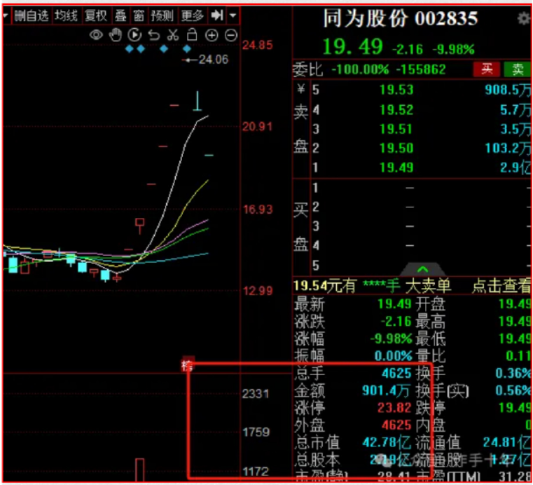

## 如何选股

（该原始文章发布于2024-4-23）

**选股选股，选股的前提必然围绕你自身的交易模式做选择**；

有人喜欢做大容量中军，有人喜欢做连板小票套利，有人喜欢做板块龙头;

选股一定是围绕自己的交易策略做选择，围绕你的交易模式来缩小标的选择的范围；

以老杨为例，老杨喜欢做连板龙头，既然是连板龙头首要考股票市值大小;

市值大走不出连板走势，市值小容易一字顶到死；

所以日内选股最好选择市值大小适中的股票；

刨除交易模式，市场上还有一些选股共识，你买的股票要具备这些特性:

### 逻辑

逻辑分两个:
