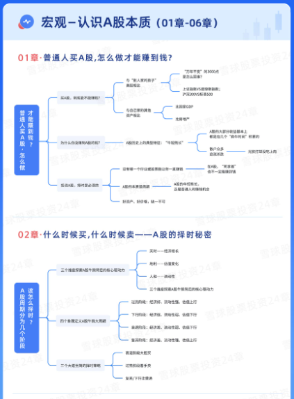
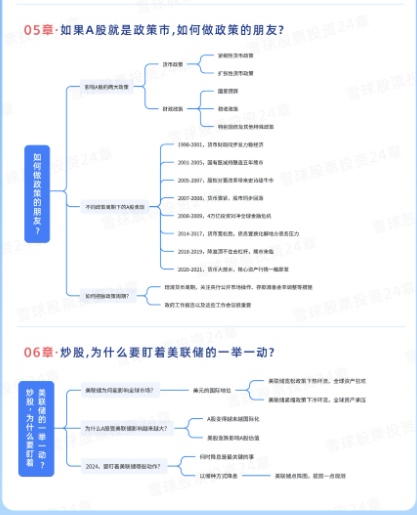
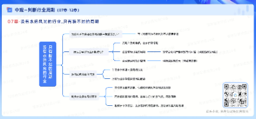
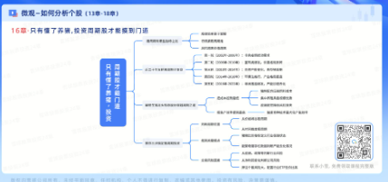
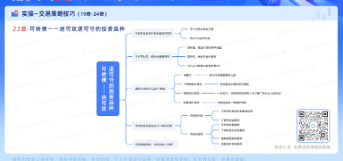

## 00|股票讲章法，投资有体系

“买A股到底能不能赚钱?为什么有的人能靠股市发财致富，而我却时常被套，一直在回本的路上…

炒股一直没找到门路，白酒涨了就研究研究白酒，煤炭涨了就看看煤炭，没有自己的能力圈，更没有投资体系可言…”

买股票就像撞大运，这大概是多数股民的常态。

股票投资，这个看似门槛不高却又充满复杂性的领域，吸引着无数梦想造富的投资者。然而，真正能够在股市中长期稳定获利的，却是寥寥无几。究其根本原因，逃不过认知和体系这两件事。

雪球打造的《股票投资24章》从宏观、行业、个股、交易四个方向入手，基于历史数据和事实，总结方法和技巧，力图洞察市场周期，剖析波动背后的动因。

没有任何人能够教别人炒股，这里更多希望大家能够通过这24个章节多了解一些常识和规律，参透本质进而能捕捉投资机会，逐渐搭建适合自己的策略和体系。

智者始而愚者终，足够的认知才能支撑你在极端行情下不恐慌，在震荡市场中不迷茫。

### 宏观·认识A股本质(01章-06章)

聪明的投资者往往能透过事物的本质找到赚钱的逻辑。胶着的3000点、牛短熊长、追涨杀跌、循环往复......A股的本质其实很朴素，一切皆为周期。

之所以产生周期，是因为人们的一致预期和现实之间常常存在错位，这些错位就像齿轮一样转动，从而形成了规律。

事实证明，在A股，“死拿着“真不一定能赚到钱，择时更加有必要。但择时不等同于预测，更重要的是用周期思维投资A股。

在此基础上，我们将通过对历史表现的归纳演绎来试图解答以下几个关键问题：

A股牛熊周期分为哪些阶段?

如何判断当前处在什么位置?

结构性机会如何判断和把握?

如何做政策的朋友?

美联储又是如何影响A股的?

任何我们能感知到的大周期，背后无一不是天时地利人和的驱动，A股周期则由经济增长、估值周期、流动性共同推动形成。三者的变化演绎形成了周期的四个阶段，对应择时的秘密则大道至简，衰退阶段大胆买、过热阶段着手卖、复苏或下行阶段则需要注重选。

当然，我们不可能知道过热的市场将何时冷却，也不可能知道市场将何时止跌上涨，但相比之下我们更应该知道自己身处何方。

如果不想在大起大落的行情里后知后觉，可以关注一些关键的先行指标，帮助我们判断当前处在什么位置。

多数时候，周期的钟摆一直在两极之间摆动，停留在两个端点的时间很短，我们在投资实践中也一样，极致的牛市熊市很难得，更多面对的都是结构性机会，就是我们常说的市场风格。

如果你选择随风而动，想要尽量捕捉到风格变化，就需要一些日积月累的常识与理智判断。

老股民提到A股时，经常愿意称其为政策市，无论是我们自己的货币政策、财政政策还是近些年威力颇大的美联储政策，都在时刻影响着市场波动，如果能学会做政策的朋友，A股投资会简单许多。

### 中观·判断行业周期(07章-12章)

大家都希望找到某个值得信仰的稳定成长行业，长期持有，享受复利增长。但最终会发现，很多原本以为的成长行业，最后发现也是周期。

当景气上行周期结束的时候，之前深入人心的宏大叙事和信仰，事后看来都是那么地经不起推敲和考验。

行业周期产生的本质，在于供需错配。如果从行业的波动特征来做一下分类，一类是由于需求端快速爆发，引起供需错配，从而引起周期波动的情况;另外一类则是需求端相对平稳，周期主要是受供给端变化驱动的情况。

与此同时，行业周期的多重嵌套现象客观存在，它既是行业发展的内在规律，也是进行投资决策时的重要依据。

供需关系是站在基本面的角度，来描绘行业的景气度变化，但很多时候我们会发现，基本面变化和二级市场上的股价变化，两者并不完全一致。

原因在于，**不仅行业基本面有周期，估值和情绪也存在明显的周期**。

周期难不在规律，而在人性。谁都知道万物皆周期这句话，但每次行业运行到周期高点，都总有新的“伟大故事”，而每次行业运行到周期低谷，也都有新的"无解困局”，让很多人产生这次不一样”的错觉。

"这次不一样"的念头很贵。很多时候，都是要等周期走出来后才发现，这次没有什么不一样。

白酒、医药、新能源、煤炭、半导体，五个我们耳熟能详的行业，有着完全不同的投资逻辑。

我们将通过周期演绎、产业更替和投资策略等方面，以这几个行业为例，呈现几个典型的行业分析视角。

如果能够在对的时间选到对的行业，可以说投资就成功了一半。

### 微观·如何分析个股(13章-18章)

个股分析，是作为股民必须修炼的基本功，实际上，这是一个简单又复杂的工作。

简单在于上市公司基本面维度很清晰，我们从八大维度来探讨学习，帮助大家建立起公司基本面分析的体系。

复杂在于，没有一家公司一只股票完美到能长期高增长且没有任何缺陷。

不同类型的公司其实代表着不同的投资策略，加之公司的发展同样有周期性，那么我们挑股票时更重要的是找准分析侧重点。

值不值得买，什么阶段买，公司类型不一样，分析方法也不一样。

如果你想找一个适合长期拿着的股票，那可以研究股王茅台，通过它的护城河、商业模式、成长性来类比找到同样确定性很高的公司，这类公司需要重点关注是不是能随时闭眼买入，对应的买卖策略又如何。

如果你厌倦了股价大涨大跌带来的焦虑与不安，渴望一种安稳的赚钱方法，高股息策略就成了一个很好的选择。那么，如何挖掘高股息公司，如何玩转高股息投资策略呢?我们将以长江电力为例，做一个全方位的拆解和总结。

在A股市场中，猪周期是一个既迷人又危险的存在。理解了猪周期的人，很容易抓住上行趋势并赚到钱。而不理解猪周期的人，往往容易成为高位接盘者。

投资这类强周期属性的公司，范式相对简单，只要跟着周期走即可，当然如何判断周期位置、找到关键拐点、寻找交易机会则更需要研究。

眼看他起朱楼、宴宾客、楼塌了.....A股市场不乏这种大起大落的股票，但背后的本质原因却大有不同，东山再起的可能性和速度也不相等。

爱尔眼科和宁德时代是两个典型，未来该关注哪些变量做投资决策呢?前者要注重自身商业模式的可持续性，后者则更多被产业变革趋势左右。

### 实操·交易策略技巧(19章-24章)

对我们普通投资者来说，进入股市容易，但要形成一套能长期赚钱的投资策略，练就出自己的杀手锏，却并非易事。

我们探讨了市场上常见的七种投资风格，它们之间并没有优劣之分。

最关键的是，要根据其自身的特征选择适合自己的策略。

最后一部分，手把手教大家玩转常见的几种交易工具。

我们在市场上看到的每一个金融工具，本质上都是一种投资策略。

打新，具有A股特色的股民抽奖福利，听起来好像可以无脑操作，但如果稍稍多一些“心机”便能事半功倍；

ETF，最适合我们散户的指数投资工具，我们总结了一些技巧可以用ETF获得不止于贝塔的收益;

可转债，进可攻退可守的投资品种，其套利玩法更是大有可为；

国债逆回购，一个普普通通的短期理财工具同样能通过一些小操作让收益最大化;

期权，普通人能接触到的投资最强赌具，我们把这个看似很复杂的工具抽丝剥茧，看其到底是如何赚钱的，普通投资者该如何使用。

### 写在最后

在股市里，听过无数逻辑，最终发现尊重常识才是硬道理。

但当我们真正身处其中的时候，会非常容易怀疑自己原本的坚持。比如，明明知道现在市场估值很低，但事实是仍然在一直跌，这个时候一定会想，周期真的值得相信吗，这次会不会真的不一样?
