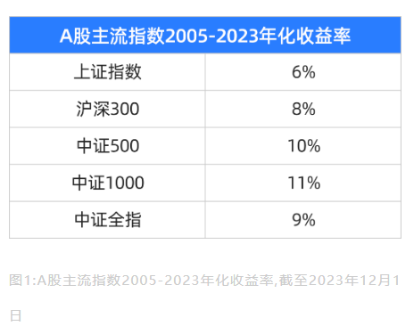
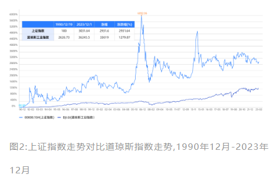
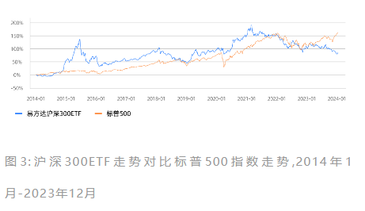
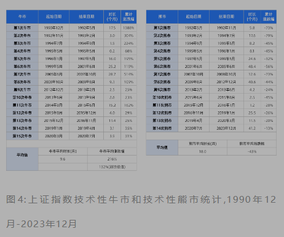
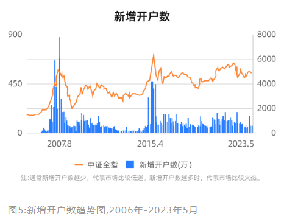
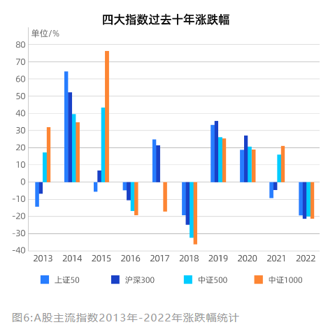
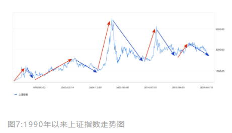
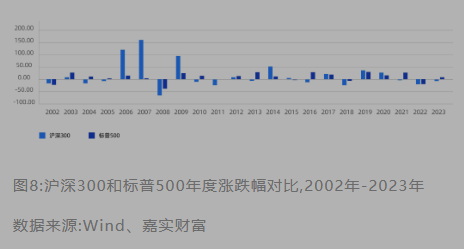

---  
title: 01|普通人买A股，怎么做才能赚到钱?  
index: true  
icon: file  
order: 2  
category:  
  - 短线  
  - 大A  
tag:  
  - 雪球  
---  
  
## 01|普通人买A股，怎么做才能赚到钱?  
  
聪明的投资者往往能透过事物的本质找到赚钱的逻辑，今天我们来探讨几个有关A股本质的问题。  
  
### A股到底能不能赚钱?  
  
自1990年12月上交所正式营业算起，A股市场运行30余年，至今已有2亿多股民混迹于此一边有不少造富神话流传，一边则被冠以些许骂名，很多人发出灵魂拷问:买A股到底能不能赚钱?  
  
我们用两组直观的数据对比来揭示两个被大多数人忽视的真相，你感受到的不一定是真实的。  
  
第一，买A股收益跑赢买房。  
  
股市一直被看作是国家经济的晴雨表，但有人认为备受争议的A股或许不能代表我国高速增长的经济发展趋势。事实是怎样呢?  
  
自2005-2023年第三季度的18年间，我国名义GDP年化增速约为11%，同期的A股收益表现如图，除了上证指数外，A股市场主流的几个指数复合增长率均在10%左右，再加上分红收益的话，那么过去近20年里，A股不仅主流是上涨的而且整体收益基本与GDP持平，并没有拖后腿。  
  
更值得一提的是，同期全国房价均价的年化涨幅也大概在9%左右，也就是说从长期回报率来看，A股并不输过去几十年国内最受欢迎的大类资产。  
  
  
第二，A股并不逊色于“别人家的孩子”美股。  
  
近几年A股股民们无不羡慕美股十年长牛，对A股怨声载道，但拉长时间看，A股涨幅要远远高于美股。拿我们最熟知的、历史也最长的上证指数来看，三十多年以来该指数总涨幅超过30倍，而同期与其对标的美股道琼斯指数涨幅只有13倍。  
  
  
那么，“万年不变”的3000点又是怎么回事呢?  
  
上证指数在2009年就在3000点徘徊，到14年后的今天仍然奋斗于“3000点保卫战”，这背后的原因则在于该指数的估值变化。关于估值的学问，我们后边会做更详细的探讨。  
  
2009年上证指数市盈率30倍，现在(2023年12月，下同)是13倍，相当于非常低的估值区间，我们都知道股价=净利润*市盈率，当利润持续增长、估值被打压时，股价自然涨不起来。  
  
而且，美股同样经历过这样一段黑暗时刻，在1965年到1981年底，道琼斯指数长达17年基本没涨，但在之后的1981-1998年间，道琼斯指数17年间累积上涨950%。所以完全没必要纠结于A股的3000点，这只是时间问题。  
  
顺便聊两句指数的编制问题。上证指数只涵盖了上海交易所的股票，其中高市值股票权重很高，也就是说指数走势很容易受大盘股行情影响，并且由于退市机制问题，成分股中会有一些"不死鸟“垃圾股票，拖垮了指数涨幅，正是因为这些原因，该指数被业内人士质疑一定程度上失真。  
  
而中证全指涵盖A股几乎全体股票，沪深300、中证500、中证1000等指数则是有一定策略选择的主流指数，基本能代表A股的整体收益。  
  
我们再拿两个市场上均具有标杆意义的指数对比，易方达沪深300ETF(510310)从2014年开始至2023年结束的十年时间里，收益率曾一直碾压标普500指数，直至2022年才开始被标普500指数反超，可见A股一点不比美股逊色。  
  
  
聊到这里，想必大部分股民都会想一个问题：既然市场整体收益这么好，为什么自己没赚到钱?为什么身边那么多人都觉得A股很难赚钱?  
  
### 为什么你没赚到A股的钱?  
  
从结果讲，这么多年下来，A股整体趋势向上，累计收益并不算差。只不过，相对于美股，相对于房地产，A股向上的过程要曲折一些。  
  
我们回头看上边这张A股和美股的对比图(图表3)，可以很清楚得感受到，虽然两条曲线都是向上的，但是A股沪深300的波动率非常大，有明显的“尖顶圆底“特征。  
  
通常而言，指数下跌或上涨超过20%则被称为技术性熊市或牛市。  
  
以上证指数为例，经统计(如下表)，自1990年12月开市至今，A股一共经历了15次牛市和14次熊市。  
  
其中牛市平均持续9个月，熊市平均持续18个月，熊市持续时间是牛市的2倍;牛市时，上证指数的平均涨幅有216%，剔除首次牛市的极值涨幅后，平均也有132%;熊市时，指数平均跌幅则为43%。  
  
  
可见，A股牛市的时间很短，而熊市时间却很漫长，这就是A股历史上的典型特征:“牛短熊长”。  
  
三十多年以来，A股仅有4次大规模牛市，分别是，1999年、2007年、2015年和2020年，平均7-8年一次，两届世界杯，才能等来一次大  
牛市。  
  
而A股的大部分收益基本上都是在这几个“疯牛时间“积累的，也就意味着，我们普通人投资A股，如果抓不住大行情的话，基本就要在漫长的熊市中被“消磨殆尽"了。  
  
再来看一个有意思的图：  
  
  
很明显，A股市场上新增开户数的峰值一般都是市场最火热的时候：  
  
2007年，也就是上证指数冲上6124历史高点的那一年，全年开户量3829万，是2005年全年的30.8倍；  
  
2015年4月，大盘一个月涨幅就接近20%，新增开户数在那一个月的时间暴涨近500万，而在此前夕的2013年股市低谷，一整年的新增开户量也才493万，不如巅峰时期一个月的量。  
  
这中间动辄几十倍的差距，不禁让人唏嘘，市场低迷的时候没人理会，市场大涨最贵的时候反而哄抢入场。  
  
这也正体现A股市场的另一个典型特征:散户众多且非理性交易行为明显。  
  
“再不上车就真的没机会了，满仓买入”  
  
“怎么开始跌了，稳住，能赢”  
  
“受不了了，割肉，不玩了!”  
  
“当初要是拿住就好了，我要把失去的赢回来”  
  
......  
  
往往在牛市最疯狂的时候，散户们被市场的赚钱效应吸引蜂拥而入，而这时候进场基本只能踩到个"牛尾巴”，还没爽够便迎来市场泡沫破裂，心存执念不甘心离场，于是开始了漫长的煎熬，终于熬不住了，在市场谷底逐渐失去信心和耐心，扛不住便割肉出局。  
  
“追涨杀跌”再加上“牛短熊长”，如此反复，光挨打却没吃上肉。  
  
### 投资A股，择时是必须的  
  
追涨杀跌固然赚不到钱，在A股，“死拿着"也不定能赚到钱。  
  
我们直接看几个主流指数的历史表现(如图)，上证50、沪深300、中证500和中证1000是分别代表A股市场上不同风格的股票指数。  
  
其中，小盘股的代表指数中证1000在2015年涨幅为76.1%，是四大指数过去十年年度涨幅最高的，而到了2018年，中证1000年度跌幅达到36.87%，成了过去十年年度跌幅最大的；  
  
再看2014年和2019年，市场都是明显的“价值”风格，彼时更亮眼的就变成了代表大盘股的上证50和沪深300。  
  
  
事实证明，**没有一个指数会一直处于优势地位，没有哪一个行业或股票能让你一直赚钱，**任何风格都有其适合和不适合的市场环境。  
  
如果我们抓住了某种风格的上行周期，但是在下行周期到来时却仍然恋战不走的话，那么收益就有被熨平的风险，2020-2023年的核心资产走势就是活生生的例子；  
  
如果局限在某种风格或某个行业的基本面，总是相信股价低估一小段时间就会自然回转，那么你太低估A股牛熊周期的威力了。  
  
在2007年买入招商银行等大蓝筹股的投资者，你能想象他们用了多长时间解套吗?10年。  
  
“什么样的人能坚持拿10年拿着不动呢?有三种人:忘记密码的人;去世的人;进监狱的人。”  
  
虽是玩笑话，但一定程度上揭示了人性的弱点。  
  
看上边我们提到的上证指数，在三十多年时间里，指数回撤超过20%的就有十多次，回撤超过40%的有8次，这还只是指数，摊到个股上，普通投资者需要忍受的回撤会高的多，而我们大多数人是不太可能做到的。  
  
所以，在A股，择时是必须的。但这里需要强调的是，择时不等同于预测，我们主张做A股的大周期择时。  
  
市场牛熊有周期，产业迭代有周期，公司发展有周期，投资者情绪也有周期，我们永远也无法做到在最低位精准买入，也永远没办法十拿九稳得一买就涨，更重要的是了解周期轮动规律，用周期思维投资A股。  
  
2005-2007年，在股权分置改革的助推下，A股经历了历史上最波澜壮阔的一次牛市，期间光大盘指数就翻了5倍，上证指数一路飙到现在还无法突破的6124点；  
  
但随即便开始了一路狂泻，熊市接棒，2008年次贷危机火上浇油，一路跌到了1664点；  
  
2009年，在4万亿计划的刺激下，A股出现一波小牛市，但维持时间不长;  
  
之后，迎来了历史上最长的一轮熊市，2009年一直到2014年年中，持续了漫长的5年时间，也是A股最便宜的时刻；  
  
直到2014年下年陆续降息，利率下降吸引了大量资金入市，加上当时大热的借壳炒作助推带来2015年小盘股牛市，彼时中证1000估值甚至冲上100倍；  
  
随后去杠杆、熔断，2016年年初上演了一波极端行情，市场大小盘分化，到2018年贸易摩擦冲击，熊市蔓延；  
  
2019年-2021年，核心资产迎来高光时刻，带动大盘反弹走牛;但2022年至今，A股再一次进入调整。  
  
  
贵上极则反贱，贱下极则反贵。总结来说，A股的本质其实很朴素，一切皆为周期。  
  
只有在大幅波动的情况下，周期的择时收益才会更加显著，而A股市场恰恰是这样的情况。  
  
从过去20年的年度涨跌幅数值看，很明显，A股涨起来势头非常猛，虽然牛短熊长，但牛市的涨幅一下子就弥补了之前的时间，一年的涨幅相当于其他市场好几年的，其实，A股的牛短熊长，正是普通人的赚钱机会。  
  
  
确实，判断周期并不容易，这也是为什么我们需要花时间研究的原因。但只要相信周期的存在，在大多数股民都抱怨股票亏钱的时候入场;不要在都认为炒股很容易赚钱的时候入场，那就已经迈出了赚钱的第一步了。  
  
当然，想要最终赚到钱，还有一项重要的工作要做，就是选择好的资产。**好资产、好价格，缺一不可**，我们在之后的课程里会结合不同的周期探讨多种选资产的方法。  
  
在这里，更想介绍一种大道至简的方法:不懂的不做，只买自己懂的资产。  
  
实际上，在大周期择时不出大的差错的情况下，你投资指数就能获得市场贝塔的收益，在七亏二平一赚的A股，抓住了贝塔，你就跑赢了70%的人。如果想要获得更多的阿尔法，那么你就要花时间去研究行业，研究公司，打磨自己的交易策略。  
  
不管怎么样，首先都得搞懂大周期的问题，其他问题都是次一级的问题。  
  
接下来的课程，我们将一起探索A股的大盘轮动周期、行业景气度周期、市场情绪周期等等。  
  
抓住A股大周期，命运的齿轮开始转动。  
