---  
title: 10|以新能源为镜，看懂产业趋势要如何把握  
index: true  
icon: file  
order: 11  
category:  
  - 短线  
  - 大A  
tag:  
  - 雪球  
---  
  
## 10|以新能源为镜，看懂产业趋势要如何把握  
  
2019-2021年的牛市中，消费、医药、科技等行业均有出色表现，但要论最耀眼的主角，无疑是新能源。  
  
历史每轮牛市中的主角，背后均有着鲜明的时代烙印，新能源也不例外。  
  
在能源革命+产业升级的时代大背景下，新能源成为当时市场中的主要共识，并实现了阶段性的估值和盈利双击行情。尽管自2022年开始，该行业经历了长达两年的持续回调，但对投资者的吸引力却未曾减退，“抄底资金”前赴后继。  
  
资本市场的聚光灯，总是偏爱这些热门且充满潜力的成长赛道，无数投资者趋之若鹜，但最终又失意而归。高收益、高波动，是成长股投资的一体两面。但承受高波动并非必然能获得高回报，挨了打但没吃到肉是大多数人的情况。  
  
那么这类行业到底该如何投资?本篇就让我们通过近几年行情最轰轰烈烈的赛道--新能源，来了解一下。  
  
### 新能源何以成为上轮牛市的“最强主线”?  
  
2020年开始，新能源逐渐走向A股舞台中央，迎来长达两年的高光时刻。2020至2021两年间，新能源车ETF(515030)涨幅高达108.19%，成为彼时市场争相抢筹的“稀缺资产"。  
  
不仅整个新能源板块涨幅超过3倍，被投资者冠为“永远的神”。赛道内更是诞生了一大批”十倍大牛股”，产业链的各个环节轮番上演了一出出造富神话，无数投资者梦寐以求的时代贝塔莫过于此。  
  
电力设备也一度超越历来备受机构青睐的食品饮料，成为公募基金的第一大重仓行业。行业风头正劲之时，甚至有经济学家喊出“当下不投新能源，就像20年前没买房”，是可见新能源投资逻辑的深入人心。  
  
股价、估值、景气度、话题度，无论从哪个维度来看，上轮牛市中的新能源都堪称最强主线。那么背后究竟是什么让这个赛道如此备受追捧?  
  
#### 政策的助推  
  
产业政策无疑是重要的助推剂。  
  
为应对全球气候变化，《巴黎协定》制定了碳减排长期目标，全球主要经济体陆续给出了"零碳"排放时间表。2020年9月，我国也承诺争取2030年前实现碳达峰、2060年前实现碳中和。  
  
这一轮新能源产业发展，除了“碳达峰碳中和“的定性目标，还有若干定量目标。  
  
关于可再生能源的定量目标有，2030年非化石能源消费比重达到25%，风电、太阳能发电总装机容量达到12亿千瓦以上。到2060年，非化石能源消费比重达到80%以上。  
  
而在双碳目标提出前的2019年，我国非化石能源占能源消费比重为15.3%，风电、太阳能发电总装机容量仅为0.56亿千瓦。  
  
碳中和大战略全面铺开后，新能源产业进入“倍速发展"阶段，最气度不断提升。  
  
以光伏为例，2020年我国光伏新增装机量为48.2GW，而到了2023年，光伏新增装机量达到220GW，近3年年度复合增长率达到65.87%。  
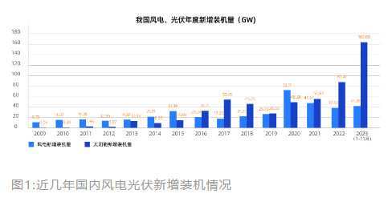  
  
巨大的市场空间，彻底点燃了新能源的投资热情，行情正式驶入快车道。无论是发电侧、储电侧还是用电侧，新能源产业链的每个环节都备受瞩目。  
  
#### 技术的进步  
  
对于新能源的发展来说，政策的扶持固然重要，但技术进步也是不可忽视的核心因素。  
  
单纯靠政策驱动、而没有基本面支撑的行情，往往是脉冲式的，难以持续。这背后的原因就是，虽然未来成长空间很大，但短期落不到业绩上来，就像无源之水，终会干涸。  
  
以新能源车为例，相关主题在A股历史上曾出现多轮行情，但均因为不具有真正基本面支撑，注定只能是阶段性的炒作，而无法成为主流行情。直到2020年，在电池技术发展的推动下，新能源汽车产业趋势才得以真正开启。  
  
大家买新能源汽车，最担心的续航短、掉电快、充电久、自燃等问题，全都跟动力电池相关。可以说，电池既是电动汽车的动力源泉，也是一直制约其发展的关键因素。而动力电池技术进步到哪里，新能源车的发展就走到哪里。  
  
对于动力电池来说，最核心的指标就是“能量密度”。  
  
提升动力电池能量密度的方式，大致分为两种，一种是材料创新，通过研发新型材料，从根源上提升性能。另一种是结构创新，通过优化电池包的结构，增加空间体积利用率，来提升能量密度。后者正是近几年电动车续航提升的主要推动力。  
  
2019年来，随着宁德时代CTP、比亚迪刀片电池、特斯拉4680电池等技术的商业化应用，动力电池性能持续优化，也让电动车续航里程有了大幅提升。  
  
如下图所示，近年来我国电动车续航能力和电耗水平进步显著。据工信部推荐目录统计，2017年第1批推荐目录纯电动乘用车型平均续航里程仅211.6km，而到了2020年第7批的时候，平均续航里程已经提升到了391.4km。三年半时间，续航里程提升85.0%，极大缓解了消费者的里程焦虑。  
  
此外，百公里电耗也在快速下降。纯电动乘用车单位载质量百公里电耗平均值，从第1批免征目录的12.7 Wh/100km\*kg，下降到第25批的8.6Wh/100km\*kg，同比减少32.3%。  
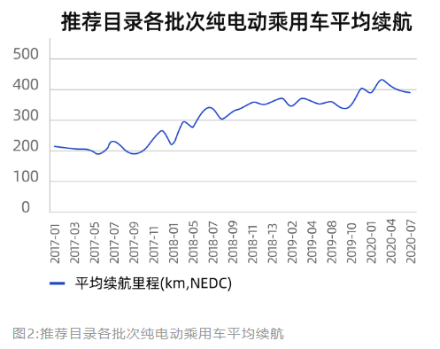  
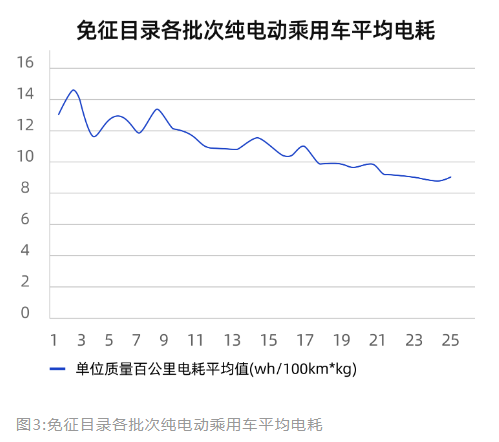  
  
动力电池不仅关乎到续航里程等性能问题，也关乎汽车的售价。电池可以说是一辆新能源汽车里最贵的零部件，在整车成本中占比超过40%。新能源汽车之所以能够如此迅速地普及，自然也离不开电池成本的下降。  
  
业内普遍认为，当动力电池成本下降至100美元/干瓦时，电动车的制造成本将与燃油车大致相同，也即电动汽车能够真正PK燃油车的临界点过去10年，在规模效应的影响下，全球动力电池成本大幅下降。从2013年的680美元/千瓦时下降到2021年的132美元/千瓦时，降幅超过80%，逐渐逼近油电平价的临界点。  
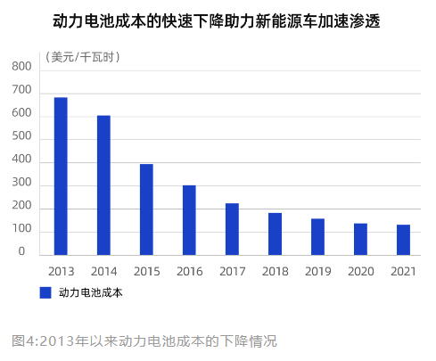  
  
光伏也是如此。得益于技术的不断进步和成本降低，光伏发电在2019年实现了平价上网，部分地区光伏上网电价基本上拉平了与煤电的差距，才迎来装机量的大幅增长。储能技术的进步，让光伏风电不再是“垃圾电”，才带来了近几年需求的爆发。  
  
技术创新始终贯穿新能源发展始末，重大创新不仅会带来需求增长，也是行业降本的核心。  
  
#### 需求的爆发  
  
产业政策培育壮大了行业，技术进步带来产品性能提升和成本下降，到了一定程度后，自然就会触发已经存在的潜在需求。  
  
2020年被业界称为全球电动化元年。这一年，不仅是全球传统车企纷纷电动化转型加速的时间点，**也是新能源汽车私人消费崛起的一年**。特斯拉、造车新势力、大众等车企爆款车型频出，极大地激发了个人消费需求。  
  
此前，新能源汽车最大的需求来自政府、企业和网约车，而私人消费端的态度一直较为冷淡，2019年新能源汽车个人消费比例尚不足30%。但到了2020年，新能源汽车的销量开始转向个人消费者，个人消费比例大幅提升至近70%。  
  
短短一年时间，新能源汽车市场已经明显偏重于消费者一方，新能源车"飞入寻常百姓家"成为趋势。  
  
自此，行业对政策补贴的依赖逐步弱化，新能源汽车开始从政策驱动转向市场驱动、需求驱动。  
  
新能源汽车行业迎来快速爆发阶段，销量和渗透率迅速提升。2020年国内新能源汽车年销量为136.7万辆，渗透率还只有5.4%。而到了2023年，销量已经突破949.5万辆，渗透率更是超过40%。  
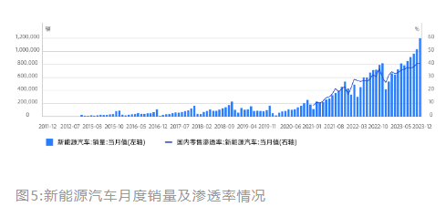  
  
2019-2021年的这轮新能源行情，是天时地利人和的结果。  
  
"双碳”政策指引下，新能源景气度不断提升，行业的天花板持续打开。在政策强力驱动和技术进步下，新能源产业迎来了需求的爆发。产业链相关公司的盈利增长，是最直接的印证。  
  
上轮牛市中，申万电力设备行业roe持续上行，营收、净利润均保持高速增长。2021年行业营收历史性突破2万亿元，营收增速创下十年新高，过去两个年度盈利增速均超40%。与同期A股整体相比，新能源景气度领跑其他行业。  
  
超高景气推升估值，配合上业绩的高增，让新能源板块走出了戴维斯双击行情。  
  
更重要的是，“碳达峰碳中和"背后的能源革命暗线，让新能源显得性感十足。  
  
如果未来国际能源的格局，不再由传统资源禀赋决定，而是由工业水平决定，靠技术和高端制造推动。如果说，**能源由资源属性变为先进制造业属性**，那么新能源身上，还另外加持了不少激动人心的逻辑，如:能源自主可控、国内经济转型、产业升级等。  
  
而对于刚刚经历过一轮增量行情的A股来说，核心资产估值逐渐被推高，牛市的后半程人心躁动，市场偏好开始从长期稳健成长股，转向短期高速成长股。此时故事性感、相对低位且资金容量足够大的新能源赛道，站在了舞台中央，吸引无数资金涌入。  
  
基本面、情绪面、资金面共振之下，新能源板块赚钱效应爆棚，估值达到了前所未有的高度，也在上轮牛市中留下了最浓墨重彩的一笔。  
  
### 新能源:是成长，也是周期  
  
没有一个行业能逃脱周期的规律，新能源行业自然亦不例外。  
  
上轮牛市中，新能源一路高歌猛进，走出了势不可挡的行情。2020年，中证新能源指数涨幅超过102%，在2021年，又再次上涨了55%。而到了2022年初，行业掉头向下，开始一路俯冲。  
  
中证新能源指数自2021年末高点以来跌幅超过60%，调整时间长达2年，至今下行周期也难言结束。  
  
业绩的高增长和股价的疲软，更是形成了鲜明的反差，让不少投资者摸不着头脑。  
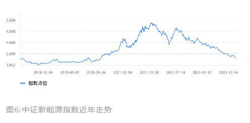  
  
其实支撑了上轮新能源走牛的底层逻辑，均未发生变化。  
  
无论是国内的“双碳目标”，还是海外的碳减排方案，都并没有出现延期或放松。而风电、光电发电量占比还在不断提升，新能源车的渗透率依然稳步向上，行业内的技术也在不断推陈出新......  
  
新能源的长期产业趋势，并无太多争议，大家毫不怀疑新能源仍是未来的主流。  
  
但产业的归产业，市场的归市场。  
  
2021年末，申万电力设备板块估值(PE-TTM)接近70倍，而行业龙头公司的估值只高不低，动辄两三百倍以上的估值，也让投资者更加坚信，投资科技赛道，看估值就输在了起跑线上。虽然产业趋势确定，渗透率还在提升，未来空间看起来貌似依旧较大，但也不意味着投资可以不理会估值。  
  
从投资的角度看，2000年科网股、2015年创业板的泡沫巨大，都是不争的事实。即便是科网泡沫破灭后，互联网渗透率依然在上升，2015年创业板泡沫破灭后，移动互联网也依旧不断重塑人们的生活，但在高点买入的投资者，仍旧付出了不小的代价。  
  
未来行业还有多少空间、渗透率还有多少，并不是投资的唯一依据，忽视估值的代价是惨痛的。  
  
**没有人会质疑新能源的星辰大海，只是对于重资产的制造业来说，「产能周期」永远是让人胆战心惊的四个字**。  
  
在强大的周期力量面前，再星辰大海的行业，也显得无比脆弱。  
  
过去几年，无论是光伏还是新能源汽车，本质上都是下游需求爆发，而产能释放速度较慢，导致供需失衡。产业链内扩产周期较长的环节，如锂矿、硅料等供需失衡更加严重，产品价格疯涨行业最气度盛况空前。  
  
但高额利润的吸引下，供给跟上，只是时间的问题。  
  
以动力电池为例。行业高景气之时，行业内的玩家争先恐后抛出产能规划，更有不少上市公司宣布跨界进军锂电池，整个行业产能扩张速度飞快。  
  
在2023年世界动力电池大会上，一汽集团总经理邱现东曾表示:“2022年至今，50多家企业对外公布的亿元以上的投资项目超过125个，总投资预算超过1.4万亿，产能规划超过2500GWh。”  
  
这些产能与现有产能相加接近3000GWh，对应装车量约4000万辆，而2023年我国新能源汽车销量不到1000万辆。即使把国内总共2000多万的汽车销量，全部替换成新能源车，也难以承载如此庞大的电池产能。  
  
2022年开始，随着中上游产能不断释放，供需失衡大幅缓解。而下游终端需求增速也开始放缓，2023年中国新能源汽车销量增速37.9%，远低于前两年的平均增速。供需天平再次逆转，从原来的供不应求，迅速转变为全面过剩。  
  
为了争抢市场份额以及迅速去库存，厂商开打价格战，中上游产品价格开始雪崩下行，带动新能源板块跌跌不休。  
  
无论是光伏、风电，还是锂电、储能，各个环节都在上演贴身肉搏的“价格战”。光伏组件价格已降至1元/W之下，从高点回落超过55%，锂电池电芯价格降至0.5元/Wh左右，从高点回落超过46%。  
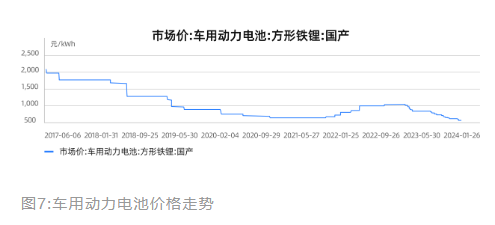  
  
以行业周期嵌套的框架来看新能源，不难发现其中存在政策周期、技术周期、产能周期等多种周期的相互交织。  
  
19-21年，新能源的多重周期共振向上，才爆发出二级市场上最强的beta行情。在经历了三年的产能扩张之后，产能周期的威力开始显现。供需结构开始新一轮调整，行业洗牌已来。  
  
### 透过新能源，看新兴成长行业如何投资  
  
A股投资者，无论机构还是个人，向来都有把握产业趋势的偏好。  
  
原因无非是，产业趋势意味着行业迎来爆发式增长，容易带来显著超越大盘和其他行业的弹性收益机会。回顾A股历史也会发现，每一轮牛市的背后，都离不开产业趋势的爆发。  
  
面对产业趋势带来的投资收益，没有人能无动于衷，但想把握好却绝非易事，往往是:刚出现时嗤之以鼻，开始涨了看不懂，等到终于看懂了买入了，结果站在了高高的山岗上。  
  
那么像新能源这类新兴产业趋势的投资，到底应该怎么把握?  
  
首先，让我们先来理解一个概念:渗透率曲线。  
  
渗透率简单来说，就是代表某类产品在市场上覆盖程度的指标，是新兴产业投资时的重要抓手。新兴产业的渗透率成长曲线通常是S型曲线，智  
能手机、TWS耳机等经典案例均符合此规律。  
  
渗透率的演绎与产业生命周期也具有高度一致性。通常我们认为，在某个新兴产业进入成熟期前，会经历三个阶段--导入期、加速期、减速期。  
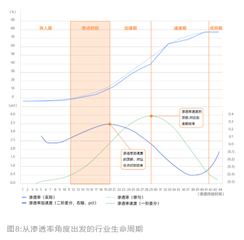  
  
一般来说，如果渗透率在5%以下，说明行业还处于导入期。一般是限于某种关键技术未能突破，没有良好的产品体验，所以还未获得市场的认可。  
  
这个阶段的行业投资，具有较大的不确定性，即便是有政策支持，在二级市场上有所反应，也基本上是处于"主题概念投资”的阶段。由于缺乏实实在在的财务数据支撑，行情的持续性往往很差。  
  
对于普通投资者来说，参与的难度极高，不异于火中取栗，建议回避此类机会。  
  
例如2019年之前的新能源汽车，都处于新能源汽车的导入期，市场曾在这个阶段反复炒作3次，后来都由于渗透率不足证伪。  
  
产业趋势的形成，需要技术进步、成本降低以及出现真正的应用可能性。从主题概念转变为产业趋势，是一次量变到质变的飞跃，也被称为行业的"奇点”时刻，通常伴随着行业重磅事件的发生。  
  
例如，电动车的“奇点”时刻出现在2020年1月，特斯拉将国产Model3的价格降至30万元以内，这一性价比使得电动车真正对燃油车产生了冲击。而人工智能的”奇点”时刻，则是2023年4月ChatGPT的横空出世。  
  
  
而一旦渗透率突破5%，证明确实有真实的需求后，行业将迎来渗透率加速向上的拐点，需求快速放量，此时行业的不确定性弱化。尽管需求的变化在初期可能无法体现在业绩上，但第一轮拔估值行情已经开始。  
  
对于这个阶段的投资来说，业绩的及时验证较为关键。预期很好，却迟迟无法兑现收入则将迎来回调。  
  
如果后续及时获得业绩验证支撑，则会进一步推动行情上行。在这个过程中，市场对产业趋势的认识将不断进化，投资者分歧降低，情绪也会逐级抬升。而产业渗透率加速度上行，带来持续超预期的业绩，市场也会不断交易出更高的估值此时行业迎来戴维斯双击行情。  
  
如2020年-2021年8月的新能源汽车，动力电池技术突破叠加全球碳中和政策共振，产业趋势逐渐明朗，行业在渗透率突破5%后加速上行。以宁德时代为首的电池产业链业绩连续超预期，带动行业估值持续拾升，上演戴维斯双击。  
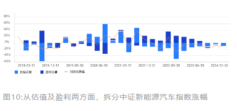  
  
估值的拐点，往往发生在渗透率二阶导下行的节点。此时业绩仍大幅兑现，但难以持续超出市场预期，估值也就无法继续向上拔升，开始回落股价转而由业绩推动。  
  
此阶段虽然还是可以赚到业绩释放的钱，但由于估值中枢开始下移，业绩的高增长往往被估值下降所抵消。  
  
如2021年8月-2022年8月的新能源车指数，渗透率达到20%后，股价虽然距离此前高点不到9%，但估值却从高点下滑了近46%。  
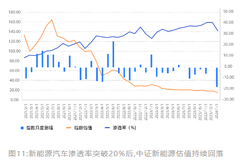  
  
当行业渗透率超过一定阈值后(例如30%)，增长速度开始放缓，渗透率从加速期进入减速期，行业贝塔行情随之结束。高速增长的红利期一过，行业内部面临竞争加剧，盈利能力逐渐恶化，格局重新洗牌。  
  
如2022年8月至今的新能源汽车，渗透率提升速度放缓，此前大干快上建设的产能开始释放，行业各个环节从上游--中游--下游陆续上演惨烈价格战，业绩表现为增收不增利，估值持续下杀。  
  
当渗透率不再增长，行业就进入了成熟期。此时竞争格局趋于稳定，成长属性褪去，周期属性开始提升。行业内马太效应凸显，出现“赢者通吃”的局面，龙头公司会出现利润增速大于收入增速的情况。直至有新的技术、新的产品出现，行业将进入“第二增长曲线“阶段。  
  
渗透率从低到高的过程，也是行业由萌芽期--成长期--成熟期--衰退期的完整发展过程。  
  
我们可以通过观察渗透率，来定位行业现在的发展阶段，判断未来是会扩张得更快，还是已经过了最快的阶段。从渗透率曲线视角出发，很容易发现**投资新兴成长股的黄金时期，是产品度过导入期以后，渗透率加速度向上的阶段**。  
  
虽然产业趋势的计量单位，最起码都是10年起步，但反映到股价上，并不会在十几年时间里慢慢走完、匀速上涨。市场对于产业趋势的表达通常在1-2年内就完成演绎了，投资的黄金时期要远远小于产业趋势持续的时间。  
  
对于确定性较高的产业趋势，A股往往习惯用终局思维进行定价。当市场形成了较高的共识后，很容易一下子把预期打满，行业和龙头公司会迅速达到终局市值。十几年的行情，只用了一两年就跑完，然后进入更高波动阶段。此时再介入的话，不仅投资潜在收益率大大降低，难度也将大大增加，估值已达到极高的位置，大概率是承受了高波动却没有高收益。  
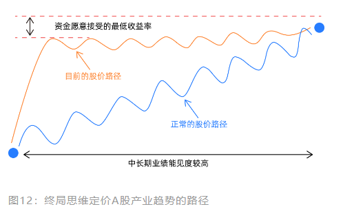  
  
这种极致化的演绎方式，使得「能否精准把握住黄金时期」，成为投资新兴成长股的胜负手。  
  
对于新兴成长行业来说，这个阶段也被形象地称为"鱼身"行情。即渗透率的二阶导向上，业绩不断超出预期，市场通过给予更高的估值，来对此前预期进行上修。  
  
此阶段，行业景气度的持续提升至关重要，它是推动股价上涨的核心动力。业绩作为衡量行业景气度的重要指标，其增长速度不仅要快，最好上行斜率越来越陡峭，这才是景气度不断提升的有力证明。此时股价上演由估值、业绩双轮驱动的戴维斯双击行情，赚钱效应最为显著。  
  
想要把握好这个阶段，需要具备在较早期辨别出产业趋势，以及对于行业景气度的准确判断，这对投资者提出了不低的要求。  
  
而对于新能源车来说，截止2023年底的渗透率已经超过40%，在经历了3年的高速增长后，继续增长的空间大幅缩窄，黄金投资时期无疑已经过去。  
  
渗透率放缓的背景下，行业步入成长减速期，竞争激烈开始新一轮洗牌，已经无法继续跟此前一样，参照科技股进行估值定价了。  
  
这就是行业发展阶段和渗透率，对估值的深刻影响。  
  
当然，也并非错过了黄金时期，超额收益的窗口就永久关闭了。  
  
行业进入成熟期后，竞争格局基本稳定，由此前的“百花齐放"变成"强者恒强”，投资逻辑也就从渗透率提升“转为“行业集中度提升"。  
  
优秀公司仍然能靠着市场份额的增加和较为稳定的盈利，获得比行业平均估值略有溢价的估值，继续给投资者带来可观的回报。不过，这个阶段已经不属于投资产业趋势的范畴内了，价值投资者往往会选择在此时介入。  
  
另外，对于技术驱动的行业来说，关键技术的突破永远是第一增长动力。动力电池、快充的技术突破以后，或许渗透率天花板还有望继续抬高。此外，2023年全球新能源车渗透率仍有较大提升空间，出海扩张的方向，也有很大概率成为行业的第二增长曲线。  
  
总的来说，对于新兴成长行业投资来说，我们要做的就是及时识别产业趋势，把握行业景气度，并用好渗透率这个关键指标。  
  
在行业处于高速成长期时进入，在行业增长速度放缓、竞争格局变差前及时撤出，避免参与“鱼尾行情”。  
  
听起来似乎很容易，事非经过不知难。  
  
在实际投资中，热门赛道持续一两年的业绩高增和未来的巨大空间，总是容易让人忽略周期的存在，错把阶段性的高速成长当成常态，从而付出了惨痛的代价。  
  
周期可能会迟到，却永不会缺席。  
