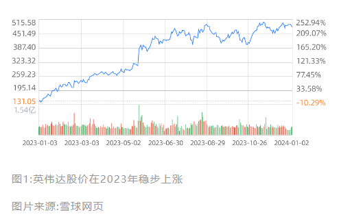
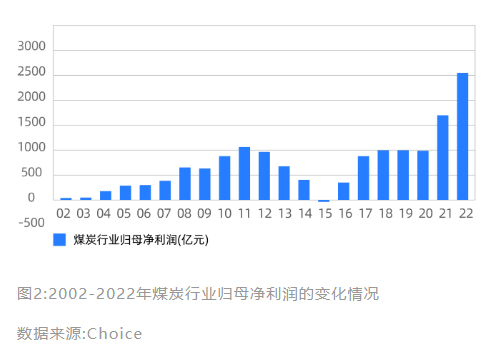
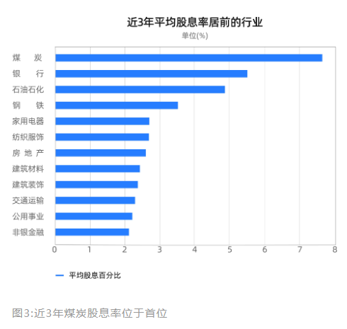

---  
title: 11|从煤炭逆势走牛，看传统行业的投资机会  
index: true  
icon: file  
order: 12  
category:  
  - 短线  
  - 大A  
tag:  
  - 雪球  
---  
  
## 11|从煤炭逆势走牛，看传统行业的投资机会  
  
这几年新能源可谓是A股市场上最火热的赛道，宁德时代从2019年开始大涨，在短短两年内成为了十倍股，自此被封“宁王”。  
  
然而到了2021年，处于风口上的新能源板块却遭遇了产能过剩，新能源板块开始跌跌不休。  
  
与此同时，被人抛弃的"日能源"煤炭板块却从2019年起悄悄上涨，至今已经连续上涨了五年。煤炭ETF(515220)自2021年至2023年三年累计涨幅高达75.67%，且随着2023年市场对于高分红高股息概念的追捧，煤炭板块的热度只增不减。  
  
2024年开年第一周，煤炭板块龙头中国神华的市值更是突破6646亿元，超越了“宁王”，成为了市场的焦点。  
  
所以说，万物皆周期，成长股可能变价值股，传统行业也可能焕发第二春。  
  
### 传统行业值得投资吗?  
  
#### 传统行业产业趋势明朗，更适合普通人投资  
  
很多人在投资时都喜欢找新兴行业，因为这样的行业具有高成长性，只要押对了宝，就有可能在短时间内获得很高的投资收益。  
  
比如前几年最火热的5G板块，诞生了沪电股份这样的十倍股，短短一年多时间里股价从3.06元涨到31.28元。  
  
但是面对新兴产业，要对产业的发展趋势、对行业的技术和知识都有深入的了解。如果什么都不懂就去投资，很有可能押错宝。  
  
比如2023年ChatGPT引爆了AI板块，而你也相信AI的未来是星辰大海，但是买入国内的AI龙头寒武纪和买入英伟达是截然相反的局面。  
  
寒武纪由于持续亏损，遭遇了资本的抛弃，股价在半年内就遭遇了腰斩。而英伟达却乘着AI芯片的东风，股价在2023年上涨了229%。  
  
所以说，**投资新兴产业要有能看到最终赢家的眼光**。  
  
  
与新兴行业相比，传统行业经过长时间的发展，产业发展趋势已经非常明朗，抓住那些有竞争优势的细分领域龙头即可。  
  
比如煤炭行业经过了产业的出清，产业的集中度大幅提高，龙头企业在产业链中的话语权得到了提升，竞争优势更加明显。  
  
#### 传统行业估值低，安全垫更加充足  
  
传统行业的估值低，不像新兴行业动不动就是六七十，甚至是上百倍的估值。一旦新兴企业发展不及预期，就有可能遭遇估值的大幅下滑，从而带来亏损。  
  
比如全球电信设备排名第二的巨头思科，在2000年的互联网泡沫时市盈率高达200倍，随着互联网泡沫破灭，不到一年的时间，思科的股价就从82美元跌到了18美元，跌幅高达80%。  
  
在《聪明的投资者》中，贾森·茨威格这样评价：“像思科这样大的公司，不可能通过利润的快速增长使自己的市盈率高出60倍--更不用说200倍以上的市盈率了。一旦公司成为巨头，其市盈率必然下降--否则，它将最终吞下整个世界。”  
  
传统行业基本都是高度成熟的行业，在投资人眼中不像新兴行业一样有高成长性，缺乏想象的空间，因此给到的估值也都偏低。  
  
但恰恰是这样**比较低的估值，反而给传统企业带来了投资的安全垫**。  
  
### 如何在传统行业寻找投资机会?  
  
#### 透过行业的历史，洞察供需变化的线索  
  
传统企业的产业趋势明显，不像新兴行业有巨大的想象空间，能够吸引投资者的只有实实在在的业绩。那么我们就要观察供需两端有没有变化的可能性，从而带来业绩的改变。  
  
首先我们要规避需求在大幅下滑的行业，比如曾经的胶卷行业，由于数码相机的兴起及普及，胶卷的需求不再，直接导致了胶卷龙头柯达的衰落。  
  
其次我们还要看看供给端有无变化的可能，传统行业往往会面临产能过剩的问题，因此行业内部竞争激烈，利润也比较微薄。如果供给端能够出现结构性的改变，行业的利润率也将得到提高。  
  
煤炭行业就是一个非常好的例子，在过往的二十年中，供需两端的变化对煤炭行业产生了深刻的影响，也让煤炭由繁荣走向衰落，再从衰落到重生。  
  
下面我们就一起复盘下煤炭行业的历史，看看供需两端是如何影响煤炭行业利润的。  
  
  
#### 2002-2011年，供不应求的黄金十年，行业利润快速增长  
  
也许你对煤炭行业的风光历史并不了解，但你一定听说过山西煤老板暴富后的故事。  
  
当然这一切要从2001年中国加入WTO开始说起，加入WTO后中国的GDP开始以两位数增长经济的快速发展拉动了总需求，对煤炭的需求也随之增加，煤炭市场供不应求。  
  
再加上2002年后国家取消了电煤指导价，实行市场化运作，煤炭价格开始爆发式上涨，从2002年的200多元每吨，一路飙升到2008年的800多元每吨，最高时期甚至接近1000元每吨。  
  
高煤价也为行业带来了丰厚的利润，在这十年中，煤炭上市公司归母净利润的复合增长率高达53%。  
  
#### 2012-2020年，从产能过剩，到供给侧改革  
  
2012年开始中国经济增速开始持续下滑，煤炭的需求也由此减少。  
  
由于煤矿的建设周期需要三到五年，“四万亿计划“期间建设的矿井，此时已陆续进入产能释放期，煤炭行业开始出现供过于求的局面。供需失衡造成了煤炭库存的上升，煤炭价格开始下滑行业也开始出现亏损。  
  
2015年时煤炭价格已下滑到400多元每吨，行业亏损面已经高达90%。  
  
转折发生在2016年，2016年国家开始实行煤炭供给侧结构改革，大量落后产能被淘汰。供需格局改善后，煤炭价格也开始回升并企稳在600多元每吨，行业开始恢复盈利。  
  
#### 2021-2022年，供需失衡，行业利润创新高  
  
2016年后煤炭行业供给侧长期受政策管控，再加上我国近几年提出的“双碳”目标，煤炭企业缺乏扩产的动力。需求端方面，火电占煤炭消费总量的50%以上，虽然我国一直提出要用清洁能源替代火电，但是经过多年的发展，火电发电量仍旧在60%以上，而且在相当长的时间里火电很难被取代。  
  
2021年疫情后经济开始恢复，对煤炭的需求也有所增加。与此同时，由于地缘政治因素，国内进口煤炭数量下降，于是出现了煤炭供不应求的情况，煤炭价格飙升到上千元每吨。在这一年中煤炭板块的归母净利润高达1644亿元，创出了历史新高。  
  
#### 高股息和高分红，给行业带来确定性  
  
股息和分红也是衡量股票投资价值的一个重要指标，尤其是在熊市中，高分红、高股息能给投资者带来更强的确定性。  
  
2023年虽然煤炭价格下降，由此带来煤炭企业盈利能力的下滑，但是申万煤炭指数依旧上涨了4.12%，而同期沪深300下跌了12.53%，核心原因就在于煤炭企业的高分红在熊市中给投资者带来了确定性，因此受到了投资者的青睐。  
  
从图中可以看到，近三年申万煤炭指数的平均股息率超过了7%，位居申万31个行业之首。  
  
  
那么煤炭行业为什么能有这么高的分红呢?  
  
主要还是在于政府对煤炭供给侧长期管制，加上“双碳”的大背景，煤炭企业资本开支的意愿在减弱。同时由于近几年煤炭企业盈利能力强，现金流也非常充裕，具备高分红的条件。  
  
当然，除了煤炭行业，银行、石油石化、家用电器等行业的股息率也都很高，而这些行业都属于传统企业。说明这些传统行业有更充裕的现金流、稳定的盈利水平和较低的资本开支，更加适合保守的投资者。  
  
#### 跟着供需走，找到估值提升的可能  
  
股票投资一方面是赚企业盈利的钱，另一方面是赚估值提升的钱。传统行业虽然估值低，但是如果投资逻辑有所改变，估值也会随之改变。  
  
比如过去煤炭行业的投资逻辑是周期股，周期股由于收益不确定性强，因此估值一直比较低。但是供给侧改革后，煤炭行业供给端长期受约束，再加上“双碳”的大背景，煤炭企业没有大的动力做很大的资本开支，供给端的增量非常有限，而需求端仍然保持着平稳的增长。  
  
因此未来的煤炭价格或将保持在一个稳定的水平，那么煤炭行业的盈利确定性将随之增强。再加上煤炭企业很多都是央企国企，大股东基本上都是50%以上的绝对控股，分红的意愿也是比较强的。  
  
这就让煤炭企业的投资逻辑从周期股变成了高股息行业，煤炭股的估值有望得到提高。  
  
学完了这节课，你还会觉得传统行业没有投资机会吗?  
  
投资不要只把目光停留在新兴行业上，毕竟万物皆周期，新兴行业也有可能走向萧条，传统行业也有可能历冬迎春归。  
  
只要用对了方法，你也能在传统行业的投资中获得回报。  
