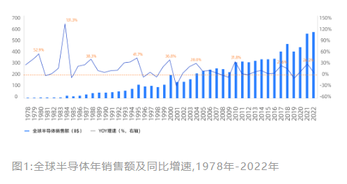
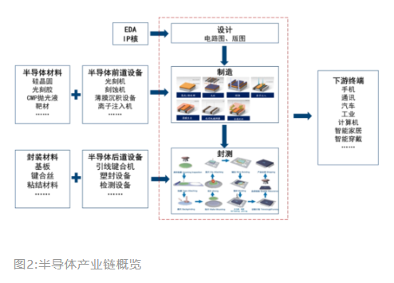
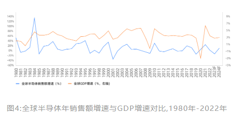
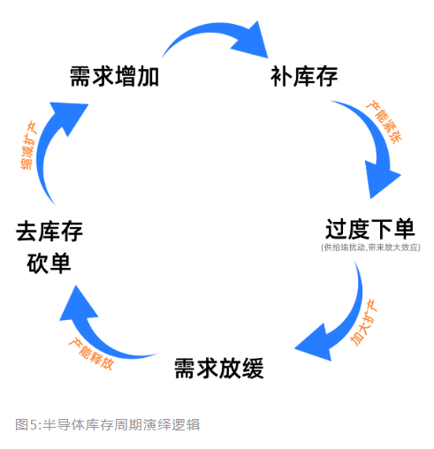
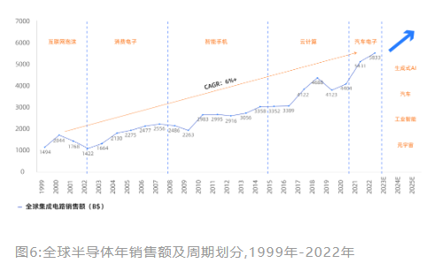
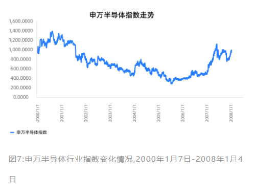
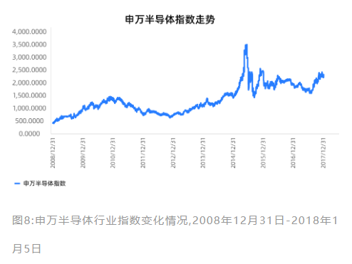
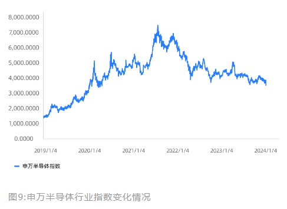
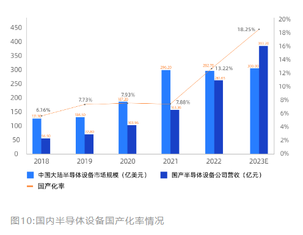

---  
title: 12|洞察半导体的周期成长，把握正确投资节奏  
index: true  
icon: file  
order: 13  
category:  
  - 短线  
  - 大A  
tag:  
  - 雪球  
---  
  
## 12|洞察半导体的周期成长，把握正确投资节奏  
  
现代社会离不开半导体，小到我们日常所用的手机、电脑、电视，大到国家发展所需要的航天飞船、航空母舰，几乎生活中的所有事物都有半导体的存在。  
  
人类文明发展以来，经历了多轮跃迁。  
  
从第一轮工业革命开始，人类文明进入蒸汽时代，以机器代替手工劳动；  
  
第二轮工业革命，人类文明进入电气时代，生产效率得到质的飞跃；  
  
而到了第三轮工业革命，人类文明进入了信息时代，而这关键的背后就是半导体技术的推动，可以说半导体芯片就如同石油一样，是现代世界赖以生存的稀缺资源。  
  
在过去二十年间，半导体行业仅是指数就曾上演过翻倍行情，半导体设备ETF(159516)所跟踪的中证半导体材料设备主题指数2019年全年上涨119.06%，更不用说曾诞生过多只十倍牛股。  
  
但如果使用不当，这把"矛"也可能重伤你的本金。半导体行业回撤起来又快又急，稍不留神便会折戟于此。  
  
所以，想要好好使用这个投资利器，挖掘到A股市场的财富密码，你就一定要吃透这个行业的本质。  
  
### 半导体，不只是成长  
  
许多人认为半导体行业只是一个成长型行业，其实不然，半导体是一个兼具成长和周期属性的行业。  
  
从1978年开始，全球半导体行业的市场规模逐年走高，目前全球市场销售额已突破5000亿美元，行业发展超四十年仍然具有较强成长属性。  
  
而从市场增速方面来看，过去几十年间波动性非常大，呈现出非常明显的周期属性。  
  
总的来说，**半导体行业是一个长期成长趋势向上，中短期存在周期变化的行业**。  
  
  
**半导体行业不仅有周期，还存在大周期嵌套小周期的现象，分为长、中、短周期三个维度**。  
  
长周期，又称创新周期，一般是8-10年左右的大周期，主要受行业自身及下游应用的创新驱动依赖于终端新技术、新代际应用的升级带动；  
  
中周期，指产能周期，表现为供给侧扩产节奏波动，以全球半导体行业的资本开支增速来看，每3-5 年会出现一次集中扩产。由于半导体产线从建设到量产需要1.5-2年左右，产能释放与下游需求波动通常存在错配；  
  
短周期，即库存周期，长度大约在2-3年，由产业供需关系变化和自主调节决定，包括主动补库存、被动补库存、主动去库存、被动去库存四个阶段。  
  
### 半导体的周期从何而来?  
  
**首先，半导体具有非常庞大的产业链，各个环节间传导难以同频**。  
  
从生产环节来看，半导体行业主要分为设计、制造、封测三个环节，看起来好像很简单，实则由于行业高精尖技术的特性，每一个环节中所需要的材料、设备、工艺都异常复杂，延伸出非常多的细分子行业，而每个子行业由于生产难度、资本投入不同，导致生产周期很难同步，也就造成了供需时常错位的局面。  
  
  
**其次，半导体行业是一个全球化协作产业**。  
  
目前来说，没有一个国家、一个公司可以把半导体产业链(包含半导体材料、设备)全部打包带走。由于每个环节都具有高度的技术壁垒，全部攻破的难度无异于登天。  
  
所以，如果想要制造一枚芯片，很可能是先找美国的英伟达进行设计，再找中国台湾的台积电进行制造，最后再找美国的安靠科技进行封装和测试。这就会导致由于协同性低、公司能力差异化、运输效率等问题而引起的周期错位。  
  
**最后就是技术变迁**。  
  
这个很好理解，就是随着科技的进步，半导体技术水平不断升级迭代，而每一轮迭代就会产生新的应用，衍生出新的产物。  
  
比如，从2000年初笔记本电脑、互联网技术出现，到2010年智能手机、移动互联网的发展，再到现如今智能汽车、5G网络的爆发，背后都是轮轮技术迭代在驱动，新的产物就会诞生新的市场，从而创造出新的需求，从而产生新的周期。  
  
那么，半导体周期背后的运转逻辑是怎样的呢?  
  
**创新周期来源于技术**。这里我们便需要了解一个半导体技术发展所遵循的定律--摩尔定律。  
  
摩尔定律由英特尔创始人之一戈登·摩尔在1965年提出，是指半导体芯片上可以容纳的晶体管数目，约每隔18到24个月便会增加一倍。  
  
半导体的技术水平主要体现在制程工艺上，技术发展的目标都是致力于缩短制程。  
  
我们可以简单理解，制程越短，意味着一颗芯片可以集成晶体管的数量就越多，可以支撑的算力就越大，就能制造出更先进、体积更小的产物，这就是为什么我们日常所用的手机、笔记本电脑、电子手表，体积相比二十年前有了非常大的缩减，而精细程度和功能上却有质的飞跃。  
  
1971年的英特尔微处理器4004采用10um(1um微米=1000nm纳米)工艺，集成2300个晶体管。  
  
而到了2022年，AMD锐龙7000处理器采用了台积电的5nm工艺，集成了66亿个晶体管，技术水平经过多轮发展，已经发生了翻天覆地的改变。  
  
技术的多轮迭代便催生新的产物，形成了从互联网、笔记本电脑到智能手机、平板电脑，再到未来的AIGC(人工智能)、无人汽车等多轮市场大周期。  
  
  
**产能周期关联经济发展**。拉长时间来看，全球半导体市场增速与全球实际GDP增速具有高度相关性。  
  
  
经济周期对于半导体行业的影响可以划分为四个阶段。  
  
经济上行时，终端设备和整机需求回暖，半导体产品价格上涨，行业增速则上行;  
  
经济过热时，由于市场需求提升，各大半导体厂商加大资本开支，大幅度扩张产能，开始出现供给过剩的局面，行业增速出现疲缓态势；  
  
经济下行时，市场需求开始退化，但是扩张的产能由于惯性仍在继续，开始引发产品价格下降，行业增速下行；  
  
经济衰退时，市场需求疲软，产能进入出清阶段，半导体厂商开始缩减开支，供给回落，增速见底。  
  
**库存周期受制于扰动**。如前文所说，晶圆扩产般需要 1-2 年才能释放产能，因此在需求增加时无法即时进行响应，同时由于晶圆产能相对刚性，在需求减少时也无法进行收缩，因此半导体行业会由于供需失衡而呈现出周期性。  
  
不仅产能周期长，半导体行业供需关系还会存在过度扰动的情况。  
  
比如在市场需求爆发阶段，下游终端客户会进行补库存，但为了能够更快抢占市场份额，往往出现过度下单的情况。  
  
而中上游半导体厂商顺应下游客户需求进行投产，等到1-2年开始出货时，下游客户由于市场需求放缓，会进行一定程度的砍单，这就导致了库存出现了较大的弹性，这期间若出现比较大的不确定因素(比如疫情)，就会进一步加大周期波动。  
  
  
### 半导体历史周期如何演绎?  
  
2000年以来，半导体行业共经历了完整的两轮大周期，目前正处于第三轮周期中，让我们来看看过去的半导体周期是如何演绎的。  
  
  
#### PC互联网时代(2000年-2008年)  
  
2000年初期，宽带以太网出现，PC互联网迎来井喷，呈现从0到1的爆发式增长，移动通信等新产品推广逐渐成为需求推动重要因素。  
  
到2005年，计算领域的半导体收入份额占总份额比例高达 42.19%。这个阶段下，半导体价格波动加剧，出货量和销售额稳定增长，期间销量从2954亿颗增长至6463亿颗，年复合增长率为9.28%。  
  
不过，由于2000年初期国内半导体技术还处于萌芽期，国产自主化率非常低下，主要产品和设备都需要从国外进口，国内半导体厂商并未从这轮技术浪潮中分到一杯羹，也导致了二级市场中的股价表现不尽人意，中万半导体行业指数整体下行。  
  
  
#### 智能手机时代(2008年-2018年)  
  
2008年开始，2G/3G移动互联网开始起步，苹果公司推出跨世纪产品--iphone4，正式开启了长达十年的半导体大周期。  
  
在智能手机时代下，人们的娱乐及生活方式发生根本性改变，过去依靠电脑才能进行的工作、游戏，如今依靠手机即可完成，极大推动了移动互联网软件厂商开发迭代，催生了相应开发设计硬件的算力提升需求。  
  
同时，相关衍生产品比如平板电脑、VR设备开始普及，诞生出新的细分市场，形成了全产业链共振的高景气周期。  
  
这个阶段下，依靠着中国4G发展及供应链红利，孵化出华为、小米等世界一流的国产厂商，带动了二级市场估值爆发，申万半导体行业指数期间涨幅高达509.60%，复合年化增长率达22.24%。  
  
  
#### 人工智能时代(2019年-至今)  
  
随着智能手机普及率在2018年见顶，半导体第轮大周期走向尾声，第三轮大周期接棒。  
  
第三轮半导体周期主要由5G技术拉开序幕，中国作为全球 5G 建设的领军企业，5G 基站的建设速度全面领先，受益于5G铺开，5G下游包括医疗、汽车、工业、消费电子多个领域的新兴应用快速成长，半导体产业的发展空间进一步打开。  
  
与此同时，AIOT(智慧物联网)开始得到普及下游场景包括智慧城市、智能家居、智能汽车等市场需求大爆发，2020年，全球物联网连接数首次超过非物联网(智能手机、 PC)连接数。  
  
不仅如此，2019年开始，国内半导体技术水平迎来质的飞跃，国产半导体厂商数量以及生产自主化率开始扶摇直上，国内半导体行业真正的进入了实质性的发展。  
  
所以，从二级市场的变化上，也开始从过去估值主导的行情向盈利主导转变，申万半导体行业指数也从2019年低点的1316点仅用不到3年时间涨至2021年7月高点7642点，期间涨幅高达480.69%，年化高达87.39%，进入了发展快车道。  
  
  
从现在看向未来，半导体行业未来的核心增长点将会集中于AIGC(人工智能)。  
  
2022年智能对话机器人模型 ChatGPT上线，并在 2 个月内实现月活用户突破1亿，成为史上增速最快的消费级应用和AIGC浪潮的代表。  
  
AIGC发展带来的是巨大的算力需求，通常来讲，构建A|大模型需要数亿到数万亿的参数，而且参数水平随着训练计算水平提高呈现指数级增长，据测算，目前最先进的AI模型所用训练计算量每三四个月翻一番，即每年增长十倍，这就意味着从硬件方面要有足够多、足够高性能的服务器来支撑其计算，市场体量将会迎来井喷式增长。  
  
IDC预测，到2026年包括软件、硬件和服务在内的Al市场规模将超9000亿美元，2022-2026年复合增长率为18.6%，远超半导体行业过去整体增速。  
  
通过回顾历史，相信你知道了，半导体每轮市场行情总是由创新技术所开启，而后又因为产能周期、库存周期变化而发生剧烈波动，最后又因为渗透率见顶、市场需求增长疲缓而终结。  
  
从投资的角度讲，A股市场中的半导体虽然总是有行情，但实际上却很难把握其中的投资机会。  
  
半导体、军工、券商这三个行业，在A股有一个共同的绰号:渣男。而半导体，更是其中的“渣男之首”。  
  
在市场中的关注度极高，但投资体验却很差，暴涨暴跌是家常便饭。涨起来，动不动就刷新历史新高，跌的时候，又照样六亲不认。大起大落的市场表现，让人又爱又恨。  
  
那么对于“渣男"半导体，到底要怎么投才不会被错付?  
  
### 半导体应该怎么投?  
  
首先，需要对行业处于的周期位置，有较为清晰的认知。  
  
前面提到过，半导体周期可以拆解为三重周期的嵌套:即创新周期、产能周期及库存周期。前两者决定波动的大方向，而库存周期则是放大短期波动的推手。  
  
我们可以从这三方面来入手，来定位现在处于周期的什么位置。  
  
每轮半导体超级周期的爆发，离不开颠覆式创新的诞生。  
  
这种技术革新，往往伴随着“杀手“级别应用的诞生，并创造出大量的需求。例如Iphone4的横空出世，掀起的智能手机及移动互联网浪潮，带动半导体行业长达10年的超级周期。  
  
这种级别的投资机会，不同于普通的主题概念，定是普通人在现实生活中也有切身感受，其至是随处可见的。  
  
再比如去年的ChatGPT，一夜之间火遍全球，这种机会想忽视都很难。虽然AI下游应用场景还很模糊，但如果真的是新一轮的超级周期，那么现在依然处于早期阶段。  
  
此类超级周期的机会，只要通过观察身边就不会错过，识别较为容易。此外关注全球科技巨头的创新方向，也可以为我们提供指引。  
  
对于半导体行业来说，创新大周期10年一遇，更常见的周期，是由产能和库存变动引起的。  
  
如果说，创新周期是半导体成长性的表现，那么产能周期，就是半导体制造业属性的表现。产能周期代表着供给端的变化，当供给处于低位，而下游需求开始抬头的时候，是较好的配置时机。  
  
对于产能周期，我们可以通过晶圆制造产能、晶圆厂产能利用率、资本开支情况、半导体设备销售额、晶圆厂在手订单、产能爬坡速度等等指标进行跟踪，来定位产能周期的阶段。  
  
而库存，因为离下游需求端更近，更反映出需求端的变化。判断半导体周期位置的一个重要指标，就是芯片公司的库存。  
  
当库存上升时，是强烈的下行周期信号。反之，当库存下降时，就是需求回暖的证明。此外，还可以通过存货周转天数、库存水位、半导体销售额、芯片价格等等指标，来判断下游需求强弱、以及库存周期的具体位置。  
  
总之，我们可以通过对创新周期、产能周期、库存周期的分析，结合行业相关指标(如海外龙头的业绩指引等)，互相验证目前行业处于哪个阶段。  
  
半导体下游应用广泛，涉及通信、PC/计算机、消费电子、汽车、工业等等方向。近几年的半导体行情，也分别由5G、汽车电子、矿机、AI算力等下游终端市场的需求交替驱动。由于各个细分领域的最气度都不尽相同，导致半导体内部也存在明显的结构性分化。  
  
2021年开始，智能手机缺乏技术创新激发换机需求，消费者换机时间拉长，智能手机的出货量持续走低，对应消费电子板块也表现疲软。  
  
然而，与消费电子的低迷形成鲜明对比的是，车规级芯片和光伏相关的功率半导体却逆势上涨。受下游新能源市场的旺盛需求拉动，半导体相关细分领域涨幅惊人，大幅跑赢行业指数。  
  
2023年的AI行情更是如此，美股的英伟达、AMD等一众芯片公司，带领费城半导体指数叠创新高，而A股半导体指数并没有太好的表现，呈现出两极分化。  
  
所以在投资半导体时，不仅要关注行业整体的景气度情况，在内部结构性分化日益加剧的背景下，对细分领域的阿尔法收益挖掘也尤为重要。  
  
**对于国内半导体行业来说，国产替代也是不可忽视的长期成长逻辑**。  
  
2018年至今，美国对中国半导体产业的制裁力度层层加码，逐步将技术封锁往上游延伸，涉及到了EDA、半导体材料、设备等各个"卡脖子“环节。  
  
在这一背景下，半导体自主可控的重要性已经无需多言。无论是政策支持力度，或是下游对国内供应链的支持力度，均不断加强，产业链的国产化进程开始快速推进。  
  
国产半导体起步虽晚，但近几年的发展速度超越以往。以半导体设备为例，国产半导体设备公司营收从2018年的56.5亿美元，提升到2023年的383.2 亿美元，国产化率从6.16%提升至18.25%。2023年1-11月国内主要晶圆厂的生产线中，共计获得了875台设备的中标，国产半导体设备的中标比例达到47%。  
  
半导体设备的进入壁垒之所以高，不仅仅是技术水平的原因。更换供应商对于晶圆厂而言，背后需要面临的潜在风险是巨大的，譬如产线稳定性、良率的下降、原材料报废、订单丢失等等.....不到万不得已，是不可能考虑其他供应商的。  
  
对于国产半导体设备厂商而言，因为没有订单、没有来自客户的反馈，就没有能力继续投入研发，做产品性能的迭代，导致一步落后步步落后，形成死亡螺旋。而现在的情况已经今非昔比，原本连牌桌都上不去，国产替代让它们拿到了宝贵的入场券。  
  
  
国产替代浪潮自2019年开始，历经4年时间，让国产半导体产业实现了从0-1的突破，为中国半导体公司打开了市场。但也要意识到的是，目前中低端领域的国产化进程较快，但在高端领域仍需时间沉淀突破。  
  
例如半导体设备方面，国产化率较高的环节主要集中在28纳米级别的成熟制程，而14纳米及以下的先进工艺制程，依然与海外有不小的差距。  
  
半导体材料方面，在靶材、CMP抛光材料、电子气体、硅片等国产化程度已经较高，但在如光刻胶等技术壁垒较高的环节，核心技术仍未实现突破。  
  
时至今日，中低端的国产替代已经大体实现。国产替代从浅水区行至深水区，进入2.0时代，接下来到了真正啃硬骨头的阶段。而中国作为全球最大的半导体消费市场，随着国产化进程的不断推进，国内半导体公司成长空间仍然很大。  
  
落到投资上来，目前国产化率比较高的细分方向，后续将不可避免的和全球半导体周期同步。  
  
对于后续国产替代方向上的投资机会，可以重点关注替代率较低的环节，例如芯片设计的上游IP核和EDA，晶圆代工的上游设备和材料等等。  
  
此外，也可以观察国家大基金的重点扶持方向，来锁定投资机会。  
  
从大基金的扶持路径也能看出，一期主要以芯片制造和芯片设计为主，二期则更加聚售芯片制造、半导体材料和设备三个环节。  
  
从大基金的投资来看，在资金及资源助推下，被投半导体企业在投资期获得一定程度上的加速发展。  
  
本节课程中，我们详细梳理了半导体产业的发展进程和产业格局。  
  
半导体既是科技翘楚，又身陷周期轮回。其高成长性得益于技术创新，每一次技术突破都推动行业实现跨越式发展。  
  
然而，正如所有的制造业一样，半导体也无法完全摆脱周期的束缚。  
  
投资半导体既是一场对成长性的追逐，也是对周期洞察能力的考验。只有将这两者紧密结合，我们才能在波动中获得理想的投资回报。  
