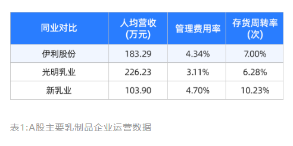

---  
title: 13|学会这8招,公司基本面分析不再难  
index: true  
icon: editor  
order: 14  
category:  
  - 短线  
  - 大A  
tag:  
  - 雪球  
---  
  
## 13|学会这8招,公司基本面分析不再难  
  
公司分析是投资的基本功，是每一个基本面投资者都应该掌握的，也是通过学习能够学会的。  
  
那么，如何做好公司分析呢?  
  
这节课，我们从行业市场、商业模式、竞争优势、增长策略、财务分析、管理文化、公司估值、投资风险这八个维度来探讨学习，帮助大家建立起公司基本面分析的体系。  
  
一家公司发展的好不好，与所处行业的发展趋势密切相关。所以做公司分析，我们首先从行业入手，了解公司所处的行业环境。  
  
### 看行业，赛道够不够好  
  
一般来说，从以下四个方面入手，就能比较全面的了解一个行业：  
  
#### 行业的市场空间  
  
行业的市场空间由市场需求和客单价共同决定。  
  
有些行业由于需求广泛，或客单价高，注定会成为超巨行业，比如房地产、汽车、互联网、医药等；  
  
反之，有些行业由于需求面窄、复购率低、单价低等因素，行业规模天生做不大，比如消费领域的一些细分类目，像酵母、榨菜等行业。  
  
从投资的角度来看，行业的市场规模并不直接决定投资价值，无论是大行业还是小行业，都可能出现投资机会。  
  
#### 行业增速  
  
通过行业增速，可以大致判断行业是增量市场还是存量市场。  
  
如果行业处于增量市场，在蛋糕做大的过程中，大部分公司都能有不错的增长，尤其是头部企业迅速扩张，投资机会就比较多；  
  
如果行业处于存量市场，竞争格局已经趋于稳定，那么寻找投资机会主要看头部企业，如果头部企业能凭借规模优势建立起竞争壁垒，持续提升市场份额，就可能是好的投资机会。  
  
#### 行业的产业链  
  
了解行业的产业链，主要关注这几个问题：  
  
产业链的上中下游包括哪些环节?  
整个产业链是怎么运转的?  
各个环节的价值是如何分配的?  
  
通过各个环节的毛利率，就能大致判断出整个产业链中的价值分布情况。  
  
比如2021年的光伏产业链，上游的硅料环节由于产能不足，处于紧平衡状态，毛利率最高，一度达到60%以上;  
  
而中游的光伏电池已经进入高速扩张期，行业毛利率不足10%，光伏组件的毛利率也比较低，主流企业基本在10%~15%区间;  
  
下游是应用环节，虽然光伏装机量持续提升、度电成本持续下降，但由于上游涨价，应用环节的毛利率有所下滑，电站企业毛利率在27%左右，很明显2021年的光伏产业链，上游硅料环节吃到了最大的蛋糕。  
  
#### 行业的竞争格局  
  
行业是完全垄断、寡头垄断还是充分竞争?市场集中度如何?市场的主要玩家有哪些?公司的行业地位如何?这些都是需要重点关注的内容。  
  
那怎么找这些行业信息呢?  
  
其实也不难，下载几篇行业研报读读，以上的四个方面基本都能了解到。下载研报的渠道也很多，免费的有萝卜投研等，付费的有Choice、慧博、万得等。  
  
一般来说，选行业比选公司更重要。在优秀的行业，即便以"打包买入"的策略买行业指数基金也能有不错的收益，而在糟糕的行业，即便是龙头，也可能出现这样那样的问题。  
  
了解完公司的行业背景，我们把镜头拉近，聚焦到公司本身。  
  
### 看商业模式，公司怎么赚钱  
  
首先要理清公司的商业模式，简单来说，公司是怎么赚钱的。  
  
如果能回答好以下三个问题，就基本理解了公司的商业模式。  
  
1、公司提供了什么产品或服务?  
  
2、公司是如何获取客户或服务客户的?客户粘性强吗?客户的生命周期有多长?客单价有多高?  
  
3、公司是怎么赚钱的?  
  
**如果一家公司的商业模式清晰可描述、产品和服务可感知、产品有复购率、且客户的生命周期比较长，就初步进入了我们的能力圈**，可以把它加入到股票池中，进一步分析。  
  
举个例子，泸州老窖。这家公司提供的主要产品是中高端白酒，包括国窖1573系列、精品特曲系列、窖龄酒系列等不同档次的产品。  
  
老窖主要通过经销的方式，先把产品卖给经销商，再由经销商通过流通渠道卖给消费者。  
  
喝酒的人是很难戒酒的，所以客户的生命周期很长;老窖具备较强的品牌效应，在消费者心智中建立起高端浓香酒的品牌定位，客户粘性很强；老窖的拳头产品国窖1573客单价很高，出厂价980元/瓶，公司的整体毛利率达到80%以上。  
  
泸州老窖的赚钱过程也很简单，就是把粮食生产成白酒，通过经销商卖出去赚钱。  
  
这样，泸州老窖的商业模式我们就很清楚了。  
  
接下来，我们继续深挖公司有哪些竞争优势。  
  
### 看竞争优势，比同行好在哪  
  
可以从以下几个方面来分析：  
  
1、公司采取差异化竞争还是同质化竞争?  
  
2、公司的获客能力怎么样?获客成本高吗?边际效应如何?  
  
3、公司是否具备规模优势，强者恒强?  
  
4、公司的运营效率与同行对比如何?运营效率在不断提升吗?有没有自我进化能力?  
  
一般来说，**采取差异化竞争策略、产品自带获客能力、边际效应明显、具有规模优势和自我进化能力的公司，值得我们好好研究**。  
  
举个例子，伊利股份。伊利的主要产品是乳制品，属于同质化产品。  
  
从消费者购买乳品的决策路径来看，影响购买行为的，主要有两点:第一，消费者听说过并信任这个品牌:第二，产品能最大范围触达客户。  
  
品牌方面，一提起牛奶，想必大多数同学脑海中浮现的都是伊利、蒙牛两大品牌，在乳品行业伊利已经占据了广大消费者的心智。尤其在婴幼儿奶粉品类，经历过2008年“毒奶粉“事件后，年轻父母在为宝宝选购奶粉时，几乎是非大品牌不选。而伊利对澳优的收购，进一步强化了品牌优势，更容易获得年轻父母的信任。  
  
渠道方面，伊利建立起行业内最大的分销网络在全国拥有2万多家经销商、上百万个多镇级销售网点，渠道渗透力远超同行。在实际生活中我们也能体会到，即便在乡村，也能很方便的买到伊利牛奶。  
  
高品牌知名度和深度分销网络，保证了伊利强大的获客能力。在常温白奶、常温酸奶、乳饮料、冷饮等多个类目，伊利长期保持市场份额第一。  
  
同时，伊利在供需两端都具备规模效应。  
  
供应端来看，伊利拥有近千家牧场，覆盖西北、内蒙、东北三大黄金奶源基地，不仅保障了优质奶源的稳定供给和食品安全，也形成了成本优势;  
  
需求端来看，公司年营收过千亿，大量的订单显著摊低了固定投入、营销、管理等支出的单位成本。  
  
再看运营效率，伊利的人效低于光明乳业，但远高于新乳业;  
  
费用管控水平略低于光明乳业;存货管理水平高于光明乳业，但低于新乳业。  
  
总体来看，伊利的运营效率不算突出，但考虑到远高于同行的规模体量，也算比较优秀了。  
  
  
综上，乳制品属于同质化产品，但伊利凭借品牌知名度和深度分销网络，建立起竞争壁垒，形成获客优势，并依规模效应形成成本优势，还保持着不错的运营效率，公司的竞争优势比较强。  
  
做投资，投的是增长预期，所以还要看公司是否具备增长潜力。  
  
### 看增长潜力，能否持续赚钱  
  
我们可以从下面这几点，分析公司的增长策略：  
  
1、公司的增长主要靠客户增长还是客单价提升?如果是客户增长，增长的驱动力是什么?如果是客单价的提升，产品有没有提价能力?  
  
2、公司是否在做多元化?是细分品类的多元化还是上下游整合，又或者是开拓全新领域?  
  
**如果一家公司有客户增长潜力、产品具备提价能力，又能通过”一鱼多吃“来进行多元化扩张，这样的公司就有很大的增长空间，值得我们研究**。  
  
我们以家电行业的两个老对手--格力和美的为例，对比分析一下。  
  
格力的主营产品是空调，空调行业早已进入成熟期，这几年房地产市场低迷又导致家电需求增长受阻，整个行业的销量很难有明显提升，虽然格力依靠品牌、技术优势获得一定的产品溢价，但也不可能持续提价。  
  
另外，格力在多元化道路上也并不顺畅，先后切入手机、芯片、新能源等领域，但并没有创造出第二增长曲线。  
  
而美的却走出了截然不同的多元化道路，与格力开拓全新领域不同，美的始终围绕家电来拓展细分品类。  
  
结果就是，美的在电饭煲、微波炉、电磁炉等几十个细分品类做到行业第一或前三名，业绩持续增长，市值超过格力的两倍。  
  
可见，采取不同的增长策略，深刻影响着公司的发展走向。  
  
接下来，我们从财务角度，来看公司的经营情况。  
  
### 看财务指标，翻翻公司账本  
  
财务报表是对公司过去一个阶段的经营总结。通过财务数据，可以验证公司业务的真实性。  
  
当然，**在不同的行业、不同的商业模式下，财务指标可能有不同的含义，需要结合公司的生意来解读财务指标**。  
  
做财务分析，通常看四个部分:三张报表，以及与公司业务相关的经营指标。  
  
首先是利润表。通过营收看业务的成长性，并挖掘成长背后的驱动力;通过成本、费用来分析公司的运营效率，同时，从公司的费用结构，也能很好的理解公司的商业模式;通过利润率来分析公司的盈利能力，如果利润率有大的波动，要结合公司实际业务找出原因，并判断这对公司是利还是弊。  
  
然后看资产负债表，主要看公司的资产结构是否健康、负债程度高低、偿付能力如何、资本支出多少。如果一家公司能够轻资产运营，不需要大量资本再投入，那么经营得到的利润就会积累成账上的现金，或者通过分红、回购来回报股东  
这种公司就很有研究价值。  
  
再看现金流量表，通过现金流来验证盈利的真实性。  
  
除了三张报表以外，公司还会披露和自身业务有关的运营指标。比如互联网公司，通常会披露日活用户、月活用户、付费用户等:再比如汽车企业，通常会披露产量、销量、产能等。这些运营指标，可以和财务数据结合在一起看。  
  
需要注意的是，孤立地进行财务分析效果并不好，把财务分析贯穿到各个环节，在理解公司业务的基础上进行财务分析，才能起到好的效果。  
  
接下来，我们再看一项软指标--公司的管理文化。  
  
### 看管理文化，创业氛围如何  
  
管理文化属于软指标，没有特定的标准。但如果长期关注就会发现，不同的公司，管理文化存在很大的差别。  
  
关注管理文化，可以从以下几个方面去看：  
  
1、股东结构是否合理，大股东与公众股东的利益是否一致?  
  
如果大股东持股比例高，更倾向于提高分红比例，客观上与公众股东的利益就是一致的;反之，如果大股东持股比例低，把钱留在公司账上更便于其对资金的掌控，就可能压低分红比例与公众股东的利益就不一致。  
  
当然，如果大股东持股比例过高，比如超过三分也要警惕公司治理不透明、大股东操控公司的风险。  
  
2、核心管理层是否持有公司股票?公司是否推出股权激励计划?  
  
如果核心管理层持有公司股票，或公司推出了股权激励计划，那么，管理团队的切身利益就与公司发展深度绑定在一起，这能极大的激发团队的工作积极性，利于公司长期发展。  
  
3、从公司的发展史去看创始人的秉性和企业文化，以及两者之间的关系。  
  
通过公司的发展史，就会对创始人的秉性、企业文化有一个感性认知。了解公司发展史和创始人的途径也很多，比如关注公司相关新闻、创始人访谈、走访公司等，有的公司还出过书，有的创始人出过个人传记，也是很好的资料。  
  
4、公司对产品、服务、客户体验是否有极致的追求?  
  
可以看看公司的核心产品或服务是否在持续进化。比如五粮液，它的拳头产品“普五“一直随着市场消费偏好而优化，现在已经到了第八代，与上一代相比，第八代五粮液降低了酒体的辣度更符合现代人的饮酒偏好，可见五粮液对产品和客户体验就有很高的追求。  
  
5、公司能否吸引足够优秀的人才，是否形成完善的人才培养机制?  
  
可以看一下公司“董监高”的履历，了解高管们的行业背景、团队的稳定性。如果高管团队中经常有人离职，那么公司的人才机制可能出了问题这样的公司还是远离为好。  
  
**公司的管理文化与其商业模式是相辅相成的。企业文化的形成，源于业务经营需要，反过来，企业文化也会强化公司的业务模式**。  
  
公司的管理文化没有绝对的好坏之分，但一定要与它的商业模式相匹配。  
  
以上就是我们对企业基本面的研究，分析到这终于到大家期待已久的公司估值了。  
  
### 算算估值，看公司值多少钱  
  
一谈到估值，很多人就想要一个万能公式，简单一算，就知道公司价值几何。  
  
公司估值，说简单也简单，说难也难。简单的意思是，当你理解了公司，计算估值就是简单的加减乘除，小学数学就能搞定;难就难在前提条件“理解公司”，这需要前面的每一个环节，都要把基本功做好。  
  
换句话说，**公司估值并不是孤立存在的，在理解公司的基础上，估值是水到渠成的事情**。  
  
常见的估值方法有很多，相对估值有市盈率(PE)估值、市净率(PB)估值、市销率(PS)估值，绝对估值有现金流折现估值、清算价值估值，高成长企业有PEG估值，等等。  
  
对于成熟期企业，我们主要用市盈率(PE)估值;对于高成长企业，可以用PEG估值。  
  
市盈率估值的核心公式很简单，就是市值=市盈率x净利润。基本原理也很好理解，在判断公司成长性的基础上，预估公司未来几年的净利润再根据自己对公司的理解和确定性，给出一个市盈率倍数，两者相乘，就得到了企业的合理价值。  
  
PEG估值就稍微复杂一点了。  
  
PEG=PE(公司市盈率):G(公司净利润未来几年的年化增速)  
  
举个例子，如果一家公司市盈率是30倍，预估未来三年的净利润年化增速是15%，那么，PEG=市盈率30 :净利润年化增速15 = 2。  
  
PEG是把市盈率和企业成长性结合起来的一个指标，弥补了只看市盈率对企业成长性估计不足的问题。但PEG 估值通常不够保守，一般只适用于基本面良好、持续盈利、稳定高成长的公司在实际操作中，保守起见，最好不要给PEG超过2的估值，当然具体给到多少，也要结合对公司的理解来定。  
  
研究了公司基本面，也计算了估值，是不是就可以买入股票了呢?  
  
还不行，我们还要看一下这家公司有没有重大的投资风险。  
  
### 看公司风险，避开投资的坑  
  
很多投资者进入股市时，首先想的是赚多少钱反而忽视了投资风险。  
  
其实，**准确识别风险，尽量少犯错，才是我们在股市中长期活下去的关键**。  
  
而识别投资风险，必须建立在对以上七个环节有充分认知的基础上。  
  
比如行业风险，行业发展是否遇到增长瓶颈，行业有没有陷入恶性竞争，未来会不会出现对行业有重大影响的政策风险，等等。  
  
商业模式风险，公司的商业模式有没有可能被全新的商业模式所颠覆?  
  
竞争风险，在与同行竞争中，公司是否处于下风，从而丢失市场份额?  
  
增长风险，公司业务增长是否遇到了瓶颈?公司是否会因为急于多元化而导致发展失控?  
  
财务风险，公司的财务是否健康，会不会爆雷等等。  
  
治理结构风险，公司的股权结构是否稳定，大股东有没有可能损害公众股东的利益，等等。  
  
估值风险，公司是否估值过高?有的公司表面上看估值很低，会不会是潜藏风险的价值陷阱呢?  
  
当然，公司的业务模式不同，风险来源也大不一样。  
  
比如金融行业负债率普遍偏高，就要重点关注公司的债务是否有兑付风险;再比如互联网行业，用户量是公司发展的根基，如果活跃用户、付费用户不能持续增长，公司很可能面临价值重估，甚至遭遇戴维斯双杀。  
  
所以在识别风险时，也要结合公司的生意模式具体分析。  
  
好了，以上就是完整的公司分析框架，熟练运用，就能建立起公司基本面分析体系。后面的几节课，我们通过公司分析案例，再来体会。  
