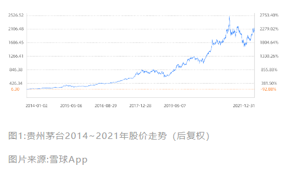
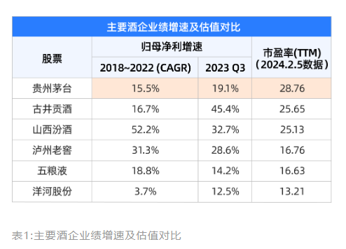
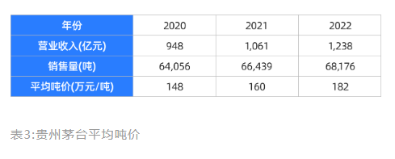
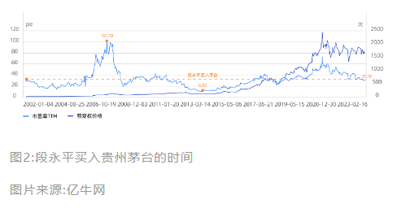

---  
title: 14|读懂茅台，你就读懂了投资的确定性  
index: true  
icon: file  
order: 15  
category:  
  - 短线  
  - 大A  
tag:  
  - 雪球  
---  
  
## 14|读懂茅台，你就读懂了投资的确定性  
  
贵州茅台作为A股“股王”，长期以来，受到众多机构和散户们的关注与追捧。茅台究竟有什么看点呢?通过分析茅台，我们又能获得哪些投资思考呢?  
  
接下来，我们解析一下。  
  
### 抱团茅台，大佬们到底看重了什么  
  
贵州茅台自2014年走出“行业寒冬“后，开启了一轮长达七年的轰轰烈烈的牛市行情，期间股价从654元一路上涨到19909元(后复权)，涨幅近30倍，年化收益超60%。  
  
  
在这个过程中，茅台成就了一批投资人，他们中有不少还成为中国股市上响当当的人物，比如李录、林园、但斌、冯柳等。  
  
自从2019年二季度，茅台超过中国平安，成为公募基金第一重仓股以来，中间虽然经历过宁德时代的短暂挑战，至今依然是公募基金的头号最爱。  
  
到今天，依然有不少大佬对茅台青睐有加。比如段永平，他曾表示唯一长期持有的A股股票，就是贵州茅台;再比如张坤，连续持有贵州茅台20个季度，并长期顶格配置;而景顺长城的刘彦春，已经持有贵州茅台27个季度，同样是顶格配置。  
  
但同时，我们还看到另一个事实：  
  
在头部酒企中，茅台的成长性并不突出。从2018~2022年的利润增速来看，茅台只跑赢了洋河股份;看2023年前三个季度，茅台也只是略高于五粮液和洋河股份，与古井贡酒、山西汾酒、泸州老窖相比，实在是逊色很多。但市场给到茅台的市盈率，却是力压一众头部酒企。  
  
  
那么，为什么各方大佬纷纷看好茅台?  
  
白酒行业已经连跌三年，为什么茅台仍受到公募基金的抱团热捧?  
  
成长性并不突出的茅台，又为什么能够享有高估值?  
  
他们投资茅台，看重的到底是什么呢?  
  
是确定性!  
  
**做权益类投资，就是在不确定中追求确定性**。  
  
而贵州茅台，就是白酒行业，乃至整个A股市场，确定性最强的资产之一。可以说，**读懂茅台，你就读懂了投资的“确定性”**。  
  
### 是什么造就了茅台的确定性  
  
茅台酒的社交属性、金融属性，构筑起宽广的品牌护城河。在这个基础上，独特的商业模式，决定了茅台的生产经营基本上是个确定的明牌。  
  
#### 茅台的品牌护城河  
  
##### 茅台酒，是身份的象征  
  
相传在红军长征时期，茅台就和这个国家的领导人团队结下了"红色情谊”，长期以来，喝茅台的人，都是这个国家站在金字塔尖的那群人，由此，茅台酒成为身份的象征。  
  
时间来到1988年，白酒行业放开价格管制，茅台开始从公务系统走向社会，尤其是限制“三公消费"后，商务精英逐渐成为喝茅台的主力军。至此，茅台一直是精英阶层的专属。  
  
随着经济发展，老百姓也开始买得起茅台。而政商务精英作为整个社会的意见领袖，对消费偏好起到引领作用。茅台酒作为社交产品，逐渐深入到各种高端宴请、礼赠等场合。  
  
试想一下，如果你要招待重要客户，在经费充足的情况下，你会选择什么白酒呢?大概率会是茅台。因为茅台作为“最贵的白酒“或”最好的白酒”，已经在中国人心目中形成共识。喝茅台，既体现了你对客户的重视，也体现了你的经济实力。  
  
再想象一个场景，节日时你给领导送礼，去年送的茅台，今年你会降级送五粮液吗?应该不会，你至少会继续送茅台，或更贵的陈年茅台。但如果去年你送的是五粮液，今年可能会升级成茅台。  
  
在中国这个人情社会，有很多场合需要“撑场面”，而茅台无疑是“最有面子”的白酒。  
  
##### 茅台酒，是投资的硬通货  
  
从空间到时间，造就了茅台酒的稀缺性。  
  
根据茅台招股书，只有在茅台镇核心产区，才能生产出茅台酒，当地独特的地理环境、微生物种群、赤水河水等，共同造就了茅台酒的独特风味。而从生产工艺来看，一瓶茅台酒从生产到出厂，长达五年时间。  
  
另外，作为高端白酒，茅台存放的时间越长，口感越好，价值越高。  
  
由于稀缺性和越存越值钱的特点，茅台酒早已成为投资的硬通货，价格越炒越高，从官方指导价1499元一路飙升至3200元以上，这更使得茅台酒“一瓶难求”，进一步强化了品牌优势。  
  
#### 茅台的商业模式  
  
##### 需求端:茅台酒供不应求  
  
茅台的销售模式分为经销和直销两种。  
  
经销，就是公司先把酒卖给经销商，再由经销商通过流通渠道卖给消费者。  
  
“普茅”出厂价1169元/瓶，市场价最低也要2700元以上，经销商拿到货后，转手一卖，每瓶酒就能赚到上千元，暴利程度可见一斑，进货当然是多多益善。  
  
这样，酒厂就成了合作中的强势一方，不仅不担心酒卖不出去，还要严格控制出货节奏，经销商进货时必须“先款后货”，这就保证了酒厂全是实收现金，没有欠款，也就没有坏账风险。  
  
再说直销。茅台传统的直销渠道包括线下直营店、茅台大酒店等。直销茅台是按照1499元的官方指导价来卖的，但普通人通过直销渠道是很难买到的，这也体现了茅台的一瓶难求。  
  
2022年3月，“i茅台“作为线上直营渠道，一经上线，就成为一款现象级App，由于茅台的金融属性，消费者在i茅台上抢到一瓶酒，转手卖给黄牛，就能净赚几百元，i茅台“打新“成为一时风潮。  
  
市场价与出厂价之间巨大的价差空间，决定了茅台酒根本不愁卖，制约公司成长的，不是销量，而是产量。  
  
那么，供应端是什么情况呢?  
  
##### 供应端:基酒产量是明牌  
  
茅台酒采用独特的“12987"酿造工艺，生产一轮茅台基酒需要一年时间，要经过2次投料、9次蒸煮、8次发酵和7次取酒。取出的基酒按照酱香、醇甜和窖底，归类装坛后储存三年。然后，再把三种基酒按一定比例混合，加上一些老酒和调味酒，进行勾调。勾调好后，还要再储存半年到年，才能对外销售。  
  
也就是说，一瓶茅台酒从生产到销售，大概需要5年时间，现在卖的酒是四年前生产的基酒。而茅台每年都会公布基酒产量，这样，酒厂每年能够拿出多少酒来卖，基本上是已知的。  
  
茅台酒每年的产量是大致确定的，出厂价格也是公开的，强大的品牌力保障了酒厂有多少成品酒库存，市场会照单全收，这就决定了茅台的生产经营是一个明牌。  
  
#### 茅台的成长确定性  
  
**投资，投的是对未来的预期**。  
  
那么，茅台未来几年还会增长吗?  
  
会，而且增长的确定性很高!  
  
茅台的增长，来自两个方面:一是产品提价，二是产量提升。  
  
**先说提价**。  
  
强大的品牌拉力赋予茅台超级提价权，自2001年以来，茅台酒总共提价10次，出厂价从218元提高到1169元。  
  
  
但是自2012年9月以来，提价周期明显拉长，尤其是最后一次提价，相隔近6年。可见长期以来“腐败酒”的名号，让茅台管理层在提价方面变得越来越谨慎，正如丁雄军在股东大会上所说:什么时候提价，怎么提价，确实要有智慧。  
  
虽然直接提高出厂价越来越谨慎，但实际上，茅台提价的脚步从来没有停过，平均吨价从2020年的148万元/吨提到了2022年的182万元/吨。  
  
  
怎么做到的呢?  
  
一是提高直销比例。茅台的直销价格是1499元/瓶，高于给到经销商的出厂价，通过提高直销比例，间接起到提价效果。  
  
二是优化产品结构。提高了单价更高的年份茅台、珍品茅台、生肖茅台的销量，从而拉高了平均出厂价。  
  
可见，近几年茅台提价于无形，确实体现出了管理层的智慧。  
  
展望未来，茅台酒作为“身份的象征”，适当提价本身也是维持其高端定位的有效手段，所以，茅台继续提价基本是确定的，再考虑到进一步提高直销比例和优化产品结构，平均吨价大概率会继续往上走。  
  
**再说产量提升**。  
  
2019~2023年，茅台酒的基酒产量每年都在增长，从4.99万吨增长到5.72万吨，这就决定了四年后的2023~2027年，茅台可用于销售的成品酒每年都会增加。  
  
另外，根据茅台年报，公司还有一个扩产工程：茅台酒"十四五"技改项目，这个项目建成投产后，将会新增1.98万吨茅台酒产能，销售量将会再上一个大台阶。  
  
展望未来，在量价齐升的双轮驱动下，茅台的成长同样具备很强的可预测性。  
  
### 茅台可以“闭眼买入”吗  
  
既然茅台这么优秀，是不是“闭眼买入”、“无脑持有"就可以安心赚钱了呢?  
  
当然不是。再优质的资产，也要考虑有没有投资风险，价格贵不贵。  
  
我们看下茅台的投资风险：  
  
在白酒行业，茅台的品牌力无出其右，来自同行竞争的风险不大;由于“先款后货”的销售模式，现金流充足，财务风险目前看起来也不大。  
  
茅台的投资风险，主要来自两个方面：  
  
1、稳定的价格体系是高端酒品牌的生命线。  
  
飞天茅台具有金融属性，卖出的白酒，有多少被真实喝掉了，又有多少被囤积起来用于炒作了?如果经济环境不好，囤积的库存会不会被恐慌性抛售?如果出现抛售，将会导致价格崩盘，严重损害茅台的品牌价值。这是笼量在茅台投资者头上的一片阴霾。  
  
当然，茅台管理层也意识到了这个问题，自2019年就开始重点推广直营战略，并砍掉了一批违规的经销商，目的就是获得市场价的控制权，避免茅台酒的价格被炒作过高，影响开瓶率，从而促进价盘稳定，品牌长期繁荣。  
  
2、年轻人喝白酒的越来越少。这个问题在业内争论已久，乐观者认为年轻人不喝白酒是因为年龄小、消费水平达不到，步入中年后自然会喝白酒。  
  
而茅台近两年跨界推出茅台冰淇淋、酱香拿铁、酒心巧克力等尝试，无疑是在努力拉近与年轻人的距离，这也从侧面反映了，“年轻人抛弃白酒”的担忧并非杞人忧天，而是酒厂和投资者必须认真审视的风险。  
  
评估完茅台的投资风险，接下来就是“什么时候买"的问题了。  
  
我们不妨看下，投资大佬段永平对于茅台的买入是怎样理解的。  
  
段永平买入茅台，是在2012年11月日酒行业出现“塑化剂危机”之后。当时，酒鬼酒被曝出塑化剂超标，甚至市场上传出“自酒基本都含有塑化剂，高档白酒含量较高“的消息，再加上中央严控“三公消费”，整个白酒行业一时风声鹤唳。在一年多的时间里，茅台股价腰斩有余。  
  
段永平当时还把茅台酒拿到美国相关机构检验得到的结论是:茅台塑化剂含量危害很小，远小于酒精本身对人体的伤害。  
  
于是，段永平开始大笔买入茅台。  
  
  
此后，他对于茅台有过这样的表述：  
  
“虽然我们100出头就买了不少茅台，但我们1500~1800也还买了茅台，10年后看，这个价格应该是低价的。  
长期看，在人民币不能流通的前提下，茅台这种商业模式，我愿意给20倍的PE。  
我觉得茅台的生意模式很难得，价钱合适就可以买，未必要等到很便宜。”  
  
从段永平买入贵州茅台的时点，以及公开发表的观点来看，投资贵州茅台可以归为两种方式:  
  
1、如果长期看好茅台的商业模式，把贵州茅台作为“非卖品"持有的话，在估值不高时，就可以买入，比如段永平说的20PE。或者，考虑到资本市场对于"确定性"会给予一定的估值溢价，对于茅台这样的商业模式，从PE历史分位值来看，30PE以内都不算高估。  
  
2、如果想在好价格买入，获得更大的投资回报，那就要等待像2013年“塑化剂危机“、2018年“股灾“这样的时机了。  
  
两种方式各有利弊。第一种买入后，可能会面临较大的价格波动，需要较强的心理承受能力;而第二种则需要长期等待，只买低价，也有可能买不到。  
  
我们可以根据自己对于股价波动的承受能力、预期收益等，来决定买入时点。  
  
以上就是我们对于贵州茅台的分析。  
  
读懂茅台，你就体会到了优秀的商业模式是什么样的，对公司的确定性要如何把握。  
  
可以说，**茅台的商业模式，就是一把“确定性”的标尺**，以后再研究其他公司，理解到什么程度用茅台来”量一量”，心中自然就有数了。  
