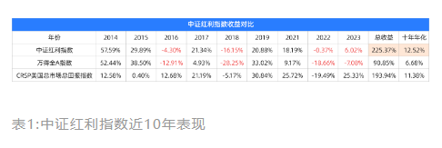
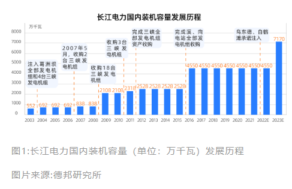
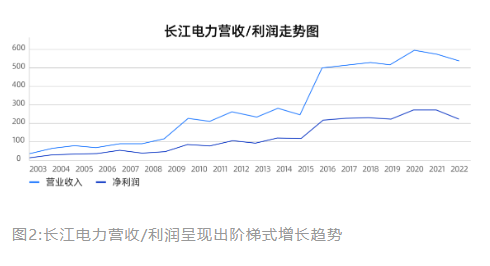
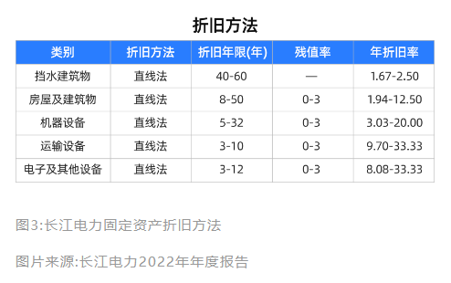
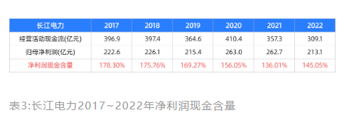
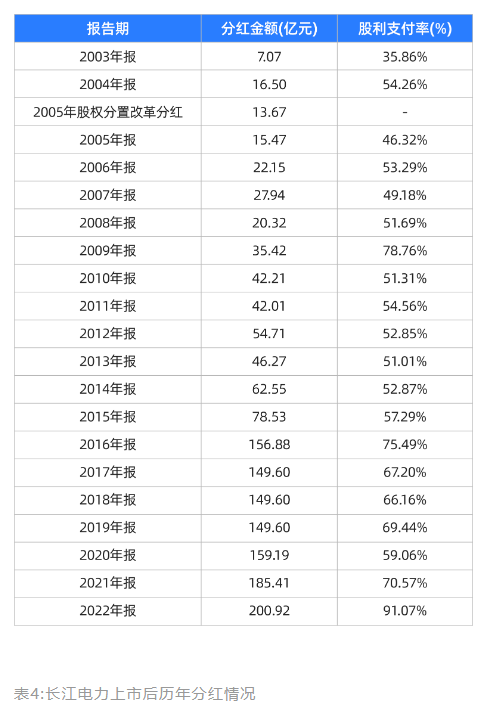
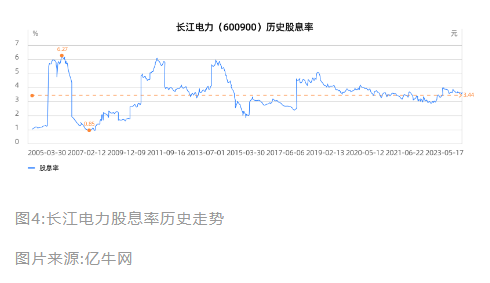

---  
title: 15|拆解长江电力，玩转高股息投资策略  
index: true  
icon: editor  
order: 16  
category:  
  - 短线  
  - 大A  
tag:  
  - 雪球  
---  
  
## 15|拆解长江电力，玩转高股息投资策略  
  
股市中，有很多种投资风格，有的人喜欢追寻成长股，在高波动中博取高收益，有的人擅长把握周期脉搏，跟随周期股的波动来赚钱，而有的人厌倦了股价大涨大跌带来的焦虑与不安，渴望一种安稳的赚钱方法，高股息策略就成了一个很好的选择。  
  
高股息策略，顾名思义，就是以股息率作为核心选股标准，选择业务经营稳定、现金流良好、长期高分红的股票，进行投资的策略。  
  
这种策略更接近投资的本质，即获取稳定的现金流。长期持有高股息公司，通过分红，投资者能够切实分享到企业的经营成果。  
  
### 高股息策略能否穿越牛熊  
  
高股息策略的长期收益如何呢?  
  
我们以高股息策略的代表--中证红利指数为例，看一下收益情况。  
  
  
在2014~2023年的十年间，中证红利指数(考虑了股息再投)取得了12.52%的年化收益，远高于同期万得全A指数6.68%的年化收益，甚至跑赢了同期美股全市场指数11.38%的水平。  
  
很多人羡慕美股的长牛行情。其实，即便在美股过去十年长牛面前，中证红利指数依然不落下风!  
  
而且，在A股市场下跌的年份中，中证红利的跌幅全部小于万得全A，尤其是2022年，中证红利领先了18个百分点。  
  
**高股息策略不仅能赚钱，还能让你安心、省力的赚钱，既可以实现资产增值，还可以用于养老收息**。  
  
很多人认为，高股息策略只适用于熊市的“阶段性防御”。  
  
事实并非如此。  
  
根据相关统计，高股息策略不仅在熊市跑出了超额收益，在其他阶段依然有良好的表现。在高股息策略占优的时间段中，既有2006-2007年的全面牛市，也有2008年、2022年上半年的阶段性调整，还包括2015-2018年的“熊-牛-熊”周期切换。  
  
**高股息策略完全可以穿越牛熊，如果你的投资风格偏稳健，在整个投资生涯中，掌握好这一种策略就够用了**!  
  
### 如何挖掘高股息公司  
  
如果一家公司要做到长期高分红，需要哪些条件呢?  
  
**第一，公司要有分红能力;第二，公司要有分红意愿**。  
  
我们以长江电力作为案例，来分析一下，这家公司的高分红未来还能持续吗?  
  
#### 看公司的分红能力  
  
怎么看公司的分红能力呢?第一，公司的盈利能力要强;第二，公司要能长久稳定地盈利;第三，公司要有充足的现金流，为分红提供保障。  
  
长江电力具备长久稳定的分红能力吗?我们来看一下。  
  
##### 商业模式:利润率高  
  
长江电力的商业模式比较简单，主要业务是水力发电，也就是通过水轮机将水的重力势能转化为电能，再通过电网系统卖给下游客户。  
  
长江电力拥有长江流域的六座大型水电站，掌控着全国17%的水电装机容量。在我国，水电资源属于稀缺资源，具备经济效益的水电资源基本已经开发殆尽，公司得天独厚的资源优势，构成强大的进入壁垒。  
  
另外，水资源作为公司发电的“原材料”，属于“大自然的馈赠”，与其他行业不同，长江电力不会受到传统意义上的上游供应商的制约。  
  
水电企业的下游客户非常集中，基本就是国家电网、南方电网两家。由于我国电力行业受到严格监管，电价的市场化程度很低，所以下游客户虽然很集中，但并没有形成很强的议价权，也正因为此，长江电力的盈利能力一直很强，净利润率长期保持在40%以上。  
  
##### 需求端:销路有保障  
  
从需求端来看，只要经济增长，全社会用电量就会随之增长。从历史数据来看，2011~2022年，我国的社会用电量年化增速为5.7%，略低于GDP增速。未来，随着我国进入“高质量“发展阶段，全社会用电量增速可能会放缓，但长期增长趋势仍然是确定的。  
  
清洁能源的占比提升也是大势所趋。根据国家发改委等部门发布的《“十四五"可再生能源发展规划》，到2025年，非化石能源发电量占比将达到39%，较2021年初提高5.8个百分点，常规水电的装机容量有望达到3.8亿千瓦。  
  
另外，早在2017年，国家发改委、能源局就提出，要通过优先发电计划，重点保障大型水电等清洁能源的优先消纳。也就是说，在政策背书下，水电基本可以做到发多少用多少，不用担心卖不出去的问题。  
  
社会用电量增长、清洁能源占比提升、优先发电计划共同为水电需求保驾护航，保障了需求端的稳定性。  
  
#### 供应端:发电量可预期  
  
长江电力的装机规模，随着公司对大型水电项目的并购，呈现出阶梯式增长的特点。  
  
  
自上市以来，公司主要进行了三轮大的扩张，分别是2003~2009年，通过多起并购，将三峡水电站的26台发电机组并入上市公司，装机容量从2003年的552万千瓦提升至2012年的2528万千瓦;2016年，完成溪洛渡、向家坝水电站的并购，装机容量增至4550万千瓦;2023年1月，随着乌东德、白鹤滩两大水电资产并入上市公司装机规模再上一个大台阶，来到7170万千瓦。  
  
至此，长江电力由原来的“四库联调“升级为”六库联调”，进一步提升了综合调度能力，预计每年可增发60~70亿度电。  
  
如果不考虑资产并购带来的装机容量阶梯式增长，在一个扩张周期内，公司的发电量则比较稳定，只受长江来水量的轻微影响。比如2016~2021年，公司的发电量基本在2100亿度上下浮动，2022年下降至1855亿度，同比降幅11%，就是由于当年长江来水量严重偏枯导致的。  
  
  
总体来看，公司的发电量具备较强的可预测性。  
  
##### 价格端:上网电价基本固定  
  
水电行业的定价模式分为计划电、市场电两种，目前仍以计划电为主，长江电力的计划电占比在90%以上。整体来看，公司的上网电价基本可以看作是固定的。  
  
实际上，从公司业绩的历史走势来看，长江电力的收入、利润正是随着大规模并购而阶梯式增长的，利润率长期高达40%以上。公司不仅能赚钱，还能长久稳定地赚钱。  
  
  
##### 现金流充足，为分红提供保障  
  
长江电力作为大型水电公司，拥有数额庞大的固定资产，主要是水电站的大坝、各种建筑、发电设备等。  
  
根据经验，水电站相关资产的使用寿命一般都很长。比如美国的大古力水坝，自1942年竣工后至今运行时间已经超过80年；再比如葛洲坝水电站，首台发电机组自1981年投入使用后，至今超过40年，依然可以正常运行。  
  
长江电力对固定资产的折旧政策是非常严格的，大坝的折旧年限是40~60年，房屋建筑的折旧在50年以内，水电机组最长不超过32年。  
  
  
也就是说，水电站的折旧年限远低于实际使用寿命。折旧会减少账面利润，但不会真正造成现金损失，这就决定了公司的实际现金流是大于账面利润的。  
  
从数据上也可以得到验证：  
  
  
长期以来，公司的净利润现金含量远大于100%，现金流非常充足，这就为分红提供了保障。  
  
#### 看公司的分红意愿  
  
公司的分红意愿强不强，我们主要从三个方面来看:  
  
第一，看公司的历史分红情况。如果公司历史上已经连续多年高分红，那么，未来大概率还会延续高分红政策。  
  
第二，看大股东的持股比例。如果大股东持股比例较高，又没有减持动机，那么，大股东从上市公司获利的途径只有一种，那就是现金分红。如果公司账上又有大量闲置现金，高分红就是大概率事件。这样，小股东们也可以跟着“吃肉”。  
  
第三，看公司有没有分红承诺。如果公司对未来几年的分红方案给出了承诺，就更没有问题了。  
  
长江电力的分红意愿如何呢?我们看一下。  
  
长江电力自2003年上市以来，每年都坚持分红。分红金额从2003年的7亿增长到2022年的201亿，提升了近30倍，股利支付率也在逐步提升分红的持续性没有问题。  
  
  
长江电力的大股东是长江三峡集团，截至2023年三季报，三峡集团持股50.41%，这个股权比例是很高的，而且三峡集团是国资控股，基本不存在减持变现的动机，决策层有足够的分红意愿。  
  
另外，根据年报中的分红规划，2021~2025年，公司每年会拿出不低于净利润的70%进行现金分红。  
  
综合来看，长江电力有长期高分红的历史记录，大股东需要通过分红获取现金流，且已经作出了分红承诺，分红意愿足够强，未来高分红政策大概率会得以延续。  
  
### 玩转高股息投资策略  
  
通过以上分析，长江电力是一家经营稳定、长期高分红的“现金奶牛”，即便不考虑股价增值，也能给股东带来源源不断的分红回报。这样的公司，可以“无脑买入“吗?  
  
当然是不行的，再优秀的公司，也要讲究交易策略。  
  
#### 高股息个股交易策略  
  
投资高股息公司，行情好时，可以卖出赚股价上涨的钱;行情不好时，可以持股收息，赚分红的钱;还可以股息再投入，买到更多的股数，实现复利效应。  
  
所以，我们只需要从分红的角度，以股息率为标准制定交易策略，就可以了。  
  
因为股息率=每股分红:股价，当股息率高时，股价往往处于阶段低位，此时可以买入;而当股息率低时，股价已经涨上去了，就可以考虑卖出。这样，按照股息率进行交易，天然做到了“低买高卖”。  
  
那么，股息率多高时适合买入，多低时又适合卖出呢?  
  
从长江电力的股息率历史走势来看，公司的股息率经历了几轮大的波动，在2019年之后，基本稳定在3%~4%区间。  
  
  
实际上，对于A股上市公司，股息率大于3%，分红水平就算比较高了，如果股息率能达到4%以上，就是非常高的水平了。  
  
落实到交易层面，就可以在股息率大于4%时买入，在股息率小于3%时卖出。  
  
我们以长江电力作为案例，按照这个交易策略做个数据回测，看一下收益情况。  
  
2014~2023年的十年中，如果2014年1月在股息率为5.5%时，以6元/股的价格买入10000股长江电力，投入6万元，此后每当股息率小于3%时卖出所有持股，每当股息率大于4%时，将上次卖出收回的现金全部买入。截至2023年1月份，持股市值约为17万元，期间收到现金分红2.7万元，年化收益率为12.6%。这还没考虑分红再投入的复利效应，如果把分红再投入，收益率会更高。  
  
当然，每个人的收益预期不同，可以根据自己的预期与股息率的大小关系，制定符合自己预期的买卖标准。  
  
到这里，有的朋友还会有疑问:如果按照股息率的标准，单只个股迟迟达不到买点怎么办?而且单独持有一家公司，风险也比较大，有没有更稳健的投资方法呢?  
  
当然有!我们可以选取几只高股息公司，进行组合投资。  
  
#### 高股息组合投资策略  
  
常见的高股息资产，集中在水电、煤炭、钢铁、银行、交通运输等行业。有的行业周期性较弱，比如水电、交通运输，而有的行业则有明显的期属性，比如煤炭、钢铁、银行等。  
  
可以根据股息率先选出一批高息股，建立股票池，再根据行业进行分类，从不同行业选出几只高息股，分散持有，进行组合投资。这样不仅避免了单只个股达不到买点，长期持币等待的问题，也可以起到分散行业风险、平抑周期波动的效果。  
  
以上就是本节课的主要内容。  
  
通过长江电力的案例，我们理解了水电股作为高股息资产，具有业绩稳、分红高的特点，虽然没有成长股的爆发力，但通过长期持有拿分红，也能取得不错的投资回报。  
  
高股息策略不一定是收益最高的策略，但风格稳健，回撤较小，而且按照股息率这一单因子制定交易策略，不需要每天盯盘，操作简便，省时省力，对于收益预期不高、追求高胜率、也不准备在股市中投入过多时间的投资者，是比较合适的。  
  
尤其在市场行情不好时，比如自2021年以来的震荡下跌行情中，很多高息股不但没有随市场震荡下行，反而作为“避险资产"，走出稳步向上的趋势，让一批高股息投资者获利颇丰。  
